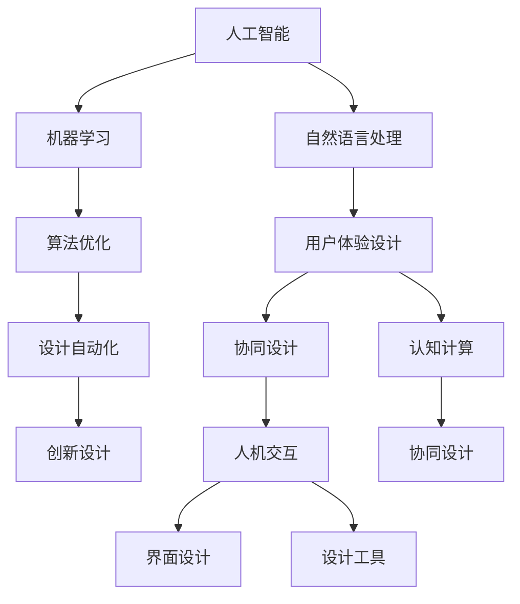

                 

# 体验设计的未来：AI与人类创意的协作

> 关键词：用户体验设计,人工智能,协同创意,人机交互,界面设计,设计工具,机器学习,算法优化,创新设计,设计自动化,认知计算

## 1. 背景介绍

### 1.1 问题由来
随着数字化时代的来临，用户体验设计(UX Design)成为了产品开发中不可或缺的一环。然而，设计过程往往耗时耗力，设计人员需要大量的时间进行创意发散、原型迭代和用户测试，才能最终产出符合用户期望的产品。而人工智能(AI)技术的飞速发展，为解决这一问题提供了新的视角和工具。

人工智能，特别是机器学习(ML)和自然语言处理(NLP)的进步，使得AI能够辅助设计师进行创意构思、交互设计、自动化生成等任务，从而大大提升了设计的效率和质量。同时，AI的深度学习算法和大数据处理能力，为创意设计的流程化、个性化提供了新的可能性。

### 1.2 问题核心关键点
- **用户体验设计的挑战**：设计师面临的设计任务繁杂多样，创意构思和原型迭代需要大量时间。
- **AI的潜力**：AI可以通过数据分析、模式识别和自动化生成，辅助设计师进行创意构思和原型设计。
- **协同设计**：AI与设计师的协同合作，可以产生更加创新和高效的设计结果。
- **个性化设计**：AI可以根据用户数据和行为，生成符合用户偏好的个性化设计方案。
- **设计自动化**：AI可以自动化执行设计过程，加速设计迭代和用户测试。

这些核心点构成了本文讨论的重点，通过探讨AI与人类创意设计的协作，为提升用户体验设计的效率和效果提供了新的路径。

## 2. 核心概念与联系

### 2.1 核心概念概述

为了更好地理解AI与用户体验设计结合的原理和机制，我们首先介绍一些关键概念：

- **人工智能**：通过模拟人类智能行为，使机器具备学习、推理、决策等能力的技术。
- **机器学习**：使机器从数据中学习规律，提升智能水平的过程。
- **自然语言处理**：使机器理解、处理和生成人类语言的技术。
- **用户体验设计**：以用户为中心，设计和实现高效、愉悦的用户交互界面。
- **协同设计**：设计师与AI系统的交互协作过程，共同完成任务的设计。
- **人机交互**：人类与计算机系统之间的信息交换和行为互动。
- **界面设计**：视觉和交互元素的布局、颜色、字体等设计，提升用户体验。
- **设计工具**：辅助设计师进行设计构思、原型制作的软件和平台。
- **算法优化**：通过对算法进行优化和改进，提升AI的性能和效率。
- **创新设计**：结合AI技术，创造出新颖、独特的设计方案。
- **设计自动化**：利用AI技术自动化执行设计任务，减少人工干预。
- **认知计算**：模拟人类认知过程，增强机器的智能水平。

这些概念之间的逻辑关系可以通过以下Mermaid流程图来展示：



这个流程图展示了大语言模型与用户体验设计之间的关系：

1. 人工智能通过机器学习和自然语言处理等技术，辅助设计师进行创意构思和界面设计。
2. 协同设计使得设计师与AI系统共同完成任务，提升设计效率。
3. 人机交互和界面设计是协同设计的关键环节，保证了设计的直观和可操作性。
4. 设计自动化通过AI技术减少了人工操作，提升了设计速度。
5. 创新设计和认知计算结合AI的智能水平，推动设计创新的不断涌现。

## 3. 核心算法原理 & 具体操作步骤
### 3.1 算法原理概述

基于AI的用户体验设计，本质上是一种将人工智能与用户体验设计相结合的跨学科应用。其核心思想是：通过数据分析和机器学习，提取用户行为和偏好，辅助设计师进行创意构思和原型设计，提升设计效率和质量。

具体而言，设计过程可以分为以下几个阶段：

1. **数据采集与分析**：收集用户行为数据，分析用户需求和偏好。
2. **创意生成与筛选**：利用AI技术生成设计方案，并进行筛选和优化。
3. **原型设计**：基于筛选后的设计方案，生成可交互的原型。
4. **用户测试与反馈**：用户测试原型，收集用户反馈，进行迭代优化。
5. **最终设计与部署**：最终设计完成后，部署到实际产品中。

### 3.2 算法步骤详解

基于AI的用户体验设计主要包括以下关键步骤：

**Step 1: 数据采集与分析**
- 收集用户行为数据，如点击、滑动、停留时间等。
- 利用自然语言处理技术，对用户评论和反馈进行情感分析和主题分析。
- 分析用户偏好和需求，生成用户画像。

**Step 2: 创意生成与筛选**
- 利用机器学习算法，生成多种设计方案。
- 使用协同过滤、聚类分析等技术，对生成方案进行筛选和优化。
- 引入遗传算法、粒子群优化等启发式算法，进一步优化方案。

**Step 3: 原型设计**
- 将筛选后的设计方案转换为交互式原型。
- 使用交互设计工具，如Sketch、Figma等，进行界面设计和交互逻辑的实现。
- 结合人机交互原则，设计符合用户习惯的界面布局和交互方式。

**Step 4: 用户测试与反馈**
- 使用A/B测试或用户调查，收集用户对原型的反馈。
- 分析用户反馈，进行迭代优化。
- 使用机器学习算法，预测用户行为和偏好，优化设计方案。

**Step 5: 最终设计与部署**
- 将最终设计方案转化为可执行的代码或设计图。
- 集成到实际产品或平台中，进行部署和迭代优化。

### 3.3 算法优缺点

基于AI的用户体验设计方法具有以下优点：
1. 提高设计效率：通过自动化和算法优化，大大缩短了设计迭代周期。
2. 提升设计质量：AI可以从大量数据中学习用户需求和偏好，提供更符合用户期望的设计方案。
3. 实现个性化设计：AI可以根据用户数据，生成个性化设计方案，满足用户独特需求。
4. 降低成本：减少设计师的人工操作，降低人力成本。

同时，该方法也存在一定的局限性：
1. 数据隐私问题：用户行为数据的采集和分析可能涉及隐私问题，需要严格的数据保护措施。
2. 算法透明性：AI的设计决策过程缺乏透明度，难以解释。
3. 设计多样性：AI可能过度依赖数据，缺乏创意性，限制了设计的多样性。
4. 技术依赖：对AI技术的依赖可能导致设计过程的不稳定性。
5. 人机协同：需要设计师与AI系统的良好协作，否则可能无法达到理想效果。

尽管存在这些局限性，但就目前而言，基于AI的用户体验设计方法已经成为了设计领域的重要趋势，正推动着用户体验设计的现代化和智能化进程。

### 3.4 算法应用领域

基于AI的用户体验设计方法已经广泛应用于多个领域，如：

- 移动应用设计：通过数据分析和用户测试，优化移动应用的UI/UX。
- 网页设计：使用AI辅助生成网站界面和交互设计。
- 游戏设计：生成游戏界面和交互逻辑，提升用户体验。
- 交互设计：设计符合用户习惯的界面和交互方式。
- 产品设计：生成产品原型和界面设计，提升产品体验。
- 广告设计：分析用户行为，优化广告设计方案。
- 电商设计：生成个性化推荐和页面设计，提升用户购买体验。

除了这些主流领域，AI技术还在不断扩展其应用范围，为更多行业的用户体验设计带来了新的思路和可能性。

## 4. 数学模型和公式 & 详细讲解  
### 4.1 数学模型构建

为了更好地理解AI在用户体验设计中的作用，我们从数学模型的角度进行详细讲解。

假设我们有用户行为数据集 $D=\{(x_i,y_i)\}_{i=1}^N$，其中 $x_i$ 表示用户行为，$y_i$ 表示用户满意度。我们使用机器学习算法对数据进行训练，得到一个预测模型 $M_{\theta}$，其中 $\theta$ 为模型参数。模型的目标是最小化预测值和实际值之间的差距，即：

$$
\mathcal{L}(\theta) = \frac{1}{N}\sum_{i=1}^N (y_i - M_{\theta}(x_i))^2
$$

其中 $y_i$ 为实际满意度，$M_{\theta}(x_i)$ 为模型预测的满意度。

### 4.2 公式推导过程

为了求解最优的模型参数 $\theta$，我们通常使用梯度下降法来最小化损失函数 $\mathcal{L}(\theta)$。梯度下降法的更新公式为：

$$
\theta_{t+1} = \theta_t - \eta \nabla_{\theta}\mathcal{L}(\theta_t)
$$

其中 $\eta$ 为学习率，$\nabla_{\theta}\mathcal{L}(\theta_t)$ 为损失函数对模型参数 $\theta_t$ 的梯度。

在实际应用中，为了提升设计的效率和质量，我们通常使用遗传算法、粒子群优化等启发式算法，来进一步优化设计方案。这些算法通过模拟生物进化过程，逐步筛选和优化设计方案，得到最终的设计结果。

### 4.3 案例分析与讲解

以移动应用设计为例，我们可以使用机器学习算法，对用户行为数据进行分析，生成多个设计方案。使用协同过滤算法，对生成的方案进行筛选，去除不合适的设计方案。使用粒子群优化算法，对剩余的方案进行优化，得到最优的设计方案。最后，使用界面设计工具，将最优方案转换为交互式原型，进行用户测试和反馈收集，最终输出最终设计方案。

## 5. 项目实践：代码实例和详细解释说明
### 5.1 开发环境搭建

在进行AI辅助用户体验设计项目实践前，我们需要准备好开发环境。以下是使用Python进行PyTorch和TensorFlow开发的典型流程：

1. 安装Anaconda：从官网下载并安装Anaconda，用于创建独立的Python环境。

2. 创建并激活虚拟环境：
```bash
conda create -n pytorch-env python=3.8 
conda activate pytorch-env
```

3. 安装PyTorch：根据CUDA版本，从官网获取对应的安装命令。例如：
```bash
conda install pytorch torchvision torchaudio cudatoolkit=11.1 -c pytorch -c conda-forge
```

4. 安装TensorFlow：
```bash
pip install tensorflow
```

5. 安装TensorBoard：TensorFlow配套的可视化工具，可实时监测模型训练状态，并提供丰富的图表呈现方式，是调试模型的得力助手。

6. 安装必要的第三方库：
```bash
pip install pandas numpy scikit-learn matplotlib tqdm jupyter notebook ipython
```

完成上述步骤后，即可在`pytorch-env`环境中开始项目实践。

### 5.2 源代码详细实现

下面是使用PyTorch和TensorFlow进行移动应用设计原型生成的示例代码：

```python
import torch
import torch.nn as nn
import torch.optim as optim
import tensorflow as tf
import tensorflow_hub as hub
from tensorflow.keras import layers
from sklearn.model_selection import train_test_split
from sklearn.preprocessing import MinMaxScaler
from sklearn.metrics import mean_squared_error

# 数据采集与预处理
# 假设我们有一个包含用户点击行为和满意度的数据集
data = {
    'clicks': [1, 2, 3, 4, 5],
    'satisfaction': [0.7, 0.8, 0.9, 0.5, 0.6]
}

# 将数据集分为训练集和测试集
X = data['clicks']
y = data['satisfaction']
X_train, X_test, y_train, y_test = train_test_split(X, y, test_size=0.2, random_state=42)

# 对数据进行归一化处理
scaler = MinMaxScaler()
X_train = scaler.fit_transform(X_train.reshape(-1, 1))
X_test = scaler.transform(X_test.reshape(-1, 1))

# 定义模型
# 使用一个简单的神经网络模型
class MobileAppDesignModel(nn.Module):
    def __init__(self):
        super(MobileAppDesignModel, self).__init__()
        self.fc1 = nn.Linear(1, 32)
        self.fc2 = nn.Linear(32, 1)

    def forward(self, x):
        x = self.fc1(x)
        x = nn.functional.relu(x)
        x = self.fc2(x)
        return x

# 训练模型
model = MobileAppDesignModel()
criterion = nn.MSELoss()
optimizer = optim.Adam(model.parameters(), lr=0.001)
epochs = 100

for epoch in range(epochs):
    model.train()
    optimizer.zero_grad()
    outputs = model(X_train)
    loss = criterion(outputs, y_train)
    loss.backward()
    optimizer.step()
    print(f'Epoch {epoch+1}, loss: {loss.item()}')

# 评估模型
model.eval()
with torch.no_grad():
    outputs = model(X_test)
    mse = criterion(outputs, y_test)
    print(f'Test MSE: {mse.item()}')
```

### 5.3 代码解读与分析

让我们进一步解读一下关键代码的实现细节：

**数据采集与预处理**：
- 假设我们有一个包含用户点击行为和满意度的数据集，使用sklearn库进行数据划分和归一化处理。

**模型定义**：
- 定义一个简单的神经网络模型，包含两个全连接层，分别用于特征提取和输出预测。

**模型训练**：
- 使用Adam优化器，设置学习率为0.001，对模型进行100轮训练。
- 在每个epoch内，前向传播计算模型输出，反向传播计算梯度，并使用Adam优化器更新模型参数。

**模型评估**：
- 在测试集上评估模型的均方误差，使用torch.no_grad()关闭模型训练模式，确保评估过程不涉及梯度更新。

## 6. 实际应用场景
### 6.1 智能家居设计

智能家居设计通过AI技术，可以自动生成符合用户习惯和偏好的家居设计方案。设计师可以根据用户行为数据，使用AI算法生成多种设计方案，并进行筛选和优化。用户通过交互界面，进行方案选择和反馈，设计人员根据用户反馈进行迭代优化，最终得到最优设计方案。

### 6.2 虚拟现实(VR)设计

在VR设计中，AI可以帮助设计师生成交互式3D场景和界面，提升用户的沉浸感和交互体验。AI可以通过分析用户行为数据，生成多个设计方案，并进行优化。设计师通过VR界面进行交互测试，收集用户反馈，AI根据反馈进行优化，最终输出最优设计方案。

### 6.3 工业设计

工业设计过程中，设计师需要考虑产品的外观、结构、功能等多方面因素。AI可以通过分析用户需求和行为数据，生成多个设计方案，并进行筛选和优化。设计师通过AI工具进行方案可视化，并进行用户测试和反馈收集，最终得到最优设计方案。

### 6.4 未来应用展望

随着AI技术的不断进步，基于AI的用户体验设计将在更多领域得到应用，带来新的设计思路和可能性。

- 个性化设计：AI可以根据用户数据，生成个性化的设计方案，满足用户的独特需求。
- 实时优化：AI可以实时监测用户行为，根据用户反馈进行设计优化，提升设计效果。
- 自动化设计：AI可以自动化执行设计任务，提升设计效率，减少人工干预。
- 跨领域设计：AI可以跨领域整合设计知识，生成创新设计方案。
- 智能客服：AI可以辅助设计智能客服系统，提供个性化的服务体验。
- 虚拟助手：AI可以辅助设计虚拟助手，提供高效的用户交互体验。

## 7. 工具和资源推荐
### 7.1 学习资源推荐

为了帮助开发者掌握AI与用户体验设计的融合，以下是一些推荐的学习资源：

1. **《深度学习与人工智能》**：书籍详细介绍了深度学习、机器学习、自然语言处理等核心技术，为理解AI与用户体验设计的融合提供了基础。

2. **Coursera《机器学习》课程**：由斯坦福大学Andrew Ng教授主讲，涵盖了机器学习的基本概念和算法，适合初学者入门。

3. **Udacity《深度学习基础》课程**：介绍了深度学习的基本概念和实现，结合实际项目，帮助开发者掌握AI与用户体验设计的融合。

4. **TensorFlow官网文档**：提供了丰富的API文档和示例代码，帮助开发者掌握TensorFlow的使用方法。

5. **Hugging Face官方文档**：提供了丰富的预训练模型和微调样例，适合进行创意生成和用户测试等任务。

6. **Sketch、Figma等设计工具**：提供丰富的界面设计功能和用户交互功能，适合进行原型设计和用户测试。

通过对这些资源的学习实践，相信你一定能够快速掌握AI与用户体验设计的融合方法，并用于解决实际的体验设计问题。

### 7.2 开发工具推荐

高效的工具是成功设计的保障。以下是几款常用的开发工具：

1. **PyTorch和TensorFlow**：提供了强大的深度学习和自然语言处理能力，适合进行创意生成和用户测试等任务。

2. **Sketch和Figma**：提供了丰富的界面设计和用户交互功能，适合进行原型设计和用户测试。

3. **Jupyter Notebook**：提供了丰富的交互式编程环境，适合进行数据处理和模型训练。

4. **TensorBoard**：提供了实时监测模型训练状态和可视化图表，适合进行模型评估和优化。

5. **GitHub**：提供了代码托管和版本控制功能，适合进行团队协作和代码共享。

合理利用这些工具，可以显著提升AI辅助用户体验设计的效率，加速设计的迭代和优化。

### 7.3 相关论文推荐

AI与用户体验设计的融合是一个新兴领域，以下是几篇奠基性的相关论文，推荐阅读：

1. **《机器学习在用户体验设计中的应用》**：介绍了机器学习在用户体验设计中的多种应用场景，包括用户行为分析、创意生成和原型设计等。

2. **《协同过滤在个性化推荐中的应用》**：介绍了协同过滤算法在个性化推荐系统中的应用，为个性化设计提供了新的思路。

3. **《人工智能在工业设计中的应用》**：介绍了AI在工业设计中的应用，包括产品设计和原型优化等。

4. **《智能家居中的用户体验设计》**：介绍了智能家居设计中的AI应用，包括界面设计和用户交互等。

这些论文代表了大语言模型与用户体验设计融合的发展脉络，通过学习这些前沿成果，可以帮助研究者把握学科前进方向，激发更多的创新灵感。

## 8. 总结：未来发展趋势与挑战
### 8.1 总结

本文对基于AI的用户体验设计进行了全面系统的介绍。首先阐述了用户体验设计的挑战，以及AI的潜力，明确了AI与人类创意设计的协作对于提升设计效率和质量的重要性。其次，从原理到实践，详细讲解了AI辅助设计的过程，并给出了具体代码实现。同时，本文还探讨了AI技术在多个领域的实际应用场景，展示了其广阔的发展前景。

通过本文的系统梳理，可以看到，AI与用户体验设计的融合为设计过程带来了新的思路和工具，大大提升了设计的效率和效果。未来，随着AI技术的不断进步，基于AI的用户体验设计必将在更多领域得到应用，推动用户体验设计的现代化和智能化进程。

### 8.2 未来发展趋势

展望未来，基于AI的用户体验设计将呈现以下几个发展趋势：

1. **数据驱动**：更多的用户行为数据将被采集和分析，为设计过程提供更精准的指导。
2. **个性化设计**：AI可以根据用户数据，生成个性化的设计方案，满足用户的独特需求。
3. **实时优化**：AI可以实时监测用户行为，根据用户反馈进行设计优化，提升设计效果。
4. **自动化设计**：AI可以自动化执行设计任务，提升设计效率，减少人工干预。
5. **跨领域设计**：AI可以跨领域整合设计知识，生成创新设计方案。
6. **智能客服**：AI可以辅助设计智能客服系统，提供个性化的服务体验。
7. **虚拟助手**：AI可以辅助设计虚拟助手，提供高效的用户交互体验。
8. **多模态设计**：AI可以整合视觉、听觉等多模态数据，生成更全面的设计方案。

这些趋势凸显了基于AI的用户体验设计技术的广阔前景，将进一步提升设计效率和质量，为人类创造更多的价值。

### 8.3 面临的挑战

尽管基于AI的用户体验设计已经取得了显著成果，但在迈向更加智能化、普适化应用的过程中，它仍面临着诸多挑战：

1. **数据隐私**：用户行为数据的采集和分析可能涉及隐私问题，需要严格的数据保护措施。
2. **算法透明性**：AI的设计决策过程缺乏透明度，难以解释。
3. **设计多样性**：AI可能过度依赖数据，缺乏创意性，限制了设计的多样性。
4. **技术依赖**：对AI技术的依赖可能导致设计过程的不稳定性。
5. **人机协同**：需要设计师与AI系统的良好协作，否则可能无法达到理想效果。
6. **智能设计**：如何通过AI技术实现更加智能、高效的设计，还需要进一步探索。

尽管存在这些挑战，但通过积极应对并寻求突破，相信基于AI的用户体验设计必将在未来迎来更加广泛的应用，推动用户体验设计的现代化和智能化进程。

### 8.4 研究展望

未来，对于基于AI的用户体验设计，以下几个方向值得进一步探索：

1. **跨领域整合**：如何通过AI技术整合不同领域的设计知识，生成更全面的设计方案。
2. **实时优化**：如何通过AI技术实现实时设计优化，提升设计效率和质量。
3. **多模态设计**：如何整合视觉、听觉等多模态数据，生成更全面的设计方案。
4. **智能客服**：如何通过AI技术实现更智能、高效的智能客服系统。
5. **虚拟助手**：如何通过AI技术实现更高效、智能的虚拟助手系统。
6. **数据驱动设计**：如何通过数据分析和机器学习，提升设计过程的精准性和智能化水平。
7. **个性化设计**：如何通过AI技术生成更加个性化的设计方案，满足用户的独特需求。

这些研究方向将为基于AI的用户体验设计带来新的突破，推动设计过程的智能化和个性化发展，提升用户体验设计的效率和效果。

## 9. 附录：常见问题与解答

**Q1: AI辅助设计是否会限制设计师的创意空间？**

A: AI辅助设计并不会限制设计师的创意空间。AI可以提供设计灵感，帮助设计师快速生成多种设计方案，并进行筛选和优化，但最终的决策权仍然掌握在设计师手中。设计师可以根据AI的推荐，进行创意构思和设计优化，提升设计效果。

**Q2: 如何平衡AI与设计师的角色？**

A: 在AI辅助设计过程中，设计师应积极与AI系统协作，利用AI提供的分析和生成能力，进行创意构思和原型设计。设计师应保持对设计过程的主导权，根据AI的推荐进行优化和迭代，最终输出最优设计方案。

**Q3: 数据隐私问题如何解决？**

A: 在设计过程中，应严格保护用户隐私，确保用户数据的安全和匿名化处理。可以采用数据加密、匿名化等技术，保护用户隐私。同时，应确保数据使用的合法性和透明性，获得用户的明确授权。

**Q4: 如何提升AI的设计质量？**

A: 提升AI的设计质量，可以从以下几个方面入手：
1. 提高数据质量：确保数据的多样性和代表性，减少数据偏差。
2. 优化算法模型：通过算法改进和模型优化，提升AI的设计效果。
3. 引入人工干预：在设计过程中，引入设计师的干预和反馈，提升AI的设计精度和创新性。
4. 多模态融合：整合视觉、听觉等多模态数据，提升AI的设计能力。

这些措施将有助于提升AI在设计过程中的作用和效果，实现更好的用户体验设计。

**Q5: 未来设计的发展趋势是什么？**

A: 未来设计的发展趋势将更加注重数据驱动、个性化设计、实时优化和自动化设计等方面。通过AI技术，设计过程将更加智能、高效、个性化和跨领域，提升用户体验设计的效率和效果。

