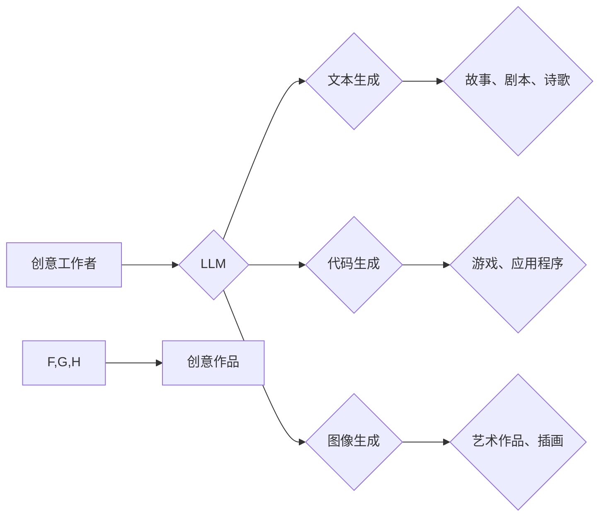

                 

## LLM在创意产业中的应用前景

> 关键词：大型语言模型 (LLM)、创意产业、文本生成、代码生成、图像生成、音乐生成、艺术创作、AI伦理、未来趋势

## 1. 背景介绍

近年来，人工智能技术取得了飞速发展，其中大型语言模型 (LLM) 作为人工智能领域最具潜力的技术之一，展现出强大的文本处理能力，引发了广泛的关注和研究。LLM 能够理解和生成人类语言，并具备强大的文本生成、翻译、摘要、问答等能力。

创意产业涵盖了文学、电影、音乐、艺术、设计等多个领域，其核心是创造新的价值和体验。传统创意工作往往依赖于人类的灵感和经验，但随着技术的进步，AI 技术逐渐渗透到创意产业的各个环节，为创意工作者提供新的工具和可能性。

## 2. 核心概念与联系

### 2.1  大型语言模型 (LLM)

LLM 是指训练数据量巨大、参数规模庞大的深度学习模型，能够理解和生成人类语言。它们通过学习海量文本数据，掌握语言的语法、语义和上下文关系，从而实现各种自然语言处理任务。

常见的 LLM 包括 GPT-3、LaMDA、BERT 等，它们在文本生成、翻译、问答、代码生成等方面表现出色。

### 2.2  创意产业

创意产业是指以创意为核心，通过知识、文化、艺术等要素创造新的产品、服务和体验的产业。它涵盖了文学、电影、音乐、艺术、设计、游戏等多个领域，是推动经济发展和社会进步的重要力量。

### 2.3  LLM 在创意产业中的应用

LLM 的强大文本处理能力为创意产业带来了新的机遇。它可以帮助创意工作者：

* **生成创意内容：** LLM 可以根据给定的主题或关键词生成故事、剧本、诗歌、音乐旋律等创意内容，为创意工作者提供灵感和素材。
* **提高创作效率：** LLM 可以自动完成一些重复性的创作任务，例如文案撰写、角色设定、场景描述等，帮助创意工作者提高创作效率。
* **个性化创作体验：** LLM 可以根据用户的喜好和需求生成个性化的创意内容，例如定制小说、个性化音乐等，为用户提供更丰富的创作体验。

**Mermaid 流程图**



## 3. 核心算法原理 & 具体操作步骤

### 3.1  算法原理概述

LLM 的核心算法是基于 Transformer 架构的深度神经网络。Transformer 模型通过自注意力机制学习文本序列之间的关系，能够捕捉长距离依赖关系，从而实现更准确的文本理解和生成。

### 3.2  算法步骤详解

1. **数据预处理:** 将文本数据进行清洗、分词、标记等预处理操作，使其能够被模型理解。
2. **模型训练:** 使用大量的文本数据训练 Transformer 模型，通过反向传播算法不断调整模型参数，使其能够生成更准确的文本。
3. **文本生成:** 将待生成的文本输入到训练好的模型中，模型根据输入文本和训练数据中的知识，生成相应的文本输出。

### 3.3  算法优缺点

**优点:**

* **强大的文本处理能力:** LLM 能够理解和生成复杂的文本，并具备强大的文本生成、翻译、摘要、问答等能力。
* **可扩展性强:** LLM 的模型结构可以根据需要进行扩展，训练更大的模型以提高性能。
* **应用场景广泛:** LLM 可以应用于各种创意产业领域，例如文学创作、电影剧本编写、音乐作曲等。

**缺点:**

* **训练成本高:** 训练大型语言模型需要大量的计算资源和时间，成本较高。
* **数据依赖性强:** LLM 的性能取决于训练数据的质量和数量，如果训练数据不足或质量低，模型性能会受到影响。
* **伦理风险:** LLM 可能被用于生成虚假信息、进行网络攻击等恶意用途，需要谨慎使用并制定相应的伦理规范。

### 3.4  算法应用领域

LLM 的应用领域非常广泛，除了创意产业外，还包括：

* **教育:** 自动生成学习材料、提供个性化学习辅导。
* **医疗:** 辅助医生诊断疾病、生成医疗报告。
* **客服:** 提供智能客服服务，自动回答用户问题。
* **法律:** 辅助律师进行法律研究、生成法律文件。

## 4. 数学模型和公式 & 详细讲解 & 举例说明

### 4.1  数学模型构建

LLM 的数学模型主要基于 Transformer 架构，其核心是自注意力机制。自注意力机制能够学习文本序列中每个词与其他词之间的关系，从而捕捉长距离依赖关系。

**公式:**

$$
Attention(Q, K, V) = softmax(\frac{QK^T}{\sqrt{d_k}})V
$$

其中：

* $Q$：查询矩阵
* $K$：键矩阵
* $V$：值矩阵
* $d_k$：键向量的维度
* $softmax$：softmax 函数

### 4.2  公式推导过程

自注意力机制的公式通过计算查询矩阵 $Q$ 与键矩阵 $K$ 的点积，然后使用 softmax 函数进行归一化，得到每个词与其他词之间的注意力权重。最后，将注意力权重与值矩阵 $V$ 相乘，得到每个词的最终表示。

### 4.3  案例分析与讲解

例如，在生成一个句子时，LLM 会首先将每个词转换为向量表示，然后使用自注意力机制计算每个词与其他词之间的注意力权重。通过这些权重，LLM 可以了解每个词在句子中的语义关系，从而生成更流畅、更合理的句子。

## 5. 项目实践：代码实例和详细解释说明

### 5.1  开发环境搭建

使用 Python 语言和 TensorFlow 或 PyTorch 深度学习框架开发 LLM 应用。

### 5.2  源代码详细实现

```python
# 使用 TensorFlow 框架实现简单的文本生成模型

import tensorflow as tf

# 定义模型结构
model = tf.keras.Sequential([
    tf.keras.layers.Embedding(input_dim=vocab_size, output_dim=embedding_dim),
    tf.keras.layers.LSTM(units=lstm_units),
    tf.keras.layers.Dense(units=vocab_size, activation='softmax')
])

# 编译模型
model.compile(optimizer='adam', loss='sparse_categorical_crossentropy', metrics=['accuracy'])

# 训练模型
model.fit(x_train, y_train, epochs=epochs)

# 生成文本
text = "This is a"
for _ in range(10):
    predictions = model.predict(tf.expand_dims(text, 0))
    predicted_index = tf.argmax(predictions[0]).numpy()
    predicted_word = vocabulary[predicted_index]
    text += " " + predicted_word
```

### 5.3  代码解读与分析

* 代码首先定义了一个简单的文本生成模型，使用 Embedding 层将词向量化，LSTM 层捕捉文本序列的上下文关系，Dense 层输出每个词的概率分布。
* 然后，模型使用 Adam 优化器和交叉熵损失函数进行训练。
* 最后，使用训练好的模型生成文本，通过预测下一个词的概率分布，逐步生成新的文本。

### 5.4  运行结果展示

运行代码后，模型会根据训练数据生成新的文本。生成的文本可能会有语法错误或逻辑不完整，但可以展现出 LLM 的文本生成能力。

## 6. 实际应用场景

### 6.1  文学创作

LLM 可以帮助作家生成故事、剧本、诗歌等创意内容，提供灵感和素材，提高创作效率。例如，可以使用 LLM 生成不同类型的短篇故事，或者根据给定的主题生成诗歌。

### 6.2  电影剧本编写

LLM 可以帮助编剧生成电影剧本，包括人物对话、场景描述、情节发展等。例如，可以使用 LLM 根据给定的故事梗概生成电影剧本的草稿，或者根据人物性格生成人物对话。

### 6.3  音乐作曲

LLM 可以帮助音乐家生成音乐旋律、歌词、乐曲结构等。例如，可以使用 LLM 根据给定的音乐风格生成新的旋律，或者根据歌词生成相应的音乐伴奏。

### 6.4  艺术创作

LLM 可以帮助艺术家生成图像、绘画、雕塑等艺术作品。例如，可以使用 LLM 根据给定的文字描述生成相应的图像，或者根据艺术风格生成新的绘画作品。

## 7. 工具和资源推荐

### 7.1  学习资源推荐

* **书籍:**
    * 《深度学习》 by Ian Goodfellow, Yoshua Bengio, and Aaron Courville
    * 《自然语言处理》 by Dan Jurafsky and James H. Martin
* **在线课程:**
    * Coursera: Natural Language Processing Specialization
    * Udacity: Deep Learning Nanodegree

### 7.2  开发工具推荐

* **TensorFlow:** https://www.tensorflow.org/
* **PyTorch:** https://pytorch.org/
* **Hugging Face Transformers:** https://huggingface.co/transformers/

### 7.3  相关论文推荐

* **Attention Is All You Need:** https://arxiv.org/abs/1706.03762
* **BERT: Pre-training of Deep Bidirectional Transformers for Language Understanding:** https://arxiv.org/abs/1810.04805
* **GPT-3: Language Models are Few-Shot Learners:** https://arxiv.org/abs/2005.14165

## 8. 总结：未来发展趋势与挑战

### 8.1  研究成果总结

LLM 在文本生成、翻译、摘要、问答等方面取得了显著的成果，为创意产业带来了新的机遇。

### 8.2  未来发展趋势

* **模型规模和性能的提升:** 未来 LLM 的模型规模将继续扩大，性能将进一步提升，能够生成更复杂、更流畅的文本。
* **多模态生成:** LLM 将与其他 AI 技术融合，实现多模态生成，例如文本-图像、文本-音频的联合生成。
* **个性化创作体验:** LLM 将更加注重用户体验，提供更加个性化的创作工具和服务。

### 8.3  面临的挑战

* **数据安全和隐私:** LLM 的训练需要大量数据，如何保证数据安全和隐私是一个重要的挑战。
* **算法可解释性和透明度:** LLM 的决策过程往往难以理解，如何提高算法的可解释性和透明度是一个重要的研究方向。
* **伦理风险:** LLM 可能被用于生成虚假信息、进行网络攻击等恶意用途，需要制定相应的伦理规范和监管机制。

### 8.4  研究展望

未来，LLM 将继续朝着更强大、更安全、更可解释的方向发展，为创意产业带来更多创新和可能性。


## 9. 附录：常见问题与解答

**Q1: LLM 的训练成本很高吗？**

A1: 确实，训练大型语言模型需要大量的计算资源和时间，成本较高。但随着硬件技术的进步和训练方法的优化，训练成本正在逐渐降低。

**Q2: LLM 是否会生成虚假信息？**

A2: LLM 的输出取决于训练数据，如果训练数据中包含虚假信息，模型可能会生成虚假信息。因此，使用 LLM 生成的文本需要进行仔细核实。

**Q3: 如何保证 LLM 的安全性？**

A3: 为了保证 LLM 的安全性，需要从多个方面进行考虑，例如：

* 使用高质量的训练数据，避免训练数据中包含恶意内容。
* 开发安全的模型架构，防止模型被攻击或利用。
* 制定相应的伦理规范和监管机制，规范 LLM 的应用。

**作者：禅与计算机程序设计艺术 / Zen and the Art of Computer Programming**<end_of_turn>

