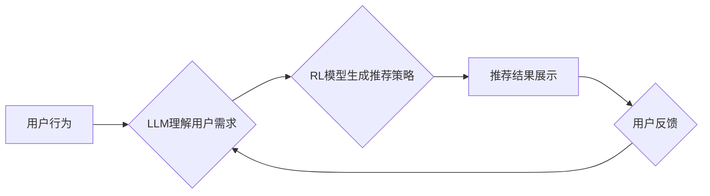

                 

## LLM在推荐系统中的强化学习应用

> 关键词：大型语言模型（LLM）、强化学习（RL）、推荐系统、用户行为预测、个性化推荐、序列生成、代理学习

## 1. 背景介绍

推荐系统是互联网时代的重要组成部分，旨在根据用户的历史行为、偏好和上下文信息，推荐用户感兴趣的内容或商品。传统的推荐系统主要依赖于协同过滤、内容过滤和基于知识的推荐算法，但这些方法在面对冷启动问题、数据稀疏性以及用户行为的多样性时表现有限。

近年来，大型语言模型（LLM）的快速发展为推荐系统带来了新的机遇。LLM 拥有强大的文本理解和生成能力，能够捕捉用户行为背后的复杂语义信息，并生成更个性化、更相关的推荐结果。强化学习（RL）作为一种机器学习范式，能够通过与环境交互学习最优策略，在推荐系统中可以帮助模型学习用户偏好，并不断优化推荐策略。

将LLM与RL相结合，可以构建更智能、更适应用户需求的推荐系统。这种结合方式能够更好地理解用户行为，生成更精准的推荐，并随着用户交互的不断积累，不断优化推荐策略，实现个性化推荐的提升。

## 2. 核心概念与联系

### 2.1 强化学习

强化学习是一种基于交互学习的机器学习方法，其核心思想是通过奖励机制引导智能体学习最优策略。

* **智能体 (Agent):**  推荐系统中的智能体可以是推荐模型，其目标是学习最优的推荐策略。
* **环境 (Environment):**  推荐系统中的环境包括用户、物品、交互数据等，智能体与环境交互以获取信息和反馈。
* **状态 (State):**  智能体在环境中的当前状态，例如用户的历史行为、当前浏览的物品等。
* **动作 (Action):**  智能体在特定状态下可以采取的动作，例如推荐某个物品、展示某个广告等。
* **奖励 (Reward):**  环境对智能体采取的动作给予的反馈，例如用户点击推荐的物品、购买推荐的商品等。

智能体通过不断与环境交互，学习到哪些动作在特定状态下能够获得更高的奖励，从而学习最优策略。

### 2.2 大型语言模型

大型语言模型 (LLM) 是近年来发展迅速的深度学习模型，其特点是拥有大量的参数和训练数据，能够理解和生成人类语言。LLM 可以用于各种自然语言处理任务，例如文本分类、机器翻译、文本生成等。

在推荐系统中，LLM 可以用于理解用户的需求，生成更精准的推荐描述，并与用户进行自然语言交互。

### 2.3 LLM与RL的结合

将LLM与RL相结合，可以构建更智能的推荐系统。LLM 可以提供丰富的语义信息，帮助RL模型更好地理解用户需求，而RL模型可以根据用户反馈不断优化推荐策略。

**Mermaid 流程图：**



## 3. 核心算法原理 & 具体操作步骤

### 3.1 算法原理概述

LLM-强化学习推荐系统通常采用代理学习 (Agent-Based Learning) 的方法。

* **代理学习:**  智能体（代理）通过与环境交互学习，目标是最大化累积奖励。
* **策略梯度:**  RL算法中常用的策略梯度方法，通过更新策略参数来最大化奖励。

LLM 在此系统中扮演着两个关键角色：

* **用户需求理解:**  LLM 可以分析用户的历史行为、文本描述等信息，理解用户的潜在需求和偏好。
* **推荐描述生成:**  LLM 可以根据用户需求生成更精准、更吸引人的推荐描述，提高用户点击率和转化率。

### 3.2 算法步骤详解

1. **环境构建:**  构建推荐系统环境，包括用户数据、物品数据、交互数据等。
2. **LLM预训练:**  使用大量文本数据预训练LLM模型，使其具备强大的文本理解和生成能力。
3. **策略网络构建:**  构建策略网络，用于根据用户状态生成推荐动作。
4. **奖励函数设计:**  设计奖励函数，根据用户反馈（例如点击、购买等）评估推荐策略的优劣。
5. **训练过程:**  使用策略梯度算法训练策略网络，使其学习到最优的推荐策略。
6. **推荐系统部署:**  将训练好的模型部署到生产环境中，为用户提供个性化推荐服务。

### 3.3 算法优缺点

**优点:**

* **个性化推荐:**  LLM能够更好地理解用户的需求，生成更个性化的推荐结果。
* **交互式学习:**  RL算法能够通过与用户交互不断优化推荐策略，提高推荐效果。
* **可解释性:**  LLM的文本生成能力可以帮助解释推荐结果背后的逻辑，提高用户信任度。

**缺点:**

* **数据需求:**  LLM和RL算法都需要大量的训练数据，数据获取和预处理成本较高。
* **计算复杂度:**  训练LLM模型和RL算法都需要大量的计算资源，训练时间较长。
* **安全性和隐私性:**  LLM模型可能存在数据泄露和隐私攻击的风险，需要采取相应的安全措施。

### 3.4 算法应用领域

LLM-强化学习推荐系统可以应用于各种场景，例如：

* **电商推荐:**  推荐商品、优惠券、促销活动等。
* **内容推荐:**  推荐新闻、视频、音乐、书籍等。
* **社交推荐:**  推荐好友、群组、活动等。
* **广告推荐:**  推荐精准广告，提高广告转化率。

## 4. 数学模型和公式 & 详细讲解 & 举例说明

### 4.1 数学模型构建

在LLM-强化学习推荐系统中，常用的数学模型包括状态空间、动作空间、奖励函数和策略网络。

* **状态空间 (State Space):**  表示智能体在环境中的所有可能状态，例如用户的历史行为、当前浏览的物品等。
* **动作空间 (Action Space):**  表示智能体在特定状态下可以采取的所有动作，例如推荐某个物品、展示某个广告等。
* **奖励函数 (Reward Function):**  定义智能体采取特定动作在特定状态下获得的奖励，例如用户点击推荐的物品获得正向奖励，用户不点击推荐的物品获得负向奖励。
* **策略网络 (Policy Network):**  是一个神经网络模型，用于根据当前状态预测最优动作。

### 4.2 公式推导过程

策略梯度算法的目标是最大化累积奖励，其核心公式为：

$$
\theta_{t+1} = \theta_t + \alpha \nabla_{\theta} J(\theta)
$$

其中：

* $\theta$ 是策略网络的参数。
* $J(\theta)$ 是累积奖励函数。
* $\alpha$ 是学习率。
* $\nabla_{\theta} J(\theta)$ 是累积奖励函数对策略网络参数的梯度。

### 4.3 案例分析与讲解

假设一个电商推荐系统，用户浏览商品A，LLM理解用户可能对商品B感兴趣，推荐系统采取动作推荐商品B，用户点击了商品B，获得正向奖励。

* 状态空间：用户浏览的商品、用户的历史行为等。
* 动作空间：推荐商品A、商品B等。
* 奖励函数：用户点击推荐的商品获得正向奖励，用户不点击推荐的商品获得负向奖励。
* 策略网络：根据用户状态预测最优推荐商品。

策略梯度算法会根据用户点击商品B的反馈，更新策略网络的参数，使得在类似的用户状态下，推荐系统更倾向于推荐商品B。

## 5. 项目实践：代码实例和详细解释说明

### 5.1 开发环境搭建

* Python 3.7+
* TensorFlow/PyTorch
* Numpy
* Pandas

### 5.2 源代码详细实现

```python
# 导入必要的库
import tensorflow as tf

# 定义策略网络
class PolicyNetwork(tf.keras.Model):
    def __init__(self, state_dim, action_dim):
        super(PolicyNetwork, self).__init__()
        self.dense1 = tf.keras.layers.Dense(64, activation='relu')
        self.dense2 = tf.keras.layers.Dense(action_dim, activation='softmax')

    def call(self, state):
        x = self.dense1(state)
        return self.dense2(x)

# 定义奖励函数
def reward_function(action, reward_data):
    # 根据用户行为和推荐结果计算奖励
    return reward_data[action]

# 定义训练函数
def train_policy(policy_network, state, action, reward):
    with tf.GradientTape() as tape:
        # 计算策略网络的输出
        logits = policy_network(state)
        # 计算损失函数
        loss = tf.keras.losses.categorical_crossentropy(action, logits)
    # 更新策略网络参数
    gradients = tape.gradient(loss, policy_network.trainable_variables)
    optimizer.apply_gradients(zip(gradients, policy_network.trainable_variables))

# ... 训练循环 ...
```

### 5.3 代码解读与分析

* **策略网络:**  使用多层感知机 (MLP) 构建策略网络，输入用户状态，输出推荐动作的概率分布。
* **奖励函数:**  根据用户行为和推荐结果计算奖励，例如用户点击推荐的商品获得正向奖励，用户不点击推荐的商品获得负向奖励。
* **训练函数:**  使用策略梯度算法训练策略网络，更新策略网络参数以最大化累积奖励。

### 5.4 运行结果展示

训练完成后，可以评估策略网络的性能，例如计算推荐准确率、点击率等指标。

## 6. 实际应用场景

LLM-强化学习推荐系统已经应用于许多实际场景，例如：

* **Netflix:**  使用LLM理解用户的观看历史和偏好，推荐个性化的影视内容。
* **Amazon:**  使用LLM分析用户的购物历史和浏览记录，推荐个性化的商品。
* **Spotify:**  使用LLM分析用户的音乐偏好，推荐个性化的音乐播放列表。

### 6.4 未来应用展望

LLM-强化学习推荐系统在未来将有更广泛的应用场景，例如：

* **个性化教育:**  根据学生的学习进度和兴趣，推荐个性化的学习内容。
* **医疗保健:**  根据患者的病史和症状，推荐个性化的医疗方案。
* **金融服务:**  根据用户的投资目标和风险偏好，推荐个性化的投资产品。

## 7. 工具和资源推荐

### 7.1 学习资源推荐

* **书籍:**
    * Reinforcement Learning: An Introduction by Sutton and Barto
    * Deep Learning by Goodfellow, Bengio, and Courville
* **在线课程:**
    * Deep Reinforcement Learning Specialization by Andrew Ng
    * Reinforcement Learning by David Silver
* **博客和网站:**
    * OpenAI Blog
    * DeepMind Blog

### 7.2 开发工具推荐

* **TensorFlow:**  开源深度学习框架
* **PyTorch:**  开源深度学习框架
* **Hugging Face Transformers:**  用于加载和使用预训练LLM模型的库

### 7.3 相关论文推荐

* **Proximal Policy Optimization Algorithms**
* **Deep Reinforcement Learning with Double Q-learning**
* **Attention Is All You Need**

## 8. 总结：未来发展趋势与挑战

### 8.1 研究成果总结

LLM-强化学习推荐系统取得了显著的成果，能够提供更个性化、更精准的推荐结果。

### 8.2 未来发展趋势

* **更强大的LLM模型:**  随着LLM模型的不断发展，推荐系统将能够更好地理解用户的需求和偏好。
* **更有效的RL算法:**  新的RL算法将能够更高效地训练推荐系统，提高推荐效果。
* **多模态推荐:**  LLM能够处理多种模态数据，例如文本、图像、音频等，未来推荐系统将能够提供更丰富的推荐结果。

### 8.3 面临的挑战

* **数据安全和隐私:**  LLM模型需要大量的训练数据，如何保证数据安全和隐私是一个重要的挑战。
* **算法可解释性:**  LLM模型的决策过程往往难以解释，如何提高算法的可解释性是一个重要的研究方向。
* **计算资源:**  训练LLM模型和RL算法需要大量的计算资源，如何降低计算成本是一个重要的挑战。

### 8.4 研究展望

未来，LLM-强化学习推荐系统将继续朝着更智能、更个性化、更安全的方向发展，为用户提供更优质的推荐服务。


## 9. 附录：常见问题与解答

* **Q1: LLM-强化学习推荐系统与传统的推荐系统相比有什么优势？**

* **A1:**  LLM-强化学习推荐系统能够更好地理解用户的需求，生成更精准的推荐结果，并通过与用户交互不断优化推荐策略，实现个性化推荐的提升。

* **Q2: 如何选择合适的LLM模型和RL算法？**

* **A2:**  选择合适的LLM模型和RL算法需要根据具体的应用场景和数据特点进行选择。

* **Q3: 如何解决LLM-强化学习推荐系统中的数据安全和隐私问题？**

* **A3:**  可以使用数据加密、联邦学习等技术来解决数据安全和隐私问题。


作者：禅与计算机程序设计艺术 / Zen and the Art of Computer Programming 
<end_of_turn>

