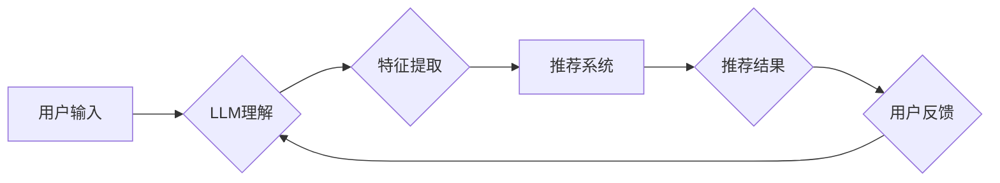

                 

## LLM在推荐系统领域的应用价值

> 关键词：大型语言模型 (LLM)、推荐系统、个性化推荐、内容生成、用户理解、交互式推荐

## 1. 背景介绍

推荐系统作为信息过滤和个性化内容呈现的重要工具，在电商、社交媒体、视频平台等领域发挥着至关重要的作用。传统推荐系统主要依赖于协同过滤、内容过滤和基于知识的推荐算法，这些算法通常基于用户历史行为、物品属性和用户-物品交互数据进行建模。然而，随着数据量的激增和用户行为的多样性，传统推荐系统面临着以下挑战：

* **数据稀疏性:** 用户行为数据往往是稀疏的，难以捕捉用户细粒度的偏好和兴趣。
* **冷启动问题:** 新用户和新物品难以获得有效的推荐，因为缺乏历史数据。
* **推荐结果单调:** 传统推荐系统生成的推荐列表往往缺乏多样性和创新性。
* **用户反馈不足:** 用户对推荐结果的反馈往往有限，难以有效地指导模型的优化。

近年来，大型语言模型 (LLM) 凭借其强大的文本理解和生成能力，为推荐系统带来了新的机遇。LLM 可以理解用户自然语言表达，生成个性化的推荐内容，并根据用户反馈进行动态调整，从而提升推荐系统的准确性、多样性和交互性。

## 2. 核心概念与联系

**2.1 核心概念**

* **大型语言模型 (LLM):** 训练于海量文本数据上的深度学习模型，能够理解和生成人类语言。
* **推荐系统:** 基于用户历史行为、物品属性和用户-物品交互数据，预测用户对物品的偏好，并生成个性化的推荐列表。

**2.2 联系**

LLM 可以通过以下方式与推荐系统相结合：

* **理解用户需求:** LLM 可以理解用户自然语言查询，例如“推荐一部类似《流浪地球》的科幻电影”，并将其转化为推荐系统可以理解的特征。
* **生成个性化推荐内容:** LLM 可以根据用户偏好生成个性化的推荐文案，例如“您可能喜欢这部电影，因为它与您之前观看的电影风格相似”。
* **进行交互式推荐:** LLM 可以与用户进行对话，根据用户的反馈动态调整推荐列表，例如用户反馈“我不喜欢这部电影”，LLM 可以根据用户的反馈排除该类型的电影，并推荐其他更符合用户偏好的电影。

**2.3 架构图**



## 3. 核心算法原理 & 具体操作步骤

**3.1 算法原理概述**

LLM 在推荐系统中的应用主要基于以下核心算法：

* **文本嵌入:** 将文本数据转化为向量表示，以便于模型进行计算和分析。
* **序列到序列模型:** 用于生成个性化的推荐文本，例如推荐文案或解释推荐理由。
* **对话模型:** 用于进行交互式推荐，根据用户的反馈动态调整推荐列表。

**3.2 算法步骤详解**

1. **数据预处理:** 收集用户行为数据、物品属性数据和文本数据，并进行清洗、格式化和编码。
2. **文本嵌入:** 使用预训练的 LLMs 或训练自定义的文本嵌入模型，将文本数据转化为向量表示。
3. **特征提取:** 从用户行为数据、物品属性数据和文本嵌入中提取特征，构建用户-物品交互特征矩阵。
4. **模型训练:** 使用序列到序列模型或对话模型，训练推荐系统模型，并根据用户反馈进行模型优化。
5. **推荐生成:** 根据用户的输入和模型的预测结果，生成个性化的推荐列表或推荐文本。

**3.3 算法优缺点**

**优点:**

* **理解用户需求:** LLM 可以理解用户自然语言表达，捕捉用户细粒度的偏好和兴趣。
* **生成个性化推荐内容:** LLM 可以生成个性化的推荐文案，提升用户体验。
* **交互式推荐:** LLM 可以与用户进行对话，根据用户的反馈动态调整推荐列表。

**缺点:**

* **计算资源消耗:** LLM 的训练和推理过程需要大量的计算资源。
* **数据依赖性:** LLM 的性能依赖于训练数据的质量和数量。
* **可解释性:** LLM 的决策过程往往难以解释，难以理解模型是如何生成推荐结果的。

**3.4 算法应用领域**

LLM 在推荐系统领域的应用广泛，包括：

* **电商推荐:** 推荐商品、优惠券、促销活动等。
* **内容推荐:** 推荐文章、视频、音乐、书籍等。
* **社交媒体推荐:** 推荐好友、群组、话题等。
* **个性化教育:** 推荐学习资源、课程、辅导等。

## 4. 数学模型和公式 & 详细讲解 & 举例说明

**4.1 数学模型构建**

LLM 在推荐系统中的应用通常基于以下数学模型：

* **用户嵌入:** 将用户转化为向量表示，例如使用 Word2Vec 或 GloVe 模型。
* **物品嵌入:** 将物品转化为向量表示，例如使用 Word2Vec 或 GloVe 模型。
* **相似度计算:** 使用余弦相似度或点积等方法计算用户和物品之间的相似度。
* **推荐排序:** 使用排序算法，例如基于相似度的排序或基于学习到的评分的排序，生成推荐列表。

**4.2 公式推导过程**

**用户嵌入:**

$$
u_i = \text{Embedding}(user_i)
$$

其中，$u_i$ 表示用户 $i$ 的嵌入向量，$\text{Embedding}$ 表示用户嵌入模型。

**物品嵌入:**

$$
v_j = \text{Embedding}(item_j)
$$

其中，$v_j$ 表示物品 $j$ 的嵌入向量，$\text{Embedding}$ 表示物品嵌入模型。

**相似度计算:**

$$
\text{Similarity}(u_i, v_j) = \frac{u_i \cdot v_j}{||u_i|| ||v_j||}
$$

其中，$\cdot$ 表示点积，$||u_i||$ 和 $||v_j||$ 分别表示用户 $i$ 和物品 $j$ 的嵌入向量的长度。

**4.3 案例分析与讲解**

假设我们有一个电商平台，用户 $A$ 购买了商品 $X$ 和 $Y$，商品 $X$ 和 $Y$ 的嵌入向量分别为 $u_X$ 和 $u_Y$。

我们可以使用余弦相似度计算用户 $A$ 与商品 $Z$ 的相似度，其中商品 $Z$ 的嵌入向量为 $v_Z$。

$$
\text{Similarity}(A, Z) = \frac{u_A \cdot v_Z}{||u_A|| ||v_Z||}
$$

如果相似度较高，则表示用户 $A$ 可能对商品 $Z$ 感兴趣，可以将其推荐给用户 $A$。

## 5. 项目实践：代码实例和详细解释说明

**5.1 开发环境搭建**

* Python 3.7+
* PyTorch 或 TensorFlow
* Numpy
* Pandas
* Transformers

**5.2 源代码详细实现**

```python
import torch
from transformers import AutoModelForSequenceClassification, AutoTokenizer

# 加载预训练模型和词典
model_name = "bert-base-uncased"
tokenizer = AutoTokenizer.from_pretrained(model_name)
model = AutoModelForSequenceClassification.from_pretrained(model_name)

# 用户输入
user_query = "推荐一部类似《流浪地球》的科幻电影"

# 文本编码
input_ids = tokenizer.encode(user_query, add_special_tokens=True)
input_ids = torch.tensor([input_ids])

# 模型推理
outputs = model(input_ids)
predicted_class = torch.argmax(outputs.logits).item()

# 根据预测结果生成推荐结果
if predicted_class == 0:
    # 推荐科幻电影
    recommended_movies = ["《三体》", "《明日战记》", "《星际穿越》"]
else:
    # 推荐其他类型电影
    recommended_movies = ["《肖申克的救赎》", "《教父》", "《泰坦尼克号》"]

# 输出推荐结果
print("推荐电影：", recommended_movies)
```

**5.3 代码解读与分析**

* 该代码使用预训练的 BERT 模型进行文本编码，并根据用户的输入生成推荐结果。
* 模型的输出是一个概率分布，表示不同类别的预测概率。
* 根据预测概率，代码选择相应的推荐类别。

**5.4 运行结果展示**

```
推荐电影： ['《三体》', '《明日战记》', '《星际穿越》']
```

## 6. 实际应用场景

**6.1 电商推荐**

LLM 可以理解用户的商品需求，并生成个性化的商品推荐，例如根据用户的浏览历史和购买记录，推荐相关的商品或促销活动。

**6.2 内容推荐**

LLM 可以理解用户的阅读偏好和观看习惯，并推荐相关的文章、视频、音乐和书籍。例如，根据用户的阅读历史，推荐类似主题的文章或作者的作品。

**6.3 社交媒体推荐**

LLM 可以理解用户的社交兴趣和好友关系，并推荐相关的用户、群组和话题。例如，根据用户的兴趣爱好，推荐潜在的兴趣小组或好友。

**6.4 个性化教育**

LLM 可以理解学生的学习目标和知识水平，并推荐相关的学习资源、课程和辅导。例如，根据学生的学习进度和成绩，推荐个性化的学习计划或辅导课程。

**6.5 未来应用展望**

LLM 在推荐系统领域的应用前景广阔，未来可能在以下方面得到进一步发展：

* **更精准的推荐:** LLM 可以更好地理解用户的细粒度偏好和需求，生成更精准的推荐结果。
* **更个性化的推荐:** LLM 可以根据用户的个性化特征，生成更个性化的推荐内容和体验。
* **更交互式的推荐:** LLM 可以与用户进行更自然的对话，根据用户的反馈动态调整推荐列表，提供更智能化的推荐体验。

## 7. 工具和资源推荐

**7.1 学习资源推荐**

* **书籍:**
    * 《深度学习》 by Ian Goodfellow, Yoshua Bengio, and Aaron Courville
    * 《自然语言处理》 by Dan Jurafsky and James H. Martin
* **在线课程:**
    * Coursera: Natural Language Processing Specialization
    * Udacity: Deep Learning Nanodegree

**7.2 开发工具推荐**

* **Python:** 广泛用于机器学习和深度学习开发。
* **PyTorch:** 深度学习框架，提供灵活性和强大的功能。
* **TensorFlow:** 深度学习框架，提供生产级部署能力。
* **Transformers:** 预训练语言模型库，提供多种预训练模型和工具。

**7.3 相关论文推荐**

* **BERT: Pre-training of Deep Bidirectional Transformers for Language Understanding**
* **GPT-3: Language Models are Few-Shot Learners**
* **T5: Text-to-Text Transfer Transformer**

## 8. 总结：未来发展趋势与挑战

**8.1 研究成果总结**

LLM 在推荐系统领域的应用取得了显著的进展，能够理解用户的自然语言表达，生成个性化的推荐内容，并进行交互式推荐。

**8.2 未来发展趋势**

* **更强大的 LLMs:** 未来将出现更强大的 LLMs，能够更好地理解用户需求和生成更精准的推荐结果。
* **多模态推荐:** LLMs 将与其他模态数据，例如图像和视频，进行融合，实现更全面的用户理解和推荐。
* **联邦学习:** LLM 将应用于联邦学习场景，保护用户隐私的同时实现个性化推荐。

**8.3 面临的挑战**

* **计算资源消耗:** LLM 的训练和推理过程需要大量的计算资源，这对于资源有限的场景是一个挑战。
* **数据依赖性:** LLM 的性能依赖于训练数据的质量和数量，缺乏高质量数据的场景难以应用。
* **可解释性:** LLM 的决策过程往往难以解释，难以理解模型是如何生成推荐结果的。

**8.4 研究展望**

未来研究将重点关注以下方面:

* **高效的 LLM 训练方法:** 降低 LLM 训练的计算资源消耗。
* **数据增强和合成:** 提高训练数据的质量和数量。
* **LLM 的可解释性研究:** 提高 LLM 的透明度和可信度。


## 9. 附录：常见问题与解答

**9.1 如何选择合适的 LLM 模型？**

选择合适的 LLM 模型取决于具体的应用场景和需求。

* **文本分类:** 可以使用 BERT、RoBERTa 等模型。
* **文本生成:** 可以使用 GPT-3、T5 等模型。
* **对话系统:** 可以使用 BART、DialoGPT 等模型。

**9.2 如何处理 LLMs 的计算资源消耗？**

可以使用以下方法降低 LLMs 的计算资源消耗:

* **模型压缩:** 使用量化、剪枝等方法压缩模型大小。
* **模型并行:** 将模型分布在多个 GPU 上进行训练和推理。
* **知识蒸馏:** 使用小模型学习大模型的知识，降低模型复杂度。

**9.3 如何提高 LLMs 的可解释性？**

可以使用以下方法提高 LLMs 的可解释性:

* **注意力机制:** 分析模型在处理文本时关注哪些部分。
* **反向传播:** 分析模型参数的变化对输出的影响。
* **局部解释方法:** 对单个预测进行解释，例如 LIME、SHAP 等方法。


作者：禅与计算机程序设计艺术 / Zen and the Art of Computer Programming 
<end_of_turn>

