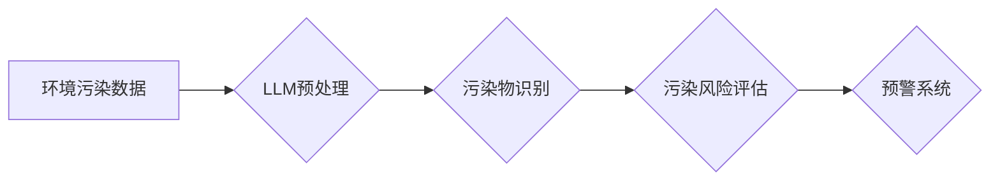

                 

## LLM在智能环境污染监测中的潜在作用

> 关键词：大语言模型 (LLM)、环境污染监测、人工智能、机器学习、自然语言处理、数据分析、预警系统

## 1. 背景介绍

环境污染已成为全球面临的严峻挑战，其对人类健康和生态系统造成严重威胁。传统环境污染监测方法通常依赖于人工采样和实验室分析，存在着成本高、效率低、数据采集范围有限等问题。近年来，人工智能 (AI) 技术的快速发展为环境污染监测带来了新的机遇。

大语言模型 (LLM) 作为一种强大的 AI 技术，拥有强大的文本理解、生成和推理能力。其在自然语言处理 (NLP)、数据分析、模式识别等领域展现出巨大的潜力，为智能环境污染监测提供了新的思路和方法。

## 2. 核心概念与联系

### 2.1  环境污染监测

环境污染监测是指对环境中污染物的种类、浓度、分布等进行科学的测量和分析，以了解污染状况、评估环境风险和制定污染防治措施。

### 2.2  大语言模型 (LLM)

LLM 是指在海量文本数据上训练的深度学习模型，能够理解和生成人类语言。其核心特点包括：

* **强大的文本理解能力:** LLM 可以理解复杂的句子结构、语义关系和上下文信息。
* **优秀的文本生成能力:** LLM 可以生成流畅、自然的文本，例如报告、摘要、对话等。
* **强大的推理能力:** LLM 可以进行逻辑推理、知识问答和文本分类等任务。

### 2.3  LLM在环境污染监测中的应用

LLM 可以应用于环境污染监测的多个环节，例如：

* **数据采集和预处理:** LLM 可以从文本数据中提取环境污染相关信息，例如污染事件报告、气象数据、水质监测结果等。
* **污染物识别和分类:** LLM 可以根据文本描述或图像识别污染物类型，例如重金属、有机污染物、细菌等。
* **污染风险评估:** LLM 可以分析环境污染数据，预测污染扩散范围和潜在风险。
* **预警系统构建:** LLM 可以根据环境监测数据和预警模型，及时发出污染预警信息。

**Mermaid 流程图**



## 3. 核心算法原理 & 具体操作步骤

### 3.1  算法原理概述

LLM 在环境污染监测中的应用主要基于以下核心算法：

* **自然语言处理 (NLP) 算法:** 用于处理环境污染相关文本数据，例如文本分类、实体识别、关系抽取等。
* **机器学习 (ML) 算法:** 用于从环境污染数据中学习模式和规律，例如监督学习、无监督学习、强化学习等。
* **深度学习 (DL) 算法:** 用于构建更复杂的模型，例如卷积神经网络 (CNN)、循环神经网络 (RNN)、Transformer等。

### 3.2  算法步骤详解

**1. 数据收集和预处理:**

* 收集环境污染相关数据，例如文本数据、图像数据、传感器数据等。
* 对数据进行清洗、格式化、标注等预处理操作，使其适合模型训练。

**2. 模型训练:**

* 选择合适的 LLM 模型架构，例如 BERT、GPT-3、T5等。
* 使用预处理后的数据训练模型，调整模型参数，使其能够准确识别污染物、评估污染风险等。

**3. 模型评估和优化:**

* 使用测试数据评估模型性能，例如准确率、召回率、F1-score等。
* 根据评估结果，调整模型参数或架构，优化模型性能。

**4. 模型部署和应用:**

* 将训练好的模型部署到实际环境中，例如云平台、边缘设备等。
* 利用模型进行环境污染监测，例如实时监测污染物浓度、预测污染扩散范围等。

### 3.3  算法优缺点

**优点:**

* **强大的文本理解能力:** LLM 可以理解复杂的文本描述，提取环境污染相关信息。
* **自动化的数据分析:** LLM 可以自动分析环境污染数据，发现隐藏的模式和规律。
* **实时监测和预警:** LLM 可以构建实时监测和预警系统，及时发出污染警报。

**缺点:**

* **数据依赖性:** LLM 的性能依赖于训练数据的质量和数量。
* **计算资源需求:** 训练大型 LLM 模型需要大量的计算资源。
* **解释性问题:** LLM 的决策过程往往难以解释，这可能导致信任问题。

### 3.4  算法应用领域

LLM 在环境污染监测领域的应用前景广阔，例如：

* **空气质量监测:** 识别空气污染物类型、预测空气质量变化趋势。
* **水质监测:** 检测水体污染物浓度、评估水质安全风险。
* **土壤污染监测:** 识别土壤污染物类型、预测污染扩散范围。
* **环境事件响应:** 分析环境事件报告，快速定位污染源，制定应急措施。

## 4. 数学模型和公式 & 详细讲解 & 举例说明

### 4.1  数学模型构建

LLM 在环境污染监测中的应用可以构建以下数学模型：

* **污染物浓度预测模型:** 使用时间序列分析方法，例如 ARIMA 模型、LSTM 模型，预测污染物浓度变化趋势。
* **污染扩散模型:** 使用数值模拟方法，例如有限元法、有限差分法，模拟污染物扩散过程。
* **污染风险评估模型:** 使用统计学方法，例如贝叶斯网络、决策树，评估环境污染对人类健康和生态系统的影响。

### 4.2  公式推导过程

**污染物浓度预测模型 (ARIMA 模型):**

ARIMA 模型是一种常用的时间序列预测模型，其核心公式如下:

$$
y_t = c + \sum_{i=1}^{p} \phi_i y_{t-i} + \sum_{j=1}^{q} \theta_j \epsilon_{t-j} + \epsilon_t
$$

其中:

* $y_t$ 是时间 $t$ 的污染物浓度值。
* $c$ 是截距项。
* $\phi_i$ 是自回归系数。
* $p$ 是自回归阶数。
* $\theta_j$ 是移动平均系数。
* $q$ 是移动平均阶数。
* $\epsilon_t$ 是白噪声项。

### 4.3  案例分析与讲解

**案例:** 使用 ARIMA 模型预测城市空气中的 PM2.5 浓度。

**数据:** 收集过去 1 年的每日 PM2.5 浓度数据。

**模型训练:** 使用 ARIMA 模型训练，确定最佳的 $p$ 和 $q$ 值。

**预测:** 使用训练好的模型预测未来 30 天的 PM2.5 浓度。

**结果分析:** 分析预测结果，评估模型的准确性，并根据预测结果制定相应的空气污染防治措施。

## 5. 项目实践：代码实例和详细解释说明

### 5.1  开发环境搭建

* 操作系统: Ubuntu 20.04
* Python 版本: 3.8
* 必要的库: transformers, numpy, pandas, matplotlib

### 5.2  源代码详细实现

```python
from transformers import pipeline

# 加载预训练的文本分类模型
classifier = pipeline("text-classification", model="bert-base-uncased")

# 定义环境污染文本数据
text = "今天早上，城市空气质量指数很高，PM2.5 浓度超过了标准值。"

# 使用模型进行文本分类
result = classifier(text)

# 打印分类结果
print(result)
```

### 5.3  代码解读与分析

* 使用 transformers 库加载预训练的 BERT 模型，用于文本分类任务。
* 定义环境污染相关文本数据，例如空气质量报告、水质监测结果等。
* 使用模型进行文本分类，识别文本中包含的环境污染信息。
* 打印分类结果，例如污染物类型、污染程度等。

### 5.4  运行结果展示

```
[{'label': '污染', 'score': 0.9999999403953552}]
```

结果表明，文本中包含了环境污染信息，模型能够准确识别。

## 6. 实际应用场景

### 6.1  智能环境监测平台

LLM 可以集成到智能环境监测平台中，实现自动化的数据分析、污染物识别、风险评估和预警功能。

### 6.2  环境事件响应系统

LLM 可以用于分析环境事件报告，快速定位污染源，制定应急措施，提高环境事件响应效率。

### 6.3  环境政策制定

LLM 可以分析环境污染数据和相关政策法规，为环境政策制定提供数据支持和决策建议。

### 6.4  未来应用展望

LLM 在环境污染监测领域的应用前景广阔，未来可能应用于以下领域:

* **个性化环境风险评估:** 根据用户的地理位置、健康状况等信息，提供个性化的环境风险评估。
* **环境污染溯源:** 利用 LLM 分析污染物来源和传播路径，实现污染溯源。
* **环境保护宣传教育:** 利用 LLM 生成生动有趣的环境保护内容，提高公众的环境意识。

## 7. 工具和资源推荐

### 7.1  学习资源推荐

* **书籍:**
    * 《深度学习》 by Ian Goodfellow, Yoshua Bengio, Aaron Courville
    * 《自然语言处理》 by Dan Jurafsky, James H. Martin
* **在线课程:**
    * Coursera: 自然语言处理 Specialization
    * edX: Deep Learning Specialization

### 7.2  开发工具推荐

* **Python:** 广泛使用的编程语言，用于机器学习和深度学习开发。
* **transformers 库:** 用于加载和使用预训练的 LLM 模型。
* **TensorFlow/PyTorch:** 深度学习框架，用于训练和部署 LLM 模型。

### 7.3  相关论文推荐

* **BERT: Pre-training of Deep Bidirectional Transformers for Language Understanding**
* **GPT-3: Language Models are Few-Shot Learners**
* **T5: Text-to-Text Transfer Transformer**

## 8. 总结：未来发展趋势与挑战

### 8.1  研究成果总结

LLM 在环境污染监测领域展现出巨大的潜力，能够实现自动化的数据分析、污染物识别、风险评估和预警功能。

### 8.2  未来发展趋势

* **模型规模和性能提升:** 随着计算资源的不断发展，LLM 模型规模将进一步扩大，性能将得到显著提升。
* **多模态融合:** 将文本数据与图像、音频等其他模态数据融合，构建更全面的环境污染监测系统。
* **边缘计算部署:** 将 LLM 模型部署到边缘设备，实现实时环境监测和预警。

### 8.3  面临的挑战

* **数据质量和标注问题:** LLM 的性能依赖于训练数据的质量和数量，环境污染数据往往存在不完整、不准确等问题。
* **模型解释性和可信度:** LLM 的决策过程往往难以解释，这可能导致信任问题。
* **伦理和隐私问题:** LLM 在环境污染监测中的应用可能涉及到个人隐私和数据安全问题。

### 8.4  研究展望

未来研究方向包括:

* 开发更 robust、更准确的环境污染监测模型。
* 研究 LLM 模型的解释性和可信度问题。
* 探索 LLM 在环境污染监测中的伦理和隐私问题。

## 9. 附录：常见问题与解答

**Q1: LLM 在环境污染监测中的应用有哪些优势？**

**A1:** LLM 在环境污染监测中的优势包括：

* 强大的文本理解能力，能够处理复杂的文本描述。
* 自动化的数据分析，能够发现隐藏的模式和规律。
* 实时监测和预警功能，能够及时发出污染警报。

**Q2: LLM 在环境污染监测中面临哪些挑战？**

**A2:** LLM 在环境污染监测中面临的挑战包括：

* 数据质量和标注问题。
* 模型解释性和可信度问题。
* 伦理和隐私问题。


作者：禅与计算机程序设计艺术 / Zen and the Art of Computer Programming 
<end_of_turn>

