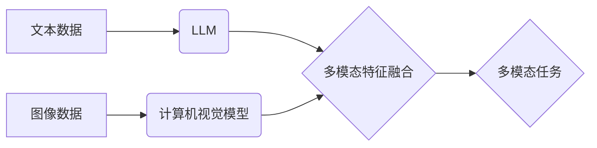

                 

## LLM在计算机视觉领域的应用拓展

> 关键词：大型语言模型 (LLM)、计算机视觉、多模态学习、图像理解、文本描述、图像生成、视觉问答

## 1. 背景介绍

计算机视觉和自然语言处理 (NLP) 作为人工智能领域的两大支柱，长期以来各自发展独立。然而，随着深度学习技术的飞速发展，两者之间的融合日益紧密，催生了多模态学习的新兴领域。大型语言模型 (LLM) 凭借其强大的文本理解和生成能力，在计算机视觉领域展现出巨大的潜力，为图像理解、文本描述、图像生成等任务带来了新的突破。

传统计算机视觉方法主要依赖于手工设计的特征提取和分类算法，对图像的语义理解能力有限。而 LLMs 通过学习海量文本数据，掌握了丰富的语言知识和语义关系，能够将图像与文本进行有效地关联，从而提升图像理解的深度和广度。

## 2. 核心概念与联系

**2.1 核心概念**

* **大型语言模型 (LLM):** 训练于海量文本数据的深度学习模型，能够理解和生成人类语言，具备强大的文本处理能力。
* **计算机视觉:**  使计算机“看”世界的能力，包括图像识别、物体检测、图像分割、场景理解等任务。
* **多模态学习:**  学习并理解多种模态数据 (如文本、图像、音频、视频) 的模型，能够跨模态进行信息交互和推理。

**2.2 架构关系**



**2.3 联系**

LLMs 可以与计算机视觉模型进行融合，形成多模态学习系统。

* **文本辅助图像理解:** LLMs 可以利用图像中包含的文本信息 (如标签、字幕) 来辅助图像理解，提升识别和分类的准确率。
* **图像文本对齐:** LLMs 可以学习图像和文本之间的语义关系，实现图像和文本的精准对齐，为图像字幕生成、视觉问答等任务提供支持。
* **图像生成:** LLMs 可以根据文本描述生成相应的图像，实现文本到图像的转换，为创意设计、游戏开发等领域提供新的可能性。

## 3. 核心算法原理 & 具体操作步骤

**3.1 算法原理概述**

LLMs 在计算机视觉领域的应用主要基于以下核心算法原理:

* **Transformer网络:** Transformer网络是一种强大的深度学习架构，能够有效地处理序列数据，例如文本和图像。其自注意力机制能够捕捉序列中不同元素之间的长距离依赖关系，为图像理解和文本生成提供了强大的能力。
* **多模态特征融合:** 将图像和文本的特征进行融合，形成更丰富的多模态表示。常用的融合方法包括早期融合、晚期融合和跨模态注意力机制。
* **对比学习:** 通过对比不同图像和文本对之间的相似性和差异性，学习图像和文本之间的语义关系。

**3.2 算法步骤详解**

1. **图像预处理:** 对图像进行尺寸调整、归一化等预处理操作，使其适合模型输入。
2. **图像特征提取:** 使用卷积神经网络 (CNN) 等图像处理模型提取图像特征，例如边缘、纹理、形状等。
3. **文本特征提取:** 使用预训练的 LLMs 将文本编码成向量表示，例如 BERT、GPT 等。
4. **多模态特征融合:** 将图像特征和文本特征进行融合，形成更丰富的多模态表示。
5. **模型训练:** 使用训练数据对融合后的多模态模型进行训练，例如图像分类、文本描述、视觉问答等任务。
6. **模型评估:** 使用测试数据评估模型的性能，例如准确率、召回率、F1-score 等。

**3.3 算法优缺点**

* **优点:**
    * 能够有效地融合图像和文本信息，提升图像理解的深度和广度。
    * 能够学习图像和文本之间的语义关系，实现跨模态的推理和生成。
    * 能够利用预训练的 LLMs，降低模型训练成本和时间。
* **缺点:**
    * 需要大量的图像和文本数据进行训练，数据获取和标注成本较高。
    * 模型训练复杂度高，需要强大的计算资源。
    * 对于小样本数据场景，模型性能可能较差。

**3.4 算法应用领域**

* **图像识别和分类:** 利用 LLMs 辅助图像识别和分类，提高识别准确率和泛化能力。
* **图像字幕生成:** 根据图像内容生成相应的文本描述，为图像提供语义解释。
* **视觉问答:** 理解图像中的内容，并根据问题进行文本回答。
* **图像检索:** 根据文本描述检索相关的图像，实现图像搜索。
* **图像生成:** 根据文本描述生成相应的图像，实现文本到图像的转换。

## 4. 数学模型和公式 & 详细讲解 & 举例说明

**4.1 数学模型构建**

多模态学习模型通常采用以下数学模型构建:

* **多层感知机 (MLP):** 用于将图像和文本特征融合成统一的表示。
* **注意力机制:** 用于学习图像和文本特征之间的重要关系。
* **交叉熵损失函数:** 用于训练模型，最小化图像和文本预测之间的误差。

**4.2 公式推导过程**

假设图像特征为 $I$, 文本特征为 $T$, 模型输出为 $O$. 则模型的预测过程可以表示为:

$$O = MLP(Attention(I, T))$$

其中，$Attention(I, T)$ 表示注意力机制对图像和文本特征进行融合，$MLP$ 表示多层感知机。

交叉熵损失函数可以表示为:

$$Loss = - \sum_{i=1}^{N} y_i \log(O_i) $$

其中，$y_i$ 为真实标签，$O_i$ 为模型预测的概率。

**4.3 案例分析与讲解**

例如，在图像字幕生成任务中，模型需要根据图像内容生成相应的文本描述。

* 图像特征 $I$ 可以通过 CNN 模型提取。
* 文本特征 $T$ 可以通过预训练的 LLMs 编码。
* 注意力机制可以学习图像和文本之间的语义关系，例如，如果图像中包含一只猫，注意力机制会将文本特征 "猫" 与图像特征关联起来。
* 多层感知机 $MLP$ 将融合后的特征进行进一步处理，生成最终的文本描述。

## 5. 项目实践：代码实例和详细解释说明

**5.1 开发环境搭建**

* Python 3.7+
* PyTorch 或 TensorFlow
* CUDA 和 cuDNN (可选，用于 GPU 加速)

**5.2 源代码详细实现**

```python
import torch
import torch.nn as nn
from torchvision import models

class MultiModalModel(nn.Module):
    def __init__(self):
        super(MultiModalModel, self).__init__()
        # 使用预训练的 ResNet 模型提取图像特征
        self.image_encoder = models.resnet50(pretrained=True)
        # 使用预训练的 BERT 模型提取文本特征
        self.text_encoder = ...  # 使用预训练的 BERT 模型
        # 多层感知机
        self.mlp = nn.Sequential(
            nn.Linear(image_dim + text_dim, 512),
            nn.ReLU(),
            nn.Linear(512, 256),
            nn.ReLU(),
            nn.Linear(256, num_classes)
        )

    def forward(self, image, text):
        # 提取图像特征
        image_features = self.image_encoder(image)
        # 提取文本特征
        text_features = self.text_encoder(text)
        # 融合图像和文本特征
        fused_features = torch.cat((image_features, text_features), dim=1)
        # 通过多层感知机进行分类
        output = self.mlp(fused_features)
        return output

# 实例化模型
model = MultiModalModel()

# 训练模型
# ...

```

**5.3 代码解读与分析**

* 代码使用 PyTorch 库实现了一个多模态学习模型。
* 模型使用预训练的 ResNet 模型提取图像特征，预训练的 BERT 模型提取文本特征。
* 注意力机制可以根据需要添加，用于学习图像和文本之间的语义关系。
* 多层感知机用于将融合后的特征进行分类。

**5.4 运行结果展示**

* 训练完成后，模型可以用于图像识别、文本描述、视觉问答等多模态任务。
* 运行结果可以根据具体任务进行评估，例如准确率、召回率、F1-score 等。

## 6. 实际应用场景

**6.1 图像识别和分类**

* **医疗图像分析:** 利用 LLMs 辅助识别病灶、诊断疾病，提高医疗诊断的准确性和效率。
* **自动驾驶:** 利用 LLMs 识别道路标志、交通信号灯、行人等物体，辅助自动驾驶系统进行决策。
* **安防监控:** 利用 LLMs 识别异常行为、入侵者等，提高安防监控的效率和准确性。

**6.2 图像字幕生成**

* **社交媒体:** 为用户发布的图片自动生成字幕，方便用户分享和理解图片内容。
* **电子商务:** 为商品图片自动生成描述，提高商品的展示效果和用户体验。
* **教育:** 为教材中的图片自动生成描述，辅助学生理解学习内容。

**6.3 视觉问答**

* **搜索引擎:** 理解用户对图片的提问，并返回相关的文本答案。
* **智能客服:** 理解用户对图片的疑问，并提供相应的文本解答。
* **博物馆导览:** 为博物馆展品提供文本描述和解答，提升用户体验。

**6.4 未来应用展望**

* **更深入的图像理解:** LLMs 将能够更好地理解图像中的语义关系和场景上下文，实现更准确和全面的图像理解。
* **更丰富的多模态交互:** LLMs 将能够与其他模态数据 (如音频、视频) 进行融合，实现更丰富的多模态交互体验。
* **个性化多模态服务:** LLMs 将能够根据用户的个性化需求，提供定制化的多模态服务，例如个性化图像生成、个性化视觉问答等。

## 7. 工具和资源推荐

**7.1 学习资源推荐**

* **书籍:**
    * "Deep Learning" by Ian Goodfellow, Yoshua Bengio, and Aaron Courville
    * "Natural Language Processing with Python" by Steven Bird, Ewan Klein, and Edward Loper
* **课程:**
    * Stanford CS231n: Convolutional Neural Networks for Visual Recognition
    * Stanford CS224n: Natural Language Processing with Deep Learning
* **在线平台:**
    * Coursera
    * edX
    * Udacity

**7.2 开发工具推荐**

* **深度学习框架:** PyTorch, TensorFlow
* **图像处理库:** OpenCV, Pillow
* **自然语言处理库:** NLTK, SpaCy

**7.3 相关论文推荐**

* "BERT: Pre-training of Deep Bidirectional Transformers for Language Understanding"
* "Attention Is All You Need"
* "Image Captioning with Deep Recurrent Neural Networks"

## 8. 总结：未来发展趋势与挑战

**8.1 研究成果总结**

LLMs 在计算机视觉领域的应用取得了显著的进展，例如图像识别、文本描述、视觉问答等任务的性能得到大幅提升。

**8.2 未来发展趋势**

* **模型规模和能力的提升:** LLMs 将继续朝着更大的规模和更强的能力发展，能够处理更复杂和更丰富的图像和文本数据。
* **多模态学习的融合:** LLMs 将与其他模态数据 (如音频、视频) 进行融合，实现更全面的多模态理解和交互。
* **边缘计算和部署:** LLMs 将部署到边缘设备上，实现更实时和高效的多模态应用。

**8.3 面临的挑战**

* **数据获取和标注成本:** LLMs 需要大量的图像和文本数据进行训练，数据获取和标注成本仍然较高。
* **模型训练复杂度:** LLMs 的训练复杂度高，需要强大的计算资源和优化算法。
* **模型解释性和可解释性:** LLMs 的决策过程往往是黑箱式的，缺乏可解释性，这限制了其在一些安全和隐私敏感领域的应用。

**8.4 研究展望**

未来研究方向包括:

* 开发更有效的训练方法和优化算法，降低 LLMs 的训练成本和时间。
* 研究 LLMs 的可解释性和可控性，使其决策过程更加透明和可理解。
* 探索 LLMs 在更多新兴领域的应用，例如医疗、教育、娱乐等。

## 9. 附录：常见问题与解答

* **Q1: LLMs 与传统计算机视觉模型相比有什么优势？**

A1: LLMs 能够学习图像和文本之间的语义关系，提升图像理解的深度和广度，而传统计算机视觉模型主要依赖于手工设计的特征提取和分类算法，对图像的语义理解能力有限。

* **Q2: 如何选择合适的 LLMs 模型？**

A2: 选择合适的 LLMs 模型需要根据具体任务和数据特点进行选择。例如，对于图像识别任务，可以使用预训练的 ResNet 模型提取图像特征；对于文本描述任务，可以使用预训练的 BERT 模型提取文本特征。

* **Q3: LLMs 的训练需要哪些资源？**

A3: LLMs 的训练需要大量的图像和文本数据、强大的计算资源和专业的训练团队。


作者：禅与计算机程序设计艺术 / Zen and the Art of Computer Programming<end_of_turn>

