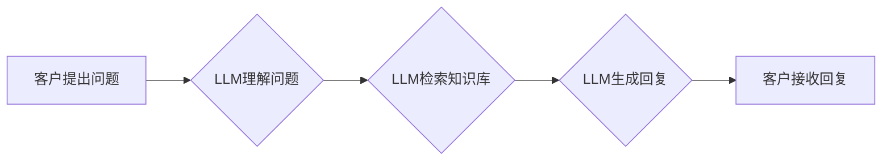

                 

## LLM对传统客户服务的革新

> 关键词：LLM, 大语言模型, 客户服务, 人工智能, 自动化, 聊天机器人, 自然语言处理, 效率提升

## 1. 背景介绍

随着科技的飞速发展，人工智能（AI）已渗透到生活的方方面面，其中大语言模型（LLM）作为AI领域的一颗璀璨明珠，展现出强大的潜力，正在深刻地改变着传统客户服务模式。传统客户服务模式往往依赖于人工客服，存在着响应速度慢、成本高、服务体验不佳等问题。而LLM的出现，为客户服务带来了全新的可能性，能够实现自动化、智能化、个性化的服务体验。

### 1.1 传统客户服务模式的局限性

传统客户服务模式主要依靠人工客服人员通过电话、邮件、在线聊天等方式与客户进行交互。这种模式存在着以下几个问题：

* **响应速度慢:** 人工客服人员需要排队接听电话、处理邮件，导致客户等待时间过长，影响客户体验。
* **成本高昂:** 雇佣和培训大量客服人员需要投入大量的资金，且人工成本不断上涨。
* **服务体验不佳:** 人工客服人员的知识水平和情绪状态会影响服务质量，难以满足客户个性化的需求。
* **工作效率低:** 客服人员重复处理相同问题，工作效率低下，难以应对突发事件。

### 1.2 LLM对客户服务的革新

LLM作为一种强大的自然语言处理（NLP）技术，能够理解和生成人类语言，具备以下优势：

* **24/7小时在线服务:** LLM可以随时随地为客户提供服务，无需人工值班，提高服务效率。
* **快速响应:** LLM能够快速理解客户问题并提供解决方案，缩短客户等待时间。
* **个性化服务:** LLM可以根据客户的历史记录和偏好，提供个性化的服务体验。
* **多语言支持:** LLM可以支持多种语言，满足全球客户的需求。
* **成本效益高:** LLM可以自动化处理大量客户请求，降低人工成本。

## 2. 核心概念与联系

LLM的核心概念是利用深度学习算法训练一个庞大的语言模型，使其能够理解和生成人类语言。LLM通过学习海量文本数据，掌握了语言的语法、语义和上下文关系，从而能够进行自然流畅的对话。

LLM与传统客户服务模式的联系在于，LLM可以作为客户服务系统的核心引擎，替代人工客服人员，实现自动化、智能化的客户服务。

**Mermaid 流程图**



## 3. 核心算法原理 & 具体操作步骤

### 3.1 算法原理概述

LLM的核心算法原理是基于Transformer架构的深度学习模型。Transformer模型通过自注意力机制，能够捕捉文本序列中的长距离依赖关系，从而实现更准确的语言理解和生成。

### 3.2 算法步骤详解

LLM训练过程主要包括以下步骤：

1. **数据预处理:** 收集海量文本数据，进行清洗、分词、标记等预处理操作。
2. **模型构建:** 基于Transformer架构构建深度学习模型，定义模型结构和参数。
3. **模型训练:** 利用预处理后的数据训练模型，通过反向传播算法优化模型参数。
4. **模型评估:** 使用测试数据评估模型性能，例如准确率、困惑度等指标。
5. **模型部署:** 将训练好的模型部署到服务器上，实现线上服务。

### 3.3 算法优缺点

**优点:**

* 能够理解和生成自然流畅的语言。
* 能够捕捉文本序列中的长距离依赖关系。
* 训练数据量越大，模型性能越好。

**缺点:**

* 训练成本高，需要大量的计算资源和时间。
* 模型参数量大，部署成本较高。
* 容易受到训练数据偏差的影响。

### 3.4 算法应用领域

LLM在客户服务领域具有广泛的应用场景，例如：

* **聊天机器人:** LLM可以构建智能聊天机器人，自动回答客户常见问题，提供24/7小时在线服务。
* **客服自动化:** LLM可以自动化处理客户的订单、退货、投诉等请求，提高客服效率。
* **个性化推荐:** LLM可以根据客户的历史记录和偏好，提供个性化的产品或服务推荐。
* **客户情绪分析:** LLM可以分析客户的语言表达，识别客户的情绪状态，提供更精准的服务。

## 4. 数学模型和公式 & 详细讲解 & 举例说明

### 4.1 数学模型构建

LLM的核心数学模型是Transformer模型，其主要结构包括编码器和解码器。编码器用于将输入文本序列编码成固定长度的向量表示，解码器则根据编码后的向量表示生成输出文本序列。

**Transformer模型结构**

```mermaid
graph LR
    A[输入层] --> B{编码器层}
    B --> C{解码器层]
    C --> D[输出层]
```

### 4.2 公式推导过程

Transformer模型的核心是自注意力机制，其计算公式如下：

$$
Attention(Q, K, V) = softmax(\frac{QK^T}{\sqrt{d_k}})V
$$

其中：

* $Q$：查询矩阵
* $K$：键矩阵
* $V$：值矩阵
* $d_k$：键向量的维度
* $softmax$：softmax函数

### 4.3 案例分析与讲解

假设我们有一个句子“我爱吃苹果”，将其编码成向量表示，然后使用自注意力机制计算每个词与其他词之间的注意力权重。

例如，“我”与“苹果”之间的注意力权重会比较高，因为它们在语义上相关。而“我”与“吃”之间的注意力权重也会比较高，因为它们在语法上相关。

## 5. 项目实践：代码实例和详细解释说明

### 5.1 开发环境搭建

LLM开发环境通常需要以下软件：

* Python编程语言
* TensorFlow或PyTorch深度学习框架
* CUDA和cuDNN加速库（用于GPU加速）

### 5.2 源代码详细实现

LLM的源代码实现较为复杂，需要大量的代码和参数配置。这里只提供一个简单的LLM聊天机器人代码示例：

```python
from transformers import AutoModelForCausalLM, AutoTokenizer

# 加载预训练模型和词典
model_name = "gpt2"
tokenizer = AutoTokenizer.from_pretrained(model_name)
model = AutoModelForCausalLM.from_pretrained(model_name)

# 用户输入
user_input = "你好"

# Token化输入
input_ids = tokenizer.encode(user_input, return_tensors="pt")

# 生成回复
output = model.generate(input_ids, max_length=50)

# 解码回复
response = tokenizer.decode(output[0], skip_special_tokens=True)

# 打印回复
print(response)
```

### 5.3 代码解读与分析

这段代码首先加载预训练的GPT-2模型和词典。然后，用户输入一个文本，该文本被转换为模型可以理解的token序列。模型根据输入序列生成一个回复，并将其解码回文本形式。

### 5.4 运行结果展示

运行这段代码后，模型会输出一个类似于“你好”的回复，表明模型已经成功理解了用户的输入并进行了相应的生成。

## 6. 实际应用场景

LLM在客户服务领域已经有很多实际应用场景，例如：

### 6.1 电商客服

电商平台可以使用LLM构建智能客服机器人，自动回答客户关于商品信息、订单状态、退换货等常见问题，提高客户服务效率。

### 6.2 金融客服

银行可以使用LLM构建智能客服机器人，帮助客户查询账户余额、转账、缴费等业务，提供24/7小时的金融服务。

### 6.3 医疗客服

医院可以使用LLM构建智能客服机器人，帮助患者预约挂号、查询医嘱、了解病情等信息，提高医疗服务效率。

### 6.4 未来应用展望

随着LLM技术的不断发展，其在客户服务领域的应用场景将会更加广泛，例如：

* **更个性化的服务:** LLM可以根据客户的个人喜好和需求，提供更个性化的服务体验。
* **更智能化的服务:** LLM可以学习客户的语言习惯和行为模式，提供更智能化的服务建议。
* **更跨平台的服务:** LLM可以整合多种客户服务渠道，提供更跨平台的客户服务体验。

## 7. 工具和资源推荐

### 7.1 学习资源推荐

* **课程:** Coursera、edX等平台提供深度学习和自然语言处理相关的课程。
* **书籍:** 《深度学习》、《自然语言处理》等书籍可以帮助读者深入了解LLM相关知识。
* **博客:** HuggingFace、OpenAI等机构的博客经常发布LLM相关的最新研究成果和应用案例。

### 7.2 开发工具推荐

* **TensorFlow:** Google开发的开源深度学习框架。
* **PyTorch:** Facebook开发的开源深度学习框架。
* **HuggingFace Transformers:** 提供预训练的LLM模型和工具库。

### 7.3 相关论文推荐

* **Attention Is All You Need:** https://arxiv.org/abs/1706.03762
* **BERT: Pre-training of Deep Bidirectional Transformers for Language Understanding:** https://arxiv.org/abs/1810.04805
* **GPT-3: Language Models are Few-Shot Learners:** https://arxiv.org/abs/2005.14165

## 8. 总结：未来发展趋势与挑战

### 8.1 研究成果总结

LLM在客户服务领域取得了显著的成果，能够实现自动化、智能化、个性化的服务体验。

### 8.2 未来发展趋势

LLM技术未来将朝着以下方向发展：

* **模型规模更大:** 模型参数量将继续增加，模型能力将进一步提升。
* **多模态理解:** LLM将能够理解多种模态数据，例如文本、图像、音频等。
* **更强的推理能力:** LLM将能够进行更复杂的推理和决策，提供更智能化的服务。

### 8.3 面临的挑战

LLM技术也面临着一些挑战：

* **数据安全和隐私:** LLM训练需要大量数据，如何保证数据安全和隐私是一个重要问题。
* **模型可解释性:** LLM的决策过程较为复杂，如何提高模型的可解释性是一个挑战。
* **伦理问题:** LLM可能被用于生成虚假信息或进行恶意攻击，如何解决伦理问题是一个需要认真思考的问题。

### 8.4 研究展望

未来，LLM技术将继续发展，在客户服务领域发挥更大的作用。研究者需要关注数据安全、模型可解释性和伦理问题，确保LLM技术能够安全、有效地应用于客户服务领域。

## 9. 附录：常见问题与解答

### 9.1 如何选择合适的LLM模型？

选择合适的LLM模型需要根据具体应用场景和需求进行考虑。例如，对于需要生成长文本的应用场景，可以选择GPT-3等生成式模型；对于需要进行文本分类或问答的应用场景，可以选择BERT等预训练模型。

### 9.2 如何训练自己的LLM模型？

训练自己的LLM模型需要大量的计算资源和数据。可以使用开源框架如TensorFlow或PyTorch进行训练。

### 9.3 如何部署LLM模型？

LLM模型可以部署到云服务器、边缘设备等平台。可以使用容器化技术进行部署，方便模型的管理和更新。


作者：禅与计算机程序设计艺术 / Zen and the Art of Computer Programming 
<end_of_turn>

