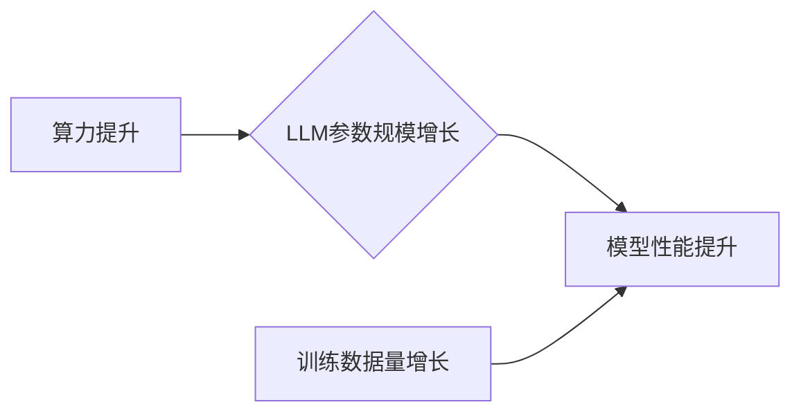

                 

## LLM是否会迎来自己的摩尔定律?

> 关键词：LLM, 摩尔定律, 算力, 参数规模, 训练数据, 性能提升, 发展趋势

## 1. 背景介绍

摩尔定律，即每隔两年，集成电路上的晶体管数量将翻倍，是半导体行业发展的重要驱动力。它预言了计算能力的指数级增长，推动了计算机技术飞速发展。近年来，大型语言模型（LLM）的兴起，为人工智能领域带来了前所未有的突破。这些模型拥有数十亿甚至数千亿的参数，能够理解和生成人类语言，展现出强大的文本处理能力。

然而，LLM的发展是否也会遵循类似摩尔定律的规律，其性能是否也会以指数级增长？这个问题引发了广泛的讨论和探索。

## 2. 核心概念与联系

### 2.1  LLM的本质

LLM本质上是一种基于深度学习的统计模型，通过学习海量文本数据，建立语言的概率分布，从而实现文本生成、翻译、摘要等任务。其核心在于参数规模和训练数据量。

### 2.2  摩尔定律的本质

摩尔定律描述的是集成电路技术发展趋势，其核心在于晶体管密度和性能的提升。随着工艺技术的进步，晶体管尺寸不断缩小，集成度不断提高，计算能力随之增强。

### 2.3  联系分析

LLM和摩尔定律虽然分别描述了不同领域的规律，但两者都体现了技术进步带来的指数级增长。

* **算力提升:** 摩尔定律驱动了算力的指数级增长，为训练越来越复杂的LLM提供了基础。
* **参数规模增长:** 随着算力的提升，LLM的参数规模也呈现指数级增长趋势，从而提升了模型的表达能力和性能。
* **训练数据量增长:** 数据是LLM训练的基石，随着互联网规模的扩大，训练数据的量也呈现指数级增长趋势。

**Mermaid 流程图:**



## 3. 核心算法原理 & 具体操作步骤

### 3.1  算法原理概述

LLM的核心算法是Transformer，它是一种基于注意力机制的深度神经网络架构。注意力机制能够让模型关注输入序列中最重要的部分，从而提高理解和生成文本的能力。

### 3.2  算法步骤详解

1. **词嵌入:** 将输入文本中的每个词转换为向量表示，捕捉词语的语义信息。
2. **多头注意力:** 利用多个注意力头，从不同角度关注输入序列中的词语关系，构建上下文信息。
3. **前馈神经网络:** 对每个词的上下文信息进行处理，提取更深层次的语义特征。
4. **位置编码:** 由于Transformer没有循环结构，无法捕捉词语的顺序信息，需要添加位置编码来表示词语在序列中的位置。
5. **解码器:** 基于编码器的输出，生成目标文本序列。

### 3.3  算法优缺点

**优点:**

* **强大的文本理解能力:** 注意力机制能够捕捉长距离依赖关系，提升文本理解能力。
* **并行训练效率高:** Transformer的架构适合并行训练，能够加速模型训练速度。

**缺点:**

* **参数规模庞大:** Transformer模型参数量巨大，需要大量的计算资源进行训练。
* **训练数据需求高:** 训练高质量的LLM需要海量文本数据。

### 3.4  算法应用领域

* **自然语言处理:** 文本生成、翻译、摘要、问答、对话系统等。
* **计算机视觉:** 图像字幕、图像识别、目标检测等。
* **语音识别:** 语音转文本、语音合成等。

## 4. 数学模型和公式 & 详细讲解 & 举例说明

### 4.1  数学模型构建

LLM的训练目标是最大化模型输出的文本概率，可以使用交叉熵损失函数来衡量模型性能。

**公式:**

$$
Loss = -\sum_{i=1}^{N} y_i \log(p(y_i|x_i))
$$

其中：

* $N$ 是文本序列长度。
* $y_i$ 是真实标签。
* $p(y_i|x_i)$ 是模型预测的概率。

### 4.2  公式推导过程

交叉熵损失函数的推导过程基于概率论和信息论的原理。其本质是衡量预测概率分布与真实概率分布之间的差异。

### 4.3  案例分析与讲解

假设我们训练一个LLM来预测下一个词，输入序列为“The cat sat on the”，真实标签为“mat”。模型预测概率为：

* “mat”: 0.8
* “cat”: 0.1
* “dog”: 0.1

则损失函数值为：

$$
Loss = - (1 \log(0.8) + 0 \log(0.1) + 0 \log(0.1)) = - \log(0.8)
$$

## 5. 项目实践：代码实例和详细解释说明

### 5.1  开发环境搭建

* Python 3.7+
* PyTorch 或 TensorFlow
* CUDA 和 cuDNN

### 5.2  源代码详细实现

```python
import torch
import torch.nn as nn

class Transformer(nn.Module):
    def __init__(self, vocab_size, embedding_dim, num_heads, num_layers):
        super(Transformer, self).__init__()
        # ... (定义编码器、解码器、注意力机制等模块)

    def forward(self, x):
        # ... (前向传播过程)
```

### 5.3  代码解读与分析

* `vocab_size`: 词汇表大小。
* `embedding_dim`: 词嵌入维度。
* `num_heads`: 注意力头的数量。
* `num_layers`: Transformer网络层数。

### 5.4  运行结果展示

训练完成后，可以使用模型对新的文本进行预测，例如生成续写文本或翻译文本。

## 6. 实际应用场景

* **聊天机器人:** LLM可以用于构建更智能、更自然的聊天机器人，能够理解用户意图并提供更精准的回复。
* **文本摘要:** LLM可以自动生成文本摘要，帮助用户快速了解文章内容。
* **机器翻译:** LLM可以实现高质量的机器翻译，突破语言障碍。

### 6.4  未来应用展望

* **个性化教育:** LLM可以根据学生的学习情况提供个性化的学习内容和辅导。
* **医疗诊断:** LLM可以辅助医生进行疾病诊断，提高诊断准确率。
* **代码生成:** LLM可以自动生成代码，提高开发效率。

## 7. 工具和资源推荐

### 7.1  学习资源推荐

* **书籍:**
    * 《深度学习》
    * 《自然语言处理》
* **在线课程:**
    * Coursera: 自然语言处理
    * edX: 深度学习

### 7.2  开发工具推荐

* **PyTorch:** 深度学习框架
* **TensorFlow:** 深度学习框架
* **Hugging Face Transformers:** 预训练LLM库

### 7.3  相关论文推荐

* 《Attention Is All You Need》
* 《BERT: Pre-training of Deep Bidirectional Transformers for Language Understanding》
* 《GPT-3: Language Models are Few-Shot Learners》

## 8. 总结：未来发展趋势与挑战

### 8.1  研究成果总结

LLM的发展取得了显著成果，在文本理解和生成方面展现出强大的能力。

### 8.2  未来发展趋势

* **模型规模进一步扩大:** 随着算力提升，LLM参数规模将继续扩大，模型能力将进一步增强。
* **多模态LLM:** 将文本、图像、音频等多种模态信息融合到LLM中，实现更全面的理解和生成能力。
* **可解释性增强:** 研究LLM的决策机制，提高模型的可解释性和可信度。

### 8.3  面临的挑战

* **训练成本高:** 训练大型LLM需要大量的计算资源和时间，成本很高。
* **数据偏见:** 训练数据可能存在偏见，导致模型输出结果存在偏差。
* **安全风险:** LLM可能被用于生成虚假信息、进行恶意攻击等，需要加强安全防护。

### 8.4  研究展望

未来，LLM研究将继续探索更强大的模型架构、更有效的训练方法、更安全的应用场景，推动人工智能技术向更智能、更安全、更普惠的方向发展。

## 9. 附录：常见问题与解答

* **什么是LLM？**

LLM是指大型语言模型，是一种基于深度学习的统计模型，能够理解和生成人类语言。

* **LLM的训练数据是什么？**

LLM的训练数据通常是海量文本数据，例如书籍、文章、网站内容等。

* **LLM有哪些应用场景？**

LLM的应用场景非常广泛，包括聊天机器人、文本摘要、机器翻译、代码生成等。

作者：禅与计算机程序设计艺术 / Zen and the Art of Computer Programming 


<end_of_turn>

