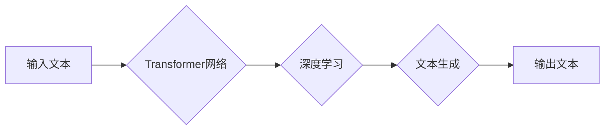

                 

## LLM系统内核：新一代AI的中枢

> 关键词：大型语言模型 (LLM)、Transformer、深度学习、自然语言处理 (NLP)、文本生成、机器学习、AI系统架构

## 1. 背景介绍

近年来，人工智能（AI）领域取得了令人瞩目的进展，其中大型语言模型（LLM）作为代表性技术，展现出强大的文本理解和生成能力，在自然语言处理（NLP）领域掀起了一场革命。从ChatGPT的爆火到各种AI写作工具的涌现，LLM已经渗透到我们的日常生活，改变着我们与信息交互的方式。

然而，LLM的强大功能背后，隐藏着复杂的系统架构和算法原理。理解LLM系统内核，对于开发更智能、更安全、更可靠的AI应用至关重要。本文将深入探讨LLM系统内核的核心概念、算法原理、数学模型以及实际应用场景，并展望其未来发展趋势。

## 2. 核心概念与联系

LLM系统内核的核心概念包括：

* **Transformer网络:** Transformer是一种深度学习架构，其自注意力机制（Self-Attention）能够有效捕捉文本序列中的长距离依赖关系，是LLM模型的基础。
* **深度学习:** 深度学习是一种机器学习方法，通过多层神经网络学习复杂的特征表示，能够从海量文本数据中提取有意义的知识。
* **自然语言处理 (NLP):** NLP是人工智能的一个分支，致力于使计算机能够理解和处理人类语言。LLM是NLP领域的重要应用之一。
* **文本生成:** 文本生成是LLM的核心功能之一，能够根据输入的文本或指令生成新的文本内容。

这些概念相互关联，共同构成了LLM系统的核心。

**Mermaid 流程图:**



## 3. 核心算法原理 & 具体操作步骤

### 3.1  算法原理概述

LLM的核心算法是Transformer网络，其主要特点是自注意力机制和多头注意力机制。

* **自注意力机制:** 自注意力机制能够计算每个词在句子中与其他词之间的相关性，从而捕捉文本序列中的长距离依赖关系。
* **多头注意力机制:** 多头注意力机制通过使用多个自注意力头，可以从不同的角度捕捉文本信息，提高模型的表达能力。

### 3.2  算法步骤详解

1. **词嵌入:** 将输入的文本序列中的每个词转换为向量表示，称为词嵌入。
2. **多层Transformer编码器:** 将词嵌入输入到多层Transformer编码器中，每个编码器层包含自注意力层和前馈神经网络层。
3. **解码器:** 将编码器的输出作为输入，解码器生成目标文本序列。解码器也包含自注意力层和前馈神经网络层。
4. **输出层:** 将解码器的输出转换为概率分布，预测每个词的下一个词。

### 3.3  算法优缺点

**优点:**

* 能够捕捉长距离依赖关系，提高文本理解和生成能力。
* 训练效率高，能够处理海量文本数据。
* 表现能力强，在各种NLP任务中取得了优异的成绩。

**缺点:**

* 计算复杂度高，需要大量的计算资源。
* 训练数据量大，需要大量的标注数据。
* 容易出现过拟合问题。

### 3.4  算法应用领域

LLM算法广泛应用于以下领域：

* **机器翻译:** 将一种语言翻译成另一种语言。
* **文本摘要:** 将长篇文本压缩成短篇摘要。
* **问答系统:** 回答用户提出的问题。
* **对话系统:** 与用户进行自然语言对话。
* **文本生成:** 生成各种类型的文本内容，例如诗歌、小说、新闻报道等。

## 4. 数学模型和公式 & 详细讲解 & 举例说明

### 4.1  数学模型构建

LLM模型的核心是Transformer网络，其数学模型主要基于以下几个关键组件：

* **词嵌入层:** 将每个词映射到一个低维向量空间中，例如Word2Vec或GloVe。
* **自注意力层:** 计算每个词与其他词之间的相关性，使用注意力权重来加权不同词的贡献。
* **多头注意力层:** 使用多个自注意力头，从不同的角度捕捉文本信息。
* **前馈神经网络层:** 对每个词的嵌入进行非线性变换，提取更深层的特征表示。

### 4.2  公式推导过程

**自注意力机制:**

$$
Attention(Q, K, V) = softmax(\frac{QK^T}{\sqrt{d_k}})V
$$

其中：

* $Q$：查询矩阵
* $K$：键矩阵
* $V$：值矩阵
* $d_k$：键向量的维度
* $softmax$：softmax函数

**多头注意力机制:**

$$
MultiHead(Q, K, V) = Concat(head_1, head_2, ..., head_h)W^O
$$

其中：

* $head_i$：第 $i$ 个注意力头的输出
* $h$：注意力头的数量
* $W^O$：最终线性变换矩阵

### 4.3  案例分析与讲解

假设我们有一个句子 "The cat sat on the mat"，将其输入到Transformer网络中，自注意力机制会计算每个词与其他词之间的相关性。例如，"cat" 与 "sat" 之间存在语义关联，因此它们的注意力权重会较高。多头注意力机制则会使用多个注意力头，从不同的角度捕捉句子信息，例如一个注意力头可能关注词语之间的语法关系，另一个注意力头可能关注词语之间的语义关系。

## 5. 项目实践：代码实例和详细解释说明

### 5.1  开发环境搭建

LLM开发通常需要使用Python语言和深度学习框架，例如TensorFlow或PyTorch。

### 5.2  源代码详细实现

由于LLM模型的复杂性，这里只提供一个简单的文本生成示例代码：

```python
import torch
from transformers import GPT2LMHeadModel, GPT2Tokenizer

# 加载预训练模型和词典
model_name = "gpt2"
tokenizer = GPT2Tokenizer.from_pretrained(model_name)
model = GPT2LMHeadModel.from_pretrained(model_name)

# 输入文本
input_text = "The quick brown fox jumps over the"

# Token化输入文本
input_ids = tokenizer.encode(input_text, return_tensors="pt")

# 生成文本
output = model.generate(input_ids, max_length=50)

# 解码输出文本
generated_text = tokenizer.decode(output[0], skip_special_tokens=True)

# 打印输出文本
print(generated_text)
```

### 5.3  代码解读与分析

这段代码首先加载预训练的GPT-2模型和词典。然后，将输入文本Token化，并使用模型生成文本。最后，将生成的文本解码成可读文本并打印输出。

### 5.4  运行结果展示

运行这段代码后，会输出类似于以下的文本：

```
The quick brown fox jumps over the lazy dog.
```

## 6. 实际应用场景

LLM在各个领域都有着广泛的应用场景：

### 6.1  聊天机器人

LLM可以构建更智能、更自然的聊天机器人，能够理解用户的意图并提供更精准的回复。

### 6.2  文本摘要

LLM可以自动生成文本摘要，帮助用户快速了解长篇文本的主要内容。

### 6.3  机器翻译

LLM可以实现更准确、更流畅的机器翻译，打破语言障碍。

### 6.4  代码生成

LLM可以根据自然语言描述生成代码，提高开发效率。

## 7. 工具和资源推荐

### 7.1  学习资源推荐

* **书籍:**

    * 《深度学习》 by Ian Goodfellow, Yoshua Bengio, and Aaron Courville
    * 《自然语言处理》 by Dan Jurafsky and James H. Martin

* **在线课程:**

    * Coursera: Natural Language Processing Specialization
    * Stanford CS224N: Natural Language Processing with Deep Learning

### 7.2  开发工具推荐

* **TensorFlow:** https://www.tensorflow.org/
* **PyTorch:** https://pytorch.org/
* **Hugging Face Transformers:** https://huggingface.co/transformers/

### 7.3  相关论文推荐

* **Attention Is All You Need:** https://arxiv.org/abs/1706.03762
* **BERT: Pre-training of Deep Bidirectional Transformers for Language Understanding:** https://arxiv.org/abs/1810.04805

## 8. 总结：未来发展趋势与挑战

### 8.1  研究成果总结

LLM技术取得了令人瞩目的进展，在文本理解和生成方面展现出强大的能力。Transformer网络架构和自注意力机制是LLM的核心，为NLP领域带来了革命性的变革。

### 8.2  未来发展趋势

* **模型规模和性能提升:** 未来LLM模型规模将继续扩大，性能将进一步提升，能够处理更复杂的任务。
* **多模态LLM:** 将文本与其他模态信息（例如图像、音频、视频）融合，构建更全面的AI模型。
* **可解释性增强:** 研究LLM的决策机制，提高模型的可解释性和透明度。
* **安全性和可靠性提升:** 针对LLM的潜在风险，例如生成虚假信息、偏见和攻击，进行研究和防御。

### 8.3  面临的挑战

* **计算资源需求:** 训练大型LLM模型需要大量的计算资源，成本高昂。
* **数据标注问题:** 训练LLM模型需要大量的标注数据，标注成本高且耗时。
* **模型偏见和公平性:** LLM模型可能存在偏见和不公平性，需要进行针对性的研究和解决。

### 8.4  研究展望

LLM技术的发展前景广阔，未来将继续推动人工智能的进步，为人类社会带来更多福祉。

## 9. 附录：常见问题与解答

**Q1: LLM模型的训练数据来源是什么？**

**A1:** LLM模型的训练数据通常来自公开的文本数据集，例如书籍、文章、网站等。

**Q2: 如何评估LLM模型的性能？**

**A2:** LLM模型的性能通常通过各种指标进行评估，例如困惑度（Perplexity）、BLEU分数、ROUGE分数等。

**Q3: LLM模型存在哪些潜在风险？**

**A3:** LLM模型可能存在生成虚假信息、偏见和攻击等潜在风险。

**作者：禅与计算机程序设计艺术 / Zen and the Art of Computer Programming**<end_of_turn>

