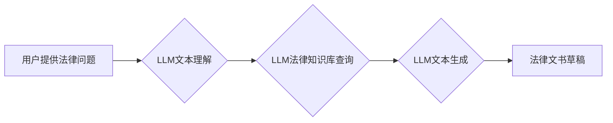

                 

## LLM辅助法律文书起草：提高法律工作效率

> 关键词：LLM, 法律文书, AI, 自然语言处理, 法律科技, 文书生成, 效率提升, 法律服务

## 1. 背景介绍

法律行业一直以来都以其繁琐的流程、大量的文书工作和对精细度的要求而著称。律师和法务人员需要花费大量时间和精力来撰写合同、诉状、法律意见书等各种法律文书，这不仅耗费人力成本，也可能导致效率低下和错误产生。近年来，随着人工智能（AI）技术的快速发展，特别是大型语言模型（LLM）的出现，为法律文书起草带来了新的可能性。LLM 凭借其强大的文本理解和生成能力，能够有效辅助律师和法务人员完成法律文书的起草工作，提高工作效率，降低成本，并提升法律服务的质量。

## 2. 核心概念与联系

### 2.1  LLM概述

大型语言模型（LLM）是一种基于深度学习的强大人工智能模型，能够理解和生成人类语言。它们通过训练海量文本数据，学习语言的语法、语义和上下文关系，从而具备强大的文本处理能力。

### 2.2  法律文书起草

法律文书起草是法律工作中一项重要的任务，涉及到合同、诉状、法律意见书、法律法规解释等多种类型。这些文书需要准确、清晰、规范地表达法律概念和条款，并符合相关法律法规的要求。

### 2.3  LLM与法律文书起草的联系

LLM 可以通过以下方式辅助法律文书起草：

* **文本生成:** LLM 可以根据用户提供的法律问题、案例信息和相关法律法规，自动生成法律文书的草稿。
* **文本修改:** LLM 可以对用户已有的法律文书进行修改和完善，例如纠正语法错误、优化语言表达、添加法律条款等。
* **文本摘要:** LLM 可以对长篇法律文书进行摘要，提取关键信息，方便用户快速了解文书内容。
* **法律法规查询:** LLM 可以根据用户提供的法律问题，自动查询相关法律法规，并提供相应的法律解释。

**Mermaid 流程图**



## 3. 核心算法原理 & 具体操作步骤

### 3.1  算法原理概述

LLM 辅助法律文书起草的核心算法原理是基于 Transformer 架构的深度学习模型。Transformer 模型通过自注意力机制，能够捕捉文本中的长距离依赖关系，从而实现更准确的文本理解和生成。

### 3.2  算法步骤详解

1. **数据预处理:** 将法律文书数据进行清洗、格式化和分词等预处理操作，以便模型训练和使用。
2. **模型训练:** 使用 Transformer 架构的深度学习模型，训练 LLMs，使其能够理解和生成法律文本。训练数据通常包括大量的法律文书、法律法规和法律案例。
3. **文本理解:** 当用户提供法律问题或文书需求时，LLM 会首先对输入文本进行理解，提取关键信息和语义。
4. **法律知识库查询:** LLM 会根据理解到的信息，查询相关的法律知识库，获取法律法规、案例判例和专业术语等信息。
5. **文本生成:** LLM 会根据用户需求、理解到的信息和查询到的法律知识，生成相应的法律文书草稿。
6. **文本优化:** LLM 可以对生成的草稿进行优化，例如纠正语法错误、调整语言表达、添加法律条款等。

### 3.3  算法优缺点

**优点:**

* **提高效率:** 自动化法律文书起草，节省律师和法务人员的时间和精力。
* **降低成本:** 减少人工成本，提高法律服务的经济效益。
* **提升质量:** 减少人为错误，提高法律文书的准确性和规范性。
* **个性化服务:** 根据用户需求定制法律文书，提供更精准的法律服务。

**缺点:**

* **数据依赖:** LLM 的性能取决于训练数据的质量和数量。
* **法律专业知识:** LLM 缺乏对法律专业知识的深度理解，需要与法律专家合作。
* **伦理风险:** LLM 生成的法律文书可能存在偏差或错误，需要进行严格的审核和监管。

### 3.4  算法应用领域

LLM 辅助法律文书起草的应用领域广泛，包括：

* **合同起草:** 自动生成各种类型的合同，例如买卖合同、租赁合同、服务合同等。
* **诉状起草:** 根据案件信息，自动生成诉状、答辩状、申诉状等法律文书。
* **法律意见书:** 根据法律问题，自动生成法律意见书，提供法律分析和建议。
* **法律法规解释:** 根据用户提供的法律问题，自动查询相关法律法规，并提供相应的法律解释。

## 4. 数学模型和公式 & 详细讲解 & 举例说明

### 4.1  数学模型构建

LLM 的核心数学模型是 Transformer 架构，它基于自注意力机制，能够捕捉文本中的长距离依赖关系。Transformer 模型由以下主要部分组成：

* **编码器:** 将输入文本序列编码成向量表示。
* **解码器:** 根据编码后的向量表示，生成输出文本序列。
* **自注意力机制:** 用于捕捉文本中词语之间的关系，提高模型的理解能力。

### 4.2  公式推导过程

Transformer 模型的数学公式推导过程较为复杂，涉及到线性变换、激活函数、注意力机制等多个方面。

**自注意力机制公式:**

$$
Attention(Q, K, V) = \frac{exp(Q \cdot K^T / \sqrt{d_k})}{exp(Q \cdot K^T / \sqrt{d_k})} \cdot V
$$

其中：

* $Q$：查询矩阵
* $K$：键矩阵
* $V$：值矩阵
* $d_k$：键向量的维度

### 4.3  案例分析与讲解

假设我们想要使用 LLM 生成一个简单的合同草稿，用户输入的信息包括：

* **甲方:** 张三
* **乙方:** 李四
* **货物:** 100 台电脑
* **价格:** 1000 元/台

LLM 会首先将这些信息编码成向量表示，然后通过自注意力机制捕捉词语之间的关系，例如“张三”和“甲方”是同一个人，“100 台电脑”和“价格”是相关的。最后，LLM 会根据编码后的信息和训练数据中的合同模板，生成一个简单的合同草稿。

## 5. 项目实践：代码实例和详细解释说明

### 5.1  开发环境搭建

LLM 辅助法律文书起草的项目开发环境通常需要以下软件和工具：

* **Python:** 作为主要的编程语言
* **深度学习框架:** 例如 TensorFlow 或 PyTorch
* **自然语言处理库:** 例如 NLTK 或 spaCy
* **数据库:** 用于存储法律文书数据和法律知识库
* **云计算平台:** 例如 AWS 或 Google Cloud

### 5.2  源代码详细实现

由于篇幅限制，这里只提供一个简单的代码示例，展示如何使用 LLM 生成法律文书的草稿：

```python
from transformers import pipeline

# 加载预训练的 LLM 模型
generator = pipeline("text-generation", model="gpt2")

# 用户输入的法律问题
prompt = "请生成一份简单的租赁合同草稿，甲方为张三，乙方为李四，租赁房屋面积为100平方米，租赁期限为一年。"

# 使用 LLM 生成合同草稿
response = generator(prompt, max_length=200, num_return_sequences=1)

# 打印生成的合同草稿
print(response[0]['generated_text'])
```

### 5.3  代码解读与分析

这段代码使用 HuggingFace 的 Transformers 库加载了一个预训练的 GPT-2 模型，并使用 `pipeline` 函数将其转换为文本生成任务的模型。用户输入的法律问题作为 `prompt` 参数，模型会根据输入信息生成一个简单的租赁合同草稿。

### 5.4  运行结果展示

运行这段代码后，会输出一个简单的租赁合同草稿，例如：

```
租赁合同

甲方：张三

乙方：李四

租赁房屋面积：100平方米

租赁期限：一年

...
```

## 6. 实际应用场景

LLM 辅助法律文书起草已经开始在一些法律服务机构和企业中得到应用，例如：

* **律师事务所:** 使用 LLM 自动生成合同、诉状等法律文书，提高律师的工作效率。
* **法务部门:** 使用 LLM 辅助法律法规查询、法律意见书撰写等工作，降低法务成本。
* **在线法律服务平台:** 使用 LLM 提供在线法律咨询、合同模板生成等服务，方便大众获取法律服务。

### 6.4  未来应用展望

随着 LLM 技术的不断发展，其在法律文书起草领域的应用前景更加广阔。未来，LLM 可能能够：

* **更精准地理解法律问题:** 通过更深入的法律知识库和语义理解能力，LLM 可以更精准地理解用户的法律问题，并生成更符合需求的法律文书。
* **自动完成更复杂的法律文书:** LLM 可以学习和生成更复杂的法律文书，例如诉讼答辩书、判决书等。
* **提供个性化法律服务:** LLM 可以根据用户的具体情况和需求，提供个性化的法律文书和法律建议。

## 7. 工具和资源推荐

### 7.1  学习资源推荐

* **HuggingFace Transformers:** https://huggingface.co/docs/transformers/index
* **OpenAI GPT-3 API:** https://openai.com/api/
* **Stanford NLP Group:** https://nlp.stanford.edu/

### 7.2  开发工具推荐

* **Python:** https://www.python.org/
* **TensorFlow:** https://www.tensorflow.org/
* **PyTorch:** https://pytorch.org/

### 7.3  相关论文推荐

* **BERT: Pre-training of Deep Bidirectional Transformers for Language Understanding:** https://arxiv.org/abs/1810.04805
* **GPT-3: Language Models are Few-Shot Learners:** https://arxiv.org/abs/2005.14165
* **T5: Text-to-Text Transfer Transformer:** https://arxiv.org/abs/1910.10683

## 8. 总结：未来发展趋势与挑战

### 8.1  研究成果总结

LLM 辅助法律文书起草是一个新兴的领域，取得了显著的进展。LLM 模型能够有效理解和生成法律文本，提高法律文书起草的效率和质量。

### 8.2  未来发展趋势

未来，LLM 辅助法律文书起草的发展趋势包括：

* **模型性能提升:** 随着训练数据的增加和模型架构的改进，LLM 的法律文本理解和生成能力将进一步提升。
* **法律知识库完善:** 建立更完善的法律知识库，能够支持 LLMs 更好地理解和应用法律法规。
* **个性化服务:** LLMs 将能够根据用户的具体情况和需求，提供更个性化的法律文书和法律建议。

### 8.3  面临的挑战

LLM 辅助法律文书起草也面临着一些挑战：

* **数据安全和隐私:** 法律文书通常包含敏感信息，需要确保数据安全和隐私。
* **法律责任:** LLM 生成的法律文书可能存在偏差或错误，需要明确法律责任归属。
* **伦理问题:** LLM 的应用可能带来一些伦理问题，例如算法偏见、信息操控等，需要进行伦理规范和监管。

### 8.4  研究展望

未来，LLM 辅助法律文书起草的研究方向包括：

* **开发更安全、更可靠的 LLMs:** 研究更安全的模型架构和训练方法，降低 LLMs 产生偏差或错误的风险。
* **建立更完善的法律知识库:** 探索新的方法和技术，构建更全面、更准确的法律知识库。
* **研究 LLMs 在法律领域的伦理问题:** 探讨 LLMs 应用带来的伦理问题，并制定相应的规范和监管机制。

## 9. 附录：常见问题与解答

**常见问题:**

* **LLM 是否能够完全替代律师？**

**解答:** 目前，LLM 只能辅助律师完成法律文书起草等工作，无法完全替代律师。律师需要根据 LLMs 生成的草稿进行审核、修改和最终确认，并提供专业的法律建议和服务。

* **LLM 生成的法律文书是否合法有效？**

**解答:** LLM 生成的法律文书需要由律师进行审核和修改，才能保证其合法有效性。LLM 只是一个工具，不能替代律师的专业判断和法律责任。

* **如何确保 LLMs 的数据安全和隐私？**

**解答:** 使用 LLMs 辅助法律文书起草时，需要采取相应的安全措施，例如数据加密、访问控制等，确保法律文书数据的安全和隐私。

**作者：禅与计算机程序设计艺术 / Zen and the Art of Computer Programming**<end_of_turn>

