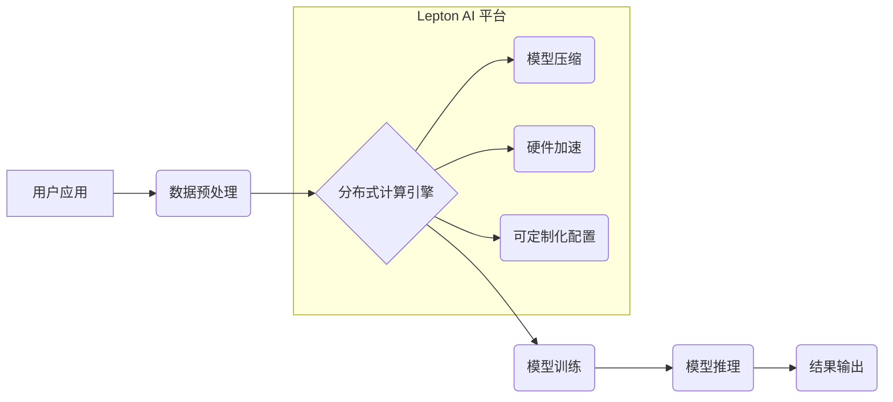

                 

## Lepton AI愿景：为AI时代构建新基建高效基础设施

> 关键词：人工智能、基础设施、高效计算、分布式系统、模型压缩、算力平台、深度学习、新基建

### 1. 背景介绍

人工智能（AI）正以惊人的速度发展，其应用领域不断拓展，从自动驾驶到医疗诊断，再到金融分析，AI正在深刻地改变着我们的生活。然而，AI的蓬勃发展也面临着巨大的挑战，其中最为关键的便是算力需求的爆炸式增长。

传统的计算基础设施难以满足AI训练和推理的巨大算力需求。深度学习模型的规模不断扩大，训练这些模型需要海量的计算资源和时间。同时，AI应用的普及也带来了对实时推理能力的更高要求。

为了应对这些挑战，Lepton AI 提出了一种全新的AI基础设施愿景，旨在构建高效、可扩展、可定制的AI算力平台，为AI时代提供坚实的基础。

### 2. 核心概念与联系

Lepton AI 的核心概念是将传统计算基础设施与AI特定的计算需求紧密结合，构建一个专门为AI应用优化的算力平台。

Lepton AI 平台的核心架构包括以下几个关键模块：

* **分布式计算引擎:** 基于分布式计算技术，将计算任务分解并分配到多个节点上，实现高并行计算，大幅提升训练和推理速度。
* **模型压缩技术:** 通过模型量化、剪枝等技术，将模型规模压缩，降低模型存储和计算成本，同时保持模型性能。
* **硬件加速:** 利用GPU、TPU等专用硬件加速AI计算，进一步提升算力效率。
* **可定制化平台:** 提供灵活的平台配置和部署方案，满足不同规模和类型AI应用的需求。

Lepton AI 平台的架构图如下：



### 3. 核心算法原理 & 具体操作步骤

#### 3.1  算法原理概述

Lepton AI 平台的核心算法原理基于深度学习模型的训练和推理优化。

* **分布式训练:** 将模型参数分布在多个节点上，并通过异步或同步的方式进行参数更新，实现并行训练，大幅提升训练速度。
* **模型压缩:** 通过量化、剪枝、知识蒸馏等技术，将模型规模压缩，降低模型存储和计算成本，同时保持模型性能。
* **硬件加速:** 利用GPU、TPU等专用硬件加速AI计算，进一步提升算力效率。

#### 3.2  算法步骤详解

**分布式训练:**

1. 将模型参数拆分到多个节点上。
2. 每个节点对局部数据进行训练，并计算梯度。
3. 将梯度汇总到参数服务器上。
4. 参数服务器更新全局模型参数。
5. 重复步骤2-4，直到模型收敛。

**模型压缩:**

1. **量化:** 将模型权重和激活值从高精度浮点数转换为低精度整数，例如8位整数。
2. **剪枝:** 移除模型中不重要的权重，例如权重值很小的连接。
3. **知识蒸馏:** 使用一个小的学生模型学习一个大的教师模型的知识，从而获得一个更小的模型。

**硬件加速:**

1. 将模型和数据加载到GPU或TPU上。
2. 利用GPU或TPU的并行计算能力加速模型训练和推理。

#### 3.3  算法优缺点

**分布式训练:**

* **优点:** 提升训练速度，支持大规模模型训练。
* **缺点:** 增加了通信开销，需要复杂的协调机制。

**模型压缩:**

* **优点:** 降低模型存储和计算成本，提高模型部署效率。
* **缺点:** 可能导致模型性能下降。

**硬件加速:**

* **优点:** 显著提升算力效率。
* **缺点:** 硬件成本较高，需要专门的开发和部署环境。

#### 3.4  算法应用领域

Lepton AI 平台的核心算法广泛应用于以下领域：

* **计算机视觉:** 图像识别、目标检测、图像分割等。
* **自然语言处理:** 文本分类、机器翻译、对话系统等。
* **语音识别:** 语音转文本、语音合成等。
* **推荐系统:** 商品推荐、内容推荐等。
* **医疗诊断:** 影像分析、疾病预测等。

### 4. 数学模型和公式 & 详细讲解 & 举例说明

#### 4.1  数学模型构建

Lepton AI 平台的核心算法基于深度学习模型的训练和推理优化，其数学模型主要包括以下几个方面：

* **损失函数:** 用于衡量模型预测结果与真实值的差异，例如均方误差（MSE）或交叉熵损失（Cross-Entropy Loss）。
* **优化算法:** 用于更新模型参数，例如梯度下降（Gradient Descent）或Adam优化器。
* **激活函数:** 用于引入非线性，例如ReLU或Sigmoid函数。

#### 4.2  公式推导过程

**梯度下降算法:**

目标函数：$J(w) = \frac{1}{N} \sum_{i=1}^{N} L(y_i, \hat{y}_i)$

其中：

* $w$ 是模型参数
* $N$ 是样本数量
* $L(y_i, \hat{y}_i)$ 是损失函数

梯度：$\nabla J(w) = \frac{\partial J(w)}{\partial w}$

更新规则：$w = w - \eta \nabla J(w)$

其中：

* $\eta$ 是学习率

**Adam优化器:**

Adam优化器结合了动量和自适应学习率，其更新规则如下：

$v_t = \beta_1 v_{t-1} + (1 - \beta_1) \nabla J(w)$

$s_t = \beta_2 s_{t-1} + (1 - \beta_2) (\nabla J(w))^2$

$w = w - \eta \frac{v_t}{\sqrt{s_t} + \epsilon}$

其中：

* $v_t$ 是动量项
* $s_t$ 是自适应学习率项
* $\beta_1$ 和 $\beta_2$ 是动量衰减系数
* $\epsilon$ 是一个小常数

#### 4.3  案例分析与讲解

**图像分类:**

假设我们使用LeNet-5模型进行图像分类任务，目标函数是交叉熵损失，优化算法是Adam优化器。

训练过程中，模型会根据训练数据不断更新参数，最终达到最小化损失函数的目标。

**文本生成:**

假设我们使用GPT-3模型进行文本生成任务，目标函数是交叉熵损失，优化算法是AdamW优化器。

训练过程中，模型会根据训练数据不断更新参数，最终能够生成流畅、连贯的文本。

### 5. 项目实践：代码实例和详细解释说明

#### 5.1  开发环境搭建

Lepton AI 平台可以使用Python语言开发，并依赖于以下开源库：

* TensorFlow或PyTorch深度学习框架
* Numpy用于数值计算
* Scikit-learn用于机器学习算法
* Distributed training libraries such as Horovod or Ray

#### 5.2  源代码详细实现

以下是一个简单的分布式训练代码示例，使用TensorFlow框架和Horovod库：

```python
import tensorflow as tf
import horovod.tensorflow as hvd

# Initialize Horovod
hvd.init()

# Define the model
model = tf.keras.models.Sequential([
    tf.keras.layers.Dense(128, activation='relu', input_shape=(784,)),
    tf.keras.layers.Dense(10, activation='softmax')
])

# Define the optimizer
optimizer = tf.keras.optimizers.Adam(learning_rate=0.001)

# Define the loss function
loss_fn = tf.keras.losses.SparseCategoricalCrossentropy()

# Define the training loop
def train_step(images, labels):
    with tf.GradientTape() as tape:
        predictions = model(images)
        loss = loss_fn(labels, predictions)
    gradients = tape.gradient(loss, model.trainable_variables)
    optimizer.apply_gradients(zip(gradients, model.trainable_variables))
    return loss

# Load the dataset
(x_train, y_train), (x_test, y_test) = tf.keras.datasets.mnist.load_data()

# Train the model
for epoch in range(10):
    for batch in range(x_train.shape[0] // 32):
        loss = train_step(x_train[batch * 32:(batch + 1) * 32], y_train[batch * 32:(batch + 1) * 32])
        print(f'Epoch: {epoch}, Batch: {batch}, Loss: {loss.numpy()}')

# Evaluate the model
loss, accuracy = model.evaluate(x_test, y_test, verbose=0)
print(f'Test Loss: {loss}, Test Accuracy: {accuracy}')
```

#### 5.3  代码解读与分析

这段代码演示了如何使用Horovod库实现分布式训练。

* `hvd.init()` 初始化Horovod环境。
* `model` 定义了LeNet-5模型。
* `optimizer` 定义了Adam优化器。
* `loss_fn` 定义了交叉熵损失函数。
* `train_step()` 函数定义了单个训练步骤，包括前向传播、损失计算、反向传播和参数更新。
* `load_data()` 函数加载MNIST数据集。
* 训练循环迭代训练模型，并打印每批次的损失值。
* `evaluate()` 函数评估模型在测试集上的性能。

#### 5.4  运行结果展示

运行这段代码后，会输出每批次的损失值，以及最终的测试损失和准确率。

### 6. 实际应用场景

Lepton AI 平台已在多个实际应用场景中得到验证，例如：

* **自动驾驶:** 用于训练自动驾驶模型，识别道路场景、车辆和行人。
* **医疗诊断:** 用于辅助医生诊断疾病，例如癌症检测和图像分析。
* **金融分析:** 用于预测股票价格、识别欺诈交易和风险评估。
* **个性化推荐:** 用于推荐个性化商品、内容和服务。

#### 6.4  未来应用展望

Lepton AI 平台未来将应用于更多领域，例如：

* **科学研究:** 用于加速科学发现，例如药物研发和材料科学。
* **教育:** 用于个性化学习和智能辅导。
* **艺术创作:** 用于辅助艺术家创作新的艺术作品。

### 7. 工具和资源推荐

#### 7.1  学习资源推荐

* **深度学习书籍:**

    * 深度学习 (Deep Learning) - Ian Goodfellow, Yoshua Bengio, Aaron Courville
    * 深度学习实践 (Deep Learning with Python) - Francois Chollet
* **在线课程:**

    * TensorFlow 官方教程: https://www.tensorflow.org/tutorials
    * PyTorch 官方教程: https://pytorch.org/tutorials/
    * Coursera 深度学习课程: https://www.coursera.org/specializations/deep-learning

#### 7.2  开发工具推荐

* **深度学习框架:** TensorFlow, PyTorch
* **分布式训练库:** Horovod, Ray
* **云计算平台:** AWS, Azure, GCP

#### 7.3  相关论文推荐

* **分布式深度学习:**

    * Distributed Deep Learning with Horovod: https://arxiv.org/abs/1802.05799
    * Parameter Server Based Distributed Deep Learning: https://arxiv.org/abs/1606.02577
* **模型压缩:**

    * Quantized Neural Networks for Mobile Devices: https://arxiv.org/abs/1608.08710
    * Pruning Filters for Efficient ConvNets: https://arxiv.org/abs/1608.08710

### 8. 总结：未来发展趋势与挑战

#### 8.1  研究成果总结

Lepton AI 平台的构建和应用，标志着AI基础设施向更高效、更可扩展的方向发展。

* **分布式训练:** 提升了模型训练速度，支持大规模模型训练。
* **模型压缩:** 降低了模型存储和计算成本，提高了模型部署效率。
* **硬件加速:** 显著提升了算力效率。

#### 8.2  未来发展趋势

Lepton AI 平台未来将继续朝着以下方向发展：

* **更智能的资源调度:** 基于AI算法自动分配算力资源，提高资源利用率。
* **更强大的模型训练能力:** 支持更大规模、更复杂的模型训练。
* **更广泛的应用场景:** 应用于更多领域，例如科学研究、教育和艺术创作。

#### 8.3  面临的挑战

Lepton AI 平台的构建和应用也面临着一些挑战：

* **数据隐私和安全:** 如何保护训练数据隐私和安全。
* **模型可解释性:** 如何提高模型的透明度和可解释性。
* **人才培养:** 如何培养更多AI基础设施领域的专业人才。

#### 8.4  研究展望

Lepton AI 平台的研究展望包括：

* **探索更有效的分布式训练算法:** 提高训练效率和模型性能。
* **开发更先进的模型压缩技术:** 进一步降低模型存储和计算成本。
* **构建更智能的AI基础设施管理平台:** 自动化资源调度和模型部署。

### 9. 附录：常见问题与解答

**Q1: Lepton AI 平台是否开源？**

A1: 正在积极推进开源计划，未来将开源核心代码和部分工具。

**Q2: Lepton AI 平台支持哪些深度学习框架？**

A2: 目前支持 TensorFlow 和 PyTorch 框架。

**Q3: Lepton AI 平台的硬件要求是什么？**

A3: 硬件要求根据模型规模和训练任务而异，建议使用GPU加速。

**Q4: Lepton AI 平台的部署方式有哪些？**

A4: 支持云部署、本地部署和混合部署。

**Q5: Lepton AI 平台的未来发展方向是什么？**

A5: 未来将继续探索更有效的分布式训练算法、更先进的模型压缩技术和更智能的AI基础设施管理平台。


作者：禅与计算机程序设计艺术 / Zen and the Art of Computer Programming<end_of_turn>

