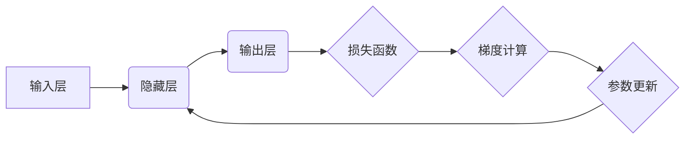

                 

## Micrograd：理解机器学习和反向传播

> 关键词：机器学习、反向传播、微分、梯度下降、神经网络、优化算法、深度学习

## 1. 背景介绍

机器学习近年来蓬勃发展，其核心在于训练模型以从数据中学习规律，并做出预测或决策。反向传播算法是机器学习中训练神经网络的关键算法，它通过计算误差梯度来调整模型参数，从而不断优化模型性能。

然而，许多机器学习入门者对反向传播算法的原理感到困惑。本文将以简洁易懂的语言，结合代码实例和数学公式，深入浅出地讲解反向传播算法，帮助读者理解其核心概念和工作机制。

## 2. 核心概念与联系

### 2.1  神经网络

神经网络是一种模仿人脑神经元结构的计算模型。它由多个层组成，每层包含多个神经元。每个神经元接收来自上一层的输入信号，并通过权重进行加权求和，然后经过激活函数处理，输出到下一层。

### 2.2  损失函数

损失函数用于衡量模型预测结果与真实值的差距。目标是通过训练模型，使损失函数的值最小化。常见的损失函数包括均方误差（MSE）、交叉熵损失等。

### 2.3  梯度下降

梯度下降是一种迭代优化算法，用于最小化损失函数。它通过计算损失函数的梯度，沿着梯度负方向更新模型参数，逐步逼近损失函数的最小值。

### 2.4  反向传播

反向传播算法的核心思想是利用链式法则，从输出层开始，依次计算每个神经元的梯度，并将其传递回上一层，最终更新所有参数。

**Mermaid 流程图**



## 3. 核心算法原理 & 具体操作步骤

### 3.1  算法原理概述

反向传播算法的核心是利用链式法则计算每个参数的梯度。链式法则将损失函数对每个参数的偏导数分解成多个部分，通过逐层计算这些部分，最终得到每个参数的梯度。

### 3.2  算法步骤详解

1. **前向传播:** 将输入数据传递到神经网络，计算每个神经元的输出值。
2. **损失函数计算:** 计算模型预测结果与真实值的损失值。
3. **反向传播:** 从输出层开始，计算每个神经元的梯度，并将其传递回上一层。
4. **参数更新:** 使用梯度下降算法，根据计算出的梯度更新模型参数。
5. **重复步骤1-4:** 迭代执行上述步骤，直到损失函数收敛到最小值。

### 3.3  算法优缺点

**优点:**

* 能够有效地训练复杂的神经网络。
* 理论基础扎实，算法原理清晰。

**缺点:**

* 计算量较大，训练时间较长。
* 容易陷入局部最优解。

### 3.4  算法应用领域

反向传播算法广泛应用于各种机器学习任务，例如：

* **图像识别:** 识别图像中的物体、场景等。
* **自然语言处理:** 处理文本数据，例如机器翻译、文本摘要等。
* **语音识别:** 将语音信号转换为文本。
* **预测分析:** 预测未来事件，例如股票价格、天气预报等。

## 4. 数学模型和公式 & 详细讲解 & 举例说明

### 4.1  数学模型构建

假设我们有一个简单的单层神经网络，输入为 $x$，输出为 $y$，权重为 $w$，偏置为 $b$，激活函数为 $f(x)$。

模型的输出可以表示为：

$$y = f(wx + b)$$

损失函数可以表示为：

$$L = \frac{1}{2}(y - t)^2$$

其中 $t$ 为真实值。

### 4.2  公式推导过程

为了最小化损失函数，我们需要计算每个参数的梯度，并根据梯度下降算法更新参数。

**权重梯度:**

$$\frac{\partial L}{\partial w} = (y - t)f'(wx + b)x$$

**偏置梯度:**

$$\frac{\partial L}{\partial b} = (y - t)f'(wx + b)$$

其中 $f'(x)$ 为激活函数的导数。

### 4.3  案例分析与讲解

假设我们使用 sigmoid 激活函数，其导数为：

$$f'(x) = sigmoid(x)(1 - sigmoid(x))$$

如果输入 $x = 0.5$，真实值 $t = 0.8$，模型输出 $y = 0.7$，则权重梯度和偏置梯度分别为：

$$\frac{\partial L}{\partial w} = (0.7 - 0.8)sigmoid(0.5w + b)(0.5)$$

$$\frac{\partial L}{\partial b} = (0.7 - 0.8)sigmoid(0.5w + b)$$

通过计算这些梯度，我们可以更新权重和偏置，从而优化模型性能。

## 5. 项目实践：代码实例和详细解释说明

### 5.1  开发环境搭建

本示例使用 Python 语言和 TensorFlow 库进行实现。

**依赖安装:**

```bash
pip install tensorflow
```

### 5.2  源代码详细实现

```python
import tensorflow as tf

# 定义模型
model = tf.keras.models.Sequential([
  tf.keras.layers.Dense(1, activation='sigmoid')
])

# 定义损失函数和优化器
model.compile(loss='binary_crossentropy', optimizer='adam')

# 生成训练数据
x_train = tf.random.normal((100, 1))
y_train = tf.random.uniform((100, 1), minval=0, maxval=1)

# 训练模型
model.fit(x_train, y_train, epochs=10)

# 预测结果
predictions = model.predict(x_train)
```

### 5.3  代码解读与分析

* **模型定义:** 使用 `tf.keras.models.Sequential` 创建一个简单的单层神经网络模型。
* **编译模型:** 使用 `model.compile` 方法指定损失函数和优化器。
* **数据生成:** 使用 `tf.random.normal` 和 `tf.random.uniform` 生成随机训练数据。
* **模型训练:** 使用 `model.fit` 方法训练模型，指定训练轮数 `epochs`。
* **预测结果:** 使用 `model.predict` 方法预测训练数据的结果。

### 5.4  运行结果展示

训练完成后，模型将能够根据输入数据预测输出值。

## 6. 实际应用场景

反向传播算法在机器学习领域有着广泛的应用场景，例如：

* **图像识别:** 训练卷积神经网络（CNN）识别图像中的物体、场景等。
* **自然语言处理:** 训练循环神经网络（RNN）处理文本数据，例如机器翻译、文本摘要等。
* **语音识别:** 训练循环神经网络（RNN）或深度卷积神经网络（DCNN）将语音信号转换为文本。
* **推荐系统:** 训练深度神经网络推荐用户感兴趣的内容。

### 6.4  未来应用展望

随着人工智能技术的不断发展，反向传播算法将在更多领域得到应用，例如：

* **医疗诊断:** 训练深度学习模型辅助医生诊断疾病。
* **自动驾驶:** 训练深度学习模型控制自动驾驶汽车。
* **个性化教育:** 训练深度学习模型提供个性化的学习方案。

## 7. 工具和资源推荐

### 7.1  学习资源推荐

* **书籍:**
    * 《深度学习》
    * 《机器学习实战》
* **在线课程:**
    * Coursera: 深度学习
    * Udacity: 机器学习工程师
* **博客:**
    * TensorFlow Blog
    * PyTorch Blog

### 7.2  开发工具推荐

* **TensorFlow:** 开源深度学习框架
* **PyTorch:** 开源深度学习框架
* **Keras:** 高级深度学习API

### 7.3  相关论文推荐

* **《Gradient-Based Learning Applied to Document Recognition》**
* **《Backpropagation: A Tutorial》**

## 8. 总结：未来发展趋势与挑战

### 8.1  研究成果总结

反向传播算法是机器学习领域的重要成果，它为训练复杂的神经网络提供了有效的方法。

### 8.2  未来发展趋势

* **加速训练:** 研究更快的反向传播算法，例如并行计算、混合精度训练等。
* **提高泛化能力:** 研究提高模型泛化能力的方法，例如正则化、数据增强等。
* **解释性:** 研究更易于理解的反向传播算法，以便更好地解释模型决策过程。

### 8.3  面临的挑战

* **计算资源:** 训练大型神经网络需要大量的计算资源。
* **数据标注:** 训练高质量的机器学习模型需要大量标注数据。
* **模型可解释性:** 许多深度学习模型的决策过程难以解释，这限制了其在一些领域应用。

### 8.4  研究展望

未来，反向传播算法将继续发展，并与其他机器学习技术相结合，推动人工智能技术的进步。


## 9. 附录：常见问题与解答

**问题 1:** 反向传播算法为什么需要链式法则？

**解答:** 链式法则用于计算复合函数的导数，反向传播算法需要计算损失函数对每个参数的偏导数，而损失函数通常是多个函数的复合，因此需要使用链式法则进行计算。

**问题 2:** 梯度下降算法为什么需要学习率？

**解答:** 学习率控制着参数更新的步长，过大的学习率会导致参数震荡，无法收敛；过小的学习率会导致训练速度过慢。

**问题 3:** 如何选择合适的激活函数？

**解答:** 不同的激活函数适用于不同的任务，例如 sigmoid 函数适合二分类问题，ReLU 函数适合图像识别等。

**问题 4:** 如何避免反向传播算法陷入局部最优解？

**解答:** 可以使用一些技巧来避免陷入局部最优解，例如随机初始化参数、使用动量优化算法、采用多种优化算法组合等。


作者：禅与计算机程序设计艺术 / Zen and the Art of Computer Programming 
<end_of_turn>

