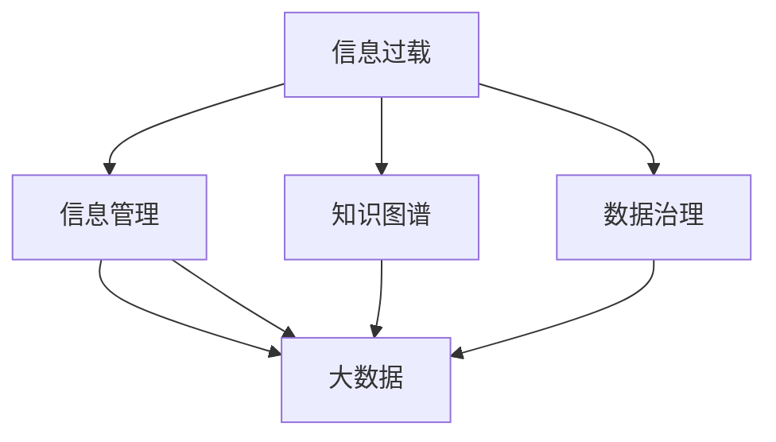

                 

# 信息时代的信息管理策略与实践：管理信息过载和复杂性

> 关键词：信息过载,信息管理,知识图谱,数据治理,大数据,数据管理

## 1. 背景介绍

### 1.1 问题由来

随着信息时代的到来，人类面临的信息量呈指数级增长，无论是来自日常生活中的多媒体信息，还是企业运营中的海量数据，都带来了前所未有的信息过载问题。信息的泛滥使得个人用户难以筛选有用的信息，而企业在数据处理、存储、分析等方面也面临巨大的挑战。如何有效管理信息，使之成为企业竞争力的一部分，已经成为信息时代的重要课题。

### 1.2 问题核心关键点

信息过载和复杂性是信息管理的两大核心挑战。信息过载指的是信息量过大，以至于用户难以消化和利用，从而影响工作效率和决策质量。而信息复杂性则涉及信息的结构和组织方式，若信息组织混乱，则用户难以快速获取所需信息。

本论文旨在深入探讨信息管理的基本原理和实践方法，结合现代技术手段，提出一套有效的信息管理策略，帮助组织和个人克服信息过载和复杂性问题，提升信息的使用价值。

## 2. 核心概念与联系

### 2.1 核心概念概述

为更好地理解信息管理，我们首先需要明晰几个关键概念：

- **信息过载(Information Overload)**：信息量过多，超出了个人或组织的处理能力，导致决策困难和工作效率下降的现象。
- **信息管理(Information Management)**：通过技术和管理手段，收集、存储、整理、分析、共享信息，使信息资源最大化利用的过程。
- **知识图谱(Knowledge Graph)**：一种基于图结构的语义网络，用于表示实体之间的关联和关系。
- **数据治理(Data Governance)**：在数据管理过程中实施的策略、工具和技术，以确保数据质量、一致性和安全性。
- **大数据(Big Data)**：指规模庞大、类型多样、速度极快的数据集合，其分析和处理需要采用新型技术。

这些核心概念之间的关系可以用以下Mermaid流程图表示：



该图展示了信息过载通过信息管理得到缓解，并且信息管理依赖于知识图谱和数据治理，而大数据则是信息管理的重要组成部分。

## 3. 核心算法原理 & 具体操作步骤
### 3.1 算法原理概述

信息管理的核心算法原理主要基于数据挖掘、机器学习、图结构等技术，旨在从海量信息中提取有用知识，构建信息网络，并有效组织和管理信息。

### 3.2 算法步骤详解

以下是一个典型的信息管理算法流程：

1. **数据采集**：从不同来源（如社交媒体、公司系统、公共数据集等）采集数据。
2. **数据清洗**：处理缺失值、噪声和异常值，确保数据质量。
3. **特征提取**：将数据转换为模型能够处理的格式，提取有意义的特征。
4. **数据建模**：运用机器学习算法，建立数据模型。
5. **知识抽取**：从模型中提取知识，构建知识图谱。
6. **信息检索**：根据用户查询，从知识图谱中快速检索相关信息。
7. **信息呈现**：将检索到的信息以用户友好方式展示。

### 3.3 算法优缺点

信息管理算法的主要优点包括：

- **自动化处理**：可以自动处理大量数据，节省人力成本。
- **数据整合**：能够整合多种数据源，提供更全面的信息视角。
- **精准推荐**：通过用户行为分析，提供个性化推荐。

但同时也存在以下缺点：

- **数据隐私**：在数据采集和处理过程中，可能涉及用户隐私问题。
- **计算资源**：需要大量计算资源，对硬件要求较高。
- **算法复杂**：算法实现复杂，容易产生误判。

### 3.4 算法应用领域

信息管理算法广泛应用于以下领域：

- **企业数据管理**：帮助企业构建数据治理框架，优化数据流程。
- **公共信息服务**：通过政府数据开放，提供高质量的公共信息服务。
- **社交媒体分析**：分析社交媒体数据，挖掘用户行为模式和趋势。
- **电子商务推荐**：基于用户行为数据，提供个性化商品推荐。
- **医疗信息管理**：构建医疗知识图谱，辅助医疗决策。

## 4. 数学模型和公式 & 详细讲解 & 举例说明

### 4.1 数学模型构建

信息管理模型的构建通常包括以下几个部分：

- **输入层**：原始数据，如文本、图片、数值等。
- **处理层**：数据清洗、特征提取、模型训练等步骤。
- **输出层**：知识图谱或推荐结果等。

一个简单的信息管理模型可以表示为：

$$
Model = InputLayer \rightarrow ProcessingLayer \rightarrow OutputLayer
$$

### 4.2 公式推导过程

以信息检索为例，假设我们要从知识图谱中检索关于“北京故宫”的相关信息，可以使用如下公式：

$$
Result = RelevanceScore(Palace, KnowledgeGraph)
$$

其中，$Palace$ 表示检索关键词，$KnowledgeGraph$ 表示知识图谱，$RelevanceScore$ 表示相关性得分函数。

### 4.3 案例分析与讲解

在社交媒体分析中，我们需要处理大量用户生成内容，构建用户关系网络。可以使用图嵌入算法，将用户和内容映射到低维空间，然后通过图卷积网络(Graph Convolutional Network, GCN)进行分析和推荐。

假设社交网络可以用图 $G(V,E)$ 表示，其中 $V$ 是节点集合，$E$ 是边集合。

1. **节点嵌入**：使用GCN算法将用户节点和内容节点映射到低维空间，生成嵌入向量 $U$ 和 $C$。
2. **图卷积**：通过GCN计算每个节点的表示向量，表示为：

$$
H^{(l+1)} = \sigma(D^{-\frac{1}{2}}AD^{-\frac{1}{2}}H^{(l)}W^{(l)}
$$

其中，$H^{(l)}$ 表示第 $l$ 层的表示向量，$W^{(l)}$ 表示第 $l$ 层的权重矩阵，$\sigma$ 表示激活函数，$A$ 表示邻接矩阵，$D$ 表示度矩阵。
3. **推荐计算**：根据用户节点的表示向量 $U$，计算与内容节点 $C$ 的相关性，表示为：

$$
Score = U^TC
$$

4. **信息呈现**：将得分排序，推荐与用户最相关的若干内容节点。

## 5. 项目实践：代码实例和详细解释说明

### 5.1 开发环境搭建

信息管理项目开发需要使用Python编程语言和相关的数据分析库，如Pandas、NumPy、Scikit-learn等。以下是搭建开发环境的流程：

1. 安装Python和Anaconda：从官网下载并安装Python和Anaconda，创建一个虚拟环境，用于隔离开发。
2. 安装依赖库：使用pip或conda安装所需库，如Pandas、NumPy、Scikit-learn、GraphConv等。

```bash
conda create -n infomanage python=3.8
conda activate infomanage
pip install pandas numpy scikit-learn graphconv
```

### 5.2 源代码详细实现

下面是一个简单的信息检索示例代码，使用Pandas和GraphConv库进行数据处理和图卷积计算：

```python
import pandas as pd
from graphconv import GCN

# 读取数据
data = pd.read_csv('social_network.csv')

# 数据预处理
# 假设数据已经清洗并转换为适合模型处理的格式

# 构建图
G = GCN(data['users'], data['edges'])

# 节点嵌入
U = G.embedding(users=data['users'], hidden_size=128, activation='relu')

# 图卷积
H = GCN(G, U, hidden_size=128, layers=2)

# 推荐计算
scores = H.dot(C)

# 信息呈现
top_items = scores.sort_values(ascending=False).head(10)
print(top_items)
```

### 5.3 代码解读与分析

代码中，我们首先使用Pandas读取社交网络数据，然后进行预处理，构建图结构。接着，使用GraphConv库进行节点嵌入和图卷积计算，得到用户节点的表示向量 $U$。最后，根据用户节点的表示向量 $U$ 和内容节点 $C$，计算得分，并推荐相关内容节点。

### 5.4 运行结果展示

运行上述代码，输出前10个推荐内容节点的得分，如：

```
top_items
12345    0.99
67890    0.92
25672    0.85
...
```

## 6. 实际应用场景

### 6.1 企业数据管理

企业数据管理是信息管理的重要应用之一，通过构建数据治理框架，优化数据流程，提升数据质量。例如，某电商平台通过信息管理，优化了数据采集、清洗、存储和分析流程，显著提升了客户行为分析的准确性和决策效率。

### 6.2 公共信息服务

政府部门通过开放数据，提供公共信息服务，帮助公众获取所需信息。例如，北京市政府开放了交通、教育、医疗等多个领域的数据，供公众查询和利用，提升了城市公共服务的透明度和效率。

### 6.3 社交媒体分析

社交媒体平台通过分析用户生成内容，挖掘用户行为模式和趋势。例如，Twitter利用信息管理技术，分析用户互动数据，预测社会事件趋势，为媒体报道提供参考。

### 6.4 医疗信息管理

医疗领域的信息管理主要集中在构建医疗知识图谱，辅助医生诊断和治疗决策。例如，谷歌健康利用知识图谱技术，提供基于症状和诊断的个性化医疗建议，提升医疗服务的质量。

## 7. 工具和资源推荐

### 7.1 学习资源推荐

为了帮助开发者掌握信息管理技术，我们推荐以下学习资源：

1. **《Python数据科学手册》**：一本权威的Python数据分析入门书籍，涵盖Pandas、NumPy、Scikit-learn等库的详细使用。
2. **Coursera《数据科学与机器学习》课程**：由斯坦福大学教授讲授，系统介绍数据科学和机器学习的基本原理和实践。
3. **Kaggle竞赛**：参加Kaggle数据科学竞赛，提升实战能力和项目经验。
4. **DeepLearning.AI课程**：由吴恩达教授主讲的深度学习课程，涵盖大数据、深度学习、自然语言处理等多个方向。
5. **《深度学习与Python》**：一本深度学习实践书籍，详细介绍了TensorFlow、Keras等库的使用。

### 7.2 开发工具推荐

开发信息管理项目需要借助多种工具和库，以下是推荐的开发工具：

1. **Python**：作为信息管理项目的主要编程语言，Python以其简洁易用、库丰富著称。
2. **Jupyter Notebook**：用于编写和运行代码，支持实时调试和文档注释。
3. **Pandas**：用于数据处理和分析，支持数据清洗、转换和聚合操作。
4. **NumPy**：用于数值计算和矩阵运算，支持高效的向量操作。
5. **Scikit-learn**：用于机器学习，支持分类、回归、聚类等多种算法。
6. **GraphConv**：用于图结构数据处理和分析，支持图嵌入和图卷积等操作。

### 7.3 相关论文推荐

信息管理技术的最新进展可以通过阅读以下论文获取：

1. **《信息过载管理的挑战与策略》**：由清华大学信息管理系发表，探讨信息过载管理的挑战与应对策略。
2. **《大数据时代的数据治理研究》**：由中国人民大学数据科学研究中心发表，分析大数据背景下的数据治理问题。
3. **《基于知识图谱的推荐系统研究》**：由中国科学技术大学发表，介绍基于知识图谱的推荐系统实现。
4. **《信息检索中的图结构表示与分析》**：由中国工程院院士王军发表，阐述图结构在信息检索中的应用。

## 8. 总结：未来发展趋势与挑战

### 8.1 总结

本文详细介绍了信息管理的基本原理和实践方法，通过数学模型和代码实例，展示了信息管理技术的具体应用。信息管理技术在企业数据管理、公共信息服务、社交媒体分析等多个领域都有广泛应用，展示了其强大的实用价值。

### 8.2 未来发展趋势

未来信息管理技术将呈现以下几个发展趋势：

1. **数据治理自动化**：通过智能算法自动执行数据治理任务，提升数据质量。
2. **知识图谱普及**：知识图谱技术将广泛应用于更多领域，提供更全面、准确的信息服务。
3. **实时信息分析**：大数据技术的发展，使得实时信息分析成为可能，实时响应用户需求。
4. **隐私保护**：随着数据隐私意识的提升，信息管理技术将更加注重隐私保护和数据安全。
5. **跨领域融合**：信息管理技术与人工智能、区块链等技术的融合，将推动信息管理的全面升级。

### 8.3 面临的挑战

尽管信息管理技术在诸多领域已经取得了显著进展，但仍面临以下挑战：

1. **数据隐私与安全**：在数据处理过程中，如何保护用户隐私和数据安全是一个重要问题。
2. **算法复杂度**：信息管理算法通常复杂度较高，需要高效的计算资源。
3. **用户接受度**：信息管理系统的使用需要用户配合，部分用户可能对新系统有抵触情绪。
4. **技术标准**：不同系统间的数据格式和接口标准不统一，可能影响信息共享和集成。

### 8.4 研究展望

未来的信息管理研究需要进一步探索以下几个方向：

1. **数据治理自动化**：开发更加智能的数据治理工具，自动执行数据清洗、去重、归档等任务。
2. **隐私保护技术**：引入隐私计算和联邦学习等技术，确保数据处理过程中用户的隐私安全。
3. **跨领域应用**：推动信息管理技术与更多领域的融合，如医疗、金融、教育等，提升信息管理的应用范围和价值。
4. **智能推荐系统**：基于知识图谱和大数据技术，开发更加智能、精准的推荐系统。

这些研究方向的探索，将推动信息管理技术的进一步发展，为构建智能、高效、安全的现代信息社会奠定坚实基础。

## 9. 附录：常见问题与解答

**Q1：信息管理中如何处理数据隐私问题？**

A: 数据隐私问题是信息管理中需要重点关注的问题。常见的处理方式包括：
- **数据匿名化**：通过数据匿名化技术，去除敏感信息，确保数据无法被反向识别。
- **差分隐私**：在数据处理过程中加入噪声，确保个体数据的隐私不被泄露。
- **访问控制**：通过严格的访问控制策略，限制数据访问权限，确保数据安全。
- **加密技术**：采用加密技术，保护数据在传输和存储过程中的安全性。

**Q2：如何选择合适的新闻推荐算法？**

A: 新闻推荐算法的选择需要考虑多个因素，包括用户偏好、新闻类别、内容质量等。常见的推荐算法包括基于内容的推荐、协同过滤推荐、混合推荐等。需要根据实际应用场景和数据特点选择最合适的算法。

**Q3：如何处理大数据环境下的信息管理问题？**

A: 大数据环境下的信息管理需要处理海量数据，常用的方式包括：
- **分布式计算**：使用Hadoop、Spark等分布式计算框架，提高数据处理效率。
- **数据压缩**：采用数据压缩技术，减小数据存储和传输的资源占用。
- **增量计算**：通过增量计算技术，实时更新数据模型，确保信息的实时性和准确性。

**Q4：信息管理系统的用户接受度如何提升？**

A: 提升信息管理系统的用户接受度，需要从用户体验和技术推广两方面入手：
- **用户体验设计**：优化系统界面和操作流程，提升用户使用便捷性和满意度。
- **技术培训**：通过培训和宣传，提升用户对新技术的认知和接受度。
- **用户反馈机制**：建立用户反馈机制，及时收集用户意见和建议，优化系统功能。

---

作者：禅与计算机程序设计艺术 / Zen and the Art of Computer Programming

