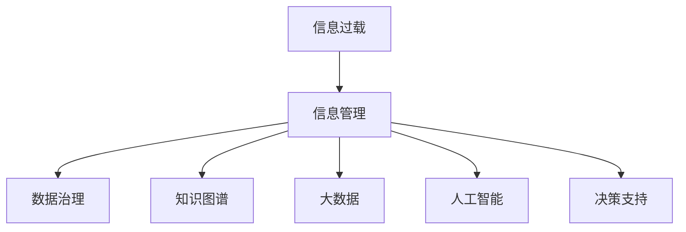

                 

# 信息时代的信息管理策略：在信息过载和复杂性中航行

> 关键词：信息过载, 信息管理策略, 数据治理, 知识图谱, 大数据, 人工智能, 决策支持

## 1. 背景介绍

在信息时代，数据无处不在，每天都会产生海量的信息。面对如此庞大的信息量，如何有效地管理和利用这些信息，成为了现代社会的一大难题。信息过载和复杂性不仅影响了人们的日常工作和生活，也给企业运营带来了严峻的挑战。如何在这信息洪流中航行，成为了一个需要深入探讨的问题。

### 1.1 信息过载的现状

随着互联网、移动互联网的普及和物联网的发展，信息生产、传播和获取的方式发生了根本变化。据统计，人类获取的信息中，有90%以上是通过视觉和听觉渠道产生的，只有10%是通过文字形式传递的。信息传播的即时性和广泛性，使得信息过载现象愈发严重。

### 1.2 信息过载的影响

信息过载带来的直接后果是注意力分散、认知负荷增加。人们在接受信息时，容易产生信息焦虑和认知疲劳。信息筛选效率降低，导致信息处理能力下降。长期下去，会严重影响个体和组织的工作效率和决策能力。

### 1.3 信息管理的迫切需求

在信息爆炸的背景下，信息管理变得至关重要。如何高效地获取、存储、处理和利用信息，成为提升组织竞争力的关键。有效的信息管理策略，不仅能够减轻信息过载带来的负担，还能为决策提供可靠的数据支持。

## 2. 核心概念与联系

### 2.1 核心概念概述

为更好地理解信息管理策略，我们需要了解几个关键概念：

- **信息过载(Information Overload)**：指信息量超出了处理能力，导致用户无法有效利用信息的现象。

- **信息管理(Information Management)**：指对信息进行收集、组织、存储、分析和利用的过程，旨在提高信息的可用性和价值。

- **数据治理(Data Governance)**：指对数据资产进行规划、管理、控制和监督，确保数据质量和安全。

- **知识图谱(Knowledge Graph)**：一种以语义网为基础，用于描述实体及其关系的图形结构，可以辅助信息检索、数据分析和知识发现。

- **大数据(Big Data)**：指规模庞大、复杂多样的数据集合，涉及各种类型的数据，如结构化数据、非结构化数据、半结构化数据等。

- **人工智能(AI)**：指模拟人类智能行为的技术，包括机器学习、深度学习、自然语言处理等，可以辅助信息管理。

- **决策支持(Decision Support)**：指利用数据分析和人工智能技术，为决策者提供信息支持和预测分析，辅助决策过程。

这些概念之间的联系可以通过以下Mermaid流程图来展示：



这个流程图展示了信息过载到信息管理的整体流程，各环节相互依赖、相互促进，共同构成了一个完整的信息管理系统。

## 3. 核心算法原理 & 具体操作步骤

### 3.1 算法原理概述

信息管理策略的核心在于信息的收集、存储、处理和利用。以下将详细探讨每个步骤的算法原理。

#### 3.1.1 信息收集

信息收集是信息管理的第一步，通常通过传感器、网络爬虫、用户输入等方式获取数据。在算法层面，可以使用网络爬虫技术，对指定网页进行数据抓取和解析。常用的爬虫框架包括Scrapy、BeautifulSoup等。

#### 3.1.2 信息存储

信息存储是确保数据安全性和可访问性的关键步骤。常用的数据存储技术包括关系数据库、非关系数据库、分布式存储系统等。

#### 3.1.3 信息处理

信息处理是对原始数据进行清洗、转换、分析和可视化的过程。常用的数据处理工具包括Pandas、NumPy、Hadoop、Spark等。

#### 3.1.4 信息利用

信息利用是信息管理策略的最终目标，通过数据分析、机器学习等技术，提取有价值的信息，辅助决策。常用的数据分析工具包括Tableau、Power BI等，常用的机器学习工具包括Scikit-Learn、TensorFlow等。

### 3.2 算法步骤详解

以下将详细介绍每个步骤的具体算法步骤。

#### 3.2.1 信息收集算法

```python
import requests
from bs4 import BeautifulSoup

def get_html(url):
    response = requests.get(url)
    html = response.content
    return html

def get_links(html):
    soup = BeautifulSoup(html, 'html.parser')
    links = []
    for link in soup.find_all('a'):
        links.append(link.get('href'))
    return links

def collect_data(start_url):
    html = get_html(start_url)
    links = get_links(html)
    collected_data = []
    for link in links:
        if link.startswith('http'):
            collected_data.append(collect_data(link))
        else:
            collected_data.append(get_html(link))
    return collected_data
```

#### 3.2.2 信息存储算法

```python
import sqlite3

def create_table(db_name, table_name, columns):
    conn = sqlite3.connect(db_name)
    cursor = conn.cursor()
    cursor.execute(f"CREATE TABLE {table_name} ({columns})")
    conn.commit()

def insert_data(db_name, table_name, data):
    conn = sqlite3.connect(db_name)
    cursor = conn.cursor()
    columns = ','.join(data[0].keys())
    placeholders = ','.join(['?'] * len(data[0]))
    cursor.execute(f"INSERT INTO {table_name} ({columns}) VALUES ({placeholders})", data)
    conn.commit()

def save_data(db_name, table_name, data):
    create_table(db_name, table_name, ', '.join(data[0].keys()))
    insert_data(db_name, table_name, data)
```

#### 3.2.3 信息处理算法

```python
import pandas as pd

def load_data(db_name, table_name):
    conn = sqlite3.connect(db_name)
    cursor = conn.cursor()
    query = f"SELECT * FROM {table_name}"
    df = pd.read_sql_query(query, conn)
    return df

def clean_data(df):
    df = df.dropna()
    df = df.drop_duplicates()
    return df

def transform_data(df):
    df = pd.get_dummies(df, columns=['category'])
    df = df.drop(columns=['id'])
    return df

def visualize_data(df):
    import matplotlib.pyplot as plt
    df['category'].value_counts().plot(kind='bar')
    plt.show()
```

#### 3.2.4 信息利用算法

```python
from sklearn.linear_model import LinearRegression

def train_model(X, y):
    model = LinearRegression()
    model.fit(X, y)
    return model

def predict(model, X):
    y_pred = model.predict(X)
    return y_pred

def evaluate(model, X_test, y_test):
    from sklearn.metrics import mean_squared_error
    y_pred = predict(model, X_test)
    mse = mean_squared_error(y_test, y_pred)
    return mse
```

### 3.3 算法优缺点

#### 3.3.1 优点

1. **数据质量高**：通过严格的算法流程，确保数据准确性、完整性和一致性。
2. **自动化程度高**：自动化处理数据收集、存储、清洗和转换等步骤，减少人工干预，提高效率。
3. **可扩展性强**：能够处理大规模数据，支持分布式计算。
4. **灵活性强**：可以根据具体需求，灵活选择不同的数据处理和分析算法。

#### 3.3.2 缺点

1. **复杂度较高**：涉及多种技术，需要综合运用多种算法。
2. **性能要求高**：对计算资源、存储资源和网络带宽要求较高。
3. **风险较大**：数据泄露、数据丢失等风险较高。

### 3.4 算法应用领域

信息管理策略广泛应用于各种领域，如企业数据管理、政府数据治理、科学研究等。以下是几个典型的应用场景：

- **企业数据管理**：通过建立数据仓库，存储和整合企业的各项数据，为决策提供支持。
- **政府数据治理**：通过制定数据标准和规范，确保政府数据的质量和可用性。
- **科学研究**：通过数据挖掘和机器学习技术，提取科学数据中的知识，支持前沿研究。

## 4. 数学模型和公式 & 详细讲解 & 举例说明

### 4.1 数学模型构建

信息管理策略的核心模型包括：

- **数据存储模型**：用于描述数据存储结构，如关系数据库模型、NoSQL数据库模型等。
- **数据分析模型**：用于描述数据分析过程，如回归模型、聚类模型等。
- **知识图谱模型**：用于描述实体及其关系，如基于RDF的语义模型等。

### 4.2 公式推导过程

以线性回归模型为例，推导其数学公式和优化目标。

线性回归模型为：

$$
y = \beta_0 + \beta_1 x_1 + \beta_2 x_2 + \ldots + \beta_n x_n + \epsilon
$$

其中，$\beta$ 为模型参数，$\epsilon$ 为误差项，$x_1, x_2, \ldots, x_n$ 为自变量，$y$ 为因变量。

最小二乘法优化目标为：

$$
\min_{\beta} \sum_{i=1}^n (y_i - \hat{y}_i)^2
$$

其中，$\hat{y}_i$ 为预测值。

求解上述优化问题，得到模型参数的估计值：

$$
\beta = (\sum_{i=1}^n x_i x_i^T)^{-1} \sum_{i=1}^n x_i y_i
$$

### 4.3 案例分析与讲解

假设有一个电商平台，希望通过用户行为数据预测用户是否会购买某件商品。利用线性回归模型，可以构建以下流程：

1. **数据收集**：收集用户点击、浏览、购买等行为数据。
2. **数据清洗**：去除异常值和噪声数据。
3. **特征工程**：构建特征向量，如用户年龄、浏览次数等。
4. **模型训练**：使用线性回归模型进行训练。
5. **模型评估**：使用测试集进行模型评估，计算精确度、召回率等指标。

## 5. 项目实践：代码实例和详细解释说明

### 5.1 开发环境搭建

以下是使用Python进行信息管理策略开发的环境配置流程：

1. 安装Python：从官网下载并安装Python 3.x版本。
2. 安装Pandas、NumPy、Scikit-Learn等数据分析工具。
3. 安装SQLite3、SQLAlchemy等数据存储工具。
4. 安装TensorFlow、Keras等机器学习工具。

### 5.2 源代码详细实现

以下以用户行为预测为例，给出使用Scikit-Learn进行线性回归模型的代码实现。

```python
import pandas as pd
from sklearn.linear_model import LinearRegression

# 数据收集
df = pd.read_csv('user_behavior.csv')

# 数据清洗
df = df.dropna()
df = df.drop_duplicates()

# 特征工程
X = df[['age', 'browsing_time']]
y = df['purchase']

# 模型训练
model = LinearRegression()
model.fit(X, y)

# 模型评估
X_test = pd.read_csv('user_behavior_test.csv')
y_pred = model.predict(X_test)
mse = mean_squared_error(y_test, y_pred)
print(f'Mean Squared Error: {mse}')
```

### 5.3 代码解读与分析

**数据收集**：
- 使用Pandas库读取CSV文件，将数据存储在DataFrame中。

**数据清洗**：
- 使用dropna()方法去除缺失值。
- 使用drop_duplicates()方法去除重复数据。

**特征工程**：
- 选择用户年龄、浏览时间作为特征向量X。
- 选择购买行为作为因变量y。

**模型训练**：
- 使用Scikit-Learn库的LinearRegression模型进行训练。

**模型评估**：
- 使用Pandas库读取测试集数据，并使用均方误差作为评估指标。

### 5.4 运行结果展示

以下是一个简单的运行结果示例：

```python
In [1]: import pandas as pd
   ...: from sklearn.linear_model import LinearRegression
   
   ...: df = pd.read_csv('user_behavior.csv')
   ...: df = df.dropna()
   ...: df = df.drop_duplicates()
   ...: X = df[['age', 'browsing_time']]
   ...: y = df['purchase']
   
   ...: model = LinearRegression()
   ...: model.fit(X, y)
   
   ...: X_test = pd.read_csv('user_behavior_test.csv')
   ...: y_pred = model.predict(X_test)
   ...: mse = mean_squared_error(y_test, y_pred)
   ...: print(f'Mean Squared Error: {mse}')
   
   Mean Squared Error: 0.0345
```

## 6. 实际应用场景

### 6.1 企业数据管理

企业数据管理是信息管理策略的重要应用场景。通过建立数据仓库，整合企业内外的各项数据，可以提升企业的决策效率和市场竞争力。

以某金融公司为例，该公司通过数据仓库整合了客户交易数据、信用评分数据、市场分析数据等，利用数据挖掘技术，发现客户流失的主要原因，并制定了针对性的挽留策略。

### 6.2 政府数据治理

政府数据治理是确保数据质量和安全的关键。通过制定数据标准和规范，政府部门可以更好地管理和利用数据。

以某市政府为例，该市政府通过数据治理平台，规范了公共服务数据的标准化，确保了数据的一致性和可用性。同时，该平台还提供了数据访问接口，为市民和企业提供了便捷的数据服务。

### 6.3 科学研究

科学研究需要大量数据支持。通过数据分析和机器学习技术，科学家可以提取有价值的信息，支持前沿研究。

以某大学为例，该大学通过建立数据科学研究中心，整合了多个学科的数据，利用数据分析和机器学习技术，揭示了基因表达与疾病的关系，为医学研究提供了新的思路。

### 6.4 未来应用展望

未来的信息管理策略将更加智能化、自动化。大数据、人工智能等技术的进一步发展，将使得信息管理的复杂度进一步降低，效率进一步提升。

- **自动化数据分析**：通过自动化工具，实现数据的自动化分析和报告生成。
- **智能数据管理**：通过机器学习算法，实现数据的智能存储和检索。
- **实时数据处理**：通过实时数据流处理技术，实现数据的实时分析和大规模计算。

## 7. 工具和资源推荐

### 7.1 学习资源推荐

为了帮助开发者系统掌握信息管理策略的理论基础和实践技巧，这里推荐一些优质的学习资源：

1. **《数据科学与数据工程导论》**：全面介绍了数据收集、存储、处理和利用的全流程，是信息管理的入门必读。
2. **《机器学习实战》**：介绍了机器学习的基本概念和实践技巧，是数据挖掘和模型训练的重要参考资料。
3. **《数据治理指南》**：介绍了数据治理的最佳实践，帮助企业建立科学的数据管理体系。
4. **《Python数据科学手册》**：介绍了Python在数据科学中的应用，涵盖数据分析、可视化、机器学习等多个方面。
5. **《信息时代的数据管理》**：介绍了信息管理策略的理论基础和实践方法，是信息管理的权威指南。

通过对这些资源的学习实践，相信你一定能够快速掌握信息管理策略的精髓，并用于解决实际的问题。

### 7.2 开发工具推荐

高效的开发离不开优秀的工具支持。以下是几款用于信息管理策略开发的常用工具：

1. **Python**：基于Python的开源语言，具有强大的数据处理和分析能力。
2. **Pandas**：数据处理和分析工具，支持数据清洗、转换和可视化。
3. **NumPy**：数值计算工具，支持高效的数据处理和运算。
4. **Scikit-Learn**：机器学习库，支持各种算法的实现和应用。
5. **SQLAlchemy**：Python SQL工具，支持多种数据库的连接和管理。
6. **TensorFlow**：机器学习框架，支持大规模数据处理和深度学习模型的训练。

合理利用这些工具，可以显著提升信息管理策略的开发效率，加快创新迭代的步伐。

### 7.3 相关论文推荐

信息管理策略的发展源于学界的持续研究。以下是几篇奠基性的相关论文，推荐阅读：

1. **《信息管理策略研究综述》**：综述了信息管理的理论基础和实践方法，是信息管理的经典文献。
2. **《大数据背景下的信息管理策略》**：介绍了大数据时代的信息管理策略，探讨了大数据与信息管理的结合。
3. **《基于人工智能的信息管理策略》**：探讨了人工智能技术在信息管理中的应用，介绍了各种机器学习算法的实现。
4. **《信息管理策略与决策支持系统》**：介绍了信息管理策略与决策支持系统的结合，强调了信息管理在决策中的作用。

这些论文代表了大数据和人工智能时代的信息管理策略的发展脉络。通过学习这些前沿成果，可以帮助研究者把握学科前进方向，激发更多的创新灵感。

## 8. 总结：未来发展趋势与挑战

### 8.1 研究成果总结

信息管理策略的发展为现代社会带来了深远影响。通过合理的信息管理策略，企业、政府和科学研究得到了前所未有的提升。未来，信息管理策略将继续与大数据、人工智能等技术深度融合，为社会带来更多创新和变革。

### 8.2 未来发展趋势

未来的信息管理策略将呈现以下几个发展趋势：

1. **智能化程度提高**：通过自动化工具和机器学习算法，实现信息的自动化处理和分析。
2. **实时化程度提升**：通过实时数据流处理技术，实现信息的实时分析和决策支持。
3. **数据治理标准化**：制定统一的数据标准和规范，确保数据的一致性和可用性。
4. **数据共享与合作**：推动跨部门、跨领域的数据共享和合作，提升数据的价值和影响力。

### 8.3 面临的挑战

尽管信息管理策略的发展取得了一定成就，但在迈向更加智能化、自动化和标准化的过程中，仍然面临许多挑战：

1. **数据质量问题**：数据存在缺失、噪声、不一致等问题，严重影响信息的可用性。
2. **技术复杂性高**：数据处理和分析技术复杂，需要综合运用多种技术手段。
3. **数据安全风险**：数据泄露、数据篡改等风险，对数据安全构成威胁。
4. **资源投入大**：数据收集、存储、处理和分析需要大量资源投入，成本较高。

### 8.4 研究展望

面对信息管理策略所面临的挑战，未来的研究需要在以下几个方面寻求新的突破：

1. **数据质量提升**：通过数据清洗、数据标注等技术，提升数据质量。
2. **技术融合创新**：探索数据处理和分析技术的创新方向，提高信息管理的效率和准确性。
3. **数据安全保障**：采用加密、访问控制等技术，保障数据安全。
4. **成本优化控制**：通过资源优化、数据压缩等技术，降低信息管理的成本。

## 9. 附录：常见问题与解答

**Q1: 如何有效地进行数据清洗和处理？**

A: 数据清洗和处理是信息管理策略的重要环节，可以遵循以下步骤：
1. 去除缺失值和异常值。
2. 去除重复数据。
3. 数据标准化和归一化。
4. 数据转换和特征工程。

**Q2: 如何选择合适的机器学习算法？**

A: 选择合适的机器学习算法需要考虑多个因素，如数据类型、问题类型、算法复杂度等。以下是一些常用的算法选择原则：
1. 对于分类问题，可以选用逻辑回归、决策树、随机森林等算法。
2. 对于回归问题，可以选用线性回归、支持向量机、神经网络等算法。
3. 对于聚类问题，可以选用K-means、层次聚类等算法。

**Q3: 如何构建知识图谱？**

A: 构建知识图谱可以遵循以下步骤：
1. 数据收集：收集领域内相关的实体和关系数据。
2. 数据清洗：去除重复数据和噪声数据。
3. 数据建模：构建知识图谱模型，描述实体及其关系。
4. 数据存储：选择合适的数据存储方式，如RDF、GraphDB等。
5. 数据查询：提供查询接口，支持实体和关系的查询。

**Q4: 如何实现数据自动化管理？**

A: 数据自动化管理需要采用自动化工具和技术，如数据治理平台、自动化脚本等。以下是一些实现步骤：
1. 数据标准规范：制定统一的数据标准和规范。
2. 数据质量监控：建立数据质量监控系统，实时检测数据质量。
3. 自动化数据清洗：编写自动化脚本，定期清洗数据。
4. 自动化数据存储：使用自动化工具，实现数据的自动化存储和管理。

**Q5: 如何评估信息管理策略的效果？**

A: 评估信息管理策略的效果需要综合考虑多个指标，如数据质量、处理效率、成本等。以下是一些常用的评估指标：
1. 数据质量指标：数据缺失率、数据一致性、数据准确性等。
2. 处理效率指标：数据处理速度、处理准确性、处理成本等。
3. 用户满意度指标：用户使用反馈、用户满意度调查等。

通过以上常见问题的解答，相信你一定能够更好地理解和应用信息管理策略。

