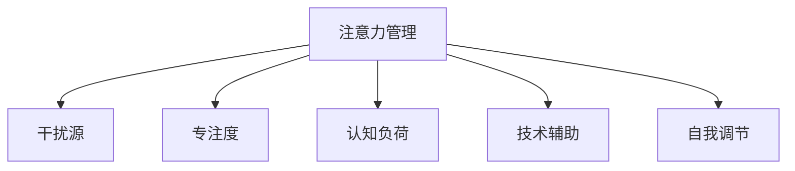

                 

# 信息时代的注意力管理技术：如何在干扰中保持专注

> 关键词：注意力管理,干扰,专注,信息时代,人工智能,应用案例

## 1. 背景介绍

### 1.1 问题由来

在信息时代，我们每天都会面对大量的信息流。电子邮件、社交媒体、新闻推送、视频网站等都在争夺我们的注意力。同时，工作的任务繁重、竞争的激烈，使得很多人感到压力山大、难以专注。如何在干扰中保持专注，成为了一个亟待解决的问题。

### 1.2 问题核心关键点

本文将详细探讨如何在干扰中保持专注的核心问题。重点关注：

- 如何识别和量化干扰源
- 如何设计有效的注意力管理机制
- 如何在不同场景中应用注意力管理技术
- 如何评价注意力管理的实际效果

### 1.3 问题研究意义

解决如何在干扰中保持专注的问题，对提升个人和组织的生产力、改善工作生活平衡具有重要意义。通过科学的管理技术，可以帮助个体和团队在信息爆炸的时代，更高效地完成任务，减少压力，提升幸福感。

## 2. 核心概念与联系

### 2.1 核心概念概述

为更好地理解注意力管理技术，本节将介绍几个密切相关的核心概念：

- **注意力管理(Attention Management)**：通过设计算法和工具，帮助用户识别和管理干扰源，提升信息处理效率，保持专注的技术。
- **干扰源(Interference Sources)**：干扰信息的形式多种多样，包括但不限于邮件、社交媒体、消息通知、同事打扰等。
- **专注度(Cognitive Focus)**：指个体在特定任务上的注意力集中程度，通常使用主观感受或客观测量指标进行评价。
- **认知负荷(Cognitive Load)**：指完成特定任务时所需的心理资源，过多认知负荷会影响专注度。
- **技术辅助(Assistive Technologies)**：包括各种工具和算法，辅助用户进行注意力管理，如番茄工作法、智能任务管理软件等。
- **自我调节(Self-regulation)**：指个体通过自我意识和策略，主动调节自身行为和情绪的能力。

这些核心概念之间的逻辑关系可以通过以下Mermaid流程图来展示：



这个流程图展示了这个概念体系的核心构成：注意力管理通过识别和处理干扰源，帮助提升专注度和认知负荷的管理，借助技术辅助手段和自我调节策略，最终实现高效的注意力管理。

## 3. 核心算法原理 & 具体操作步骤
### 3.1 算法原理概述

注意力管理技术的核心思想是，通过科学地识别和管理干扰源，帮助用户保持专注。常见的注意力管理算法包括：

- **时间块管理(Time Blocking)**：将一天分成多个时间块，每个时间块专注一个任务，减少切换带来的认知负荷。
- **番茄工作法(Pomodoro Technique)**：以25分钟为单位，专注工作，然后休息5分钟，循环多次。
- **优先级管理(Priority Management)**：根据任务的重要性和紧急程度，优先完成高优先级任务。
- **干扰抑制(Interference Suppression)**：通过屏蔽干扰源、设置勿扰模式等手段，减少干扰。
- **注意力提升(Attention Enhancement)**：通过脑波反馈、注意力训练等方法，提升个体的专注力。

这些算法通过不同的机制，帮助用户识别和管理干扰，提升专注度。

### 3.2 算法步骤详解

以下以番茄工作法为例，详细讲解其操作步骤：

**Step 1: 设定工作周期和休息周期**
- 设定每个工作周期（如25分钟）和休息周期（如5分钟）的时间长度。
- 确定一天中的工作周期和休息周期的总次数。

**Step 2: 设定工作任务**
- 在每个工作周期开始前，设定要完成的任务。
- 将任务分解为多个子任务，每个子任务在25分钟内完成。

**Step 3: 专注工作**
- 在设定的时间周期内，专注于当前任务，避免任何干扰。
- 记录完成的工作量和时间。

**Step 4: 短暂休息**
- 在每个休息周期内，短暂休息，缓解疲劳。
- 可以做一些简单的伸展运动、喝口水、看看窗外等。

**Step 5: 循环迭代**
- 重复上述步骤，直至完成一天的任务。

### 3.3 算法优缺点

注意力管理技术具有以下优点：
1. 提高效率：通过明确的任务设定和时间管理，减少切换带来的认知负荷，提升效率。
2. 改善专注：通过设定休息时间，避免长时间工作带来的疲劳，保持专注。
3. 灵活适用：不同的管理技术可以结合使用，适应不同的工作场景和个人偏好。
4. 增强自我调节：通过时间管理技术，提升个体对时间的控制力，增强自我调节能力。

同时，该技术也存在一些局限性：
1. 依赖自我约束：需要用户主动遵循时间管理规则，依赖自我约束能力。
2. 无法应对突发情况：面对突发干扰，如重要电话、紧急任务等，无法灵活应对。
3. 难以量化效果：专注度等效果往往难以精确量化，评价效果时可能存在主观偏差。
4. 适用范围有限：不适合所有工作场景，如创意工作、需要持续灵感的工作等。

尽管有这些局限性，但番茄工作法等注意力管理技术在提升工作效率、改善工作生活平衡方面，仍然具有不可替代的价值。

### 3.4 算法应用领域

注意力管理技术在各个领域都有广泛应用，包括：

- **个人工作生活管理**：帮助个人优化时间管理，提升工作生活平衡。
- **项目管理与团队协作**：在团队中，通过任务分解和优先级管理，提升项目执行效率。
- **企业人力资源管理**：通过设定工作周期和休息周期，改善员工工作状态，提升工作效率。
- **学习与教育**：通过番茄工作法等技术，帮助学生提升学习效率，增强学习动力。
- **心理咨询与治疗**：通过时间管理和认知负荷管理，改善患者情绪，提升治疗效果。

## 4. 数学模型和公式 & 详细讲解  
### 4.1 数学模型构建

为了更科学地管理干扰和提升专注度，我们需要构建数学模型来量化和优化注意力管理过程。

设任务总时间为 $T$，干扰源的干扰频率为 $f$，单个干扰源的干扰时间为 $t$，任务集中度为 $C$。

**任务集中度 $C$**：指在单位时间内完成任务的平均速度，通常表示为：

$$ C = \frac{任务完成量}{时间} $$

**认知负荷 $L$**：表示完成任务所需的心理资源，通常表示为：

$$ L = k \times C $$

其中 $k$ 为系数，表示完成任务所需的认知负荷与任务集中度的比例关系。

**干扰率 $I$**：表示干扰源对任务完成的平均影响，通常表示为：

$$ I = f \times t $$

**专注度 $F$**：表示个体在特定任务上的注意力集中程度，通常表示为：

$$ F = 1 - \frac{I}{T} $$

### 4.2 公式推导过程

根据以上定义，我们可以建立注意力管理的效果评估模型：

**目标函数**：最大化专注度 $F$

$$ \max F = \max (1 - \frac{I}{T}) $$

**约束条件**：
- $C \geq \frac{任务完成量}{时间}$
- $I \leq f \times t$
- $T$ 为总时间，$f$ 为干扰频率，$t$ 为单个干扰源的干扰时间，$C$ 为任务集中度

**求解过程**：
1. 确定干扰源的干扰频率 $f$ 和干扰时间 $t$。
2. 设定任务集中度 $C$，计算所需时间 $T$。
3. 根据干扰率和总时间计算专注度 $F$。
4. 通过调整任务集中度和干扰管理策略，提升专注度。

### 4.3 案例分析与讲解

以一个软件开发团队为例，分析其注意力管理过程：

**干扰源分析**：
- 邮件和消息通知
- 同事打扰
- 自我分心

**任务集中度设定**：
- 设定任务集中度为 $C=5$，即每小时完成5个任务。

**干扰时间设定**：
- 假设邮件和消息通知平均每小时5次，每次5分钟，即 $f=5, t=5$。

**总时间计算**：
- 一天8小时，即 $T=480$ 分钟。

**专注度计算**：
- 干扰率为 $I = 5 \times 5 = 25$ 分钟，专注度为 $F = 1 - \frac{25}{480} \approx 0.95$。

通过调整任务集中度和干扰管理策略，如减少邮件检查频率、设置勿扰模式等，可以进一步提升专注度。

## 5. 项目实践：代码实例和详细解释说明
### 5.1 开发环境搭建

在进行注意力管理技术开发前，我们需要准备好开发环境。以下是使用Python进行注意力管理技术开发的环境配置流程：

1. 安装Anaconda：从官网下载并安装Anaconda，用于创建独立的Python环境。

2. 创建并激活虚拟环境：
```bash
conda create -n attention-env python=3.8 
conda activate attention-env
```

3. 安装相关库：
```bash
conda install pandas numpy scikit-learn matplotlib seaborn jupyter notebook ipython
```

4. 安装注意力管理相关的库：
```bash
pip install pythom tomoto-pomodoro
```

完成上述步骤后，即可在`attention-env`环境中开始注意力管理技术开发。

### 5.2 源代码详细实现

下面以番茄工作法为例，使用Python实现一个简单的番茄工作法计时器：

```python
import time
import pythom.tomato

# 设定工作周期和休息周期
work_period = 25 * 60  # 工作周期为25分钟
rest_period = 5 * 60   # 休息周期为5分钟

# 设定工作任务
tasks = ["任务1", "任务2", "任务3", "任务4", "任务5"]

# 启动计时器
for task in tasks:
    pythom.tomato.start(task, work_period, rest_period)
    time.sleep(work_period + rest_period)
```

以上代码通过`pythom.tomato`库实现了番茄工作法计时器的基本功能。运行代码后，计时器将按照设定的时间周期，自动启动和休息，帮助用户保持专注。

### 5.3 代码解读与分析

**pythom库**：
- 提供了简单易用的API，实现了番茄工作法、番茄计时器等功能。

**代码逻辑**：
- 首先设定工作周期和休息周期的时间长度。
- 设定要完成的任务列表。
- 通过`pythom.tomato.start`方法启动计时器，开始工作。
- 每个任务完成后，计时器自动进入休息状态。

**代码实现细节**：
- `pythom.tomato`库通过时间轮询方式实现计时器功能，避免了复杂的定时器管理。
- 代码逻辑简洁，易于理解和修改。

## 6. 实际应用场景
### 6.1 软件开发

在软件开发中，集中注意力是提高代码质量和效率的关键。使用番茄工作法等注意力管理技术，可以帮助软件开发团队集中精力完成任务，避免分心和干扰。

在项目开发过程中，可以将任务分解为多个小任务，使用番茄工作法设定工作周期和休息周期，每个周期专注一个任务。通过记录完成的工作量和时间，可以评估团队的工作效率，并及时调整任务分配和进度安排。

### 6.2 教育培训

在教育培训领域，教师和学生都需要高度集中注意力。使用番茄工作法等技术，可以帮助教师和学生优化时间管理，提升学习效率。

教师可以设定课程进度，每个25分钟内专注于讲授一个知识点，休息5分钟进行互动。学生可以设定学习目标，每个番茄时间专注于一个学习任务，休息5分钟进行放松和回顾。

### 6.3 企业管理

在企业管理中，员工的生产力和工作效率直接影响企业的竞争力。使用注意力管理技术，可以帮助企业提升员工的工作状态，增强团队协作。

企业管理者可以设定员工的工作周期和休息周期，通过时间管理工具监控员工的工作状态。员工可以根据工作周期合理安排任务，减少分心和干扰，提高工作效率。

## 7. 工具和资源推荐
### 7.1 学习资源推荐

为了帮助开发者系统掌握注意力管理技术的理论基础和实践技巧，这里推荐一些优质的学习资源：

1. 《深度工作：如何有效利用你的时间》书籍：作者卡尔·纽波特，介绍了深度工作的概念、方法以及如何应对干扰。

2. 《番茄工作法图解》书籍：作者弗朗西斯科·西里洛，详细讲解了番茄工作法的原理和实施方法。

3. CS229《机器学习》课程：斯坦福大学开设的机器学习明星课程，涉及时间序列分析和强化学习等内容，对注意力管理有深入的讲解。

4. 《注意力模型在NLP中的应用》论文：介绍了注意力机制在自然语言处理中的应用，对注意力管理技术有深刻的启示。

5. Google Colab：谷歌推出的在线Jupyter Notebook环境，免费提供GPU/TPU算力，方便开发者快速上手实验注意力管理技术，分享学习笔记。

通过对这些资源的学习实践，相信你一定能够快速掌握注意力管理技术的精髓，并用于解决实际的注意力管理问题。

### 7.2 开发工具推荐

高效的开发离不开优秀的工具支持。以下是几款用于注意力管理技术开发的常用工具：

1. Jupyter Notebook：基于Web的交互式编程环境，方便进行数据分析和模型训练。

2. Pythom：基于Python的番茄工作法计时器库，提供简单易用的API接口。

3. Trello：项目管理工具，可以通过设定任务、优先级等，辅助进行任务管理和时间管理。

4. RescueTime：时间跟踪和管理工具，可以自动记录用户的使用时间，分析注意力分布情况。

5. Forest：番茄工作法计时器，通过种树的方式激励用户集中注意力。

合理利用这些工具，可以显著提升注意力管理技术的开发效率，加快创新迭代的步伐。

### 7.3 相关论文推荐

注意力管理技术的研究源于学界的持续研究。以下是几篇奠基性的相关论文，推荐阅读：

1. 《番茄工作法的研究与实践》论文：作者弗朗西斯科·西里洛，介绍了番茄工作法的原理、实施方法和效果评价。

2. 《深度工作：如何在分心的世界中专注》论文：作者卡尔·纽波特，讨论了深度工作的概念、策略和心理机制。

3. 《时间序列分析与预测》书籍：作者Rabinowitz等，介绍了时间序列分析的基本原理和方法。

4. 《强化学习：通过游戏掌握智能》书籍：作者Ian Goodfellow等，介绍了强化学习的基本原理和应用案例。

这些论文代表了这个领域的研究进展，通过学习这些前沿成果，可以帮助研究者把握学科前进方向，激发更多的创新灵感。

## 8. 总结：未来发展趋势与挑战

### 8.1 总结

本文对注意力管理技术进行了全面系统的介绍。首先阐述了注意力管理技术的研究背景和意义，明确了在干扰中保持专注的独特价值。其次，从原理到实践，详细讲解了注意力管理的数学模型和操作步骤，给出了注意力管理技术开发的完整代码实例。同时，本文还广泛探讨了注意力管理技术在软件开发、教育培训、企业管理等多个行业领域的应用前景，展示了注意力管理技术的广泛适用性。

通过本文的系统梳理，可以看到，注意力管理技术正在成为提高生产力、改善工作生活平衡的重要手段。结合技术手段和自我调节策略，可以有效应对信息爆炸时代带来的干扰，提升个体和组织的专注度。

### 8.2 未来发展趋势

展望未来，注意力管理技术将呈现以下几个发展趋势：

1. **技术智能化**：未来将出现更多智能化的注意力管理工具，通过数据分析和机器学习，自动优化工作周期和休息周期，提供个性化的注意力管理建议。

2. **多模态结合**：将注意力管理技术与其他多模态信息结合，如生物信号、环境监测等，提供更全面的注意力监测和调节能力。

3. **跨平台统一**：不同设备、不同环境下的注意力管理将逐步统一，用户可以在任何设备上无缝切换，保持连续的注意力管理。

4. **协作增强**：通过社交网络、协作平台，将注意力管理技术应用于团队协作，提升团队的工作效率和协作效果。

5. **生态系统建设**：构建跨应用、跨设备的注意力管理生态系统，提供统一的注意力管理标准和接口，实现不同应用间的无缝衔接。

以上趋势凸显了注意力管理技术的广阔前景。这些方向的探索发展，必将进一步提升个体和组织的工作效率，改善工作生活平衡，构建更加智能、协作的办公环境。

### 8.3 面临的挑战

尽管注意力管理技术已经取得了不少进展，但在迈向更加智能化、普适化应用的过程中，它仍面临诸多挑战：

1. **个性化问题**：不同的个体和组织有不同的需求和偏好，难以一概而论。如何设计灵活的个性化策略，适应不同的使用场景，是一个重要问题。

2. **数据隐私**：注意力管理技术需要收集用户的详细行为数据，如何保护用户隐私，防止数据泄露，是一个重要的伦理和法律问题。

3. **技术复杂性**：部分技术（如脑波反馈、生物信号监测）涉及复杂的技术和算法，难以普及和推广。

4. **实际应用效果**：技术效果往往依赖于用户的主动配合和长期使用，如何提高用户黏性，是一个需要进一步解决的问题。

5. **应用场景局限**：部分应用场景，如创意工作、需要持续灵感的工作等，可能不适合注意力管理技术。

6. **健康影响**：长时间的注意力管理可能会带来疲劳和压力，如何避免过度使用，确保用户健康，是一个需要关注的问题。

正视这些挑战，积极应对并寻求突破，将是注意力管理技术走向成熟的必由之路。相信随着学界和产业界的共同努力，这些挑战终将一一被克服，注意力管理技术必将在构建智能办公环境、提高生产力方面发挥更大的作用。

### 8.4 研究展望

面向未来，注意力管理技术需要在以下几个方面寻求新的突破：

1. **心理学与认知科学**：结合心理学和认知科学的研究成果，设计更加科学、合理的注意力管理策略。

2. **多学科融合**：将注意力管理技术与其他领域的技术（如生物医学、环境科学等）结合，提供更全面、深入的注意力管理方案。

3. **交互界面优化**：设计更加友好、易用的交互界面，提高用户的操作体验和满意度。

4. **跨平台统一**：构建跨平台、跨设备的注意力管理标准和协议，实现不同环境下的无缝衔接。

5. **持续学习与进化**：开发具备自适应能力的注意力管理工具，根据用户行为数据不断优化算法和策略。

6. **伦理与法律保障**：建立明确的伦理和法律框架，保护用户隐私，确保注意力管理技术的健康发展。

这些研究方向的探索，必将引领注意力管理技术迈向更高的台阶，为提高个体和组织的生产力、改善工作生活平衡提供新的技术路径。总之，注意力管理技术需要结合技术手段和自我调节策略，才能在信息爆炸的时代，帮助个体和组织保持高效、健康的工作状态。

## 9. 附录：常见问题与解答

**Q1：注意力管理技术如何帮助个体提高专注度？**

A: 注意力管理技术通过科学的时间管理和干扰管理，帮助个体合理安排工作和休息时间，减少干扰，提升专注度。通过设定明确的工作周期和休息周期，使个体在集中工作时保持高效，在休息时缓解疲劳，从而提高整体的工作效率和专注度。

**Q2：如何选择合适的注意力管理技术？**

A: 选择合适的注意力管理技术，需要根据个人的工作性质和习惯进行定制化设计。对于需要高度集中注意力的工作，如软件开发、科学研究，番茄工作法等技术较为适用。而对于需要创意和灵感的任务，如艺术创作、写作，可能需要更加灵活的时间管理策略。

**Q3：注意力管理技术能否应用于团队协作？**

A: 注意力管理技术可以应用于团队协作，通过设定共同的工作周期和休息周期，提升团队的整体工作效率和协作效果。例如，在项目管理中，通过设定任务优先级和期限，帮助团队成员合理安排工作，避免任务堆积和瓶颈。

**Q4：如何评价注意力管理的实际效果？**

A: 评价注意力管理的实际效果，可以通过以下几个指标：
1. 任务完成量：观察在设定时间内完成的任务数量。
2. 工作质量：观察任务完成的质量，是否符合预期。
3. 疲劳和压力：观察个体的疲劳和压力状态，是否感到舒适。
4. 满意度：通过问卷调查或面谈，了解个体对注意力管理工具的满意度和体验。

通过综合评估这些指标，可以判断注意力管理技术的实际效果，并进行优化和改进。

---

作者：禅与计算机程序设计艺术 / Zen and the Art of Computer Programming

