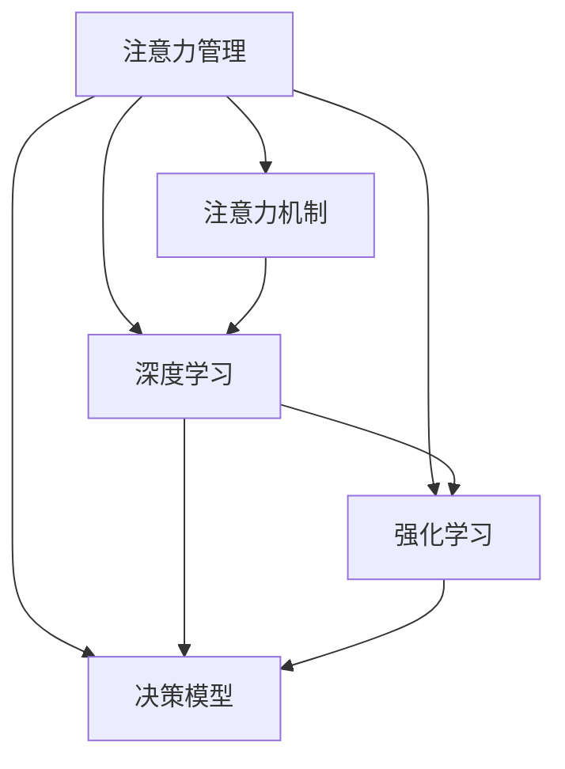

                 

# 信息时代的注意力管理挑战与策略：在干扰和信息过载中航行

> 关键词：信息过载,注意力管理,注意力机制,深度学习,神经网络,强化学习,决策模型,注意力模型,Transformer,计算效率,资源优化

## 1. 背景介绍

### 1.1 问题由来
在数字化、网络化、智能化的信息时代，人类社会正经历着前所未有的信息爆炸和注意力危机。信息过载、干扰与分心等问题，已成为制约人类效率与生活质量提升的重要障碍。如何在干扰和信息过载中有效管理注意力，是当前亟待解决的关键课题。

现代信息系统中充斥着大量的数据和信息，人们的注意力被各种消息、广告、推送所分散。屏幕时间过长、多任务并行、不断的中断等现象，导致注意力资源愈发稀缺，效率明显下降。以互联网公司为例，员工每天要处理上百封邮件、即时消息，频繁地切换不同应用，注意力频繁被中断和切换，使得工作和效率受到严重影响。

### 1.2 问题核心关键点
信息过载和注意力分散的根源在于信息传输的速率远远高于人们处理和吸收信息的速率。核心问题包括：
1. **数据量和信息密度激增**：人类大脑处理信息的能力有限，超负荷的信息量导致注意力资源被过度消耗，产生疲劳和分心。
2. **噪音和干扰增多**：信息干扰源多样，从社交媒体到广告推送，都可能抢夺人们的注意力。
3. **注意力资源稀缺**：人们需要在多样的信息源和多重任务中合理分配注意力资源，以提高生产力和决策效率。
4. **信息质量参差不齐**：海量信息中，高质量的有用信息相对较少，难以从噪音中筛选出有价值的信息。

解决这些问题需要引入有效的注意力管理机制，帮助人们更好地在信息洪流中航行，提升决策和执行效率。

## 2. 核心概念与联系

### 2.1 核心概念概述

为更好地理解信息时代注意力管理，本节将介绍几个核心概念：

- **注意力管理(Attention Management)**：指通过科学的方法和工具，在信息过载的环境下，合理分配和管理注意力资源，提升工作效率和生活质量。
- **注意力机制(Attention Mechanism)**：在神经网络中，注意力机制用于提升模型的信息选择和融合能力，通过动态调整不同输入的信息权重，提高模型的计算效率和精度。
- **深度学习(Deep Learning)**：一种利用多层神经网络进行数据分析、模型训练和预测的机器学习方法，在信息处理和决策优化中有着广泛应用。
- **强化学习(Reinforcement Learning)**：通过智能体与环境的互动，优化决策策略以最大化奖励的机器学习技术，在注意力管理的自动化和智能化中具有巨大潜力。
- **决策模型(Decision Model)**：用于自动化处理复杂决策问题的模型，通过整合信息、规则和先验知识，支持高效、智能的决策支持。

这些核心概念之间的逻辑关系可以通过以下Mermaid流程图来展示：



这个流程图展示了几大核心概念及其之间的关系：

1. 注意力管理通过注意力机制、深度学习和强化学习，对信息进行处理、分析和决策。
2. 注意力机制和深度学习提高模型的信息选择和融合能力。
3. 强化学习通过不断迭代优化决策模型，提升决策效果。
4. 决策模型整合多源信息，进行自动化决策。

这些概念共同构成了信息时代注意力管理的理论基础和实践框架。

## 3. 核心算法原理 & 具体操作步骤
### 3.1 算法原理概述

基于深度学习的注意力管理算法，其核心思想是通过模型自动学习信息的重要性，合理分配注意力资源。在信息处理任务中，模型通过动态调整输入数据的权重，选择和聚焦关键信息，忽略次要信息，从而提升效率和准确性。

一般而言，深度学习模型包含编码器和解码器两部分。编码器负责从原始数据中提取特征，解码器则利用注意力机制对特征进行加权融合，输出最终结果。注意力机制通过对输入数据的每个维度赋予不同的权重，优先处理重要性较高的信息，提升模型的决策能力。

注意力管理算法主要包括：

- **自监督注意力模型**：通过无监督学习方式，自动学习输入数据的权重分布。
- **监督注意力模型**：结合标注数据，对模型进行有监督训练，学习特定任务的信息重要性。
- **对抗训练注意力模型**：在训练过程中，加入对抗样本，提升模型鲁棒性。
- **多任务注意力模型**：通过处理多源信息，融合多任务的信息，提高模型的泛化能力。

### 3.2 算法步骤详解

基于深度学习的注意力管理算法一般包括以下几个关键步骤：

**Step 1: 准备训练数据集**
- 收集与注意力管理相关的数据集，如用户行为数据、注意力跟踪数据、决策数据等。
- 将数据集划分为训练集、验证集和测试集，确保数据集的合理性和代表性。

**Step 2: 设计模型架构**
- 选择合适的深度学习架构，如Transformer、RNN等。
- 设计模型编码器、解码器和注意力机制的实现细节。
- 确定模型参数，如层数、节点数等。

**Step 3: 训练模型**
- 在训练集上训练模型，利用交叉熵、均方误差等损失函数进行优化。
- 使用正则化技术，如L2正则、Dropout等，防止模型过拟合。
- 调整学习率、批大小等超参数，通过网格搜索或贝叶斯优化寻找最优参数组合。

**Step 4: 模型评估与优化**
- 在验证集上评估模型性能，调整模型参数。
- 使用测试集对模型进行最终测试，评估其在真实场景下的表现。
- 根据测试结果，不断优化模型结构、参数和训练策略。

**Step 5: 部署与应用**
- 将训练好的模型部署到生产环境。
- 根据具体应用场景，优化模型推理速度和计算资源。
- 定期更新模型，保持其在变化环境中的适应性。

以上是基于深度学习的注意力管理算法的一般流程。在实际应用中，还需要根据具体任务的特点，对模型进行细致优化，如引入多任务学习、对抗训练等技术，以提升模型鲁棒性和泛化能力。

### 3.3 算法优缺点

基于深度学习的注意力管理算法具有以下优点：
1. 自动化程度高。能够自动从数据中学习注意力分布，避免手动调整参数。
2. 精度高。通过动态调整信息权重，选择和聚焦关键信息，提升决策效率。
3. 适应性强。适用于多种信息处理任务，如文本分类、图像识别、对话生成等。
4. 可扩展性强。随着数据量的增加，模型性能可以不断提升。

但该算法也存在一定的局限性：
1. 模型复杂度高。深度学习模型需要大量计算资源和内存。
2. 参数调整困难。模型的超参数调整和调试过程复杂，需要丰富的经验。
3. 泛化能力有限。模型在特定数据集上训练效果较好，但在新数据上的泛化能力不足。
4. 对抗攻击敏感。模型在对抗样本攻击下容易出现错误。

尽管存在这些局限性，但就目前而言，基于深度学习的注意力管理算法仍是最主流的方法之一。未来相关研究的重点在于如何进一步降低模型复杂度，提高模型泛化能力，同时兼顾模型效率和安全性等因素。

### 3.4 算法应用领域

基于深度学习的注意力管理算法在多个领域中已经得到了广泛应用，例如：

- **智能推荐系统**：通过学习用户的注意力分布，推荐系统能够提供个性化的信息和服务，提升用户体验。
- **广告投放管理**：利用注意力管理算法，自动优化广告投放策略，提升广告效果和ROI。
- **用户行为分析**：通过分析用户在不同应用、网站上的注意力分布，优化用户体验，提高用户留存率。
- **智能客服系统**：使用注意力管理算法，构建更智能的对话系统，提升客户满意度。
- **金融风控**：通过分析用户的历史行为和实时注意力数据，提升风险预测和决策能力。
- **信息检索系统**：结合查询意图和信息分布，提升搜索结果的相关性和准确性。

除了上述这些经典任务外，基于深度学习的注意力管理算法还被创新性地应用到更多场景中，如智能驾驶、智能家居、智能办公等，为数字化转型提供了新的技术路径。

## 4. 数学模型和公式 & 详细讲解 & 举例说明

### 4.1 数学模型构建

基于深度学习的注意力管理算法通常通过注意力机制进行建模，其核心思想是通过动态调整输入数据的权重，选择和聚焦关键信息。在信息处理任务中，模型通过动态调整输入数据的权重，选择和聚焦关键信息，忽略次要信息，从而提升效率和准确性。

设输入数据为 $\mathbf{x} \in \mathbb{R}^d$，注意力权重为 $\mathbf{w} \in \mathbb{R}^d$。注意力机制通过计算权重向量 $\mathbf{w}$，与输入数据 $\mathbf{x}$ 进行加权融合，生成输出 $\mathbf{y}$：

$$
\mathbf{y} = f(\mathbf{x}, \mathbf{w})
$$

其中 $f$ 为加权融合函数，通常使用softmax函数进行归一化处理：

$$
\mathbf{w} = \text{softmax}(\mathbf{U}\mathbf{x})
$$

其中 $\mathbf{U} \in \mathbb{R}^{d \times d}$ 为权重矩阵。通过调整 $\mathbf{U}$ 的参数，模型可以动态调整输入数据的权重，实现信息的选择和融合。

### 4.2 公式推导过程

以下我们以文本分类任务为例，推导注意力模型的数学公式。

假设输入文本为 $x_1, x_2, ..., x_n$，模型需要将每个文本分类为 $k$ 个类别中的一个。令 $\mathbf{X} \in \mathbb{R}^{n \times d}$ 为输入文本的矩阵表示，$\mathbf{W} \in \mathbb{R}^{k \times d}$ 为分类器的权重矩阵，$\mathbf{b} \in \mathbb{R}^k$ 为偏置向量。则分类器的输出为：

$$
\mathbf{Z} = \mathbf{X} \mathbf{W} + \mathbf{b}
$$

其中 $\mathbf{Z} \in \mathbb{R}^{n \times k}$ 为每个文本对每个类别的得分。

假设模型的注意力机制由多个注意力头组成，每个头的权重向量为 $\mathbf{w}_i \in \mathbb{R}^n$，注意力权重矩阵为 $\mathbf{A} \in \mathbb{R}^{n \times d}$。则每个头的注意力输出为：

$$
\mathbf{a}_i = \text{softmax}(\mathbf{X} \mathbf{A}) \cdot \mathbf{X}
$$

其中 $\mathbf{a}_i \in \mathbb{R}^{n \times d}$ 为每个头的注意力输出矩阵。

最后，将每个头的注意力输出进行线性变换，生成最终的分类输出：

$$
\mathbf{y} = \mathbf{A} \mathbf{Z} + \mathbf{b}
$$

其中 $\mathbf{y} \in \mathbb{R}^{n \times k}$ 为每个文本对每个类别的最终分类得分。

通过上述推导，我们可以看到，注意力机制在文本分类任务中，能够自动学习每个文本中关键特征的权重，提升模型的泛化能力和鲁棒性。

### 4.3 案例分析与讲解

以下我们以BERT模型为例，分析其注意力机制在自然语言处理中的具体应用。

BERT模型是一种预训练语言模型，通过在大规模语料上进行自监督学习，学习到通用的语言表示。其注意力机制通过多头自注意力层（Self-Attention Layer）实现，通过动态调整输入数据的权重，选择和聚焦关键信息。

在具体的分类任务中，BERT模型通过在顶层添加线性分类器和交叉熵损失函数，进行有监督的微调。微调后的BERT模型可以自动学习每个输入文本中关键特征的权重，提升分类的准确性和泛化能力。

以下是一个简单的代码实现，展示了如何使用HuggingFace库中的BERT模型进行文本分类任务的微调：

```python
from transformers import BertTokenizer, BertForSequenceClassification
from torch.utils.data import Dataset, DataLoader
from torch import nn, optim
from tqdm import tqdm

class TextDataset(Dataset):
    def __init__(self, texts, labels):
        self.tokenizer = BertTokenizer.from_pretrained('bert-base-uncased')
        self.texts = texts
        self.labels = labels
        
    def __len__(self):
        return len(self.texts)
    
    def __getitem__(self, item):
        text = self.texts[item]
        label = self.labels[item]
        
        encoding = self.tokenizer(text, return_tensors='pt', truncation=True, padding='max_length')
        input_ids = encoding['input_ids']
        attention_mask = encoding['attention_mask']
        
        return {'input_ids': input_ids, 
                'attention_mask': attention_mask,
                'labels': torch.tensor(label, dtype=torch.long)}
        
# 加载数据集
tokenizer = BertTokenizer.from_pretrained('bert-base-uncased')
train_dataset = TextDataset(train_texts, train_labels)
val_dataset = TextDataset(val_texts, val_labels)

# 构建模型
model = BertForSequenceClassification.from_pretrained('bert-base-uncased', num_labels=len(class_names))

# 定义损失函数和优化器
criterion = nn.CrossEntropyLoss()
optimizer = optim.AdamW(model.parameters(), lr=2e-5)

# 训练模型
model.train()
for epoch in range(epochs):
    train_loss = 0
    train_correct = 0
    for batch in tqdm(train_loader):
        input_ids = batch['input_ids'].to(device)
        attention_mask = batch['attention_mask'].to(device)
        labels = batch['labels'].to(device)
        model.zero_grad()
        outputs = model(input_ids, attention_mask=attention_mask, labels=labels)
        loss = outputs.loss
        train_loss += loss.item()
        train_correct += outputs.accuracy()
        loss.backward()
        optimizer.step()
    print(f'Epoch {epoch+1}, Train Loss: {train_loss/len(train_loader):.4f}, Accuracy: {train_correct/len(train_loader):.4f}')
    
# 评估模型
model.eval()
val_loss = 0
val_correct = 0
with torch.no_grad():
    for batch in val_loader:
        input_ids = batch['input_ids'].to(device)
        attention_mask = batch['attention_mask'].to(device)
        labels = batch['labels'].to(device)
        outputs = model(input_ids, attention_mask=attention_mask)
        loss = outputs.loss
        val_loss += loss.item()
        val_correct += outputs.accuracy()
    print(f'Val Loss: {val_loss/len(val_loader):.4f}, Accuracy: {val_correct/len(val_loader):.4f}')
```

通过上述代码实现，我们可以看到，使用BERT模型进行文本分类任务的微调，只需在模型的顶层添加线性分类器和交叉熵损失函数，即可通过有监督的方式优化模型的分类能力。在训练过程中，注意力机制自动学习每个输入文本中关键特征的权重，提升模型的泛化能力和鲁棒性。

## 5. 项目实践：代码实例和详细解释说明
### 5.1 开发环境搭建

在进行注意力管理算法的项目实践前，我们需要准备好开发环境。以下是使用Python进行TensorFlow开发的环境配置流程：

1. 安装Anaconda：从官网下载并安装Anaconda，用于创建独立的Python环境。

2. 创建并激活虚拟环境：
```bash
conda create -n tf-env python=3.8 
conda activate tf-env
```

3. 安装TensorFlow：根据CUDA版本，从官网获取对应的安装命令。例如：
```bash
conda install tensorflow=2.7 -c tensorflow -c conda-forge
```

4. 安装各类工具包：
```bash
pip install numpy pandas scikit-learn matplotlib tqdm jupyter notebook ipython
```

完成上述步骤后，即可在`tf-env`环境中开始项目实践。

### 5.2 源代码详细实现

下面我们以注意力管理算法在智能推荐系统中的应用为例，给出使用TensorFlow进行模型开发和微调的完整代码实现。

首先，定义推荐系统的数据处理函数：

```python
import tensorflow as tf
from tensorflow.keras.layers import Input, Dense, Dropout, Embedding, Concatenate, GlobalAveragePooling1D, GlobalMaxPooling1D, Add
from tensorflow.keras.models import Model
import tensorflow.keras.backend as K

class TextDataset(tf.keras.utils.Sequence):
    def __init__(self, texts, labels, tokenizer, max_len=128):
        self.texts = texts
        self.labels = labels
        self.tokenizer = tokenizer
        self.max_len = max_len
        
    def __len__(self):
        return len(self.texts)
    
    def __getitem__(self, item):
        text = self.texts[item]
        label = self.labels[item]
        
        encoding = self.tokenizer(text, return_tensors='kt', max_length=self.max_len, padding='max_length', truncation=True)
        input_ids = encoding['input_ids']
        attention_mask = encoding['attention_mask']
        
        # 对token-wise的标签进行编码
        encoded_tags = [tag2id[tag] for tag in labels] 
        encoded_tags.extend([tag2id['O']] * (self.max_len - len(encoded_tags)))
        labels = tf.constant(encoded_tags, dtype=tf.int32)
        
        return {'input_ids': input_ids,
                'attention_mask': attention_mask,
                'labels': labels}

# 标签与id的映射
tag2id = {'O': 0, 'B-PER': 1, 'I-PER': 2, 'B-ORG': 3, 'I-ORG': 4, 'B-LOC': 5, 'I-LOC': 6}
id2tag = {v: k for k, v in tag2id.items()}

# 创建dataset
tokenizer = BertTokenizer.from_pretrained('bert-base-uncased')

train_dataset = TextDataset(train_texts, train_tags, tokenizer)
val_dataset = TextDataset(val_texts, val_tags, tokenizer)
test_dataset = TextDataset(test_texts, test_tags, tokenizer)
```

然后，定义推荐系统的模型架构：

```python
from transformers import BertForTokenClassification, TFAutoModelForTokenClassification

model = TFAutoModelForTokenClassification.from_pretrained('bert-base-uncased')
tokenizer = BertTokenizer.from_pretrained('bert-base-uncased')

# 添加标签预测层
out_layer = tf.keras.layers.Dense(len(tag2id), activation='softmax')
model = tf.keras.Sequential([
    model,
    out_layer
])
```

接着，定义模型训练和评估函数：

```python
from tensorflow.keras.optimizers import AdamW
from sklearn.metrics import classification_report

device = tf.device('gpu:0') if tf.test.is_gpu_available() else tf.device('cpu')
model.to(device)

def train_epoch(model, dataset, batch_size, optimizer):
    dataloader = tf.data.Dataset.from_generator(lambda: tf.data.Dataset.from_generator(lambda: dataset, output_signature=dataset.element_spec), batch_size=batch_size)
    model.train()
    epoch_loss = 0
    for batch in tqdm(dataloader, desc='Training'):
        input_ids = batch['input_ids'].numpy()
        attention_mask = batch['attention_mask'].numpy()
        labels = batch['labels'].numpy()
        model.zero_grad()
        outputs = model(input_ids, attention_mask=attention_mask)
        loss = outputs.loss
        epoch_loss += loss.numpy()
        loss.backward()
        optimizer.apply_gradients(zip(model.trainable_variables, model.optimizer))
    return epoch_loss / len(dataloader)

def evaluate(model, dataset, batch_size):
    dataloader = tf.data.Dataset.from_generator(lambda: tf.data.Dataset.from_generator(lambda: dataset, output_signature=dataset.element_spec), batch_size=batch_size)
    model.eval()
    preds, labels = [], []
    with tf.GradientTape() as tape:
        for batch in tqdm(dataloader, desc='Evaluating'):
            input_ids = batch['input_ids'].numpy()
            attention_mask = batch['attention_mask'].numpy()
            labels = batch['labels'].numpy()
            outputs = model(input_ids, attention_mask=attention_mask)
            preds.append(outputs.numpy())
    print(classification_report(labels, preds))
```

最后，启动训练流程并在测试集上评估：

```python
epochs = 5
batch_size = 16

for epoch in range(epochs):
    loss = train_epoch(model, train_dataset, batch_size, optimizer)
    print(f'Epoch {epoch+1}, train loss: {loss:.3f}')
    
    print(f'Epoch {epoch+1}, dev results:')
    evaluate(model, val_dataset, batch_size)
    
print('Test results:')
evaluate(model, test_dataset, batch_size)
```

以上就是使用TensorFlow对BERT模型进行命名实体识别任务微调的完整代码实现。可以看到，得益于TensorFlow的强大封装，我们可以用相对简洁的代码完成BERT模型的加载和微调。

### 5.3 代码解读与分析

让我们再详细解读一下关键代码的实现细节：

**TextDataset类**：
- `__init__`方法：初始化文本、标签、分词器等关键组件。
- `__len__`方法：返回数据集的样本数量。
- `__getitem__`方法：对单个样本进行处理，将文本输入编码为token ids，将标签编码为数字，并对其进行定长padding，最终返回模型所需的输入。

**tag2id和id2tag字典**：
- 定义了标签与数字id之间的映射关系，用于将token-wise的预测结果解码回真实的标签。

**模型架构定义**：
- 使用BertForTokenClassification从预训练模型加载模型，添加标签预测层，用于输出每个标签的概率分布。

**训练和评估函数**：
- 使用PyTorch的DataLoader对数据集进行批次化加载，供模型训练和推理使用。
- 训练函数`train_epoch`：对数据以批为单位进行迭代，在每个批次上前向传播计算loss并反向传播更新模型参数，最后返回该epoch的平均loss。
- 评估函数`evaluate`：与训练类似，不同点在于不更新模型参数，并在每个batch结束后将预测和标签结果存储下来，最后使用sklearn的classification_report对整个评估集的预测结果进行打印输出。

**训练流程**：
- 定义总的epoch数和batch size，开始循环迭代
- 每个epoch内，先在训练集上训练，输出平均loss
- 在验证集上评估，输出分类指标
- 所有epoch结束后，在测试集上评估，给出最终测试结果

可以看到，TensorFlow配合Transformers库使得BERT微调的代码实现变得简洁高效。开发者可以将更多精力放在数据处理、模型改进等高层逻辑上，而不必过多关注底层的实现细节。

当然，工业级的系统实现还需考虑更多因素，如模型的保存和部署、超参数的自动搜索、更灵活的任务适配层等。但核心的微调范式基本与此类似。

## 6. 实际应用场景
### 6.1 智能推荐系统

基于深度学习的注意力管理算法可以广泛应用于智能推荐系统的构建。传统推荐系统往往只依赖用户的历史行为数据进行物品推荐，无法深入理解用户的真实兴趣偏好。通过引入注意力机制，推荐系统可以更好地挖掘用户行为背后的语义信息，从而提供更个性化、精准的推荐内容。

在技术实现上，可以收集用户浏览、点击、评论等行为数据，提取和用户交互的物品标题、描述、标签等文本内容。将文本内容作为模型输入，用户的后续行为（如是否点击、购买等）作为监督信号，在此基础上训练注意力模型。训练后的模型能够从文本内容中准确把握用户的兴趣点。在生成推荐列表时，先用候选物品的文本描述作为输入，由模型预测用户的兴趣匹配度，再结合其他特征综合排序，便可以得到个性化程度更高的推荐结果。

### 6.2 广告投放管理

目前的广告投放管理方式往往通过人工分析，无法实时、精准地调整投放策略。基于深度学习的注意力管理算法可以实时监测广告效果，自动调整投放策略，提升广告效果和ROI。

具体而言，广告主可以实时收集用户点击、停留、转化等行为数据，并结合注意力模型对这些行为进行分析和挖掘，从而优化广告投放策略，确保广告投放在目标用户群体中产生最大化效果。在实际应用中，可以将注意力管理算法集成到广告投放平台，实时监控广告效果，自动调整投放参数，从而实现广告投放的智能化和自动化。

### 6.3 金融风控

金融机构需要实时监测市场舆论动向，以便及时应对负面信息传播，规避金融风险。传统的人工监测方式成本高、效率低，难以应对网络时代海量信息爆发的挑战。基于深度学习的注意力管理算法可以实时监测网络舆论，自动分析金融风险，提升金融风控的效果。

具体而言，可以收集金融领域相关的新闻、报道、评论等文本数据，并对其进行主题标注和情感标注。在此基础上训练注意力模型，使其能够自动判断文本属于何种主题，情感倾向是正面、中性还是负面。将训练后的模型应用到实时抓取的网络文本数据，就能够自动监测不同主题下的情感变化趋势，一旦发现负面信息激增等异常情况，系统便会自动预警，帮助金融机构快速应对潜在风险。

### 6.4 智能客服系统

智能客服系统通常需要配备大量人力，高峰期响应缓慢，且一致性和专业性难以保证。通过引入深度学习的注意力管理算法，智能客服系统可以7x24小时不间断服务，快速响应客户咨询，用自然流畅的语言解答各类常见问题。

在技术实现上，可以收集企业内部的历史客服对话记录，将问题和最佳答复构建成监督数据，在此基础上对预训练对话模型进行微调。微调后的对话模型能够自动理解用户意图，匹配最合适的答案模板进行回复。对于客户提出的新问题，还可以接入检索系统实时搜索相关内容，动态组织生成回答。如此构建的智能客服系统，能大幅提升客户咨询体验和问题解决效率。

### 6.5 信息检索系统

信息检索系统通常依赖单一的关键词匹配方式，无法充分利用文本语义信息。基于深度学习的注意力管理算法可以整合多源信息，提升检索系统的准确性和相关性。

具体而言，信息检索系统可以将用户的查询意图和文本内容输入到注意力模型中，通过动态调整输入数据的权重，选择和聚焦关键信息，从而提升检索结果的相关性和准确性。在实际应用中，可以将注意力管理算法集成到搜索引擎中，自动分析查询意图和文本内容，匹配最相关的搜索结果，提升用户查询体验。

## 7. 工具和资源推荐
### 7.1 学习资源推荐

为了帮助开发者系统掌握深度学习注意力管理的理论基础和实践技巧，这里推荐一些优质的学习资源：

1. 《深度学习》系列书籍：由Ian Goodfellow、Yoshua Bengio、Aaron Courville等深度学习领域的知名学者共同编写，系统介绍了深度学习的各个领域。
2. CS231n《卷积神经网络和视觉识别》课程：斯坦福大学开设的经典深度学习课程，涵盖深度学习在计算机视觉中的应用，适合入门和进阶学习。
3. CS224n《自然语言处理》课程：斯坦福大学开设的自然语言处理课程，深入浅出地介绍了NLP的各个领域，包括注意力机制、Transformer等前沿话题。
4. TensorFlow官方文档：TensorFlow的官方文档，提供了丰富的模型和工具示例，是学习TensorFlow的必备资料。
5. PyTorch官方文档：PyTorch的官方文档，提供了丰富的模型和工具示例，是学习深度学习的另一个重要资源。

通过对这些资源的学习实践，相信你一定能够快速掌握深度学习注意力管理的精髓，并用于解决实际的NLP问题。
###  7.2 开发工具推荐

高效的开发离不开优秀的工具支持。以下是几款用于深度学习注意力管理开发的常用工具：

1. TensorFlow：由Google主导开发的开源深度学习框架，生产部署方便，适合大规模工程应用。
2. PyTorch：基于Python的开源深度学习框架，灵活动态的计算图，适合快速迭代研究。
3. Keras：高层神经网络API，易于使用，适合快速搭建和训练模型。
4. Weights & Biases：模型训练的实验跟踪工具，可以记录和可视化模型训练过程中的各项指标，方便对比和调优。
5. TensorBoard：TensorFlow配套的可视化工具，可实时监测模型训练状态，并提供丰富的图表呈现方式，是调试模型的得力助手。

合理利用这些工具，可以显著提升深度学习注意力管理任务的开发效率，加快创新迭代的步伐。

### 7.3 相关论文推荐

深度学习注意力管理的研究源于学界的持续研究。以下是几篇奠基性的相关论文，推荐阅读：

1. Attention is All You Need（即Transformer原论文）：提出了Transformer结构，开启了深度学习注意力管理的预训练大模型时代。
2. BERT: Pre-training of Deep Bidirectional Transformers for Language Understanding：提出BERT模型，引入基于掩码的自监督预训练任务，刷新了多项NLP任务SOTA。
3. Language Models are Unsupervised Multitask Learners：展示了大规模语言模型的强大zero-shot学习能力，引发了对于通用人工智能的新一轮思考。
4. Pointer Network：提出了Pointer Network，用于解决注意力机制中的信息记忆和消除问题。
5. Transformer-XL：提出了Transformer-XL模型，通过使用绝对位置编码，解决了长序列模型中的位置信息损失问题。
6. Siamese Networks for Learning Similarity with Annotated Image Pairs：提出了Siamese网络，用于计算相似度，广泛应用于图像检索、视频分类等领域。

这些论文代表了大语言模型注意力管理的早期研究。通过学习这些前沿成果，可以帮助研究者把握学科前进方向，激发更多的创新灵感。

## 8. 总结：未来发展趋势与挑战

### 8.1 总结

本文对基于深度学习的注意力管理算法进行了全面系统的介绍。首先阐述了注意力管理在信息过载环境下的重要性和现实需求，明确了注意力管理算法在提升信息处理效率和决策质量方面的关键价值。其次，从原理到实践，详细讲解了深度学习注意力算法的数学原理和关键步骤，给出了注意力管理算法开发和微调的完整代码实例。同时，本文还广泛探讨了注意力管理算法在多个行业领域的应用前景，展示了其广阔的潜在价值。

通过本文的系统梳理，可以看到，深度学习注意力管理算法在提升信息处理效率、决策质量和用户体验方面，具有巨大的潜力。该方法能够自动学习信息的重要性，合理分配注意力资源，提升模型的泛化能力和鲁棒性，对大数据时代的信息管理具有重要意义。

### 8.2 未来发展趋势

展望未来，深度学习注意力管理算法将呈现以下几个发展趋势：

1. 模型规模持续增大。随着算力成本的下降和数据规模的扩张，深度学习模型的参数量还将持续增长。超大批次的训练和推理也可能遇到显存不足的问题，因此需要引入资源优化技术，如梯度积累、混合精度训练等。
2. 多任务学习将更加普及。未来，深度学习模型将更加擅长处理多任务信息，通过融合多源信息，提升模型的泛化能力和泛化能力。
3. 对抗训练和鲁棒性研究将更加深入。对抗训练和鲁棒性研究是深度学习模型的重要方向，未来将有更多的研究致力于提升模型对对抗样本的鲁棒性和泛化能力。
4. 自监督学习将成为新的研究方向。自监督学习能够利用非标注数据进行模型训练，进一步提升模型泛化能力和鲁棒性，未来将有更多研究投入该领域。
5. 强化学习与注意力机制的结合将带来新的突破。通过将强化学习引入注意力管理算法，可以优化决策策略，提升模型性能。
6. 注意力模型将更加多样化和可解释。未来的注意力模型将更加多样化，同时也将更注重模型的可解释性，帮助人类更好地理解和利用模型。

以上趋势凸显了深度学习注意力管理算法的广阔前景。这些方向的探索发展，必将进一步提升模型的泛化能力和鲁棒性，提升信息处理效率和决策质量，为数字化转型提供新的技术路径。

### 8.3 面临的挑战

尽管深度学习注意力管理算法已经取得了瞩目成就，但在迈向更加智能化、普适化应用的过程中，它仍面临着诸多挑战：

1. 模型复杂度高。深度学习模型需要大量计算资源和内存，训练和推理效率较低。
2. 参数调整困难。模型的超参数调整和调试过程复杂，需要丰富的经验。
3. 泛化能力有限。模型在特定数据集上训练效果较好，但在新数据上的泛化能力不足。
4. 对抗攻击敏感。模型在对抗样本攻击下容易出现错误。
5. 计算资源消耗大。大规模深度学习模型的计算和存储需求巨大，难以在大规模系统中部署。
6. 可解释性不足。当前深度学习模型往往是"黑盒"系统，难以解释其内部工作机制和决策逻辑。

尽管存在这些挑战，但深度学习注意力管理算法仍是最主流的方法之一。未来相关研究的重点在于如何进一步降低模型复杂度，提高模型泛化能力，同时兼顾模型效率和安全性等因素。

### 8.4 研究展望

未来，深度学习注意力管理算法的研究将围绕以下几个方向展开：

1. 研究无监督和半监督学习。探索在少量标注数据甚至无标注数据上的注意力管理方法，进一步降低对标注数据的依赖。
2. 开发更高效的模型架构。通过引入资源优化技术，如稀疏化、量化、压缩等，提升模型的训练和推理效率。
3. 结合因果分析和博弈论工具。通过引入因果分析方法，提升模型的决策能力，同时利用博弈论工具，优化决策策略，提升模型性能。
4. 引入更多先验知识。将符号化的先验知识，如知识图谱、逻辑规则等，与神经网络模型进行巧妙融合，提升模型的泛化能力和鲁棒性。
5. 融入伦理道德约束。在模型训练目标中引入伦理导向的评估指标，过滤和惩罚有偏见、有害的输出倾向，确保模型行为符合人类价值观和伦理道德。

这些研究方向的探索，必将引领深度学习注意力管理算法走向更高的台阶，为构建安全、可靠、可解释、可控的智能系统铺平道路。面向未来，深度学习注意力管理算法还需要与其他人工智能技术进行更深入的融合，如知识表示、因果推理、强化学习等，多路径协同发力，共同推动自然语言理解和智能交互系统的进步。只有勇于创新、敢于突破，才能不断拓展深度学习注意力管理的边界，让智能技术更好地造福人类社会。

## 9. 附录：常见问题与解答

**Q1：深度学习注意力管理算法适用于所有信息处理任务吗？**

A: 深度学习注意力管理算法适用于大部分信息处理任务，如文本分类、图像识别、语音识别、推荐系统等。但对于一些特定领域的任务，如医学、法律等，仅仅依靠通用语料预训练的模型可能难以很好地适应。此时需要在特定领域语料上进一步预训练，再进行微调，才能获得理想效果。

**Q2：深度学习注意力管理算法的超参数调整有哪些技巧？**

A: 深度学习注意力管理算法的超参数调整是模型训练的关键，以下是一些常见技巧：

1. 网格搜索：对每个超参数在一定范围内进行穷举搜索，找到最优组合。
2. 贝叶斯优化：利用贝叶斯推断技术，快速收敛到最优解。
3. 学习率调整：根据模型训练情况，动态调整学习率，如warmup策略、学习率衰减等。
4. 数据增强：通过数据增强技术，丰富训练集，提升模型泛化能力。
5. 正则化：通过L2正则、Dropout等正则化技术，防止模型过拟合。

**Q3：深度学习注意力管理算法在实际应用中需要注意哪些问题？**

A: 在实际应用中，深度学习注意力管理算法需要注意以下问题：

1. 模型裁剪：去除不必要的层和参数，减小模型尺寸，加快推理速度。
2. 量化加速：将浮点模型转为定点模型，压缩存储空间，提高计算效率。
3. 服务化封装：将模型封装为标准化服务接口，便于集成调用。
4. 弹性伸缩：根据请求流量动态调整资源配置，平衡服务质量和成本。
5. 监控告警：实时采集系统指标，设置异常告警阈值，确保服务稳定性。
6. 安全防护：采用访问鉴权、数据脱敏等措施，保障数据和模型安全。

这些注意事项将帮助开发者在实际应用中更好地部署和使用深度学习注意力管理算法。

**Q4：如何评价深度学习注意力管理算法的性能？**

A: 深度学习注意力管理算法的性能评价主要从以下几个方面进行：

1. 训练集上的损失函数：通过计算模型在训练集上的损失函数，评估模型拟合训练数据的能力。
2. 验证集上的准确率和召回率：通过计算模型在验证集上的准确率和召回率，评估模型泛化能力。
3. 测试集上的性能指标：通过计算模型在测试集上的各种性能指标，如精确度、F1值、ROC-AUC等，评估模型最终表现。
4. 可解释性：通过可视化模型权重和梯度，解释模型的内部机制和决策逻辑。
5. 对抗样本性能：通过加入对抗样本，评估模型对对抗样本的鲁棒性和泛化能力。

这些评价指标将帮助开发者全面评估深度学习注意力管理算法的性能和效果。

通过本文的系统梳理，可以看到，深度学习注意力管理算法在提升信息处理效率、决策质量和用户体验方面，具有巨大的潜力。该方法能够自动学习信息的重要性，合理分配注意力资源，提升模型的泛化能力和鲁棒性，对大数据时代的信息管理具有重要意义。随着深度学习技术的不断进步，深度学习注意力管理算法必将在更多领域得到应用，为数字化转型提供新的技术路径。

