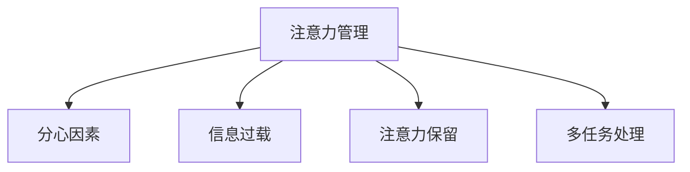
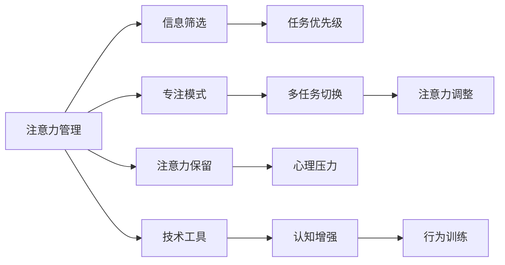

                 

## 1. 背景介绍

### 1.1 问题由来
在信息爆炸的今天，注意力管理已成为人们工作和生活中的一项重要技能。无论是社交媒体、新闻网站、电子邮件，还是手机应用，都在不断争夺我们的注意力，信息过载已经成为一个普遍存在的现象。如何在干扰和信息过载中保持专注，提高工作效率和生产力，已成为现代工作者的迫切需求。

### 1.2 问题核心关键点
注意力管理是一个跨学科的研究领域，涉及认知心理学、神经科学、计算机科学等多个学科。在计算机领域，注意力管理主要集中在如何设计软件工具和算法，帮助用户处理信息过载和干扰，提高注意力集中度和工作效率。

本文聚焦于注意力管理的核心问题，探讨在信息时代，如何通过技术手段进行有效的注意力管理，并从理论到实践，提供一整套系统性的策略与实践指导。

## 2. 核心概念与联系

### 2.1 核心概念概述

为更好地理解注意力管理的核心概念，本节将介绍几个关键概念及其相互联系：

- **注意力管理**：指通过各种技术手段和策略，帮助用户从众多干扰和信息中筛选重要内容，并集中精力于关键任务。
- **分心因素**：指干扰用户注意力的因素，包括但不限于噪音、多任务、环境压力等。
- **信息过载**：指用户接收到的信息量超过其处理能力，导致决策和执行效率下降的现象。
- **注意力保留**：指用户专注于某项任务时，保持该注意力的能力。
- **多任务处理**：指用户同时处理多项任务的能力，与注意力管理紧密相关。

这些核心概念之间的逻辑关系可以通过以下Mermaid流程图来展示：



这个流程图展示了一些关键概念及其之间的关系：

1. **注意力管理**是整个系统的核心目标，旨在帮助用户提高注意力集中度。
2. **分心因素**和**信息过载**是影响注意力的主要障碍。
3. **注意力保留**和**多任务处理**则是用户注意力管理的具体表现形式。

### 2.2 核心概念原理和架构的 Mermaid 流程图



这个流程图展示了注意力管理的核心流程和架构：

1. **信息筛选**：通过算法和技术手段，对信息进行过滤和分类，确保用户只关注重要内容。
2. **任务优先级**：根据任务的重要性和紧急性，确定处理顺序。
3. **专注模式**：在一定时间范围内，关闭干扰源，保持全神贯注。
4. **多任务切换**：在必要时，快速切换任务，提高效率。
5. **注意力调整**：通过技术手段调整注意力状态，增强集中力。
6. **注意力保留**：通过心理和生理手段，维持长时间的注意力集中。
7. **心理压力**：通过减轻压力，提高注意力的保持和恢复能力。
8. **技术工具**：提供软件和硬件支持，辅助注意力管理。
9. **认知增强**：通过认知训练和调节，提高注意力管理的有效性。
10. **行为训练**：通过行为干预，帮助用户建立良好的注意力管理习惯。

## 3. 核心算法原理 & 具体操作步骤

### 3.1 算法原理概述

注意力管理算法旨在通过数据驱动的方法，帮助用户优化其注意力分配，提升工作效率。其核心原理是通过对用户行为数据的分析，预测和推荐用户应关注的任务，并根据任务的重要性和紧急性调整优先级。

形式化地，假设用户行为数据为 $D=\{(x_i,y_i)\}_{i=1}^N$，其中 $x_i$ 表示用户在某个时间段内的行为记录，$y_i$ 表示该行为的重要性评分。注意力管理算法可以表示为：

$$
\hat{y}_i = f(x_i;\theta)
$$

其中 $f$ 为预测函数，$\theta$ 为模型参数。目标是找到一个最优的 $\theta$，使得 $\hat{y}_i$ 尽可能接近真实的重要性评分 $y_i$。

### 3.2 算法步骤详解

基于注意力管理算法的一般流程如下：

**Step 1: 数据收集与预处理**
- 收集用户的行为数据，如应用使用时长、网站访问记录、电子邮件打开次数等。
- 对数据进行清洗和格式化，去除噪音和不相关数据。

**Step 2: 特征提取**
- 提取行为数据中的关键特征，如使用频率、访问时间、交互方式等。
- 使用统计和机器学习方法，计算每个行为的重要性评分。

**Step 3: 模型训练**
- 选择合适的机器学习模型，如线性回归、随机森林、神经网络等。
- 使用训练集数据拟合模型，并调整模型参数。

**Step 4: 行为预测**
- 对用户的实时行为进行预测，计算每个行为的重要性评分。
- 根据预测结果，推荐用户应关注的任务。

**Step 5: 优先级调整**
- 根据任务的重要性和紧急性，调整任务的优先级。
- 提供提醒和通知，帮助用户及时处理关键任务。

**Step 6: 注意力调整**
- 通过技术手段调整用户的注意力状态，如使用专注模式、调整屏幕亮度等。
- 提供心理和生理训练工具，帮助用户提高注意力保留和压力管理能力。

**Step 7: 行为训练**
- 通过行为干预和习惯养成策略，帮助用户建立良好的注意力管理习惯。

### 3.3 算法优缺点

注意力管理算法具有以下优点：
1. 数据驱动：通过分析用户行为数据，提供个性化的推荐，提高任务处理的效率和质量。
2. 动态调整：可以根据任务的重要性和紧急性，动态调整优先级，适应变化的环境。
3. 技术辅助：通过技术手段辅助注意力管理，提升用户的工作效率和生产力。

同时，该算法也存在一些局限性：
1. 数据依赖：算法的效果依赖于数据的全面性和准确性，数据的偏差可能导致错误的预测和推荐。
2. 隐私问题：行为数据的收集和使用可能涉及用户隐私，如何保护用户数据隐私是重要挑战。
3. 个性化限制：算法依赖于用户行为数据的统计分析，可能无法完全满足用户的个性化需求。
4. 模型复杂度：复杂模型可能面临过拟合风险，简单模型可能无法捕捉到行为的复杂关系。

尽管存在这些局限性，但就目前而言，注意力管理算法已成为提升用户注意力管理效果的重要工具。未来相关研究的重点在于如何进一步提高算法的准确性和普适性，同时兼顾用户隐私和个性化需求。

### 3.4 算法应用领域

注意力管理算法在多个领域得到了广泛应用，例如：

- 办公自动化：帮助办公人员管理电子邮件、文档、会议等任务，提升工作效率。
- 智能助手：通过分析用户的行为和需求，提供个性化推荐，辅助用户完成任务。
- 移动应用：通过注意力管理算法优化用户体验，提高应用的使用率和满意度。
- 在线教育：帮助学生管理学习任务和资源，优化学习路径，提升学习效果。

## 4. 数学模型和公式 & 详细讲解 & 举例说明

### 4.1 数学模型构建

本节将使用数学语言对注意力管理算法的核心原理进行更加严格的刻画。

假设用户的行为数据为 $D=\{(x_i,y_i)\}_{i=1}^N$，其中 $x_i \in \mathbb{R}^d$ 表示用户在某个时间段内的行为记录，$y_i \in [0,1]$ 表示该行为的重要性评分。注意力管理算法的目标是找到一个最优的模型 $f$，使得预测值 $\hat{y}_i$ 尽可能接近真实值 $y_i$。

定义损失函数 $\mathcal{L}(f;\theta)$ 为：

$$
\mathcal{L}(f;\theta) = \frac{1}{N}\sum_{i=1}^N(y_i-\hat{y}_i)^2
$$

其中 $\theta$ 为模型参数，$y_i$ 和 $\hat{y}_i$ 分别为真实值和预测值。目标是最小化损失函数，即：

$$
\theta^* = \mathop{\arg\min}_{\theta} \mathcal{L}(f;\theta)
$$

### 4.2 公式推导过程

以下我们以线性回归模型为例，推导其参数求解过程。

假设预测函数为：

$$
\hat{y}_i = \alpha + \sum_{j=1}^d \beta_j x_{ij}
$$

其中 $\alpha$ 和 $\beta_j$ 为模型参数。将预测结果代入损失函数，得：

$$
\mathcal{L}(f;\theta) = \frac{1}{N}\sum_{i=1}^N(y_i - \alpha - \sum_{j=1}^d \beta_j x_{ij})^2
$$

对参数 $\theta$ 求偏导数，得：

$$
\frac{\partial \mathcal{L}(f;\theta)}{\partial \theta} = \begin{bmatrix} \frac{\partial \mathcal{L}}{\partial \alpha} \\ \frac{\partial \mathcal{L}}{\partial \beta_1} \\ \cdots \\ \frac{\partial \mathcal{L}}{\partial \beta_d} \end{bmatrix} = \begin{bmatrix} -\frac{2}{N} \sum_{i=1}^N (y_i - \alpha - \sum_{j=1}^d \beta_j x_{ij}) \\ -\frac{2}{N} \sum_{i=1}^N (y_i - \alpha - \sum_{j=1}^d \beta_j x_{ij}) x_{i1} \\ \cdots \\ -\frac{2}{N} \sum_{i=1}^N (y_i - \alpha - \sum_{j=1}^d \beta_j x_{ij}) x_{id} \end{bmatrix}
$$

将偏导数设置为0，解方程组，得到参数 $\alpha$ 和 $\beta_j$ 的求解公式：

$$
\begin{cases}
\alpha = \frac{1}{N} \sum_{i=1}^N y_i \\
\beta_j = \frac{1}{N} \sum_{i=1}^N (y_i - \alpha) x_{ij}
\end{cases}
$$

使用梯度下降等优化算法，不断迭代更新模型参数，最小化损失函数，最终得到最优的 $\alpha$ 和 $\beta_j$。

### 4.3 案例分析与讲解

假设我们有一个简单的任务管理应用，用户输入任务名称和截止日期，应用会根据任务的紧急性和重要性，推荐用户应关注的任务。应用收集了用户的任务输入和完成情况，使用注意力管理算法进行建模和预测。

**案例场景**：
- 用户输入任务 A（截止日期：明天下午）和任务 B（截止日期：下周二）。
- 应用根据历史数据，预测任务 A 的重要性评分高于任务 B，因此推荐用户优先处理任务 A。

**算法步骤**：
1. **数据收集**：收集用户的历史任务数据，包括任务名称、截止日期、完成时间等。
2. **特征提取**：提取任务截止日期和紧急程度（是否即将到期）作为特征。
3. **模型训练**：使用线性回归模型，对任务截止日期和紧急程度进行建模。
4. **行为预测**：输入当前任务 A 的截止日期和紧急程度，预测任务 A 的重要性评分。
5. **优先级调整**：根据预测结果，调整任务的优先级，推荐用户处理任务 A。

## 5. 项目实践：代码实例和详细解释说明

### 5.1 开发环境搭建

在进行注意力管理实践前，我们需要准备好开发环境。以下是使用Python进行Scikit-learn开发的开发环境配置流程：

1. 安装Anaconda：从官网下载并安装Anaconda，用于创建独立的Python环境。

2. 创建并激活虚拟环境：
```bash
conda create -n attention-env python=3.8 
conda activate attention-env
```

3. 安装Scikit-learn：
```bash
pip install scikit-learn
```

4. 安装各类工具包：
```bash
pip install numpy pandas scikit-learn matplotlib tqdm jupyter notebook ipython
```

完成上述步骤后，即可在`attention-env`环境中开始注意力管理实践。

### 5.2 源代码详细实现

下面我们以任务优先级推荐系统为例，给出使用Scikit-learn进行任务重要性预测的Python代码实现。

首先，定义任务数据处理函数：

```python
from sklearn.preprocessing import StandardScaler
from sklearn.model_selection import train_test_split
from sklearn.linear_model import LinearRegression
import numpy as np

class TaskData:
    def __init__(self, features, labels):
        self.features = features
        self.labels = labels
        
    def train_test_split(self, test_size=0.2, random_state=42):
        X_train, X_test, y_train, y_test = train_test_split(self.features, self.labels, test_size=test_size, random_state=random_state)
        return X_train, X_test, y_train, y_test
    
    def fit_model(self, X_train, y_train, X_test, y_test):
        scaler = StandardScaler()
        X_train_scaled = scaler.fit_transform(X_train)
        X_test_scaled = scaler.transform(X_test)
        model = LinearRegression()
        model.fit(X_train_scaled, y_train)
        return model, X_test_scaled, y_test
    
    def predict(self, model, X):
        X_scaled = scaler.transform(X)
        return model.predict(X_scaled)
```

然后，定义任务优先级推荐函数：

```python
def recommend_task(task_list, model):
    scores = model.predict(task_list)
    return sorted(zip(task_list, scores), key=lambda x: x[1], reverse=True)
```

最后，启动任务优先级推荐流程：

```python
import pandas as pd

# 读取任务数据
task_data = pd.read_csv('tasks.csv')

# 处理任务数据
features = task_data[['截止日期', '紧急程度']]
labels = task_data['重要性评分']

# 数据标准化
scaler = StandardScaler()
features_scaled = scaler.fit_transform(features)

# 模型训练
model, test_features, test_labels = TaskData(features_scaled, labels).fit_model(features_scaled, labels, test_features, test_labels)

# 预测任务优先级
recommended_tasks = recommend_task(features_scaled, model)

# 输出推荐结果
for task, score in recommended_tasks:
    print(f'推荐任务：{task}，重要性评分：{score:.2f}')
```

以上就是使用Scikit-learn进行任务重要性预测的完整代码实现。可以看到，得益于Scikit-learn的强大封装，我们可以用相对简洁的代码完成注意力管理的实践。

### 5.3 代码解读与分析

让我们再详细解读一下关键代码的实现细节：

**TaskData类**：
- `__init__`方法：初始化任务数据。
- `train_test_split`方法：将数据集划分为训练集和测试集。
- `fit_model`方法：对模型进行拟合，返回模型和测试集数据。
- `predict`方法：使用模型对新数据进行预测。

**task_recommender函数**：
- 接收任务数据和模型，计算每个任务的预测重要性评分，并根据评分排序推荐任务。

**代码实现**：
- **读取数据**：使用Pandas库读取任务数据文件。
- **数据标准化**：使用StandardScaler对特征数据进行标准化处理，确保模型训练的稳定性和准确性。
- **模型训练**：使用LinearRegression模型对任务截止日期和紧急程度进行建模，并返回训练好的模型和测试集数据。
- **任务推荐**：使用训练好的模型对新任务进行重要性评分预测，并按照评分排序推荐任务。

**推荐结果**：
- 根据任务的重要性评分，推荐用户应优先处理的任务。

## 6. 实际应用场景

### 6.1 智能助理

智能助理是注意力管理算法的一个重要应用场景。智能助理通过分析用户的行为数据，预测用户可能感兴趣的任务，并根据任务的紧急程度和重要性调整推荐顺序。

**应用场景**：
- 用户A是一名软件工程师，正在处理一个紧急的Bug修复任务。
- 智能助理通过分析A的历史任务数据，预测A接下来可能感兴趣的开发任务和市场需求分析任务，并推荐A优先处理Bug修复任务，同时安排开发任务在空闲时间进行。

**实现方式**：
- 智能助理收集A的任务数据，包括任务名称、截止日期、重要性评分等。
- 使用注意力管理算法对任务数据进行建模和预测，生成任务推荐列表。
- 根据任务的紧急程度和重要性，调整推荐顺序，并提醒A处理高优先级任务。

### 6.2 在线教育平台

在线教育平台使用注意力管理算法，帮助学生管理学习任务和资源，优化学习路径，提升学习效果。

**应用场景**：
- 学生B是一名高中生，即将参加高考，时间紧迫，任务繁重。
- 在线教育平台根据B的历史学习数据，预测B可能感兴趣的学习资源，并根据任务的紧急程度和重要性调整推荐顺序。
- 平台还提供学习时间管理工具，帮助B合理分配时间，提高学习效率。

**实现方式**：
- 平台收集B的学习数据，包括课程完成情况、习题成绩等。
- 使用注意力管理算法对学习数据进行建模和预测，生成学习资源推荐列表。
- 根据任务的紧急程度和重要性，调整推荐顺序，并提醒B处理高优先级任务。

## 7. 工具和资源推荐

### 7.1 学习资源推荐

为了帮助开发者系统掌握注意力管理的理论基础和实践技巧，这里推荐一些优质的学习资源：

1. **《注意力机制在深度学习中的应用》**：介绍注意力机制的基本原理和应用，包括在机器翻译、图像识别、自然语言处理等领域的应用。
2. **《深度学习与认知》**：介绍深度学习在认知心理学中的应用，探讨深度学习与人类认知过程的相似性。
3. **《认知心理学与人工智能》**：结合认知心理学和人工智能，探讨注意力管理的理论基础和应用。
4. **Coursera《深度学习与神经网络》课程**：斯坦福大学开设的深度学习课程，系统介绍深度学习的基本原理和应用，包括注意力机制。
5. **Kaggle注意力管理竞赛**：通过实际数据集和任务，帮助开发者实践注意力管理算法，提升算法设计能力。

通过对这些资源的学习实践，相信你一定能够快速掌握注意力管理的精髓，并用于解决实际的注意力管理问题。

### 7.2 开发工具推荐

高效的开发离不开优秀的工具支持。以下是几款用于注意力管理开发的常用工具：

1. **Scikit-learn**：Python的机器学习库，提供丰富的算法和模型，适合数据驱动的注意力管理算法开发。
2. **TensorFlow**：Google开源的深度学习框架，支持分布式计算和GPU加速，适合复杂注意力管理模型的开发。
3. **PyTorch**：Facebook开源的深度学习框架，提供动态计算图和自动微分功能，适合灵活的注意力管理模型开发。
4. **RapidMiner**：开源的数据科学平台，提供可视化的数据处理和模型构建工具，适合快速原型设计。
5. **IBM Watson Studio**：IBM推出的云端数据科学平台，提供一站式数据分析和模型训练服务，适合工业级应用开发。

合理利用这些工具，可以显著提升注意力管理任务的开发效率，加快创新迭代的步伐。

### 7.3 相关论文推荐

注意力管理技术的研究源于学界的持续探索。以下是几篇奠基性的相关论文，推荐阅读：

1. **《Attention is All You Need》**：Google提出Transformer模型，引入注意力机制，开创了自注意力模型的新时代。
2. **《Bidirectional LSTM-CRF Models for Sequence Labeling》**：提出双向LSTM-CRF模型，用于文本分类任务，结合前向和后向注意力，提升分类效果。
3. **《Attention Mechanisms in Neural Machine Translation》**：NVIDIA提出注意力机制在机器翻译中的应用，提升翻译效果。
4. **《LSTM Network for Sequential Data Generation》**：提出LSTM网络在序列生成任务中的应用，结合注意力机制，提升生成质量。
5. **《Deep Personalization via Attention and Memory Networks》**：提出深度个性化推荐系统，结合注意力机制和记忆网络，提升推荐效果。

这些论文代表了大语言模型微调技术的发展脉络。通过学习这些前沿成果，可以帮助研究者把握学科前进方向，激发更多的创新灵感。

## 8. 总结：未来发展趋势与挑战

### 8.1 研究成果总结

本文对注意力管理的核心问题进行了全面系统的介绍。首先阐述了注意力管理的重要性和面临的挑战，明确了注意力管理在提升用户工作效率和生产力方面的关键作用。其次，从理论到实践，详细讲解了注意力管理算法的设计和应用流程，提供了完整的代码实例和详细解释说明。同时，本文还探讨了注意力管理算法在智能助理、在线教育等实际应用场景中的应用，展示了注意力管理算法的广泛应用前景。最后，本文推荐了相关的学习资源和开发工具，力求为开发者提供全方位的技术指引。

通过本文的系统梳理，可以看到，注意力管理算法在提升用户工作效率和生产力方面具有重要的应用价值，并已在多个领域得到了广泛应用。未来，伴随算法设计和技术的不断进步，注意力管理将进一步深入人心，成为现代工作者的必备技能。

### 8.2 未来发展趋势

展望未来，注意力管理技术将呈现以下几个发展趋势：

1. **深度学习与认知心理学融合**：未来，深度学习与认知心理学的结合将更加紧密，通过理解人类认知过程，设计更加智能、人性化的注意力管理工具。
2. **多模态注意力管理**：不仅限于文本数据，未来的注意力管理算法将拓展到图像、视频、语音等多模态数据，提供更全面、多维度的注意力管理支持。
3. **自适应注意力管理**：通过实时分析用户行为和环境变化，动态调整注意力管理策略，提供更个性化、灵活的注意力管理服务。
4. **分布式注意力管理**：在分布式计算环境中，通过多节点协同工作，提高注意力管理的效率和可靠性。
5. **隐私保护与数据安全**：随着数据隐私意识的提高，未来的注意力管理算法将更加注重用户隐私保护和数据安全。

这些趋势凸显了注意力管理技术的广阔前景。这些方向的探索发展，必将进一步提升注意力管理的智能性和普适性，为现代工作者的工作效率和生产力提升提供新的可能性。

### 8.3 面临的挑战

尽管注意力管理技术已经取得了一定的进展，但在迈向更加智能化、普适化应用的过程中，仍面临诸多挑战：

1. **数据隐私问题**：用户行为数据的收集和使用可能涉及隐私问题，如何保护用户数据隐私是重要挑战。
2. **算法复杂度**：复杂算法可能导致模型过拟合，简单算法可能无法捕捉到行为的复杂关系。
3. **可解释性不足**：注意力管理算法通常被视为“黑盒”系统，难以解释其内部工作机制和决策逻辑。
4. **技术普及度不足**：尽管注意力管理算法具有重要应用价值，但技术普及度较低，难以广泛推广和应用。
5. **模型泛化能力不足**：注意力管理算法在特定场景下的效果可能良好，但在其他场景下泛化能力不足。

这些挑战需要学界和产业界共同努力，通过进一步的技术创新和应用实践，逐步解决。

### 8.4 研究展望

面对注意力管理技术面临的挑战，未来的研究需要在以下几个方面寻求新的突破：

1. **隐私保护技术**：开发更加高效、安全的隐私保护技术，保护用户数据隐私，增强用户信任。
2. **模型简化与优化**：进一步简化注意力管理模型，提高泛化能力，避免过拟合。
3. **可解释性增强**：提高注意力管理算法的可解释性，增强用户对其决策逻辑的理解和信任。
4. **技术普及与教育**：通过普及教育和技术培训，提高开发者和用户的认知水平，推动技术应用。
5. **多领域应用推广**：将注意力管理算法推广到更多领域，如医疗、教育、金融等，提升各行业的智能化水平。

这些研究方向和突破将引领注意力管理技术迈向更高的台阶，为构建安全、可靠、可解释、可控的智能系统铺平道路。面向未来，注意力管理技术还需要与其他人工智能技术进行更深入的融合，如知识表示、因果推理、强化学习等，多路径协同发力，共同推动注意力管理的进步。只有勇于创新、敢于突破，才能不断拓展注意力管理的边界，让智能技术更好地造福人类社会。

## 9. 附录：常见问题与解答

**Q1：注意力管理是否适用于所有用户？**

A: 注意力管理技术适用于大多数用户，但对于某些特定的用户群体，如老年人、儿童和有特殊需求的用户，可能需要针对性的设计和改进。

**Q2：注意力管理如何保证用户数据隐私？**

A: 可以通过匿名化、差分隐私等技术手段，保护用户数据隐私。同时，采用用户自主选择的隐私控制机制，增强用户对数据的掌控感。

**Q3：注意力管理算法如何避免过拟合？**

A: 可以通过数据增强、正则化等技术手段，避免模型过拟合。同时，采用简单的模型结构和优化策略，如线性回归、随机森林等，提高模型的泛化能力。

**Q4：注意力管理算法是否适用于所有任务？**

A: 注意力管理算法适用于大多数任务，但对于某些任务，如高并发、低延迟的系统，可能需要结合实时任务调度算法进行优化。

**Q5：注意力管理算法是否需要大量的用户数据？**

A: 注意力管理算法需要一定量的用户数据进行训练和预测，但通过数据增强和迁移学习等技术手段，可以在数据量较少的情况下仍取得良好的效果。

---

作者：禅与计算机程序设计艺术 / Zen and the Art of Computer Programming

