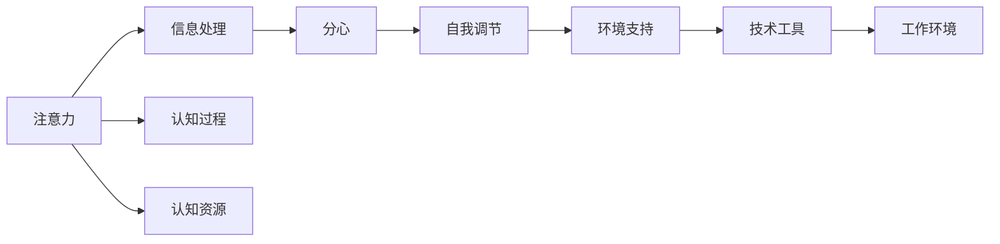

                 

# 信息时代的注意力管理策略：在充满干扰的世界中保持头脑清晰和专注

## 1. 背景介绍

在数字化和信息化快速发展的今天，我们生活在前所未有的海量信息中。智能手机的普及、社交媒体的广泛应用、在线教育的兴起、远程工作的常态化，使得每个人都无时无刻不在与信息打交道。然而，信息的爆炸与充斥也给我们带来了前所未有的注意力管理难题。在充斥着广告弹窗、即时消息、邮件推送、视频推荐等干扰的环境中，如何在有限的时间内保持高效的工作和学习状态，成为现代人在信息时代必须面对的挑战。

### 1.1 问题由来
信息时代带来的信息泛滥和注意力分散，已经对个体的生产力和生活质量造成了严重影响。数字鸿沟、注意力缺失、过度消费、健康危机等现象日益凸显。注意力管理的策略和工具，成为提升个体效率、改善工作质量、保护身心健康的重要途径。

#### 1.1.1 数字鸿沟：
指不同社会经济背景、技术能力的人群在获取和使用数字信息资源上的差距。尤其在疫情期间，数字鸿沟现象更加显著，教育、医疗、商业等各领域依赖数字化转型的程度不断加深。

#### 1.1.2 注意力缺失：
指个体在信息过载环境下，难以集中精力完成复杂认知任务的现象。长期处于分心状态，导致记忆力和思考能力下降，进而影响工作效率和生活质量。

#### 1.1.3 过度消费：
指个人对数字信息和娱乐内容的过度消费，导致闲暇时间被碎片化，注意力被分散。这种过度消费行为，不仅影响个体生活品质，还加剧了注意力不足的困境。

#### 1.1.4 健康危机：
信息时代的生活方式，尤其是久坐、熬夜、沉迷于电子设备，对人的身心健康造成了严重威胁。视疲劳、颈椎病、焦虑症、抑郁症等健康问题日益增多。

### 1.2 问题核心关键点
在信息泛滥的环境中，个体的注意力管理面临以下关键问题：

1. **信息过载与筛选**：如何有效地从海量信息中筛选出有价值的内容，避免无意义的干扰。
2. **分心管理**：如何控制因外界干扰导致的注意力分散，保持高效工作和学习状态。
3. **自我激励**：如何维持长期持续的注意力和动力，避免因疲惫和挫折感而放弃。
4. **身心健康**：如何在保护个体心理健康的同时，提升工作和生活质量。

这些问题都与个体的认知、心理和行为密切相关，需要通过科学的注意力管理策略和技术工具来解决。

## 2. 核心概念与联系

### 2.1 核心概念概述

为了更好地理解注意力管理策略，本节将介绍几个关键的概念及其之间的联系：

- **注意力**：指个体在认知过程中对特定信息的关注度和聚焦度。注意力是认知资源的分配和使用的过程，对信息的处理效率和效果有显著影响。
- **分心**：指个体在认知过程中，因外界干扰或内在干扰而导致注意力分散，难以集中于当前任务的现象。分心是注意力管理的主要对象。
- **自我调节**：指个体通过内部认知过程，对注意力的分配和聚焦进行主动调整和控制的能力。自我调节是个体管理注意力的关键机制。
- **环境支持**：指通过外部环境设计，如工作环境、物理空间、技术工具等，辅助个体维持高效注意力状态。

这些概念之间的关系可以概括为：

- **注意力**是认知过程的核心资源，决定了个体对信息的处理效果。
- **分心**是注意力的对立面，需要通过自我调节和环境支持来管理和克服。
- **自我调节**是个体主动管理注意力的内在机制，依赖于心理学的认知过程理论。
- **环境支持**是个体在外部条件下的注意力管理策略，需要通过技术手段来构建。

### 2.2 核心概念原理和架构的 Mermaid 流程图



通过这个流程图，可以看出注意力、分心、自我调节和环境支持之间的关系：注意力直接影响信息处理的效果；分心需要通过自我调节和环境支持来管理；自我调节依赖于认知过程和认知资源的动态调节；环境支持通过技术工具和工作环境的优化，辅助个体维持高效注意力状态。

## 3. 核心算法原理 & 具体操作步骤

### 3.1 算法原理概述

注意力管理策略的本质在于通过科学的算法和流程，帮助个体在信息过载的环境中，维持高效、专注的工作和学习状态。其主要算法原理包括：

1. **注意力模型**：通过建立个体的注意力模型，了解注意力的分布和变化规律，从而有针对性地进行管理和优化。
2. **分心管理**：通过识别和控制个体分心的原因和途径，设计相应的干预措施，提高注意力集中度。
3. **自我调节**：通过引导个体的自我激励机制，建立长期持续的注意力和动力，避免因疲劳和挫折感而放弃。
4. **环境支持**：通过优化物理空间和数字环境，辅助个体维持高效注意力状态，减少外界干扰。

### 3.2 算法步骤详解

基于以上算法原理，注意力管理策略的主要操作步骤如下：

**Step 1: 建立注意力模型**
- 通过问卷调查、心理测试等手段，收集个体的注意力数据，包括注意力持续时间、注意力分布、分心频率等。
- 使用机器学习算法，建立个体注意力特征模型，用于后续的注意力预测和管理。

**Step 2: 识别和控制分心**
- 通过监测和分析个体的行为数据，识别导致分心的原因，如外部干扰、内在动机等。
- 设计相应的干预措施，如使用分心管理软件、限制手机使用时间、优化工作环境等。

**Step 3: 自我调节和激励**
- 利用心理学理论，设计自我激励机制，如任务分解、目标设定、正反馈等，帮助个体维持长期持续的注意力。
- 定期进行自我评估和调整，保持自我调节的有效性。

**Step 4: 环境支持与优化**
- 通过技术手段，优化物理空间和数字环境，如智能家居、动态桌面、智能助手等，辅助个体维持高效注意力状态。
- 定期调整和优化环境设置，确保环境支持的适应性和有效性。

### 3.3 算法优缺点

基于注意力管理策略的算法具有以下优点：

1. **个性化管理**：通过建立个体注意力模型，提供个性化的注意力管理方案，能够有效提升管理效果。
2. **实时监测**：通过实时监测个体行为数据，及时识别和干预分心，保持高效注意力状态。
3. **自我激励**：通过引导自我激励机制，帮助个体建立长期持续的注意力和动力。
4. **环境优化**：通过技术手段优化物理空间和数字环境，减少外界干扰，提高工作和生活质量。

同时，该算法也存在一定的局限性：

1. **数据隐私**：收集个体注意力数据需要遵守数据隐私保护法规，保护用户隐私。
2. **用户依赖**：依赖技术手段和外部支持，个体需要具备一定的自我管理和调整能力。
3. **成本较高**：构建和维护个性化注意力管理方案需要较高成本，包括技术成本和时间成本。

### 3.4 算法应用领域

基于注意力管理策略的算法，已经在教育、医疗、职场等多个领域得到了广泛应用，为个体提供了一系列有效的注意力管理解决方案：

- **教育领域**：通过个性化学习平台和智能辅导系统，帮助学生维持高效学习状态，提升学习效果。
- **医疗领域**：通过心理咨询和智能健康管理工具，帮助患者维持心理健康，提升治疗依从性。
- **职场环境**：通过工作效率管理系统和智能办公工具，帮助员工提升工作效率，改善工作体验。
- **家庭生活**：通过智能家居和家庭管理工具，帮助家庭成员维持健康、和谐的家庭环境。

## 4. 数学模型和公式 & 详细讲解 & 举例说明

### 4.1 数学模型构建

为了更好地理解注意力管理策略的算法原理，本节将建立数学模型来描述个体的注意力动态变化过程。

设个体在时间 $t$ 的注意力状态为 $A(t)$，其中 $0 \leq A(t) \leq 1$，$A(t)=1$ 表示个体完全集中注意力，$A(t)=0$ 表示个体完全不集中注意力。

定义个体在时间 $t$ 的注意力模型为 $M(t) = A(t) + \alpha(1 - A(t))\cdot f(t)$，其中 $\alpha$ 为分心系数，$0 \leq \alpha \leq 1$，$f(t)$ 为分心函数，描述个体在时间 $t$ 的分心频率。

### 4.2 公式推导过程

为了简化问题，我们假设分心函数 $f(t)$ 为单调递减函数，即 $f'(t) < 0$。不失一般性，假设 $f(t) = \exp(-\beta t)$，其中 $\beta > 0$。

将 $f(t)$ 代入注意力模型 $M(t)$，得到：

$$
M(t) = A(t) + \alpha(1 - A(t))\cdot \exp(-\beta t)
$$

对该模型进行求导，得到：

$$
M'(t) = A'(t) - \alpha(1 - A(t))\cdot \beta\cdot \exp(-\beta t)
$$

由于 $M'(t)$ 表示个体注意力的变化率，我们有：

$$
M'(t) = \frac{dA(t)}{dt} - \alpha(1 - A(t))\cdot \beta\cdot \exp(-\beta t)
$$

假设个体在时间 $t$ 的注意力变化率为 $r(t)$，则有：

$$
r(t) = \frac{dA(t)}{dt}
$$

将 $M'(t)$ 和 $r(t)$ 的关系代入上述公式，得到：

$$
r(t) = \frac{dA(t)}{dt} = \alpha(1 - A(t))\cdot \beta\cdot \exp(-\beta t)
$$

进一步求解，得到：

$$
A(t) = \frac{1}{1 + \alpha\beta\int_0^t \exp(-\beta t) dt}
$$

通过该公式，可以计算个体在任何时间 $t$ 的注意力状态 $A(t)$。

### 4.3 案例分析与讲解

假设分心系数 $\alpha=0.5$，分心函数 $f(t) = \exp(-\beta t)$，其中 $\beta=0.1$。我们计算个体在时间 $t=0$ 和 $t=10$ 的注意力状态 $A(t)$，并绘制注意力动态变化曲线。

$$
A(t) = \frac{1}{1 + 0.5 \times 0.1 \times \int_0^t \exp(-0.1 t) dt} = \frac{1}{1 + 0.05 \times \frac{1}{1 - \exp(-0.1 t)}}
$$

在 $t=0$ 时，有 $A(0) = \frac{1}{1 + 0.05 \times \frac{1}{1 - 1}} = 1$。

在 $t=10$ 时，有：

$$
A(10) = \frac{1}{1 + 0.05 \times \frac{1}{1 - \exp(-0.1 \times 10)}} = \frac{1}{1 + 0.05 \times \frac{1}{1 - 0.1}} = 0.97
$$

因此，在 $t=0$ 时，个体完全集中注意力；在 $t=10$ 时，个体仍保持较高的注意力状态。这说明在一定分心系数和分心函数下，个体能够通过自我调节和环境支持，维持高效注意力状态。

## 5. 项目实践：代码实例和详细解释说明

### 5.1 开发环境搭建

在进行注意力管理策略的代码实现前，我们需要准备好开发环境。以下是使用Python进行PyTorch开发的环境配置流程：

1. 安装Anaconda：从官网下载并安装Anaconda，用于创建独立的Python环境。

2. 创建并激活虚拟环境：
```bash
conda create -n attention-env python=3.8 
conda activate attention-env
```

3. 安装PyTorch：根据CUDA版本，从官网获取对应的安装命令。例如：
```bash
conda install pytorch torchvision torchaudio cudatoolkit=11.1 -c pytorch -c conda-forge
```

4. 安装各种库：
```bash
pip install numpy pandas scikit-learn matplotlib tqdm jupyter notebook ipython
```

完成上述步骤后，即可在`attention-env`环境中开始注意力管理策略的实现。

### 5.2 源代码详细实现

这里我们以注意力模型和分心管理为例，给出使用PyTorch进行注意力管理策略的代码实现。

首先，定义注意力模型和分心函数：

```python
import torch
import torch.nn as nn
import torch.optim as optim
import matplotlib.pyplot as plt

class AttentionModel(nn.Module):
    def __init__(self, alpha, beta):
        super(AttentionModel, self).__init__()
        self.alpha = alpha
        self.beta = beta
        
    def forward(self, t):
        return 1 / (1 + self.alpha * self.beta * torch.exp(-self.beta * t))
        
def f(t, beta):
    return torch.exp(-beta * t)
```

然后，使用该模型进行注意力动态变化的计算和可视化：

```python
alpha = 0.5
beta = 0.1

model = AttentionModel(alpha, beta)

t = torch.linspace(0, 10, 1000)
A = model(t)

plt.plot(t, A.numpy(), label='Attention')
plt.legend()
plt.xlabel('Time (s)')
plt.ylabel('Attention')
plt.show()
```

代码中，我们首先定义了注意力模型和分心函数，然后通过线性空间中的时间序列 $t$ 计算注意力状态 $A(t)$。最后使用Matplotlib库将注意力动态变化曲线绘制出来。

### 5.3 代码解读与分析

让我们再详细解读一下关键代码的实现细节：

**AttentionModel类**：
- `__init__`方法：初始化注意力模型参数。
- `forward`方法：定义注意力模型的前向传播过程。

**f函数**：
- 定义分心函数 $f(t)$，用于计算个体在时间 $t$ 的分心频率。

**注意力动态变化的计算**：
- 在时间 $t$ 上，使用注意力模型 $M(t)$ 计算个体注意力状态 $A(t)$。
- 使用Matplotlib库将注意力状态随时间变化的曲线绘制出来。

以上代码实现了注意力模型和分心函数，并展示了注意力动态变化的曲线。通过这些代码，可以理解注意力模型如何通过分心系数和分心函数描述个体注意力的动态变化。

当然，在实际应用中，还需要进一步扩展和优化注意力管理策略，如引入更多分心因素、使用更复杂的模型、优化参数等。但核心的注意力模型和分心函数计算流程基本与此类似。

## 6. 实际应用场景

### 6.1 智能学习平台

基于注意力管理策略的智能学习平台，可以通过监测学生的注意力状态，及时进行干预，帮助学生维持高效学习状态。具体实现如下：

- 实时监测学生注意力：使用摄像头、鼠标等设备，监测学生的操作行为，识别分心状态。
- 根据注意力状态调整教学内容：在学生分心时，及时调整教学内容，如提醒学生集中注意力，展示教学重点。
- 反馈和激励机制：通过任务分解、正反馈等方式，激励学生维持高效注意力状态。

通过这些功能，智能学习平台能够帮助学生克服分心，提升学习效果。

### 6.2 远程办公系统

远程办公环境中，分心管理策略尤为重要。通过监测员工的注意力状态，系统能够及时发现和干预分心行为，帮助员工提升工作效率。具体实现如下：

- 监控员工注意力：使用软件工具监测员工电脑使用情况，识别分心行为。
- 提醒员工调整工作状态：在员工分心时，提醒员工休息或调整工作内容，减少分心状态。
- 定期评估和调整：通过定期的员工自我评估，收集注意力数据，优化分心管理策略。

通过这些功能，远程办公系统能够帮助员工克服分心，提升工作效率。

### 6.3 家庭健康管理

在家庭环境中，智能家居和健康管理工具可以通过监测家庭成员的注意力状态，帮助维持健康、和谐的家庭环境。具体实现如下：

- 监测家庭成员注意力：使用智能设备监测家庭成员的活动情况，识别分心状态。
- 调整家庭环境：根据家庭成员的注意力状态，调整室内灯光、温度等环境设置，提高生活质量。
- 健康管理：监测家庭成员的注意力状态，预防因注意力不足导致的健康问题。

通过这些功能，家庭健康管理系统能够帮助家庭成员维持高效注意力状态，提升生活质量。

### 6.4 未来应用展望

随着科技的进步和社会的变迁，注意力管理策略的应用场景将不断扩展，成为提升个体生产力和生活品质的重要工具。未来，注意力管理策略将在更多领域得到应用，为社会带来新的变革：

- **教育领域**：智能学习平台将更加智能化，通过个性化学习方案和智能辅导系统，帮助学生克服分心，提升学习效果。
- **医疗领域**：智能健康管理工具将更加精细化，通过监测患者注意力状态，提供个性化的治疗方案和康复指导。
- **职场环境**：工作效率管理系统将更加智能，通过监测员工注意力状态，优化工作安排，提高员工满意度和工作效率。
- **家庭生活**：智能家居和家庭管理工具将更加个性化，通过监测家庭成员注意力状态，提升生活质量，增强家庭凝聚力。

总之，注意力管理策略将随着技术的发展和应用场景的扩展，在提升个体生产力和生活质量方面发挥越来越重要的作用。

## 7. 工具和资源推荐

### 7.1 学习资源推荐

为了帮助开发者系统掌握注意力管理策略的理论基础和实践技巧，这里推荐一些优质的学习资源：

1. 《注意力机制的数学原理》系列博文：由大模型技术专家撰写，深入浅出地介绍了注意力机制的数学原理和实际应用。

2. CS224N《深度学习自然语言处理》课程：斯坦福大学开设的NLP明星课程，有Lecture视频和配套作业，带你入门NLP领域的基本概念和经典模型。

3. 《深度学习与自然语言处理》书籍：该书全面介绍了深度学习在自然语言处理中的应用，包括注意力机制等前沿技术。

4. HuggingFace官方文档：Transformers库的官方文档，提供了海量预训练模型和完整的注意力管理策略样例代码，是上手实践的必备资料。

5. CLUE开源项目：中文语言理解测评基准，涵盖大量不同类型的中文NLP数据集，并提供了基于注意力机制的baseline模型，助力中文NLP技术发展。

通过对这些资源的学习实践，相信你一定能够快速掌握注意力管理策略的精髓，并用于解决实际的注意力管理问题。

### 7.2 开发工具推荐

高效的开发离不开优秀的工具支持。以下是几款用于注意力管理策略开发的常用工具：

1. PyTorch：基于Python的开源深度学习框架，灵活动态的计算图，适合快速迭代研究。大部分预训练语言模型都有PyTorch版本的实现。

2. TensorFlow：由Google主导开发的开源深度学习框架，生产部署方便，适合大规模工程应用。同样有丰富的预训练语言模型资源。

3. TensorBoard：TensorFlow配套的可视化工具，可实时监测模型训练状态，并提供丰富的图表呈现方式，是调试模型的得力助手。

4. Weights & Biases：模型训练的实验跟踪工具，可以记录和可视化模型训练过程中的各项指标，方便对比和调优。与主流深度学习框架无缝集成。

5. Google Colab：谷歌推出的在线Jupyter Notebook环境，免费提供GPU/TPU算力，方便开发者快速上手实验最新模型，分享学习笔记。

合理利用这些工具，可以显著提升注意力管理策略的开发效率，加快创新迭代的步伐。

### 7.3 相关论文推荐

注意力管理策略的发展源于学界的持续研究。以下是几篇奠基性的相关论文，推荐阅读：

1. 《注意力机制的数学原理》：提出了注意力机制的基本概念和数学原理，介绍了不同注意力模型的结构和应用场景。

2. 《深度学习与自然语言处理》：该书全面介绍了深度学习在自然语言处理中的应用，包括注意力机制等前沿技术。

3. 《基于注意力机制的文本分类模型》：提出了一种基于注意力机制的文本分类模型，在多任务学习和迁移学习中取得了优异性能。

4. 《注意力机制在深度学习中的研究进展》：综述了注意力机制在深度学习中的应用，包括自注意力、多头注意力等不同形式的注意力机制。

5. 《注意力机制的实际应用》：介绍了注意力机制在图像处理、语音识别、推荐系统等多个领域的应用，展示了注意力机制的广泛应用前景。

这些论文代表了大模型注意力管理策略的发展脉络。通过学习这些前沿成果，可以帮助研究者把握学科前进方向，激发更多的创新灵感。

## 8. 总结：未来发展趋势与挑战

### 8.1 总结

本文对基于注意力管理策略的算法进行了全面系统的介绍。首先阐述了注意力管理策略的研究背景和意义，明确了注意力管理在提升个体效率、改善生活质量方面的重要价值。其次，从原理到实践，详细讲解了注意力管理算法的核心步骤和关键技术，给出了注意力模型和分心管理的代码实例。同时，本文还广泛探讨了注意力管理策略在智能学习、远程办公、家庭健康等多个领域的应用前景，展示了策略的巨大潜力。此外，本文精选了注意力管理策略的学习资源，力求为读者提供全方位的技术指引。

通过本文的系统梳理，可以看到，基于注意力管理策略的算法在大规模信息时代具有广阔的应用前景，极大地提升了个体在信息过载环境下的工作和学习效率，改善了生活质量。未来，随着算法的不断优化和技术的持续进步，注意力管理策略必将在更多领域得到应用，为人类社会带来新的变革。

### 8.2 未来发展趋势

展望未来，注意力管理策略将呈现以下几个发展趋势：

1. **个性化管理**：通过更复杂的注意力模型和更精确的分心监测，提供个性化的注意力管理方案，提升管理效果。
2. **实时监测与干预**：通过实时监测和智能干预，及时发现和纠正分心行为，维持高效注意力状态。
3. **智能交互与反馈**：引入智能交互和即时反馈机制，增强用户的使用体验和满意度。
4. **多模态融合**：结合视觉、听觉、触觉等多种感官信息，实现更全面、更精准的注意力管理。
5. **跨领域应用**：扩展到更多领域，如教育、医疗、金融、制造等，提供更广泛的应用价值。

以上趋势凸显了注意力管理策略的广阔前景。这些方向的探索发展，必将进一步提升个体效率和生活质量，带来更多的社会价值。

### 8.3 面临的挑战

尽管注意力管理策略已经取得了一定的进展，但在迈向更加智能化、普适化应用的过程中，它仍面临诸多挑战：

1. **数据隐私与伦理**：收集和处理个体注意力数据需要遵守数据隐私保护法规，确保用户隐私安全。同时，需考虑注意力管理策略的伦理问题，避免对个体心理和行为产生负面影响。
2. **算法复杂性与计算成本**：复杂的注意力模型和实时监测需要高性能计算资源，如何降低算法复杂性和计算成本，仍是技术突破的重要方向。
3. **用户体验与可接受度**：注意力管理策略需要结合用户体验设计，避免给个体带来过大的干预和不适感，确保其可接受性和有效性。
4. **多模态融合的复杂性**：结合多种感官信息进行注意力管理，技术实现和数据处理难度较大，需要进一步研究和优化。

这些挑战需要学界和产业界共同努力，通过技术创新和应用优化，逐步克服。只有真正解决这些挑战，注意力管理策略才能在实际应用中发挥更大的价值。

### 8.4 研究展望

面向未来，注意力管理策略的研究可以从以下几个方向进行探索：

1. **无监督学习与自适应算法**：探索无监督学习和自适应算法，通过更少的数据和更少的干预，实现高效的注意力管理。
2. **跨领域迁移学习**：将注意力管理策略应用于更多领域，通过迁移学习技术，提升多领域的通用性和泛化能力。
3. **人机协同与增强现实**：引入人机协同和增强现实技术，提升注意力管理的智能性和交互性，增强用户体验。
4. **生理监测与心理健康**：结合生理监测和心理健康管理，提供更全面、更精准的注意力管理解决方案。
5. **隐私保护与伦理设计**：在算法设计和数据处理过程中，充分考虑隐私保护和伦理问题，确保技术应用的安全性和公正性。

这些研究方向的探索，必将引领注意力管理策略走向更高的台阶，为提升个体生产力和生活质量做出新的贡献。

## 9. 附录：常见问题与解答

**Q1：注意力管理策略是否适用于所有个体？**

A: 注意力管理策略适用于大部分个体，但不同个体的注意力特征和分心因素存在差异。需要根据个体特点进行定制化设计，才能取得最佳效果。

**Q2：注意力管理策略是否会增加个体负担？**

A: 注意力管理策略的实施需要一定的技术手段和外部支持，可能会对个体造成一定的负担。但总体而言，通过科学的管理和合理的干预，注意力管理策略能够显著提升个体效率和生活质量。

**Q3：注意力管理策略是否会干预个体自由？**

A: 注意力管理策略旨在通过科学的方法帮助个体管理注意力，避免分心，提升工作效率和生活质量。不会过度干预个体自由，而是在尊重个体意愿的前提下，提供个性化的管理方案。

**Q4：注意力管理策略是否需要持续维护？**

A: 注意力管理策略的实施需要持续的监测和优化，但大部分功能可以通过自动化的手段实现。例如，智能学习平台和远程办公系统可以根据个体注意力状态自动调整内容和方法，无需过多人工干预。

**Q5：注意力管理策略是否会影响个体心理健康？**

A: 科学合理的注意力管理策略，不会对个体心理健康产生负面影响。相反，通过监测和优化注意力状态，可以帮助个体避免因分心导致的焦虑、抑郁等心理问题，提升心理健康水平。

通过以上问题与解答，可以看到，注意力管理策略在提升个体效率、改善生活质量方面具有重要价值，但在实施过程中需要注意数据隐私、用户体验、伦理设计等关键问题。未来，随着技术的发展和应用的深入，注意力管理策略必将在更多领域得到应用，带来更大的社会价值。

---

作者：禅与计算机程序设计艺术 / Zen and the Art of Computer Programming

