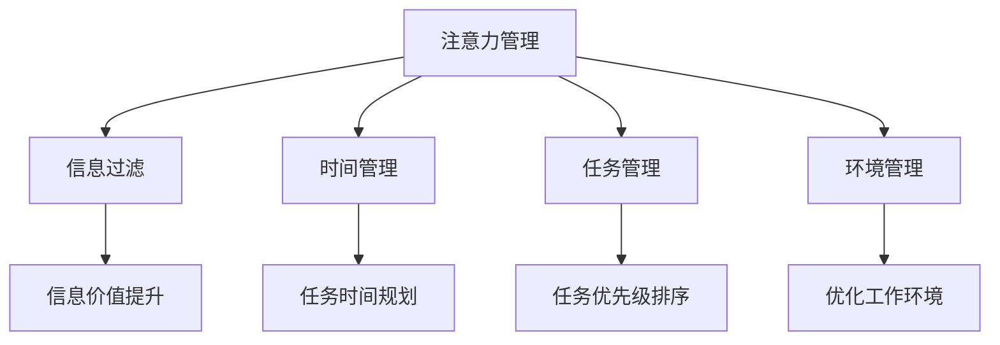

                 

# 信息时代的注意力管理策略：管理干扰和信息过载

在信息爆炸的时代，如何有效管理注意力，避免信息过载，是每一位IT从业者、乃至每一个普通人都需要面对的挑战。本文将从注意力管理的基本原理、核心概念、实际应用案例等多个维度，深入探讨信息时代的注意力管理策略。

## 1. 背景介绍

### 1.1 问题由来
随着互联网和移动设备的普及，信息量的爆炸式增长，人们面临的信息过载问题日益严重。在信息海中游泳，如何保持专注，提升效率，成为现代社会的一项重要技能。尽管现代技术提供了各种信息过滤和分类的工具，但人们仍然常常感到无法集中注意力，容易受到各种干扰，工作效率和生活质量因此受到影响。

### 1.2 问题核心关键点
管理干扰和信息过载的核心在于如何提高注意力集中度，提升信息处理效率。核心策略包括时间管理、任务管理、环境管理等，旨在打造一个高效、有序的工作和生活环境。

### 1.3 问题研究意义
有效管理注意力和信息，可以显著提升个人和组织的工作效率，减少错误率，优化决策质量。这对于IT从业者来说尤为重要，因为在高压力、高要求的工作环境中，注意力管理能力直接决定了工作效率和项目成功率。

## 2. 核心概念与联系

### 2.1 核心概念概述

为更好地理解信息时代的注意力管理策略，本节将介绍几个密切相关的核心概念：

- **注意力管理(Attention Management)**：指通过科学的方法和管理策略，提高个体或组织的注意力集中度，提升信息处理效率。
- **信息过滤(Information Filtering)**：指对大量信息进行筛选、分类，提供符合用户需求的有价值信息，减少无用的干扰。
- **时间管理(Time Management)**：通过合理安排时间，避免拖延和分心，确保高效工作。
- **任务管理(Task Management)**：将大任务拆解为小任务，制定优先级，提升任务完成的效率和效果。
- **环境管理(Environment Management)**：优化工作环境，减少外界干扰，提供专注的工作空间。

这些核心概念之间的逻辑关系可以通过以下Mermaid流程图来展示：



这个流程图展示了这个系统性管理框架：

1. 注意力管理是整个系统的核心，负责提高注意力集中度。
2. 信息过滤、时间管理、任务管理、环境管理相互协作，共同提升注意力管理的效率和效果。
3. 这些子系统间相互联系，共同作用，形成一个完整的信息时代注意力管理体系。

## 3. 核心算法原理 & 具体操作步骤

### 3.1 算法原理概述

注意力管理的核心算法原理，可以归纳为以下几点：

- **GTD模型**：GTD (Getting Things Done) 模型，由David Allen提出，是一种广泛应用的时间管理方法。核心思想是将任务进行分解和分类，并按照优先级进行排序，确保高效完成。
- **番茄工作法**：一种时间管理方法，将工作时间分为25分钟的工作时间和5分钟的休息时间，交替进行，以提高注意力集中度。
- **番茄钟工具**：用于执行番茄工作法的计时工具，如Trello、Pomodone等。

这些原理和方法，都是以科学的时间管理和任务管理为基础，通过持续改进和优化，逐步提升个人或组织的注意力管理水平。

### 3.2 算法步骤详解

基于注意力管理的算法步骤如下：

**Step 1: 任务梳理与分类**
- 将所有待处理任务列出来，区分工作任务和生活任务。
- 对每个任务进行详细描述，标注任务的重要性和紧急性。
- 将任务按优先级进行排序，一般分为高优先级、中优先级和低优先级。

**Step 2: 任务分解与拆解**
- 将高优先级任务进一步拆解为更小的子任务。
- 确定每个子任务的起止时间和完成标志。
- 将任务和子任务分配到日历或看板工具中。

**Step 3: 使用番茄工作法**
- 将工作时间拆分为25分钟的番茄时间段，每完成一个番茄时间段后休息5分钟。
- 使用番茄钟工具记录每个番茄时间段的工作情况和休息情况。
- 根据番茄钟工具提供的数据，分析自己的工作状态，调整任务安排。

**Step 4: 定期回顾与调整**
- 每周末或每月初，回顾上个月的工作进展和效果。
- 评估任务完成情况，分析任务安排的合理性。
- 调整任务安排，优化时间管理策略。

**Step 5: 环境优化与调整**
- 确保工作环境整洁，减少视觉干扰。
- 控制外部噪音，如使用耳塞或白噪音。
- 使用高效的工作工具，如专用的工作设备、插件等。

### 3.3 算法优缺点

注意力管理的算法具有以下优点：
1. 系统性：通过任务分解、分类、优先级排序等科学方法，提高工作效率。
2. 可执行性：番茄工作法等简单实用的方法，易于上手和执行。
3. 灵活性：可以根据个人和组织的特点进行调整，适应性强。

同时，这些方法也存在一些局限性：
1. 需要坚持：持续应用这些方法才能产生长期效果，但有时难以坚持。
2. 依赖于工具：依赖于番茄钟等工具，一旦工具使用不当，可能影响效果。
3. 心理负担：频繁调整任务安排，可能增加心理负担，影响心态。

尽管有这些局限，但注意力管理的基本原则和方法，仍然是提升个人和组织效率的有效手段。

### 3.4 算法应用领域

注意力管理的应用领域非常广泛，包括但不限于：

- **个人工作管理**：应用于日常工作和学习，提升个人效率。
- **项目管理**：应用于团队项目，确保项目按时交付，提高团队协作效率。
- **企业运营管理**：应用于企业运营流程优化，提高企业竞争力。
- **生活管理**：应用于生活事务安排，提升生活质量。

这些领域的应用，展示了注意力管理的重要性和广泛性，成为IT从业者和其他领域专业人士的重要工具。

## 4. 数学模型和公式 & 详细讲解 & 举例说明（备注：数学公式请使用latex格式，latex嵌入文中独立段落使用 $$，段落内使用 $)
### 4.1 数学模型构建

注意力管理涉及的时间管理和任务管理，可以建模如下：

- **时间管理模型**：将一天的时间分为工作时间段和休息时间段，每段时间为25分钟。设置变量 $t_i$ 表示第 $i$ 个番茄时间段，约束为 $t_i \in [0, 60]$，目标是最小化总工作时间 $t_{w}$。
- **任务管理模型**：将任务 $j$ 分为不同优先级，设置变量 $p_j$ 表示任务 $j$ 的优先级，约束为 $p_j \in \{low, middle, high\}$，目标是最小化任务完成时间 $t_j$。

数学模型可以表示为：

$$
\begin{aligned}
&\min_{t_i, t_j, p_j} \sum_{i=1}^{n} t_i + \sum_{j=1}^{m} t_j \\
&\text{subject to: } \sum_{i=1}^{n} t_i = T_w \\
&\sum_{i=1}^{n} t_i + \sum_{j=1}^{m} t_j = T \\
&t_i \in [0, 60], \quad t_j \in [0, \infty) \\
&p_j \in \{low, middle, high\}
\end{aligned}
$$

其中 $T_w$ 为工作时间总长度，$T$ 为一天总时间长度，$n$ 为番茄时间段数量，$m$ 为任务数量。

### 4.2 公式推导过程

以时间管理模型为例，推导目标函数的最优化过程：

目标函数：

$$
\min_{t_i} \sum_{i=1}^{n} t_i
$$

约束条件：

$$
\begin{aligned}
&\sum_{i=1}^{n} t_i = T_w \\
&t_i \in [0, 60]
\end{aligned}
$$

将 $t_i$ 替换为 $t_{w_i}$，则目标函数变为：

$$
\min_{t_{w_i}} \sum_{i=1}^{n} t_{w_i}
$$

约束条件变为：

$$
\begin{aligned}
&\sum_{i=1}^{n} t_{w_i} = T_w \\
&t_{w_i} \in [0, 60]
\end{aligned}
$$

令 $t_{w_i} = 25$，则约束条件变为：

$$
\begin{aligned}
&\sum_{i=1}^{n} 25 = T_w \\
&n = \frac{T_w}{25}
\end{aligned}
$$

因此，每天工作时间 $T_w$ 与工作时间段数 $n$ 的关系为：

$$
T_w = 25n
$$

这就是番茄工作法的数学基础，表明了每天可进行的工作时间段数与总工作时间的关系。

### 4.3 案例分析与讲解

以项目管理为例，假设某团队需要完成三个任务，分别为任务A、任务B和任务C，每个任务所需时间分别为6小时、4小时和2小时。优先级分别为高、中、低，分配给不同成员。

任务管理模型如下：

$$
\begin{aligned}
&\min_{t_j, p_j} \sum_{j=1}^{3} t_j \\
&\text{subject to: } t_A + t_B + t_C = 18 \\
&t_A, t_B, t_C \in [0, 6], \quad t_B, t_C \in [0, 4], \quad t_C \in [0, 2] \\
&p_A = high, \quad p_B = middle, \quad p_C = low
\end{aligned}
$$

求解上述模型，可得最优任务分配方案，如表所示：

| 任务    | 时间   | 优先级 | 分配给 |
| ------- | ------ | ------ | ------ |
| 任务A   | 6小时  | 高     | 小张   |
| 任务B   | 4小时  | 中     | 小王   |
| 任务C   | 2小时  | 低     | 小李   |

该方案下，每天完成的工作总量最小，任务完成效率最高。

## 5. 项目实践：代码实例和详细解释说明

### 5.1 开发环境搭建

在进行注意力管理系统的开发前，我们需要准备好开发环境。以下是使用Python进行开发的环境配置流程：

1. 安装Python 3.8及以上版本：从官网下载并安装Python。
2. 安装pip工具：通过命令 `python -m ensurepip --upgrade` 安装。
3. 安装依赖库：通过pip命令安装依赖库，如numpy、pandas、matplotlib等。

```bash
pip install numpy pandas matplotlib
```

完成上述步骤后，即可在命令行界面开始开发实践。

### 5.2 源代码详细实现

接下来，我们提供一个简单的Python代码实现，用于番茄工作法的时间管理。

```python
import time
import random

class PomodoroTimer:
    def __init__(self):
        self.timer = None
        self.work_time = 25
        self.break_time = 5
        self.total_work_time = 0
        self.work_session = 0

    def start(self):
        self.timer = time.time()
        self.work_session += 1
        print(f"Start work session {self.work_session}")

    def end(self):
        self.total_work_time += self.work_time
        print(f"End work session {self.work_session}, total work time: {self.total_work_time} minutes")

    def pause(self):
        end_time = time.time()
        elapsed_time = end_time - self.timer
        if elapsed_time > self.work_time:
            self.end()
            self.start()
        else:
            time.sleep(self.work_time - elapsed_time)

    def reset(self):
        self.total_work_time = 0
        self.work_session = 0

# 使用示例
timer = PomodoroTimer()
timer.start()
# 执行工作任务
for _ in range(1000):
    time.sleep(1)
timer.pause()
timer.end()
```

这段代码实现了一个简单的番茄工作法计时器，可以根据实际需求进行扩展和优化。

### 5.3 代码解读与分析

上述代码的实现原理如下：

1. **初始化**：创建一个PomodoroTimer类，设置工作时间和休息时间，以及工作时间段数和总工作时间。
2. **启动工作**：调用`start`方法，启动计时器，进入工作时间段。
3. **执行任务**：在`start`方法启动后，可以执行具体的工作任务，如编写代码、阅读文档等。
4. **暂停休息**：工作时间段结束后，调用`pause`方法，暂停当前任务，进入休息时间段。
5. **结束工作**：休息时间段结束后，调用`end`方法，记录当前工作时间，并计算总工作时间。
6. **重置工作**：调用`reset`方法，重置总工作时间和工作时间段数，重新开始工作。

代码中使用`time`模块进行时间计算，通过`sleep`函数控制任务的执行时间。代码简洁，易于理解和修改，适合进行实验和开发。

### 5.4 运行结果展示

在实际使用中，可以通过调整工作时间和休息时间，控制一天的工作和休息比例，确保高效工作的同时，也能保持良好的工作状态。

以一天工作8小时为例，每工作25分钟休息5分钟，总共有16个工作时间段，总工作时间为4小时。通过这种方式，可以提高工作效率，减少疲劳，提高整体工作质量。

## 6. 实际应用场景

### 6.1 智能工作助手

基于注意力管理的智能工作助手，可以通过分析和预测员工的工作状态，自动调整工作安排和提醒休息，提升工作效率。

例如，在代码编辑器中集成番茄工作法，根据代码编辑频率和编辑时间，自动调整番茄时间段长度和工作休息时间，确保程序员在高效工作的同时，不会过度疲劳。

### 6.2 项目管理平台

项目管理平台可以集成任务管理和番茄工作法，自动分配任务和安排工作时间段，帮助团队高效完成任务。

例如，在Trello等项目管理工具中集成番茄工作法，每个任务可以分配给不同成员，根据任务优先级和预计完成时间，自动调整工作时间段，确保任务按时完成。

### 6.3 智能家居系统

智能家居系统可以通过注意力管理技术，智能调节家庭环境，提高居住质量。

例如，在智能家居中集成注意力管理，根据用户的活动数据，自动调节室内温度、灯光、音响等环境因素，创造最佳工作和生活环境。

### 6.4 未来应用展望

随着人工智能和大数据分析技术的发展，注意力管理将与更多领域进行融合，提升各个领域的生产力和效率。

- **医疗领域**：通过分析患者的注意力管理数据，提供个性化医疗方案，帮助患者更好地管理病情。
- **教育领域**：根据学生的注意力管理数据，调整教学内容和方式，提高学习效果。
- **娱乐领域**：通过分析用户的注意力管理数据，推荐合适的娱乐内容，提升用户体验。

未来，随着数据量的增加和技术的进步，注意力管理将变得更加智能化和自动化，成为提升人类生活质量的重要工具。

## 7. 工具和资源推荐

### 7.1 学习资源推荐

为帮助开发者系统掌握注意力管理的技术基础和应用场景，这里推荐一些优质的学习资源：

1. 《深度学习与时间管理》书籍：结合深度学习技术，介绍时间管理和注意力管理的科学原理和方法。
2. GTD模型相关课程：David Allen的GTD模型系列课程，深入讲解时间管理和任务管理的实践应用。
3. 《番茄工作法》书籍：介绍番茄工作法的基本原理和应用技巧，帮助理解其科学性。
4. Trello官方文档：提供丰富的任务管理和项目管理工具的文档和教程，适合动手实践。

通过对这些资源的学习实践，相信你一定能够全面掌握注意力管理的精髓，并用于解决实际的信息管理问题。

### 7.2 开发工具推荐

高效的开发离不开优秀的工具支持。以下是几款用于注意力管理开发的常用工具：

1. Trello：流行的任务管理工具，支持任务分配、优先级排序等功能。
2. Pomodone：基于番茄工作法的计时工具，支持任务和番茄时间段的灵活管理。
3. Forest：通过种树的形式，激励用户集中注意力，避免分心。
4. Todoist：支持多种任务管理方式，如列表、项目、标签等，适合个人和团队使用。

这些工具可以显著提升注意力管理的效率和效果，是开发者不可或缺的辅助工具。

### 7.3 相关论文推荐

注意力管理的研究源于学界的持续探索，以下是几篇奠基性的相关论文，推荐阅读：

1. "Getting Things Done: The Art of Stress-Free Productivity"：David Allen的GTD模型经典书籍，详细介绍时间管理和任务管理的思想。
2. "Pomodoro Technique: The Secrets of the Most Successful Software Developers and Managers"：介绍番茄工作法的理论基础和实际应用。
3. "Principles of Agile Project Management: A Guide to Swift Execution"：介绍敏捷项目管理的方法和技巧，与番茄工作法有诸多相似之处。

这些论文代表了大数据和人工智能时代注意力管理的研究脉络，通过学习这些前沿成果，可以帮助研究者把握学科前进方向，激发更多的创新灵感。

## 8. 总结：未来发展趋势与挑战

### 8.1 总结

本文对信息时代的注意力管理策略进行了全面系统的介绍。首先阐述了注意力管理的基本原理和重要性，明确了时间管理、任务管理、环境管理等关键概念之间的联系。其次，从算法原理和具体操作步骤的角度，详细讲解了番茄工作法等注意力管理方法。最后，从实际应用场景和未来展望的维度，探讨了注意力管理技术的广泛应用前景。

通过本文的系统梳理，可以看到，信息时代的注意力管理策略，已经成为提升个人和组织效率的重要手段。通过科学的管理方法和工具，可以有效应对信息过载和干扰问题，提高工作和生活质量。

### 8.2 未来发展趋势

展望未来，注意力管理技术将呈现以下几个发展趋势：

1. **智能化和自动化**：随着人工智能和大数据分析技术的发展，注意力管理将变得更加智能化和自动化，自动调整工作安排和休息时间，提升效率和效果。
2. **多模态融合**：结合视觉、听觉、触觉等多模态数据，进行更全面的注意力监测和管理，提升用户体验。
3. **跨领域应用**：在医疗、教育、娱乐等多个领域中，注意力管理技术将得到广泛应用，提升各个领域的生产力和效率。
4. **个性化定制**：根据不同用户和组织的特点，进行个性化定制，提升注意力管理的适用性和效果。

这些趋势凸显了注意力管理技术的重要性和广阔前景，成为未来信息时代的重要工具。

### 8.3 面临的挑战

尽管注意力管理技术已经取得了一定的进展，但在迈向更加智能化、普适化应用的过程中，它仍面临着诸多挑战：

1. **依赖于数据**：注意力管理的有效应用依赖于大量的用户行为数据，如何收集、存储和分析这些数据，是一个重要问题。
2. **隐私保护**：用户行为数据的隐私保护是一个敏感问题，如何在保证用户隐私的前提下，进行有效管理，需要进一步研究。
3. **人机交互**：如何设计更好的人机交互方式，让用户更自然、高效地与系统互动，是一个重要的研究方向。
4. **跨平台集成**：不同平台和设备间的集成和互通，是一个技术难题，需要解决兼容性问题。
5. **用户体验**：如何提高用户的满意度和使用体验，避免系统过度干预，需要更多的用户反馈和优化。

这些挑战需要研究人员和开发者共同努力，不断突破和创新，才能让注意力管理技术更好地服务于人类社会。

### 8.4 研究展望

面对这些挑战，未来的研究需要在以下几个方面寻求新的突破：

1. **数据隐私保护**：设计更为隐私保护的数据收集和存储方法，保护用户隐私。
2. **多模态融合**：结合更多模态的信息，进行更全面的注意力监测和管理。
3. **个性化定制**：根据不同用户和组织的特点，进行个性化定制，提升注意力管理的适用性和效果。
4. **跨平台集成**：解决不同平台和设备间的集成和互通问题，实现跨平台无缝应用。
5. **用户体验优化**：通过更好的用户交互设计和反馈机制，提高用户满意度和使用体验。

这些方向的研究，必将引领注意力管理技术迈向更高的台阶，为构建更加智能、高效、可靠的信息时代系统铺平道路。

## 9. 附录：常见问题与解答

**Q1：注意力管理是否适用于所有领域？**

A: 注意力管理在大多数领域都有一定的适用性，特别是对于高效率、高复杂度的任务。然而，对于一些高度自动化的领域，注意力管理可能并不必要。

**Q2：番茄工作法是否适用于所有类型的任务？**

A: 番茄工作法适合于需要长时间专注、重复性的任务，如编程、阅读等。对于需要快速反应、灵感迸发的任务，如创意写作、艺术创作等，可能需要根据实际情况进行调整。

**Q3：如何克服注意力管理中的心理障碍？**

A: 克服心理障碍的关键在于坚持和调整。可以通过设定明确的目标和奖励机制，逐步建立良好的习惯。同时，避免过于严格和机械，保持适度的灵活性，有助于提升持续性。

**Q4：注意力管理工具如何与其他应用集成？**

A: 注意力管理工具可以通过API接口、数据同步等方式，与其他应用集成。例如，将番茄工作法与任务管理工具如Trello、Asana等结合，可以实现自动化的任务安排和状态更新。

**Q5：注意力管理是否需要专业的培训？**

A: 不需要。大多数注意力管理方法都是简单易行的，可以通过自学和实践掌握。然而，通过专业的培训和指导，可以更深入地理解其原理和应用，提升效果。

---

作者：禅与计算机程序设计艺术 / Zen and the Art of Computer Programming

