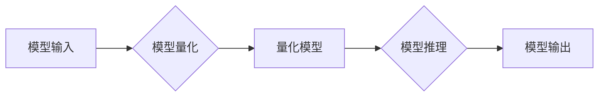

                 

## TensorFlow Lite模型量化

> 关键词：TensorFlow Lite, 模型量化，INT8，精度-效率权衡，移动端部署，神经网络压缩

## 1. 背景介绍

随着深度学习技术的蓬勃发展，神经网络模型在图像识别、自然语言处理、语音识别等领域取得了令人瞩目的成就。然而，这些高性能模型通常体积庞大，计算量巨大，难以在资源受限的移动设备上高效运行。为了解决这个问题，模型量化技术应运而生。

模型量化是指将模型中的权重和激活值从高精度浮点数（例如32位浮点数）转换为低精度整数（例如8位整数）。通过这种转换，可以显著减少模型的大小和计算量，从而提高模型在移动设备上的运行效率。

TensorFlow Lite（TFLite）是Google推出的轻量级机器学习平台，专门为移动设备、嵌入式系统和物联网设备等资源受限的设备优化设计。TFLite支持多种模型量化技术，可以帮助开发者将大型深度学习模型压缩到更小的尺寸，并提高其在移动设备上的运行速度。

## 2. 核心概念与联系

### 2.1 模型量化原理

模型量化本质上是一种数据类型转换，将模型中的浮点数参数量化为整数。这种转换可以显著减少模型的大小和计算量，从而提高模型在移动设备上的运行效率。

### 2.2 量化方法

常见的模型量化方法包括：

* **静态量化:** 在训练阶段就将模型参数量化为整数，并使用量化后的模型进行推理。
* **动态量化:** 在推理阶段根据输入数据动态地量化模型参数，可以更好地保留模型精度。

### 2.3 TFLite 量化流程

TFLite 提供了多种量化工具和API，可以帮助开发者将模型量化为 INT8 格式。



## 3. 核心算法原理 & 具体操作步骤

### 3.1 算法原理概述

模型量化算法的核心思想是将浮点数参数映射到有限的整数范围，同时尽量保持模型的精度。常用的量化方法包括：

* **线性量化:** 将浮点数参数线性映射到整数范围。
* **非线性量化:** 使用非线性函数将浮点数参数映射到整数范围，可以更好地保留模型精度。

### 3.2 算法步骤详解

1. **选择量化方法:** 根据模型结构和精度要求选择合适的量化方法。
2. **计算量化范围:** 确定量化后的整数范围，例如 -128 到 127。
3. **量化权重和激活值:** 将模型中的浮点数权重和激活值映射到量化范围。
4. **调整模型结构:** 在量化过程中，可能需要调整模型结构，例如使用更小的激活函数或更少的层数。
5. **重新训练模型:** 使用量化后的模型进行重新训练，以进一步提高模型精度。

### 3.3 算法优缺点

**优点:**

* 显著减少模型大小和计算量。
* 提高模型在移动设备上的运行速度。

**缺点:**

* 可能导致模型精度下降。
* 量化过程需要额外的计算资源和时间。

### 3.4 算法应用领域

模型量化技术广泛应用于以下领域:

* **移动设备:** 将深度学习模型部署到手机、平板电脑等移动设备上。
* **嵌入式系统:** 将深度学习模型部署到资源受限的嵌入式系统上，例如智能家居设备、无人机等。
* **物联网:** 将深度学习模型部署到物联网设备上，例如智能传感器、智能监控等。

## 4. 数学模型和公式 & 详细讲解 & 举例说明

### 4.1 数学模型构建

假设我们有一个浮点数权重 $w$，需要将其量化为整数 $q$。我们可以使用以下线性量化公式：

$$q = round(w * scale + zero_point)$$

其中：

* $scale$ 是量化范围的缩放因子。
* $zero_point$ 是量化范围的偏移量。

### 4.2 公式推导过程

线性量化公式的推导过程如下：

1. 确定量化范围：假设量化范围为 $[min, max]$。
2. 计算缩放因子：$scale = (max - min) / (2^{bits} - 1)$，其中 $bits$ 是整数位数。
3. 计算偏移量：$zero_point = min$。

### 4.3 案例分析与讲解

假设我们有一个浮点数权重 $w = 0.75$，需要将其量化为 8 位整数。

* 量化范围：$[ -128, 127]$
* 缩放因子：$scale = (127 - (-128)) / (2^8 - 1) = 1.0$
* 偏移量：$zero_point = -128$

使用公式计算量化后的整数：

$$q = round(0.75 * 1.0 + (-128)) = -127.25$$

由于 $q$ 是整数，因此将其四舍五入得到量化后的整数 $q = -127$。

## 5. 项目实践：代码实例和详细解释说明

### 5.1 开发环境搭建

* 安装 Python 3.x
* 安装 TensorFlow 2.x
* 安装 TensorFlow Lite 库

### 5.2 源代码详细实现

```python
import tensorflow as tf
from tensorflow.lite.TFLiteConverter import TFLiteConverter

# 加载模型
model = tf.keras.models.load_model('model.h5')

# 创建量化转换器
converter = TFLiteConverter.from_keras_model(model)

# 设置量化选项
converter.optimizations = [tf.lite.Optimize.DEFAULT]

# 将模型转换为 TFLite 模型
tflite_model = converter.convert()

# 保存 TFLite 模型
with open('model_quantized.tflite', 'wb') as f:
    f.write(tflite_model)
```

### 5.3 代码解读与分析

* 使用 `TFLiteConverter` 将 Keras 模型转换为 TFLite 模型。
* 设置 `optimizations` 参数为 `tf.lite.Optimize.DEFAULT`，启用模型量化优化。
* 使用 `convert()` 方法将模型转换为 TFLite 模型。
* 将 TFLite 模型保存到文件 `model_quantized.tflite`。

### 5.4 运行结果展示

运行上述代码后，将生成一个名为 `model_quantized.tflite` 的 TFLite 模型文件。

## 6. 实际应用场景

### 6.1 移动设备图像识别

将量化后的深度学习模型部署到手机上，可以实现实时图像识别功能，例如识别物体、场景、人脸等。

### 6.2 语音助手

将量化后的语音识别模型部署到智能音箱上，可以实现语音控制功能，例如播放音乐、设置闹钟、查询天气等。

### 6.3 物联网设备监控

将量化后的图像识别模型部署到智能摄像头上，可以实现实时视频监控功能，例如检测入侵、报警等。

### 6.4 未来应用展望

随着移动设备和物联网设备的普及，模型量化技术将在未来发挥越来越重要的作用。

## 7. 工具和资源推荐

### 7.1 学习资源推荐

* TensorFlow Lite 官方文档：https://www.tensorflow.org/lite
* TensorFlow Lite 模型量化指南：https://www.tensorflow.org/lite/performance/quantization

### 7.2 开发工具推荐

* TensorFlow Lite Converter：用于将 Keras 模型转换为 TFLite 模型。
* TensorFlow Lite Interpreter：用于在移动设备上运行 TFLite 模型。

### 7.3 相关论文推荐

* "Quantized Neural Networks: A Survey"
* "MobileBERT: A Compact BERT for Mobile Devices"

## 8. 总结：未来发展趋势与挑战

### 8.1 研究成果总结

模型量化技术取得了显著的进展，可以有效地压缩模型大小和计算量，提高模型在移动设备上的运行效率。

### 8.2 未来发展趋势

* **更精确的量化方法:** 研究更精确的量化方法，例如混合精度量化、神经架构搜索量化等。
* **更智能的量化策略:** 研究更智能的量化策略，例如动态量化、自适应量化等。
* **量化后的模型加速:** 研究量化后的模型加速技术，例如量化后推理加速器、量化后模型压缩等。

### 8.3 面临的挑战

* **精度损失:** 模型量化可能会导致精度损失，需要找到平衡精度和效率的方法。
* **量化过程复杂:** 模型量化过程相对复杂，需要专业的技术人员进行操作。
* **硬件支持:** 某些量化技术需要特定的硬件支持，例如量化后推理加速器。

### 8.4 研究展望

未来，模型量化技术将继续发展，并应用于更多领域。随着硬件技术的进步和算法的优化，模型量化技术将能够更好地平衡模型精度和效率，推动深度学习技术在移动设备和物联网设备上的广泛应用。

## 9. 附录：常见问题与解答

### 9.1 模型量化会降低模型精度吗？

是的，模型量化可能会导致精度损失。这是因为量化将浮点数参数映射到有限的整数范围，可能会丢失一些精度信息。

### 9.2 如何选择合适的量化方法？

选择合适的量化方法取决于模型结构、精度要求和硬件平台。

### 9.3 如何评估模型量化后的精度？

可以使用测试集上的准确率、召回率、F1-score等指标来评估模型量化后的精度。

### 9.4 如何部署量化后的模型？

可以使用 TensorFlow Lite Interpreter 在移动设备上部署量化后的模型。


作者：禅与计算机程序设计艺术 / Zen and the Art of Computer Programming 
<end_of_turn>

