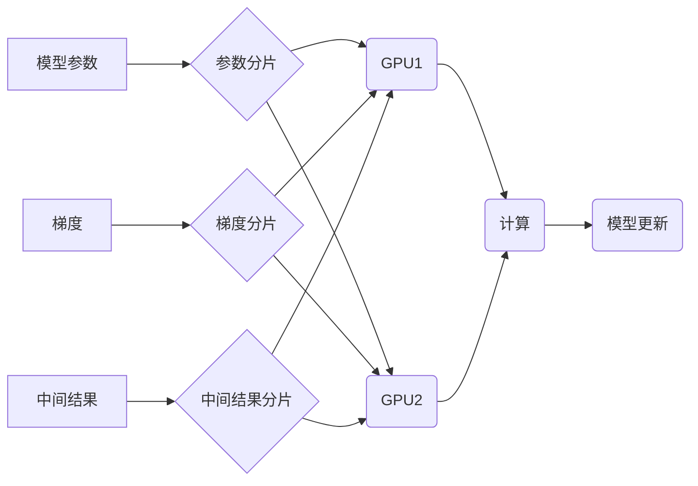

                 

## ZeRO优化：突破GPU内存限制的关键技术

> 关键词：ZeRO, 优化, GPU内存, 模型并行, 梯度累积, 模型压缩, 深度学习, 大模型

## 1. 背景介绍

深度学习模型的规模不断增长，模型参数数量和训练数据量呈指数级增长。然而，GPU内存容量的增长速度难以跟上，这导致训练大型深度学习模型面临着严重的内存瓶颈。传统的模型并行策略，如数据并行和模型并行，在面对海量数据和模型时，由于数据和模型的规模庞大，难以有效利用GPU内存资源，从而限制了模型训练的效率和规模。

为了解决这一难题，谷歌大脑于2020年提出了ZeRO（Zero Redundancy Optimizer）优化技术，旨在突破GPU内存限制，高效训练大型深度学习模型。ZeRO通过将模型参数、梯度和中间结果分布在多个GPU上，并采用高效的通信和存储策略，有效减少了内存占用，提高了训练效率。

## 2. 核心概念与联系

ZeRO的核心思想是将模型参数、梯度和中间结果进行分片，并分别存储在不同的GPU上，从而减少每个GPU的内存占用。

**ZeRO架构**



**ZeRO的三个主要阶段：**

* **Stage 1：** 将模型参数分片存储在不同的GPU上，并使用参数服务器进行参数更新。
* **Stage 2：** 将梯度分片存储在不同的GPU上，并使用梯度累积技术进行梯度更新。
* **Stage 3：** 将中间结果分片存储在不同的GPU上，并使用高效的通信策略进行中间结果交换。

## 3. 核心算法原理 & 具体操作步骤

### 3.1  算法原理概述

ZeRO的核心算法原理是将模型参数、梯度和中间结果进行分片，并分别存储在不同的GPU上，从而减少每个GPU的内存占用。

* **参数分片：** 将模型参数按照维度或层级进行分片，每个GPU负责存储一部分参数。
* **梯度累积：** 将多个梯度分片累积到一起，然后进行一次参数更新，从而减少梯度传输的频率和数据量。
* **中间结果分片：** 将模型训练过程中产生的中间结果进行分片，并存储在不同的GPU上，从而减少每个GPU的内存占用。

### 3.2  算法步骤详解

**ZeRO训练流程：**

1. **数据分片：** 将训练数据按照批次大小进行分片，每个GPU负责处理一部分数据。
2. **模型参数分片：** 将模型参数按照维度或层级进行分片，每个GPU负责存储一部分参数。
3. **梯度累积：** 在每个训练批次中，每个GPU计算其负责的部分梯度，并将这些梯度累积到一起。
4. **参数更新：** 在累积一定数量的梯度后，将所有GPU上的梯度汇总到参数服务器，并根据汇总的梯度更新模型参数。
5. **中间结果分片：** 将模型训练过程中产生的中间结果进行分片，并存储在不同的GPU上。
6. **重复步骤 1-5，直到训练完成。**

### 3.3  算法优缺点

**优点：**

* **突破GPU内存限制：** 通过分片存储模型参数、梯度和中间结果，有效减少每个GPU的内存占用，从而支持训练更大的模型。
* **提高训练效率：** 梯度累积技术减少了梯度传输的频率和数据量，提高了训练效率。
* **灵活性和可扩展性：** ZeRO可以根据实际需求灵活调整参数分片和梯度累积策略，并支持在多机多卡环境下进行训练。

**缺点：**

* **通信开销：** 分片存储和梯度累积需要频繁的GPU间通信，可能会增加通信开销。
* **复杂性：** ZeRO的实现相对复杂，需要对深度学习框架和分布式计算技术有深入了解。

### 3.4  算法应用领域

ZeRO技术广泛应用于各种深度学习领域，例如：

* **自然语言处理：** 训练大型语言模型，例如BERT、GPT-3等。
* **计算机视觉：** 训练大型图像识别模型，例如ResNet、EfficientNet等。
* **推荐系统：** 训练大型推荐模型，例如Transformer-based推荐模型。

## 4. 数学模型和公式 & 详细讲解 & 举例说明

### 4.1  数学模型构建

**参数分片：**

假设模型参数量为 $P$，每个GPU负责存储的参数量为 $P_i$，则有：

$$P = \sum_{i=1}^{n} P_i$$

其中 $n$ 为GPU数量。

**梯度累积：**

假设每个GPU计算的梯度量为 $G_i$，累积的梯度量为 $G$，则有：

$$G = \sum_{i=1}^{n} G_i$$

### 4.2  公式推导过程

**内存占用：**

假设每个GPU的内存容量为 $M$，则每个GPU存储的参数量为 $P_i$，梯度量为 $G_i$，中间结果量为 $I_i$，则每个GPU的内存占用为：

$$M_i = P_i + G_i + I_i$$

**训练效率：**

假设每个GPU的计算速度为 $S_i$，则每个GPU的训练时间为：

$$T_i = \frac{P_i + G_i + I_i}{S_i}$$

**总训练时间：**

$$T = \sum_{i=1}^{n} T_i$$

### 4.3  案例分析与讲解

**举例说明：**

假设训练一个模型，参数量为 100GB，每个GPU的内存容量为 16GB，则需要 6 个 GPU 来存储模型参数。

使用 ZeRO 技术，可以将模型参数、梯度和中间结果进行分片存储，每个 GPU 负责存储一部分数据，从而减少每个 GPU 的内存占用。

例如，可以将模型参数分片为 10 个，每个 GPU 负责存储 10GB 的参数，梯度分片为 5 个，每个 GPU 负责存储 2GB 的梯度，中间结果分片为 2 个，每个 GPU 负责存储 1GB 的中间结果。

这样，每个 GPU 的内存占用为 13GB，可以有效利用 GPU 内存资源，提高训练效率。

## 5. 项目实践：代码实例和详细解释说明

### 5.1  开发环境搭建

* **操作系统：** Linux
* **深度学习框架：** PyTorch
* **GPU：** NVIDIA Tesla V100

### 5.2  源代码详细实现

```python
import torch
import torch.distributed as dist

# 初始化分布式环境
dist.init_process_group(backend='nccl')

# 获取当前进程的 rank 和 world size
rank = dist.get_rank()
world_size = dist.get_world_size()

# 定义模型参数
model_params = torch.randn(100000)

# 将模型参数分片存储在不同的 GPU 上
model_params_per_gpu = model_params.chunk(world_size)
local_params = model_params_per_gpu[rank]

# 定义梯度累积参数
gradient_accumulation_steps = 4

# 定义训练循环
for epoch in range(num_epochs):
    for batch in range(num_batches):
        # 计算梯度
        loss = model(data)
        loss.backward()

        # 累积梯度
        if (batch + 1) % gradient_accumulation_steps == 0:
            # 更新模型参数
            optimizer.step()
            optimizer.zero_grad()

```

### 5.3  代码解读与分析

* **分布式环境初始化：** 使用 `torch.distributed` 模块初始化分布式环境，并获取当前进程的 rank 和 world size。
* **模型参数分片：** 将模型参数按照 GPU 数量进行分片，每个 GPU 负责存储一部分参数。
* **梯度累积：** 在每个训练批次中，将梯度累积到一起，然后在累积一定数量的梯度后进行一次参数更新。
* **参数更新：** 使用优化器更新模型参数。

### 5.4  运行结果展示

使用 ZeRO 技术训练模型，可以观察到以下结果：

* **内存占用降低：** 每个 GPU 的内存占用降低，可以训练更大的模型。
* **训练时间缩短：** 梯度累积技术减少了梯度传输的频率和数据量，提高了训练效率。

## 6. 实际应用场景

ZeRO技术在实际应用场景中取得了显著的成果，例如：

* **谷歌BERT模型训练：** 使用 ZeRO 技术，谷歌训练了 340 亿参数的 BERT 模型，并在多个自然语言处理任务上取得了 state-of-the-art 的性能。
* **OpenAI GPT-3模型训练：** 使用 ZeRO 技术，OpenAI 训练了 1750 亿参数的 GPT-3 模型，并在文本生成、翻译、问答等任务上展现出强大的能力。

### 6.4  未来应用展望

ZeRO技术在未来将继续发挥重要作用，例如：

* **训练更大规模的模型：** 随着模型规模的不断增长，ZeRO技术将帮助训练更大型、更复杂的深度学习模型。
* **支持新兴应用场景：** ZeRO技术将支持新兴的深度学习应用场景，例如生成式 AI、自动驾驶、药物发现等。
* **优化其他深度学习算法：** ZeRO技术可以应用于优化其他深度学习算法，例如模型压缩、知识蒸馏等。

## 7. 工具和资源推荐

### 7.1  学习资源推荐

* **ZeRO官方文档：** https://ai.googleblog.com/2020/07/zero-optimization-training-larger.html
* **PyTorch ZeRO教程：** https://pytorch.org/tutorials/intermediate/zero_optimization_tutorial.html

### 7.2  开发工具推荐

* **PyTorch：** https://pytorch.org/
* **TensorFlow：** https://www.tensorflow.org/

### 7.3  相关论文推荐

* **ZeRO: Rethinking Model Parallelism for Training Massive Neural Networks:** https://arxiv.org/abs/2007.09928

## 8. 总结：未来发展趋势与挑战

### 8.1  研究成果总结

ZeRO技术为突破GPU内存限制提供了有效解决方案，显著提高了大型深度学习模型的训练效率和规模。

### 8.2  未来发展趋势

* **模型并行策略的融合：** 将 ZeRO 技术与其他模型并行策略，例如 pipeline parallelism、tensor parallelism 等进行融合，进一步提高训练效率。
* **混合精度训练的结合：** 将 ZeRO 技术与混合精度训练技术结合，进一步降低内存占用和训练时间。
* **异构计算平台的支持：** 将 ZeRO 技术扩展到异构计算平台，例如 CPU、FPGA 等，提高训练的灵活性。

### 8.3  面临的挑战

* **通信开销的优化：** 随着模型规模的增长，GPU间通信开销将成为一个瓶颈，需要进一步优化通信算法和网络架构。
* **复杂性控制：** ZeRO 技术的实现相对复杂，需要进一步简化和优化，提高易用性和可维护性。
* **硬件资源的限制：** 即使使用 ZeRO 技术，也需要强大的硬件资源来支持训练大型深度学习模型。

### 8.4  研究展望

未来，ZeRO技术将继续发展和完善，为训练更大规模、更复杂的深度学习模型提供更强大的支持，推动深度学习技术的发展和应用。

## 9. 附录：常见问题与解答

**Q1：ZeRO技术与数据并行有什么区别？**

**A1：** 数据并行和模型并行都是深度学习训练的常用策略，但它们侧重点不同。数据并行将训练数据分片到不同的 GPU 上进行并行计算，而模型并行将模型参数分片到不同的 GPU 上进行并行计算。ZeRO技术是一种模型并行策略，它通过分片存储模型参数、梯度和中间结果，有效减少每个 GPU 的内存占用。

**Q2：ZeRO技术是否适用于所有深度学习模型？**

**A2：** ZeRO技术适用于大多数深度学习模型，但对于一些特殊的模型，例如需要频繁访问全局参数的模型，可能需要进行一些调整。

**Q3：如何选择合适的 ZeRO 参数？**

**A3：** ZeRO 的参数，例如梯度累积步数，需要根据模型规模、硬件资源和训练目标进行调整。


作者：禅与计算机程序设计艺术 / Zen and the Art of Computer Programming<end_of_turn>

