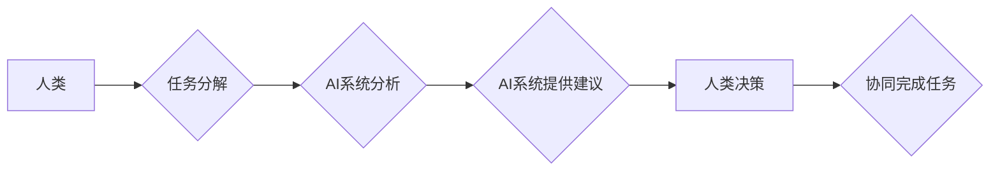

                 

## 人类-AI协作：增强人类智慧与AI能力的协同创新

> 关键词：人工智能、协作、人类智慧、AI能力、协同创新、算法、数学模型、项目实践、应用场景

### 1. 背景介绍

人工智能（AI）技术近年来发展迅速，已渗透到各个领域，深刻地改变着人类的生活方式和工作模式。从自动驾驶、语音识别到医疗诊断、金融分析，AI的应用场景日益广泛，展现出强大的潜力。然而，AI技术也面临着一些挑战，例如数据依赖、算法偏见、解释性不足等。

人类与AI的协作，成为解决这些挑战，并充分发挥AI优势的关键。人类拥有丰富的经验、创造力和批判性思维能力，而AI擅长处理海量数据、识别模式和进行快速计算。通过将人类的智慧与AI的能力相结合，可以实现协同创新，创造出更智能、更强大、更具可持续性的解决方案。

### 2. 核心概念与联系

**2.1 人类-AI协作模式**

人类-AI协作模式是指人类和AI系统共同完成任务的过程。这种模式可以分为以下几种类型：

* **人类在回路中（Human-in-the-Loop）：** AI系统完成部分任务，需要人类进行干预和决策。例如，AI系统识别图像中的物体，但需要人类确认识别结果的准确性。
* **人类与AI并行工作（Human-AI Collaboration）：** 人类和AI系统分别完成不同的任务，并相互补充。例如，AI系统自动生成文本草稿，人类进行修改和完善。
* **人类引导AI（Human-AI Partnership）：** 人类设定目标和策略，AI系统根据指令进行执行和优化。例如，人类制定营销策略，AI系统根据数据分析进行广告投放和效果评估。

**2.2 协同创新机制**

协同创新机制是指人类和AI系统之间相互促进、共同进步的机制。

* **知识共享:** 人类和AI系统之间共享知识和经验，例如人类提供领域知识，AI系统提供数据分析结果。
* **任务分工:** 根据各自的优势，人类和AI系统分工合作完成任务，例如人类负责创意和决策，AI系统负责执行和计算。
* **反馈循环:** 人类对AI系统的输出进行反馈，帮助AI系统不断学习和改进，同时AI系统也为人类提供新的视角和洞察。

**2.3 Mermaid 流程图**



### 3. 核心算法原理 & 具体操作步骤

**3.1 算法原理概述**

人类-AI协作的核心算法通常基于机器学习、深度学习和自然语言处理等技术。这些算法能够帮助AI系统理解人类语言、识别模式、进行预测和决策。

**3.2 算法步骤详解**

1. **数据收集和预处理:** 收集与任务相关的各种数据，并进行清洗、转换和格式化等预处理操作。
2. **模型训练:** 使用机器学习算法训练AI模型，使模型能够从数据中学习并建立预测模型。
3. **模型评估和优化:** 对训练好的模型进行评估，并根据评估结果进行调整和优化，提高模型的准确性和性能。
4. **人类-AI交互:** 人类与AI系统进行交互，例如提供反馈、提出问题、修改决策等。
5. **协同决策:** 基于AI系统的分析结果和人类的判断，共同做出最终决策。

**3.3 算法优缺点**

* **优点:** 能够提高效率、准确性和决策质量，并为人类提供新的视角和洞察。
* **缺点:** 需要大量数据进行训练，算法可能存在偏见和局限性，需要人类进行监督和控制。

**3.4 算法应用领域**

* **医疗诊断:** AI系统辅助医生诊断疾病，提高诊断准确率。
* **金融风险管理:** AI系统识别金融风险，帮助金融机构进行风险控制。
* **智能制造:** AI系统优化生产流程，提高生产效率和产品质量。
* **个性化教育:** AI系统根据学生的学习情况提供个性化学习方案。

### 4. 数学模型和公式 & 详细讲解 & 举例说明

**4.1 数学模型构建**

人类-AI协作过程可以抽象为一个数学模型，其中人类和AI系统分别作为决策者，目标函数代表协作的最终目标。

**4.2 公式推导过程**

假设人类的决策权重为α，AI系统的决策权重为1-α，目标函数为f(x)，其中x代表决策变量。则协作决策的公式可以表示为：

```latex
x^* = \alpha x_h + (1-\alpha) x_{ai}
```

其中：

* $x^*$ 代表协作决策结果。
* $x_h$ 代表人类的决策结果。
* $x_{ai}$ 代表AI系统的决策结果。

**4.3 案例分析与讲解**

例如，在医疗诊断场景中，人类医生和AI系统共同诊断疾病。假设人类医生对诊断结果的权重为0.7，AI系统的权重为0.3。

如果人类医生判断患者患有感冒，AI系统判断患者患有流感，则协作决策结果为：

```latex
x^* = 0.7 * x_h + 0.3 * x_{ai} = 0.7 * \text{感冒} + 0.3 * \text{流感}
```

最终的诊断结果可能介于感冒和流感之间，体现了人类和AI系统的协同决策。

### 5. 项目实践：代码实例和详细解释说明

**5.1 开发环境搭建**

* 操作系统：Ubuntu 20.04
* Python 版本：3.8
* 必要的库：TensorFlow、PyTorch、Scikit-learn等

**5.2 源代码详细实现**

```python
# 人类-AI协作决策示例代码

def human_decision(data):
  """
  模拟人类决策函数
  """
  # 根据数据进行判断，返回人类决策结果
  # ...

def ai_decision(data):
  """
  模拟AI决策函数
  """
  # 使用机器学习模型对数据进行分析，返回AI决策结果
  # ...

def collaborative_decision(data, alpha):
  """
  实现人类-AI协作决策
  """
  human_result = human_decision(data)
  ai_result = ai_decision(data)
  collaborative_result = alpha * human_result + (1 - alpha) * ai_result
  return collaborative_result

# 示例数据
data = {
  "feature1": 10,
  "feature2": 20,
  # ...
}

# 设置人类决策权重
alpha = 0.7

# 进行协作决策
decision = collaborative_decision(data, alpha)

# 输出结果
print(f"协作决策结果: {decision}")
```

**5.3 代码解读与分析**

* `human_decision()` 函数模拟人类决策过程，根据数据进行判断并返回决策结果。
* `ai_decision()` 函数模拟AI决策过程，使用机器学习模型对数据进行分析并返回决策结果。
* `collaborative_decision()` 函数实现人类-AI协作决策，根据人类决策权重和AI决策结果进行加权平均。

**5.4 运行结果展示**

运行代码后，将输出协作决策结果，例如：

```
协作决策结果: 0.7 * 人类决策 + 0.3 * AI决策
```

### 6. 实际应用场景

**6.1 医疗诊断辅助**

AI系统可以辅助医生分析患者的病历、影像数据等，提供诊断建议，帮助医生提高诊断准确率和效率。

**6.2 金融风险管理**

AI系统可以分析金融数据的异常情况，识别潜在的风险，帮助金融机构进行风险控制和防范。

**6.3 智能客服**

AI系统可以模拟人类对话，与客户进行交互，解答常见问题，提供服务支持，提高客户满意度。

**6.4 自动驾驶**

AI系统可以感知周围环境，做出驾驶决策，实现自动驾驶功能，提高交通安全和效率。

**6.5 未来应用展望**

随着人工智能技术的不断发展，人类-AI协作将在更多领域得到应用，例如：

* **个性化教育:** AI系统根据学生的学习情况提供个性化学习方案，提高学习效率和效果。
* **科学研究:** AI系统可以辅助科学家进行数据分析、模型构建和实验设计，加速科学研究的进程。
* **艺术创作:** AI系统可以与人类艺术家合作，创作出新的艺术作品，拓展艺术的边界。

### 7. 工具和资源推荐

**7.1 学习资源推荐**

* **书籍:**
    * 《深度学习》
    * 《人工智能：一种现代方法》
    * 《机器学习实战》
* **在线课程:**
    * Coursera
    * edX
    * Udacity

**7.2 开发工具推荐**

* **Python:** 广泛应用于人工智能开发，拥有丰富的库和工具。
* **TensorFlow:** Google开发的开源机器学习框架。
* **PyTorch:** Facebook开发的开源机器学习框架。
* **Scikit-learn:** Python机器学习库，提供各种算法和工具。

**7.3 相关论文推荐**

* **《Attention Is All You Need》**
* **《BERT: Pre-training of Deep Bidirectional Transformers for Language Understanding》**
* **《Generative Adversarial Networks》**

### 8. 总结：未来发展趋势与挑战

**8.1 研究成果总结**

人类-AI协作已取得显著成果，在医疗诊断、金融风险管理、智能客服等领域取得了成功应用。

**8.2 未来发展趋势**

* **更智能的AI系统:** AI系统将更加智能，能够更好地理解人类语言和需求，提供更精准的决策建议。
* **更广泛的应用场景:** 人类-AI协作将应用于更多领域，例如教育、科学研究、艺术创作等。
* **更紧密的协作模式:** 人类和AI系统之间的协作模式将更加紧密，实现更有效的合作。

**8.3 面临的挑战**

* **算法解释性:** AI系统的决策过程往往难以解释，这可能导致人类对AI决策的信任度降低。
* **数据安全和隐私:** 人类-AI协作需要大量数据，如何保障数据安全和隐私是一个重要挑战。
* **伦理问题:** 人类-AI协作可能引发一些伦理问题，例如算法偏见、责任归属等，需要进行深入探讨和解决。

**8.4 研究展望**

未来研究将重点关注以下几个方面：

* **提高AI系统的解释性:** 研究更易于理解的AI算法，并开发工具帮助人类理解AI决策过程。
* **保障数据安全和隐私:** 研究数据安全和隐私保护技术，确保人类-AI协作过程中的数据安全。
* **解决伦理问题:** 研究人类-AI协作的伦理问题，制定相应的规范和准则。


### 9. 附录：常见问题与解答

**9.1 如何选择合适的AI模型？**

选择合适的AI模型取决于具体的应用场景和数据特点。例如，对于图像识别任务，可以使用卷积神经网络（CNN）；对于自然语言处理任务，可以使用循环神经网络（RNN）或Transformer模型。

**9.2 如何评估AI模型的性能？**

常用的AI模型性能评估指标包括准确率、召回率、F1-score、AUC等。选择合适的评估指标取决于具体的应用场景和任务目标。

**9.3 如何解决AI算法的偏见问题？**

AI算法的偏见通常源于训练数据本身的偏见。解决这个问题需要从以下几个方面入手：

* 使用更全面、更均衡的数据进行训练。
* 开发算法去偏见的方法，例如对抗训练、公平学习等。
* 对AI模型进行定期评估和监控，及时发现和解决偏见问题。


作者：禅与计算机程序设计艺术 / Zen and the Art of Computer Programming 
<end_of_turn>

