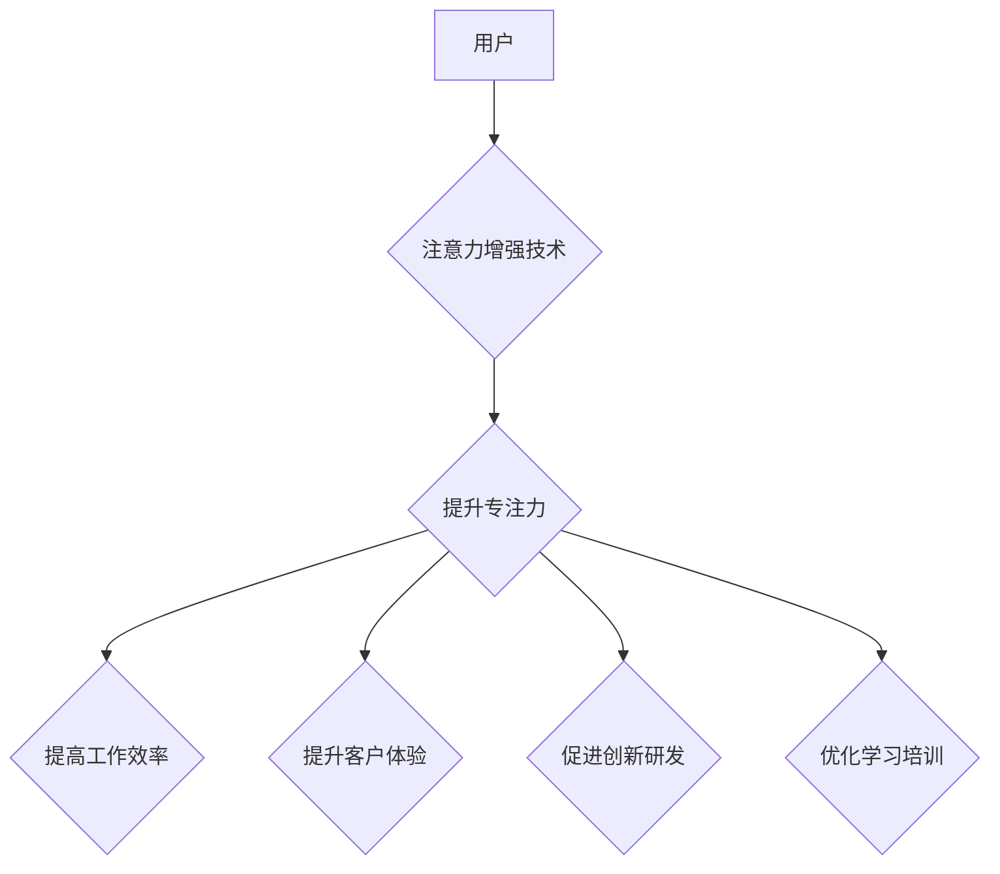

                 

## 人类注意力增强：提升专注力和注意力在商业中的未来发展机遇分析机遇趋势分析

> 关键词：注意力增强、专注力、深度学习、脑机接口、商业应用、未来趋势、挑战

## 1. 背景介绍

在当今信息爆炸的时代，人类面临着前所未有的注意力挑战。来自社交媒体、电子邮件、新闻推送等各种信息源的不断轰炸，使得人们难以集中精力完成任务，效率低下，认知能力受损。注意力力的下降不仅影响个人生活，也对商业发展造成严重阻碍。

商业领域对专注力的需求日益增长。从销售人员与客户沟通、研发人员进行创新设计到管理人员制定战略决策，都需要高度的集中力和持续的注意力。然而，注意力力的下降会导致决策错误、工作效率低下、客户满意度降低等问题，最终损害企业利益。

因此，如何提升人类注意力，增强专注力，成为一个亟待解决的难题，也是未来商业发展的重要趋势。

## 2. 核心概念与联系

**2.1 注意力增强**

注意力增强是指通过技术手段帮助人们提升专注力、控制分散注意力、提高认知效率的方案。它涵盖了多种技术，包括：

* **脑机接口 (Brain-Computer Interface, BCI):** 通过记录脑电信号，识别用户的注意力状态，并提供反馈或干预，帮助用户集中注意力。
* **神经反馈训练 (Neurofeedback):** 通过实时监测脑电活动，并给予用户视觉或听觉反馈，帮助用户学习控制自己的脑波，从而增强注意力。
* **认知训练软件:** 通过一系列游戏和练习，锻炼用户的注意力、记忆力和执行功能，提升认知能力。
* **环境优化:** 通过调整工作环境，减少干扰，营造专注氛围，帮助用户提高注意力。

**2.2 商业应用场景**

注意力增强技术在商业领域有着广泛的应用场景：

* **提高员工工作效率:** 帮助员工集中注意力，减少分心，提高工作效率和生产力。
* **提升客户体验:** 帮助销售人员更好地理解客户需求，提供更精准的服务，提升客户满意度。
* **促进创新研发:** 帮助研发人员集中精力进行创新设计，加速产品研发周期。
* **优化学习培训:** 帮助员工快速掌握新知识，提高学习效率。

**2.3 架构图**



## 3. 核心算法原理 & 具体操作步骤

**3.1 算法原理概述**

注意力增强算法通常基于深度学习技术，通过训练神经网络模型，识别用户的注意力状态，并提供相应的反馈或干预。常见的算法包括：

* **卷积神经网络 (Convolutional Neural Network, CNN):** 用于提取脑电信号中的特征，识别注意力相关的脑波模式。
* **循环神经网络 (Recurrent Neural Network, RNN):** 用于分析时间序列数据，例如脑电信号，识别注意力变化的趋势。
* **强化学习 (Reinforcement Learning):** 用于训练模型，根据用户的注意力状态提供反馈，引导用户集中注意力。

**3.2 算法步骤详解**

1. **数据采集:** 收集用户的脑电信号数据，以及相应的注意力状态标签。
2. **数据预处理:** 对脑电信号数据进行滤波、去噪等预处理，去除无关信息。
3. **模型训练:** 使用深度学习算法训练神经网络模型，将脑电信号与注意力状态进行关联。
4. **模型评估:** 使用测试数据评估模型的性能，例如准确率、召回率等。
5. **模型部署:** 将训练好的模型部署到实际应用场景中，例如脑机接口设备、认知训练软件等。

**3.3 算法优缺点**

**优点:**

* **高精度:** 深度学习算法能够识别脑电信号中的微小变化，实现高精度的注意力识别。
* **可定制性:** 可以根据不同的应用场景，定制不同的模型和算法。
* **持续改进:** 随着数据量的增加和算法的改进，模型的性能会不断提升。

**缺点:**

* **数据依赖:** 深度学习算法需要大量的脑电信号数据进行训练，数据获取和标注成本较高。
* **计算资源:** 训练深度学习模型需要大量的计算资源，成本较高。
* **隐私安全:** 脑电信号数据属于敏感信息，需要妥善保护用户隐私安全。

**3.4 算法应用领域**

注意力增强算法在以下领域具有广泛的应用前景:

* **医疗保健:** 帮助诊断和治疗注意力缺陷多动障碍 (ADHD) 等注意力相关疾病。
* **教育:** 帮助学生提高学习效率，增强专注力。
* **游戏:** 增强游戏沉浸感，提升玩家体验。
* **人机交互:** 开发更智能、更人性化的交互系统。

## 4. 数学模型和公式 & 详细讲解 & 举例说明

**4.1 数学模型构建**

注意力增强算法通常使用以下数学模型来描述注意力机制：

* **注意力权重:** 用于衡量模型对不同输入信息的关注程度。
* **注意力分数:** 用于计算每个输入信息的重要性。
* **加权求和:** 用于根据注意力权重，对输入信息进行加权求和，得到最终的输出。

**4.2 公式推导过程**

假设输入序列为 X = {x1, x2, ..., xn}，目标是学习一个注意力权重向量 α = {α1, α2, ..., αn}，其中 αi 表示对 xi 的关注程度。

注意力分数可以定义为：

$$
\text{Attention}(x_i, X) = \frac{\text{exp}(e_i)}{\sum_{j=1}^{n} \text{exp}(e_j)}
$$

其中， $e_i$ 是 xi 与其他输入信息的相似度，可以使用点积或其他相似度度量方法计算。

注意力加权后的输出可以定义为：

$$
\text{Output} = \sum_{i=1}^{n} \alpha_i x_i
$$

**4.3 案例分析与讲解**

例如，在机器翻译任务中，注意力机制可以帮助模型关注源语言中与目标语言相关的重要词语，从而提高翻译质量。

## 5. 项目实践：代码实例和详细解释说明

**5.1 开发环境搭建**

* Python 3.x
* TensorFlow 或 PyTorch 深度学习框架
* NumPy 科学计算库
* Matplotlib 数据可视化库

**5.2 源代码详细实现**

```python
import tensorflow as tf

# 定义注意力机制模型
class AttentionModel(tf.keras.Model):
    def __init__(self, units):
        super(AttentionModel, self).__init__()
        self.W1 = tf.keras.layers.Dense(units)
        self.W2 = tf.keras.layers.Dense(units)
        self.v = tf.keras.layers.Dense(1)

    def call(self, inputs):
        # 计算注意力分数
        scores = self.v(tf.tanh(self.W1(inputs) + self.W2(tf.transpose(inputs))))
        # 归一化注意力分数
        attention_weights = tf.nn.softmax(scores, axis=-1)
        # 计算加权求和输出
        output = tf.matmul(attention_weights, inputs)
        return output

# 实例化模型
model = AttentionModel(units=128)

# 训练模型
# ...

# 使用模型进行预测
# ...
```

**5.3 代码解读与分析**

* 该代码定义了一个简单的注意力机制模型，包含三个密集层：W1、W2 和 v。
* W1 和 W2 用于计算输入信息之间的相似度，v 用于计算注意力分数。
* tf.nn.softmax 函数将注意力分数归一化，得到注意力权重。
* tf.matmul 函数计算加权求和输出。

**5.4 运行结果展示**

* 训练完成后，可以使用测试数据评估模型的性能，例如准确率、召回率等。
* 可以使用可视化工具，例如 Matplotlib，展示注意力权重，观察模型对不同输入信息的关注程度。

## 6. 实际应用场景

**6.1 提升员工工作效率**

注意力增强技术可以帮助员工集中注意力，减少分心，提高工作效率。例如，一些公司使用脑机接口设备，帮助员工在工作时监测注意力状态，并提供相应的反馈，例如提醒员工休息或调整工作环境。

**6.2 提升客户体验**

注意力增强技术可以帮助销售人员更好地理解客户需求，提供更精准的服务，提升客户体验。例如，一些公司使用眼动追踪技术，监测客户对产品或服务的关注点，并根据客户的注意力变化，调整销售策略。

**6.3 促进创新研发**

注意力增强技术可以帮助研发人员集中精力进行创新设计，加速产品研发周期。例如，一些公司使用认知训练软件，帮助研发人员提高注意力、记忆力和执行功能，从而提升创新能力。

**6.4 未来应用展望**

注意力增强技术在未来将有更广泛的应用场景，例如：

* **个性化教育:** 根据学生的注意力状态，提供个性化的学习内容和教学方法。
* **智能医疗:** 帮助医生诊断和治疗注意力相关疾病。
* **增强现实 (AR) 和虚拟现实 (VR):** 提升 AR 和 VR 的沉浸感和交互体验。

## 7. 工具和资源推荐

**7.1 学习资源推荐**

* **书籍:**
    * 《深度学习》 by Ian Goodfellow, Yoshua Bengio, and Aaron Courville
    * 《Attention Is All You Need》 by Vaswani et al.
* **在线课程:**
    * Coursera: Deep Learning Specialization
    * Udacity: Deep Learning Nanodegree

**7.2 开发工具推荐**

* **TensorFlow:** https://www.tensorflow.org/
* **PyTorch:** https://pytorch.org/
* **Keras:** https://keras.io/

**7.3 相关论文推荐**

* **Attention Is All You Need:** https://arxiv.org/abs/1706.03762
* **BERT: Pre-training of Deep Bidirectional Transformers for Language Understanding:** https://arxiv.org/abs/1810.04805

## 8. 总结：未来发展趋势与挑战

**8.1 研究成果总结**

注意力增强技术近年来取得了显著进展，特别是深度学习算法的应用，使得注意力识别精度大幅提升。

**8.2 未来发展趋势**

* **更精准的注意力识别:** 探索新的算法和模型，提高注意力识别的精度和鲁棒性。
* **更个性化的干预:** 根据用户的不同注意力特点，提供个性化的干预方案，例如调整工作环境、提供个性化训练内容等。
* **更广泛的应用场景:** 将注意力增强技术应用到更多领域，例如教育、医疗、娱乐等。

**8.3 面临的挑战**

* **数据获取和标注:** 脑电信号数据获取和标注成本较高，需要开发更有效的收集和标注方法。
* **隐私安全:** 脑电信号数据属于敏感信息，需要妥善保护用户隐私安全。
* **伦理问题:** 注意力增强技术可能会被滥用，例如控制用户的行为或思想，需要制定相应的伦理规范和法律法规。

**8.4 研究展望**

未来，注意力增强技术将继续朝着更精准、更个性化、更安全的方向发展。随着技术的进步和应用场景的拓展，注意力增强技术将为人类带来更多福祉，推动商业和社会发展。

## 9. 附录：常见问题与解答

**9.1 注意力增强技术是否安全？**

注意力增强技术目前尚处于发展阶段，安全性需要进一步研究和评估。

**9.2 注意力增强技术是否会让人上瘾？**

注意力增强技术本身不会让人上瘾，但过度使用可能会导致注意力依赖。

**9.3 注意力增强技术是否适用于所有人？**

注意力增强技术并非适用于所有人，例如一些患有注意力相关疾病的人群可能需要谨慎使用。


作者：禅与计算机程序设计艺术 / Zen and the Art of Computer Programming 
<end_of_turn>

