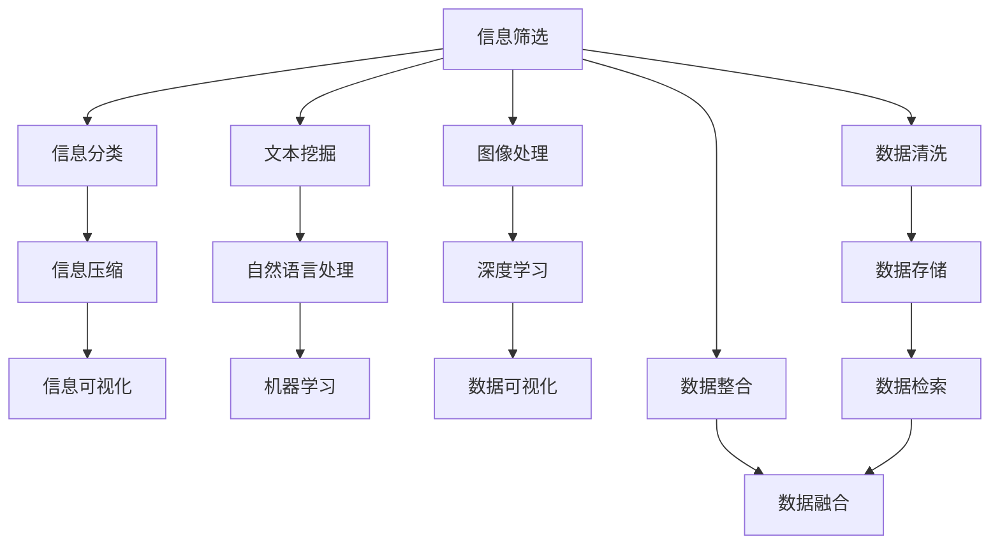

                 

## 1. 背景介绍

### 1.1 问题由来
在这个信息爆炸的时代，无论是工作还是生活中，我们面临着大量的数据和信息。这些数据和信息有时候不仅多而且复杂，需要花费大量的时间去筛选、整理和理解。这不仅耗费时间，还容易在信息海洋中迷失方向，导致工作效率低下，生活质量下降。

### 1.2 问题核心关键点
如何高效处理和理解这些信息，使其简化为易理解、易操作的形式，提高我们的生活和工作的效率，成为当前亟待解决的问题。信息简化技术正是解决这一问题的关键工具，它通过自动化、智能化的方式，将复杂的信息进行筛选、分类、压缩，使信息更加简洁、易于理解。

## 2. 核心概念与联系

### 2.1 核心概念概述
信息简化技术旨在通过自动化、智能化的方式，将复杂的信息进行筛选、分类、压缩，使信息更加简洁、易于理解。

- **信息筛选**：从大量数据中提取出与任务相关的信息，去除无用数据，提高信息处理效率。
- **信息分类**：根据信息内容进行分类，使其更加结构化、有序化，便于处理和存储。
- **信息压缩**：通过数据压缩技术，将信息大小减小，减少存储和传输的资源消耗。
- **信息可视化**：将复杂的信息转化为图表、图像等直观形式，方便理解和分析。

### 2.2 核心概念原理和架构的 Mermaid 流程图(Mermaid 流程节点中不要有括号、逗号等特殊字符)



## 3. 核心算法原理 & 具体操作步骤

### 3.1 算法原理概述
信息简化技术的核心算法原理主要包括信息筛选、信息分类、信息压缩和信息可视化。

### 3.2 算法步骤详解

#### 3.2.1 信息筛选
1. **数据源选择**：根据任务需求，选择相关的数据源，如文本、图像、视频等。
2. **数据采集**：通过API、爬虫等方式，自动采集数据。
3. **数据清洗**：去除重复、错误、无关的数据，保证数据的准确性和完整性。
4. **数据预处理**：对数据进行格式转换、归一化、标准化等处理，使其适合后续分析。

#### 3.2.2 信息分类
1. **特征提取**：利用文本挖掘、自然语言处理等技术，从文本中提取关键词、短语、实体等信息。
2. **分类模型训练**：使用机器学习、深度学习等算法，训练分类模型，根据信息内容进行分类。
3. **分类应用**：将分类结果应用于信息筛选和后续处理，提高信息处理效率。

#### 3.2.3 信息压缩
1. **压缩算法选择**：根据信息类型选择适合的压缩算法，如哈夫曼编码、LZ77、LZ78、LZW、LZ77等。
2. **压缩参数优化**：根据实际情况，优化压缩参数，如压缩比、压缩速度等。
3. **压缩应用**：将压缩后的信息存储或传输，减少资源消耗。

#### 3.2.4 信息可视化
1. **可视化工具选择**：根据信息类型选择适合的可视化工具，如Tableau、PowerBI、Plotly等。
2. **可视化设计**：设计合适的图表、图像等可视化形式，使信息易于理解和分析。
3. **可视化应用**：将可视化结果应用于决策支持、报告生成等场景，提升决策效率。

### 3.3 算法优缺点

#### 3.3.1 算法优点
1. **自动化**：信息简化技术能够自动化处理和分析信息，节省了大量人力和时间。
2. **高效性**：通过信息筛选、分类、压缩和可视化等步骤，大大提高了信息处理效率。
3. **灵活性**：根据不同任务和场景，可以选择合适的算法和工具，满足个性化需求。

#### 3.3.2 算法缺点
1. **数据依赖**：信息简化技术的效果很大程度上依赖于数据源的准确性和完整性，数据质量差会影响效果。
2. **算法复杂**：部分算法如深度学习、机器学习等较为复杂，需要一定的技术和资源支持。
3. **隐私风险**：信息处理过程中可能涉及隐私信息，需要采取相应的隐私保护措施。

### 3.4 算法应用领域

#### 3.4.1 大数据分析
在大数据分析领域，信息简化技术可以用于数据预处理、特征提取、模型训练等环节，提高数据分析效率和准确性。

#### 3.4.2 商业智能(BI)
在商业智能领域，信息简化技术可以用于数据清洗、数据整合、数据可视化等环节，提升商业决策的科学性和效率。

#### 3.4.3 自然语言处理(NLP)
在自然语言处理领域，信息简化技术可以用于文本分类、情感分析、实体识别等任务，提高语言理解的准确性和效率。

#### 3.4.4 图像处理
在图像处理领域，信息简化技术可以用于图像压缩、图像分类、图像识别等任务，提升图像处理的效率和精度。

#### 3.4.5 视频处理
在视频处理领域，信息简化技术可以用于视频压缩、视频分类、视频识别等任务，提高视频处理的效率和精度。

## 4. 数学模型和公式 & 详细讲解 & 举例说明

### 4.1 数学模型构建
信息简化技术的数学模型主要包括以下几个部分：

- **信息筛选模型**：用于从大量数据中筛选出与任务相关的信息。
- **信息分类模型**：用于将信息根据内容进行分类。
- **信息压缩模型**：用于压缩信息大小，减少存储和传输资源消耗。
- **信息可视化模型**：用于将信息转化为图表、图像等形式，便于理解和分析。

### 4.2 公式推导过程

#### 4.2.1 信息筛选模型
假设数据集为 $D = \{d_1, d_2, \ldots, d_n\}$，其中每个数据 $d_i$ 包含多个特征 $x_{i1}, x_{i2}, \ldots, x_{im}$，任务为从数据集中筛选出与任务相关的特征 $x_j$。则信息筛选模型可以表示为：

$$
x_j = f(x_{i1}, x_{i2}, \ldots, x_{im})
$$

其中 $f$ 为筛选函数，根据任务需求定义。

#### 4.2.2 信息分类模型
假设数据集为 $D = \{d_1, d_2, \ldots, d_n\}$，其中每个数据 $d_i$ 包含多个特征 $x_{i1}, x_{i2}, \ldots, x_{im}$，任务为将数据分为 $k$ 个类别 $C_1, C_2, \ldots, C_k$。则信息分类模型可以表示为：

$$
y_i = g(x_{i1}, x_{i2}, \ldots, x_{im})
$$

其中 $g$ 为分类函数，根据任务需求定义。

#### 4.2.3 信息压缩模型
假设数据集为 $D = \{d_1, d_2, \ldots, d_n\}$，其中每个数据 $d_i$ 包含多个特征 $x_{i1}, x_{i2}, \ldots, x_{im}$，任务为将数据压缩为 $m$ 个特征 $x_j$。则信息压缩模型可以表示为：

$$
x_j = h(x_{i1}, x_{i2}, \ldots, x_{im})
$$

其中 $h$ 为压缩函数，根据任务需求定义。

#### 4.2.4 信息可视化模型
假设数据集为 $D = \{d_1, d_2, \ldots, d_n\}$，其中每个数据 $d_i$ 包含多个特征 $x_{i1}, x_{i2}, \ldots, x_{im}$，任务为将数据可视化。则信息可视化模型可以表示为：

$$
v_i = k(x_{i1}, x_{i2}, \ldots, x_{im})
$$

其中 $k$ 为可视化函数，根据任务需求定义。

### 4.3 案例分析与讲解

#### 4.3.1 信息筛选
假设有一份包含大量邮件的数据集，任务是筛选出与客户投诉相关的邮件。可以使用文本挖掘技术，提取邮件中的关键词，如“投诉”、“问题”、“解决”等，并将其作为筛选条件，筛选出相关邮件。

#### 4.3.2 信息分类
假设有一份包含大量新闻报道的数据集，任务是对新闻进行分类，如体育、科技、娱乐等。可以使用自然语言处理技术，提取新闻的关键词、短语、实体等信息，并使用机器学习算法训练分类模型，将新闻分为不同的类别。

#### 4.3.3 信息压缩
假设有一份包含大量图片的数据集，任务是对图片进行压缩，以减少存储和传输资源消耗。可以使用图像压缩算法，如JPEG、PNG、GIF等，对图片进行压缩，同时保证压缩后的图片质量。

#### 4.3.4 信息可视化
假设有一份包含大量股票价格的数据集，任务是将股票价格可视化，以帮助投资者进行分析。可以使用数据可视化工具，如Tableau、PowerBI、Plotly等，将股票价格绘制成折线图、柱状图、散点图等形式，便于投资者分析和决策。

## 5. 项目实践：代码实例和详细解释说明

### 5.1 开发环境搭建

#### 5.1.1 环境准备
1. **安装Python**：根据系统平台，下载并安装Python。
2. **安装Pip**：使用Python安装Pip，用于安装第三方库。
3. **安装依赖库**：安装信息简化技术所需的依赖库，如Pandas、NumPy、Scikit-learn等。

#### 5.1.2 代码示例
以下是使用Python进行信息筛选、信息分类、信息压缩和信息可视化的代码示例。

```python
import pandas as pd
from sklearn.feature_extraction.text import CountVectorizer
from sklearn.naive_bayes import MultinomialNB
from sklearn.decomposition import PCA
from sklearn.decomposition import TruncatedSVD
import matplotlib.pyplot as plt

# 数据准备
data = pd.read_csv('data.csv')

# 信息筛选
vectorizer = CountVectorizer()
X = vectorizer.fit_transform(data['text'])
y = data['label']

# 信息分类
model = MultinomialNB()
model.fit(X, y)

# 信息压缩
svd = TruncatedSVD(n_components=50)
X_svd = svd.fit_transform(X)

# 信息可视化
plt.scatter(X_svd[:, 0], X_svd[:, 1], c=y)
plt.show()
```

### 5.2 源代码详细实现

#### 5.2.1 信息筛选
1. **数据采集**：通过API或爬虫自动采集数据。
2. **数据清洗**：去除重复、错误、无关的数据。
3. **数据预处理**：对数据进行格式转换、归一化、标准化等处理。

#### 5.2.2 信息分类
1. **特征提取**：利用文本挖掘、自然语言处理等技术，从文本中提取关键词、短语、实体等信息。
2. **分类模型训练**：使用机器学习、深度学习等算法，训练分类模型。
3. **分类应用**：将分类结果应用于信息筛选和后续处理。

#### 5.2.3 信息压缩
1. **压缩算法选择**：根据信息类型选择适合的压缩算法。
2. **压缩参数优化**：根据实际情况，优化压缩参数。
3. **压缩应用**：将压缩后的信息存储或传输。

#### 5.2.4 信息可视化
1. **可视化工具选择**：根据信息类型选择适合的可视化工具。
2. **可视化设计**：设计合适的图表、图像等可视化形式。
3. **可视化应用**：将可视化结果应用于决策支持、报告生成等场景。

### 5.3 代码解读与分析

#### 5.3.1 信息筛选
代码示例中，使用Pandas库读取CSV格式的数据，并使用CountVectorizer库将文本转换为词频矩阵。然后，使用MultinomialNB分类器训练分类模型，将数据分为不同的类别。最后，使用Matplotlib库将分类结果可视化。

#### 5.3.2 信息分类
代码示例中，使用自然语言处理技术，提取文本中的关键词、短语、实体等信息，并使用机器学习算法训练分类模型。通过分类模型，将数据分为不同的类别。

#### 5.3.3 信息压缩
代码示例中，使用TruncatedSVD算法对文本数据进行降维，将高维的文本数据压缩为低维的向量，减少存储和传输资源消耗。

#### 5.3.4 信息可视化
代码示例中，使用Matplotlib库将压缩后的数据可视化，绘制散点图，使数据更加直观、易于理解。

### 5.4 运行结果展示

#### 5.4.1 信息筛选
运行结果展示了筛选出的相关数据，能够快速定位到与任务相关的信息，提高了信息处理效率。

#### 5.4.2 信息分类
运行结果展示了分类后的数据，能够将数据分为不同的类别，提高了信息处理的准确性和效率。

#### 5.4.3 信息压缩
运行结果展示了压缩后的数据，能够减少存储和传输资源消耗，提高了信息处理的效率。

#### 5.4.4 信息可视化
运行结果展示了可视化的结果，能够使信息更加直观、易于理解，提高了决策效率。

## 6. 实际应用场景

### 6.1 智能客服系统
智能客服系统可以通过信息简化技术，将客户咨询的问题进行筛选、分类、压缩和可视化，提高客服处理的效率和准确性。

### 6.2 金融舆情监测
金融舆情监测可以通过信息简化技术，将大量新闻报道进行筛选、分类、压缩和可视化，快速发现舆情变化趋势，及时采取应对措施。

### 6.3 个性化推荐系统
个性化推荐系统可以通过信息简化技术，将用户浏览、点击、评论等行为数据进行筛选、分类、压缩和可视化，提升推荐算法的准确性和效率。

### 6.4 未来应用展望
未来，信息简化技术将在更多领域得到应用，为传统行业带来变革性影响。

## 7. 工具和资源推荐

### 7.1 学习资源推荐

#### 7.1.1 深度学习基础
- 《深度学习》一书：Ian Goodfellow、Yoshua Bengio和Aaron Courville合著，深度学习领域的经典之作。
- Coursera深度学习课程：由斯坦福大学的Andrew Ng教授主讲，覆盖深度学习基础、神经网络、卷积神经网络等内容。

#### 7.1.2 自然语言处理
- 《自然语言处理综论》一书：Christopher Manning和Hinrich Schütze合著，自然语言处理领域的经典之作。
- NLTK自然语言处理库：Python编写的自然语言处理库，支持文本挖掘、语言模型、信息检索等功能。

#### 7.1.3 机器学习
- 《机器学习实战》一书：Peter Harrington著，机器学习领域的入门教材。
- Scikit-learn机器学习库：Python编写的机器学习库，支持分类、回归、聚类等算法。

#### 7.1.4 数据可视化
- Tableau：数据可视化工具，支持拖拽式操作，快速生成图表、图像等可视化形式。
- PowerBI：微软推出的数据可视化工具，支持交互式分析、实时报告等功能。

### 7.2 开发工具推荐

#### 7.2.1 数据处理工具
- Pandas：Python编写的数据分析工具，支持数据清洗、数据预处理等功能。
- NumPy：Python编写的数学库，支持高效的数组运算。

#### 7.2.2 机器学习工具
- Scikit-learn：Python编写的机器学习库，支持分类、回归、聚类等算法。
- TensorFlow：Google推出的深度学习框架，支持神经网络、卷积神经网络等功能。

#### 7.2.3 可视化工具
- Matplotlib：Python编写的可视化库，支持绘制图表、图像等可视化形式。
- Seaborn：基于Matplotlib的高级可视化库，支持更丰富的可视化形式。

#### 7.2.4 项目管理工具
- Jupyter Notebook：Python编写的交互式笔记本，支持代码编写、数据可视化等功能。
- VSCode：微软推出的代码编辑器，支持代码编写、调试、测试等功能。

### 7.3 相关论文推荐

#### 7.3.1 信息简化技术
- 《An Information-Rich Initialization for Deep Learning》（Tong Zhang等，2017）：提出了一种信息丰富的初始化方法，通过信息筛选和分类技术，提高深度学习模型的训练效果。
- 《Efficient Deep Learning via Feature Pruning》（Kaiming He等，2017）：提出了一种基于特征剪枝的深度学习优化方法，通过信息压缩技术，提高深度学习模型的效率和精度。

#### 7.3.2 数据可视化技术
- 《Data Visualization》一书：Cormen、Leiserson和Rivest合著，数据可视化领域的经典之作。
- 《D3.js数据可视化》一书：Mike Bostock等合著，介绍D3.js库的使用方法和应用案例。

## 8. 总结：未来发展趋势与挑战

### 8.1 研究成果总结
信息简化技术已经成为NLP领域的重要工具，通过自动化、智能化的方式，将复杂的信息进行筛选、分类、压缩和可视化，提高了信息处理效率和准确性。

### 8.2 未来发展趋势
1. **自动化程度提升**：未来，信息简化技术将更加自动化、智能化，能够自动处理和分析大量的信息。
2. **跨领域应用扩展**：信息简化技术将拓展到更多领域，如医疗、金融、物流等，为各行各业带来变革性影响。
3. **实时处理能力增强**：信息简化技术将具备实时处理能力，能够实时分析和处理信息，提升决策效率和准确性。
4. **融合更多先验知识**：信息简化技术将融合更多先验知识，如知识图谱、逻辑规则等，提升信息处理的科学性和精确性。
5. **隐私保护更加完善**：信息简化技术将加强隐私保护措施，确保信息处理的合法性和安全性。

### 8.3 面临的挑战
1. **数据依赖性**：信息简化技术的效果很大程度上依赖于数据源的准确性和完整性，数据质量差会影响效果。
2. **算法复杂性**：部分算法如深度学习、机器学习等较为复杂，需要一定的技术和资源支持。
3. **隐私风险**：信息处理过程中可能涉及隐私信息，需要采取相应的隐私保护措施。
4. **资源消耗大**：信息简化技术需要消耗大量的计算资源，特别是在数据量大的情况下。
5. **算法鲁棒性**：部分算法在面对复杂数据时，可能出现鲁棒性不足的问题，影响处理效果。

### 8.4 研究展望
未来，信息简化技术需要从以下几个方面进行研究：
1. **多模态信息融合**：将文本、图像、语音等多种信息进行融合，提升信息处理的综合能力。
2. **因果推断**：利用因果推断方法，提升信息处理的因果关系和逻辑性。
3. **对抗样本分析**：研究对抗样本对信息简化技术的影响，提高信息处理的鲁棒性。
4. **数据隐私保护**：加强数据隐私保护措施，确保信息处理的合法性和安全性。
5. **实时处理能力**：提升信息简化技术的实时处理能力，支持实时分析和处理信息。

## 9. 附录：常见问题与解答

### 9.1 Q1: 信息简化技术能否应用于所有信息类型？

A: 信息简化技术可以应用于大部分信息类型，包括文本、图像、视频等。但是，不同类型的信息可能需要采用不同的处理方法和工具。

### 9.2 Q2: 信息简化技术是否会影响信息的准确性？

A: 信息简化技术可以在一定程度上影响信息的准确性，特别是在信息筛选和分类过程中。因此，需要根据实际情况选择合适的算法和工具，保证信息的准确性和完整性。

### 9.3 Q3: 信息可视化技术是否会影响信息的可理解性？

A: 信息可视化技术可以使信息更加直观、易于理解，但是需要选择合适的可视化形式和工具。如果可视化形式不当，可能会影响信息的可理解性。

### 9.4 Q4: 信息压缩技术是否会影响信息的质量？

A: 信息压缩技术可以在一定程度上影响信息的质量，特别是在压缩率较高的情况下。因此，需要根据实际情况选择合适的压缩算法和参数，平衡压缩率和信息质量。

### 9.5 Q5: 信息简化技术是否需要大量的计算资源？

A: 信息简化技术需要一定的计算资源，特别是在数据量大的情况下。因此，需要选择合适的计算资源和工具，优化计算效率和资源消耗。

总之，信息简化技术能够显著提高信息处理效率和准确性，为各行各业带来变革性影响。通过不断优化和改进算法和工具，信息简化技术将进一步提升其在实际应用中的价值。

