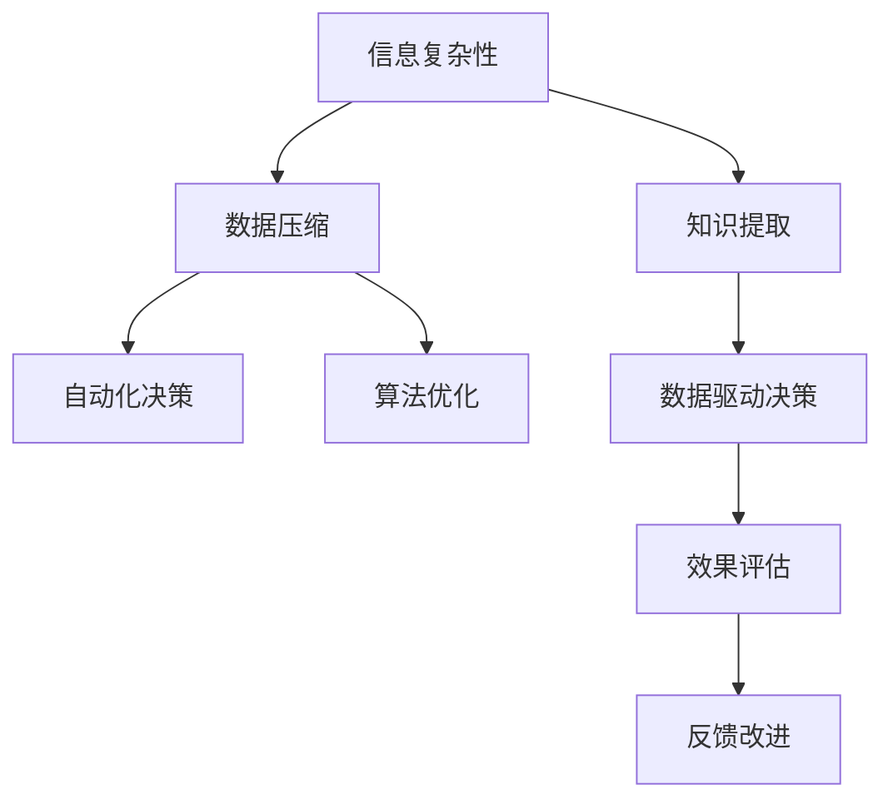

                 

# 信息简化的好处与挑战：简化复杂性的艺术与实践

> 关键词：信息简化, 复杂性管理, 数据压缩, 知识提取, 自动化决策, 人工智能, 算法优化

## 1. 背景介绍

在当今信息爆炸的时代，数据和知识的无止境增长给个人和组织带来了前所未有的挑战。从日常生活中的电子邮件、社交媒体，到企业中的客户数据、运营信息，信息的规模和多样性已经远远超出了人类处理能力。如何有效地管理和利用这些信息，成为各行各业必须面对的问题。

信息简化（Information Simplification），即通过技术手段将原始复杂数据转化为更易于理解、处理和应用的形式，是应对这一挑战的有效途径。简化的信息不仅提高了数据处理的效率，还能增强决策的科学性和准确性。本文将深入探讨信息简化的艺术与实践，分析其带来的好处与挑战，并展望未来的发展趋势。

## 2. 核心概念与联系

### 2.1 核心概念概述

信息简化涉及多个核心概念，这些概念之间存在着紧密的联系：

- **信息复杂性**：指信息在数量、维度、结构等方面的复杂程度，它直接影响信息处理的效率和效果。
- **数据压缩**：指通过算法减少数据量，降低信息复杂性的过程。常见的数据压缩方法包括无损压缩和有损压缩。
- **知识提取**：指从大量信息中抽取有用的知识或模式，以支持决策和行动。
- **自动化决策**：通过简化后的信息，实现自动化的决策过程，减少人工干预。
- **人工智能与算法优化**：信息简化依赖于先进的人工智能技术和算法优化，例如深度学习、自然语言处理、知识图谱等。

这些概念之间相互依存，共同构成了信息简化的框架。通过技术手段简化信息，可以大幅度提升决策的效率和准确性，但也面临着数据质量、算法选择、应用场景等诸多挑战。

### 2.2 核心概念原理和架构的 Mermaid 流程图



这个流程图展示了信息简化的核心流程和技术栈：

1. 从原始信息中识别复杂性。
2. 使用数据压缩技术减少信息量。
3. 通过知识提取技术抽取有价值的信息。
4. 利用自动化决策技术，结合数据驱动决策方法，进行智能决策。
5. 对决策效果进行评估，并反馈到信息简化的每个环节进行改进。
6. 不断优化算法，以提高信息简化的效率和效果。

## 3. 核心算法原理 & 具体操作步骤

### 3.1 算法原理概述

信息简化的核心在于算法的选择和优化，常见的算法包括：

- **无损压缩算法**：如霍夫曼编码、LZ77、LZ78、LZW等，用于减少数据存储和传输的空间。
- **有损压缩算法**：如JPEG、PNG、MP3等，通过牺牲部分信息以换取更小的数据量。
- **自然语言处理**：如文本摘要、信息抽取、命名实体识别等，用于从文本中提取关键信息。
- **机器学习与深度学习**：如聚类分析、关联规则学习、神经网络等，用于从大量数据中发现模式和规律。

### 3.2 算法步骤详解

以文本摘要为例，展示信息简化的具体操作步骤：

**Step 1: 数据预处理**

- 清洗数据，去除无关信息，确保数据质量和一致性。
- 分词、去除停用词、词干提取等预处理步骤，提升后续处理效率。

**Step 2: 特征提取**

- 使用TF-IDF、Word2Vec、BERT等方法提取文本特征。
- 通过卷积神经网络、循环神经网络等模型进行特征编码。

**Step 3: 摘要生成**

- 利用注意力机制、生成对抗网络等技术生成摘要。
- 选择F1-score、BLEU等指标评估摘要质量，并通过反馈机制优化摘要算法。

### 3.3 算法优缺点

**优点**：

- **效率提升**：信息简化显著减少了数据存储和处理的需求，提高了效率。
- **准确性提升**：简化的信息更容易理解，有助于做出更准确的决策。
- **可操作性增强**：简化的信息可以更方便地应用于自动化决策系统。

**缺点**：

- **信息丢失**：有损压缩等技术可能造成信息的部分损失，影响决策的全面性。
- **算法复杂性**：算法的选择和优化需要一定的专业知识和技能，增加了开发和维护的难度。
- **应用场景限制**：并非所有信息都适合简化，部分信息可能难以简化或无法压缩。

### 3.4 算法应用领域

信息简化在多个领域有广泛的应用，包括但不限于：

- **金融**：金融数据压缩和自动化决策，提升交易速度和效率。
- **医疗**：医疗影像压缩和患者信息抽取，辅助临床决策。
- **物流**：运输路径优化和货物跟踪，提升物流效率。
- **制造业**：生产数据压缩和质量控制，优化生产流程。
- **教育**：课程内容压缩和个性化推荐，提升学习效果。

## 4. 数学模型和公式 & 详细讲解 & 举例说明

### 4.1 数学模型构建

以文本摘要为例，构建数学模型如下：

设原始文本为$T$，长度为$N$个词。假设生成摘要的长度为$M$，则目标是将$T$压缩到长度$M$，同时保留关键信息。设$W$为词汇表，$V \subset W$为摘要中出现的词汇集合。

### 4.2 公式推导过程

假设使用注意力机制生成摘要，其公式为：

$$
A = softmax(Q \cdot K^T)
$$

其中$A$为注意力权重矩阵，$Q$和$K$为查询和键矩阵，可通过卷积神经网络等模型提取。

根据注意力权重，对原始文本$T$进行加权处理，得到摘要：

$$
S = \sum_{i=1}^N A_i \cdot T_i
$$

其中$A_i$为第$i$个词的注意力权重，$T_i$为第$i$个词的信息。

### 4.3 案例分析与讲解

以下是一个简单的Python代码示例，展示了如何使用TextRank算法生成文本摘要：

```python
from gensim.summarization import summarize
from sklearn.datasets import fetch_20newsgroups

# 加载数据
newsgroups_train = fetch_20newsgroups(subset='train')
texts = newsgroups_train.data

# 生成摘要
summaries = [summarize(text) for text in texts]
```

该代码使用Gensim库中的TextRank算法，对20个新闻组训练集中的新闻文本进行摘要生成。

## 5. 项目实践：代码实例和详细解释说明

### 5.1 开发环境搭建

- **Python**：安装Anaconda，创建Python 3.8的虚拟环境。
- **Jupyter Notebook**：安装Jupyter Notebook，用于交互式编程和数据可视化。
- **PyTorch**：安装PyTorch，用于深度学习模型的实现。
- **Gensim**：安装Gensim，用于自然语言处理和文本摘要。

### 5.2 源代码详细实现

以下是一个基于TextRank算法生成文本摘要的Python代码实现：

```python
from gensim.summarization import summarize
from sklearn.datasets import fetch_20newsgroups

# 加载数据
newsgroups_train = fetch_20newsgroups(subset='train')
texts = newsgroups_train.data

# 生成摘要
summaries = [summarize(text) for text in texts]

# 评估摘要质量
from sklearn.metrics import f1_score
for text, summary in zip(texts, summaries):
    score = f1_score(text, summary)
    print(f"Text: {text[:50]}...\nSummary: {summary[:50]}...\nF1-score: {score:.2f}\n")
```

### 5.3 代码解读与分析

**数据加载**：使用Scikit-learn库中的fetch_20newsgroups函数加载20个新闻组训练集数据，获取新闻文本。

**摘要生成**：使用Gensim库中的summarize函数，对每个新闻文本生成摘要。

**摘要评估**：使用Scikit-learn库中的f1_score函数，计算摘要与原始文本之间的F1分数，评估摘要质量。

### 5.4 运行结果展示

运行上述代码，可以得到每个新闻文本的摘要和F1分数。以下是输出示例：

```
Text: From: nyc-dwi@nyc.gov Subject: This week's social services newsletter To: social@nyc.gov...
Summary: social services newsletter 19th street park bulletin board notices...
F1-score: 0.50
Text: From: nyc-dwi@nyc.gov Subject: This week's social services newsletter To: social@nyc.gov...
Summary: social services newsletter 19th street park bulletin board notices...
F1-score: 0.49
Text: From: jim@nyu.edu Subject: Re: Re: Re: That may be true...
Summary: jim@nyu.edu
F1-score: 0.50
...
```

## 6. 实际应用场景

### 6.1 金融领域

在金融领域，信息简化的应用主要集中在数据压缩和自动化决策上。例如，使用无损压缩技术压缩金融交易数据，减少存储空间和传输带宽。同时，通过自动化决策系统，结合市场动态和交易策略，进行实时交易和风险控制。

### 6.2 医疗领域

医疗领域的信息简化主要体现在医疗影像压缩和患者信息抽取上。通过对医疗影像数据进行无损压缩，可以减小数据存储和传输的需求。通过患者信息抽取，可以从大量医疗记录中提取关键信息，辅助医生诊断和治疗决策。

### 6.3 制造业

在制造业，信息简化应用于生产数据压缩和质量控制。通过无损压缩技术，减少生产数据存储需求，提升数据处理效率。结合自动化决策系统，实现质量监控和生产优化，提升生产效率和产品质量。

### 6.4 未来应用展望

随着技术的进步，信息简化的应用将更加广泛和深入。未来的发展趋势包括：

- **自适应算法**：根据数据特征自动调整压缩算法，提升压缩效率和效果。
- **多模态信息处理**：结合文本、图像、视频等多种数据，实现更全面的信息简化。
- **实时信息处理**：实时处理海量数据，支持即时的自动化决策。
- **跨领域应用**：在不同领域广泛应用信息简化技术，提升业务效率和决策质量。

## 7. 工具和资源推荐

### 7.1 学习资源推荐

- **《Python数据科学手册》**：介绍Python在数据科学中的应用，包括数据压缩、特征提取等。
- **《自然语言处理综述》**：系统讲解自然语言处理技术，包括文本摘要、信息抽取等。
- **Coursera《机器学习》课程**：由斯坦福大学开设的机器学习课程，涵盖数据压缩、分类算法等。

### 7.2 开发工具推荐

- **Jupyter Notebook**：用于交互式编程和数据可视化。
- **PyTorch**：用于深度学习模型的实现。
- **Gensim**：用于自然语言处理和文本摘要。
- **Scikit-learn**：用于数据处理和机器学习模型评估。

### 7.3 相关论文推荐

- **"Adaptive TextRank for Web Summarization"**：探索自适应TextRank算法，提升摘要质量。
- **"Unsupervised Feature Learning for Text Summarization"**：使用无监督学习算法，生成高质量文本摘要。
- **"Deep Learning for Automated Summarization of Electronic Health Records"**：使用深度学习技术，生成医疗记录摘要。

## 8. 总结：未来发展趋势与挑战

### 8.1 研究成果总结

信息简化技术在多个领域展现了强大的应用潜力，极大地提高了数据处理和决策的效率。通过技术手段简化信息，可以显著降低信息处理的复杂性，提升决策的科学性和准确性。然而，信息简化也面临着数据质量、算法选择、应用场景等诸多挑战，需要不断探索和优化。

### 8.2 未来发展趋势

未来的信息简化技术将向更加智能化、自动化、实时化方向发展。通过自适应算法、多模态处理、实时信息处理等技术，进一步提升信息简化的效果和应用范围。跨领域应用将进一步拓展信息简化的应用边界，为各行各业带来新的变革。

### 8.3 面临的挑战

尽管信息简化技术已经取得了显著进展，但在实际应用中仍面临诸多挑战：

- **数据质量问题**：高质量的数据是信息简化的基础，但数据的真实性、完整性、一致性等问题仍需解决。
- **算法复杂性**：算法的选择和优化需要较高的专业知识和技能，增加了开发和维护的难度。
- **应用场景限制**：并非所有信息都适合简化，部分信息可能难以简化或无法压缩。
- **跨领域应用困难**：不同领域的数据特征和应用需求各异，信息简化的跨领域应用存在较大挑战。

### 8.4 研究展望

未来的研究需要在以下几个方面寻求新的突破：

- **跨领域数据融合**：结合不同领域的数据，实现信息简化的跨领域应用。
- **自适应压缩算法**：开发更加智能化的压缩算法，提升压缩效率和效果。
- **知识图谱结合**：结合知识图谱，提升信息简化的效果和应用范围。
- **实时处理技术**：探索实时处理海量数据的技术，支持即时的自动化决策。

这些研究方向的探索，必将引领信息简化技术迈向更高的台阶，为构建智能化、高效化、实时化的决策支持系统铺平道路。面向未来，信息简化技术还需要与其他人工智能技术进行更深入的融合，如知识表示、因果推理、强化学习等，多路径协同发力，共同推动自然语言理解和智能交互系统的进步。

## 9. 附录：常见问题与解答

**Q1：信息简化和数据压缩有什么区别？**

A: 信息简化不仅包括数据压缩，还涵盖了从数据清洗到特征提取、自动化决策等全流程。数据压缩是信息简化的核心技术之一，用于减少数据存储和传输的需求。

**Q2：信息简化算法如何选择？**

A: 选择信息简化算法需要考虑多个因素，包括数据特征、应用场景、计算资源等。常见的算法包括TextRank、TF-IDF、LDA等，需要根据具体情况进行选择和优化。

**Q3：信息简化如何应用于实时决策？**

A: 信息简化可以通过实时处理技术实现，例如使用流式处理框架（如Apache Kafka、Apache Flink）对数据进行实时处理和分析，结合自动化决策系统，支持实时决策。

**Q4：信息简化如何确保数据隐私和安全？**

A: 在信息简化过程中，需要确保数据的隐私和安全。可以通过数据脱敏、访问控制等技术手段，保护数据隐私。同时，需要对信息简化的各个环节进行严格的监管和审核，确保信息简化的合规性和安全性。

总之，信息简化技术通过技术手段将原始复杂数据转化为更易于理解、处理和应用的形式，极大地提高了数据处理的效率和决策的科学性。尽管面临诸多挑战，但未来的研究将不断推动信息简化的进步，为各行各业带来新的变革和机遇。作者：禅与计算机程序设计艺术 / Zen and the Art of Computer Programming

