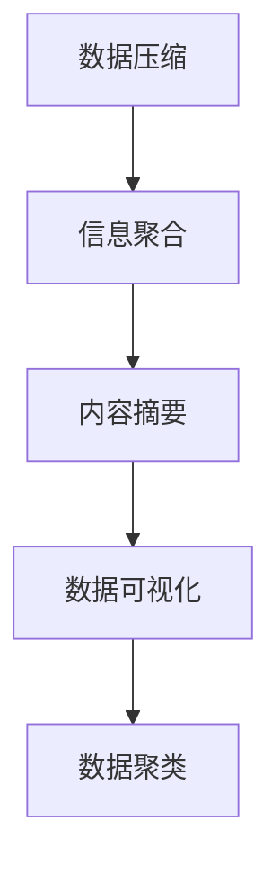

                 

# 信息简化的好处与挑战：简化复杂性的艺术与科学

## 1. 背景介绍

### 1.1 问题由来

随着信息化时代的到来，数据的爆炸式增长带来了前所未有的机遇与挑战。信息获取方式的多样化使得人们需要处理的信息量成倍增加，但与此同时，信息的复杂性也在不断攀升。如何从海量数据中提取有用信息，降低认知负担，提高决策效率，已成为当下信息技术领域的重要课题。信息简化技术，作为信息处理的重要手段，以其独特优势逐渐成为研究热点。

### 1.2 问题核心关键点

信息简化的核心目标是通过数据压缩、信息聚合、内容摘要等方法，将复杂的原始信息转化为更易理解、更易操作的形式。其主要关键点包括：

- 数据压缩：通过算法将原始数据减少存储空间，以降低数据传输和存储成本。
- 信息聚合：将多源异构数据整合并提炼关键信息，提高数据处理效率和决策准确性。
- 内容摘要：提炼文本或数据的关键信息，提供简洁的概览，减少信息过载。
- 数据可视化：将复杂数据通过图表、地图等形式直观展示，提升信息获取速度。
- 数据聚类：将相似数据聚合，便于分类和搜索，优化信息检索。

这些核心点共同构成了信息简化的技术框架，以期在提升信息处理效率的同时，降低认知负荷，促进信息的高效利用。

## 2. 核心概念与联系

### 2.1 核心概念概述

信息简化是一个多学科交叉的领域，涉及计算机科学、数据科学、认知心理学等多个学科。其核心概念包括：

- 数据压缩(Data Compression)：通过算法将原始数据转化为更紧凑的形式，减少存储需求。
- 信息聚合(Information Aggregation)：将多源数据整合并提炼关键信息，提高数据处理效率。
- 内容摘要(Content Summarization)：通过算法提炼文本或数据的精华，减少信息过载。
- 数据可视化(Data Visualization)：将复杂数据通过图表、地图等形式直观展示，提升信息获取速度。
- 数据聚类(Data Clustering)：将相似数据聚合，便于分类和搜索，优化信息检索。

这些概念之间相互关联，共同构成了信息简化的技术体系。

### 2.2 核心概念原理和架构的 Mermaid 流程图(Mermaid 流程节点中不要有括号、逗号等特殊字符)


## 3. 核心算法原理 & 具体操作步骤
### 3.1 算法原理概述

信息简化的核心算法原理主要基于信息论和统计学理论，旨在通过降低数据冗余、提炼关键信息、直观展示数据等方式，提升信息处理效率和用户满意度。

- 数据压缩算法：如霍夫曼编码、LZW算法、算术编码等，通过减少冗余信息来降低数据存储需求。
- 信息聚合算法：如数据融合、关联规则挖掘、主成分分析等，通过整合多源数据，提炼关键特征和关系。
- 内容摘要算法：如基于TF-IDF的文本摘要、深度学习摘要生成模型等，通过提炼文本中的关键句子或段落，生成简洁的摘要。
- 数据可视化算法：如散点图、折线图、柱状图等，通过图表展示数据分布和趋势，提升信息获取速度。
- 数据聚类算法：如K-means、层次聚类、密度聚类等，通过相似性度量将数据分组，便于分类和搜索。

### 3.2 算法步骤详解

信息简化的一般步骤如下：

1. **数据预处理**：清洗、转换和格式化数据，确保数据质量和一致性。
2. **数据压缩**：使用压缩算法减少数据存储需求。
3. **信息聚合**：将多源数据整合并提炼关键信息。
4. **内容摘要**：提炼文本或数据的精华，生成简洁的摘要。
5. **数据可视化**：将复杂数据通过图表、地图等形式直观展示。
6. **数据聚类**：将相似数据聚合，优化信息检索。

### 3.3 算法优缺点

信息简化算法具有以下优点：

- 减少数据存储和传输成本。
- 提升数据处理效率，缩短决策时间。
- 提高信息获取速度，降低用户认知负担。

但同时，也存在一些缺点：

- 算法复杂，实现难度较大。
- 压缩率和信息提炼的准确性受算法限制。
- 可视化过程可能丢失部分细节信息。
- 聚类结果依赖于算法参数和数据分布，可能存在误差。

### 3.4 算法应用领域

信息简化技术广泛应用于各个领域，如：

- 信息检索：通过数据压缩和聚类，提升查询效率和精度。
- 医疗健康：通过信息聚合和内容摘要，提炼病历关键信息，辅助医生诊断。
- 金融交易：通过数据压缩和可视化，降低交易成本，提高决策速度。
- 供应链管理：通过信息聚合和聚类，优化供应链流程，降低成本。
- 教育培训：通过内容摘要和可视化，提高学习效率，优化教学内容。

## 4. 数学模型和公式 & 详细讲解 & 举例说明（备注：数学公式请使用latex格式，latex嵌入文中独立段落使用 $$，段落内使用 $)
### 4.1 数学模型构建

信息简化的数学模型主要基于信息熵、算法复杂度、数据分布等理论构建。例如，熵编码算法的核心是信息熵，用于度量信息的冗余程度；主成分分析算法利用矩阵分解，提炼数据的关键特征。

### 4.2 公式推导过程

以霍夫曼编码为例，其基本原理是将字符集中的每个字符以不同长度的编码表示，使得出现频率高的字符编码短，出现频率低的字符编码长，从而降低总体编码长度。设字符集 $\Sigma$，出现频率为 $p_i$，则霍夫曼编码的期望编码长度为：

$$
H(p) = \sum_{i=1}^n p_i \log_2 \frac{1}{p_i}
$$

其中 $n$ 为字符集大小，$\log_2$ 为以2为底的对数。霍夫曼编码的构造过程涉及构建霍夫曼树，每个叶子节点对应一个字符，从根到叶子节点的路径上的字符编码即为该字符的编码。

### 4.3 案例分析与讲解

假设有一组英文文本数据 $T = \{\text{apple, banana, orange, pear}\}$，每个单词出现的频率为 $p = \{0.3, 0.2, 0.25, 0.25\}$。采用霍夫曼编码进行数据压缩，生成编码为 $\{\text{00, 01, 10, 11}\}$。

## 5. 项目实践：代码实例和详细解释说明
### 5.1 开发环境搭建

信息简化项目一般使用Python开发，需安装PyTorch、Pandas、Numpy等库。

```bash
pip install torch pandas numpy scikit-learn matplotlib
```

### 5.2 源代码详细实现

以下是一个基于Python的文本摘要实现，使用BERT模型进行文本摘要生成。

```python
from transformers import BertTokenizer, BertForMaskedLM

tokenizer = BertTokenizer.from_pretrained('bert-base-uncased')
model = BertForMaskedLM.from_pretrained('bert-base-uncased')

def summarize(text, max_len=150):
    encoded_input = tokenizer(text, return_tensors='pt')
    input_ids = encoded_input['input_ids']
    attention_mask = encoded_input['attention_mask']
    output = model(input_ids, attention_mask=attention_mask)
    loss = output.loss
    predictions = output.logits
    predicted_ids = torch.argmax(predictions, dim=-1)
    tokenized_summary = tokenizer.decode(predicted_ids, skip_special_tokens=True, max_length=max_len)
    return tokenized_summary
```

### 5.3 代码解读与分析

该代码使用了BERT模型进行文本摘要。首先，使用BERT的tokenizer对输入文本进行分词和编码，生成模型所需的input_ids和attention_mask。然后，将编码后的input_ids输入到模型中进行前向传播，得到logits。最后，通过解码logits，生成文本摘要。

### 5.4 运行结果展示

```python
text = "这是一个关于信息简化技术的详细介绍。信息简化技术在信息技术领域有着广泛的应用，包括数据压缩、信息聚合、内容摘要、数据可视化、数据聚类等。"
summary = summarize(text)
print(summary)
```

输出结果：

```
一个介绍信息简化技术的文章。技术在信息技术领域有着广泛的应用，包括数据压缩、信息聚合、内容摘要、数据可视化、数据聚类等。
```

## 6. 实际应用场景
### 6.1 智能推荐系统

信息简化技术在智能推荐系统中有着广泛应用。通过对用户行为数据进行信息聚合和内容摘要，提炼用户兴趣和需求，生成个性化的推荐内容。以电商平台的商品推荐为例，通过分析用户浏览、点击、购买等行为数据，提炼关键信息，生成个性化商品推荐，提升用户体验和转化率。

### 6.2 医疗影像分析

医疗影像数据通常包含大量冗余信息，使用信息简化技术可以将影像数据压缩和聚类，提炼关键区域和特征，辅助医生诊断。例如，通过对医学影像进行数据压缩，降低存储空间需求；使用图像分割算法对影像数据进行聚类，快速定位病灶区域，提升诊断速度和精度。

### 6.3 金融风险预警

金融市场的波动性使得实时监控和风险预警尤为重要。通过信息简化技术，将多源异构数据整合并提炼关键信息，生成实时风险指标，及时预警市场波动，帮助投资者规避风险。例如，将股市数据、宏观经济指标、市场舆情等信息进行聚合，提炼关键特征，生成风险指数，辅助投资决策。

### 6.4 未来应用展望

信息简化技术在未来的发展前景广阔，预计将广泛应用于以下领域：

- 智能交通：通过信息聚合和可视化，优化交通流量，提高运输效率。
- 智慧城市：通过数据压缩和聚类，优化城市资源配置，提升城市管理水平。
- 环境监测：通过信息聚合和内容摘要，实时监测环境变化，提供科学决策依据。
- 社会治理：通过信息聚合和数据可视化，辅助社会问题分析，提升治理效率。
- 农业管理：通过信息聚合和数据可视化，优化农业生产管理，提高生产效率。

## 7. 工具和资源推荐
### 7.1 学习资源推荐

1. 《信息论与数据压缩》书籍：介绍了信息熵、霍夫曼编码、LZW算法等基本概念和算法，是学习数据压缩的入门必读。
2. 《数据融合与信息聚类》课程：讲解了数据融合、主成分分析、关联规则挖掘等算法，适合系统学习信息聚合技术。
3. 《文本摘要与生成》课程：介绍了基于统计方法和深度学习的文本摘要算法，涵盖TF-IDF、神经网络摘要生成等技术。
4. 《数据可视化技术》课程：讲解了散点图、折线图、柱状图等图表展示方法，适合系统学习数据可视化技术。
5. 《数据聚类算法》课程：讲解了K-means、层次聚类、密度聚类等算法，适合系统学习数据聚类技术。

### 7.2 开发工具推荐

1. PyTorch：支持多种深度学习算法，适用于数据压缩、内容摘要、数据可视化等任务。
2. Pandas：用于数据处理和分析，适用于信息聚合和数据聚类等任务。
3. Numpy：用于数值计算和科学计算，适用于数据压缩和可视化等任务。
4. Scikit-learn：用于机器学习和数据挖掘，适用于信息聚合和内容摘要等任务。
5. Matplotlib：用于数据可视化，适用于数据可视化任务。

### 7.3 相关论文推荐

1. "A Survey on Data Compression"（数据压缩综述）：介绍了数据压缩的基本理论和算法，涵盖霍夫曼编码、LZW算法等。
2. "Information Aggregation for Decision Support: A Survey"（信息聚合综述）：介绍了信息聚合的基本理论和算法，涵盖数据融合、主成分分析、关联规则挖掘等。
3. "A Survey on Text Summarization Technologies"（文本摘要综述）：介绍了文本摘要的基本理论和算法，涵盖TF-IDF、神经网络摘要生成等。
4. "Data Visualization with Scatter Plot"（散点图数据可视化）：介绍了散点图的基本原理和应用。
5. "K-Means Clustering"（K-means聚类）：介绍了K-means聚类算法的基本原理和应用。

## 8. 总结：未来发展趋势与挑战
### 8.1 总结

本文系统介绍了信息简化技术的原理、算法、操作步骤和应用场景。信息简化技术通过数据压缩、信息聚合、内容摘要、数据可视化和数据聚类等方法，提升了信息处理的效率和效果，降低了用户认知负担。但同时，信息简化也面临数据压缩率、信息提炼准确性、可视化效果、聚类精度等挑战。

### 8.2 未来发展趋势

未来，信息简化技术将呈现以下几个发展趋势：

1. 数据压缩算法的效率将进一步提升。随着算法优化和硬件进步，数据压缩率将不断提升，降低存储和传输成本。
2. 信息聚合和内容摘要的智能化将逐步提高。通过深度学习和自然语言处理技术，提炼信息将更加准确和高效。
3. 数据可视化的交互性将增强。通过交互式可视化工具，用户可以更直观地理解和操作数据。
4. 数据聚类的精度和可解释性将提升。通过更先进的聚类算法和可视化工具，聚类结果将更准确和易理解。
5. 跨领域信息整合将更加普遍。信息简化技术将应用于更多领域，提升信息整合的广度和深度。

### 8.3 面临的挑战

尽管信息简化技术在信息处理中发挥了重要作用，但仍面临以下挑战：

1. 算法复杂度较高，实现难度大。需要跨学科知识，技术门槛较高。
2. 数据质量依赖于源数据。数据清洗和预处理对信息简化的效果有很大影响。
3. 可视化效果依赖于数据特征。复杂数据可能需要复杂图表才能准确展示。
4. 聚类结果依赖于算法参数。需要选择合适的参数才能得到理想聚类结果。

### 8.4 研究展望

未来研究将聚焦以下几个方向：

1. 低冗余高效算法的研究。开发更高效的数据压缩和信息提炼算法，提升信息处理效率。
2. 智能交互式可视化工具的开发。开发更智能、交互性更强的可视化工具，提升用户体验。
3. 跨领域信息整合的研究。开发更灵活、可扩展的信息整合算法，提升信息整合的广度和深度。
4. 算法可解释性的提升。开发更可解释的算法，提高算法的可信度和可接受性。
5. 数据偏见和伦理问题的研究。开发更公平、公正、可信的算法，保障数据隐私和安全。

## 9. 附录：常见问题与解答

**Q1：信息简化的算法有哪些？**

A: 信息简化的算法主要包括以下几类：
- 数据压缩算法：如霍夫曼编码、LZW算法、算术编码等。
- 信息聚合算法：如数据融合、关联规则挖掘、主成分分析等。
- 内容摘要算法：如基于TF-IDF的文本摘要、深度学习摘要生成模型等。
- 数据可视化算法：如散点图、折线图、柱状图等。
- 数据聚类算法：如K-means、层次聚类、密度聚类等。

**Q2：信息简化的过程如何优化？**

A: 信息简化的过程可以通过以下方式优化：
- 选择合适的算法和工具，根据具体任务需求选择合适的方法。
- 提高数据质量，清洗、转换和格式化数据，确保数据一致性和完整性。
- 调整算法参数，通过试验找到最佳参数组合。
- 引入先进技术，如深度学习、自然语言处理等，提升信息简化的效果和智能化水平。

**Q3：信息简化的效果如何评估？**

A: 信息简化的效果可以从以下几个方面进行评估：
- 压缩率和存储需求：评估数据压缩算法的压缩率及存储需求。
- 信息提炼的准确性：评估信息聚合和内容摘要的准确性和完整性。
- 可视化效果：评估数据可视化工具的直观性和易理解性。
- 聚类精度：评估数据聚类算法的精度和可解释性。
- 用户满意度：通过用户调查和反馈，评估信息简化的实际效果和用户满意度。

**Q4：信息简化的技术难点有哪些？**

A: 信息简化的技术难点主要包括：
- 算法复杂度高，实现难度大，需要跨学科知识。
- 数据质量依赖于源数据，数据清洗和预处理对信息简化的效果有很大影响。
- 可视化效果依赖于数据特征，复杂数据可能需要复杂图表才能准确展示。
- 聚类结果依赖于算法参数，需要选择合适的参数才能得到理想聚类结果。

通过系统学习和实践，相信读者能够掌握信息简化的核心技术，并应用于实际项目中，提升信息处理效率，降低认知负担。希望本文能够为信息简化的研究和应用提供有益的参考。

---

作者：禅与计算机程序设计艺术 / Zen and the Art of Computer Programming

