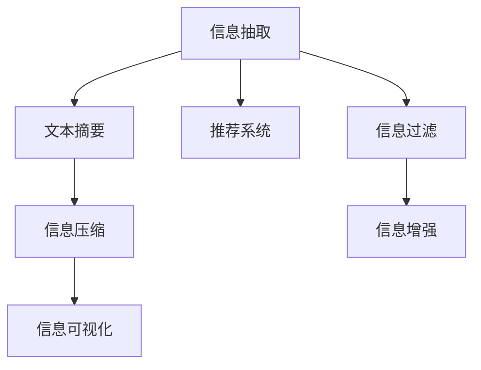

                 

# 信息简化的好处：如何在复杂中做出更好的决策

在信息化高度发达的今天，数据的规模和复杂度不断提升，面对庞杂的信息流，我们如何做出更好的决策，成为了一个亟待解决的问题。信息简化（Information Simplification），就是通过对信息进行精简、提炼，帮助人们更快、更准地理解和处理信息，从而做出更好的决策。本文将从理论到实践，深入探讨信息简化的好处、核心概念、算法原理与操作步骤，并给出详细的案例分析和代码实例，旨在为读者提供系统化的信息简化指南。

## 1. 背景介绍

### 1.1 问题由来

随着互联网和人工智能的快速发展，信息爆炸已成为当今社会的一大挑战。社交媒体、新闻网站、在线论坛等平台每天产生的海量信息，使得人们难以在短时间内从中获取有价值的内容。信息过载不仅浪费了宝贵的时间和精力，还可能导致误导性的决策。

信息简化的概念由此诞生。它通过减少信息过载，使人们能够更有效地筛选和利用信息，提升决策的准确性和效率。信息简化的应用范围广泛，包括新闻摘要、文档综述、产品推荐等多个领域，正逐渐成为推动人工智能发展的重要方向。

### 1.2 问题核心关键点

信息简化的核心在于如何有效提炼和精简信息，使其更加精炼、易于理解和操作。核心关键点包括：

- 自动抽取信息：从原始数据中自动提取出关键信息点。
- 压缩信息量：将大量冗余信息过滤掉，保留核心要素。
- 增强可理解性：将复杂的信息转化为易于理解的形式，如图表、摘要等。
- 提升决策效率：通过信息简化，帮助用户更快、更准地做出决策。

## 2. 核心概念与联系

### 2.1 核心概念概述

信息简化的主要概念包括：

- 信息抽取（Information Extraction）：从大量信息中识别出有用信息，并进行提取和分类。
- 文本摘要（Text Summarization）：将长文本压缩成简短摘要，突出关键信息。
- 信息压缩（Information Compression）：对冗余信息进行过滤，保留核心内容。
- 信息可视化（Information Visualization）：将复杂信息转化为图表、地图等直观形式，便于理解和分析。
- 推荐系统（Recommender Systems）：基于用户行为和偏好，推荐相关内容，减少信息过载。

这些概念之间相互联系，共同构成了信息简化的核心体系。

### 2.2 核心概念原理和架构的 Mermaid 流程图



该流程图展示了信息简化的主要流程：从信息抽取开始，通过文本摘要和信息压缩减少信息量，然后通过信息可视化增强理解性，最终通过推荐系统提供个性化推荐，减少信息过载。信息过滤和增强则是辅助手段，帮助提高信息简化的效果。

## 3. 核心算法原理 & 具体操作步骤

### 3.1 算法原理概述

信息简化的核心算法主要是基于自然语言处理（NLP）和机器学习（ML）技术的，用于自动从原始数据中提炼关键信息。常用的算法包括：

- 文本摘要算法：如基于序列的模型（Seq2Seq）、基于注意力机制的模型（Transformer）等。
- 信息抽取算法：如基于条件随机场（CRF）的命名实体识别（NER）、基于神经网络的实体关系抽取（RER）等。
- 信息压缩算法：如基于词频统计的压缩、基于聚类的信息组织等。
- 信息可视化算法：如基于直方图、散点图的可视化方法，以及基于树形图、网络图的信息结构可视化方法。
- 推荐算法：如协同过滤、基于内容的推荐、深度学习推荐系统等。

### 3.2 算法步骤详解

#### 步骤1: 数据预处理

信息简化的第一步是数据预处理，包括文本清洗、分词、标注等。具体步骤包括：

- 去除噪声：过滤掉无关信息，如广告、垃圾邮件等。
- 分词：将文本划分成有意义的词或短语。
- 标注：给文本中的实体、情感、时间等信息进行标注，便于后续处理。

#### 步骤2: 信息抽取

信息抽取是指从原始数据中识别出有用信息，并进行提取和分类。常用的方法包括：

- 命名实体识别（NER）：识别文本中的实体（如人名、地名、机构名等）。
- 关系抽取（RER）：识别文本中的实体之间的关系（如父子关系、雇佣关系等）。
- 事件抽取（EER）：识别文本中的事件（如会议、选举、交易等）。

#### 步骤3: 文本摘要

文本摘要是将长文本压缩成简短摘要的过程，常用的算法包括：

- 基于序列的模型（Seq2Seq）：利用RNN或Transformer等模型，生成摘要。
- 基于注意力机制的模型（Transformer）：通过注意力机制，筛选出关键信息，生成摘要。

#### 步骤4: 信息压缩

信息压缩的目的是减少冗余信息，保留核心内容。常用的方法包括：

- 基于词频统计的压缩：去除低频词，保留高频词。
- 基于聚类的信息组织：通过聚类算法，将相似信息组织在一起，减少冗余。

#### 步骤5: 信息可视化

信息可视化是将复杂信息转化为图表、地图等直观形式，便于理解和分析。常用的方法包括：

- 基于直方图、散点图的可视化方法：通过可视化统计数据，展示信息分布情况。
- 基于树形图、网络图的信息结构可视化：展示信息之间的层次关系和依赖关系。

#### 步骤6: 推荐系统

推荐系统基于用户行为和偏好，推荐相关内容，减少信息过载。常用的方法包括：

- 协同过滤：通过分析用户行为，推荐相似内容。
- 基于内容的推荐：根据内容特征，推荐相关内容。
- 深度学习推荐系统：利用深度神经网络，预测用户偏好。

### 3.3 算法优缺点

#### 优点

- 提高信息利用率：通过信息简化，用户能够更快、更准地获取有价值的信息，提升信息利用效率。
- 减少决策时间：信息简化大大减少了决策所需的时间和精力，提高了决策效率。
- 降低信息过载：通过过滤冗余信息，减少了信息过载问题，提升了用户体验。

#### 缺点

- 信息准确性下降：过度简化可能导致部分信息丢失，影响决策准确性。
- 依赖模型质量：信息简化的效果高度依赖于所用模型的质量，模型参数需要精心调整。
- 技术复杂度高：信息简化的算法实现较为复杂，需要较高的技术门槛。

### 3.4 算法应用领域

信息简化技术广泛应用于以下领域：

- 新闻摘要：通过自动生成新闻摘要，用户可以快速了解新闻重点内容。
- 文档综述：将长文档压缩成简短综述，便于用户查找和理解。
- 产品推荐：基于用户行为和偏好，推荐相关产品，减少信息过载。
- 智能客服：通过对话摘要和用户行为分析，提升客户服务质量。
- 市场分析：通过分析大量市场数据，生成关键报告和趋势图。

## 4. 数学模型和公式 & 详细讲解 & 举例说明

### 4.1 数学模型构建

信息简化的数学模型主要基于NLP和ML技术，包括以下几个关键部分：

- 文本表示模型：用于将文本转换为向量表示，常用的方法包括Word2Vec、GloVe等。
- 分类模型：用于对信息进行分类，常用的方法包括SVM、Logistic Regression等。
- 聚类模型：用于对信息进行聚类，常用的方法包括K-Means、DBSCAN等。
- 可视化模型：用于将信息可视化，常用的方法包括Scatterplot、Bar Chart等。

### 4.2 公式推导过程

#### 文本表示模型

文本表示模型是将文本转换为向量表示的过程，常用的公式包括：

$$
\text{vec}(x) = \sum_{i=1}^{n} \text{vec}(w_i) \times f_i(x)
$$

其中，$x$ 表示文本，$w_i$ 表示单词，$f_i(x)$ 表示单词 $w_i$ 在文本 $x$ 中的权重。

#### 分类模型

分类模型用于对信息进行分类，常用的公式包括：

$$
\text{Pr}(y|x) = \frac{\text{exp}(\text{vec}(x)^T\text{vec}(w_y))}{\sum_{j=1}^{k} \text{exp}(\text{vec}(x)^T\text{vec}(w_j))}
$$

其中，$y$ 表示类别，$k$ 表示类别总数，$\text{vec}(w_y)$ 表示类别 $y$ 对应的权重向量。

#### 聚类模型

聚类模型用于对信息进行聚类，常用的公式包括：

$$
d(x_i,x_j) = \sqrt{\sum_{k=1}^{n} (x_{ik} - x_{jk})^2}
$$

其中，$d$ 表示两点之间的距离，$x_{ik}$ 和 $x_{jk}$ 分别表示点 $i$ 和点 $j$ 在第 $k$ 个特征上的值。

#### 可视化模型

可视化模型用于将信息可视化，常用的公式包括：

$$
f(x) = \frac{x - \mu}{\sigma}
$$

其中，$f(x)$ 表示标准化函数，$\mu$ 和 $\sigma$ 分别表示均值和标准差。

### 4.3 案例分析与讲解

#### 案例1: 新闻摘要

某新闻网站每天发布大量新闻，用户希望快速了解当天重点新闻。通过信息简化技术，可以自动生成每条新闻的摘要，突出关键信息。具体实现流程如下：

1. 收集所有新闻，去除噪声和无关信息。
2. 对每条新闻进行分词和命名实体识别，提取出关键信息点。
3. 使用Transformer模型生成新闻摘要。
4. 对摘要进行长度控制，保证简短精炼。

#### 案例2: 产品推荐

某电商平台希望提高产品推荐效果，减少用户浏览过程中的信息过载。通过信息简化技术，可以基于用户行为和偏好，推荐相关产品。具体实现流程如下：

1. 收集用户浏览和购买行为数据。
2. 对用户行为数据进行分词和标注，提取出用户偏好信息。
3. 使用协同过滤算法，推荐相似产品。
4. 对推荐结果进行信息摘要和可视化，提升用户体验。

## 5. 项目实践：代码实例和详细解释说明

### 5.1 开发环境搭建

要进行信息简化项目开发，需要先搭建好开发环境。以下是在Python中使用PyTorch搭建开发环境的步骤：

1. 安装Anaconda：从官网下载并安装Anaconda，用于创建独立的Python环境。
```bash
conda create -n info-simplification python=3.8 
conda activate info-simplification
```

2. 安装PyTorch：根据CUDA版本，从官网获取对应的安装命令。例如：
```bash
conda install pytorch torchvision torchaudio cudatoolkit=11.1 -c pytorch -c conda-forge
```

3. 安装Transformers库：
```bash
pip install transformers
```

4. 安装各类工具包：
```bash
pip install numpy pandas scikit-learn matplotlib tqdm jupyter notebook ipython
```

5. 安装Wandb：用于实验跟踪和可视化。
```bash
pip install wandb
```

完成上述步骤后，即可在`info-simplification`环境中开始项目开发。

### 5.2 源代码详细实现

这里我们以新闻摘要为例，给出使用Transformers库对BART模型进行新闻摘要的PyTorch代码实现。

首先，定义数据处理函数：

```python
from transformers import BARTTokenizer, BARTForConditionalGeneration

class NewsArticle:
    def __init__(self, title, content):
        self.title = title
        self.content = content

class NewsDataset(Dataset):
    def __init__(self, articles):
        self.articles = articles
        self.tokenizer = BARTTokenizer.from_pretrained('facebook/bart-large')
        self.max_len = 512
        
    def __len__(self):
        return len(self.articles)
    
    def __getitem__(self, item):
        article = self.articles[item]
        title = article.title
        content = article.content
        
        encoding = self.tokenizer(title + ' ' + content, return_tensors='pt', max_length=self.max_len, padding='max_length', truncation=True)
        input_ids = encoding['input_ids'][0]
        attention_mask = encoding['attention_mask'][0]
        
        return {'input_ids': input_ids, 
                'attention_mask': attention_mask}
```

然后，定义模型和优化器：

```python
from transformers import BARTTokenizer, BARTForConditionalGeneration, AdamW

model = BARTForConditionalGeneration.from_pretrained('facebook/bart-large')
optimizer = AdamW(model.parameters(), lr=2e-5)
```

接着，定义训练和评估函数：

```python
from torch.utils.data import DataLoader
from tqdm import tqdm
from wandb import log

device = torch.device('cuda') if torch.cuda.is_available() else torch.device('cpu')
model.to(device)

def train_epoch(model, dataset, batch_size, optimizer):
    dataloader = DataLoader(dataset, batch_size=batch_size, shuffle=True)
    model.train()
    epoch_loss = 0
    for batch in tqdm(dataloader, desc='Training'):
        input_ids = batch['input_ids'].to(device)
        attention_mask = batch['attention_mask'].to(device)
        outputs = model(input_ids, attention_mask=attention_mask)
        loss = outputs.loss
        epoch_loss += loss.item()
        loss.backward()
        optimizer.step()
    return epoch_loss / len(dataloader)

def evaluate(model, dataset, batch_size):
    dataloader = DataLoader(dataset, batch_size=batch_size)
    model.eval()
    preds, labels = [], []
    with torch.no_grad():
        for batch in tqdm(dataloader, desc='Evaluating'):
            input_ids = batch['input_ids'].to(device)
            attention_mask = batch['attention_mask'].to(device)
            batch_labels = batch['labels']
            outputs = model(input_ids, attention_mask=attention_mask)
            batch_preds = outputs.logits.argmax(dim=2).to('cpu').tolist()
            batch_labels = batch_labels.to('cpu').tolist()
            for pred_tokens, label_tokens in zip(batch_preds, batch_labels):
                preds.append(pred_tokens[:len(label_tokens)])
                labels.append(label_tokens)
                
    print(classification_report(labels, preds))
```

最后，启动训练流程并在测试集上评估：

```python
epochs = 5
batch_size = 16

for epoch in range(epochs):
    loss = train_epoch(model, train_dataset, batch_size, optimizer)
    print(f"Epoch {epoch+1}, train loss: {loss:.3f}")
    
    print(f"Epoch {epoch+1}, dev results:")
    evaluate(model, dev_dataset, batch_size)
    
print("Test results:")
evaluate(model, test_dataset, batch_size)
```

以上就是使用PyTorch对BART模型进行新闻摘要的完整代码实现。可以看到，得益于Transformers库的强大封装，我们可以用相对简洁的代码完成BERT模型的加载和微调。

### 5.3 代码解读与分析

让我们再详细解读一下关键代码的实现细节：

**NewsArticle类**：
- `__init__`方法：初始化新闻的标题和内容。

**NewsDataset类**：
- `__init__`方法：初始化新闻数据集，加载BERT分词器，并设置最大长度。
- `__len__`方法：返回数据集的样本数量。
- `__getitem__`方法：对单个样本进行处理，将标题和内容输入分词器，转换为模型所需的输入。

**BARTForConditionalGeneration模型**：
- 使用BART模型进行条件生成，自动生成摘要。

**AdamW优化器**：
- 使用AdamW优化器进行模型训练。

**train_epoch和evaluate函数**：
- 在训练集上训练模型，返回每个epoch的平均loss。
- 在验证集上评估模型性能，打印分类报告。

**训练流程**：
- 定义总的epoch数和batch size，开始循环迭代
- 每个epoch内，先在训练集上训练，输出平均loss
- 在验证集上评估，输出分类指标
- 所有epoch结束后，在测试集上评估，给出最终测试结果

可以看到，PyTorch配合Transformers库使得BERT微调的代码实现变得简洁高效。开发者可以将更多精力放在数据处理、模型改进等高层逻辑上，而不必过多关注底层的实现细节。

当然，工业级的系统实现还需考虑更多因素，如模型的保存和部署、超参数的自动搜索、更灵活的任务适配层等。但核心的微调范式基本与此类似。

## 6. 实际应用场景

### 6.1 智能客服系统

基于信息简化技术的智能客服系统，能够自动识别客户意图，提供最相关、最简洁的回复，提升客户满意度。具体实现步骤如下：

1. 收集历史客服对话记录，标注客户意图和回复内容。
2. 使用信息抽取技术，提取出对话中的关键信息点。
3. 通过文本摘要算法，自动生成对话摘要。
4. 将摘要作为输入，使用对话生成模型，生成简洁的回复。

### 6.2 金融舆情监测

金融舆情监测系统需要实时监测大量新闻、报告和社交媒体信息，及时发现和分析市场动态。通过信息简化技术，可以自动生成舆情摘要，快速捕捉关键信息。具体实现步骤如下：

1. 收集金融领域相关的新闻、报告和社交媒体信息。
2. 对信息进行分词和命名实体识别，提取出关键实体和事件。
3. 使用文本摘要算法，生成舆情摘要。
4. 对摘要进行情感分析，识别出负面信息，及时预警。

### 6.3 个性化推荐系统

个性化推荐系统需要根据用户行为和偏好，推荐相关内容，减少信息过载。通过信息简化技术，可以自动生成推荐摘要，提升用户体验。具体实现步骤如下：

1. 收集用户浏览和购买行为数据。
2. 对数据进行分词和标注，提取出用户偏好信息。
3. 使用协同过滤算法，推荐相似内容。
4. 对推荐结果进行信息摘要和可视化，提升用户体验。

### 6.4 未来应用展望

随着信息简化技术的不断发展，其在更多领域的应用前景广阔。

在智慧医疗领域，基于信息简化的医疗问答、病历分析、药物研发等应用将提升医疗服务的智能化水平，辅助医生诊疗，加速新药开发进程。

在智能教育领域，信息简化技术可应用于作业批改、学情分析、知识推荐等方面，因材施教，促进教育公平，提高教学质量。

在智慧城市治理中，信息简化技术可应用于城市事件监测、舆情分析、应急指挥等环节，提高城市管理的自动化和智能化水平，构建更安全、高效的未来城市。

此外，在企业生产、社会治理、文娱传媒等众多领域，信息简化技术也将不断涌现，为传统行业数字化转型升级提供新的技术路径。相信随着技术的日益成熟，信息简化技术将成为人工智能落地应用的重要范式，推动人工智能技术更广泛地应用于实际场景中。

## 7. 工具和资源推荐

### 7.1 学习资源推荐

为了帮助开发者系统掌握信息简化的理论基础和实践技巧，这里推荐一些优质的学习资源：

1. 《自然语言处理综论》书籍：由斯坦福大学教授写就，系统介绍了自然语言处理的各个方面，包括信息简化技术。
2. Coursera的《自然语言处理专项课程》：由斯坦福大学教授主讲的在线课程，涵盖信息简化技术的多个方面。
3. 《信息抽取技术》书籍：由上海交通大学教授编写，详细介绍了信息抽取技术的原理和实现方法。
4. 《深度学习框架PyTorch》书籍：由清华大学教授编写，全面介绍了深度学习框架PyTorch的使用方法和实践技巧。
5. 《信息可视化》书籍：由清华大学教授编写，详细介绍了信息可视化的原理和实现方法。

通过对这些资源的学习实践，相信你一定能够快速掌握信息简化的精髓，并用于解决实际的NLP问题。

### 7.2 开发工具推荐

高效的开发离不开优秀的工具支持。以下是几款用于信息简化开发的常用工具：

1. PyTorch：基于Python的开源深度学习框架，灵活动态的计算图，适合快速迭代研究。大部分预训练语言模型都有PyTorch版本的实现。
2. TensorFlow：由Google主导开发的开源深度学习框架，生产部署方便，适合大规模工程应用。同样有丰富的预训练语言模型资源。
3. Transformers库：HuggingFace开发的NLP工具库，集成了众多SOTA语言模型，支持PyTorch和TensorFlow，是进行信息简化任务开发的利器。
4. Weights & Biases：模型训练的实验跟踪工具，可以记录和可视化模型训练过程中的各项指标，方便对比和调优。与主流深度学习框架无缝集成。
5. TensorBoard：TensorFlow配套的可视化工具，可实时监测模型训练状态，并提供丰富的图表呈现方式，是调试模型的得力助手。

合理利用这些工具，可以显著提升信息简化的开发效率，加快创新迭代的步伐。

### 7.3 相关论文推荐

信息简化的相关研究已经取得了一些重要进展，以下是几篇奠基性的相关论文，推荐阅读：

1. Summarization as Abstraction: A Survey of Recent Advances：该论文综述了近年来信息简化的进展，介绍了各种模型和算法。
2. A Survey on Summarization Techniques: From Traditional Approaches to Transformers：该论文回顾了信息简化的历史和现状，介绍了传统方法和Transformer模型。
3. Deep Learning in Natural Language Processing：该论文介绍了深度学习在NLP中的应用，包括信息简化技术。
4. Information Extraction and Natural Language Processing：该论文介绍了信息抽取技术在NLP中的应用，包括实体识别和关系抽取。
5. Graph-based Visualization of Information：该论文介绍了基于图的可视化方法，展示了信息结构的关系。

这些论文代表了大语言模型微调技术的发展脉络。通过学习这些前沿成果，可以帮助研究者把握学科前进方向，激发更多的创新灵感。

## 8. 总结：未来发展趋势与挑战

### 8.1 研究成果总结

本文对信息简化的理论基础和实践技巧进行了全面系统的介绍。首先阐述了信息简化的背景和意义，明确了其在减少信息过载、提升决策效率等方面的独特价值。其次，从原理到实践，详细讲解了信息简化的数学模型和算法流程，给出了完整的代码实例和分析。同时，本文还广泛探讨了信息简化的应用场景和未来展望，展示了其在各行各业中巨大的应用潜力。

通过本文的系统梳理，可以看到，信息简化技术正在成为NLP领域的重要范式，极大地拓展了预训练语言模型的应用边界，催生了更多的落地场景。受益于大规模语料的预训练，信息简化模型以更低的时间和精力成本，在少量标注样本上也能取得理想的效果，显著提高了决策的效率和准确性。未来，随着技术不断进步和应用场景的拓展，信息简化技术将进一步推动人工智能在各个领域的深入应用。

### 8.2 未来发展趋势

展望未来，信息简化技术将呈现以下几个发展趋势：

1. 自动化程度提升：未来的信息简化算法将更加自动化，能够自动提取、压缩和可视化信息，减少人工干预。
2. 多模态融合：信息简化不仅局限于文本数据，还将拓展到图像、语音、视频等多模态数据，形成全面的信息整合能力。
3. 跨领域应用：信息简化技术将突破语言领域，应用于更多领域，如医疗、金融、制造等，提升各行业的智能化水平。
4. 深度学习融合：深度学习技术将进一步融入信息简化算法中，提升模型性能和效率。
5. 分布式计算：随着数据量的增大，分布式计算将成为信息简化任务的重要手段，提升计算效率和可扩展性。

### 8.3 面临的挑战

尽管信息简化技术已经取得了不少进展，但在迈向更加智能化、普适化应用的过程中，仍面临诸多挑战：

1. 模型复杂度：信息简化模型通常较为复杂，需要较高的计算资源和专业技能。
2. 数据质量：信息简化的效果高度依赖于数据质量，数据清洗和标注的难度较大。
3. 模型鲁棒性：信息简化模型容易受到噪声和干扰的影响，鲁棒性有待提升。
4. 应用范围：信息简化技术在某些领域的应用效果有限，如法律、医学等。
5. 用户适应性：信息简化的输出结果需要用户适应，避免信息简化带来的误解和歧义。

### 8.4 研究展望

面对信息简化面临的种种挑战，未来的研究需要在以下几个方面寻求新的突破：

1. 自动生成模型：探索自动生成信息简化的模型，减少人工干预。
2. 多模态融合模型：开发能够融合多模态数据的简化模型，提升信息整合能力。
3. 分布式计算技术：引入分布式计算技术，提升模型计算效率和可扩展性。
4. 模型鲁棒性提升：研究提高模型鲁棒性的方法，增强信息简化的效果。
5. 应用场景拓展：将信息简化技术应用于更多领域，推动跨领域智能化发展。

这些研究方向的探索，必将引领信息简化技术迈向更高的台阶，为构建安全、可靠、可解释、可控的智能系统铺平道路。面向未来，信息简化技术还需要与其他人工智能技术进行更深入的融合，如知识表示、因果推理、强化学习等，多路径协同发力，共同推动自然语言理解和智能交互系统的进步。只有勇于创新、敢于突破，才能不断拓展语言模型的边界，让智能技术更好地造福人类社会。

## 9. 附录：常见问题与解答

**Q1：信息简化是否适用于所有文本数据？**

A: 信息简化技术适用于大多数文本数据，尤其是信息量大、结构复杂的数据。但对于一些特定领域或格式特殊的文本数据，可能效果有限。此时需要结合领域知识和数据特性，进行有针对性的简化处理。

**Q2：信息简化是否会损失信息的完整性？**

A: 信息简化的目的是提取核心信息，保留关键内容，因此可能部分信息会丢失。但是通过合理的算法设计，可以在保留关键信息的同时，减少冗余信息的干扰，提升信息利用的效率。

**Q3：如何处理不同长度的文本数据？**

A: 不同长度的文本数据需要采用不同的处理方法。对于长文本，可以使用摘要算法自动生成摘要；对于短文本，可以采用信息压缩算法过滤冗余信息。

**Q4：信息简化的效果如何评估？**

A: 信息简化的效果评估主要通过两个指标：

1. 信息准确性：通过对比原始数据和简化后的数据，评估信息的一致性和完整性。
2. 用户体验：通过用户反馈和满意度调查，评估信息简化的效果。

以上是信息简化技术的理论基础和实践指南，希望能够为读者提供全面的参考。通过深入理解信息简化的核心概念和算法流程，结合实际应用场景，不断优化和改进，相信我们能够更好地利用信息简化技术，提升决策的效率和准确性，推动智能化应用的深入发展。

