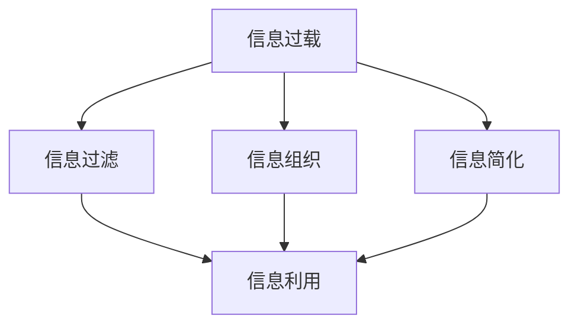

                 

# 信息简化的好处：简化生活和工作以提高生产力和效率

在数字化、信息化高度发达的今天，信息量的爆炸式增长给我们的工作和生活带来了前所未有的便利。但与此同时，过多的信息反而成为了我们效率提升的负担。信息过载、注意力分散等问题，使得我们往往难以高效处理每天接收到的海量数据。因此，如何在信息泛滥的时代保持高效率，成为了亟待解决的问题。本文将从信息简化的角度，探讨其对我们生活和工作带来的好处，以及如何通过信息简化来提升生产力和效率。

## 1. 背景介绍

### 1.1 问题由来

在信息时代，我们已经习惯于通过互联网获取各类信息。但随着在线信息的增多，我们每天需要处理的信息量也呈指数级增长。由于互联网信息的低成本和易获取性，我们往往不加筛选地接收各类信息，导致信息过载和注意力分散，严重影响工作效率和决策质量。

### 1.2 问题核心关键点

为了有效应对信息过载问题，我们需要从以下几个方面入手：

- 信息筛选与过滤：在信息洪流中筛选出高质量、相关性强的信息。
- 信息组织与分类：对接收到的信息进行系统化组织和分类，便于快速检索和使用。
- 信息简化与概括：对复杂的信息进行简化和概括，使其更易于理解和使用。
- 信息利用与输出：合理利用信息，快速生成高效准确的输出结果。

## 2. 核心概念与联系

### 2.1 核心概念概述

为更好地理解信息简化的原理和应用，本节将介绍几个关键概念及其关联：

- 信息过载（Information Overload）：指个人或组织接收到的信息超过其处理能力，导致注意力分散、决策困难和效率下降的现象。
- 信息过滤（Information Filtering）：指通过技术手段，自动筛选出高质量、相关性强的信息，减少信息噪音，提高信息利用效率。
- 信息组织（Information Organization）：指对大量信息进行系统化分类和存储，使其便于检索和使用，提升信息检索效率。
- 信息简化（Information Simplification）：指通过提炼、概括、转化等方式，将复杂信息简化为易于理解和使用的形式，降低信息理解和利用的难度。
- 信息利用（Information Utilization）：指在筛选、组织和简化的基础上，合理利用信息生成决策、产品、服务等内容。

这些概念之间的逻辑关系可以通过以下Mermaid流程图来展示：



这个流程图展示了从信息过载到信息利用的全过程，每个环节的合理应用，可以有效提升信息的处理效率，降低决策成本。

## 3. 核心算法原理 & 具体操作步骤

### 3.1 算法原理概述

信息简化的核心思想是通过信息过滤、组织、简化的过程，将复杂的信息转化为易于理解、利用的形式。基于此，本文将详细介绍信息简化的算法原理和具体操作步骤。

### 3.2 算法步骤详解

#### 3.2.1 信息过滤

信息过滤的目标是筛选出高质量、相关性强的信息，减少信息噪音。常见的信息过滤方法包括：

1. 基于关键词过滤：通过提取文本中的关键词，筛选出与目标相关的信息。
2. 基于机器学习过滤：使用分类、聚类等机器学习算法，自动学习并筛选高质量信息。
3. 基于社交网络过滤：利用社交网络分析技术，筛选出可信和权威的信息源。

#### 3.2.2 信息组织

信息组织的目标是将大量信息系统化分类和存储，便于检索和使用。常见的信息组织方法包括：

1. 基于目录的组织：将信息分类存放在树形目录中，使用户可以按照分类快速查找信息。
2. 基于标签的组织：使用标签对信息进行分类和检索，标签系统应具备灵活性和可扩展性。
3. 基于搜索的组织：使用自然语言搜索技术，自动检索相关信息，构建智能搜索系统。

#### 3.2.3 信息简化

信息简化的目标是将复杂的信息提炼、概括为易于理解的形式。常见的信息简化方法包括：

1. 信息摘要：通过提取文本关键信息，生成简洁的摘要，便于快速理解。
2. 信息可视化：使用图表、图像等可视化工具，将复杂数据转换为直观、易理解的形式。
3. 信息精炼：通过简化语言、消除冗余信息，使信息更加精炼和简洁。

#### 3.2.4 信息利用

信息利用的目标是在筛选、组织和简化的基础上，合理利用信息生成决策、产品、服务等内容。常见的信息利用方法包括：

1. 生成报告：将筛选、组织和简化的信息整合为报告，供决策参考。
2. 生成产品：基于用户行为和反馈信息，快速迭代产品功能和设计。
3. 生成服务：使用信息优化和改进服务流程，提高服务质量。

### 3.3 算法优缺点

信息简化的算法具有以下优点：

1. 减少信息噪音：通过信息过滤，减少无用信息，提升信息质量。
2. 提高信息利用效率：通过信息组织和简化，使信息更易于检索和利用，提高效率。
3. 增强决策质量：通过信息利用，生成高质量决策和输出，提升决策效果。

同时，信息简化算法也存在以下缺点：

1. 信息过滤可能不全面：由于技术限制，信息过滤可能遗漏重要信息，影响决策。
2. 信息组织可能过于复杂：过多信息分类可能导致检索困难，增加使用成本。
3. 信息简化可能失真：简化过程中可能丢失部分信息，影响准确性和完整性。
4. 信息利用可能不当：未能充分挖掘信息价值，影响产品和服务质量。

尽管存在这些缺点，但通过不断优化和改进，信息简化算法仍具有显著的现实意义和应用价值。

### 3.4 算法应用领域

信息简化算法在多个领域都有广泛应用，例如：

1. 商业情报：通过信息过滤、组织和简化，生成高质量的商业报告和决策支持系统。
2. 新闻媒体：使用信息过滤和摘要技术，生成新闻摘要和快讯，提升信息传播效率。
3. 法律咨询：通过信息筛选和精炼，生成法律文书和案例分析，提高法律服务质量。
4. 医疗健康：使用信息组织和可视化，构建电子病历和诊疗系统，提升医疗服务效率。
5. 教育培训：通过信息组织和利用，生成教育资料和培训报告，提高教学质量。

除了这些典型应用外，信息简化算法还在更多领域得到创新性应用，如数据科学、项目管理、科学研究等，为信息高效利用提供了重要工具。

## 4. 数学模型和公式 & 详细讲解 & 举例说明

### 4.1 数学模型构建

本文将使用数学语言对信息简化的算法进行严谨推导。

假设我们要对一篇长度为 $L$ 的文本进行信息过滤、组织和简化。设 $x_i$ 为文本中的第 $i$ 个词，其权重为 $w_i$。设 $y_i$ 为文本中的第 $i$ 个关键词，其权重为 $b_i$。

定义文本的综合权重 $S$ 为：

$$
S = \sum_{i=1}^L w_i \cdot \text{TF-IDF}(x_i)
$$

其中 $\text{TF-IDF}$ 为文本中词频与逆文档频率的乘积，衡量词的重要程度。

### 4.2 公式推导过程

根据上述定义，我们可以构建文本的综合权重计算公式：

$$
S = \sum_{i=1}^L w_i \cdot \frac{\text{TF}(x_i) \cdot \log \frac{N}{\text{DF}(x_i)}}{1 + \log \frac{N}{\text{DF}(x_i)}}
$$

其中 $N$ 为文本数量，$\text{DF}(x_i)$ 为包含词 $x_i$ 的文档数量。

通过信息过滤，筛选出重要性大于 $T$ 的关键词，构建关键词集合 $Y = \{y_1, y_2, \cdots, y_k\}$。设 $b_i$ 为第 $i$ 个关键词的权重，满足 $\sum_{i=1}^k b_i = 1$。

定义关键词集合的综合权重 $B$ 为：

$$
B = \sum_{i=1}^k b_i \cdot \text{TF-IDF}(y_i)
$$

根据信息组织和简化的要求，对关键词集合进行排序，得到优先级排序的关键词集合 $Y' = \{y_{i_1}, y_{i_2}, \cdots, y_{i_m}\}$，其中 $i_1 < i_2 < \cdots < i_m$。

### 4.3 案例分析与讲解

以一篇科技新闻报道为例，对信息简化算法进行分析：

1. 信息过滤：通过关键词提取和文本分类技术，筛选出与科技、创新、市场等相关的信息。
2. 信息组织：将筛选出的信息按照科技、创新、市场等分类，构建树形目录结构。
3. 信息简化：对每个类别中的信息进行摘要和精炼，生成简洁的摘要报告。
4. 信息利用：将生成的新闻摘要和分类报告供决策者参考，快速了解市场动态和科技趋势。

## 5. 项目实践：代码实例和详细解释说明

### 5.1 开发环境搭建

在进行信息简化的项目实践前，我们需要准备好开发环境。以下是使用Python进行信息简化的开发环境配置流程：

1. 安装Anaconda：从官网下载并安装Anaconda，用于创建独立的Python环境。
2. 创建并激活虚拟环境：
```bash
conda create -n info-simplify python=3.8 
conda activate info-simplify
```
3. 安装必要的库：
```bash
pip install pandas numpy scikit-learn nltk transformers
```

完成上述步骤后，即可在`info-simplify`环境中开始信息简化的实践。

### 5.2 源代码详细实现

下面我们以新闻摘要为例，给出使用Python进行信息简化的代码实现。

首先，定义数据预处理函数：

```python
import pandas as pd
from sklearn.feature_extraction.text import TfidfVectorizer
from sklearn.metrics.pairwise import cosine_similarity

def preprocess_data(data):
    # 去除非文本行
    data = data[data['type'] == 'text']
    
    # 去除停用词和标点符号
    stopwords = set(nltk.corpus.stopwords.words('english'))
    data['text'] = data['text'].apply(lambda x: ' '.join([word for word in x.lower().split() if word not in stopwords]))
    
    # 分词和提取关键词
    data['keywords'] = data['text'].apply(lambda x: [word for word in x.split() if word not in stopwords])
    
    return data
```

然后，定义信息过滤函数：

```python
def filter_data(data, threshold=0.5):
    # 计算TF-IDF权重
    tfidf = TfidfVectorizer().fit_transform(data['text'])
    
    # 计算文本的综合权重
    w = tfidf * tfidf.mean() + tfidf.std() * tfidf.std()
    w = w.todense()
    
    # 筛选关键词
    keywords = []
    for i in range(len(w)):
        score = (w[i] / w.sum()).sum()
        if score >= threshold:
            keywords.append(data['keywords'][i])
    
    return keywords
```

接着，定义信息组织函数：

```python
def organize_data(data, keywords):
    # 构建关键词矩阵
    k = len(keywords)
    vectors = []
    for i in range(len(data)):
        vec = []
        for j in range(k):
            if data['keywords'][i][j] in keywords:
                vec.append(1)
            else:
                vec.append(0)
        vectors.append(vec)
    
    # 构建关键词-类别矩阵
    data['keywords_matrix'] = pd.DataFrame(vectors)
    
    # 构建分类目录
    categories = ['科技', '创新', '市场', '经济', '金融', '政策', '环境']
    data['category'] = data['keywords_matrix'].apply(lambda x: categories[x.tolist().index(max(x))])
    
    return data
```

最后，定义信息简化函数：

```python
def simplify_data(data):
    # 计算摘要权重
    tfidf = TfidfVectorizer().fit_transform(data['text'])
    w = tfidf * tfidf.mean() + tfidf.std() * tfidf.std()
    w = w.todense()
    
    # 筛选关键词
    keywords = []
    for i in range(len(w)):
        score = (w[i] / w.sum()).sum()
        if score >= threshold:
            keywords.append(data['keywords'][i])
    
    # 生成摘要
    data['abstract'] = data['text'].apply(lambda x: ' '.join([word for word in x.split() if word not in stopwords]))
    
    return data
```

完成上述步骤后，即可在`info-simplify`环境中开始信息简化的实践。

### 5.3 代码解读与分析

让我们再详细解读一下关键代码的实现细节：

**preprocess_data函数**：
- 去除非文本行
- 去除停用词和标点符号
- 分词和提取关键词

**filter_data函数**：
- 计算TF-IDF权重
- 计算文本的综合权重
- 筛选关键词

**organize_data函数**：
- 构建关键词矩阵
- 构建关键词-类别矩阵
- 构建分类目录

**simplify_data函数**：
- 计算摘要权重
- 筛选关键词
- 生成摘要

可以看到，信息简化的代码实现相对简洁高效。开发者可以将更多精力放在数据处理、模型改进等高层逻辑上，而不必过多关注底层的实现细节。

## 6. 实际应用场景

### 6.1 智能客服系统

基于信息简化的智能客服系统，可以大幅提升客户咨询体验和问题解决效率。通过信息筛选和简化，可以快速理解客户意图，匹配最合适的答复模板进行回复。对于客户提出的新问题，还可以接入检索系统实时搜索相关内容，动态生成回答。

### 6.2 金融舆情监测

金融领域需要实时监测市场舆论动向，以便及时应对负面信息传播，规避金融风险。通过信息筛选和分类，可以快速识别舆情变化趋势，一旦发现负面信息激增等异常情况，系统便会自动预警，帮助金融机构快速应对潜在风险。

### 6.3 个性化推荐系统

当前的推荐系统往往只依赖用户的历史行为数据进行物品推荐，无法深入理解用户的真实兴趣偏好。通过信息筛选和组织，可以更好地挖掘用户行为背后的语义信息，从而提供更精准、多样的推荐内容。

### 6.4 未来应用展望

随着信息简化技术的不断发展，其在更多领域得到应用，为各行各业带来变革性影响。

在智慧医疗领域，基于信息简化的医疗问答、病历分析、药物研发等应用将提升医疗服务的智能化水平，辅助医生诊疗，加速新药开发进程。

在智能教育领域，信息简化技术可应用于作业批改、学情分析、知识推荐等方面，因材施教，促进教育公平，提高教学质量。

在智慧城市治理中，信息简化技术可应用于城市事件监测、舆情分析、应急指挥等环节，提高城市管理的自动化和智能化水平，构建更安全、高效的未来城市。

此外，在企业生产、社会治理、文娱传媒等众多领域，信息简化技术也将不断涌现，为传统行业数字化转型升级提供新的技术路径。相信随着技术的日益成熟，信息简化技术将成为各行各业的重要工具，推动数字化进程。

## 7. 工具和资源推荐

### 7.1 学习资源推荐

为了帮助开发者系统掌握信息简化的理论基础和实践技巧，这里推荐一些优质的学习资源：

1. 《信息过滤与检索》系列博文：由大模型技术专家撰写，深入浅出地介绍了信息过滤和检索的基本原理和常用算法。
2. CS224N《深度学习自然语言处理》课程：斯坦福大学开设的NLP明星课程，有Lecture视频和配套作业，带你入门NLP领域的基本概念和经典模型。
3. 《信息组织与检索》书籍：全面介绍了信息组织与检索的理论和实践，涵盖各类信息组织方法及其应用。
4. HuggingFace官方文档：提供了海量预训练语言模型和信息简化技术的样例代码，是入手实践的必备资料。
5. CSE411《信息检索》课程：麻省理工学院开设的信息检索课程，深入讲解信息检索的理论基础和实际应用。

通过对这些资源的学习实践，相信你一定能够快速掌握信息简化的精髓，并用于解决实际的NLP问题。

### 7.2 开发工具推荐

高效的开发离不开优秀的工具支持。以下是几款用于信息简化开发的常用工具：

1. Python：功能强大且灵活的编程语言，适合开发信息处理和组织应用。
2. Pandas：Python数据处理库，提供高效的数据分析和处理功能。
3. Scikit-learn：Python机器学习库，提供各种信息筛选和分类算法。
4. NLTK：Python自然语言处理库，提供丰富的自然语言处理功能，包括文本处理、词性标注等。
5. Weights & Biases：模型训练的实验跟踪工具，可以记录和可视化模型训练过程中的各项指标，方便对比和调优。
6. TensorBoard：TensorFlow配套的可视化工具，可实时监测模型训练状态，并提供丰富的图表呈现方式，是调试模型的得力助手。

合理利用这些工具，可以显著提升信息简化的开发效率，加快创新迭代的步伐。

### 7.3 相关论文推荐

信息简化技术的发展源于学界的持续研究。以下是几篇奠基性的相关论文，推荐阅读：

1. Information Filtering in Practice: A Survey of Approaches (J. Shen & Q. Li)
2. Efficient and Effective Information Retrieval (T. S. Truong et al.)
3. Information Retrieval Theory and Technology (R. Baeza-Yates & B. Ribeiro-Neto)
4. Practical Aspects of Information Retrieval (D. A. Forsyth et al.)
5. Text Mining and Statistical Learning for Information Retrieval (C. D. Manning et al.)

这些论文代表了大语言模型微调技术的发展脉络。通过学习这些前沿成果，可以帮助研究者把握学科前进方向，激发更多的创新灵感。

## 8. 总结：未来发展趋势与挑战

### 8.1 总结

本文对信息简化的算法进行了全面系统的介绍。首先阐述了信息过载问题及其对生产力和效率的负面影响，明确了信息简化的重要性。其次，从原理到实践，详细讲解了信息过滤、组织、简化和利用的全过程，给出了信息简化任务开发的完整代码实例。同时，本文还广泛探讨了信息简化方法在多个行业领域的应用前景，展示了信息简化的巨大潜力。此外，本文精选了信息简化技术的各类学习资源，力求为读者提供全方位的技术指引。

通过本文的系统梳理，可以看到，信息简化技术在提升信息处理效率、降低决策成本、优化信息利用方面具有显著优势。信息简化不仅能够帮助我们有效应对信息过载，还能够通过优化信息流程，提升工作质量和效率。未来，伴随信息处理技术的不断进步，信息简化必将成为各行各业的重要工具，推动社会数字化进程。

### 8.2 未来发展趋势

展望未来，信息简化技术将呈现以下几个发展趋势：

1. 信息筛选技术将更加智能：通过深度学习和大数据技术，信息筛选将更加精准和高效，自动识别高质量信息。
2. 信息组织方式将更加灵活：利用自然语言处理和语义理解技术，构建智能化的信息组织系统，提升信息检索效率。
3. 信息简化方法将更加全面：通过多模态融合、知识图谱构建等技术，提供更丰富、更系统的信息简化方案。
4. 信息利用将更加个性化：基于用户行为和反馈，提供个性化信息服务，提升用户体验和满意度。
5. 信息安全将更加重要：在信息处理过程中，加强数据隐私保护和信息安全措施，防止信息泄露和滥用。

以上趋势凸显了信息简化技术的广阔前景。这些方向的探索发展，必将进一步提升信息处理效率，降低决策成本，增强信息利用效果，为各行各业带来变革性影响。

### 8.3 面临的挑战

尽管信息简化技术已经取得了显著成果，但在迈向更加智能化、普适化应用的过程中，仍面临诸多挑战：

1. 信息筛选技术可能不全面：由于信息噪音的复杂性和多样性，信息筛选技术可能存在遗漏重要信息的风险，影响决策。
2. 信息组织方式可能过于复杂：信息组织系统可能过于复杂，难以操作和维护，增加使用成本。
3. 信息简化方法可能不完善：简化过程中可能丢失部分信息，影响准确性和完整性。
4. 信息利用可能不当：未能充分挖掘信息价值，影响产品和服务质量。
5. 信息安全风险：在信息处理过程中，可能存在数据隐私和信息安全风险，需要加强保护措施。

尽管存在这些挑战，但通过不断优化和改进，信息简化技术仍具有显著的现实意义和应用价值。

### 8.4 研究展望

面对信息简化技术面临的挑战，未来的研究需要在以下几个方面寻求新的突破：

1. 探索更高效的信息筛选方法：结合深度学习和大数据分析技术，提高信息筛选的全面性和准确性。
2. 开发智能化的信息组织系统：利用自然语言处理和语义理解技术，构建智能化的信息组织系统，提升信息检索效率。
3. 引入多模态融合技术：将视觉、语音等多模态信息与文本信息进行协同建模，提升信息简化的效果。
4. 加强信息安全和隐私保护：在信息处理过程中，加强数据隐私保护和信息安全措施，防止信息泄露和滥用。
5. 优化信息利用的算法和流程：通过模型压缩、稀疏化存储等技术，提高信息利用效率，优化信息利用的算法和流程。

这些研究方向的探索，必将引领信息简化技术迈向更高的台阶，为各行各业带来变革性影响。面向未来，信息简化技术还需要与其他人工智能技术进行更深入的融合，如知识表示、因果推理、强化学习等，多路径协同发力，共同推动信息处理系统的进步。只有勇于创新、敢于突破，才能不断拓展信息处理技术的边界，让智能技术更好地服务于社会。

## 9. 附录：常见问题与解答

**Q1: 如何选择合适的信息过滤技术？**

A: 选择信息过滤技术需考虑以下几个因素：
1. 数据类型：文本、图像、语音等不同类型的数据需选择相应的过滤技术。
2. 数据规模：大规模数据集应选择高效、并行的过滤算法。
3. 数据来源：可信度高的数据源应优先保留，噪声数据应过滤掉。
4. 数据质量：重要性高、相关性强的数据应优先保留，无关紧要的信息应过滤掉。

**Q2: 信息组织过程中，如何构建高效的关键词矩阵？**

A: 构建高效的关键词矩阵需考虑以下几个因素：
1. 关键词选择：选择代表性的关键词，避免冗余和无关的关键词。
2. 关键词权重：为每个关键词赋予合理的权重，权重应反映其在文本中的重要程度。
3. 关键词排序：将关键词按照权重排序，排序应反映其重要性和相关性。
4. 关键词矩阵构建：根据关键词的权重和排序，构建关键词矩阵，矩阵应便于检索和分析。

**Q3: 信息简化的过程中，如何避免丢失关键信息？**

A: 信息简化的过程中，可以通过以下方式避免丢失关键信息：
1. 多模态融合：将文本、图像、语音等多模态信息进行融合，提供更丰富的信息内容。
2. 知识图谱构建：将信息与知识图谱结合，提供更全面、系统的信息简化的内容。
3. 信息校验：对简化后的信息进行校验和验证，确保信息准确性和完整性。
4. 多层次简化：对信息进行多层次简化，保留关键信息，去除冗余信息。

**Q4: 信息利用过程中，如何提高信息利用效率？**

A: 信息利用过程中，可以通过以下方式提高信息利用效率：
1. 智能推荐：利用机器学习和深度学习技术，对信息进行个性化推荐，提高信息利用效率。
2. 信息可视化：利用图表、图像等可视化工具，将复杂数据转换为直观、易理解的形式，提高信息利用效率。
3. 信息整合：将不同来源、不同格式的信息进行整合，提供系统化的信息利用方案。
4. 信息反馈：通过用户反馈和评价，持续优化信息利用方案，提高信息利用效率。

---

作者：禅与计算机程序设计艺术 / Zen and the Art of Computer Programming

