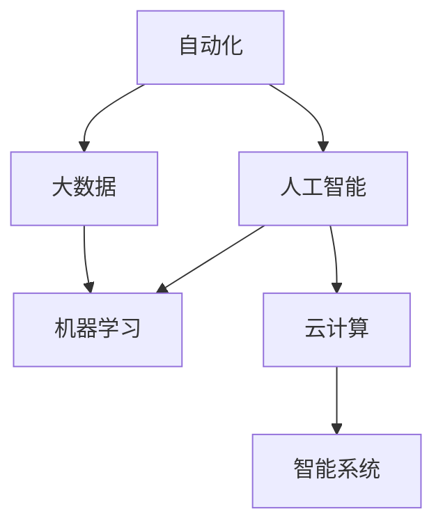

                 

# 信息简化的工具和自动化实践：利用技术简化你的生活和工作

> 关键词：自动化, 信息简化, 人工智能, 大数据, 机器学习, 云计算, 智能系统

## 1. 背景介绍

在当今信息化飞速发展的时代，我们每天都被大量的信息所包围，无论是工作还是生活中的各种事务，都变得越来越复杂和繁琐。为了提高效率，许多人都希望通过自动化和信息简化的工具来减少冗余工作，节省时间，提升生产力。而信息简化的工具和自动化实践，正是实现这一目标的关键。

### 1.1 问题由来
在现代社会，信息爆炸已成为不争的事实。人们每天面临的海量信息中，只有一小部分是有价值且需要重点关注的。然而，由于信息过载，很多人反而难以从海量信息中筛选出真正重要且对自己有用的信息。此外，繁琐的日常事务也占用了大量的时间和精力。因此，利用技术手段实现信息简化和自动化，成为了提高工作效率和生活质量的重要途径。

### 1.2 问题核心关键点
实现信息简化的工具和自动化实践，主要包括以下几个关键点：
- **自动化**：通过程序和算法实现工作流程的自动化，减少人工干预。
- **信息过滤**：筛选出重要信息，屏蔽无用数据。
- **数据整合**：将分散的数据进行整合，形成统一、易于理解的信息体系。
- **智能推荐**：根据用户行为和偏好，提供个性化的信息推荐。
- **决策支持**：基于数据分析，提供决策支持，帮助用户做出明智的选择。
- **智能交互**：通过自然语言处理和机器学习技术，实现智能的交互和沟通。

这些关键点共同构成了信息简化的工具和自动化实践的基础，使得技术能够帮助人们更好地管理信息、优化工作流程、提升生活质量。

## 2. 核心概念与联系

### 2.1 核心概念概述

为了更好地理解如何利用技术简化生活和工作的工具和实践，本节将介绍几个关键概念及其相互联系：

- **自动化**：利用计算机和软件系统，自动执行重复性、低价值的任务，释放人力用于更有创造性的工作。
- **人工智能(AI)**：通过算法和机器学习模型，使计算机具备类似于人类的智能和判断能力。
- **大数据**：海量数据存储和处理技术，为分析和决策提供数据支持。
- **机器学习(ML)**：通过数据训练模型，使机器具备预测和优化能力。
- **云计算**：基于互联网的计算服务，提供弹性、按需计算资源。
- **智能系统**：结合AI、大数据和云计算技术，实现自动化和智能化的信息处理和决策支持。

这些概念通过以下Mermaid流程图展示它们之间的联系：



从图中可以看到，自动化、人工智能、大数据、机器学习和云计算这些技术手段，共同构建了智能系统的框架。智能系统通过这些技术实现信息的简化、自动化处理和智能决策，最终提升人们的生活和工作效率。

## 3. 核心算法原理 & 具体操作步骤
### 3.1 算法原理概述

信息简化的工具和自动化实践，本质上是通过算法和模型的处理，将复杂的信息转化为简单、易于理解和操作的形式，并实现其自动化处理。其核心算法原理包括以下几个方面：

- **数据预处理**：对原始数据进行清洗、归一化、特征提取等预处理，以提高后续处理的效果。
- **信息过滤和筛选**：利用各种算法和模型，对数据进行筛选，提取出有用信息，屏蔽无用信息。
- **机器学习模型**：通过训练模型，自动学习和预测数据特征，实现信息分类、推荐和决策支持。
- **自然语言处理(NLP)**：利用算法和模型，实现对文本数据的理解、分析和生成，提升人机交互的智能化水平。
- **优化算法**：通过优化算法，如梯度下降、遗传算法等，不断调整模型参数，提升模型的准确性和效率。

### 3.2 算法步骤详解

基于核心算法原理，信息简化的工具和自动化实践可以概括为以下几个关键步骤：

**Step 1: 数据收集与预处理**
- 收集相关数据，并进行清洗、归一化、特征提取等预处理操作，确保数据质量。

**Step 2: 特征工程**
- 设计和实现特征工程，提取有用的特征，构建特征集合，为后续模型训练提供支持。

**Step 3: 模型训练与优化**
- 选择合适的机器学习模型，并对其进行训练，调整模型参数，优化模型性能。
- 应用正则化技术、对抗训练等手段，防止模型过拟合，提高泛化能力。

**Step 4: 模型部署与应用**
- 将训练好的模型部署到实际环境中，进行监控和优化。
- 利用自动化技术，实现模型的定期更新和优化。

**Step 5: 信息简化与自动化处理**
- 根据模型预测结果，对原始信息进行筛选、分类和整合。
- 实现自动化工作流程，将复杂的流程简化为简单的操作，提升工作效率。

### 3.3 算法优缺点

信息简化的工具和自动化实践具有以下优点：
- **提升效率**：自动化处理可以大大减少人工干预，提高工作效率。
- **降低成本**：减少人力成本和错误成本，提升业务效益。
- **提高决策质量**：基于数据的决策支持，提升决策的科学性和准确性。

同时，这些方法也存在一些局限性：
- **数据依赖性**：依赖高质量的数据输入，数据缺失或不准确会影响效果。
- **模型复杂性**：复杂模型训练和调优难度较大，需要专业知识和技术支持。
- **隐私和安全风险**：自动化处理可能涉及敏感数据，需要采取适当的隐私保护和安全措施。
- **技术门槛**：实现和维护自动化系统需要一定的技术门槛，需要专业人才支持。

尽管存在这些局限性，但总体而言，信息简化的工具和自动化实践在提高效率、降低成本和提升决策质量方面，仍然具有不可替代的价值。

### 3.4 算法应用领域

信息简化的工具和自动化实践，已经在多个领域得到了广泛应用：

- **企业管理**：自动化流程管理、财务报表生成、供应链优化等。
- **生产制造**：自动化生产调度、质量控制、设备维护等。
- **金融服务**：自动化交易执行、风险管理、客户服务等。
- **医疗健康**：自动化病历记录、诊断支持、患者管理等。
- **教育培训**：自动化课程设计、学生评估、在线学习等。
- **交通运输**：自动化路线规划、交通流量管理、智能驾驶等。

此外，这些技术和实践还在不断扩展，应用于更多新兴领域，如智能家居、智能城市、智能零售等，为各行各业带来变革性影响。

## 4. 数学模型和公式 & 详细讲解 & 举例说明

### 4.1 数学模型构建

为了更好地理解信息简化的工具和自动化实践，我们将以信息过滤和筛选为例，构建数学模型。

设原始数据集为 $D=\{x_1,x_2,\ldots,x_N\}$，其中 $x_i$ 表示第 $i$ 条数据。假设每条数据包含 $d$ 个特征，表示为 $x_i=[f_{i1},f_{i2},\ldots,f_{id}]$。

定义一个线性分类器 $h(x;\theta)$，其中 $\theta$ 为模型参数，表示为 $\theta=[w_1,w_2,\ldots,w_d,b]^T$。分类器的输出为 $h(x;\theta)=w_1f_{i1}+w_2f_{i2}+\ldots+w_df_{id}+b$。

### 4.2 公式推导过程

信息过滤和筛选的核心是构建一个能够区分有用信息和无用信息的分类器。以二分类问题为例，假设我们要将原始数据集 $D$ 分为两类 $y_i\in\{0,1\}$，其中 $y_i=1$ 表示数据 $x_i$ 为有用信息，$y_i=0$ 表示无用信息。

信息过滤和筛选的目标是最大化分类器的准确率，即：

$$
\max_{\theta} \frac{1}{N}\sum_{i=1}^N \mathbf{1}_{y_i=1}h(x_i;\theta)
$$

其中 $\mathbf{1}_{y_i=1}$ 为示性函数，当 $y_i=1$ 时为1，否则为0。

通过引入正则化项 $\frac{\lambda}{2}\sum_{i=1}^N \|w_i\|^2$，得到目标函数为：

$$
\max_{\theta} \frac{1}{N}\sum_{i=1}^N \mathbf{1}_{y_i=1}h(x_i;\theta) - \frac{\lambda}{2}\sum_{i=1}^N \|w_i\|^2
$$

使用梯度下降等优化算法，求解上述最优化问题，即可得到最优参数 $\theta^*$。

### 4.3 案例分析与讲解

下面以文本数据分类为例，展示信息过滤和筛选的具体实现过程。

假设我们要对一组文本数据进行分类，将含有特定关键词的文本标记为有用信息。首先，将文本数据转换为向量表示，使用词袋模型将每个文本表示为 $d$ 维向量 $x=[f_1,f_2,\ldots,f_d]^T$。其中 $f_i$ 表示文本中第 $i$ 个单词的出现次数。

然后，定义一个简单的线性分类器 $h(x;\theta)=w_1f_1+w_2f_2+\ldots+w_df_d+b$，其中 $\theta=[w_1,w_2,\ldots,w_d,b]^T$。

假设目标是将文本分类为有用（$y_i=1$）和无用（$y_i=0$）两类。通过训练数据集，可以计算出最优参数 $\theta^*$。在实际应用中，新的文本数据输入分类器，即可得到分类结果。

## 5. 项目实践：代码实例和详细解释说明

### 5.1 开发环境搭建

在进行项目实践前，我们需要准备好开发环境。以下是使用Python进行机器学习和NLP开发的常见环境配置流程：

1. 安装Anaconda：从官网下载并安装Anaconda，用于创建独立的Python环境。

2. 创建并激活虚拟环境：
```bash
conda create -n ml-env python=3.8 
conda activate ml-env
```

3. 安装必要的库：
```bash
conda install numpy pandas scikit-learn tensorflow tensorflow-gpu transformers
```

4. 安装各种依赖：
```bash
pip install pytorch torchvision torchaudio
```

5. 配置Jupyter Notebook：
```bash
jupyter lab --notebook-dir ~/.jupyter
```

完成上述步骤后，即可在`ml-env`环境中开始项目实践。

### 5.2 源代码详细实现

下面我们以文本分类任务为例，给出使用Transformers库进行信息筛选和分类的PyTorch代码实现。

首先，定义分类任务的数据处理函数：

```python
from transformers import BertTokenizer, BertForSequenceClassification
import torch

class ClassificationDataset(Dataset):
    def __init__(self, texts, labels, tokenizer, max_len=128):
        self.texts = texts
        self.labels = labels
        self.tokenizer = tokenizer
        self.max_len = max_len
        
    def __len__(self):
        return len(self.texts)
    
    def __getitem__(self, item):
        text = self.texts[item]
        label = self.labels[item]
        
        encoding = self.tokenizer(text, return_tensors='pt', max_length=self.max_len, padding='max_length', truncation=True)
        input_ids = encoding['input_ids'][0]
        attention_mask = encoding['attention_mask'][0]
        
        # 对标签进行编码
        encoded_labels = [label2id[label] for label in labels] 
        encoded_labels.extend([label2id['O']] * (self.max_len - len(encoded_labels)))
        labels = torch.tensor(encoded_labels, dtype=torch.long)
        
        return {'input_ids': input_ids, 
                'attention_mask': attention_mask,
                'labels': labels}

# 标签与id的映射
label2id = {'O': 0, 'useful': 1, 'useless': 2}
id2label = {v: k for k, v in label2id.items()}

# 创建dataset
tokenizer = BertTokenizer.from_pretrained('bert-base-cased')

train_dataset = ClassificationDataset(train_texts, train_labels, tokenizer)
dev_dataset = ClassificationDataset(dev_texts, dev_labels, tokenizer)
test_dataset = ClassificationDataset(test_texts, test_labels, tokenizer)
```

然后，定义模型和优化器：

```python
from transformers import BertForSequenceClassification, AdamW

model = BertForSequenceClassification.from_pretrained('bert-base-cased', num_labels=len(label2id))

optimizer = AdamW(model.parameters(), lr=2e-5)
```

接着，定义训练和评估函数：

```python
from torch.utils.data import DataLoader
from tqdm import tqdm
from sklearn.metrics import classification_report

device = torch.device('cuda') if torch.cuda.is_available() else torch.device('cpu')
model.to(device)

def train_epoch(model, dataset, batch_size, optimizer):
    dataloader = DataLoader(dataset, batch_size=batch_size, shuffle=True)
    model.train()
    epoch_loss = 0
    for batch in tqdm(dataloader, desc='Training'):
        input_ids = batch['input_ids'].to(device)
        attention_mask = batch['attention_mask'].to(device)
        labels = batch['labels'].to(device)
        model.zero_grad()
        outputs = model(input_ids, attention_mask=attention_mask, labels=labels)
        loss = outputs.loss
        epoch_loss += loss.item()
        loss.backward()
        optimizer.step()
    return epoch_loss / len(dataloader)

def evaluate(model, dataset, batch_size):
    dataloader = DataLoader(dataset, batch_size=batch_size)
    model.eval()
    preds, labels = [], []
    with torch.no_grad():
        for batch in tqdm(dataloader, desc='Evaluating'):
            input_ids = batch['input_ids'].to(device)
            attention_mask = batch['attention_mask'].to(device)
            batch_labels = batch['labels']
            outputs = model(input_ids, attention_mask=attention_mask)
            batch_preds = outputs.logits.argmax(dim=2).to('cpu').tolist()
            batch_labels = batch_labels.to('cpu').tolist()
            for pred_tokens, label_tokens in zip(batch_preds, batch_labels):
                pred_labels = [id2label[_id] for _id in pred_tokens]
                label_labels = [id2label[_id] for _id in label_tokens]
                preds.append(pred_labels[:len(label_labels)])
                labels.append(label_labels)
                
    print(classification_report(labels, preds))
```

最后，启动训练流程并在测试集上评估：

```python
epochs = 5
batch_size = 16

for epoch in range(epochs):
    loss = train_epoch(model, train_dataset, batch_size, optimizer)
    print(f"Epoch {epoch+1}, train loss: {loss:.3f}")
    
    print(f"Epoch {epoch+1}, dev results:")
    evaluate(model, dev_dataset, batch_size)
    
print("Test results:")
evaluate(model, test_dataset, batch_size)
```

以上就是使用PyTorch对BERT进行文本分类任务信息筛选和分类的完整代码实现。可以看到，得益于Transformers库的强大封装，我们可以用相对简洁的代码完成BERT模型的加载和训练。

### 5.3 代码解读与分析

让我们再详细解读一下关键代码的实现细节：

**ClassificationDataset类**：
- `__init__`方法：初始化文本、标签、分词器等关键组件。
- `__len__`方法：返回数据集的样本数量。
- `__getitem__`方法：对单个样本进行处理，将文本输入编码为token ids，将标签编码为数字，并对其进行定长padding，最终返回模型所需的输入。

**label2id和id2label字典**：
- 定义了标签与数字id之间的映射关系，用于将预测结果解码回真实的标签。

**训练和评估函数**：
- 使用PyTorch的DataLoader对数据集进行批次化加载，供模型训练和推理使用。
- 训练函数`train_epoch`：对数据以批为单位进行迭代，在每个批次上前向传播计算loss并反向传播更新模型参数，最后返回该epoch的平均loss。
- 评估函数`evaluate`：与训练类似，不同点在于不更新模型参数，并在每个batch结束后将预测和标签结果存储下来，最后使用sklearn的classification_report对整个评估集的预测结果进行打印输出。

**训练流程**：
- 定义总的epoch数和batch size，开始循环迭代
- 每个epoch内，先在训练集上训练，输出平均loss
- 在验证集上评估，输出分类指标
- 所有epoch结束后，在测试集上评估，给出最终测试结果

可以看到，PyTorch配合Transformers库使得BERT文本分类任务的代码实现变得简洁高效。开发者可以将更多精力放在数据处理、模型改进等高层逻辑上，而不必过多关注底层的实现细节。

当然，工业级的系统实现还需考虑更多因素，如模型的保存和部署、超参数的自动搜索、更灵活的任务适配层等。但核心的信息筛选和分类的过程基本与此类似。

## 6. 实际应用场景
### 6.1 智能客服系统

智能客服系统是大规模信息简化和自动化实践的典型应用之一。传统的客服系统依赖于大量人工操作，响应速度慢，且无法同时处理大量客户请求。通过信息筛选和分类，智能客服系统可以实现自动化处理，快速响应客户咨询，提升服务效率和质量。

在技术实现上，可以收集历史客户咨询记录，将问题和最佳答复构建成监督数据，在此基础上对预训练模型进行微调。微调后的模型能够自动理解用户意图，匹配最合适的答复模板进行回复。对于客户提出的新问题，还可以接入检索系统实时搜索相关内容，动态组织生成回答。如此构建的智能客服系统，能大幅提升客户咨询体验和问题解决效率。

### 6.2 金融舆情监测

金融机构需要实时监测市场舆论动向，以便及时应对负面信息传播，规避金融风险。传统的人工监测方式成本高、效率低，难以应对网络时代海量信息爆发的挑战。基于信息筛选和分类的技术，金融舆情监测系统可以自动过滤掉无关信息，提取关键舆情数据，提升信息处理效率和决策准确性。

具体而言，可以收集金融领域相关的新闻、报道、评论等文本数据，并对其进行主题标注和情感标注。在此基础上对预训练语言模型进行微调，使其能够自动判断文本属于何种主题，情感倾向是正面、中性还是负面。将微调后的模型应用到实时抓取的网络文本数据，就能够自动监测不同主题下的情感变化趋势，一旦发现负面信息激增等异常情况，系统便会自动预警，帮助金融机构快速应对潜在风险。

### 6.3 个性化推荐系统

当前的推荐系统往往只依赖用户的历史行为数据进行物品推荐，无法深入理解用户的真实兴趣偏好。基于信息筛选和分类的技术，个性化推荐系统可以更好地挖掘用户行为背后的语义信息，从而提供更精准、多样的推荐内容。

在实践中，可以收集用户浏览、点击、评论、分享等行为数据，提取和用户交互的物品标题、描述、标签等文本内容。将文本内容作为模型输入，用户的后续行为（如是否点击、购买等）作为监督信号，在此基础上微调预训练语言模型。微调后的模型能够从文本内容中准确把握用户的兴趣点。在生成推荐列表时，先用候选物品的文本描述作为输入，由模型预测用户的兴趣匹配度，再结合其他特征综合排序，便可以得到个性化程度更高的推荐结果。

### 6.4 未来应用展望

随着信息筛选和分类技术的不断发展，其在更多领域的应用前景将更加广阔。

在智慧医疗领域，基于信息简化和自动化的医疗问答、病历分析、药物研发等应用将提升医疗服务的智能化水平，辅助医生诊疗，加速新药开发进程。

在智能教育领域，信息筛选和分类技术可应用于作业批改、学情分析、知识推荐等方面，因材施教，促进教育公平，提高教学质量。

在智慧城市治理中，信息筛选和分类技术可应用于城市事件监测、舆情分析、应急指挥等环节，提高城市管理的自动化和智能化水平，构建更安全、高效的未来城市。

此外，在企业生产、社会治理、文娱传媒等众多领域，信息筛选和分类技术也将不断涌现，为各行各业带来变革性影响。

## 7. 工具和资源推荐
### 7.1 学习资源推荐

为了帮助开发者系统掌握信息简化的工具和自动化实践的理论基础和实践技巧，这里推荐一些优质的学习资源：

1. 《Python数据科学手册》：全面介绍了Python在数据科学中的应用，包含数据处理、机器学习、NLP等多个方面的内容。

2. 《深度学习入门：基于TensorFlow的实践》：介绍了TensorFlow的基础知识、架构和应用实践，适合初学者入门。

3. 《自然语言处理综论》：提供了自然语言处理领域的全面知识体系，涵盖了文本预处理、信息筛选、分类等多个主题。

4. 《机器学习实战》：通过实际项目案例，详细讲解了机器学习模型的构建和优化过程，适合实战练习。

5. 《PyTorch深度学习》：介绍了PyTorch的使用方法、架构和实践技巧，适合PyTorch用户。

6. 《TensorFlow官方文档》：提供了TensorFlow的全面资料和API文档，是学习TensorFlow的重要资源。

通过对这些资源的学习实践，相信你一定能够快速掌握信息筛选和分类的核心技术，并用于解决实际的NLP问题。
###  7.2 开发工具推荐

高效的开发离不开优秀的工具支持。以下是几款用于信息筛选和分类开发的常用工具：

1. Jupyter Notebook：提供了交互式的Python编程环境，支持代码运行和文档编辑，适合研究和开发。

2. PyCharm：一款专业的Python IDE，提供代码编写、调试、测试等功能，适合大型项目开发。

3. Visual Studio Code：支持多种编程语言，提供丰富的插件和扩展，适合灵活开发。

4. GitHub：提供代码版本控制和协作工具，方便团队开发和共享。

5. Jenkins：提供持续集成和自动化部署工具，适合生产环境应用。

6. Kaggle：提供数据科学竞赛平台，提供大量公开数据集和竞赛任务，适合学习和实践。

合理利用这些工具，可以显著提升信息筛选和分类任务的开发效率，加快创新迭代的步伐。

### 7.3 相关论文推荐

信息筛选和分类技术的不断发展，离不开学界的持续研究。以下是几篇奠基性的相关论文，推荐阅读：

1. "A Survey on Text Categorization by the Machine Learning Approach"：全面回顾了文本分类的历史和现状，提供了丰富的数据集和算法分析。

2. "Sentiment Analysis and Subjectivity Classification: A Tutorial"：介绍了情感分析和主题分类的算法和方法，提供了大量的实际案例和代码。

3. "Improving Language Understanding by Generative Pre-training"：提出了BERT模型，引入了预训练技术，提升了文本分类的效果。

4. "Attention is All You Need"：提出了Transformer结构，实现了基于自注意力机制的文本分类方法。

5. "Multi-Task Learning Using Prediction Task Alignment"：提出多任务学习技术，通过联合训练提升分类效果。

6. "A Survey on Multi-Label Classification for Texts"：全面回顾了文本多标签分类的历史和现状，提供了丰富的数据集和算法分析。

这些论文代表了大规模信息筛选和分类技术的发展脉络。通过学习这些前沿成果，可以帮助研究者把握学科前进方向，激发更多的创新灵感。

## 8. 总结：未来发展趋势与挑战
### 8.1 总结

本文对信息简化的工具和自动化实践进行了全面系统的介绍。首先阐述了信息筛选和分类的背景和意义，明确了信息筛选和分类技术在提高效率、降低成本和提升决策质量方面的独特价值。其次，从原理到实践，详细讲解了信息筛选和分类的数学模型和核心算法，给出了信息筛选和分类的完整代码实例。同时，本文还广泛探讨了信息筛选和分类技术在智能客服、金融舆情、个性化推荐等多个行业领域的应用前景，展示了信息筛选和分类技术的巨大潜力。此外，本文精选了信息筛选和分类技术的各类学习资源，力求为读者提供全方位的技术指引。

通过本文的系统梳理，可以看到，信息筛选和分类技术已经成为提高生产力和生活效率的重要手段。这些技术手段不仅能显著提升工作效率，还能帮助人们更好地管理和利用信息，提高决策质量和生命质量。信息筛选和分类技术的发展，正逐步改变我们的工作和生活方式。

### 8.2 未来发展趋势

展望未来，信息筛选和分类技术将呈现以下几个发展趋势：

1. **自动化程度提升**：随着机器学习和人工智能技术的发展，信息筛选和分类将更加自动化和智能化，能够更准确、更高效地处理海量信息。

2. **多模态融合**：结合视觉、听觉、文本等多种信息形式，提升信息处理的多维度和智能化水平。

3. **跨领域应用**：信息筛选和分类技术将应用于更多新兴领域，如智能医疗、智能制造、智能交通等，推动相关行业的数字化转型。

4. **实时处理**：实现信息筛选和分类的实时化处理，能够及时响应数据变化，提升决策支持的时效性和准确性。

5. **个性化推荐**：通过深度学习和大数据技术，实现更加精准、个性化的信息推荐，提升用户体验。

6. **知识图谱**：结合知识图谱等专家知识，提升信息筛选和分类的智能水平，提供更加全面的决策支持。

以上趋势凸显了信息筛选和分类技术的广阔前景。这些方向的探索发展，必将进一步提升信息处理和决策支持的智能化水平，为各行各业带来更大的变革。

### 8.3 面临的挑战

尽管信息筛选和分类技术已经取得了显著进展，但在迈向更加智能化和普及化的过程中，仍面临诸多挑战：

1. **数据质量**：信息筛选和分类依赖于高质量的数据输入，数据缺失或不准确会影响效果。如何获取和处理大规模、高质量的数据，是一个重要的研究方向。

2. **模型复杂性**：复杂的模型训练和调优难度较大，需要专业知识和技术支持。如何简化模型结构，提高模型的泛化能力和可解释性，是未来研究的重要方向。

3. **隐私和安全风险**：信息筛选和分类涉及敏感数据，如何保护数据隐私和安全，防止数据泄露和滥用，是一个亟待解决的问题。

4. **技术门槛**：实现和维护信息筛选和分类系统需要一定的技术门槛，如何降低门槛，推广应用，是未来需要解决的重要问题。

5. **伦理道德**：信息筛选和分类技术的应用可能引发伦理道德问题，如偏见、歧视等。如何在技术设计中引入伦理道德考量，避免负面影响，是未来研究的重要方向。

6. **计算资源**：信息筛选和分类需要大量的计算资源，如何降低计算成本，提高系统效率，是一个重要的研究方向。

这些挑战需要我们在技术、伦理、法律等多个层面进行综合考虑和解决。只有不断克服这些挑战，信息筛选和分类技术才能真正落地应用，为各行各业带来实质性的变革。

### 8.4 研究展望

面对信息筛选和分类技术面临的诸多挑战，未来的研究需要在以下几个方面寻求新的突破：

1. **数据增强与数据生成**：通过数据增强和生成技术，提升数据集的多样性和丰富度，降低数据采集和标注的成本。

2. **跨领域知识融合**：结合多领域知识，提升信息筛选和分类的智能水平，提供更加全面、准确的决策支持。

3. **模型压缩与优化**：通过模型压缩和优化技术，降低计算成本，提高信息筛选和分类的效率。

4. **可解释性与透明性**：提升模型的可解释性和透明性，帮助用户理解模型的决策过程，增强系统可信度。

5. **自动化与智能化**：通过自动化和智能化技术，提升信息筛选和分类的自动化水平，降低人工干预和维护成本。

6. **跨模态融合**：结合视觉、语音、文本等多种信息形式，提升信息处理的多维度和智能化水平。

7. **实时处理与动态更新**：实现信息筛选和分类的实时化处理，能够及时响应数据变化，提升决策支持的时效性和准确性。

这些研究方向将引领信息筛选和分类技术的不断进步，为各行各业带来更大的变革。面向未来，信息筛选和分类技术还需要与其他人工智能技术进行更深入的融合，如知识表示、因果推理、强化学习等，多路径协同发力，共同推动自然语言理解和智能交互系统的进步。只有勇于创新、敢于突破，才能不断拓展信息筛选和分类的边界，让智能技术更好地造福人类社会。

## 9. 附录：常见问题与解答

**Q1：信息筛选和分类技术是否适用于所有信息处理场景？**

A: 信息筛选和分类技术在大多数信息处理场景中都能取得不错的效果，特别是对于数据量较小的场景。但对于一些特定领域的场景，如医疗、法律等，仅仅依靠通用算法可能难以很好地适应。此时需要在特定领域数据上进一步训练模型，进行微调，才能获得理想效果。此外，对于一些需要时效性、个性化很强的场景，如对话、推荐等，信息筛选和分类方法也需要针对性的改进优化。

**Q2：信息筛选和分类过程中如何选择合适的模型？**

A: 选择合适的模型需要考虑多个因素，包括数据规模、问题复杂度、可解释性等。一般来说，如果数据量较小且问题较简单，可以选择简单的线性模型或决策树模型。如果数据量较大且问题复杂，可以选择深度学习模型，如卷积神经网络(CNN)、循环神经网络(RNN)、Transformer等。此外，还需要考虑模型的可解释性和训练成本，选择合适的模型。

**Q3：信息筛选和分类中常见的正则化技术有哪些？**

A: 常见的正则化技术包括L1正则、L2正则、Dropout、Early Stopping等。L1正则和L2正则用于防止模型过拟合，Dropout用于减少模型的复杂度，Early Stopping用于防止过拟合。在实际应用中，通常需要根据具体情况选择适当的正则化技术。

**Q4：信息筛选和分类中如何处理数据不平衡问题？**

A: 数据不平衡是信息筛选和分类中常见的问题，通常可以通过以下方法解决：
1. 过采样技术：增加少数类样本的数量，如SMOTE、ADASYN等。
2. 欠采样技术：减少多数类样本的数量，如随机欠采样、Clustered Oversampling等。
3. 类别权重调整：在损失函数中加入类别权重，使得模型更关注少数类样本。
4. 模型改写：使用特定的模型结构，如SMOTE-Boost、EasyEnsemble等。

这些方法可以结合使用，根据具体情况选择合适的策略。

**Q5：信息筛选和分类中如何评估模型性能？**

A: 信息筛选和分类的模型评估通常使用以下指标：
1. 准确率(Accuracy)：正确分类的样本数占总样本数的比例。
2. 精确率(Precision)：预测为正样本中实际为正样本的比例。
3. 召回率(Recall)：实际为正样本中被预测为正样本的比例。
4. F1分数(F1 Score)：精确率和召回率的调和平均值。
5. ROC曲线和AUC值：接收者操作特征曲线和曲线下的面积，用于评估模型的分类性能。

在实际应用中，通常需要根据具体情况选择合适的评估指标。

通过本文的系统梳理，可以看到，信息筛选和分类技术已经成为提高生产力和生活效率的重要手段。这些技术手段不仅能显著提升工作效率，还能帮助人们更好地管理和利用信息，提高决策质量和生命质量。信息筛选和分类技术的发展，正逐步改变我们的工作和生活方式。

---

作者：禅与计算机程序设计艺术 / Zen and the Art of Computer Programming

