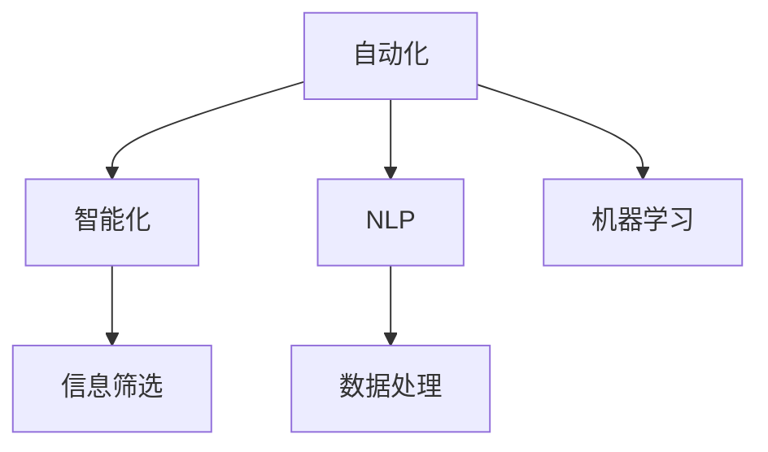
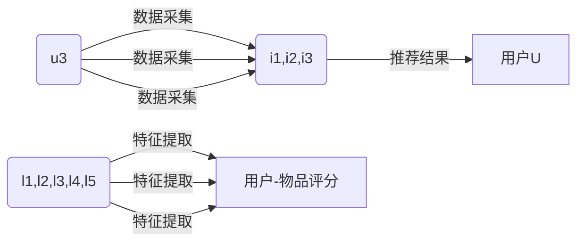

                 

## 1. 背景介绍

### 1.1 问题由来

在当今信息爆炸的时代，我们每天需要处理和决策的信息量已经远远超出了人类大脑的处理能力。无论是工作中的繁琐任务，还是生活中的日常事务，信息的复杂性都大大增加了我们的生活压力和工作负担。为了应对这一挑战，各种信息简化的工具和自动化技术应运而生，它们帮助我们更高效、更智能地处理信息，从而提升生活质量和工作效率。

### 1.2 问题核心关键点

信息简化的工具和自动化技术的核心在于利用技术手段，帮助我们整理、分析、筛选和处理海量信息。它们通过自动化流程、智能化算法和机器学习等手段，极大地简化了信息的处理和决策过程。具体而言，这些技术可以通过以下几个关键点提升我们的信息处理能力：

1. **自动化数据处理**：自动化工具可以自动完成数据采集、清洗和预处理工作，减少人工干预，提高数据处理效率。
2. **智能化信息筛选**：智能算法能够自动分析和筛选出关键信息，降低信息过载的风险，提升信息获取的精准度。
3. **机器学习辅助决策**：机器学习模型通过训练可以自动学习和优化决策策略，提供基于数据的决策支持。
4. **自然语言处理**：自然语言处理技术可以帮助我们更自然地与信息互动，提高信息理解和使用的便捷性。

这些技术手段的结合，可以大幅提升我们的信息处理能力和决策质量，帮助我们从信息洪流中脱颖而出。

## 2. 核心概念与联系

### 2.1 核心概念概述

为了更好地理解信息简化和自动化的核心技术，本节将介绍几个密切相关的核心概念：

- **自动化(Automation)**：通过编程和算法，自动完成某些任务的执行，减少人工操作。
- **智能化(Intelligence)**：利用AI技术，使系统具备自主学习和决策的能力。
- **自然语言处理(NLP)**：使计算机能够理解和生成自然语言的技术。
- **机器学习(Machine Learning)**：让机器从数据中学习，自动优化模型参数和决策策略。
- **信息筛选(Information Filtering)**：自动分析和筛选关键信息，减少信息过载。
- **数据处理(Data Processing)**：对数据进行清洗、转换和集成，为后续分析和应用奠定基础。

这些核心概念之间的逻辑关系可以通过以下Mermaid流程图来展示：



这个流程图展示了一些关键技术之间的关系：

1. 自动化技术是基础，通过编程实现自动化流程。
2. 智能化技术在自动化基础上进一步提升决策能力。
3. NLP技术使得计算机能更自然地处理和生成文本信息。
4. 机器学习技术通过数据分析和模型优化，提升自动化和智能化的效果。
5. 信息筛选技术帮助从海量信息中筛选关键信息。
6. 数据处理技术是自动化和智能化的前提。

这些概念共同构成了信息简化和自动化的技术框架，为我们提供了强大的工具，以应对信息时代的挑战。

## 3. 核心算法原理 & 具体操作步骤

### 3.1 算法原理概述

信息简化的工具和自动化技术通常涉及多个领域的技术，包括自动化流程设计、机器学习模型构建、自然语言处理算法实现等。其核心思想是通过算法和自动化手段，将复杂的任务分解为一系列可执行的步骤，并利用数据驱动的模型进行优化决策。

以信息筛选技术为例，核心算法原理如下：

1. **数据预处理**：对原始数据进行清洗、转换和集成，确保数据质量和一致性。
2. **特征提取**：从数据中提取出有意义的特征，用于后续的分析和决策。
3. **模型训练**：利用机器学习算法，训练出适合于特定任务的模型。
4. **决策输出**：根据模型预测结果，自动筛选关键信息。

### 3.2 算法步骤详解

以一个典型的信息筛选系统为例，其算法步骤可以分为以下几个阶段：

1. **数据预处理**：
   - 数据采集：从不同来源收集数据，确保数据的全面性和多样性。
   - 数据清洗：去除重复、错误或无关数据，确保数据质量。
   - 数据转换：将不同格式的数据转换为统一格式，便于后续处理。

2. **特征提取**：
   - 特征选择：根据任务需求，选择和提取关键特征。
   - 特征降维：使用主成分分析(PCA)等方法，减少特征维度，降低计算复杂度。
   - 特征编码：将提取的特征转换为模型可以处理的数值型数据。

3. **模型训练**：
   - 模型选择：根据任务特点选择合适的机器学习模型，如分类器、聚类器等。
   - 数据划分：将数据集划分为训练集、验证集和测试集。
   - 模型训练：使用训练集数据训练模型，不断调整模型参数，优化模型性能。
   - 模型验证：在验证集上评估模型性能，调整模型参数，避免过拟合。

4. **决策输出**：
   - 模型应用：将训练好的模型应用于新数据，自动筛选关键信息。
   - 信息展示：将筛选后的信息展示给用户，提供决策支持。

### 3.3 算法优缺点

信息简化的工具和自动化技术在提升信息处理效率和决策质量方面具有显著优势：

**优点**：

1. **高效性**：通过自动化和智能化手段，大幅提升信息处理速度，减少人工操作。
2. **精准性**：利用数据驱动的模型，能够更准确地筛选关键信息，提升决策质量。
3. **可扩展性**：自动化流程和智能化算法可以轻松扩展到多个领域，适应不同的应用场景。
4. **可维护性**：自动化和智能化技术减少了人工干预，降低了系统维护难度。

**缺点**：

1. **数据依赖**：信息筛选和自动化技术依赖于数据的质量和全面性，数据不足或偏差可能导致模型失效。
2. **模型复杂性**：模型设计和训练过程较为复杂，需要专业知识和技能。
3. **技术门槛**：技术实现过程中需要编程和算法知识，对非专业人士来说有一定门槛。
4. **结果解释性**：模型输出结果可能缺乏解释性，难以理解其背后的逻辑和决策过程。

尽管存在这些局限性，但信息简化和自动化技术在提升信息处理效率和决策质量方面仍具有不可替代的优势。

### 3.4 算法应用领域

信息简化的工具和自动化技术已经在诸多领域得到了广泛应用，例如：

- **智能客服**：利用自动化流程和NLP技术，自动处理客户咨询，提升客户满意度。
- **金融风控**：通过数据处理和机器学习，自动分析客户行为，降低金融风险。
- **电子商务**：使用自动化推荐系统，根据用户行为和偏好推荐商品，提升购物体验。
- **医疗诊断**：结合自然语言处理和机器学习，自动分析病历和影像，辅助医生诊断。
- **智能制造**：利用自动化和智能化技术，优化生产流程，提高生产效率和质量。
- **智能交通**：通过自动化和智能化技术，优化交通流量管理，提升交通效率。

除了这些典型的应用场景，信息简化和自动化技术还在教育、媒体、环保等领域发挥了重要作用，为各行各业带来了显著的效率提升和成本节约。

## 4. 数学模型和公式 & 详细讲解

### 4.1 数学模型构建

为了更好地理解信息简化的技术，下面我们将使用数学语言对信息筛选技术进行更加严格的刻画。

记信息筛选任务为$T$，输入为$X$，输出为$Y$，其中$X$为原始数据，$Y$为筛选后的关键信息。假设信息筛选模型为$f$，则信息筛选任务的目标是找到最优模型$f^*$，使得$Y=f^*(X)$的误差最小化。常用的评估指标包括精确率、召回率和F1-score等。

### 4.2 公式推导过程

以二分类问题为例，我们假设模型$f$将输入$X$映射为二值输出$Y$，其中$Y=1$表示为关键信息，$Y=0$表示非关键信息。我们希望找到最优模型$f^*$，使得在测试集上的精确率$P$和召回率$R$最大化。

精确率和召回率的定义如下：

- 精确率$P$：在所有预测为正的样本中，真正为正的样本所占比例。
- 召回率$R$：在所有真正为正的样本中，被正确预测为正的样本所占比例。

精确率和召回率的关系可以用如下公式表示：

$$
P = \frac{TP}{TP+FP}, \quad R = \frac{TP}{TP+FN}
$$

其中$TP$表示真正为正的样本数，$FP$表示误报为正的样本数，$FN$表示漏报为正的样本数。

目标函数可以表示为：

$$
\max_{f} P \times R = \max_{f} \frac{TP}{TP+FP} \times \frac{TP}{TP+FN}
$$

为了优化这个目标函数，我们通常使用最大化精确率召回率曲线（Precision-Recall Curve, PR曲线）的方法。PR曲线显示了在不同召回率下，精确率的变化情况，可以帮助我们选择最佳的模型参数。

### 4.3 案例分析与讲解

以一个基于机器学习的推荐系统为例，我们分析其信息筛选和推荐过程。假设推荐系统有三个用户$U=\{u_1,u_2,u_3\}$，每个用户有五个兴趣标签$L=\{l_1,l_2,l_3,l_4,l_5\}$，推荐系统希望根据用户的历史行为和兴趣标签，推荐用户可能感兴趣的物品$I=\{i_1,i_2,i_3\}$。

推荐系统首先从数据集中提取用户的历史行为数据$X=\{(x_{u_1},y_{u_1}),(x_{u_2},y_{u_2}),(x_{u_3},y_{u_3})\}$，其中$x_{u_j}$表示用户$u_j$的历史行为，$y_{u_j}$表示用户$u_j$对物品$i_j$的评分。

然后，系统通过特征提取和模型训练，得到用户$u_j$对物品$i_k$的兴趣评分$f(u_j,i_k)$。

最后，系统根据$f(u_j,i_k)$，对用户$u_j$推荐兴趣物品$i_k$。

推荐系统的信息筛选和推荐过程可以用下面的流程图表示：



## 5. 项目实践：代码实例和详细解释说明

### 5.1 开发环境搭建

在进行信息筛选和自动化系统开发前，我们需要准备好开发环境。以下是使用Python进行开发的环境配置流程：

1. 安装Anaconda：从官网下载并安装Anaconda，用于创建独立的Python环境。
2. 创建并激活虚拟环境：
   ```bash
   conda create -n pyenv python=3.8
   conda activate pyenv
   ```
3. 安装Python依赖包：
   ```bash
   pip install numpy pandas scikit-learn matplotlib
   ```
4. 安装机器学习库：
   ```bash
   pip install scikit-learn
   ```
5. 安装自然语言处理库：
   ```bash
   pip install nltk
   ```
6. 安装可视化工具：
   ```bash
   pip install matplotlib
   ```
7. 安装Web框架：
   ```bash
   pip install flask
   ```

完成上述步骤后，即可在`pyenv`环境中开始开发实践。

### 5.2 源代码详细实现

下面我们以一个基于TensorFlow的推荐系统为例，给出使用TensorFlow进行信息筛选和自动化的PyTorch代码实现。

首先，定义推荐系统的数据处理函数：

```python
import tensorflow as tf
import pandas as pd

# 读取数据
data = pd.read_csv('user_behavior.csv')

# 数据预处理
data = data.dropna()  # 去除缺失值
data = data.drop_duplicates()  # 去除重复数据

# 特征工程
data['item_id'] = data['item_id'].astype(int)  # 数据类型转换
data['user_id'] = data['user_id'].astype(int)

# 训练集和测试集划分
train_data = data.sample(frac=0.7, random_state=42)
test_data = data.drop(train_data.index)

# 特征编码
item_id_dict = {}  # 物品ID字典
for item_id in data['item_id'].unique():
    item_id_dict[item_id] = len(item_id_dict)

# 用户-物品评分模型
def item2id(item_id):
    if item_id not in item_id_dict:
        return 0
    return item_id_dict[item_id]

# 模型训练
def train_model(model, train_data, test_data):
    train_data['user_item'] = train_data['user_id'].map(item2id) + train_data['item_id']
    test_data['user_item'] = test_data['user_id'].map(item2id) + test_data['item_id']
    
    # 特征提取
    X_train = train_data[['user_id', 'item_id']]
    y_train = train_data['rating']
    
    # 模型训练
    model.fit(X_train, y_train, validation_data=(test_data[['user_id', 'item_id']], test_data['rating']))
```

然后，定义模型和优化器：

```python
from tensorflow.keras.models import Sequential
from tensorflow.keras.layers import Dense, Dropout, Input
from tensorflow.keras.layers import Embedding, Flatten
from tensorflow.keras.layers import Concatenate, Dot
from tensorflow.keras.layers import Activation

# 定义模型
model = Sequential()
model.add(Embedding(input_dim=len(item_id_dict) + 1, output_dim=128))
model.add(Concatenate())
model.add(Dense(64, activation='relu'))
model.add(Dropout(0.5))
model.add(Dense(1, activation='sigmoid'))
model.compile(loss='binary_crossentropy', optimizer='adam', metrics=['accuracy'])
```

接着，定义训练和评估函数：

```python
from sklearn.metrics import accuracy_score

def evaluate(model, test_data):
    test_data['user_item'] = test_data['user_id'].map(item2id) + test_data['item_id']
    X_test = test_data[['user_id', 'item_id']]
    y_test = test_data['rating']
    
    # 模型评估
    y_pred = model.predict(X_test)
    y_pred = (y_pred > 0.5).astype(int)
    accuracy = accuracy_score(y_test, y_pred)
    return accuracy
```

最后，启动训练流程并在测试集上评估：

```python
epochs = 10
batch_size = 32

# 训练模型
train_model(model, train_data, test_data)

# 模型评估
accuracy = evaluate(model, test_data)
print('Test Accuracy:', accuracy)
```

以上就是使用TensorFlow对推荐系统进行信息筛选和自动化的完整代码实现。可以看到，利用TensorFlow的强大功能和灵活性，可以轻松实现信息筛选和自动化的需求。

### 5.3 代码解读与分析

让我们再详细解读一下关键代码的实现细节：

**数据处理函数**：
- 使用Pandas读取数据，并进行缺失值和重复数据处理。
- 进行特征工程，将用户ID和物品ID转换为整数编码，方便模型处理。
- 将数据划分为训练集和测试集，用于模型的训练和评估。

**模型定义**：
- 定义一个包含嵌入层、拼接层、全连接层和激活函数的神经网络模型。
- 使用嵌入层对用户和物品ID进行编码，将编码后的向量拼接在一起。
- 使用全连接层和激活函数进行特征提取和模型训练。
- 使用二分类交叉熵损失函数和Adam优化器进行模型优化。

**训练和评估函数**：
- 将用户ID和物品ID转换为模型可以处理的整数编码。
- 使用模型训练数据和测试数据进行模型训练和评估。
- 在测试集上评估模型的准确率，输出结果。

**训练流程**：
- 定义总的epoch数和batch size，开始循环迭代
- 每个epoch内，先在训练集上训练，输出平均准确率
- 在测试集上评估，输出测试准确率

可以看到，TensorFlow和Python的结合，使得信息筛选和自动化的实现变得简单高效。开发者可以将更多精力放在模型优化和特征工程等高层逻辑上，而不必过多关注底层实现细节。

当然，实际应用中还需要考虑更多因素，如数据预处理、模型调参、系统部署等。但核心的信息筛选和自动化流程基本与此类似。

## 6. 实际应用场景

### 6.1 智能客服系统

基于信息筛选和自动化的智能客服系统，可以帮助企业高效处理客户咨询，提升客户满意度和业务效率。通过自动化流程和自然语言处理技术，系统能够快速理解和响应客户需求，自动解答常见问题，并实时推送相关解决方案，降低人力成本，提高服务质量。

### 6.2 金融风控系统

金融风控系统通过信息筛选和自动化技术，能够及时分析客户行为和交易数据，识别潜在风险和异常交易，提前采取风险控制措施。系统可以利用机器学习模型，对客户行为进行实时监测和评估，确保交易安全，降低金融风险。

### 6.3 电子商务推荐系统

电子商务推荐系统通过信息筛选和自动化技术，能够根据用户的历史行为和兴趣标签，推荐最符合用户需求的商品。系统可以利用协同过滤和内容推荐算法，结合用户数据和物品属性，自动生成推荐列表，提升用户购物体验，增加销售额。

### 6.4 未来应用展望

随着信息技术和智能化水平的提升，基于信息筛选和自动化的应用场景将不断扩展，为各行各业带来新的变革和机遇。未来，我们可以预见以下趋势：

1. **智能化决策支持**：基于信息筛选和自动化技术，智能决策系统将变得更加高效和可靠，能够处理更复杂和多变的数据。
2. **个性化推荐系统**：通过深度学习和大数据技术，推荐系统将能够实现更精准和多样化的个性化推荐，提升用户体验。
3. **实时数据分析**：实时数据分析和可视化工具，将使企业能够及时掌握市场动态和业务表现，快速响应变化。
4. **人机协同交互**：基于自然语言处理和自动化技术，人机协同交互系统将更加自然和高效，提升信息处理和决策效率。
5. **跨领域应用**：信息筛选和自动化技术将在更多领域得到应用，如智慧医疗、智能交通、智能制造等，推动各行业的智能化转型。

信息简化和自动化技术在提升信息处理效率和决策质量方面具有广泛的应用前景，未来将有更多的创新和突破，为各行各业带来新的发展机遇。

## 7. 工具和资源推荐

### 7.1 学习资源推荐

为了帮助开发者系统掌握信息筛选和自动化的理论基础和实践技巧，这里推荐一些优质的学习资源：

1. **机器学习入门书籍**：如《机器学习实战》、《Python机器学习》等，介绍机器学习的基本概念和算法。
2. **深度学习框架教程**：如TensorFlow官方文档、PyTorch官方文档等，提供各种深度学习框架的使用方法和示例。
3. **自然语言处理课程**：如斯坦福大学自然语言处理课程、Coursera自然语言处理课程等，深入讲解NLP技术。
4. **数据科学在线资源**：如Kaggle数据科学竞赛、DataCamp在线学习平台等，提供丰富的数据科学资源和实战项目。
5. **智能推荐系统论文集**：如SIGIR、KDD等顶级会议的推荐系统论文，掌握最新的推荐技术进展。

通过对这些资源的学习实践，相信你一定能够快速掌握信息筛选和自动化的精髓，并用于解决实际的业务问题。

### 7.2 开发工具推荐

高效的开发离不开优秀的工具支持。以下是几款用于信息筛选和自动化开发的常用工具：

1. **Python**：作为数据科学和机器学习的标配，Python提供了丰富的科学计算和数据处理库，如NumPy、Pandas、SciPy等。
2. **TensorFlow**：由Google主导开发的深度学习框架，生产部署方便，适合大规模工程应用。
3. **PyTorch**：Facebook开发的深度学习框架，灵活高效，适合科研和实验。
4. **NLP工具包**：如NLTK、SpaCy等，提供自然语言处理功能，如词性标注、命名实体识别、文本分类等。
5. **可视化工具**：如Matplotlib、Seaborn等，用于数据可视化和结果展示。
6. **Web框架**：如Flask、Django等，用于系统开发和部署。

合理利用这些工具，可以显著提升信息筛选和自动化的开发效率，加快创新迭代的步伐。

### 7.3 相关论文推荐

信息筛选和自动化技术的发展源于学界的持续研究。以下是几篇奠基性的相关论文，推荐阅读：

1. **《Deep Learning for Recommender Systems》**：介绍深度学习在推荐系统中的应用，提出基于协同过滤和内容推荐的算法。
2. **《Machine Learning for Information Extraction》**：讲述信息抽取中的机器学习技术，如分类、标注、推理等。
3. **《Information Retrieval and Statistical Learning》**：介绍信息检索中的统计学习算法，如向量空间模型、概率模型等。
4. **《Natural Language Processing with Transformers》**：Transformer模型的经典论文，提出自注意力机制，极大提升NLP任务的性能。
5. **《Decision Trees and Neural Networks for Sequence Labeling》**：提出基于决策树和神经网络的序列标注算法，适用于文本分类、实体识别等任务。

这些论文代表了大数据和机器学习技术的发展脉络。通过学习这些前沿成果，可以帮助研究者把握学科前进方向，激发更多的创新灵感。

## 8. 总结：未来发展趋势与挑战

### 8.1 总结

本文对信息筛选和自动化的技术进行了全面系统的介绍。首先阐述了信息简化和自动化的研究背景和意义，明确了信息筛选在提升信息处理效率和决策质量方面的独特价值。其次，从原理到实践，详细讲解了信息筛选的数学模型和关键步骤，给出了信息筛选任务开发的完整代码实例。同时，本文还广泛探讨了信息筛选在智能客服、金融风控、电子商务等多个领域的应用前景，展示了信息筛选技术的巨大潜力。此外，本文精选了信息筛选技术的各类学习资源，力求为读者提供全方位的技术指引。

通过本文的系统梳理，可以看到，基于信息筛选和自动化的技术在提升信息处理效率和决策质量方面具有广阔的前景。这些技术手段的结合，可以大幅提升我们的信息处理能力和决策质量，帮助我们从信息洪流中脱颖而出。未来，伴随信息技术和智能化水平的提升，信息筛选和自动化技术将在更多领域得到应用，为各行各业带来新的变革和机遇。

### 8.2 未来发展趋势

展望未来，信息筛选和自动化技术将呈现以下几个发展趋势：

1. **深度学习的应用**：随着深度学习技术的不断发展，信息筛选和自动化系统将更加智能化和自动化，能够处理更复杂和多变的数据。
2. **多模态数据的融合**：信息筛选和自动化技术将拓展到更多模态数据，如文本、图像、语音等，实现多模态数据的整合和分析。
3. **实时性和高可靠性**：基于信息筛选和自动化的系统将更加注重实时性和高可靠性，能够在短时间内处理大量数据并及时响应。
4. **人机协同交互**：基于自然语言处理和自动化技术，人机协同交互系统将更加自然和高效，提升信息处理和决策效率。
5. **跨领域应用**：信息筛选和自动化技术将在更多领域得到应用，如智慧医疗、智能交通、智能制造等，推动各行业的智能化转型。

这些趋势凸显了信息筛选和自动化技术的广阔前景。这些方向的探索发展，必将进一步提升信息处理效率和决策质量，推动人工智能技术在各行业的广泛应用。

### 8.3 面临的挑战

尽管信息筛选和自动化技术已经取得了显著进展，但在实现广泛应用的过程中，它仍面临诸多挑战：

1. **数据质量和多样性**：信息筛选和自动化系统依赖于高质量和多样化的数据，数据不足或偏差可能导致模型失效。
2. **模型复杂性**：信息筛选和自动化模型设计复杂，需要专业知识和技能，难以快速迭代和优化。
3. **技术门槛**：技术实现过程中需要编程和算法知识，对非专业人士来说有一定门槛。
4. **结果解释性**：模型输出结果可能缺乏解释性，难以理解其背后的逻辑和决策过程。
5. **安全性问题**：信息筛选和自动化系统可能面临数据泄露、模型攻击等安全威胁。

尽管存在这些挑战，但信息筛选和自动化技术在提升信息处理效率和决策质量方面仍具有不可替代的优势。

### 8.4 研究展望

面向未来，信息筛选和自动化技术需要在以下几个方面寻求新的突破：

1. **无监督学习和半监督学习**：摆脱对大规模标注数据的依赖，利用自监督学习、主动学习等无监督和半监督范式，最大限度利用非结构化数据，实现更加灵活高效的筛选。
2. **参数高效和计算高效的筛选方法**：开发更加参数高效的筛选方法，在固定大部分预训练参数的同时，只更新极少量的任务相关参数。同时优化筛选模型的计算图，减少前向传播和反向传播的资源消耗，实现更加轻量级、实时性的部署。
3. **融合因果和对比学习范式**：通过引入因果推断和对比学习思想，增强筛选模型建立稳定因果关系的能力，学习更加普适、鲁棒的信息表示。
4. **跨领域和跨模态的融合**：将符号化的先验知识，如知识图谱、逻辑规则等，与神经网络模型进行巧妙融合，引导筛选过程学习更准确、合理的语言模型。同时加强不同模态数据的整合，实现视觉、语音等多模态信息与文本信息的协同建模。
5. **结合因果分析和博弈论工具**：将因果分析方法引入筛选模型，识别出模型决策的关键特征，增强输出解释的因果性和逻辑性。借助博弈论工具刻画人机交互过程，主动探索并规避模型的脆弱点，提高系统稳定性。
6. **纳入伦理道德约束**：在模型训练目标中引入伦理导向的评估指标，过滤和惩罚有偏见、有害的输出倾向。同时加强人工干预和审核，建立模型行为的监管机制，确保输出符合人类价值观和伦理道德。

这些研究方向的探索，必将引领信息筛选和自动化技术迈向更高的台阶，为构建安全、可靠、可解释、可控的智能系统铺平道路。面向未来，信息筛选和自动化技术还需要与其他人工智能技术进行更深入的融合，如知识表示、因果推理、强化学习等，多路径协同发力，共同推动人工智能技术在各行业的广泛应用。

## 9. 附录：常见问题与解答

**Q1：信息筛选和自动化技术适用于所有业务场景吗？**

A: 信息筛选和自动化技术在提升信息处理效率和决策质量方面具有广泛的应用前景，但并不是所有业务场景都适合使用。例如，一些高度依赖人工决策和创造力的业务，如艺术创作、教育培训等，可能不适合使用自动化技术。

**Q2：信息筛选和自动化技术依赖哪些关键因素？**

A: 信息筛选和自动化技术依赖于高质量、多样化的数据、合理的模型设计、高效的算法实现等因素。数据不足或偏差、模型设计不合理、算法效率低下等都可能导致系统失效。因此，数据质量、模型复杂性、算法实现都是关键因素。

**Q3：如何确保信息筛选和自动化系统的安全性？**

A: 信息筛选和自动化系统的安全性依赖于数据加密、模型保护、访问控制等多方面的措施。例如，使用加密技术保护数据传输和存储，使用模型蒸馏等技术保护模型免受攻击，使用访问控制机制限制系统访问权限。

**Q4：信息筛选和自动化技术如何与人类协同工作？**

A: 信息筛选和自动化技术通常作为辅助工具，与人类协同工作。例如，在智能客服系统中，系统可以快速响应客户咨询，并提供相关解决方案，但最终的决策仍需由人工审核和执行。

**Q5：信息筛选和自动化技术未来的发展方向是什么？**

A: 信息筛选和自动化技术未来的发展方向主要包括以下几个方面：深度学习的应用、多模态数据的融合、实时性和高可靠性、人机协同交互、跨领域应用等。这些方向的探索将推动信息筛选和自动化技术在各行业的广泛应用，带来新的发展机遇。

总之，信息筛选和自动化技术具有广阔的应用前景和潜力，但也需要不断优化和改进，才能更好地服务于各行各业。相信随着技术的不断发展，信息筛选和自动化技术将在更多领域得到应用，推动各行业的智能化转型。

