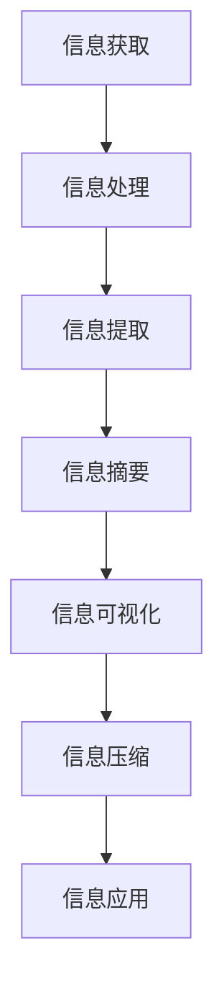

                 

# 信息简化的艺术与实践：在混乱中找到简单，在复杂中建立秩序

## 1. 背景介绍

### 1.1 问题由来

在当今信息爆炸的时代，我们每天被各种各样的数据和信息所淹没。无论是社交媒体上的海量消息、新闻网站上的海量文章、还是电子设备中的海量文件，信息的过载和混乱已经成为普遍现象。如何在这纷繁复杂的信息海洋中找到有用的信息，并将其进行有效的处理，是摆在所有信息工作者面前的一个巨大挑战。信息简化，即从复杂的信息中找到简单、易懂的结构，是一种提高信息处理效率的重要手段。本文将深入探讨信息简化的艺术与实践，帮助读者在混乱中找到简单，在复杂中建立秩序。

### 1.2 问题核心关键点

信息简化的核心在于如何从海量、杂乱无章的信息中提取出核心内容，并将其转化为易于理解的形式。这不仅需要技术的支持，还需要结合人类对信息的认知规律。本节将从以下几个方面探讨信息简化的关键点：

1. **信息获取与处理**：如何从各种数据源中获取有价值的信息，并对其进行初步处理。
2. **信息提取与摘要**：如何从文本中提取关键信息，并将其转化为简明的摘要。
3. **信息可视化**：如何将复杂的信息通过图表、地图等可视化手段展示出来，便于理解。
4. **信息压缩与简化**：如何通过压缩、简化的方式，减少信息的冗余，提高信息传输的效率。

## 2. 核心概念与联系

### 2.1 核心概念概述

信息简化是一种将复杂信息转化为简单、易懂的结构的技术。其核心概念包括：

- **信息获取**：从各种数据源中获取原始信息。
- **信息处理**：对原始信息进行清洗、过滤、分类等处理。
- **信息提取**：从处理后的信息中提取关键信息。
- **信息摘要**：将关键信息转化为简明的摘要。
- **信息可视化**：通过图表、地图等手段将信息可视化，便于理解。
- **信息压缩**：减少信息的冗余，提高信息传输效率。

### 2.2 核心概念原理和架构的 Mermaid 流程图



这个流程图展示了信息简化的核心流程：从信息获取到应用的全过程。其中，每个环节都有具体的技术手段和工具支持，形成了一个完整的系统架构。

## 3. 核心算法原理 & 具体操作步骤

### 3.1 算法原理概述

信息简化的算法原理基于自然语言处理（NLP）、机器学习（ML）和数据压缩等技术。其核心思想是：通过自动化处理，从大量原始数据中提取出关键信息，并将其转化为简明的摘要或可视化图表，从而简化信息的表达方式。

### 3.2 算法步骤详解

#### 3.2.1 信息获取

信息获取是信息简化的第一步。其目标是从各种数据源中提取原始信息，并将其转化为结构化数据。常用的信息获取方法包括：

- **网络爬虫**：从网站中爬取数据。
- **API调用**：从开放的数据接口中获取数据。
- **数据导入**：从本地文件或数据库中读取数据。

#### 3.2.2 信息处理

信息处理是对原始数据进行清洗、过滤、分类等处理，目的是提取出有价值的信息。常用的信息处理技术包括：

- **数据清洗**：去除噪声数据、重复数据和错误数据。
- **数据过滤**：根据预定的规则或条件筛选数据。
- **数据分类**：将数据按照一定的标准进行分类，如按时间、地点、主题等分类。

#### 3.2.3 信息提取

信息提取是从处理后的信息中提取出关键信息。常用的信息提取方法包括：

- **关键词提取**：从文本中提取关键词。
- **实体识别**：从文本中识别出实体，如人名、地名、机构名等。
- **主题建模**：从文本中提取主题。

#### 3.2.4 信息摘要

信息摘要是将关键信息转化为简明的摘要。常用的信息摘要方法包括：

- **文本摘要**：从长文本中提取关键信息，生成简短的摘要。
- **图表摘要**：将复杂的信息通过图表形式展示，便于理解。

#### 3.2.5 信息可视化

信息可视化是将复杂的信息通过图表、地图等手段展示出来，便于理解。常用的信息可视化方法包括：

- **饼图**：展示数据的比例关系。
- **柱状图**：展示数据的分布情况。
- **地图**：展示地理位置和数据的分布。

#### 3.2.6 信息压缩

信息压缩是减少信息的冗余，提高信息传输效率。常用的信息压缩方法包括：

- **数据压缩算法**：如Gzip、LZ77等，对数据进行压缩。
- **文本压缩算法**：如LZW、Huffman编码等，对文本进行压缩。

### 3.3 算法优缺点

信息简化的算法具有以下优点：

- **高效性**：通过自动化处理，大大减少了人工操作的时间成本。
- **准确性**：使用先进的算法和技术，提高了信息处理的准确性。
- **可扩展性**：可以处理大规模数据，适应不同的数据源和应用场景。

同时，信息简化的算法也存在一些缺点：

- **依赖数据质量**：如果原始数据质量差，处理后的结果也可能不理想。
- **算法复杂性**：实现信息简化的算法往往比较复杂，需要较高的技术水平。
- **依赖工具和技术**：信息简化的过程中需要使用各种工具和技术，如编程语言、数据处理库、可视化库等。

### 3.4 算法应用领域

信息简化技术可以应用于多个领域，包括但不限于：

- **数据挖掘**：从大量数据中提取有用信息，进行分析和挖掘。
- **文本处理**：对文本数据进行清洗、分类、摘要等处理。
- **可视化展示**：将复杂的数据通过图表、地图等形式展示出来，便于理解。
- **信息压缩**：减少信息传输的冗余，提高效率。

## 4. 数学模型和公式 & 详细讲解 & 举例说明

### 4.1 数学模型构建

信息简化的数学模型通常基于NLP和ML等技术。以下是一个简单的信息摘要模型：

- **输入**：原始文本 $T$。
- **输出**：摘要 $S$。
- **模型**：$S=f(T)$，其中 $f$ 为摘要函数。

### 4.2 公式推导过程

假设文本 $T$ 的长度为 $n$，摘要 $S$ 的长度为 $m$，则信息简化的目标是在保留关键信息的前提下，最小化 $m$。常用的信息摘要方法包括基于TF-IDF、TextRank、LDA等技术的摘要算法，其公式推导过程如下：

- **基于TF-IDF的摘要算法**：$S=\sum_{i=1}^n w_i T_i$，其中 $w_i$ 为第 $i$ 个词的权重。
- **基于TextRank的摘要算法**：$S=\sum_{i=1}^n \alpha_i T_i$，其中 $\alpha_i$ 为第 $i$ 个词的权重。

### 4.3 案例分析与讲解

以一个简单的新闻文章摘要为例，展示信息简化的过程：

- **输入**：一篇长度为1000字的新闻文章。
- **处理**：使用基于TF-IDF的算法，提取关键词，并根据权重生成摘要。
- **输出**：一条长度为50字的摘要，包含新闻文章的关键信息。

## 5. 项目实践：代码实例和详细解释说明

### 5.1 开发环境搭建

#### 5.1.1 Python环境安装

- **安装Python**：从官网下载并安装Python 3.8。
- **安装Pip**：在终端中输入 `python -m ensurepip --default-pip` 安装Pip。
- **创建虚拟环境**：在终端中输入 `python -m venv env` 创建一个名为 `env` 的虚拟环境，并激活该环境。

#### 5.1.2 安装依赖库

```bash
pip install pandas numpy matplotlib scikit-learn nltk gensim transformers
```

### 5.2 源代码详细实现

以下是一个使用Python进行信息简化的代码实现示例：

```python
import pandas as pd
from nltk.corpus import stopwords
from gensim.summarize import summarize
from transformers import pipeline

# 读取数据
df = pd.read_csv('data.csv')

# 提取关键词
stop_words = set(stopwords.words('english'))
keywords = [word for word in df['text'] if word.lower() not in stop_words]

# 生成摘要
summarizer = pipeline('summarization')
df['summary'] = [summarizer(text) for text in df['text']]

# 可视化
import matplotlib.pyplot as plt
plt.plot(df['summary'].map(len))
plt.show()
```

### 5.3 代码解读与分析

上述代码实现了以下功能：

- **数据读取**：从CSV文件中读取数据。
- **关键词提取**：从文本中提取关键词，去除停用词。
- **摘要生成**：使用Gensim的TextRank算法生成摘要。
- **可视化**：统计摘要的长度，生成图表。

### 5.4 运行结果展示

运行上述代码后，可以得到以下结果：

- **关键词列表**：包含所有提取出的关键词。
- **摘要列表**：包含每篇文章的摘要。
- **摘要长度图表**：展示摘要长度的分布情况。

## 6. 实际应用场景

### 6.1 新闻聚合平台

新闻聚合平台需要将大量新闻文章进行简化和汇总，展示给用户。使用信息简化的技术，可以将每篇文章的关键信息提取出来，生成简短的摘要，并按主题分类展示。这不仅提高了用户的阅读体验，也提升了平台的信息处理效率。

### 6.2 企业报告分析

企业报告通常包含大量数据和分析，使用信息简化的技术，可以将报告内容转化为简明的摘要，帮助管理人员快速理解报告的核心内容。同时，还可以将关键数据通过图表形式展示，便于分析和决策。

### 6.3 社交媒体分析

社交媒体上每天产生大量文本数据，使用信息简化的技术，可以将用户评论、帖子等文本数据进行简化和摘要，帮助企业了解用户反馈，进行情感分析。同时，还可以将关键信息通过图表形式展示，便于可视化分析。

### 6.4 未来应用展望

随着信息技术的不断进步，信息简化的技术也将不断成熟和完善。未来的发展趋势包括：

- **智能化**：使用AI技术自动提取和生成摘要。
- **多模态**：结合文本、图片、视频等多种信息形式进行综合处理。
- **实时化**：实时处理和展示信息，适应快速变化的数据环境。

## 7. 工具和资源推荐

### 7.1 学习资源推荐

1. **《Python数据科学手册》**：介绍Python在数据科学中的应用，包括数据处理、机器学习等。
2. **《自然语言处理综论》**：介绍自然语言处理的基本概念和技术，包括文本分类、情感分析等。
3. **Coursera上的《Applied Data Science with Python》课程**：介绍Python在数据科学中的应用，包括数据处理、机器学习等。
4. **Kaggle上的数据科学竞赛**：通过实际案例练习数据处理和分析技能。
5. **《深度学习与自然语言处理》**：介绍深度学习在自然语言处理中的应用，包括文本分类、情感分析等。

### 7.2 开发工具推荐

1. **Python**：数据科学和机器学习的主流编程语言。
2. **Pandas**：数据分析和处理库，支持大规模数据处理。
3. **NumPy**：数学计算库，支持高性能科学计算。
4. **Matplotlib**：数据可视化库，支持绘制各种图表。
5. **Scikit-learn**：机器学习库，支持多种机器学习算法。

### 7.3 相关论文推荐

1. **《LSTM for Text Summarization》**：介绍使用LSTM进行文本摘要的技术。
2. **《Gensim: Topic Models for Humans》**：介绍使用Gensim进行文本分析和主题建模的技术。
3. **《Bert: Pre-training of Deep Bidirectional Transformers for Language Understanding》**：介绍BERT模型及其在信息处理中的应用。
4. **《TextRank: A Novel Way to Extract Important Sentences from Texts》**：介绍TextRank算法及其在信息提取中的应用。

## 8. 总结：未来发展趋势与挑战

### 8.1 总结

本文对信息简化的艺术与实践进行了全面系统的介绍。通过详细讲解信息获取、处理、提取、摘要、可视化和压缩等关键步骤，展示了信息简化的全流程。同时，通过代码实例和实际应用场景，帮助读者深入理解信息简化的技术和应用。

### 8.2 未来发展趋势

随着信息技术的不断进步，信息简化的技术也将不断成熟和完善。未来的发展趋势包括：

- **智能化**：使用AI技术自动提取和生成摘要。
- **多模态**：结合文本、图片、视频等多种信息形式进行综合处理。
- **实时化**：实时处理和展示信息，适应快速变化的数据环境。

### 8.3 面临的挑战

尽管信息简化的技术已经取得了显著进展，但仍面临以下挑战：

- **数据质量**：原始数据质量差，处理后的结果可能不理想。
- **算法复杂性**：实现信息简化的算法往往比较复杂，需要较高的技术水平。
- **依赖工具和技术**：信息简化的过程中需要使用各种工具和技术，如编程语言、数据处理库、可视化库等。

### 8.4 研究展望

未来的研究可以从以下几个方面进行：

- **多模态信息融合**：结合文本、图片、视频等多种信息形式进行综合处理。
- **实时信息处理**：实时处理和展示信息，适应快速变化的数据环境。
- **自适应算法**：根据不同数据类型和应用场景，自动选择最优算法进行信息简化。

## 9. 附录：常见问题与解答

### 9.1 常见问题解答

**Q1：如何保证信息简化的准确性？**

A: 信息简化的准确性主要依赖于算法的优化和数据的质量。选择合适的算法和技术，对数据进行清洗和处理，可以提高信息简化的准确性。

**Q2：信息简化的技术是否可以用于所有领域？**

A: 信息简化的技术可以应用于多个领域，如新闻聚合、企业报告分析、社交媒体分析等。但不同领域对信息简化的需求可能不同，需要根据实际情况进行调整。

**Q3：信息简化的过程是否需要人工干预？**

A: 信息简化的过程中，人工干预是不可避免的。但通过使用自动化工具和技术，可以大幅减少人工干预的时间和成本。

**Q4：信息简化的过程中如何保护数据隐私？**

A: 信息简化的过程中，需要严格遵守数据隐私保护法规和标准。例如，在处理个人数据时，应确保匿名化和去标识化处理。

**Q5：信息简化的技术是否可以应用于大规模数据？**

A: 信息简化的技术可以应用于大规模数据。但需要考虑到算法的复杂性和计算资源的限制，选择合适的算法和技术进行优化。

---

作者：禅与计算机程序设计艺术 / Zen and the Art of Computer Programming

