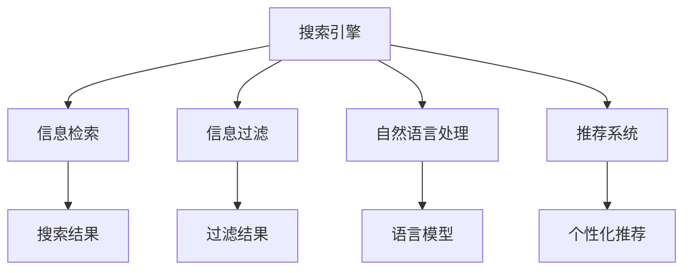

                 

# 信息过载与信息搜索指南与策略：在庞大的信息海洋中找到所需信息

## 1. 背景介绍

在互联网时代，信息的洪流不断涌入我们的生活，无论是新闻资讯、社交媒体、在线视频、在线教育还是电子商务，各种信息充斥着我们的屏幕。信息过载已经成为一个不可忽视的问题，人们需要花费大量的时间和精力在信息海洋中找到有价值的内容。信息搜索不再是一个简单的技术问题，而是一个融合心理学、认知科学、计算机科学等多个学科的复杂挑战。

### 1.1 问题由来

信息过载的根本原因是信息量的爆炸性增长和用户信息需求的不断增加。用户需要快速、准确地从海量信息中找到所需内容，但传统的信息检索方式往往难以满足这一需求。无论是网页搜索结果、文档全文搜索还是图片视频搜索，都面临着信息相关性、搜索准确性、用户体验等多个方面的挑战。

### 1.2 问题核心关键点

- **信息过载**：海量信息使得用户难以在短时间内找到有价值的内容。
- **信息检索准确性**：如何精确地匹配用户查询意图与相关文档或网页。
- **用户体验**：如何让用户在使用搜索服务时感觉直观、高效。
- **信息相关性**：搜索结果的相关性如何，是否能够满足用户的实际需求。

解决这些问题需要创新的搜索算法和智能技术，以便更好地理解和满足用户的需求。

### 1.3 问题研究意义

研究信息搜索技术，有助于提升用户的搜索体验，减少信息过载对个人生活和工作的负面影响。搜索技术可以帮助人们更高效地获取信息，优化工作流程，提高决策质量。

## 2. 核心概念与联系

### 2.1 核心概念概述

为更好地理解信息搜索技术的核心原理和应用，本节将介绍几个关键概念：

- **搜索引擎**：通过爬取互联网上的网页、图片、视频等，构建信息索引，并根据用户查询返回相关结果的智能系统。
- **信息检索**：从信息集合中寻找与用户查询最相关或匹配的信息的过程。
- **信息过滤**：对搜索结果进行筛选，去除与用户需求不相关的信息，提高搜索结果的准确性和相关性。
- **自然语言处理(NLP)**：通过理解自然语言，提高搜索系统的智能化水平，使其能够处理更加复杂和抽象的查询。
- **推荐系统**：根据用户历史行为、兴趣偏好等，推荐相关信息和产品，为用户提供个性化服务。

这些概念之间存在密切联系，共同构成了信息搜索技术的理论基础和实践框架。

### 2.2 核心概念原理和架构的 Mermaid 流程图



这个流程图展示了一些核心概念之间的关系：

1. 搜索引擎通过爬取信息构建索引，为信息检索提供数据支持。
2. 信息检索通过匹配查询和索引，返回相关结果。
3. 信息过滤用于进一步筛选搜索结果，去除无用信息。
4. 自然语言处理帮助搜索引擎理解用户查询的意图和上下文。
5. 推荐系统利用用户历史数据，提供个性化的搜索结果和推荐。

## 3. 核心算法原理 & 具体操作步骤

### 3.1 算法原理概述

信息搜索技术的核心在于构建索引、理解查询和匹配文档。基于信息检索技术，搜索引擎通过构建倒排索引，将文档内容和查询进行匹配，以获取最相关的结果。这种匹配过程依赖于算法模型和数据索引。

### 3.2 算法步骤详解

信息搜索算法主要包括以下几个关键步骤：

**Step 1: 构建索引**
- 抓取互联网上的文档，提取其内容，转换为文本索引项。
- 对索引项进行分词、去停用词等预处理操作。
- 利用TF-IDF、词向量等技术计算索引项的重要性。
- 构建倒排索引，将查询与索引项关联。

**Step 2: 理解查询**
- 对用户查询进行分词、命名实体识别等预处理。
- 利用语言模型理解查询意图，识别关键字和语义。
- 对查询进行向量化表示，方便与文档进行匹配。

**Step 3: 匹配文档**
- 将查询向量和索引项向量进行相似度计算，如余弦相似度。
- 根据相似度大小排序，返回与查询最相关的文档。
- 对搜索结果进行截断，仅返回前几条结果。

**Step 4: 反馈迭代**
- 收集用户点击、反馈等信息，用于改进搜索算法。
- 对搜索算法进行调优，提升搜索效果。

### 3.3 算法优缺点

信息搜索算法具有以下优点：
- 高效性：能够快速处理海量信息，返回相关结果。
- 准确性：通过精细化的匹配算法和索引构建，提高搜索结果的准确性。
- 可扩展性：可以扩展到多模态数据，如图像、视频、音频等。
- 灵活性：能够根据用户需求调整搜索策略。

同时，该算法也存在以下局限性：
- 数据依赖：依赖高质量的数据和索引，数据质量差会影响搜索效果。
- 查询表达：用户查询难以精准表达复杂需求，可能产生不相关结果。
- 计算复杂度：索引构建和匹配过程计算复杂，难以处理大规模数据。
- 个性化不足：通用搜索引擎难以满足个性化需求，推荐系统可以弥补这一不足。

尽管存在这些局限性，信息搜索算法仍是当前处理信息过载问题的首选技术，广泛应用于各类搜索引擎、信息检索系统等场景。

### 3.4 算法应用领域

信息搜索算法在多个领域得到了广泛应用：

- **搜索引擎**：如Google、Bing等，提供文本、图片、视频等多种信息的检索服务。
- **图书馆**：如图书馆的数字档案搜索、学术文献检索等。
- **电商平台**：如Amazon、淘宝等，通过商品搜索推荐提升用户体验。
- **社交网络**：如微博、Twitter等，利用搜索功能发现感兴趣的内容和用户。
- **在线教育**：如Coursera、Udacity等，通过搜索功能查找课程、视频等学习资源。

除了以上应用外，信息搜索算法还广泛应用于企业知识管理、医疗健康、金融理财等领域，帮助用户高效获取相关信息，提升工作效率和生活质量。

## 4. 数学模型和公式 & 详细讲解 & 举例说明

### 4.1 数学模型构建

信息搜索的数学模型通常包括以下几个部分：

- **倒排索引模型**：用于将文档内容与查询进行匹配的索引结构。
- **TF-IDF模型**：用于计算文档和查询中单词的权重。
- **余弦相似度模型**：用于衡量查询与文档的相似度。
- **向量空间模型**：用于将查询和文档映射到高维向量空间，计算相似度。

### 4.2 公式推导过程

以余弦相似度模型为例，推导其计算公式：

$$
similarity(q,d) = \frac{\vec{q} \cdot \vec{d}}{||\vec{q}|| \cdot ||\vec{d}||}
$$

其中 $\vec{q}$ 和 $\vec{d}$ 分别是查询和文档的向量表示，$\cdot$ 表示向量的点积，$||\cdot||$ 表示向量的范数。余弦相似度通过计算查询向量与文档向量的夹角余弦值，衡量它们的相似度。

### 4.3 案例分析与讲解

以Google搜索引擎为例，分析其信息搜索技术的具体实现：

- **网页抓取和索引构建**：Google通过爬虫程序抓取互联网上的网页，并构建倒排索引。倒排索引以词为单位，记录每个单词在哪些网页中出现过。
- **查询理解**：Google使用语言模型，如Google BERT，理解用户的查询意图和上下文。
- **匹配和排序**：Google通过计算查询和文档的相似度，对搜索结果进行排序。
- **个性化推荐**：Google利用用户历史行为和兴趣，提供个性化的搜索结果和广告推荐。

## 5. 项目实践：代码实例和详细解释说明

### 5.1 开发环境搭建

在进行信息搜索实践前，我们需要准备好开发环境。以下是使用Python进行Elasticsearch开发的环境配置流程：

1. 安装Anaconda：从官网下载并安装Anaconda，用于创建独立的Python环境。

2. 创建并激活虚拟环境：
```bash
conda create -n elasticsearch-env python=3.8 
conda activate elasticsearch-env
```

3. 安装Elasticsearch：
```bash
pip install elasticsearch
```

4. 安装其他工具包：
```bash
pip install pandas scikit-learn nltk
```

完成上述步骤后，即可在`elasticsearch-env`环境中开始信息搜索的开发和测试。

### 5.2 源代码详细实现

这里我们以Elasticsearch搜索引擎为例，给出信息搜索的Python代码实现。

首先，定义查询处理函数：

```python
from elasticsearch import Elasticsearch
import pandas as pd
import numpy as np
import nltk
nltk.download('stopwords')
from nltk.corpus import stopwords

def preprocess_text(text):
    tokens = nltk.word_tokenize(text.lower())
    tokens = [token for token in tokens if token.isalnum()]
    stopwords = set(stopwords.words('english'))
    tokens = [token for token in tokens if token not in stopwords]
    return tokens

def build_index(query, collection_name='articles'):
    es = Elasticsearch([{'host': 'localhost', 'port': 9200}])
    docs = []
    for doc in collection_name:
        doc['text'] = preprocess_text(doc['text'])
        docs.append(doc)
    body = {'index': {'name': collection_name, 'mappings': {'text': {'type': 'text'}}}}
    es.indices.create(index=collection_name, body=body)
    es.bulk(body=docs)
```

然后，定义查询匹配和排序函数：

```python
from elasticsearch import Elasticsearch
from sklearn.metrics.pairwise import cosine_similarity

def search(query, collection_name='articles', top_k=10):
    es = Elasticsearch([{'host': 'localhost', 'port': 9200}])
    query_vector = preprocess_text(query)
    results = []
    for doc in collection_name:
        doc_vector = preprocess_text(doc['text'])
        similarity = cosine_similarity([query_vector], [doc_vector])
        if similarity[0][0] > 0.1:
            results.append(doc)
    results = sorted(results, key=lambda x: similarity[0][0], reverse=True)
    return results[:top_k]
```

最后，启动搜索流程并输出结果：

```python
query = 'machine learning'
results = search(query, top_k=5)
for doc in results:
    print(doc['text'])
```

以上代码实现了一个简单的信息搜索系统，通过构建倒排索引和余弦相似度匹配，返回与查询最相关的文章。可以看到，Elasticsearch提供了强大的索引和搜索功能，使得信息搜索的实现变得简单高效。

### 5.3 代码解读与分析

让我们再详细解读一下关键代码的实现细节：

**preprocess_text函数**：
- 对文本进行分词、去除停用词等预处理操作，返回处理后的单词列表。

**build_index函数**：
- 建立Elasticsearch连接，构建倒排索引，对索引项进行预处理。
- 定义索引结构，对索引项进行分词，建立文档-查询索引。
- 使用Elasticsearch的bulk API批量写入文档，构建完整的索引。

**search函数**：
- 对查询进行预处理，返回查询向量。
- 对文档进行预处理，返回文档向量。
- 使用余弦相似度计算查询向量与文档向量的相似度。
- 根据相似度大小排序，返回最相关的文档列表。
- 限制返回文档数量，仅返回top_k篇。

**启动搜索流程**：
- 定义查询和返回文档数量。
- 调用search函数进行搜索，输出返回的文档文本。

可以看到，利用Elasticsearch构建的索引搜索系统，代码实现相对简洁高效。开发者可以灵活扩展函数，添加更多查询理解、排序、过滤等功能，以应对实际应用中的复杂需求。

## 6. 实际应用场景

### 6.1 智能推荐系统

智能推荐系统广泛应用于电商、新闻、视频等多个领域，通过分析用户行为数据，提供个性化的推荐服务。信息搜索技术在其中扮演了重要角色，通过检索和排序，将最相关的产品或内容推荐给用户。

在技术实现上，可以收集用户的历史行为数据，包括浏览、点击、购买等行为，利用这些数据构建用户画像，并通过信息搜索技术检索与用户画像最相关的产品或内容。推荐的算法可以结合协同过滤、基于内容的推荐等方法，提升推荐效果。

### 6.2 企业知识管理

企业知识管理是提高企业信息利用效率的重要手段，信息搜索技术在其中具有关键作用。通过构建企业内部的知识库、文档库、论坛等，可以方便员工获取所需信息，提高工作效率。

在实践中，可以将企业的知识库数据导入Elasticsearch，建立索引。员工可以通过搜索系统快速检索到相关文档、知识，也可以提出问题，让系统检索最相关的答案或解决方案。系统还可以通过用户行为数据，提供个性化知识推荐。

### 6.3 医疗健康

医疗健康领域的信息搜索技术，可以帮助医生快速获取患者的历史病历、研究论文、临床指南等资料，提高诊疗效率。通过构建医疗数据库索引，医生可以检索患者病历、相关论文、临床指南等，辅助诊疗决策。

## 7. 工具和资源推荐

### 7.1 学习资源推荐

为了帮助开发者系统掌握信息搜索技术的理论基础和实践技巧，这里推荐一些优质的学习资源：

1. **《搜索引擎原理与实践》**：深入浅出地介绍了搜索引擎的基本原理、算法实现和优化技术。

2. **Coursera《信息检索》课程**：斯坦福大学开设的信息检索课程，涵盖信息检索的基本概念、技术实现和应用案例。

3. **《Elasticsearch官方文档》**：Elasticsearch官方提供的详细文档，包括搜索引擎的搭建、索引构建、查询优化等实用技巧。

4. **NLP工具包NLTK**：提供丰富的自然语言处理工具，包括分词、词性标注、命名实体识别等。

5. **GitHub上的开源搜索引擎项目**：通过阅读开源搜索引擎的代码，了解实际应用的实现细节和优化策略。

通过对这些资源的学习实践，相信你一定能够快速掌握信息搜索技术的精髓，并用于解决实际的搜索问题。

### 7.2 开发工具推荐

高效的开发离不开优秀的工具支持。以下是几款用于信息搜索开发的常用工具：

1. **Elasticsearch**：分布式搜索引擎，支持高并发的全文检索、结构化数据检索等多种查询类型。

2. **Solr**：另一个流行的开源搜索引擎，提供丰富的API接口和扩展插件。

3. **Apache Lucene**：底层的搜索引擎库，支持各种索引和查询优化技术。

4. **Whoosh**：Python实现的搜索引擎，适用于小型应用场景。

5. **Hadoop/Spark**：用于大数据场景下的搜索引擎，支持分布式处理和扩展。

合理利用这些工具，可以显著提升信息搜索任务的开发效率，加快创新迭代的步伐。

### 7.3 相关论文推荐

信息搜索技术的发展源于学界的持续研究。以下是几篇奠基性的相关论文，推荐阅读：

1. **PageRank算法**：提出了网页排名的计算方法，成为搜索引擎算法的重要组成部分。

2. **TF-IDF算法**：提出了文本信息检索中单词权重的计算方法，广泛应用于搜索引擎和文本挖掘。

3. **Latent Semantic Indexing**：提出了隐性语义索引技术，利用矩阵分解技术提升文本检索的效果。

4. **BM25算法**：提出了改进的文本检索算法，考虑了文档长度和查询字频等特征，提高了检索效果。

5. **深度学习在信息检索中的应用**：研究利用深度学习技术，提升信息检索系统的性能和智能化水平。

这些论文代表了大规模信息检索技术的发展脉络。通过学习这些前沿成果，可以帮助研究者把握学科前进方向，激发更多的创新灵感。

## 8. 总结：未来发展趋势与挑战

### 8.1 总结

本文对信息搜索技术的核心原理和应用实践进行了全面系统的介绍。首先阐述了信息过载的背景和信息检索的重要意义，明确了信息搜索技术在提升信息获取效率、优化用户体验方面的价值。其次，从算法实现到工程实践，详细讲解了信息搜索的关键步骤和实现细节，给出了实际开发中的代码实现。同时，本文还广泛探讨了信息搜索技术在推荐系统、企业知识管理、医疗健康等多个领域的应用前景，展示了信息搜索技术的广泛应用。此外，本文精选了信息搜索技术的各类学习资源，力求为读者提供全方位的技术指引。

通过本文的系统梳理，可以看到，信息搜索技术正在成为处理信息过载问题的关键手段，极大地提升了用户的信息获取效率和决策质量。未来，伴随技术的发展和算法的进步，信息搜索技术将在更广泛的场景中发挥作用，推动智能交互系统的进步。

### 8.2 未来发展趋势

展望未来，信息搜索技术将呈现以下几个发展趋势：

1. **多模态信息检索**：随着移动互联网和物联网的普及，多模态信息检索技术（如图像、视频、语音等）将得到广泛应用，提升信息搜索的智能化水平。

2. **个性化推荐算法**：结合用户行为数据和机器学习技术，个性化推荐算法将更加精准，提升用户体验。

3. **联邦学习**：分布式数据隐私保护技术，如联邦学习，将帮助企业在不泄露用户隐私的情况下，构建强大的信息搜索系统。

4. **深度学习在搜索中的应用**：深度学习技术将进一步优化信息检索算法，提升搜索效果和智能化水平。

5. **智能搜索辅助工具**：利用自然语言处理和知识图谱技术，构建智能搜索辅助工具，帮助用户更高效地搜索和理解信息。

以上趋势凸显了信息搜索技术的广阔前景。这些方向的探索发展，必将进一步提升信息搜索的效率和智能化水平，为构建更智能的交互系统奠定基础。

### 8.3 面临的挑战

尽管信息搜索技术已经取得了显著进展，但在迈向更加智能化、普适化应用的过程中，它仍面临诸多挑战：

1. **数据隐私和安全**：用户隐私保护和数据安全是信息搜索系统面临的重要挑战，如何在保证数据隐私的同时，提高搜索效果，是一个亟待解决的问题。

2. **数据质量和多样性**：高质量、多样化的数据是信息搜索系统的基础，数据质量差或不完整将直接影响搜索效果。

3. **计算资源消耗**：大规模数据索引和实时查询处理需要大量的计算资源，如何在资源受限的情况下，实现高效的搜索和索引，是一个重要的技术挑战。

4. **个性化需求的多样性**：用户需求的多样性和复杂性增加了个性化推荐和搜索的难度，如何在不同用户和场景下提供个性化的服务，需要更多的技术创新。

5. **搜索算法的多样性**：不同算法和索引结构在不同的应用场景下效果各异，如何选择和优化算法，需要更多的实验和测试。

6. **搜索系统的扩展性**：在大规模分布式系统中，如何实现高效的搜索和索引，需要更高效的分布式算法和系统架构。

正视信息搜索面临的这些挑战，积极应对并寻求突破，将是大规模信息搜索技术迈向成熟的必由之路。

### 8.4 研究展望

面对信息搜索技术所面临的挑战，未来的研究需要在以下几个方面寻求新的突破：

1. **联邦学习技术**：结合分布式数据和联邦学习技术，构建隐私保护的信息搜索系统。

2. **多模态信息融合**：研究如何高效融合图像、视频、语音等多模态信息，提升信息检索效果。

3. **深度学习优化**：进一步优化深度学习算法，提升信息检索的效率和准确性。

4. **搜索算法的创新**：探索新的搜索算法和索引结构，提升搜索效果。

5. **个性化推荐算法**：结合用户行为数据和深度学习技术，构建更精准的个性化推荐系统。

6. **分布式搜索技术**：研究高效分布式搜索算法，提升大规模系统中的搜索性能。

这些研究方向的探索，必将引领信息搜索技术迈向更高的台阶，为构建更智能的交互系统提供坚实的基础。总之，信息搜索技术还需要与其他人工智能技术进行更深入的融合，如知识表示、因果推理、强化学习等，多路径协同发力，共同推动信息检索系统的进步。只有勇于创新、敢于突破，才能不断拓展信息搜索的边界，让智能技术更好地服务于人类社会。

## 9. 附录：常见问题与解答

**Q1: 如何提升信息搜索的准确性和相关性？**

A: 提升信息搜索的准确性和相关性，可以从以下几个方面入手：
1. 数据预处理：对查询和文档进行预处理，去除停用词、标点等干扰信息。
2. 索引优化：优化倒排索引结构，提升查询效率和匹配准确性。
3. 特征工程：提取查询和文档的关键特征，如TF-IDF、词向量等，提升相似度计算的准确性。
4. 机器学习算法：利用机器学习算法，如分类、回归等，提升查询理解和排序效果。
5. 用户反馈机制：收集用户反馈信息，不断优化搜索算法和索引结构。

**Q2: 如何在信息搜索中实现个性化推荐？**

A: 实现个性化推荐，可以从以下几个方面入手：
1. 用户画像：构建用户画像，了解用户的历史行为和兴趣。
2. 推荐算法：结合协同过滤、基于内容的推荐等算法，推荐与用户最相关的信息。
3. 实时更新：利用用户最新行为数据，实时更新推荐结果，提升个性化推荐的效果。
4. 多模态融合：融合图像、视频、语音等多模态信息，提升推荐效果。

**Q3: 如何在信息搜索中保护用户隐私？**

A: 保护用户隐私可以从以下几个方面入手：
1. 数据匿名化：对用户数据进行匿名化处理，防止用户隐私泄露。
2. 联邦学习：利用联邦学习技术，在用户端本地训练模型，避免用户数据集中存储。
3. 差分隐私：使用差分隐私技术，保护用户数据的隐私。
4. 用户控制：让用户自主选择是否共享数据，并控制数据的使用范围和方式。

**Q4: 信息搜索如何在大规模数据上高效运行？**

A: 在大规模数据上高效运行信息搜索，可以从以下几个方面入手：
1. 分布式索引：利用分布式索引技术，如Elasticsearch，提升查询效率。
2. 缓存机制：利用缓存机制，减少重复查询和索引计算。
3. 数据压缩：利用数据压缩技术，减少索引和存储的资源消耗。
4. 负载均衡：利用负载均衡技术，合理分配计算资源，提升系统性能。

**Q5: 信息搜索在企业知识管理中的应用场景有哪些？**

A: 信息搜索在企业知识管理中的应用场景包括：
1. 文档检索：快速检索企业文档，如合同、报告、技术文档等。
2. 知识图谱：利用知识图谱技术，构建企业知识网络，方便员工检索和共享知识。
3. 问题解答：构建知识问答系统，帮助员工快速解答技术问题，提升工作效率。
4. 项目管理：通过搜索系统，检索项目文档、资料，提升项目管理效果。

这些应用场景展示了信息搜索技术在企业知识管理中的广泛应用，通过构建强大的搜索系统，可以大大提升企业知识管理的效果。

---

作者：禅与计算机程序设计艺术 / Zen and the Art of Computer Programming

