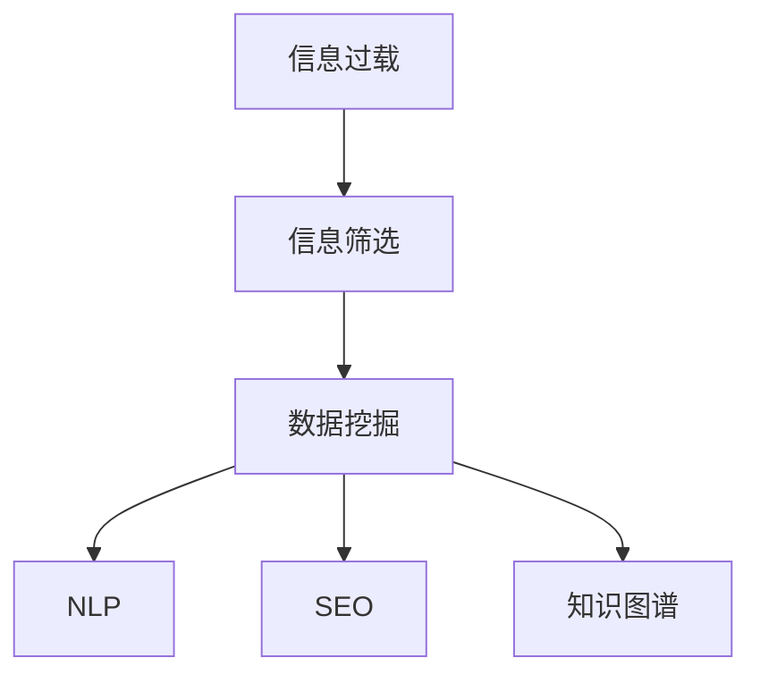

                 

# 信息过载与信息筛选指南：在信息洪流中找到有价值和相关的信息

> 关键词：信息过载, 信息筛选, 数据挖掘, 自然语言处理, 搜索引擎优化, 知识图谱

## 1. 背景介绍

### 1.1 问题由来

在现代社会，信息量呈指数级增长，各类数据源不断涌现。尽管信息技术的进步极大地便利了人们获取和分享信息，但这也导致了一种新兴的危机——信息过载(information overload)。过载的信息不仅让人无从下手，还容易导致认知负荷加重，影响决策和行动的效率。

### 1.2 问题核心关键点

信息过载的核心问题在于：
- **数据规模爆炸**：随着互联网、社交媒体的普及，每天产生的数据量巨大，仅靠人工阅读难以处理。
- **信息噪音增多**：诸如假新闻、恶意广告、低质量内容等噪音信息充斥网络，加大了信息筛选的难度。
- **真实信息的难以定位**：在信息洪流中，如何准确、高效地定位到真实、有价值的信息，成为当务之急。

### 1.3 问题研究意义

在信息过载背景下，信息筛选技术的研发和应用，对于提升信息检索效率、优化决策流程、改善生活质量具有重要意义：

1. **信息质量提升**：有效筛选信息可以大幅提升信息的质量和相关性，减少用户获取到无用信息的概率。
2. **决策效率提高**：在复杂多变的社会环境中，精准的信息筛选可为决策提供可靠支持，减少失误。
3. **生产力增强**：特别是对企业而言，信息筛选技术能够提升团队的工作效率，优化业务流程，增强竞争力。
4. **认知负担减轻**：减轻信息过载带来的心理压力，提升用户体验和满意度。
5. **知识管理优化**：为知识图谱和知识管理系统的构建提供数据支撑，促进知识的系统化和结构化。

## 2. 核心概念与联系

### 2.1 核心概念概述

为更好地理解信息筛选技术，本节将介绍几个密切相关的核心概念：

- **信息过载**：指信息获取量超过个人处理能力，导致注意力分散、判断力下降的现象。
- **信息筛选**：指从大量信息中识别、过滤出有价值的信息，以供决策参考。
- **数据挖掘**：从大量数据中挖掘出有价值的信息、模式和知识，支持决策和优化。
- **自然语言处理(NLP)**：处理、理解、生成自然语言的技术，是信息筛选的重要工具。
- **搜索引擎优化(SEO)**：提高网站在搜索引擎结果页上的排名，提升信息的可见性。
- **知识图谱**：结构化的知识表示，用于组织和检索知识，支持智能查询和决策。

这些核心概念之间的逻辑关系可以通过以下Mermaid流程图来展示：



这个流程图展示了一些核心概念的相互关系：

1. 信息过载是信息筛选的前提，需要通过技术手段进行解决。
2. 数据挖掘可以提取信息中潜在的知识模式，支持信息筛选。
3. NLP技术帮助处理和理解文本信息，是信息筛选的重要工具。
4. SEO优化提升信息的可见性，间接辅助信息筛选。
5. 知识图谱提供结构化的知识表示，便于信息的检索和整合。

## 3. 核心算法原理 & 具体操作步骤
### 3.1 算法原理概述

信息筛选的算法原理基于对大量信息源进行评估和分析，提取出与用户需求或业务目标相关的信息。其主要分为两个步骤：

1. **信息预处理**：对原始数据进行清洗、去噪、归一化等预处理，提高数据质量。
2. **信息评估与筛选**：通过计算模型对信息源进行打分或排序，筛选出最有价值的信息。

信息评估与筛选的核心在于建立有效的信息评价指标体系和评估算法，常见的方法包括：

- **相关性评估**：衡量信息与用户需求或业务目标的相关性，常用指标有TF-IDF、BM25等。
- **质量评估**：评估信息源的可靠性、准确性、权威性，常用方法有PageRank、Domain Rating等。
- **新颖性评估**：评估信息的独特性和时效性，常用指标有PageRank、Freshness Factor等。

### 3.2 算法步骤详解

信息筛选的算法步骤如下：

**Step 1: 信息预处理**
- 收集待筛选的信息源，如网页、文档、新闻等。
- 清洗噪声数据，去除重复、低质量、无关的信息。
- 统一数据格式，标准化文本、图片、音频等信息。

**Step 2: 信息评估**
- 选择评估模型，如基于内容的推荐算法、基于图的知识图谱等。
- 计算信息源的各项评估指标，如TF-IDF、PageRank、Freshness Factor等。
- 综合各项指标，计算总分或加权平均值。

**Step 3: 信息筛选**
- 根据评分或排序结果，筛选出与用户需求或业务目标最相关的信息。
- 对筛选出的信息进行进一步分析和处理，如图摘要、关键词提取等。
- 提供搜索结果展示，让用户可以方便地查看和选择。

### 3.3 算法优缺点

信息筛选算法具有以下优点：
1. **高效性**：利用技术手段自动化信息处理和筛选，减少人工投入。
2. **准确性**：基于科学的评估模型和算法，提升信息筛选的准确性。
3. **可扩展性**：适用于各类信息源和用户需求，灵活性强。
4. **实时性**：可以实时处理和筛选信息，满足动态需求。

同时，该算法也存在一定的局限性：
1. **依赖数据质量**：原始数据质量和预处理效果直接影响筛选结果。
2. **模型复杂性**：不同的评估模型有不同的计算复杂度和精度。
3. **用户需求多样性**：不同用户有不同的需求，通用算法难以兼顾所有场景。
4. **上下文依赖**：筛选结果往往依赖于特定的上下文环境，普适性不足。

尽管存在这些局限性，但就目前而言，信息筛选算法仍是大规模信息处理的有效手段。未来相关研究的重点在于如何进一步提升算法的准确性和效率，同时兼顾用户需求的多样性和上下文的复杂性。

### 3.4 算法应用领域

信息筛选技术在众多领域均有广泛应用，例如：

- 互联网搜索：Google、Bing等搜索引擎通过复杂的算法，对海量网页进行排序和推荐，帮助用户快速找到所需信息。
- 内容推荐：Netflix、Amazon等平台通过分析用户行为数据，智能推荐视频、商品等，提升用户体验。
- 社交媒体：Facebook、Twitter等社交平台通过算法推荐动态内容，增加用户粘性。
- 学术研究：Google Scholar、ResearchGate等平台通过信息筛选，帮助科研人员快速找到相关论文和研究资料。
- 广告投放：通过精准的信息筛选，广告投放平台能够提升广告的点击率和转化率。

除了上述这些常见应用外，信息筛选技术还被创新性地应用于知识图谱构建、金融风险管理、智能客服等领域，为各行各业带来了新的机遇和挑战。

## 4. 数学模型和公式 & 详细讲解 & 举例说明

### 4.1 数学模型构建

假设信息源为 $I$，用户需求为 $U$，筛选算法为 $A$，筛选结果为 $R$。信息筛选的数学模型可以表示为：

$$
R = A(I, U)
$$

其中 $I$ 是输入的信息源集合，$U$ 是用户需求集合，$A$ 是信息筛选算法，$R$ 是输出结果集合。

### 4.2 公式推导过程

以TF-IDF模型为例，介绍信息评估的数学公式。

TF-IDF模型用于计算文本信息的相关性，其核心公式为：

$$
\text{TF-IDF}(t) = \text{TF}(t) \times \text{IDF}(t)
$$

其中 $t$ 是文本中的词汇，$TF(t)$ 是词汇 $t$ 在文本中的词频，$IDF(t)$ 是词汇 $t$ 的逆文档频率。

$\text{TF}(t)$ 的计算公式为：

$$
\text{TF}(t) = \frac{\text{Number of Occurrences of } t}{\text{Total Number of Words in Document}}
$$

$\text{IDF}(t)$ 的计算公式为：

$$
\text{IDF}(t) = \log\left(\frac{\text{Total Number of Documents}}{\text{Number of Documents with } t}\right)
$$

### 4.3 案例分析与讲解

以下通过一个具体的案例，分析TF-IDF模型在信息筛选中的应用。

假设某电子商务网站需要从数百万个商品中推荐给用户，为了提高推荐的准确性，采用了基于TF-IDF的相关性评估算法。具体步骤如下：

1. 收集用户的浏览记录和购买历史，获取用户需求 $U$。
2. 对于每个商品 $i$，计算其在所有浏览记录中的词频 $TF_i$ 和逆文档频率 $IDF_i$。
3. 根据用户需求 $U$，计算与每个商品 $i$ 的相关性得分 $\text{TF-IDF}_i$。
4. 将商品按相关性得分排序，选取前N个商品推荐给用户。

通过这种基于TF-IDF的信息筛选方法，能够较好地解决信息过载问题，提升推荐系统的效果。

## 5. 项目实践：代码实例和详细解释说明
### 5.1 开发环境搭建

在进行信息筛选项目开发前，我们需要准备好开发环境。以下是使用Python进行Scikit-Learn开发的环境配置流程：

1. 安装Anaconda：从官网下载并安装Anaconda，用于创建独立的Python环境。

2. 创建并激活虚拟环境：
```bash
conda create -n info-screening python=3.8 
conda activate info-screening
```

3. 安装Scikit-Learn：
```bash
pip install scikit-learn
```

4. 安装Pandas、Numpy、Matplotlib等各类工具包：
```bash
pip install pandas numpy matplotlib tqdm jupyter notebook ipython
```

完成上述步骤后，即可在`info-screening`环境中开始项目实践。

### 5.2 源代码详细实现

下面我们以商品推荐为例，给出使用Scikit-Learn对商品信息进行筛选的PyTorch代码实现。

首先，定义商品信息处理的函数：

```python
from sklearn.feature_extraction.text import TfidfVectorizer
from sklearn.metrics.pairwise import cosine_similarity
import pandas as pd

# 读取商品数据
df = pd.read_csv('products.csv')

# 定义文本处理函数
def preprocess_text(text):
    # 去除HTML标签和特殊字符
    text = re.sub('<[^<]+?>', '', text)
    # 去除停用词
    text = remove_stopwords(text)
    # 转换为小写
    text = text.lower()
    return text

# 预处理商品描述
df['description'] = df['description'].apply(preprocess_text)
```

然后，定义信息评估和筛选函数：

```python
# 定义TF-IDF向量器
tfidf = TfidfVectorizer()

# 计算TF-IDF值
tfidf_matrix = tfidf.fit_transform(df['description'])

# 计算相似度矩阵
similarity_matrix = cosine_similarity(tfidf_matrix, tfidf_matrix)

# 定义推荐函数
def recommend_products(user_id, n=5):
    user_description = df[df['user_id'] == user_id]['description'].values[0]
    user_description = preprocess_text(user_description)
    user_tfidf = tfidf.transform([user_description])
    scores = pd.Series(similarity_matrix[user_id], index=df['product_id'])
    top_products = df.index[scores.argsort()[-n:]].tolist()
    return top_products
```

最后，启动推荐流程：

```python
# 测试推荐函数
recommend_products(12345)
```

以上就是使用Scikit-Learn对商品信息进行筛选的完整代码实现。可以看到，通过简单的预处理和TF-IDF计算，我们就能快速筛选出与用户需求最相关的商品，提升推荐系统的效果。

### 5.3 代码解读与分析

让我们再详细解读一下关键代码的实现细节：

**preprocess_text函数**：
- 定义了一个文本预处理函数，去除HTML标签和特殊字符，去除停用词，转换为小写。

**商品信息处理**：
- 读取商品数据，并应用文本预处理函数处理商品描述。

**TF-IDF向量器**：
- 使用Scikit-Learn的TfidfVectorizer计算TF-IDF值。

**相似度矩阵**：
- 使用cosine_similarity计算商品描述之间的相似度矩阵。

**推荐函数**：
- 根据用户描述和相似度矩阵，计算与用户需求最相关的商品，返回推荐结果。

**测试推荐函数**：
- 对用户ID为12345的推荐函数进行测试，返回推荐商品ID列表。

可以看到，Scikit-Learn提供了简单便捷的方式进行信息筛选，开发者可以很快上手实现基本功能。当然，实际应用中还需要考虑更多细节，如模型评估、数据可视化、多模态融合等，以进一步提升信息筛选的性能和效果。

## 6. 实际应用场景
### 6.1 智慧医疗

在智慧医疗领域，信息筛选技术可以广泛应用于病历分析、医学研究、患者咨询等方面。通过快速、准确地筛选医疗文献和病历信息，医疗机构能够更高效地支持医生诊断和治疗，提升患者满意度。

具体而言，可以收集医院的历史病历记录、医学论文、患者咨询等文本数据，构建文本语料库。使用信息筛选技术，从大量病历和文献中快速找到相关病例和研究资料，辅助医生进行诊断和治疗方案制定。同时，对患者咨询进行信息筛选，提取常见问题和解答，构建知识库，提供智能问答服务。

### 6.2 智能客服

智能客服系统需要处理大量的用户咨询，信息筛选技术可以有效提升客服响应效率和准确性。通过收集用户历史咨询记录，使用信息筛选技术筛选出常见问题和解决方案，构建知识库。在用户咨询时，自动匹配并推荐相关答案，提升客户服务质量。同时，对用户反馈进行信息筛选，提取有价值的反馈信息，优化客服模型和策略。

### 6.3 金融风控

在金融领域，信息筛选技术可以用于风险评估、信用评级、欺诈检测等方面。通过分析用户的财务记录、交易记录、社交网络等数据，快速筛选出高风险用户和可疑交易，提升金融风险管理能力。

具体而言，可以收集用户的银行流水、交易记录、社交媒体信息等文本数据，构建数据集。使用信息筛选技术，筛选出可能存在风险的用户和交易，进行进一步的分析和处理。同时，对社交网络数据进行信息筛选，分析用户行为和情绪，进一步提升风险评估的准确性。

### 6.4 未来应用展望

随着信息筛选技术的不断发展，其在各个领域的应用前景将更加广阔。未来，信息筛选技术有望在以下几个方向取得突破：

1. **多模态融合**：将文本、图片、视频等多模态数据融合，提供更加全面、精确的信息筛选结果。
2. **深度学习应用**：结合深度学习技术，提升信息筛选的准确性和泛化能力。
3. **实时性增强**：通过流式处理和大数据技术，实现实时信息筛选和动态更新。
4. **跨领域应用**：将信息筛选技术应用于更多垂直领域，如教育、农业、环境等，提供定制化解决方案。
5. **智能决策支持**：结合知识图谱和智能推理技术，提供智能决策支持，优化业务流程。

这些方向的应用将极大地提升信息筛选的效能和应用范围，为各个行业的数字化转型提供有力支撑。

## 7. 工具和资源推荐
### 7.1 学习资源推荐

为了帮助开发者系统掌握信息筛选技术的理论基础和实践技巧，这里推荐一些优质的学习资源：

1. 《信息检索原理与实践》：清华大学出版社，介绍了信息检索的基本原理、核心技术和算法。
2. 《推荐系统实战》：清华大学出版社，结合实例讲解推荐系统的构建和优化。
3. 《自然语言处理》课程：斯坦福大学Coursera平台，详细讲解自然语言处理和信息检索的基础知识和前沿技术。
4. 《深度学习与自然语言处理》：北京大学出版社，深入介绍深度学习在自然语言处理中的应用。
5. 《机器学习实战》：清华大学出版社，结合Scikit-Learn等工具，讲解机器学习在信息筛选中的应用。

通过这些资源的学习实践，相信你一定能够快速掌握信息筛选技术的精髓，并用于解决实际的NLP问题。
###  7.2 开发工具推荐

高效的开发离不开优秀的工具支持。以下是几款用于信息筛选开发的常用工具：

1. Python：功能强大且易于上手的编程语言，适用于数据处理和算法开发。
2. Scikit-Learn：Python的机器学习库，提供了简单易用的算法实现和评估工具。
3. TensorFlow：Google主导的深度学习框架，支持多模态数据的处理和模型构建。
4. PyTorch：Facebook开发的深度学习框架，灵活性高，适合科研和工业应用。
5. Elasticsearch：开源搜索引擎，支持大规模文本数据的存储和检索。

合理利用这些工具，可以显著提升信息筛选任务的开发效率，加快创新迭代的步伐。

### 7.3 相关论文推荐

信息筛选技术的发展离不开学界的持续研究。以下是几篇奠基性的相关论文，推荐阅读：

1. Information Retrieval: An Introduction：介绍了信息检索的基本原理和核心算法。
2. Query-Based Learning of Multimedia Information Retrieval Models：提出了一种多模态信息检索模型，结合文本、图片、视频等多模态数据，提升检索效果。
3. Learning to Recommend What You Didn't Know You Like：提出了一种基于深度学习的推荐系统，能够有效处理少样本和零样本推荐问题。
4. Deep Semantic Search：介绍了基于深度学习的语义搜索技术，通过学习语义表示，实现对文本和图像的跨模态检索。
5. Knowledge Graphs and Semantic Search：探讨了知识图谱在信息检索中的应用，通过结构化知识表示提升检索效果。

这些论文代表了大规模信息检索的发展脉络。通过学习这些前沿成果，可以帮助研究者把握学科前进方向，激发更多的创新灵感。

## 8. 总结：未来发展趋势与挑战

### 8.1 总结

本文对信息筛选技术进行了全面系统的介绍。首先阐述了信息过载的背景和意义，明确了信息筛选在提升信息检索效率、优化决策流程、改善生活质量方面的独特价值。其次，从原理到实践，详细讲解了信息筛选的数学原理和关键步骤，给出了信息筛选任务开发的完整代码实例。同时，本文还广泛探讨了信息筛选技术在智慧医疗、智能客服、金融风控等多个行业领域的应用前景，展示了信息筛选技术的巨大潜力。此外，本文精选了信息筛选技术的各类学习资源，力求为读者提供全方位的技术指引。

通过本文的系统梳理，可以看到，信息筛选技术在信息过载时代具有不可替代的重要地位。其能够快速、准确地从海量信息中筛选出有价值的内容，有效提升信息检索和决策的效率。未来，伴随信息技术的进一步发展，信息筛选技术有望迎来更大的突破，为各行各业带来新的变革和机遇。

### 8.2 未来发展趋势

展望未来，信息筛选技术将呈现以下几个发展趋势：

1. **深度学习应用**：结合深度学习技术，提升信息筛选的准确性和泛化能力，应对更多复杂的数据形态。
2. **多模态融合**：将文本、图片、视频等多模态数据融合，提供更加全面、精确的信息筛选结果。
3. **实时性增强**：通过流式处理和大数据技术，实现实时信息筛选和动态更新，满足实时性需求。
4. **跨领域应用**：将信息筛选技术应用于更多垂直领域，如教育、农业、环境等，提供定制化解决方案。
5. **智能决策支持**：结合知识图谱和智能推理技术，提供智能决策支持，优化业务流程。

这些趋势凸显了信息筛选技术的广阔前景。这些方向的探索发展，必将进一步提升信息检索的效能和应用范围，为各行各业带来新的机遇和挑战。

### 8.3 面临的挑战

尽管信息筛选技术已经取得了瞩目成就，但在迈向更加智能化、普适化应用的过程中，它仍面临着诸多挑战：

1. **数据质量瓶颈**：原始数据质量和预处理效果直接影响筛选结果，如何保证数据质量是一个难题。
2. **模型复杂性**：不同的评估模型有不同的计算复杂度和精度，如何选择合适的模型是一个挑战。
3. **用户需求多样性**：不同用户有不同的需求，通用算法难以兼顾所有场景，如何实现个性化需求是一个难题。
4. **上下文依赖**：筛选结果往往依赖于特定的上下文环境，普适性不足，如何提升筛选结果的上下文适应性是一个挑战。
5. **资源消耗**：大规模信息筛选往往需要大量计算资源，如何优化计算效率是一个挑战。

尽管存在这些挑战，但通过学界和产业界的共同努力，这些问题终将一一被克服，信息筛选技术必将在构建智能信息处理系统中发挥更大的作用。相信随着技术的不断发展，信息筛选技术将进一步提升信息检索和决策的效率，为各行各业带来新的变革和机遇。

### 8.4 研究展望

面向未来，信息筛选技术需要在以下几个方向进行进一步探索：

1. **智能推荐算法**：结合深度学习和多模态融合技术，提升推荐算法的准确性和多样性，满足用户个性化需求。
2. **语义检索技术**：结合自然语言处理和知识图谱技术，提升信息检索的准确性和相关性，优化搜索结果。
3. **跨领域知识融合**：将不同领域的知识进行融合，提升信息检索的跨领域泛化能力，拓展应用范围。
4. **智能查询优化**：结合自然语言处理和机器学习技术，提升查询优化效果，优化搜索结果。
5. **隐私保护和安全**：在信息检索过程中，如何保护用户隐私和数据安全，是一个亟待解决的问题。

这些研究方向将推动信息筛选技术的进一步发展，为构建智能信息处理系统提供有力的技术支撑。只有勇于创新、敢于突破，才能不断拓展信息筛选技术的边界，让智能信息处理技术更好地服务于人类社会。

## 9. 附录：常见问题与解答

**Q1：信息筛选算法如何处理不同领域的数据？**

A: 信息筛选算法通过构建领域特定的语料库和模型，提升对特定领域数据的筛选能力。具体来说，可以使用领域特定的停用词、同义词词典等，调整TF-IDF等评估指标的权重，以适应特定领域数据的特性。同时，可以通过多任务学习等方法，同时处理多个领域的数据。

**Q2：信息筛选算法如何处理大规模数据？**

A: 信息筛选算法在大规模数据处理时，需要考虑算法的计算复杂度和资源消耗。可以通过分布式计算、流式处理等技术，将数据处理任务分解成多个子任务，并行处理，减少计算时间。同时，可以采用分页、索引等技术，提高数据访问效率，减少数据传输和存储的开销。

**Q3：信息筛选算法如何处理噪声数据？**

A: 信息筛选算法在处理噪声数据时，可以通过去噪、过滤等预处理手段，减少噪声数据的影响。同时，可以使用多模态融合技术，结合文本、图片、视频等多模态数据，提升信息筛选的准确性和鲁棒性。

**Q4：信息筛选算法如何处理多样化的用户需求？**

A: 信息筛选算法在处理多样化的用户需求时，可以通过用户画像、个性化推荐等技术，提升个性化信息筛选的效果。同时，可以通过用户反馈和迭代优化，不断调整模型参数，适应不同的用户需求。

**Q5：信息筛选算法如何提升实时性？**

A: 信息筛选算法在提升实时性时，可以通过流式处理和大数据技术，实现对海量数据的实时处理和动态更新。同时，可以采用增量更新、缓存等技术，减少计算时间和存储开销，提高实时性。

总之，信息筛选技术在信息过载时代具有不可替代的重要地位。其能够快速、准确地从海量信息中筛选出有价值的内容，有效提升信息检索和决策的效率。未来，伴随信息技术的进一步发展，信息筛选技术有望迎来更大的突破，为各行各业带来新的变革和机遇。

