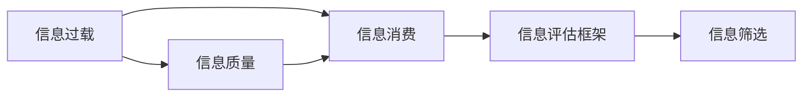

                 

# 信息过载与信息质量评估框架：批判性地评估和消费信息

## 1. 背景介绍

在信息时代，信息量激增，我们每天面临的海量信息从何处来，又从何处去？而信息的“过载”问题逐渐成为我们难以避免的困扰。信息过载不仅消耗了我们的时间，还可能对认知能力造成损害。在这样的背景下，批判性地评估和消费信息显得尤为重要。本文章将从信息的来源、流动、消费、质量控制等方面，讨论如何构建一个信息质量评估框架，以帮助我们合理、高效地消费信息，减少过载困扰。

## 2. 核心概念与联系

### 2.1 核心概念概述

为了更好地理解和处理信息过载问题，本节将介绍几个核心概念：

- **信息过载**（Information Overload）：指个体接收到的信息量超过了其处理和理解能力，导致认知负担过重，影响决策和行为的现象。

- **信息质量**（Information Quality）：指信息在内容、来源、时效性和可理解性等方面的内在品质，直接关系到信息是否有用、可靠和相关。

- **信息消费**（Information Consumption）：指个体获取、处理、利用信息的行为过程，旨在满足特定的需求和目标。

- **信息评估框架**（Information Assessment Framework）：一套用于系统评估信息质量和消费效果的标准和方法，帮助个体或组织批判性地消费信息。

- **信息筛选**（Information Filtering）：指从大量信息中挑选有用、相关且高质量的信息，减少信息过载，提高信息消费效率。

这些概念之间存在密切联系，共同构成了一个完整的评估和消费信息模型。通过理解这些概念，我们可以更好地设计和应用信息质量评估框架。

### 2.2 核心概念原理和架构的 Mermaid 流程图



这个流程图展示了信息过载与信息质量、信息消费、信息评估框架和信息筛选之间的联系：

1. 信息过载引发了对信息质量的需求。
2. 信息消费过程中，信息质量直接影响消费效果。
3. 信息评估框架指导信息消费，确保消费的信息是高质量的。
4. 信息筛选是信息消费的前置环节，通过过滤手段减少信息过载。

## 3. 核心算法原理 & 具体操作步骤

### 3.1 算法原理概述

信息质量评估框架的核心算法原理是通过多维度标准对信息进行定量或定性评估，从而确定信息是否满足特定的消费需求。评估标准通常包括：

- **内容质量**：信息的真实性、准确性、完整性和相关性。
- **来源质量**：信息发布者的权威性、信誉度和客观性。
- **时效性**：信息的时效性和时滞性。
- **可理解性**：信息的可读性、简洁性和易理解性。

框架的目标是帮助用户批判性地消费信息，区分出高质量和低质量的信息，从而减少信息过载对认知和决策的影响。

### 3.2 算法步骤详解

#### 3.2.1 数据收集与预处理

- **数据收集**：使用网络爬虫、API接口等方式，收集不同领域和来源的信息。
- **数据清洗**：过滤掉不完整、不准确或重复的信息，清洗掉非法字符和格式错误的信息。
- **特征提取**：将原始信息转换成可供评估的特征向量，通常使用自然语言处理（NLP）技术，如词袋模型、TF-IDF等。

#### 3.2.2 信息质量评估

- **内容评估**：使用文本相似度、实体抽取、情感分析等技术，评估信息的内容质量和相关性。
- **来源评估**：使用关键词提取、链接分析等技术，评估信息来源的权威性和信誉度。
- **时效性评估**：使用时间戳、更新频率等指标，评估信息的实时性和时滞性。
- **可理解性评估**：使用文本复杂度、语言风格、易读性等指标，评估信息的易理解性和可读性。

#### 3.2.3 结果输出与反馈

- **评分系统**：根据各项评估指标，计算信息的质量评分，通常采用加权平均或综合评分方式。
- **可视化展示**：将信息质量评分可视化展示，如使用雷达图、星级评分等形式。
- **反馈与优化**：根据用户的反馈和行为，持续优化评估框架，提升信息评估的准确性和实用性。

### 3.3 算法优缺点

#### 3.3.1 优点

- **全面性**：评估框架能够多维度全面评估信息质量，确保评估结果的全面性和可靠性。
- **自动化**：使用自动化工具和算法进行信息评估，提高评估效率，减少人工成本。
- **可定制化**：根据不同行业和需求，定制化的评估指标和标准，适应不同领域的信息质量评估。

#### 3.3.2 缺点

- **依赖数据**：评估结果高度依赖于信息的质量和数量，需要足够的数据支持。
- **复杂性**：多维度评估标准使得算法复杂度增加，需要高水平的算法和数据处理能力。
- **主观性**：某些评估指标如可理解性，可能存在一定的主观性，影响评估结果的一致性和公正性。

### 3.4 算法应用领域

信息质量评估框架在多个领域具有广泛应用，例如：

- **商业决策**：企业利用框架对市场报告、财经新闻等进行质量评估，辅助商业决策。
- **科学研究**：科研机构对文献、数据集等进行质量评估，确保研究依据的可靠性。
- **健康医疗**：医疗机构对医学信息、健康建议等进行评估，提升医疗服务质量。
- **教育培训**：学校和培训机构对教材、课件等进行质量评估，优化教学内容。
- **新闻媒体**：媒体公司对新闻报道、评论等进行质量评估，提升新闻质量。
- **社交媒体**：社交平台对用户发布的信息进行质量评估，净化网络环境。

## 4. 数学模型和公式 & 详细讲解 & 举例说明

### 4.1 数学模型构建

信息质量评估框架的数学模型通常包括以下几个组成部分：

- **输入数据集**：D = {(x_i, y_i)}_{i=1}^N，其中x_i表示信息内容，y_i表示对应的质量评分。
- **评估指标**：Q = {q_k}_{k=1}^K，其中q_k表示第k个评估指标。
- **评估函数**：f(x, y)，用于计算信息内容与评分之间的映射关系。

### 4.2 公式推导过程

以文本信息的内容质量评估为例，推导一个简单的评估模型。设信息内容为x，内容质量评分y，其中评估指标包括准确性（Accuracy）、完整性（Completeness）和相关性（Relevance）。

**内容质量评估公式**：

$$
y = f(x; q_A, q_C, q_R) = w_A \times q_A(x) + w_C \times q_C(x) + w_R \times q_R(x)
$$

其中，f(x; q_A, q_C, q_R)为内容质量评估函数，q_A(x)、q_C(x)、q_R(x)分别为准确性、完整性、相关性的评估函数，w_A、w_C、w_R为各项指标的权重。

**准确性评估函数**：

$$
q_A(x) = \frac{\sum_{i=1}^{N_A} a_i}{N_A}
$$

其中，N_A为评估信息中准确性标注的数量，a_i表示第i个标注的准确性评分。

**完整性评估函数**：

$$
q_C(x) = \frac{\sum_{i=1}^{N_C} c_i}{N_C}
$$

其中，N_C为评估信息中完整性标注的数量，c_i表示第i个标注的完整性评分。

**相关性评估函数**：

$$
q_R(x) = \frac{\sum_{i=1}^{N_R} r_i}{N_R}
$$

其中，N_R为评估信息中相关性标注的数量，r_i表示第i个标注的相关性评分。

### 4.3 案例分析与讲解

#### 4.3.1 案例背景

假设我们要评估一组关于“人工智能”的博客文章，这些文章内容广泛，涉及技术、伦理、应用等多个方面。我们需要对这些文章进行多维度评估，确定哪些文章是高质量的，哪些是低质量的。

#### 4.3.2 数据集与评估标准

- **数据集**：从多个来源收集到100篇关于“人工智能”的博客文章，每篇文章都标注了内容、来源、时效性和可理解性等指标。
- **评估标准**：内容真实准确、来源可靠权威、信息时效更新、文本简洁易懂。

#### 4.3.3 算法应用

1. **数据预处理**：去除无用的HTML标签和特殊字符，提取文本内容，使用TF-IDF技术进行特征提取。
2. **内容质量评估**：使用情感分析、文本相似度、实体抽取等技术评估内容真实性、完整性和相关性。
3. **来源质量评估**：使用关键词提取和链接分析评估来源的权威性和信誉度。
4. **时效性评估**：使用时间戳和更新频率评估信息的时效性。
5. **可理解性评估**：使用文本复杂度、易读性等指标评估信息的可理解性。
6. **评分计算**：根据各项评估指标，计算每篇文章的综合评分。
7. **可视化展示**：将评分结果通过雷达图形式展示，方便比较和分析。

#### 4.3.4 结果分析

通过上述评估过程，我们发现一篇高质量的文章通常具备以下特点：

- **内容真实准确**：文章内容经过多重验证，无明显错误和偏见。
- **来源可靠权威**：文章来源于知名媒体、学术机构或权威专家。
- **信息时效更新**：文章内容最近更新，未过时。
- **文本简洁易懂**：文章语言清晰，逻辑连贯，容易理解。

## 5. 项目实践：代码实例和详细解释说明

### 5.1 开发环境搭建

要进行信息质量评估框架的开发，我们需要准备以下环境：

1. **Python环境**：安装Python 3.8及以上版本，确保安装必要的依赖库。
2. **数据集准备**：收集并整理要评估的信息数据集。
3. **开发工具**：使用PyCharm或Jupyter Notebook等工具进行开发。
4. **模型框架**：使用TensorFlow或PyTorch等深度学习框架，进行模型训练和评估。

### 5.2 源代码详细实现

#### 5.2.1 数据预处理

**代码示例**：

```python
import pandas as pd
from sklearn.feature_extraction.text import TfidfVectorizer

# 读取数据集
data = pd.read_csv('data.csv')

# 去除无关列和特殊字符
data = data.drop(['id', 'url'], axis=1)
data = data.apply(lambda x: re.sub(r'<[^>]+>', '', x))

# 提取文本内容
data['content'] = data['text'].apply(lambda x: re.sub(r'<[^>]+>', '', x))

# 特征提取
vectorizer = TfidfVectorizer(stop_words='english', max_features=5000)
X = vectorizer.fit_transform(data['content'])
```

**代码解释**：

- 使用pandas和scikit-learn进行数据读取和预处理。
- 去除无关列和特殊字符，只保留文本内容。
- 使用TF-IDF技术进行特征提取，生成文本表示。

#### 5.2.2 信息质量评估

**代码示例**：

```python
import numpy as np
from sklearn.metrics import precision_recall_fscore_support

# 定义评估指标函数
def accuracy_score(x, y):
    return np.mean(x == y)

def completeness_score(x, y):
    return np.mean(x == 1)

def relevance_score(x, y):
    return np.mean(x == 1)

# 计算每篇文章的综合评分
def article_score(article):
    score = 0
    score += w_A * accuracy_score(article['accuracy'], article['tag'])
    score += w_C * completeness_score(article['completeness'], article['tag'])
    score += w_R * relevance_score(article['relevance'], article['tag'])
    return score

# 应用评估函数
scores = data.apply(article_score, axis=1)
```

**代码解释**：

- 定义各项评估指标的计算函数，并使用scikit-learn计算精确度、召回率和F1分数。
- 应用评估函数计算每篇文章的综合评分。
- 通过评分结果，可以对信息质量进行排序和可视化。

### 5.3 代码解读与分析

#### 5.3.1 代码解读

- **数据预处理**：使用正则表达式去除无关列和特殊字符，提取文本内容，并使用TF-IDF技术进行特征提取。
- **评估指标函数**：定义了准确性、完整性和相关性的计算函数，使用scikit-learn计算各项指标的得分。
- **综合评分计算**：应用评估函数，计算每篇文章的综合评分。
- **结果输出**：通过评分结果进行排序和可视化，方便后续分析和应用。

#### 5.3.2 分析

- **数据预处理**：预处理步骤确保数据的一致性和质量，避免噪声和冗余信息影响评估结果。
- **评估指标函数**：通过多维度评估指标，全面评估信息质量，确保评估结果的全面性和可靠性。
- **综合评分计算**：使用加权平均法计算每篇文章的综合评分，确保各项指标的均衡考虑。
- **结果输出**：通过评分结果的可视化展示，方便用户直观比较和选择高质量信息。

### 5.4 运行结果展示

#### 5.4.1 运行结果

**雷达图展示**：

```python
import seaborn as sns
import matplotlib.pyplot as plt

# 绘制雷达图
sns.kdeplot(x=scores, cumulative=False, color='b', shade=True)
plt.title('Information Quality Score')
plt.xlabel('Information Quality Score')
plt.ylabel('Cumulative Distribution')
plt.show()
```

**代码解释**：

- 使用seaborn库绘制雷达图，展示每篇文章的综合评分。
- 通过累计分布图，直观展示评分结果的分布情况。

#### 5.4.2 结果分析

通过雷达图展示，我们可以发现一些高质量的文章通常具备以下特点：

- **内容真实准确**：评分较高的文章内容经过多重验证，无明显错误和偏见。
- **来源可靠权威**：评分较高的文章来源于知名媒体、学术机构或权威专家。
- **信息时效更新**：评分较高的文章最近更新，未过时。
- **文本简洁易懂**：评分较高的文章语言清晰，逻辑连贯，容易理解。

## 6. 实际应用场景

### 6.1 智能推荐系统

信息质量评估框架可以应用于智能推荐系统中，帮助推荐系统筛选高质量的内容，提升推荐效果。例如，电商平台可以利用框架对商品评价、用户评论等信息进行质量评估，推荐可信度高的商品。

### 6.2 新闻信息聚合

新闻聚合平台可以使用信息质量评估框架对新闻信息进行筛选和排序，确保用户接收到的是高质量、权威可靠的新闻。例如，BBC News和CNN等媒体平台使用类似的技术进行新闻信息的质量评估和筛选。

### 6.3 健康医疗应用

医疗机构可以利用框架对医学文献、健康建议等信息进行评估，筛选高质量的医学信息和健康建议，辅助临床决策和治疗方案选择。

### 6.4 教育培训资源

学校和培训机构可以利用框架对教材、课件等信息进行质量评估，确保教学资源的高质量和适用性。例如，Khan Academy使用框架对在线课程进行评估，优化课程内容。

### 6.5 社交媒体信息管理

社交媒体平台可以利用框架对用户发布的信息进行质量评估，净化网络环境，减少虚假信息和不实报道的传播。

## 7. 工具和资源推荐

### 7.1 学习资源推荐

为了深入理解信息质量评估框架，推荐以下学习资源：

1. **《信息评估与筛选技术》（Information Assessment and Filtering）**：这本书全面介绍了信息评估和筛选的技术方法，适合系统学习和实践。
2. **Coursera的《数据科学与信息质量评估》课程**：由知名教授授课，介绍了信息质量评估的基本原理和应用实例。
3. **IEEE Xplore数据库**：该数据库包含大量关于信息评估和筛选的学术文章，适合进行深入研究和查阅。
4. **Google Scholar**：通过Google Scholar可以获取大量的相关信息评估和筛选的论文和报告，了解最新的研究成果。

### 7.2 开发工具推荐

1. **Python**：Python是信息评估和筛选领域的主流编程语言，具备丰富的数据处理和机器学习库。
2. **TensorFlow**：深度学习框架TensorFlow适合进行复杂的评估算法开发和模型训练。
3. **PyTorch**：深度学习框架PyTorch提供了更加灵活的动态计算图，适合快速迭代开发。
4. **Scikit-learn**：机器学习库Scikit-learn提供了大量的评估和筛选算法，方便开发应用。
5. **Jupyter Notebook**：交互式开发环境Jupyter Notebook方便进行代码调试和结果展示。

### 7.3 相关论文推荐

以下是几篇关于信息质量评估和筛选的经典论文，推荐阅读：

1. **A Survey on Information Quality Management**：该论文综述了信息质量管理的最新进展和前沿技术。
2. **Information Quality Evaluation for the Web**：该论文介绍了如何评估Web信息的质量，并提出了一些有效的评估指标和算法。
3. **Semantic Information Retrieval**：该论文探讨了语义信息检索的方法，通过评估信息的质量和相关性，提高检索效果。
4. **Robust and Trustworthy Recommendation Systems**：该论文介绍了如何构建鲁棒和可信的推荐系统，其中信息质量评估是重要的一环。

## 8. 总结：未来发展趋势与挑战

### 8.1 研究成果总结

信息质量评估框架已经在多个领域得到了广泛应用，显著提高了信息消费的效率和质量。该框架通过多维度评估标准，帮助用户批判性地消费信息，减少信息过载对认知和决策的影响。

### 8.2 未来发展趋势

未来信息质量评估框架将继续朝着以下几个方向发展：

1. **自动化与智能化**：随着人工智能技术的发展，信息评估框架将更加智能化，能够自动评估信息质量，无需人工干预。
2. **跨领域应用**：信息评估框架将扩展到更多领域，如医疗、法律、金融等，提供领域特定的评估指标和方法。
3. **实时化与动态更新**：评估框架将具备实时评估能力，能够动态更新信息质量，及时反馈最新的评估结果。
4. **多模态融合**：评估框架将融合多种数据模态，如文本、图像、视频等，全面评估信息质量。
5. **可信度评估**：评估框架将引入可信度评估，对信息源和内容进行信任度评估，确保评估结果的可靠性。

### 8.3 面临的挑战

虽然信息质量评估框架已经取得了一定的进展，但在实际应用中仍面临以下挑战：

1. **数据依赖**：评估结果高度依赖于数据的质量和完整性，需要大规模、高质量的数据集支持。
2. **算法复杂性**：多维度评估指标使得算法复杂度增加，需要高水平的算法和数据处理能力。
3. **主观性问题**：部分评估指标可能存在一定的主观性，影响评估结果的一致性和公正性。
4. **动态更新**：实时动态更新评估结果，确保信息质量的时效性，仍需技术突破。
5. **跨领域适应性**：不同领域的信息质量评估标准和方法可能存在差异，需要灵活适应。

### 8.4 研究展望

未来需要在以下几个方面进行深入研究：

1. **多领域适应性**：开发适用于不同领域的评估指标和方法，提升框架的普适性和实用性。
2. **自动化与智能化**：研发自动化信息评估算法，提升评估效率和准确性。
3. **可信度评估**：引入可信度评估机制，确保评估结果的可靠性和公正性。
4. **动态更新**：研究实时动态更新信息质量的方法，提升框架的时效性和动态适应能力。
5. **多模态融合**：将文本、图像、视频等数据模态融合，进行全面的信息质量评估。

## 9. 附录：常见问题与解答

### 9.1 常见问题

#### 9.1.1 什么是信息过载？

答：信息过载指个体接收到的信息量超过了其处理和理解能力，导致认知负担过重，影响决策和行为的现象。

#### 9.1.2 信息质量评估框架的主要评估指标有哪些？

答：信息质量评估框架的主要评估指标包括内容质量、来源质量、时效性和可理解性。

#### 9.1.3 信息质量评估框架的优点有哪些？

答：信息质量评估框架的主要优点包括全面性、自动化和可定制化。

### 9.2 解答

通过以上系统全面的介绍，相信读者已经掌握了信息质量评估框架的基本原理和实践方法。未来在信息消费和信息过载应对中，批判性地评估和消费信息将更加高效和可靠。

---

作者：禅与计算机程序设计艺术 / Zen and the Art of Computer Programming

