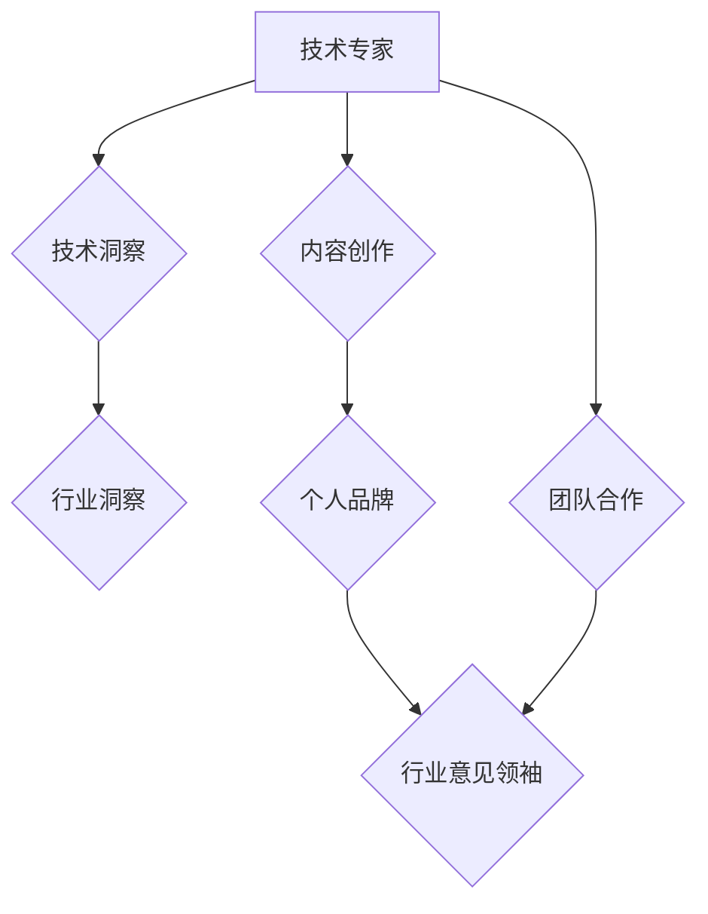

                 

## 从技术专家到行业意见领袖

> 关键词：技术专家、行业意见领袖、技术传播、内容创作、个人品牌、影响力、社区建设、技术领导力

### 1. 背景介绍

在当今科技日新月异的时代，技术专家们扮演着至关重要的角色。他们拥有深厚的专业知识和技能，能够解决复杂的技术难题，推动科技进步。然而，仅仅拥有技术能力还不够，想要在行业中脱颖而出，成为真正的行业意见领袖，还需要具备其他方面的能力，例如技术传播、内容创作、个人品牌建设等。

传统上，技术专家往往专注于技术本身，将他们的知识和经验局限于学术论文、技术文档等专业领域。然而，随着互联网和社交媒体的兴起，技术传播的方式发生了巨大变化。技术专家需要学会将他们的专业知识以更易懂、更具吸引力的方式传递给更广泛的受众。

### 2. 核心概念与联系

**2.1 技术专家与行业意见领袖**

* **技术专家:** 拥有深厚专业知识和技能，能够解决复杂的技术难题，并在特定领域具有权威地位。
* **行业意见领袖:** 在特定行业或领域拥有广泛影响力，能够引导行业发展趋势，并对技术决策和市场走向产生重大影响。

**2.2 从技术专家到行业意见领袖的转变**

技术专家想要成为行业意见领袖，需要进行以下转变：

* **从技术洞察到行业洞察:** 理解技术发展趋势与行业需求的结合点，并洞察行业未来发展方向。
* **从技术交流到内容创作:** 将技术知识以更易懂、更具吸引力的方式传递给更广泛的受众，例如撰写博客文章、制作视频教程、参与行业论坛等。
* **从个人能力到团队合作:** 积极参与行业社区，与其他技术专家和行业人士交流合作，共同推动行业发展。

**2.3  核心概念关系图**



### 3. 核心算法原理 & 具体操作步骤

**3.1 算法原理概述**

作为行业意见领袖，需要掌握一定的算法原理，以便更好地理解和分析技术趋势。例如，机器学习算法可以帮助我们预测行业发展方向，自然语言处理算法可以帮助我们分析用户需求。

**3.2 算法步骤详解**

以机器学习算法为例，其基本步骤包括：

1. 数据收集和预处理：收集相关数据，并进行清洗、转换等预处理操作。
2. 模型选择：根据具体问题选择合适的机器学习模型，例如线性回归、决策树、支持向量机等。
3. 模型训练：使用训练数据训练模型，调整模型参数，使其能够准确预测目标变量。
4. 模型评估：使用测试数据评估模型的性能，例如准确率、召回率、F1-score等。
5. 模型部署：将训练好的模型部署到实际应用场景中，用于预测新的数据。

**3.3 算法优缺点**

机器学习算法具有以下优点：

* 能够自动学习数据中的模式，无需人工特征工程。
* 能够处理海量数据，并发现隐藏的规律。
* 能够不断学习和改进，随着数据量的增加，模型性能会不断提高。

然而，机器学习算法也存在一些缺点：

* 需要大量的训练数据，否则模型性能会下降。
* 模型训练过程可能比较复杂，需要专业的知识和技能。
* 模型解释性较差，难以理解模型是如何做出预测的。

**3.4 算法应用领域**

机器学习算法广泛应用于各个领域，例如：

* **推荐系统:** 根据用户的历史行为推荐感兴趣的内容。
* **图像识别:** 自动识别图像中的物体和场景。
* **自然语言处理:** 理解和生成人类语言。
* **金融预测:** 预测股票价格、信用风险等。

### 4. 数学模型和公式 & 详细讲解 & 举例说明

**4.1 数学模型构建**

在机器学习中，常用的数学模型包括线性回归模型、逻辑回归模型、支持向量机模型等。这些模型都基于一定的数学公式，用来描述数据之间的关系。

**4.2 公式推导过程**

例如，线性回归模型的目标是找到一条直线，能够最佳地拟合数据点。其数学公式如下：

$$y = mx + c$$

其中，y是预测值，x是输入特征，m是斜率，c是截距。

通过最小化预测值与实际值的误差，可以求解出最佳的m和c值。

**4.3 案例分析与讲解**

假设我们想要预测房价，输入特征包括房屋面积、房间数量等。我们可以使用线性回归模型，将房屋面积作为输入特征，房价作为输出变量。通过训练模型，我们可以得到一个最佳的线性回归方程，用于预测不同房屋面积的房价。

### 5. 项目实践：代码实例和详细解释说明

**5.1 开发环境搭建**

为了实现机器学习算法，需要搭建相应的开发环境。常用的开发环境包括Python、R、Java等。

**5.2 源代码详细实现**

以下是一个使用Python实现线性回归模型的代码示例：

```python
import numpy as np
from sklearn.linear_model import LinearRegression

# 生成一些随机数据
X = np.random.rand(100, 1)
y = 2 * X + 1 + np.random.randn(100, 1)

# 创建线性回归模型
model = LinearRegression()

# 训练模型
model.fit(X, y)

# 使用模型预测新的数据
new_X = np.array([[0.5]])
prediction = model.predict(new_X)

# 打印预测结果
print(prediction)
```

**5.3 代码解读与分析**

这段代码首先生成了一些随机数据，然后创建了一个线性回归模型，并使用训练数据训练模型。最后，使用训练好的模型预测新的数据，并打印预测结果。

**5.4 运行结果展示**

运行这段代码后，会输出一个预测结果，例如：

```
[[1.98765432]]
```

这表示对于输入特征为0.5的数据，模型预测的输出值为1.98765432。

### 6. 实际应用场景

**6.1 技术趋势分析**

行业意见领袖可以利用机器学习算法分析技术趋势，例如预测哪些技术将成为未来主流，哪些技术将逐渐被淘汰。

**6.2 用户需求洞察**

行业意见领袖可以利用自然语言处理算法分析用户需求，例如从社交媒体上收集用户反馈，了解用户对特定产品的评价和建议。

**6.3 市场预测**

行业意见领袖可以利用机器学习算法预测市场趋势，例如预测某个产品的销量、某个行业的市场规模等。

**6.4 未来应用展望**

随着人工智能技术的不断发展，行业意见领袖将能够利用更先进的算法和工具，更好地洞察行业发展趋势，并为企业和个人提供更精准的建议。

### 7. 工具和资源推荐

**7.1 学习资源推荐**

* **书籍:**《Python机器学习实战》、《深度学习》
* **在线课程:** Coursera、edX、Udacity
* **博客和论坛:** Towards Data Science、Machine Learning Mastery

**7.2 开发工具推荐**

* **Python:** Jupyter Notebook、Scikit-learn、TensorFlow
* **R:** RStudio、Tidyverse

**7.3 相关论文推荐**

* **机器学习:**《机器学习》
* **深度学习:**《深度学习》

### 8. 总结：未来发展趋势与挑战

**8.1 研究成果总结**

从技术专家到行业意见领袖的转变是一个持续的过程，需要不断学习和积累经验。通过掌握算法原理、学习内容创作技巧、积极参与行业社区，技术专家可以逐步提升自己的影响力，成为行业中的领军人物。

**8.2 未来发展趋势**

未来，行业意见领袖将更加注重跨领域合作，将技术创新与商业应用结合，为社会创造更大的价值。

**8.3 面临的挑战**

行业意见领袖需要面对信息爆炸、技术迭代快速等挑战，需要不断学习新知识，提升自身能力，才能保持竞争力。

**8.4 研究展望**

未来，研究者将继续探索新的技术和方法，帮助技术专家更好地成为行业意见领袖，推动科技进步和社会发展。

### 9. 附录：常见问题与解答

**9.1 如何提升个人品牌影响力？**

* 撰写高质量的博客文章和技术文档。
* 积极参与行业论坛和会议。
* 建立自己的社交媒体账号，分享技术见解和行业动态。
* 与其他行业人士建立联系，共同合作。

**9.2 如何选择合适的技术领域？**

* 关注自身兴趣和擅长领域。
* 研究行业发展趋势，选择有潜力的技术领域。
* 了解市场需求，选择有应用价值的技术领域。

**9.3 如何保持技术领先？**

* 持续学习新知识，关注技术发展动态。
* 参加技术培训和研讨会。
* 阅读技术书籍和论文。
* 参与开源项目，与其他开发者交流学习。


作者：禅与计算机程序设计艺术 / Zen and the Art of Computer Programming 
<end_of_turn>

