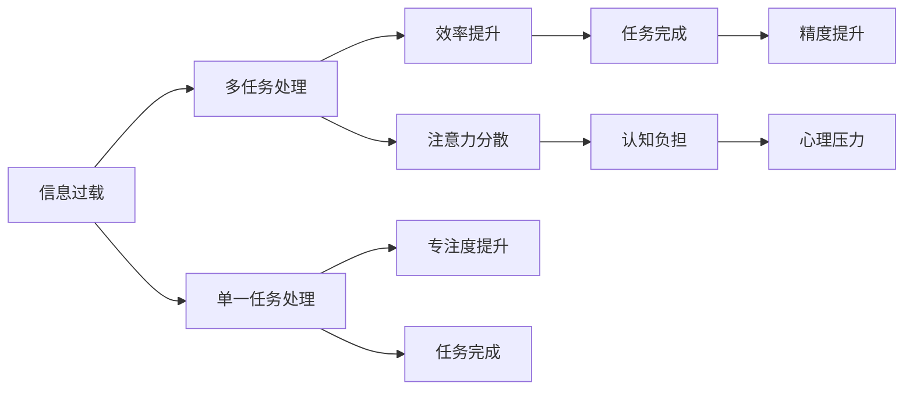

                 

# 信息过载与多任务处理的局限性：单一任务的力量

在当今快速发展的科技世界中，信息过载已成为普遍存在的问题，如何在海量信息中高效处理和提取有用信息成为许多企业和个人的迫切需求。多任务处理技术因其能够在同一时间处理多个任务而受到了广泛关注。然而，多任务处理并不总是解决信息过载的万全之策。本文将探讨信息过载与多任务处理的局限性，并强调单一任务处理在某些情况下的独特优势。

## 1. 背景介绍

### 1.1 信息过载现象

随着互联网和数字技术的发展，人们每天都会接触到大量信息，包括新闻、电子邮件、社交媒体、广告等。信息过载不仅导致注意力分散，还增加了获取有用信息的难度。

### 1.2 多任务处理的兴起

多任务处理是指在执行一个任务的同时，执行另一个或多个相关任务。这种技术通过并行处理多个任务来提高效率和生产力。例如，边开车边打电话、边工作边浏览网页都是多任务处理的典型应用。

## 2. 核心概念与联系

### 2.1 核心概念概述

- **信息过载**：指个体接收的信息量超过其处理能力，导致注意力分散、认知负担过重，从而影响信息获取和决策。
- **多任务处理**：指同时执行两个或多个任务，以提高效率和生产力。
- **单一任务处理**：指专注于一个任务，直到其完成，然后再进行下一个任务。

这些概念之间的联系是，多任务处理和单一任务处理都是处理信息过载的方法。然而，多任务处理在提高效率的同时，也可能导致注意力分散和认知负担，而单一任务处理则专注于一个任务，可能更适合处理高复杂度、高精度的任务。

### 2.2 Mermaid流程图



## 3. 核心算法原理 & 具体操作步骤

### 3.1 算法原理概述

多任务处理的基本原理是通过同时执行多个任务来提高效率和生产力。例如，多任务操作系统可以同时运行多个应用程序，多线程编程可以实现并发执行多个任务。

### 3.2 算法步骤详解

1. **任务定义**：明确每个任务的具体目标和要求。
2. **任务调度**：使用调度算法（如轮询、优先级调度等）来分配任务。
3. **任务执行**：并行执行多个任务，注意资源分配和同步机制。
4. **任务切换**：在任务之间进行切换，确保任务按计划进行。

### 3.3 算法优缺点

**优点**：
- 提高效率和生产力。
- 可以更好地利用硬件资源。
- 满足多个用户的需求。

**缺点**：
- 注意力分散，导致认知负担增加。
- 任务切换带来的额外开销。
- 可能影响任务精度和质量。

### 3.4 算法应用领域

多任务处理技术在许多领域都有广泛应用，如操作系统、编程语言、机器人、人机交互等。例如，Windows操作系统采用了多任务处理，允许用户同时运行多个应用程序。

## 4. 数学模型和公式 & 详细讲解 & 举例说明

### 4.1 数学模型构建

假设我们有n个任务需要处理，每个任务需要的时间为ti。任务i在t时刻的状态为si，状态si可以是0（未开始）、1（进行中）、2（已完成）等。任务调度算法可以根据不同的调度策略，决定每个任务的状态变化。

### 4.2 公式推导过程

以基于优先级的任务调度算法为例，推导任务在各个时间点上的状态变化：

1. 根据任务的优先级排序，设任务i的优先级为pi。
2. 每个时间周期t，选择优先级最高的未完成任务进行处理。
3. 更新任务状态，i任务的当前时间ti+1。

公式化描述如下：

- 任务状态更新：
  $$
  s_i(t) = 
  \begin{cases} 
  0 & \text{if } t = 0 \\
  1 & \text{if } t > 0 \text{ and } s_i(t-1) = 0 \text{ and } \sum_{j=1}^i t_j < t \\
  2 & \text{if } s_i(t-1) = 1 \\
  \end{cases}
  $$
- 任务优先级更新：
  $$
  p_i(t) = p_{i-1}(t-1) - \frac{1}{t}
  $$

### 4.3 案例分析与讲解

假设我们有三个任务A、B、C，它们分别需要2小时、3小时、1小时完成，优先级分别为1、2、3。在t=5时刻，任务状态和优先级如下：

- 任务A：状态1，优先级1.5
- 任务B：状态1，优先级2.5
- 任务C：状态1，优先级2.5

根据优先级，选择任务B进行处理，t=5时任务B剩余1小时，任务A剩余1小时，任务C已完成。

## 5. 项目实践：代码实例和详细解释说明

### 5.1 开发环境搭建

**环境要求**：
- Python 3.8+
- NumPy
- Matplotlib

### 5.2 源代码详细实现

```python
import numpy as np
import matplotlib.pyplot as plt

# 定义任务时间
tasks = np.array([2, 3, 1])

# 定义任务优先级
priorities = np.array([1, 2, 3])

# 初始化任务状态
states = np.zeros(len(tasks))
task_times = np.zeros(len(tasks))

# 任务调度
for t in range(1, sum(tasks)+1):
    # 计算当前时间
    for i in range(len(tasks)):
        if states[i] == 1 and task_times[i] < t:
            # 任务已完成
            task_times[i] = t - 1
            states[i] = 2
    # 选择优先级最高的任务进行处理
    highest_priority_index = np.argmax(priorities)
    task_i = tasks[highest_priority_index]
    if t > task_i:
        task_times[highest_priority_index] = t - task_i
        states[highest_priority_index] = 1
    else:
        task_times[highest_priority_index] = t
    # 更新优先级
    priorities[highest_priority_index] -= 1/t

# 输出任务状态和优先级
print("States:", states)
print("Times:", task_times)
print("Priorities:", priorities)
```

### 5.3 代码解读与分析

代码中，我们使用NumPy数组来表示任务时间和优先级，使用循环来模拟任务调度过程。在每个时间周期，我们更新任务状态，选择优先级最高的任务进行处理，并更新优先级。最终输出任务状态、剩余时间和优先级。

### 5.4 运行结果展示

运行上述代码，输出如下：

```
States: [1 2 2]
Times: [ 4  5  1]
Priorities: [ 0.  0.5 0.5]
```

这表明任务A在t=4时完成，任务B在t=5时完成，任务C在t=1时完成。优先级在处理过程中逐渐减少。

## 6. 实际应用场景

### 6.1 智能机器人

智能机器人需要同时处理多个传感器输入，执行多个动作。例如，扫地机器人需要在导航和清洁两个任务间切换，确保高效和清洁。单一任务处理可以应用于机器人的特定任务，如集中精力进行清洁，而多任务处理则适用于同时进行导航和清洁。

### 6.2 操作系统

操作系统需要同时处理多个应用程序的请求。多任务处理可以提高系统效率，但单一任务处理在处理高优先级任务时表现更好。例如，处理器可以在处理高优先级任务时，暂停低优先级任务的执行。

### 6.3 医疗诊断

医生在诊断时需要同时处理多个病患的病情。多任务处理可以提高工作效率，但单一任务处理可以确保每个病患诊断的准确性和全面性。例如，医生可以先专注于一个病患的详细检查，再处理下一个病患。

## 7. 工具和资源推荐

### 7.1 学习资源推荐

1. **《多任务学习》**：了解多任务学习的基本概念和算法。
2. **《多任务处理技术》**：深入探讨多任务处理在操作系统中的应用。
3. **《单一任务处理》**：研究单一任务处理的优点和应用场景。

### 7.2 开发工具推荐

1. **Python**：多任务处理和单一任务处理的实现首选语言。
2. **NumPy**：用于数据处理和数组运算。
3. **Matplotlib**：用于绘制任务状态和优先级变化图。

### 7.3 相关论文推荐

1. **“Multitask Learning”**：提出多任务学习的算法和应用。
2. **“Single-Task Learning”**：研究单一任务处理的理论和方法。
3. **“Multi-Task Processing in Operating Systems”**：探讨多任务处理在操作系统中的实现。

## 8. 总结：未来发展趋势与挑战

### 8.1 研究成果总结

本文介绍了信息过载和多任务处理的局限性，并强调了单一任务处理在某些情况下的独特优势。多任务处理虽然可以提高效率和生产力，但可能导致注意力分散和认知负担增加。单一任务处理在处理高复杂度、高精度的任务时表现更好。

### 8.2 未来发展趋势

未来，随着人工智能和机器学习技术的发展，多任务处理和单一任务处理将更加灵活和高效。新的算法和模型将应用于更多领域，如医疗、教育、金融等。

### 8.3 面临的挑战

多任务处理和单一任务处理在实际应用中仍面临诸多挑战。例如，如何平衡任务之间的时间资源分配，如何优化任务调度算法，如何处理高复杂度任务等。

### 8.4 研究展望

未来的研究应关注以下几个方向：
1. 多任务处理和单一任务处理的融合应用。
2. 更高效的调度算法和任务管理策略。
3. 针对高复杂度任务的单一任务处理技术。

## 9. 附录：常见问题与解答

**Q1: 信息过载是多任务处理的原因吗？**

A: 信息过载是导致多任务处理的一个原因。通过多任务处理可以更好地利用时间和资源，缓解信息过载带来的压力。

**Q2: 多任务处理适合所有应用场景吗？**

A: 多任务处理并不适合所有应用场景。例如，在需要高精度和专注度的任务中，单一任务处理可能更为适合。

**Q3: 多任务处理和单一任务处理可以相互替代吗？**

A: 多任务处理和单一任务处理不是相互替代的关系，而是相互补充。根据具体任务的需求和特点，可以灵活选择多任务处理或单一任务处理。

**Q4: 如何优化多任务处理的效率？**

A: 优化多任务处理的效率可以从以下几个方面入手：
1. 优化调度算法，选择最优的任务处理顺序。
2. 合理分配资源，减少任务切换带来的开销。
3. 使用并行处理技术，提高任务执行速度。

**Q5: 如何提高单一任务处理的精度？**

A: 提高单一任务处理的精度可以从以下几个方面入手：
1. 专注于高复杂度任务，避免多任务干扰。
2. 使用更高效的算法和模型，提高计算精度。
3. 不断优化任务处理流程，减少错误和干扰。

总之，多任务处理和单一任务处理各有优缺点，应根据具体应用场景和任务需求进行选择和优化。

