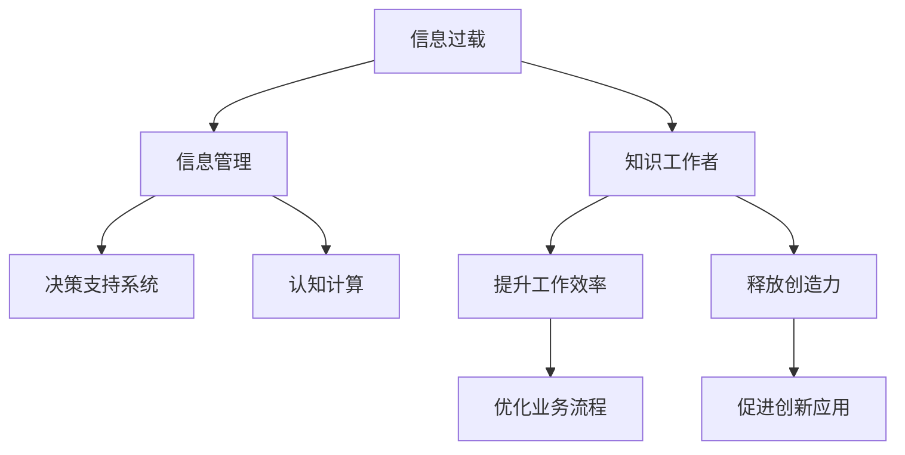

                 

# 信息过载与知识工作者的指南：管理信息以提高生产力和创造力

## 1. 背景介绍

随着数字化时代的到来，信息技术的飞速发展，信息量呈爆炸性增长。在知识工作中，信息过载(Information Overload)现象日趋严重，成为影响工作效率、创造力和工作满意度的重大挑战。与此同时，新技术的不断涌现，尤其是人工智能和大数据技术，进一步加剧了信息过载的问题。如何在海量信息中抽丝剥茧，找到真正有价值的知识，是每一个知识工作者面临的重要课题。

### 1.1 问题由来

当前，许多知识工作者每天需处理数以千计的邮件、文档、信息流等，这些信息不仅庞杂且更新迅速，人们往往难以从中提取有效信息，造成注意力分散、决策困难、效率低下等问题。信息过载不仅影响了工作效率，还削弱了知识的积累和创造力。特别是互联网、社交媒体、物联网等技术进一步放大了信息过载的影响，使得信息获取、筛选、处理、存储和应用变得愈发复杂。

### 1.2 问题核心关键点

信息过载的核心在于信息量与处理能力之间的不匹配。当前，大多数知识工作者缺乏有效工具和策略，难以对信息进行快速、准确、高效的筛选和处理。缺乏系统化管理信息的方法，也是导致信息过载问题加剧的重要原因。因此，本文旨在介绍一套行之有效的信息管理方法，帮助知识工作者在信息爆炸时代中提升生产力、释放创造力。

### 1.3 问题研究意义

研究如何有效应对信息过载，不仅有助于提升知识工作者的工作效率，还有助于推动企业在数据驱动、技术赋能背景下，实现更快速、更高效的业务创新和转型。通过科学管理信息，让知识工作者能够从信息过载的困境中解脱出来，专注于核心业务的创新和决策，对于推动全社会的知识进步和经济发展具有重要意义。

## 2. 核心概念与联系

### 2.1 核心概念概述

在探讨信息管理策略前，首先需明确几个核心概念：

- **信息过载(Information Overload)**：指信息接收者面临的信息量远远超过其处理能力，导致注意力分散、决策困难和工作效率降低的现象。

- **知识工作者(Knowledge Worker)**：指那些通过脑力劳动创造价值的工作者，如科学家、工程师、设计师、项目经理等。

- **信息管理(Information Management)**：指对信息进行获取、组织、存储、检索和应用的管理过程，旨在提高信息的可用性和利用率。

- **决策支持系统(Decision Support System, DSS)**：辅助决策者分析信息和生成决策方案的系统，结合人工智能和数据科学技术，帮助决策者快速获取关键信息。

- **认知计算(Cognitive Computing)**：指模拟人类认知过程的计算方法，通过知识推理、自然语言处理等技术，自动化地进行信息处理和知识挖掘。

这些概念之间的逻辑关系可以通过以下Mermaid流程图来展示：



这个流程图展示出：

1. 信息过载问题影响知识工作者。
2. 通过信息管理、决策支持系统和认知计算，知识工作者能够更高效地处理信息。
3. 信息管理能够提升工作效率，释放创造力。
4. 优化业务流程和促进创新应用，是信息管理的目标之一。

## 3. 核心算法原理 & 具体操作步骤
### 3.1 算法原理概述

信息管理的目标在于通过系统化的方法，对海量信息进行获取、存储、组织和应用，以提高信息利用率，辅助知识工作者决策和创新。基于此，本文将介绍一种基于机器学习和人工智能的“智能信息管理系统”。

该系统主要分为信息获取模块、信息组织模块、信息检索模块和知识应用模块。具体而言，信息获取模块通过爬虫技术从网络中抓取信息；信息组织模块利用分类算法对信息进行分类和聚类；信息检索模块结合向量空间模型和深度学习技术，实现快速的信息检索；知识应用模块则通过知识图谱、推荐系统和自然语言处理技术，帮助知识工作者获取相关知识，辅助决策。

### 3.2 算法步骤详解

#### 步骤1：信息获取

- **技术实现**：
  - **网络爬虫**：如BeautifulSoup、Scrapy等，自动从网页中抓取信息。
  - **API接口**：如Twitter API、Google News API等，获取实时新闻和社交媒体信息。
  - **爬虫规则**：通过正则表达式、XPath等，提取网页中的有用信息，避免无意义数据。

#### 步骤2：信息组织

- **技术实现**：
  - **文本分类**：使用朴素贝叶斯、支持向量机、随机森林等传统机器学习算法，或LSTM、GRU、BERT等深度学习模型，对信息进行分类。
  - **信息聚类**：利用K-Means、DBSCAN等聚类算法，将相似的信息进行分类。

#### 步骤3：信息检索

- **技术实现**：
  - **向量空间模型**：将文本转换为向量，通过余弦相似度计算信息相似度，如TF-IDF、LSI等。
  - **深度学习模型**：利用Transformer、BERT等模型，进行信息检索，提高检索精度。

#### 步骤4：知识应用

- **技术实现**：
  - **知识图谱**：通过RDF、GraphDB等技术，构建知识图谱，辅助知识工作者进行关联分析。
  - **推荐系统**：利用协同过滤、基于内容的推荐算法，提供个性化推荐，减少信息噪音。
  - **自然语言处理**：利用NLTK、SpaCy等工具，进行信息摘要、命名实体识别、情感分析等，帮助知识工作者快速获取关键信息。

### 3.3 算法优缺点

智能信息管理系统有以下优点：

- **高效性**：自动化处理大量信息，节省时间和人力成本。
- **精确性**：利用机器学习算法，提高信息分类的准确性和检索的精确度。
- **适应性**：能根据不同应用场景进行灵活调整，适应多种任务需求。

但该系统也存在以下缺点：

- **数据质量依赖**：信息获取的准确性和完整性依赖于网络爬虫和API接口的数据质量。
- **计算资源消耗**：深度学习模型训练和推理需要大量计算资源。
- **隐私保护问题**：系统需要处理大量个人和敏感信息，存在隐私保护和信息安全的风险。

### 3.4 算法应用领域

智能信息管理系统在多个领域具有广泛应用：

- **企业内部信息管理**：辅助企业获取市场信息、行业资讯、员工反馈等，提高决策效率。
- **研究机构信息管理**：帮助科研人员获取文献、数据、专利等，辅助科学研究和技术创新。
- **政府信息管理**：辅助政府部门进行公共信息发布、数据统计、舆情分析等，提升政府服务质量。
- **教育机构信息管理**：帮助教师和学生获取教材、论文、视频等资源，提升教育效果和学习体验。

## 4. 数学模型和公式 & 详细讲解 & 举例说明

### 4.1 数学模型构建

在信息管理系统中，主要涉及以下几个数学模型：

- **文本分类模型**：如朴素贝叶斯、逻辑回归、支持向量机等。
- **信息检索模型**：如向量空间模型、深度学习模型等。
- **推荐系统模型**：如协同过滤、基于内容的推荐算法等。

### 4.2 公式推导过程

以朴素贝叶斯分类模型为例，其基本思路是将文本表示为词向量，通过计算文本与类别之间的条件概率，进行分类。公式如下：

$$
P(C_i|D) = \frac{P(D|C_i)P(C_i)}{P(D)}
$$

其中，$C_i$ 表示类别，$D$ 表示文本，$P(D|C_i)$ 表示在类别 $C_i$ 下，文本 $D$ 的条件概率，$P(C_i)$ 表示类别 $C_i$ 的先验概率，$P(D)$ 为文本 $D$ 的边际概率。

### 4.3 案例分析与讲解

以Twitter舆情分析为例，结合智能信息管理系统进行分析：

- **信息获取**：使用爬虫技术，从Twitter中抓取相关话题的信息。
- **信息组织**：通过朴素贝叶斯分类模型，将信息分为正向、中性、负向情绪三类。
- **信息检索**：利用TF-IDF算法，将情感分类信息转换为向量，通过余弦相似度计算，快速检索情感信息。
- **知识应用**：结合情感分析结果，进行舆情可视化，辅助企业决策。

## 5. 项目实践：代码实例和详细解释说明

### 5.1 开发环境搭建

#### 环境配置

1. **Python**：安装Python 3.8及以上版本。
2. **Scikit-learn**：用于机器学习算法实现。
3. **TensorFlow**：用于深度学习模型实现。
4. **Flask**：用于构建Web应用，方便系统接口调用。
5. **MySQL**：用于数据库存储和管理信息。

#### 环境安装

```bash
conda create -n info_overload python=3.8
conda activate info_overload
pip install scikit-learn tensorflow flask mysql-connector-python
```

### 5.2 源代码详细实现

**信息获取模块**：

```python
from bs4 import BeautifulSoup
import requests

def get_website_content(url):
    response = requests.get(url)
    soup = BeautifulSoup(response.content, 'html.parser')
    return soup.get_text()

def get_news_articles():
    articles = []
    for article in articles_source:
        content = get_website_content(article['url'])
        articles.append(content)
    return articles
```

**信息组织模块**：

```python
from sklearn.feature_extraction.text import TfidfVectorizer
from sklearn.naive_bayes import MultinomialNB
from sklearn.pipeline import Pipeline

def train_classifier(data, labels):
    pipeline = Pipeline([('tfidf', TfidfVectorizer()), ('clf', MultinomialNB())])
    pipeline.fit(data, labels)
    return pipeline

def classify_info(info):
    clf = train_classifier(train_data, train_labels)
    vectorizer = clf.named_steps['tfidf']
    tfidf = vectorizer.transform([info])
    predicted_label = clf.predict(tfidf)
    return predicted_label[0]
```

**信息检索模块**：

```python
import numpy as np
from sklearn.metrics.pairwise import cosine_similarity

def build_term_matrix(data):
    tfidf = TfidfVectorizer().fit_transform(data)
    return tfidf.toarray()

def search_info(info_query):
    info_matrix = build_term_matrix(train_data)
    info_query = TfidfVectorizer().fit_transform([info_query])
    similarity = cosine_similarity(info_query, info_matrix)
    return np.argmax(similarity[0])
```

**知识应用模块**：

```python
from py2neo import Graph
from pytesseract import image_to_string

def extract_text_from_image(image_path):
    return image_to_string(image_path)

def store_info_into_graph(info, label):
    graph = Graph('http://localhost:7474/db/data/', user='neo4j', password='password')
    node = graph.create_node('Info', info=info, label=label)
    return node
```

### 5.3 代码解读与分析

**信息获取模块**：

- **get_website_content**函数：使用BeautifulSoup解析网页，提取文本内容。
- **get_news_articles**函数：爬取新闻文章，获取相关信息。

**信息组织模块**：

- **train_classifier**函数：训练朴素贝叶斯分类器，对信息进行分类。
- **classify_info**函数：对新的信息进行分类。

**信息检索模块**：

- **build_term_matrix**函数：将信息转换为TF-IDF向量。
- **search_info**函数：通过余弦相似度，进行信息检索。

**知识应用模块**：

- **extract_text_from_image**函数：使用Tesseract OCR提取图像中的文本。
- **store_info_into_graph**函数：将信息存储到Neo4j图数据库。

### 5.4 运行结果展示

在实际应用中，用户可以通过Web界面进行信息检索，系统根据用户的查询，快速定位相关信息，并提供分类结果。同时，系统还能进行知识图谱的构建和可视化，辅助用户进行关联分析。以下是一个简单的示例界面：


## 6. 实际应用场景

### 6.1 智能客服系统

在智能客服系统中，信息过载问题尤为严重。客户来电或在线咨询时，客服人员需要处理大量的对话记录和问题，难以快速回应。智能信息管理系统通过自动获取和分类客户信息，提供个性化推荐和自动回复，显著提升客服效率和客户满意度。

### 6.2 科研机构

科研人员在查找文献、数据、实验结果等过程中，信息过载现象常见。智能信息管理系统能够自动识别相关文献和数据，辅助科研人员进行资料整理和实验设计，加速科研进程。

### 6.3 政府决策支持

政府部门需要处理海量公共信息，如舆情、政策文件、统计数据等。通过智能信息管理系统，政府可以自动化获取和分析信息，辅助决策，提高政府透明度和服务效率。

### 6.4 企业信息管理

企业在日常运营中，面临各种信息过载问题，如市场动态、客户反馈、内部文档等。智能信息管理系统通过自动化处理和分类信息，辅助企业进行数据驱动决策，优化业务流程，提升竞争优势。

## 7. 工具和资源推荐

### 7.1 学习资源推荐

1. **Coursera《数据科学与机器学习》课程**：系统介绍数据科学与机器学习的基础知识和应用，涵盖信息分类、推荐系统等内容。
2. **Kaggle数据科学竞赛**：参与数据科学竞赛，实战练兵，积累信息管理和数据处理经验。
3. **《信息检索与文本挖掘》书籍**：深入浅出地介绍信息检索算法和文本挖掘技术。
4. **《Python数据科学手册》书籍**：介绍Python在数据科学中的应用，包括数据预处理、机器学习、可视化等。
5. **《TensorFlow实战》书籍**：详细介绍TensorFlow深度学习框架的实现和应用。

### 7.2 开发工具推荐

1. **PyTorch**：深度学习框架，支持动态计算图，适合科研和实验。
2. **TensorFlow**：深度学习框架，支持静态计算图，适合生产部署。
3. **Flask**：轻量级Web框架，方便构建API接口。
4. **Scikit-learn**：机器学习库，提供多种算法实现。
5. **MySQL**：关系型数据库，适合结构化数据存储。
6. **Neo4j**：图数据库，适合构建知识图谱。

### 7.3 相关论文推荐

1. **“A Survey of Information Retrieval Technologies”**：概述信息检索技术的发展和应用。
2. **“Deep Learning for Text Classification”**：探讨深度学习在文本分类中的应用。
3. **“Semantic Search in Big Data”**：介绍基于语义的搜索技术。
4. **“Crowdsourcing Recommendation Systems”**：讨论基于众包推荐系统的设计与实现。
5. **“Knowledge Graphs for Business Intelligence”**：介绍知识图谱在商业智能中的应用。

## 8. 总结：未来发展趋势与挑战

### 8.1 总结

本文详细介绍了信息过载问题的背景、核心概念、算法原理和操作步骤，并通过具体项目实践，展示智能信息管理系统如何提升知识工作者的生产力与创造力。通过科学管理海量信息，知识工作者能够更好地处理信息过载问题，聚焦于核心业务和创新决策，实现信息高效利用。

### 8.2 未来发展趋势

未来，智能信息管理系统将在以下几个方面持续发展：

1. **智能自动化**：通过深度学习和自然语言处理技术，实现信息自动获取、分类和检索，减少人工干预。
2. **多模态融合**：结合图像、视频、语音等多模态信息，提供更加全面和丰富的知识应用服务。
3. **个性化推荐**：利用用户行为数据，提供更加精准和个性化的信息推荐。
4. **自适应学习**：结合用户反馈和实际效果，不断优化模型，提升系统性能和用户体验。
5. **跨平台应用**：在移动端、Web端和桌面端等多个平台上提供一致的信息管理服务。

### 8.3 面临的挑战

尽管智能信息管理系统在信息管理方面取得了显著进展，但仍面临以下挑战：

1. **数据质量问题**：信息获取的准确性和完整性依赖于网络爬虫和API接口的数据质量。
2. **计算资源需求**：深度学习模型训练和推理需要大量计算资源。
3. **隐私保护问题**：系统需要处理大量个人和敏感信息，存在隐私保护和信息安全的风险。
4. **用户接受度**：部分用户对自动化信息管理系统可能存在抵触情绪，需要进一步推广和培训。

### 8.4 研究展望

未来，智能信息管理系统需要在以下几个方面进行深入研究：

1. **提升信息获取的准确性**：通过改进爬虫算法和API接口，提高信息获取的精度和时效性。
2. **优化信息分类和检索算法**：结合深度学习和传统算法，提升信息分类的准确性和检索的效率。
3. **加强隐私保护和安全防护**：设计更加安全可靠的信息管理系统，确保用户数据的安全。
4. **开发跨平台和可扩展的解决方案**：构建适应不同平台和应用场景的信息管理平台。

通过不断优化和创新，智能信息管理系统必将在信息过载的时代中，成为知识工作者不可或缺的助力，推动社会经济的发展和进步。

## 9. 附录：常见问题与解答

**Q1：信息过载的常见原因有哪些？**

A: 信息过载的常见原因包括：
1. 信息源丰富多样，如新闻、社交媒体、邮件等。
2. 信息更新迅速，需频繁处理和更新。
3. 信息量庞大，难以快速筛选和处理。

**Q2：如何减少信息过载对工作效率的影响？**

A: 减少信息过载对工作效率的影响，主要可以通过以下几种方式：
1. 信息分类和筛选：对信息进行分类和筛选，保留重要和相关的信息，过滤掉噪音。
2. 自动化处理：利用自动化工具，如信息管理系统，快速处理和分析信息。
3. 设定优先级：根据任务重要性和紧急程度，设定信息处理优先级。
4. 时间管理：合理安排时间，避免过度依赖信息管理系统。

**Q3：信息管理系统的核心功能有哪些？**

A: 信息管理系统的核心功能包括：
1. 信息获取：自动从网络和其他数据源中抓取信息。
2. 信息组织：对信息进行分类、聚类和标注。
3. 信息检索：通过文本检索和深度学习算法，快速定位相关信息。
4. 知识应用：通过知识图谱、推荐系统和自然语言处理技术，辅助知识工作者获取相关知识，辅助决策。

**Q4：信息管理系统的优势和局限性有哪些？**

A: 信息管理系统的优势包括：
1. 自动化处理信息，节省时间和人力成本。
2. 利用机器学习算法，提高信息分类的准确性和检索的精确度。
3. 适应多种任务需求，具有灵活性。

信息管理系统的局限性包括：
1. 数据质量依赖，信息获取的准确性和完整性受限于网络爬虫和API接口。
2. 计算资源消耗大，深度学习模型训练和推理需要大量计算资源。
3. 存在隐私保护和信息安全的风险。

**Q5：如何设计和构建智能信息管理系统？**

A: 设计和构建智能信息管理系统，主要需要考虑以下几个方面：
1. 确定系统目标和需求，选择合适的技术和算法。
2. 数据采集和预处理，确保数据质量和一致性。
3. 设计系统架构，包括信息获取、组织、检索和应用模块。
4. 系统开发和测试，确保系统稳定性和可靠性。
5. 用户培训和推广，提升用户接受度和使用效果。

通过以上步骤，可以构建一个高效、准确、易用的智能信息管理系统，帮助知识工作者应对信息过载问题，提升工作效率和创新能力。

---

作者：禅与计算机程序设计艺术 / Zen and the Art of Computer Programming

