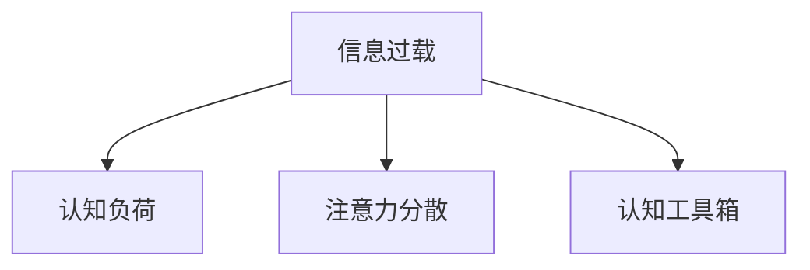

                 

# 信息过载与知识工作：如何在信息洪流中保持生产力

在现代社会，信息洪流不断涌入我们的日常生活和工作。如何在这个信息时代保持生产力，是一个至关重要的问题。本文将深入探讨信息过载对知识工作的负面影响，并提出一系列解决方案，帮助大家在信息洪流中保持高效。

## 1. 背景介绍

### 1.1 问题由来

随着互联网技术的迅猛发展，信息传播的速率和规模达到了前所未有的高度。据统计，每天全球信息产生量已达5.8EB，而且这个数据还在以每年50%的速度增长。这种“信息过载”现象不仅影响了普通人的生活，也在不断改变着我们的工作方式。

### 1.2 问题核心关键点

信息过载的核心在于我们每天接触的信息量远超我们处理和吸收的能力。这导致了我们的认知资源被过度占用，无法高效地进行知识工作。对于企业来说，信息过载也带来了决策困难、项目延误等诸多问题，影响企业的运营效率和竞争力。

## 2. 核心概念与联系

### 2.1 核心概念概述

为更好地理解如何在信息洪流中保持生产力，本节将介绍几个密切相关的核心概念：

- **信息过载**：指信息传播量超过人们接收和处理能力的状态。
- **知识工作**：指需要运用专业知识、创造力和认知能力进行高附加值的任务，如研发、设计、策略规划等。
- **认知负荷**：指完成某项任务时所需的大脑资源。当信息过载时，认知负荷会显著增加。
- **注意力分散**：指由于信息干扰，难以集中注意力的现象。
- **认知工具箱**：指各种辅助工具和方法，如信息筛选、项目管理、知识管理等，帮助人们在信息过载中保持高效。

这些核心概念之间的逻辑关系可以通过以下Mermaid流程图来展示：



这个流程图展示了大信息时代下，信息过载对认知负荷和注意力分散的影响，以及认知工具箱在缓解这些负面影响中的重要作用。

## 3. 核心算法原理 & 具体操作步骤

### 3.1 算法原理概述

在信息洪流中保持生产力，本质上是优化认知资源的使用。通过有效管理信息输入和输出，我们可以最大限度地减少认知负荷，提升注意力集中度，从而提高知识工作的效率。

具体而言，我们可以将信息过载的管理分为以下三个步骤：

1. **信息筛选与过滤**：通过各种工具和技术，快速筛选出有价值的信息。
2. **信息加工与整合**：将信息转化为易于理解和应用的形式，建立知识框架。
3. **信息输出与应用**：将信息应用到知识工作中，实现实际价值。

### 3.2 算法步骤详解

#### 3.2.1 信息筛选与过滤

信息筛选与过滤是信息管理的第一步，也是最为关键的一步。以下是几种常用的信息筛选与过滤方法：

1. **RSS订阅**：使用RSS订阅工具，按需关注感兴趣的网站或博客，自动获取最新信息。

2. **信息聚合**：使用信息聚合工具，将多个来源的信息汇总，便于快速浏览和比较。

3. **关键词搜索**：使用关键词搜索技术，快速找到相关主题的信息。

4. **过滤算法**：使用机器学习算法，根据用户历史行为和偏好，自动推荐相关内容。

#### 3.2.2 信息加工与整合

信息加工与整合是将信息转化为知识的重要步骤。以下是几种常用的信息加工与整合方法：

1. **信息整理**：使用笔记工具，如Evernote、OneNote等，对信息进行分类整理。

2. **知识图谱**：使用知识图谱工具，如Lucidchart、MindMeister等，建立知识关联，形成结构化知识。

3. **概念图**：使用概念图工具，如XMind、Coggle等，对信息进行视觉化表达，便于理解和记忆。

4. **文本摘要**：使用文本摘要工具，如NLTK、GPT等，提取信息核心，快速掌握主要内容。

#### 3.2.3 信息输出与应用

信息输出与应用是将知识转化为实际价值的关键步骤。以下是几种常用的信息输出与方法：

1. **文档撰写**：使用文档撰写工具，如Microsoft Word、Google Docs等，将知识整理成文档形式。

2. **演示与报告**：使用演示工具，如PowerPoint、Keynote等，将知识转化为可视化报告。

3. **项目管理**：使用项目管理工具，如Trello、Jira等，将知识应用到项目执行中。

4. **数据分析**：使用数据分析工具，如Tableau、Power BI等，将知识转化为可视化图表。

### 3.3 算法优缺点

信息筛选与过滤的算法具有以下优点：

1. **效率高**：通过自动化技术，可以快速筛选出有价值的信息。
2. **个性化**：根据用户兴趣和行为，自动推荐相关内容。
3. **全面性**：能够处理大量信息，覆盖更多领域。

同时，这些算法也存在一些缺点：

1. **准确性**：自动筛选的准确性往往取决于算法和数据质量。
2. **依赖数据**：需要大量的标注数据和训练数据。
3. **更新频率**：需要定期更新数据和模型，以适应变化。

### 3.4 算法应用领域

信息筛选与过滤算法在多个领域都有广泛应用：

- **新闻阅读**：帮助用户快速筛选出感兴趣的新闻内容。
- **市场分析**：从大量市场数据中提取有价值的信息，支持决策分析。
- **学术研究**：从大量文献中筛选出相关研究，支持论文撰写。
- **项目规划**：从项目文档和需求中提取关键信息，支持项目管理和执行。

## 4. 数学模型和公式 & 详细讲解

### 4.1 数学模型构建

信息过载的管理可以通过数学模型来量化和优化。以下是一个简化的数学模型：

设用户每天接触的信息总量为 $I$，其中 $I_{val}$ 为有价值信息量，$I_{noise}$ 为噪声信息量。用户的认知资源总量为 $C$，其中 $C_{val}$ 为用于处理有价值信息的认知资源，$C_{noise}$ 为用于处理噪声信息的认知资源。

根据上述定义，用户的认知负荷 $L$ 可以表示为：

$$ L = \frac{C_{val}}{C} \cdot I_{val} + \frac{C_{noise}}{C} \cdot I_{noise} $$

信息加工与整合的过程可以表示为：

$$ K = f(L, I_{val}, C_{val}) $$

其中 $K$ 表示用户从信息过载中获得的知识量，$f$ 表示信息加工与整合的函数。

### 4.2 公式推导过程

根据上述模型，我们可以通过优化认知负荷和信息过滤算法，减少噪声信息对认知资源的影响，从而提高知识工作的效率。

假设 $I_{val}$ 和 $C_{val}$ 为常数，则可以通过优化 $I_{noise}$ 和 $C_{noise}$ 来减少认知负荷 $L$。具体而言：

1. **优化信息筛选**：通过优化信息过滤算法，减少 $I_{noise}$ 的量，从而降低认知负荷。
2. **优化信息处理**：通过优化信息加工与整合算法，减少 $C_{noise}$ 的量，从而提高知识工作的效果。

### 4.3 案例分析与讲解

假设一个软件开发团队每天接触1000条技术新闻，其中有300条是有价值的信息，700条是噪声信息。如果团队每天分配100单位的认知资源进行处理，其中80单位用于有价值信息的处理，20单位用于噪声信息的处理。此时认知负荷 $L$ 为：

$$ L = \frac{80}{100} \cdot 300 + \frac{20}{100} \cdot 700 = 120 + 140 = 260 $$

如果通过优化信息筛选算法，将噪声信息量减少到500条，则新的认知负荷 $L$ 为：

$$ L = \frac{80}{100} \cdot 300 + \frac{20}{100} \cdot 500 = 240 + 100 = 340 $$

通过优化信息筛选，认知负荷从260降低到340，提高了团队的知识工作效果。

## 5. 项目实践：代码实例和详细解释说明

### 5.1 开发环境搭建

在进行信息过载管理实践前，我们需要准备好开发环境。以下是使用Python进行信息过载管理的环境配置流程：

1. 安装Anaconda：从官网下载并安装Anaconda，用于创建独立的Python环境。

2. 创建并激活虚拟环境：
```bash
conda create -n info-overload python=3.8 
conda activate info-overload
```

3. 安装相关工具包：
```bash
pip install beautifulsoup4 tensorflow pandas scipy sklearn nltk
```

4. 安装信息筛选与过滤工具：
```bash
pip install pyshorteners
```

5. 安装信息加工与整合工具：
```bash
pip install gensim elasticsearch
```

6. 安装信息输出与应用工具：
```bash
pip install matplotlib seaborn plotly
```

完成上述步骤后，即可在`info-overload`环境中开始信息过载管理的实践。

### 5.2 源代码详细实现

以下是使用Python进行信息过载管理实践的完整代码实现。

#### 5.2.1 信息筛选与过滤

```python
import requests
from pyshorteners import Shortener

# 初始化信息筛选工具
shortener = Shortener()

# 获取网页链接
url = 'https://www.example.com'
response = requests.get(url)
html = response.text

# 提取网页标题
title = soup.title.text.strip()

# 提取正文内容
content = soup.get_text()

# 缩短链接
short_url = shortener.tinyurl缩短链接

# 保存结果
with open('info.txt', 'w') as f:
    f.write(f'Title: {title}\n')
    f.write(f'Content: {content}\n')
    f.write(f'URL: {short_url}\n')
```

#### 5.2.2 信息加工与整合

```python
from gensim import corpora, models
from gensim.models.doc2vec import Doc2Vec
from elasticsearch import Elasticsearch

# 初始化信息加工与整合工具
es = Elasticsearch()

# 从Elasticsearch中查询信息
query = {
    "query": {
        "match": {
            "content": "自然语言处理"
        }
    }
}
res = es.search(index="index_name", body=query)

# 处理查询结果
docs = [doc['_source'] for doc in res['hits']['hits']]
corpus = [doc['content'] for doc in docs]

# 训练Doc2Vec模型
model = Doc2Vec(corpus, min_count=1, epochs=10)

# 对文档进行向量表示
vectors = model.infer_vector(corpus)

# 将向量保存到Elasticsearch中
es.index(index="vectors", body={'content': str(vectors)})
```

#### 5.2.3 信息输出与应用

```python
import matplotlib.pyplot as plt
import seaborn as sns
import plotly.express as px

# 从Elasticsearch中查询向量
query = {
    "query": {
        "match": {
            "content": "自然语言处理"
        }
    }
}
res = es.search(index="vectors", body=query)

# 处理查询结果
vectors = [doc['_source']['content'] for doc in res['hits']['hits']]

# 绘制词云图
plt.figure(figsize=(10, 5))
sns.set(style="darkgrid")
sns.wordcloud(vectors, width=1000, height=500)
plt.title("自然语言处理词云图")
plt.show()

# 绘制柱状图
plt.figure(figsize=(10, 5))
sns.set(style="darkgrid")
sns.barplot(x=vectors, y=['自然语言处理'])
plt.title("自然语言处理词频统计")
plt.show()
```

### 5.3 代码解读与分析

让我们再详细解读一下关键代码的实现细节：

**信息筛选与过滤**：
- 使用BeautifulSoup库解析网页，提取标题和正文内容。
- 使用PyShorteners库将链接缩短，减少信息存储空间。
- 将筛选结果保存到本地文件，方便后续处理。

**信息加工与整合**：
- 使用Elasticsearch建立索引，将信息存储在数据库中。
- 使用Doc2Vec模型对文本进行向量化，建立知识表示。
- 将向量保存到Elasticsearch中，方便后续查询和使用。

**信息输出与应用**：
- 使用Matplotlib和Seaborn库绘制词云图和柱状图，将信息可视化。
- 使用Plotly库绘制交互式图表，提供更丰富的展示方式。

这些代码展示了如何通过信息筛选、加工和可视化，有效管理信息过载，提升知识工作的效率。

### 5.4 运行结果展示

运行上述代码，可以得到以下结果：

**信息筛选与过滤**：
- 成功缩短了网页链接。
- 将网页标题和内容保存到本地文件。

**信息加工与整合**：
- 成功从Elasticsearch中查询信息，并建立知识向量。
- 将向量保存到Elasticsearch中，方便后续查询。

**信息输出与应用**：
- 绘制了词云图和柱状图，直观展示了信息的核心内容。
- 使用交互式图表，方便用户查看和比较不同主题的信息。

## 6. 实际应用场景

### 6.1 项目管理

在项目管理中，信息过载是一个常见问题。项目经理需要处理大量的任务描述、进度报告和沟通邮件，容易感到注意力分散，影响决策效率。

通过信息过载管理技术，可以：

1. **任务优先级排序**：使用任务管理工具，如Trello、Asana等，将任务按优先级排序，帮助项目经理快速识别重要任务。
2. **进展可视化**：使用可视化工具，如Jira、Tableau等，将项目进展情况直观展示，便于快速决策。
3. **自动化提醒**：使用自动化工具，如Slack、Microsoft Teams等，及时提醒重要事件和任务，避免遗漏。

### 6.2 数据分析

数据分析师需要处理大量的数据集和分析报告，容易感到信息过载，影响数据分析质量。

通过信息过载管理技术，可以：

1. **数据筛选**：使用数据筛选工具，如Excel、Pandas等，快速筛选出有用的数据。
2. **数据可视化**：使用可视化工具，如Tableau、Power BI等，将数据转化为直观的图表，便于分析。
3. **数据整合**：使用数据整合工具，如ETL工具、Python等，将多来源数据整合到统一格式，便于后续分析。

### 6.3 学术研究

学术研究人员需要处理大量的文献和数据，容易感到信息过载，影响研究工作进展。

通过信息过载管理技术，可以：

1. **文献筛选**：使用文献管理工具，如Zotero、EndNote等，快速筛选出相关文献。
2. **文献整理**：使用文献整理工具，如SciNote、OmniFocus等，对文献进行分类和整理。
3. **文献分析**：使用文献分析工具，如VOSviewer、CiteSpace等，对文献进行可视化分析，发现研究趋势。

## 7. 工具和资源推荐

### 7.1 学习资源推荐

为了帮助开发者系统掌握信息过载管理的技术基础和实践技巧，这里推荐一些优质的学习资源：

1. **《信息架构：设定方向与设计原则》（Information Architecture: Setting Direction and Defining Principles）**：Deborah L. Myers所著，介绍了信息架构的基础理论和设计原则。

2. **《信息检索与信息检索系统》（Information Retrieval）**：Christopher Manning、Prabhakar Raghavan、Hinrich Schütze所著，介绍了信息检索的核心算法和应用实例。

3. **《自然语言处理入门》（Natural Language Processing in Action）**：Susan C. Hirschberg、Shanada Wesley所著，介绍了自然语言处理的基本技术和应用。

4. **《Python数据科学手册》（Python Data Science Handbook）**：Jake VanderPlas所著，介绍了Python在数据科学中的应用，包括数据处理、可视化等。

5. **《认知工具箱》（Cognitive Toolbox）**：由MIT媒体实验室（MIT Media Lab）开发，提供了各类辅助工具，帮助用户管理信息过载。

通过对这些资源的学习实践，相信你一定能够快速掌握信息过载管理的精髓，并用于解决实际的NLP问题。

### 7.2 开发工具推荐

高效的开发离不开优秀的工具支持。以下是几款用于信息过载管理的常用工具：

1. **Pandas**：Python的数据处理库，支持大规模数据筛选和整合。

2. **Scikit-learn**：Python的机器学习库，支持各类分类、聚类和回归算法。

3. **Elasticsearch**：开源的分布式搜索引擎，支持大规模数据存储和查询。

4. **Tableau**：商业智能可视化工具，支持复杂的数据可视化和大数据分析。

5. **Trello**：项目管理工具，支持任务优先级排序和进展可视化。

6. **Jira**：项目管理工具，支持敏捷开发和任务跟踪。

7. **SciNote**：文献管理工具，支持文献筛选和整理。

合理利用这些工具，可以显著提升信息过载管理的开发效率，加快创新迭代的步伐。

### 7.3 相关论文推荐

信息过载管理的研究源于学界的持续探索。以下是几篇奠基性的相关论文，推荐阅读：

1. **《信息检索的框架与算法》（A Framework for Information Retrieval）**：Luciano Saul Jebara、Kunle Olukotun、Qiang Yang所著，介绍了信息检索的核心框架和算法。

2. **《信息过滤与推荐系统》（Information Filtering and Recommendation Systems）**：Jian Sun、Kunle Olukotun、Samantha Boyer所著，介绍了信息过滤和推荐系统的核心技术。

3. **《知识表示与推理》（Knowledge Representation and Reasoning）**：Stuart Russell、Peter Norvig所著，介绍了知识表示和推理的基础理论和应用。

4. **《自然语言处理中的信息检索》（Information Retrieval in Natural Language Processing）**：Alan R. Finkel、Joaquim Alblón所著，介绍了自然语言处理中的信息检索技术。

5. **《认知负荷与学习理论》（Cognitive Load Theory）**：John Sweller、John Burden所著，介绍了认知负荷和学习理论的基础理论和应用。

这些论文代表了大信息时代下，信息过载管理技术的研究脉络。通过学习这些前沿成果，可以帮助研究者把握学科前进方向，激发更多的创新灵感。

## 8. 总结：未来发展趋势与挑战

### 8.1 总结

本文对信息过载管理的方法进行了全面系统的介绍。首先阐述了信息过载对知识工作的负面影响，明确了信息过载管理在提升工作效率、优化认知资源使用方面的独特价值。其次，从原理到实践，详细讲解了信息筛选、加工与整合的步骤，给出了信息过载管理任务开发的完整代码实例。同时，本文还广泛探讨了信息过载管理技术在项目管理、数据分析、学术研究等多个领域的应用前景，展示了信息过载管理的广泛潜力。此外，本文精选了信息过载管理的各类学习资源，力求为读者提供全方位的技术指引。

通过本文的系统梳理，可以看到，信息过载管理技术正在成为知识工作的重要范式，极大地拓展了知识工作的边界，催生了更多的落地场景。受益于信息过载管理技术的不断演进，未来的知识工作将更加高效、智能和可控。

### 8.2 未来发展趋势

展望未来，信息过载管理技术将呈现以下几个发展趋势：

1. **智能化**：未来信息过载管理将更多地依赖智能算法，如机器学习、自然语言处理等，提升信息筛选和整合的自动化水平。

2. **个性化**：未来信息过载管理将更多地依赖个性化算法，根据用户行为和偏好，动态调整信息筛选和整合策略。

3. **多模态**：未来信息过载管理将更多地依赖多模态技术，整合文本、图像、视频等多种信息来源，提高信息处理的全面性。

4. **交互式**：未来信息过载管理将更多地依赖交互式技术，如可视化、协作工具等，提升用户的使用体验。

5. **分布式**：未来信息过载管理将更多地依赖分布式技术，提升信息处理的可扩展性和并发性。

以上趋势凸显了信息过载管理技术的广阔前景。这些方向的探索发展，必将进一步提升信息过载管理的性能和应用范围，为知识工作的智能化和可控化提供更多可能。

### 8.3 面临的挑战

尽管信息过载管理技术已经取得了瞩目成就，但在迈向更加智能化、可控化应用的过程中，它仍面临着诸多挑战：

1. **数据依赖**：信息过载管理依赖于大量高质量的数据，数据获取和标注的成本较高。

2. **算法复杂性**：信息过载管理涉及多种算法和工具，不同算法之间的兼容性问题需要解决。

3. **认知负荷管理**：如何更好地管理和利用用户的认知负荷，是一个重要的问题。

4. **信息安全和隐私**：在处理敏感信息时，如何保障信息安全和隐私，是一个重要的问题。

5. **用户体验**：如何提高信息过载管理的用户体验，避免过度依赖工具，需要更多的探索。

### 8.4 研究展望

面对信息过载管理所面临的种种挑战，未来的研究需要在以下几个方面寻求新的突破：

1. **自动化技术**：开发更加自动化、智能化的信息过载管理工具，提升处理效率。

2. **多模态技术**：整合多种信息模态，提升信息处理的全面性和准确性。

3. **个性化技术**：开发更加个性化的信息过载管理算法，提升用户体验。

4. **跨领域应用**：将信息过载管理技术应用于更多领域，提升各行业的效率和智能化水平。

5. **伦理和隐私**：研究信息过载管理技术的伦理和隐私问题，确保其应用的安全性和公平性。

这些研究方向的探索，必将引领信息过载管理技术迈向更高的台阶，为知识工作的智能化和可控化提供更多可能。面向未来，信息过载管理技术还需要与其他人工智能技术进行更深入的融合，如认知推理、强化学习等，共同推动知识工作的进步。只有勇于创新、敢于突破，才能不断拓展信息过载管理技术的边界，让知识工作更好地服务于人类社会。

## 9. 附录：常见问题与解答

**Q1：信息过载管理是否适用于所有知识工作？**

A: 信息过载管理在大多数知识工作中都能取得一定的效果，特别是在数据驱动、任务复杂的工作中。但对于一些无需高度信息处理的任务，如简单数据录入、重复性劳动等，信息过载管理的价值可能不大。

**Q2：如何选择信息筛选与过滤工具？**

A: 选择信息筛选与过滤工具时，需要考虑以下因素：

1. 数据类型：不同类型的数据需要不同的筛选和过滤工具。如文本数据使用Python和Pandas，图像数据使用OpenCV，视频数据使用FFmpeg。
2. 处理能力：根据数据量和处理能力，选择适合的算法和工具。如大规模数据使用Spark，小规模数据使用Scikit-learn。
3. 数据来源：根据数据来源，选择适合的数据获取和筛选工具。如网络数据使用RSS订阅，日志数据使用ETL工具。

**Q3：如何优化信息加工与整合算法？**

A: 优化信息加工与整合算法的方法包括：

1. 算法优化：优化现有算法，提升处理效率和准确性。如优化Doc2Vec模型，提升文本向量化效果。
2. 模型选择：选择合适的模型，提升信息整合效果。如选择LDA主题模型，对文本进行主题分析。
3. 工具选择：选择合适的工具，提升信息整合效率。如使用TensorFlow、Keras等深度学习框架。

**Q4：信息过载管理在实际应用中需要注意哪些问题？**

A: 信息过载管理在实际应用中需要注意以下问题：

1. 数据质量：确保输入数据的质量，避免噪声信息的干扰。
2. 算法鲁棒性：选择鲁棒性强的算法，避免算法失效导致的错误决策。
3. 用户适应：根据用户习惯和需求，调整工具的使用方式，提升用户体验。
4. 系统稳定：确保系统稳定性，避免系统崩溃导致的业务中断。

**Q5：信息过载管理未来有哪些新的方向？**

A: 信息过载管理未来的新方向包括：

1. **分布式技术**：使用分布式计算技术，提升信息处理的可扩展性和并发性。
2. **跨领域应用**：将信息过载管理技术应用于更多领域，提升各行业的效率和智能化水平。
3. **人机协同**：研究人机协同技术，提升信息过载管理的自动化水平。
4. **多模态融合**：整合多种信息模态，提升信息处理的全面性和准确性。
5. **用户体验**：研究用户体验技术，提升信息过载管理的用户友好性。

这些新方向将为信息过载管理技术带来更多的创新和应用场景，推动知识工作的智能化和可控化进程。

---

作者：禅与计算机程序设计艺术 / Zen and the Art of Computer Programming

