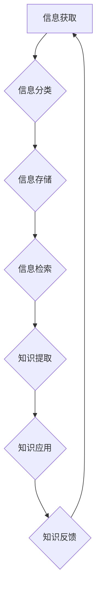

                 

## 信息过载与知识管理策略与实践：管理和组织信息

> 关键词：信息过载、知识管理、信息架构、知识组织、信息检索、数据可视化、人工智能

### 1. 背景介绍

在当今信息爆炸的时代，我们每天接触的海量信息呈指数级增长。从新闻、社交媒体到学术论文、行业报告，信息无处不在，却并非都具有价值。如何有效地管理和组织这些信息，从中提取有用的知识，已成为个人和组织面临的重大挑战。

信息过载带来的负面影响不容忽视：

* **效率低下:**  大量无关信息占据时间和精力，降低工作效率。
* **决策困难:**  难以从海量信息中筛选出关键信息，导致决策失误。
* **知识孤岛:**  信息分散在各个角落，难以形成知识共享和积累。
* **认知疲劳:**  持续处理信息会导致认知疲劳，影响工作质量和生活质量。

因此，建立有效的知识管理体系，有效应对信息过载，已成为当今社会不可或缺的技能和能力。

### 2. 核心概念与联系

**2.1 信息架构**

信息架构是组织和结构化信息的一种方法，旨在使信息易于查找、理解和使用。它涉及到信息分类、标签、导航和搜索等方面。

**2.2 知识管理**

知识管理是指组织和个人如何创建、共享、应用和管理知识的过程。它涵盖了知识的获取、存储、传播、应用和更新等各个环节。

**2.3 知识组织**

知识组织是指将知识以结构化、可管理的方式存储和组织起来，以便于检索和利用。它包括知识库、知识图谱、知识导航等多种形式。

**2.4 信息检索**

信息检索是指在海量信息中快速准确地找到所需信息的过程。它涉及到关键词搜索、文本挖掘、机器学习等技术。

**2.5 数据可视化**

数据可视化是指将数据以图形、图表等形式呈现出来，以便于理解和分析。它可以帮助我们发现数据中的隐藏模式和趋势。

**2.6 人工智能**

人工智能技术可以帮助我们自动化信息处理、知识发现和知识管理等任务。例如，机器学习算法可以用于信息分类、文本摘要和知识图谱构建。

**Mermaid 流程图**



### 3. 核心算法原理 & 具体操作步骤

**3.1 算法原理概述**

信息管理和知识组织的核心算法通常基于信息检索、数据挖掘和机器学习等技术。这些算法可以帮助我们自动分类、标记、检索和分析信息，从而提高信息管理效率和知识发现能力。

**3.2 算法步骤详解**

1. **数据预处理:**  清洗、转换和格式化原始数据，使其适合算法处理。
2. **特征提取:**  从数据中提取关键特征，例如关键词、主题、情感等。
3. **模型训练:**  使用机器学习算法训练模型，学习数据中的模式和关系。
4. **信息分类:**  根据训练好的模型，对新数据进行分类和标签。
5. **知识图谱构建:**  将相关信息连接起来，构建知识图谱，展现知识之间的关系。
6. **信息检索:**  根据用户查询，从知识库中检索相关信息。

**3.3 算法优缺点**

* **优点:**  自动化处理海量信息，提高效率和准确性，发现隐藏的知识模式。
* **缺点:**  需要大量数据进行训练，算法效果受数据质量影响，存在算法偏差和黑盒问题。

**3.4 算法应用领域**

* **搜索引擎:**  用于网页搜索、图像搜索、视频搜索等。
* **推荐系统:**  根据用户行为推荐相关商品、内容或服务。
* **知识管理系统:**  用于组织和管理企业内部知识，促进知识共享和应用。
* **数据分析:**  用于挖掘数据中的隐藏模式和趋势，辅助决策。

### 4. 数学模型和公式 & 详细讲解 & 举例说明

**4.1 数学模型构建**

信息检索和知识组织的数学模型通常基于概率论和统计学。例如，TF-IDF（Term Frequency-Inverse Document Frequency）算法用于衡量关键词在文档中的重要性。

**4.2 公式推导过程**

TF-IDF 算法的公式如下：

$$TF-IDF(t, d) = TF(t, d) \times IDF(t)$$

其中：

* $TF(t, d)$ 表示关键词 $t$ 在文档 $d$ 中的词频。
* $IDF(t)$ 表示关键词 $t$ 在整个语料库中的逆向文档频率。

**4.3 案例分析与讲解**

假设我们有一个语料库包含 1000 篇文档，其中 100 篇文档包含关键词 "人工智能"。那么，关键词 "人工智能" 的 IDF 值为：

$$IDF(人工智能) = log_{10} \frac{1000}{100} = log_{10} 10 = 1$$

如果一个文档包含 5 次 "人工智能" 关键词，那么该关键词在该文档中的 TF 值为 5。因此，该关键词在该文档中的 TF-IDF 值为：

$$TF-IDF(人工智能, d) = 5 \times 1 = 5$$

### 5. 项目实践：代码实例和详细解释说明

**5.1 开发环境搭建**

* Python 3.x
* scikit-learn
* NLTK
* Gensim

**5.2 源代码详细实现**

```python
from sklearn.feature_extraction.text import TfidfVectorizer
from nltk.tokenize import word_tokenize

# 文档列表
documents = [
    "人工智能是未来发展的重要方向",
    "机器学习是人工智能的重要分支",
    "深度学习是机器学习的一种算法",
]

# 创建 TF-IDF 向量化器
vectorizer = TfidfVectorizer()

# 将文档转换为 TF-IDF 向量
tfidf_matrix = vectorizer.fit_transform(documents)

# 打印 TF-IDF 向量
print(tfidf_matrix.toarray())
```

**5.3 代码解读与分析**

* `TfidfVectorizer()` 创建 TF-IDF 向量化器对象。
* `fit_transform()` 方法将文档列表转换为 TF-IDF 向量矩阵。
* `toarray()` 方法将 TF-IDF 向量矩阵转换为 NumPy 数组，以便打印输出。

**5.4 运行结果展示**

运行上述代码，将输出一个 TF-IDF 向量矩阵，其中每个行代表一个文档，每个列代表一个关键词，每个元素表示关键词在该文档中的 TF-IDF 值。

### 6. 实际应用场景

**6.1 搜索引擎优化 (SEO)**

TF-IDF 算法可以帮助搜索引擎理解网页内容，并根据关键词重要性对网页进行排名。

**6.2 文档分类**

TF-IDF 算法可以用于自动分类文档，例如新闻分类、邮件分类等。

**6.3 文本摘要**

TF-IDF 算法可以用于提取文档中的关键信息，生成文本摘要。

**6.4 知识发现**

TF-IDF 算法可以用于发现文本数据中的隐藏模式和关系，辅助知识发现。

**6.5 未来应用展望**

随着人工智能技术的不断发展，信息管理和知识组织将更加智能化和自动化。例如，基于深度学习的模型可以更好地理解自然语言，提高信息检索和知识发现的准确性。

### 7. 工具和资源推荐

**7.1 学习资源推荐**

* **书籍:**
    * 信息检索导论 (Introduction to Information Retrieval)
    * 自然语言处理 (Natural Language Processing)
* **在线课程:**
    * Coursera: 自然语言处理
    * edX: 信息检索
* **博客和网站:**
    * Towards Data Science
    * Analytics Vidhya

**7.2 开发工具推荐**

* **Python:**  Python 是信息管理和知识组织领域最常用的编程语言。
* **scikit-learn:**  scikit-learn 是一个强大的机器学习库，提供各种信息检索和知识组织算法。
* **NLTK:**  NLTK 是一个自然语言处理库，提供各种文本处理工具。
* **Gensim:**  Gensim 是一个主题建模和词嵌入库，可以用于知识发现和文本分析。

**7.3 相关论文推荐**

* **TF-IDF:**  Salton, G., & McGill, M. (1983). Introduction to modern information retrieval. McGraw-Hill.
* **深度学习:**  LeCun, Y., Bengio, Y., & Hinton, G. (2015). Deep learning. Nature, 521(7553), 436-444.

### 8. 总结：未来发展趋势与挑战

**8.1 研究成果总结**

近年来，信息管理和知识组织领域取得了显著进展，特别是人工智能技术的应用，使得信息管理更加智能化和自动化。

**8.2 未来发展趋势**

* **更智能的知识管理系统:** 基于深度学习和自然语言理解的知识管理系统将能够更好地理解和组织知识，并提供更个性化的知识服务。
* **知识图谱的广泛应用:** 知识图谱将成为知识管理和知识发现的重要工具，应用于各个领域，例如医疗、金融、教育等。
* **跨领域知识融合:**  将不同领域知识融合在一起，构建更完整的知识体系，促进跨领域创新。

**8.3 面临的挑战**

* **数据质量问题:**  信息管理和知识组织算法的性能依赖于数据质量，如何保证数据准确性和完整性是一个挑战。
* **算法偏差问题:**  机器学习算法可能存在偏差，导致信息检索和知识发现结果不准确或不公平。
* **知识可解释性问题:**  深度学习模型的决策过程难以解释，如何提高知识可解释性是一个重要问题。

**8.4 研究展望**

未来，信息管理和知识组织领域的研究将更加注重数据质量、算法公平性和知识可解释性。同时，将探索更智能、更个性化的知识管理解决方案，帮助个人和组织更好地应对信息过载，挖掘知识价值。

### 9. 附录：常见问题与解答

**9.1 如何选择合适的知识管理工具？**

选择合适的知识管理工具需要根据组织的具体需求和规模进行评估。一些常见的知识管理工具包括：

* **Confluence:**  用于协作文档创作和知识共享。
* **Notion:**  用于笔记、任务管理和知识库构建。
* **Microsoft SharePoint:**  用于企业级文档管理和知识库构建。

**9.2 如何提高信息检索的准确性？**

提高信息检索准确性的方法包括：

* **优化关键词:**  使用更精准的关键词进行搜索。
* **使用高级搜索功能:**  利用搜索引擎提供的过滤、排序和聚合功能。
* **构建知识图谱:**  将相关信息连接起来，构建知识图谱，方便用户进行知识导航和探索。


作者：禅与计算机程序设计艺术 / Zen and the Art of Computer Programming 
<end_of_turn>

