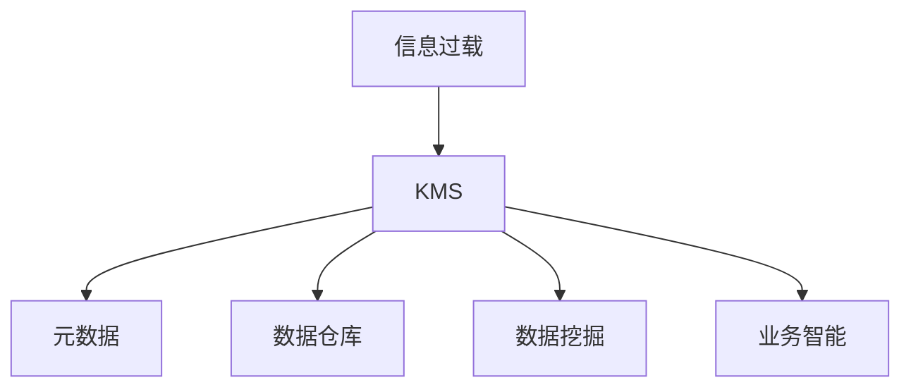

                 

# 信息过载与知识管理系统实施指南：管理和组织信息

## 1. 背景介绍

### 1.1 问题由来
在信息时代，我们每天都会接触到海量的信息，从新闻资讯、社交媒体到企业报告、研究论文，信息量呈爆炸性增长。这种信息过载（Information Overload）现象，不仅影响了我们的决策效率和注意力集中，还可能导致信息误判和认知负荷过重。因此，如何有效地管理和组织信息，成为信息时代的一大挑战。

### 1.2 问题核心关键点
信息管理的目标是实现信息的价值最大化。通过构建知识管理系统(Knowledge Management System, KMS)，将无序的信息转化为结构化、可检索、易于理解的知识，帮助用户快速获取、分析和使用信息，从而提高决策效率和工作质量。

### 1.3 问题研究意义
有效的信息管理不仅能够提高个人和企业的决策效率，还能促进知识的积累和创新。通过知识管理系统的实施，可以：

- 降低信息查找成本。快速定位相关信息，减少信息筛选时间和精力。
- 提升决策质量。利用结构化知识支持决策过程，减少信息误判和偏见。
- 促进知识共享。建立知识共享平台，促进团队协作和知识传播。
- 推动创新发展。通过知识积累和分析，发掘新的业务机会和解决方案。
- 支持持续学习。提供学习材料和培训资源，支持员工终身学习。

## 2. 核心概念与联系

### 2.1 核心概念概述

为了更好地理解信息管理和知识管理系统的实施方法，本节将介绍几个密切相关的核心概念：

- 信息过载（Information Overload）：指个人或组织面对大量信息时的心理负担和注意力分散现象。
- 知识管理系统（Knowledge Management System, KMS）：用于管理、存储、共享和检索知识的系统，支持组织内部知识的创造、传播和应用。
- 元数据（Metadata）：描述和组织数据的结构化信息，如文件属性、关系等。
- 数据仓库（Data Warehouse）：用于存储和管理企业数据的中央数据存储，支持复杂的查询和分析。
- 数据挖掘（Data Mining）：从大量数据中自动发现模式、规律和关联的技术。
- 业务智能（Business Intelligence, BI）：通过分析数据支持决策的工具和方法。

这些核心概念之间的逻辑关系可以通过以下Mermaid流程图来展示：



这个流程图展示了一些核心概念之间的相互关系：

1. 信息过载是推动信息管理和知识管理发展的根本原因。
2. KMS是信息管理的基础设施，提供知识存储和检索功能。
3. 元数据帮助组织和描述知识。
4. 数据仓库存储大量原始数据，支持复杂的数据分析和报告。
5. 数据挖掘从数据中发现知识模式，支持决策制定。
6. 业务智能分析数据，支持日常运营和战略决策。

这些概念共同构成了信息管理的框架，使其能够有效地管理和利用信息资源。

## 3. 核心算法原理 & 具体操作步骤
### 3.1 算法原理概述

知识管理系统的实施通常涉及以下核心算法原理：

- 知识存储与检索：通过数据库、搜索引擎等技术，实现知识的存储、检索和查询。
- 元数据管理：定义和维护知识模型的元数据，如分类、标签、关系等。
- 数据挖掘与分析：应用数据挖掘技术，从大量数据中发现知识模式和关联。
- 业务智能工具：使用BI工具，将数据转换为直观的仪表盘、报告等，支持决策制定。

这些原理通过协同工作，形成了一套完整的知识管理流程，从信息的获取、存储、分析到应用，实现信息的全生命周期管理。

### 3.2 算法步骤详解

知识管理系统的实施一般包括以下几个关键步骤：

**Step 1: 需求分析与规划**
- 确定知识管理的目标和范围，包括信息类型、存储需求、访问权限等。
- 收集现有数据和信息，识别信息孤岛和重复数据。
- 设计知识管理架构，包括数据仓库、元数据、检索引擎等。

**Step 2: 数据清洗与预处理**
- 清洗数据中的噪声和重复项，确保数据质量。
- 对数据进行标准化处理，如统一格式、统一命名等。
- 对数据进行初步分析，发现数据中的关联和模式。

**Step 3: 知识建模与元数据管理**
- 定义知识模型，确定知识分类、标签、关系等。
- 创建元数据字典，描述每个信息实体的属性和关系。
- 应用元数据管理工具，实现元数据的管理和维护。

**Step 4: 数据存储与知识库构建**
- 选择合适的数据仓库和数据库，存储和管理结构化数据。
- 构建知识库，将信息按照知识模型组织和存储。
- 引入知识管理系统工具，如SharePoint、Confluence等，支持知识检索和协作。

**Step 5: 数据挖掘与分析**
- 应用数据挖掘工具，从数据中发现知识模式和关联。
- 应用数据可视化工具，将分析结果转换为直观的图表和报告。
- 利用BI工具，支持业务决策和分析。

**Step 6: 知识应用与反馈**
- 将知识管理工具集成到业务流程中，支持日常运营和决策。
- 收集用户反馈，评估知识管理系统的效果。
- 持续改进知识管理流程，优化系统功能和用户体验。

### 3.3 算法优缺点

知识管理系统的实施具有以下优点：
1. 提高信息查找效率。通过结构化存储和检索，用户可以更快地定位所需信息。
2. 提升决策质量。结构化知识和数据分析支持精准决策，减少信息误判。
3. 促进知识共享。知识管理系统支持协作和共享，加速知识传播。
4. 支持持续学习。知识管理系统提供学习资源和培训，支持员工终身学习。

同时，该方法也存在一定的局限性：
1. 初始投资大。知识管理系统的建设需要大量的资金和人力资源。
2. 技术门槛高。系统设计和实施需要专业的技术知识。
3. 数据隐私问题。知识管理涉及大量敏感数据，需要严格的数据保护措施。
4. 知识整合难度大。不同来源、不同格式的信息整合复杂，需要克服数据异构性。
5. 组织文化阻力。知识管理系统的成功实施需要全员的积极参与和支持。

尽管存在这些局限性，但就目前而言，知识管理系统仍是一种有效的信息管理方式。未来相关研究的重点在于如何进一步降低初始投资，简化系统设计，提高数据整合和共享的效率，同时兼顾数据隐私和知识积累的平衡。

### 3.4 算法应用领域

知识管理系统的实施已经在多个领域得到了广泛应用，包括但不限于：

- 企业内部管理：支持企业内部的信息共享、知识积累和业务决策。
- 教育培训：提供学习资源和培训材料，支持教师和学生的知识传播和积累。
- 医疗卫生：支持医疗信息的管理和共享，提高诊疗效率和质量。
- 政府治理：提供政策、法规、数据等信息的共享和检索，支持政策制定和执行。
- 科技研发：支持科研项目的数据管理和知识传播，加速科研创新。

## 4. 数学模型和公式 & 详细讲解 & 举例说明
### 4.1 数学模型构建

知识管理系统的数学模型通常包括：

- 元数据模型：描述信息实体的属性和关系。
- 数据仓库模型：定义数据存储结构。
- 数据挖掘模型：应用机器学习算法从数据中发现知识模式。
- 业务智能模型：将数据转换为决策支持信息。

这些模型的构建需要结合具体的业务需求和数据特征，进行合理的设计和调整。

### 4.2 公式推导过程

以知识分类和标签为例，假设我们有一个知识库，包含N个信息实体，每个实体有M个属性。知识分类模型可以表示为：

$$
\mathcal{C} = \{\mathcal{C}_i\}_{i=1}^N
$$

其中 $\mathcal{C}_i$ 表示第i个信息实体的分类。每个分类可以进一步细分为多个标签：

$$
\mathcal{L} = \{\mathcal{L}_j\}_{j=1}^M
$$

其中 $\mathcal{L}_j$ 表示第j个属性的标签。知识分类模型可以表示为：

$$
\mathcal{C} = \bigcup_{j=1}^M \mathcal{L}_j
$$

每个信息实体可以通过其在不同属性上的取值，映射到一个或多个标签：

$$
\mathcal{T}_i = \{t_{i,j}\}_{j=1}^M
$$

其中 $t_{i,j}$ 表示第i个信息实体在第j个属性上的取值，可以是字符串、数字等。知识分类模型可以表示为：

$$
\mathcal{T} = \bigcup_{i=1}^N \mathcal{T}_i
$$

### 4.3 案例分析与讲解

以一家科技公司的知识管理系统为例，假设公司有1000个员工，每天生成大量研发文档和技术报告。为了管理和利用这些信息，公司设计了一个基于元数据管理的知识管理系统。

1. **需求分析与规划**
   - 确定知识管理的范围和目标，包括文档、代码、专利等。
   - 收集现有文档和报告，发现大量重复和过时的信息。
   - 设计知识管理架构，包括数据仓库、元数据、检索引擎等。

2. **数据清洗与预处理**
   - 清洗文档中的噪声和重复项，确保数据质量。
   - 对文档进行标准化处理，统一格式和命名规范。
   - 对文档进行初步分析，发现技术趋势和知识热点。

3. **知识建模与元数据管理**
   - 定义知识模型，包括文档、代码、专利等分类。
   - 创建元数据字典，描述每个实体的属性和关系，如作者、时间、关键词等。
   - 应用元数据管理工具，实现元数据的管理和维护。

4. **数据存储与知识库构建**
   - 选择合适的数据仓库和数据库，存储和管理文档和报告。
   - 构建知识库，将文档按照知识模型组织和存储。
   - 引入知识管理系统工具，如SharePoint、Confluence等，支持知识检索和协作。

5. **数据挖掘与分析**
   - 应用数据挖掘工具，从文档和报告中发现技术趋势和知识热点。
   - 应用数据可视化工具，将分析结果转换为直观的图表和报告。
   - 利用BI工具，支持日常运营和战略决策。

6. **知识应用与反馈**
   - 将知识管理工具集成到研发流程中，支持文档管理和版本控制。
   - 收集员工反馈，评估知识管理系统的效果。
   - 持续改进知识管理流程，优化系统功能和用户体验。

通过这个案例，可以看到知识管理系统实施的基本流程，以及各步骤的关键技术和工具。

## 5. 项目实践：代码实例和详细解释说明
### 5.1 开发环境搭建

在进行知识管理系统的开发实践前，我们需要准备好开发环境。以下是使用Python进行知识管理系统开发的环境配置流程：

1. 安装Anaconda：从官网下载并安装Anaconda，用于创建独立的Python环境。

2. 创建并激活虚拟环境：
```bash
conda create -n kms-env python=3.8 
conda activate kms-env
```

3. 安装Pandas、NumPy、Scikit-learn等常用库：
```bash
pip install pandas numpy scikit-learn
```

4. 安装Apache Spark：
```bash
conda install apache-spark
```

5. 安装Databricks：
```bash
conda install databricks
```

6. 安装Jupyter Notebook：
```bash
conda install jupyter notebook
```

完成上述步骤后，即可在`kms-env`环境中开始开发实践。

### 5.2 源代码详细实现

下面我们以文档管理为例，给出使用Pandas和NumPy库进行知识管理系统开发的PyTorch代码实现。

首先，定义文档处理函数：

```python
import pandas as pd
import numpy as np

def load_documents():
    # 读取文档数据
    data = pd.read_csv('documents.csv')
    return data

def clean_documents(data):
    # 清洗文档数据
    data = data.drop_duplicates()
    data = data.dropna()
    return data

def preprocess_documents(data):
    # 预处理文档数据
    data['title'] = data['title'].str.lower().replace('\n', ' ')
    data['abstract'] = data['abstract'].str.lower().replace('\n', ' ')
    data['keywords'] = data['keywords'].str.split(',')
    return data

def save_documents(data):
    # 保存文档数据
    data.to_csv('cleaned_documents.csv', index=False)
    print('文档数据已保存。')
```

然后，定义知识分类和标签模型：

```python
def build_knowledge_model(data):
    # 构建知识分类和标签模型
    categories = set(data['category'])
    keywords = set(data['keywords'])

    category_dict = {category: i for i, category in enumerate(categories)}
    keyword_dict = {keyword: i for i, keyword in enumerate(keywords)}

    return category_dict, keyword_dict

def classify_documents(data, category_dict, keyword_dict):
    # 分类文档
    data['category_id'] = data['category'].map(category_dict)
    data['keyword_ids'] = data['keywords'].map(keyword_dict)

    return data

def extract_labels(data):
    # 提取标签
    labels = set(data['category_id'])
    label_dict = {label: i for i, label in enumerate(labels)}

    return label_dict

def annotate_documents(data, label_dict):
    # 标注文档
    data['label_id'] = data['category_id'].map(label_dict)
    data['keywords'] = data['keywords'].astype(str)
    data['label_ids'] = data['category_id'].astype(str)

    return data
```

最后，执行知识管理系统的流程：

```python
data = load_documents()
data = clean_documents(data)
data = preprocess_documents(data)

category_dict, keyword_dict = build_knowledge_model(data)
data = classify_documents(data, category_dict, keyword_dict)
label_dict = extract_labels(data)
data = annotate_documents(data, label_dict)

data.to_csv('annotated_documents.csv', index=False)
```

以上就是使用Python进行知识管理系统开发的完整代码实现。可以看到，知识管理系统的实现主要涉及数据清洗、预处理、分类、标注等操作，代码实现相对简单直观。

### 5.3 代码解读与分析

让我们再详细解读一下关键代码的实现细节：

**load_documents函数**：
- 读取文档数据，以CSV格式保存。
- 函数内部使用了pandas库的read_csv方法，可以快速读取和处理大型CSV文件。

**clean_documents函数**：
- 清洗文档数据，去除重复和缺失项。
- 使用pandas库的drop_duplicates和dropna方法，快速实现数据去重和缺失值处理。

**preprocess_documents函数**：
- 预处理文档数据，统一格式和命名规范。
- 使用字符串的lower方法将文本转换为小写，使用replace方法去除换行符和空格。
- 将关键词转换为列表格式，方便后续处理。

**build_knowledge_model函数**：
- 构建知识分类和标签模型，将分类和标签映射为数字id。
- 使用set函数去重分类和标签，确保每个分类和标签只出现一次。
- 使用字典映射，将分类和标签映射为数字id。

**classify_documents函数**：
- 分类文档，将分类和标签映射为数字id。
- 使用map方法将分类和标签映射为数字id，支持分类和标签的数值化表示。

**extract_labels函数**：
- 提取标签，将分类和标签映射为数字id。
- 使用set函数去重分类和标签，确保每个分类和标签只出现一次。
- 使用字典映射，将分类和标签映射为数字id。

**annotate_documents函数**：
- 标注文档，将分类和标签映射为数字id。
- 使用map方法将分类和标签映射为数字id，支持分类和标签的数值化表示。
- 将分类和标签转换为字符串格式，方便输出。

通过这个代码示例，可以看到知识管理系统开发的基本流程和关键技术。实际开发中，还需要考虑更多因素，如数据存储、安全保护、访问控制等，但核心的数据处理和模型构建步骤相对一致。

## 6. 实际应用场景
### 6.1 智能客服系统

知识管理系统的实施可以显著提升智能客服系统的效率和质量。传统的客服系统依赖人工处理客户咨询，响应时间慢，处理效率低。通过知识管理系统，将客户常见问题和最佳答复构建成知识库，使智能客服系统能够自动理解客户意图，匹配最合适的答复，快速响应客户咨询。

在技术实现上，可以收集企业的历史客服对话记录，将问题和最佳答复构建成监督数据，在此基础上对知识管理系统进行微调，使系统能够自动理解客户问题，并匹配最合适的答复。对于新问题，还可以通过知识管理系统检索相关案例，动态生成最佳答复。

### 6.2 医疗信息系统

医疗信息系统需要管理大量的医疗信息，如患者档案、诊断报告、治疗方案等。通过知识管理系统，可以实现医疗信息的结构化存储和检索，支持医生的诊断和治疗决策。

在技术实现上，可以设计一个基于知识管理系统的医疗信息系统，将医疗信息按照分类和标签进行组织，支持医生快速查找和检索相关信息。同时，系统可以整合医疗知识库和专家系统，提供诊断和治疗建议，支持医生的日常工作。

### 6.3 企业知识库

企业知识库是企业内部知识管理和共享的重要平台。通过知识管理系统，企业可以积累和传播内部知识，支持员工的学习和创新。

在技术实现上，企业可以设计一个基于知识管理系统的内部知识库，支持文档上传、分类、检索、协作等功能。同时，系统可以整合企业内部的技术文档、培训资料等，方便员工学习和分享。

## 7. 工具和资源推荐
### 7.1 学习资源推荐

为了帮助开发者系统掌握知识管理系统的理论基础和实践技巧，这里推荐一些优质的学习资源：

1. 《信息管理与知识管理》课程：由美国乔治亚大学开设的在线课程，系统介绍信息管理和知识管理的理论和实践。
2. 《信息科学与图书馆学》书籍：刘桂林主编，全面介绍信息科学和图书馆学的基本概念和应用。
3. 《知识管理技术与应用》书籍：杨东旭等编著，详细介绍知识管理系统的技术实现和应用案例。
4. IBM的Watson KMS（Knowledge Management System）平台：提供完整的知识管理解决方案，支持文档、代码、专利等信息的存储和检索。
5. Microsoft SharePoint：提供企业级的知识管理平台，支持文档管理、团队协作等功能。

通过对这些资源的学习实践，相信你一定能够快速掌握知识管理系统的精髓，并用于解决实际的NLP问题。

### 7.2 开发工具推荐

高效的开发离不开优秀的工具支持。以下是几款用于知识管理系统开发的常用工具：

1. Python：Python是知识管理系统开发的首选语言，具有丰富的库和框架支持。
2. Jupyter Notebook：提供交互式编程环境，方便代码调试和结果展示。
3. Apache Spark：支持大规模数据处理，适合处理海量数据。
4. Databricks：提供易于使用的数据分析工具，支持Python、R等多种编程语言。
5. Apache Hadoop：支持分布式数据存储和处理，适合处理大数据。

合理利用这些工具，可以显著提升知识管理系统开发的效率和效果，加快创新迭代的步伐。

### 7.3 相关论文推荐

知识管理系统的发展源于学界的持续研究。以下是几篇奠基性的相关论文，推荐阅读：

1. "Knowledge Management in Organizations: A Review" by Y. A. Kumar et al. (2012)：综述了知识管理在组织中的应用，介绍了知识管理系统的关键技术和实施方法。
2. "Knowledge Management System Design and Implementation" by L. T. magic and S. D. Loftus (2004)：介绍了知识管理系统的设计原则和实施步骤。
3. "Towards a Knowledge-Management-Based Decision-Support System" by P. J. Wynne-Jones and M. R. Davies (2007)：探讨了知识管理系统在决策支持中的应用。
4. "A Survey of Knowledge Management" by S. Mustafa et al. (2014)：综述了知识管理领域的研究进展和应用案例。
5. "Semantic Web Technologies for Knowledge Management" by C. Peppard and C. Dix (2009)：介绍了基于语义网的知识管理技术。

这些论文代表了大语言模型微调技术的发展脉络。通过学习这些前沿成果，可以帮助研究者把握学科前进方向，激发更多的创新灵感。

## 8. 总结：未来发展趋势与挑战
### 8.1 总结

本文对知识管理系统实施的基本概念和核心技术进行了全面系统的介绍。首先阐述了信息过载现象和知识管理系统的研究背景和意义，明确了知识管理系统的核心目标和应用场景。其次，从原理到实践，详细讲解了知识管理系统的数学模型和关键步骤，给出了知识管理系统开发的完整代码实例。同时，本文还广泛探讨了知识管理系统在智能客服、医疗信息、企业知识库等多个行业领域的应用前景，展示了知识管理系统的巨大潜力。此外，本文精选了知识管理系统的各类学习资源，力求为读者提供全方位的技术指引。

通过本文的系统梳理，可以看到，知识管理系统实施是信息管理的重要手段，能够有效管理和利用信息资源，提升决策效率和工作质量。未来，伴随知识管理系统的不断发展，其在更多领域的应用将不断扩展，为各行各业带来更深远的影响。

### 8.2 未来发展趋势

展望未来，知识管理系统的实施将呈现以下几个发展趋势：

1. 云化部署。随着云计算技术的普及，知识管理系统将更加灵活和易于部署。
2. 大数据分析。知识管理系统将整合更多数据源，应用大数据分析技术，支持深度挖掘和决策支持。
3. 人工智能应用。知识管理系统将引入更多AI技术，如自然语言处理、机器学习等，提高信息检索和分析的准确性。
4. 多模态融合。知识管理系统将整合多模态数据，支持图像、视频、语音等多模态信息的检索和分析。
5. 知识自动化。知识管理系统将引入自动化工具，自动更新和维护知识库，提升知识管理的效率。
6. 协作平台。知识管理系统将引入协作平台，支持团队协作和知识共享，增强知识传播和积累。

以上趋势凸显了知识管理系统实施的广阔前景。这些方向的探索发展，必将进一步提升知识管理系统的性能和应用范围，为各行各业带来更深远的影响。

### 8.3 面临的挑战

尽管知识管理系统已经取得了瞩目成就，但在迈向更加智能化、普适化应用的过程中，它仍面临着诸多挑战：

1. 数据集成难度大。知识管理系统涉及多个数据源，数据格式和质量参差不齐，难以集成。
2. 知识复杂度高。不同领域的知识结构复杂，需要构建多维度的知识模型。
3. 数据隐私问题。知识管理涉及大量敏感数据，需要严格的数据保护措施。
4. 知识更新频繁。知识库需要持续更新和维护，确保信息的准确性和时效性。
5. 用户接受度低。知识管理系统需要全员的积极参与和支持，需要改变传统的工作习惯。

尽管存在这些挑战，但就目前而言，知识管理系统仍是一种有效的信息管理方式。未来相关研究的重点在于如何进一步降低数据集成难度，简化知识模型设计，提高数据隐私保护，同时兼顾知识更新和用户接受度，推动知识管理系统的不断进步。

### 8.4 研究展望

面对知识管理系统面临的种种挑战，未来的研究需要在以下几个方面寻求新的突破：

1. 开发更加灵活的云化知识管理系统，支持跨平台、跨设备的访问。
2. 引入更多AI技术，如自然语言处理、机器学习等，提高知识管理的自动化和智能化水平。
3. 设计更加智能化的知识分类和标签系统，支持自动化的知识模型维护和更新。
4. 应用大数据分析技术，从多源数据中发现知识模式和关联，提升知识管理的深度和广度。
5. 引入协作平台，支持团队协作和知识共享，增强知识传播和积累。

这些研究方向的探索，必将引领知识管理系统向更高的台阶，为信息管理带来更多创新和突破。面向未来，知识管理系统需要与其他人工智能技术进行更深入的融合，如自然语言处理、图像识别、智能推荐等，多路径协同发力，共同推动知识管理的进步。只有勇于创新、敢于突破，才能不断拓展知识管理系统的边界，让信息管理技术更好地造福社会。

## 9. 附录：常见问题与解答

**Q1：知识管理系统实施需要哪些关键技术？**

A: 知识管理系统的实施需要以下关键技术：

1. 数据清洗与预处理：清洗数据中的噪声和重复项，确保数据质量。
2. 知识建模与元数据管理：定义知识分类、标签、关系等，实现元数据的管理和维护。
3. 数据存储与知识库构建：选择合适的数据仓库和数据库，构建知识库。
4. 数据挖掘与分析：应用数据挖掘工具，从数据中发现知识模式和关联。
5. 数据可视化与报告：将分析结果转换为直观的图表和报告，支持业务决策。

这些技术相互协同，形成一个完整的知识管理流程，支持信息的全生命周期管理。

**Q2：知识管理系统的成功实施需要哪些要素？**

A: 知识管理系统的成功实施需要以下要素：

1. 明确的目标和范围：确定知识管理的目标和实施范围，确保系统设计符合业务需求。
2. 全员参与和支持：知识管理系统的实施需要全员的积极参与和支持，改变传统的工作习惯。
3. 合理的架构设计：设计合理的知识管理架构，支持数据集成和知识检索。
4. 数据保护和隐私：严格的数据保护措施，确保敏感数据的隐私和安全。
5. 持续更新和维护：知识管理系统需要持续更新和维护，确保信息的准确性和时效性。

只有全面考虑这些要素，知识管理系统才能取得成功。

**Q3：知识管理系统如何支持日常运营和战略决策？**

A: 知识管理系统通过以下方式支持日常运营和战略决策：

1. 数据集成：将不同来源、不同格式的数据整合到知识管理系统，支持全员共享。
2. 知识检索：通过搜索和分类，用户可以迅速定位所需信息，支持日常运营。
3. 数据分析：应用数据挖掘和统计分析工具，发现知识模式和关联，支持战略决策。
4. 报告生成：将分析结果转换为图表和报告，支持高层管理和战略决策。
5. 决策支持：提供决策支持工具，支持业务运营和战略制定。

通过知识管理系统的实施，企业可以实现信息的价值最大化，提升决策效率和工作质量。

---

作者：禅与计算机程序设计艺术 / Zen and the Art of Computer Programming

