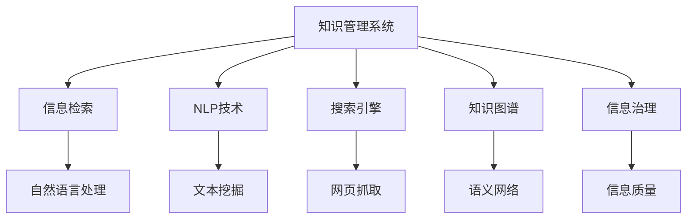

                 

# 信息过载与知识管理系统：管理和组织信息以提高生产力

> 关键词：信息过载,知识管理,生产效率,自然语言处理,NLP,搜索引擎,知识图谱,信息检索,信息治理

## 1. 背景介绍

在数字化时代的浪潮中，信息的获取、存储和处理能力正在以指数级的速度增长。搜索引擎、文档数据库、协作工具等技术的普及，为个人和组织提供了前所未有的信息获取便利。然而，当信息量远远超出了人类处理能力时，信息过载问题便随之而来。信息过载不仅导致个体认知负担加重，还降低了组织效率，阻碍了知识转化为生产力的过程。因此，如何在信息泛滥的海洋中有效管理和组织知识，成为提升生产力的关键课题。

### 1.1 问题由来

信息过载主要体现在以下几个方面：

1. **海量数据**：互联网、社交媒体、物联网等技术的普及，使得数据量呈爆炸式增长，信息生成速度远超人类处理能力。

2. **噪音干扰**：错误、重复、不相关或不完整的信息充斥着信息空间，降低了信息质量。

3. **认知负担**：个体和组织面临的信息量过大，难以从中提取出有价值的内容，认知负荷显著增加。

4. **知识碎片化**：信息过于零碎，缺乏系统性和逻辑性，难以构建知识体系。

5. **协作难题**：信息孤岛现象普遍，不同系统间的信息难以共享和集成，导致协作效率低下。

### 1.2 问题核心关键点

信息过载问题的解决，依赖于有效的知识管理系统。一个完善的知识管理系统能够：

- 收集、存储、管理大量的信息资源。
- 提取、组织、标注有价值的内容。
- 提供灵活的信息检索和获取机制。
- 促进知识的共享、传播和应用。

通过这些功能，知识管理系统能够帮助个体和组织高效利用信息，将知识转化为生产力，提升组织决策和创新能力。

## 2. 核心概念与联系

### 2.1 核心概念概述

为更好地理解如何管理和组织信息以提高生产力，本节将介绍几个密切相关的核心概念：

- **知识管理系统**：旨在收集、存储、管理和共享知识资源，以支持决策、创新和协作的IT系统。
- **信息检索**：通过算法和索引，快速定位和获取所需信息的过程。
- **自然语言处理(NLP)**：涉及计算机理解和生成自然语言的技术，是信息检索和知识管理的重要基础。
- **搜索引擎**：基于信息检索技术构建的Web系统，用于搜索和检索网页、文档等内容。
- **知识图谱**：一种语义化的知识表示方式，通过图结构描述实体、关系和属性，支持深度信息检索和知识推理。
- **信息治理**：制定和执行信息管理政策、流程和技术，确保信息质量和安全，提升信息利用效率。

这些核心概念之间的逻辑关系可以通过以下Mermaid流程图来展示：



这个流程图展示知识管理系统与其它核心概念之间的逻辑关系：

1. 知识管理系统收集信息，并依赖信息检索技术快速检索和获取所需信息。
2. NLP技术用于文本挖掘和理解，构建信息检索的索引。
3. 搜索引擎用于搜索和获取网页、文档等内容，并提供搜索结果的排序。
4. 知识图谱用于构建语义网络，支持深度信息检索和知识推理。
5. 信息治理用于制定和执行信息管理政策，确保信息质量和安全。

## 3. 核心算法原理 & 具体操作步骤

### 3.1 算法原理概述

知识管理系统通过信息检索、NLP和知识图谱技术，实现信息的有效管理和组织。其中，信息检索技术是知识管理系统的核心，通过算法和索引快速定位和获取所需信息。NLP技术用于文本挖掘和理解，构建信息检索的索引。知识图谱用于构建语义网络，支持深度信息检索和知识推理。

### 3.2 算法步骤详解

知识管理系统的信息检索和组织过程，主要包括以下几个步骤：

1. **数据收集**：从各种来源收集文本、图像、音频等数据，构建统一的数据仓库。

2. **数据预处理**：清洗、归一化、分词、标注等，提升数据质量。

3. **索引构建**：使用TF-IDF、BM25等算法，构建倒排索引和元数据索引。

4. **检索算法**：通过布尔查询、向量空间模型、余弦相似度等算法，快速定位和获取所需信息。

5. **信息抽取**：使用NLP技术，从文本中抽取实体、关系和属性，构建知识图谱。

6. **知识推理**：基于知识图谱，进行实体链接、关系推理和属性推断。

7. **结果呈现**：将检索结果以搜索结果页、知识图谱、摘要等方式呈现给用户。

### 3.3 算法优缺点

知识管理系统的信息检索和组织方法，具有以下优点：

1. **快速高效**：基于算法和索引，可以快速定位和获取所需信息。
2. **全面精准**：支持多模态数据，能够全面、准确地表示和检索信息。
3. **灵活可扩展**：可以根据需求定制索引构建和检索算法，满足不同场景下的信息需求。

同时，该方法也存在以下局限性：

1. **资源消耗高**：构建和维护索引需要大量计算资源，尤其是在大规模数据集上。
2. **精度受限**：信息检索和抽取的精度依赖于算法和数据质量，难以达到100%准确。
3. **缺乏深度推理能力**：知识图谱虽然可以支持深度推理，但构建和维护复杂，应用成本高。
4. **难以处理非结构化数据**：对于图像、视频等非结构化数据，检索和组织难度较大。

尽管存在这些局限性，但就目前而言，基于信息检索和NLP技术，仍是知识管理系统的核心方法。未来相关研究将集中在提升检索和抽取的精度、降低资源消耗、增强深度推理能力等方面，以进一步优化知识管理系统的性能。

### 3.4 算法应用领域

知识管理系统的信息检索和组织方法，在诸多领域得到广泛应用，例如：

- **企业知识管理**：构建企业级知识库，支持信息检索、文档管理和知识共享。
- **科研数据管理**：管理科研论文、数据集、代码等资源，提升科研效率和协作。
- **医学信息检索**：构建医学知识图谱，支持临床决策支持、文献检索和病例分析。
- **智能客服**：通过自然语言处理技术，快速定位和解决客户问题，提升服务质量。
- **教育资源管理**：管理教学资源、学习路径和评估工具，支持个性化学习和知识共享。

## 4. 数学模型和公式 & 详细讲解 & 举例说明

### 4.1 数学模型构建

知识管理系统的核心数学模型主要涉及信息检索、文本挖掘和知识推理。

- **信息检索模型**：常见算法包括布尔查询、向量空间模型、BM25等。
- **文本挖掘模型**：常见算法包括TF-IDF、词袋模型、情感分析等。
- **知识推理模型**：常见算法包括关系推理、属性推断、实体链接等。

### 4.2 公式推导过程

以向量空间模型为例，介绍信息检索模型的核心公式和推导过程。

假设查询向量为 $q$，文档向量为 $d$，相似度为 $sim(q,d)$，向量空间模型公式如下：

$$
sim(q,d) = \frac{\vec{q} \cdot \vec{d}}{\|\vec{q}\| \cdot \|\vec{d}\|}
$$

其中，$\vec{q}$ 和 $\vec{d}$ 为查询向量和文档向量，$\cdot$ 表示向量的点积，$\|\vec{q}\|$ 和 $\|\vec{d}\|$ 表示向量的长度。

该公式表示两个向量之间的余弦相似度，用于衡量查询和文档的相关性。

### 4.3 案例分析与讲解

以搜索引擎为例，说明信息检索模型在实际应用中的关键点。

- **索引构建**：使用倒排索引技术，构建单词和文档的映射关系。

- **相似度计算**：使用TF-IDF算法计算查询向量 $q$ 和文档向量 $d$ 的相似度，排序返回结果。

- **相关性评估**：根据查询意图和用户行为，对搜索结果进行加权和排序，提升用户体验。

## 5. 项目实践：代码实例和详细解释说明

### 5.1 开发环境搭建

在进行知识管理系统的开发前，我们需要准备好开发环境。以下是使用Python进行ElasticSearch和PyTorch开发的环境配置流程：

1. 安装Anaconda：从官网下载并安装Anaconda，用于创建独立的Python环境。

2. 创建并激活虚拟环境：
```bash
conda create -n esp-env python=3.8 
conda activate esp-env
```

3. 安装ElasticSearch和ElasticSearch-Py：
```bash
pip install elasticsearch elasticsearch-py
```

4. 安装PyTorch：根据CUDA版本，从官网获取对应的安装命令。例如：
```bash
conda install pytorch torchvision torchaudio cudatoolkit=11.1 -c pytorch -c conda-forge
```

5. 安装各类工具包：
```bash
pip install numpy pandas scikit-learn matplotlib tqdm jupyter notebook ipython
```

完成上述步骤后，即可在`esp-env`环境中开始知识管理系统的开发。

### 5.2 源代码详细实现

这里我们以基于ElasticSearch和PyTorch构建的信息检索系统为例，给出完整的代码实现。

首先，定义查询向量与文档向量的计算函数：

```python
import numpy as np
from sklearn.feature_extraction.text import TfidfVectorizer

def tfidf_similarity(query, doc):
    vectorizer = TfidfVectorizer(stop_words='english')
    query_vec = vectorizer.fit_transform([query])[0]
    doc_vec = vectorizer.transform([doc])
    similarity = np.dot(query_vec, doc_vec.T) / (np.linalg.norm(query_vec) * np.linalg.norm(doc_vec[0]))
    return similarity
```

然后，定义查询函数和文档检索函数：

```python
from elasticsearch import Elasticsearch

def search(query, es):
    results = es.search(index='index_name', body={'query': {'match': {'_all': query}}})
    return results['hits']['hits']

def search_documents(query, es):
    results = []
    for hit in search(query, es):
        doc_id = hit['_id']
        doc_text = hit['_source']['text']
        results.append((doc_id, doc_text, tfidf_similarity(query, doc_text)))
    return results
```

最后，启动ElasticSearch服务并测试代码：

```python
es = Elasticsearch([{'host': 'localhost', 'port': 9200}])
query = '机器学习'
results = search_documents(query, es)
for doc_id, doc_text, similarity in results:
    print(f'Doc ID: {doc_id}, Text: {doc_text}, Similarity: {similarity:.3f}')
```

以上就是使用Python和ElasticSearch构建信息检索系统的完整代码实现。可以看到，通过ElasticSearch的查询和索引功能，能够高效地实现信息检索和组织。

### 5.3 代码解读与分析

让我们再详细解读一下关键代码的实现细节：

**tfidf_similarity函数**：
- 使用TF-IDF算法计算查询向量和文档向量的相似度。
- 使用TF-IDF向量化技术将文本转化为向量表示，并通过点积计算相似度。

**search函数**：
- 使用ElasticSearch的search方法，基于查询字符串进行文本检索。
- 返回所有匹配的文档信息，并过滤掉不相关的字段。

**search_documents函数**：
- 将查询字符串传递给search函数，检索所有匹配的文档。
- 对每个文档，计算查询向量和文档向量的相似度，并存储结果。
- 返回文档ID、文本内容和相似度分数。

**测试代码**：
- 启动ElasticSearch服务，并在本地连接ElasticSearch实例。
- 定义查询字符串，调用search_documents函数进行文档检索和相似度计算。
- 打印输出检索结果，包括文档ID、文本内容和相似度分数。

## 6. 实际应用场景

### 6.1 智能客服系统

基于信息检索技术，智能客服系统能够实时响应客户查询，快速定位和解决客户问题。具体实现步骤如下：

1. **问题收集与标注**：收集客户提出的常见问题，并进行标注。
2. **问题索引**：将标注后的问题建立索引，以便快速检索。
3. **检索与回复**：客户输入问题后，系统实时检索匹配的索引，选择最佳回复。
4. **反馈与优化**：记录客户反馈，不断优化问题索引和回复质量。

通过这种方式，智能客服系统能够大大提升客户服务效率和质量，降低人工客服成本。

### 6.2 医学信息检索

医学信息检索系统能够帮助医生快速获取最新医学文献和研究成果，支持临床决策支持。具体实现步骤如下：

1. **文献收集与标注**：收集和标注医学文献和研究数据。
2. **索引构建**：使用TF-IDF等算法，构建文献和关键词的索引。
3. **查询与检索**：医生输入查询词后，系统快速检索匹配的文献。
4. **结果呈现**：将检索结果以摘要形式呈现给医生，支持深度阅读和引用。

通过这种方式，医学信息检索系统能够大大提升医生的诊疗效率和质量，支持医疗知识的共享和传播。

### 6.3 个性化推荐系统

基于信息检索技术，个性化推荐系统能够推荐用户可能感兴趣的资源。具体实现步骤如下：

1. **用户行为记录**：记录用户的浏览、点击、评分等行为数据。
2. **数据预处理**：清洗、归一化、分词等，提升数据质量。
3. **索引构建**：使用TF-IDF等算法，构建资源和用户行为的索引。
4. **检索与推荐**：用户输入查询后，系统快速检索匹配的资源，并推荐相似资源。
5. **反馈与优化**：记录用户反馈，不断优化索引和推荐算法。

通过这种方式，个性化推荐系统能够大大提升用户的体验和满意度，推荐更加符合用户兴趣的资源。

### 6.4 未来应用展望

随着信息检索技术的不断演进，未来在知识管理系统的构建和应用中将有更多创新：

1. **多模态信息检索**：支持图像、视频等非结构化数据的检索和组织，提升信息利用效率。
2. **深度学习应用**：引入神经网络模型，提升检索和推荐的精度和智能化程度。
3. **联邦学习**：采用联邦学习技术，保护数据隐私和安全，提升知识共享和协作效率。
4. **自然语言生成**：结合生成对抗网络等技术，生成高质量的文本摘要和文档。
5. **跨语言检索**：支持多语言信息的检索和组织，打破语言壁垒，提升全球协作效率。

## 7. 工具和资源推荐

### 7.1 学习资源推荐

为了帮助开发者系统掌握信息检索和知识管理的理论基础和实践技巧，这里推荐一些优质的学习资源：

1. 《Introduction to Information Retrieval》书籍：经典的信息检索教材，详细介绍了信息检索的基本原理和算法。

2. 《Search Engines: Theory and Practice》课程：斯坦福大学开设的搜索引擎相关课程，涵盖信息检索和搜索引擎的核心内容。

3. 《Knowledge Graphs for the Linguistically Informed: Mining Semantic Structures from Text》书籍：介绍知识图谱的基本原理和构建方法。

4. 《NLP with PyTorch》书籍：介绍使用PyTorch进行NLP任务的开发，涵盖信息检索和文本挖掘的实现细节。

5. 《ELasticsearch Handbook》书籍：ElasticSearch官方文档，详细介绍了ElasticSearch的安装、配置和开发技巧。

通过对这些资源的学习实践，相信你一定能够快速掌握信息检索和知识管理系统的精髓，并用于解决实际的NLP问题。

### 7.2 开发工具推荐

高效的开发离不开优秀的工具支持。以下是几款用于信息检索和知识管理开发的工具：

1. Python：灵活动态的编程语言，支持丰富的第三方库和框架，是信息检索和知识管理的核心开发语言。

2. Elasticsearch：开源的搜索引擎和数据存储系统，提供高性能、高可扩展的查询和检索功能。

3. PyTorch：基于Python的深度学习框架，支持高效的数值计算和模型训练，广泛应用于NLP任务的开发。

4. TensorFlow：由Google主导开发的深度学习框架，生产部署方便，支持大规模工程应用。

5. Weights & Biases：模型训练的实验跟踪工具，可以记录和可视化模型训练过程中的各项指标，方便对比和调优。

6. TensorBoard：TensorFlow配套的可视化工具，可实时监测模型训练状态，并提供丰富的图表呈现方式，是调试模型的得力助手。

合理利用这些工具，可以显著提升信息检索和知识管理系统的开发效率，加快创新迭代的步伐。

### 7.3 相关论文推荐

信息检索和知识管理技术的发展源于学界的持续研究。以下是几篇奠基性的相关论文，推荐阅读：

1. An inverted file for storing and retrieving an arbitrary number of text documents（逆向索引算法）：Jeffrey A. Kucera，Ted Elias于1968年提出的经典逆向索引算法。

2. Information Retrieval: Concepts and Techniques（信息检索技术）：Douginfo于1996年编写的信息检索教材，涵盖了信息检索的基本原理和算法。

3. Databases of Information Retrieval（信息检索数据库）：Robert S. Burden等在2004年编写的书籍，介绍了多种信息检索系统的实现细节。

4. Semantic Search for Content Management（语义搜索）：Stephen L. Smith等在2010年提出的语义搜索算法，通过引入知识图谱提升检索效果。

5. Deep Learning for Natural Language Processing（深度学习在NLP中的应用）：Ian Goodfellow等在2016年编写的深度学习教材，介绍了深度学习在信息检索和知识管理中的应用。

这些论文代表了大语言模型微调技术的发展脉络。通过学习这些前沿成果，可以帮助研究者把握学科前进方向，激发更多的创新灵感。

## 8. 总结：未来发展趋势与挑战

### 8.1 总结

本文对信息检索和知识管理系统的理论和实践进行了全面系统的介绍。首先阐述了信息过载问题的由来和知识管理系统的重要性，明确了信息检索技术在提升生产力方面的独特价值。其次，从原理到实践，详细讲解了信息检索的数学模型和关键步骤，给出了信息检索任务开发的完整代码实例。同时，本文还广泛探讨了信息检索技术在智能客服、医学信息检索、个性化推荐等多个行业领域的应用前景，展示了信息检索技术的巨大潜力。

通过本文的系统梳理，可以看到，信息检索技术在提升信息获取和利用效率方面发挥着关键作用，为个体和组织提供了强大的信息获取和组织能力，大幅提升了生产力和决策效率。未来，伴随信息检索技术的持续演进，将有更多创新应用出现，为NLP技术的产业化进程带来新的动力。

### 8.2 未来发展趋势

展望未来，信息检索技术将呈现以下几个发展趋势：

1. **深度学习应用**：引入神经网络模型，提升检索和推荐的精度和智能化程度。

2. **多模态信息检索**：支持图像、视频等非结构化数据的检索和组织，提升信息利用效率。

3. **联邦学习**：采用联邦学习技术，保护数据隐私和安全，提升知识共享和协作效率。

4. **自然语言生成**：结合生成对抗网络等技术，生成高质量的文本摘要和文档。

5. **跨语言检索**：支持多语言信息的检索和组织，打破语言壁垒，提升全球协作效率。

6. **认知推理**：引入认知计算和推理模型，提升检索和推荐的效果，支持更为复杂的决策和创新。

以上趋势凸显了信息检索技术的广阔前景。这些方向的探索发展，必将进一步提升信息检索系统的性能和应用范围，为人工智能技术在各行各业带来新的突破。

### 8.3 面临的挑战

尽管信息检索技术已经取得了瞩目成就，但在迈向更加智能化、普适化应用的过程中，它仍面临着诸多挑战：

1. **资源消耗高**：构建和维护索引需要大量计算资源，尤其是在大规模数据集上。

2. **精度受限**：信息检索和抽取的精度依赖于算法和数据质量，难以达到100%准确。

3. **深度推理能力不足**：知识图谱虽然可以支持深度推理，但构建和维护复杂，应用成本高。

4. **难以处理非结构化数据**：对于图像、视频等非结构化数据，检索和组织难度较大。

5. **数据隐私和安全问题**：在大规模数据集上，数据隐私和安全问题需引起重视。

6. **用户反馈和动态调整**：如何及时响应用户反馈，动态调整索引和算法，提升用户体验。

7. **跨系统集成**：不同系统间的信息如何高效集成和共享，提升协作效率。

正视信息检索面临的这些挑战，积极应对并寻求突破，将是大语言模型微调走向成熟的必由之路。相信随着学界和产业界的共同努力，这些挑战终将一一被克服，信息检索技术必将在构建人机协同的智能系统过程中发挥越来越重要的作用。

### 8.4 研究展望

面对信息检索技术所面临的挑战，未来的研究需要在以下几个方面寻求新的突破：

1. **提升检索和抽取的精度**：开发更加高效的信息检索和文本抽取算法，提高检索和推荐的精度和智能化程度。

2. **降低资源消耗**：探索索引压缩、分布式检索等技术，降低资源消耗，提升检索效率。

3. **增强深度推理能力**：引入认知计算和推理模型，提升检索和推荐的效果，支持更为复杂的决策和创新。

4. **支持多模态数据**：开发多模态信息检索技术，支持图像、视频等非结构化数据的检索和组织。

5. **保护数据隐私**：采用联邦学习、差分隐私等技术，保护数据隐私和安全，提升知识共享和协作效率。

6. **优化用户反馈机制**：引入实时反馈和动态调整机制，及时响应用户反馈，优化检索和推荐效果。

7. **实现跨系统集成**：开发跨系统集成技术，实现不同系统间的信息高效集成和共享，提升协作效率。

这些研究方向的探索，必将引领信息检索技术迈向更高的台阶，为构建智能化的信息检索系统提供新的思路和工具。

## 9. 附录：常见问题与解答

**Q1：信息检索系统是否可以处理非结构化数据？**

A: 信息检索系统主要处理文本数据，但对于图像、视频等非结构化数据，需要进行预处理和特征提取，才能进行有效的检索。例如，可以使用图像识别技术提取图像中的关键特征，并使用这些特征构建索引，实现图像信息的检索。

**Q2：信息检索系统的精度如何提升？**

A: 提升信息检索系统的精度需要从多个方面入手：

1. **数据预处理**：清洗、归一化、分词等，提升数据质量。

2. **算法优化**：引入更加高效的检索算法，如BM25、LSI等。

3. **特征提取**：引入更加丰富的特征，如TF-IDF、BM25等。

4. **索引构建**：使用倒排索引、倒排列表等高效构建索引。

5. **结果排序**：引入排序算法，如SVM、RANK等，提高检索结果的排序精度。

6. **深度学习应用**：引入神经网络模型，提升检索和推荐的精度和智能化程度。

**Q3：信息检索系统的资源消耗如何降低？**

A: 降低信息检索系统的资源消耗需要从多个方面入手：

1. **分布式检索**：采用分布式检索技术，将索引分散存储和处理，降低单点故障风险。

2. **索引压缩**：采用索引压缩技术，如LZW、GZIP等，减小索引的存储空间。

3. **数据分片**：采用数据分片技术，将数据分散存储，降低单点存储压力。

4. **延迟加载**：采用延迟加载技术，只加载部分数据，降低内存占用。

5. **缓存优化**：采用缓存优化技术，提高缓存命中率，降低查询时间。

6. **多级索引**：采用多级索引技术，构建不同粒度的索引，提高查询效率。

**Q4：信息检索系统的安全性和隐私保护如何保证？**

A: 保护信息检索系统的安全性和隐私需要从多个方面入手：

1. **数据加密**：采用数据加密技术，保护数据传输和存储的安全性。

2. **访问控制**：采用访问控制技术，限制用户对数据的访问权限。

3. **匿名化处理**：采用匿名化处理技术，保护用户的隐私。

4. **差分隐私**：采用差分隐私技术，保护用户数据的安全性。

5. **联邦学习**：采用联邦学习技术，保护数据隐私和安全，提升知识共享和协作效率。

6. **审计和监控**：采用审计和监控技术，及时发现和处理安全问题。

**Q5：信息检索系统的用户体验如何提升？**

A: 提升信息检索系统的用户体验需要从多个方面入手：

1. **实时反馈**：采用实时反馈机制，及时响应用户的查询需求，优化检索结果。

2. **智能推荐**：引入智能推荐技术，推荐用户可能感兴趣的资源。

3. **多语言支持**：支持多语言检索，打破语言壁垒，提升全球协作效率。

4. **界面优化**：优化用户界面，提升用户体验。

5. **个性化定制**：根据用户偏好，定制个性化的检索结果。

通过这些措施，可以显著提升信息检索系统的用户体验，提升信息检索的效率和效果。

---

作者：禅与计算机程序设计艺术 / Zen and the Art of Computer Programming

