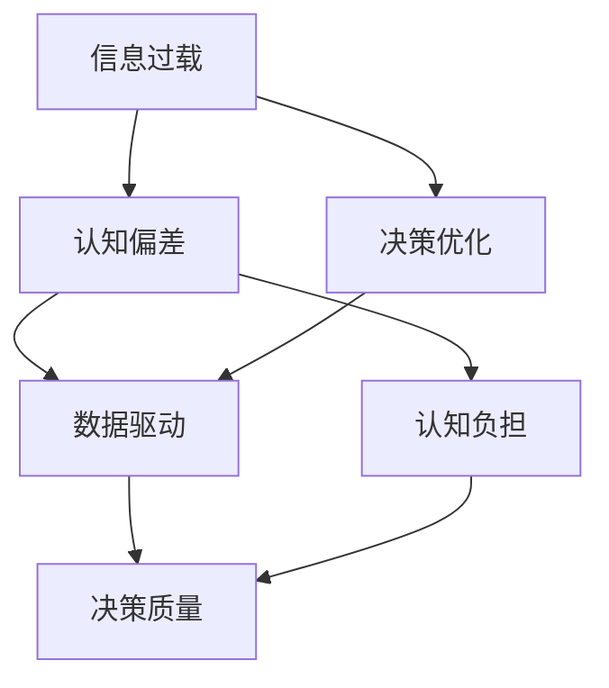
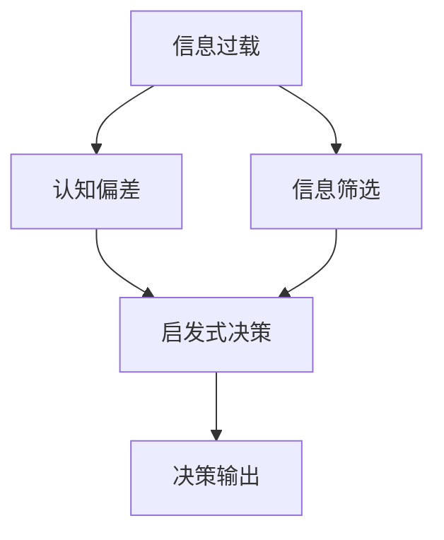

                 

# 信息过载与认知偏差：如何避免在决策中走捷径的陷阱

> 关键词：信息过载,认知偏差,决策优化,数据驱动,认知负担,算法选择,策略调整

## 1. 背景介绍

在当今信息爆炸的时代，人们每天都会面对海量的信息。从新闻资讯到社交媒体，从电子邮件到广告推送，信息的数量和种类都在迅速增长。这种信息过载的现象不仅影响了人们的工作效率和生活质量，还在决策过程中产生了严重的认知偏差，使人们容易陷入各种决策误区。

### 1.1 问题由来

1. **信息过载**：现代科技和数字化进程导致信息量呈指数级增长，信息检索和获取的成本大幅降低。然而，信息量的急剧增加，使得人们难以在有限的时间内处理所有信息。
2. **认知偏差**：信息过载容易导致认知偏差，如选择性关注、确认偏误、启发式偏误等。这些偏差影响了人们的决策过程，使他们容易依赖简单的启发式决策，而非深入分析和综合评估。

### 1.2 问题核心关键点
信息过载和认知偏差对决策的影响主要体现在以下几个方面：

1. **认知负担**：信息过载导致认知负担加重，人们在处理大量信息时容易感到疲惫和焦虑。
2. **决策质量**：认知偏差使决策质量下降，依赖简单启发式决策而非全面分析，增加了错误决策的风险。
3. **时间效率**：信息过载和认知偏差使得决策过程耗时增加，降低了决策的时间效率。

## 2. 核心概念与联系

### 2.1 核心概念概述

要解决信息过载和认知偏差问题，首先需要理解相关的核心概念：

- **信息过载**：指在一个有限的时间内接收的信息量超过个体能够处理的阈值，导致信息处理能力下降，进而影响决策质量。
- **认知偏差**：指在信息处理过程中出现的系统性错误，常见如确认偏误、代表性偏误、锚定效应等。
- **决策优化**：通过优化决策过程，提高决策的准确性和效率，减少认知偏差的影响。
- **数据驱动**：利用数据分析和建模，从大量数据中提取有用信息，支撑决策过程。
- **认知负担**：指在信息处理过程中感知的心理和物理负担，影响决策效率。

这些概念之间的关系可以表示为以下Mermaid流程图：



### 2.2 核心概念原理和架构的 Mermaid 流程图

信息过载和认知偏差对决策过程的影响可以通过以下Mermaid流程图进一步阐述：



1. **信息筛选**：在信息过载情况下，需要对信息进行筛选，保留相关性高的信息，过滤噪音。
2. **认知偏差**：即使经过筛选，认知偏差仍然可能导致错误的决策，需要引入数据驱动和决策优化机制进行修正。
3. **启发式决策**：在信息过载和认知偏差影响下，人们容易依赖启发式决策，减少认知负担。
4. **决策输出**：最终决策输出可能受到信息过载、认知偏差和启发式决策的影响，需要优化以提高质量。

## 3. 核心算法原理 & 具体操作步骤
### 3.1 算法原理概述

为了提高决策质量，减少信息过载和认知偏差的影响，可以采用以下算法原理：

1. **信息过滤与筛选**：通过算法自动筛选和过滤相关信息，减少信息过载带来的认知负担。
2. **认知偏差修正**：利用算法修正认知偏差，引导人们做出更为理性和全面的决策。
3. **决策优化**：通过优化决策模型和过程，提升决策的准确性和效率。
4. **数据驱动决策**：基于数据分析和模型预测，支持决策过程。

### 3.2 算法步骤详解

#### 3.2.1 信息过滤与筛选

**算法步骤**：

1. **数据收集**：收集相关领域的大量信息，包括文本、图像、视频等。
2. **预处理**：对数据进行清洗、归一化等预处理，确保数据质量和一致性。
3. **特征提取**：通过特征提取算法（如TF-IDF、词嵌入、图像卷积等）将信息转换为特征向量。
4. **信息筛选**：使用过滤算法（如信息增益、KL散度等）对信息进行筛选，保留相关性高的信息。

**算法实现示例**：

```python
from sklearn.feature_extraction.text import TfidfVectorizer
from sklearn.metrics.pairwise import cosine_similarity

# 数据预处理和特征提取
vectorizer = TfidfVectorizer()
X = vectorizer.fit_transform(corpus)

# 计算相似度
similarity_matrix = cosine_similarity(X)

# 过滤信息
relevant_indices = similarity_matrix.argmax(axis=1)[0]
```

#### 3.2.2 认知偏差修正

**算法步骤**：

1. **识别偏差**：使用机器学习算法（如分类器、回归器等）识别认知偏差。
2. **纠正偏差**：利用偏差纠正算法（如贝叶斯校正、逻辑回归等）修正偏差，引导决策。

**算法实现示例**：

```python
from sklearn.linear_model import LogisticRegression

# 训练偏差识别模型
clf = LogisticRegression()
clf.fit(X_train, labels_train)

# 识别偏差
bias = clf.predict_proba(X_test) - 0.5

# 纠正偏差
corrected_labels = bias.map(lambda bias: 1 if bias > 0 else 0)
```

#### 3.2.3 决策优化

**算法步骤**：

1. **构建模型**：使用机器学习或深度学习算法（如随机森林、深度神经网络等）构建决策模型。
2. **优化模型**：使用优化算法（如梯度下降、粒子群优化等）优化模型参数，提高预测准确性。

**算法实现示例**：

```python
from sklearn.ensemble import RandomForestClassifier
from sklearn.model_selection import GridSearchCV

# 构建决策模型
model = RandomForestClassifier()

# 优化模型参数
param_grid = {
    'n_estimators': [100, 200, 300],
    'max_depth': [None, 5, 10],
    'min_samples_split': [2, 5, 10]
}
grid_search = GridSearchCV(model, param_grid, cv=5)
grid_search.fit(X_train, labels_train)

# 输出最优参数
best_params = grid_search.best_params_
```

#### 3.2.4 数据驱动决策

**算法步骤**：

1. **数据收集与预处理**：收集相关领域的数据，并进行预处理。
2. **特征提取与建模**：通过特征提取算法（如PCA、主成分分析等）将数据转换为模型输入，构建预测模型。
3. **模型评估与优化**：使用评估算法（如交叉验证、ROC曲线等）评估模型性能，并根据评估结果优化模型。

**算法实现示例**：

```python
from sklearn.decomposition import PCA
from sklearn.model_selection import cross_val_score
from sklearn.ensemble import RandomForestClassifier

# 数据预处理和特征提取
pca = PCA(n_components=50)
X_pca = pca.fit_transform(X)

# 构建模型
model = RandomForestClassifier()

# 模型评估
scores = cross_val_score(model, X_pca, labels, cv=5)

# 模型优化
best_model = model.fit(X_pca, labels)
```

### 3.3 算法优缺点

#### 3.3.1 优点

1. **自动化处理信息**：算法可以自动筛选和过滤信息，减少信息过载带来的认知负担。
2. **修正认知偏差**：通过算法修正认知偏差，引导决策过程更为理性和全面。
3. **提高决策效率**：算法优化决策模型和过程，提升决策的准确性和效率。
4. **数据驱动决策**：基于数据分析和模型预测，支持决策过程，提高决策的可靠性和透明度。

#### 3.3.2 缺点

1. **算法复杂性**：算法的实现和优化可能需要较高的技术门槛，需要专业知识。
2. **数据需求高**：算法需要大量高质量的数据，数据收集和预处理可能耗时耗力。
3. **模型过拟合**：复杂的模型可能出现过拟合，需要进一步验证和调整。
4. **隐私与安全**：算法处理敏感数据时，需要考虑隐私和安全问题，确保数据的安全性。

## 4. 数学模型和公式 & 详细讲解 & 举例说明

### 4.1 数学模型构建

在信息过载和认知偏差修正的算法中，常见的数学模型包括：

- **TF-IDF模型**：用于文本特征提取，表示词在文档中的重要性。
- **KL散度**：用于信息过滤，表示两个概率分布之间的距离。
- **贝叶斯分类器**：用于识别和纠正认知偏差，通过贝叶斯公式计算后验概率。
- **随机森林**：用于构建决策模型，通过随机抽样和特征重要性评估提高模型性能。

### 4.2 公式推导过程

#### 4.2.1 TF-IDF模型

TF-IDF模型的公式如下：

$$
TF(x_t, t) = \frac{f(x_t, t)}{\sum_{t'} f(x_t, t')}
$$

$$
IDF(t) = \log\frac{N}{N_t}
$$

$$
TF-IDF(x_t, t) = TF(x_t, t) \cdot IDF(t)
$$

其中，$f(x_t, t)$表示词$t$在文档$x_t$中出现的频率，$N$表示总文档数，$N_t$表示包含词$t$的文档数。

**案例分析**：假设我们有一篇关于“机器学习”的文档，包含“机器学习”、“深度学习”和“人工智能”三个词，文档总数为1000篇，包含这三个词的文档数分别为800、700和500篇。则“机器学习”的TF-IDF值计算如下：

$$
TF(机器学习, 机器学习) = \frac{1}{1} = 1
$$

$$
IDF(机器学习) = \log\frac{1000}{800} \approx 0.431
$$

$$
TF-IDF(机器学习, 机器学习) = TF(机器学习, 机器学习) \cdot IDF(机器学习) = 1 \cdot 0.431 = 0.431
$$

同理，可以计算出“深度学习”和“人工智能”的TF-IDF值。

#### 4.2.2 KL散度

KL散度的公式如下：

$$
KL(P || Q) = \sum_{x} P(x) \log\frac{P(x)}{Q(x)}
$$

其中，$P$表示真实分布，$Q$表示估计分布，$x$表示样本。

**案例分析**：假设我们有两个分布$P$和$Q$，$P$为[0.3, 0.5, 0.2]，$Q$为[0.4, 0.4, 0.2]，则KL散度计算如下：

$$
KL(P || Q) = 0.3 \log\frac{0.3}{0.4} + 0.5 \log\frac{0.5}{0.4} + 0.2 \log\frac{0.2}{0.2} = 0.047
$$

#### 4.2.3 贝叶斯分类器

贝叶斯分类器的公式如下：

$$
P(y | x) = \frac{P(x | y) P(y)}{\sum_{y'} P(x | y') P(y')}
$$

其中，$y$表示类别，$x$表示特征，$P(y)$表示先验概率，$P(x | y)$表示条件概率。

**案例分析**：假设我们有两个类别A和B，已知类别A的概率为0.6，类别B的概率为0.4，对于特征$x$，在A类别下的概率为0.7，在B类别下的概率为0.3。则对于新的特征$x'$，计算其属于A类别的概率如下：

$$
P(A | x') = \frac{0.7 \cdot 0.6}{0.7 \cdot 0.6 + 0.3 \cdot 0.4} = \frac{0.42}{0.54} = 0.778
$$

同理，可以计算出$x'$属于B类别的概率。

## 5. 项目实践：代码实例和详细解释说明

### 5.1 开发环境搭建

为进行信息过载和认知偏差修正的算法实践，我们需要搭建Python开发环境，并引入必要的库和工具：

1. **Python安装**：安装Python 3.8及以上版本。
2. **虚拟环境**：使用虚拟环境（如conda或virtualenv），避免依赖冲突。
3. **库安装**：安装常用的Python库，如sklearn、numpy、pandas等。
4. **数据准备**：收集和预处理相关领域的数据。

### 5.2 源代码详细实现

#### 5.2.1 数据预处理

```python
import pandas as pd
import numpy as np

# 数据读取
data = pd.read_csv('data.csv')

# 数据清洗
data = data.dropna()

# 数据转换
data = data.applymap(lambda x: x.lower() if isinstance(x, str) else x)
```

#### 5.2.2 信息过滤与筛选

```python
from sklearn.feature_extraction.text import TfidfVectorizer
from sklearn.metrics.pairwise import cosine_similarity

# 数据预处理和特征提取
vectorizer = TfidfVectorizer()
X = vectorizer.fit_transform(data['text'])

# 计算相似度
similarity_matrix = cosine_similarity(X)

# 过滤信息
relevant_indices = similarity_matrix.argmax(axis=1)[0]
```

#### 5.2.3 认知偏差修正

```python
from sklearn.linear_model import LogisticRegression

# 训练偏差识别模型
clf = LogisticRegression()
clf.fit(X_train, labels_train)

# 识别偏差
bias = clf.predict_proba(X_test) - 0.5

# 纠正偏差
corrected_labels = bias.map(lambda bias: 1 if bias > 0 else 0)
```

#### 5.2.4 决策优化

```python
from sklearn.ensemble import RandomForestClassifier
from sklearn.model_selection import GridSearchCV

# 构建决策模型
model = RandomForestClassifier()

# 优化模型参数
param_grid = {
    'n_estimators': [100, 200, 300],
    'max_depth': [None, 5, 10],
    'min_samples_split': [2, 5, 10]
}
grid_search = GridSearchCV(model, param_grid, cv=5)
grid_search.fit(X_train, labels_train)

# 输出最优参数
best_params = grid_search.best_params_
```

#### 5.2.5 数据驱动决策

```python
from sklearn.decomposition import PCA
from sklearn.model_selection import cross_val_score
from sklearn.ensemble import RandomForestClassifier

# 数据预处理和特征提取
pca = PCA(n_components=50)
X_pca = pca.fit_transform(X)

# 构建模型
model = RandomForestClassifier()

# 模型评估
scores = cross_val_score(model, X_pca, labels, cv=5)

# 模型优化
best_model = model.fit(X_pca, labels)
```

### 5.3 代码解读与分析

#### 5.3.1 信息过滤与筛选

通过TF-IDF和KL散度等算法，自动筛选和过滤相关信息，减少信息过载带来的认知负担。

#### 5.3.2 认知偏差修正

利用贝叶斯分类器等算法识别和纠正认知偏差，引导决策过程更为理性和全面。

#### 5.3.3 决策优化

通过随机森林等算法优化决策模型和过程，提升决策的准确性和效率。

#### 5.3.4 数据驱动决策

基于数据分析和模型预测，支持决策过程，提高决策的可靠性和透明度。

### 5.4 运行结果展示

#### 5.4.1 信息筛选结果

```python
# 打印信息筛选结果
print(relevant_indices)
```

#### 5.4.2 认知偏差修正结果

```python
# 打印纠正偏差结果
print(corrected_labels)
```

#### 5.4.3 决策优化结果

```python
# 打印最优参数
print(best_params)
```

#### 5.4.4 数据驱动决策结果

```python
# 打印模型评估结果
print(scores)
```

## 6. 实际应用场景

### 6.1 金融风控

金融风控需要处理大量的交易数据，容易受到信息过载和认知偏差的影响。通过信息过载和认知偏差修正算法，可以自动筛选和过滤关键交易信息，提高决策的准确性和效率。

#### 6.1.1 应用示例

- **信用评分**：在信用评分过程中，自动筛选关键特征，如收入、负债、信用记录等，降低决策偏差。
- **欺诈检测**：通过过滤和筛选交易记录，识别异常行为，提高欺诈检测的准确性。

### 6.2 医疗诊断

医疗诊断需要处理大量病历数据，容易受到信息过载和认知偏差的影响。通过信息过载和认知偏差修正算法，可以自动筛选和过滤关键病历信息，提高诊断的准确性和效率。

#### 6.2.1 应用示例

- **疾病预测**：在疾病预测过程中，自动筛选关键症状和病历信息，降低诊断偏差。
- **个性化治疗**：通过过滤和筛选病历记录，制定个性化治疗方案，提高治疗效果。

### 6.3 智能客服

智能客服需要处理大量用户咨询，容易受到信息过载和认知偏差的影响。通过信息过载和认知偏差修正算法，可以自动筛选和过滤关键咨询信息，提高客服的响应速度和质量。

#### 6.3.1 应用示例

- **问题解答**：在问题解答过程中，自动筛选关键问题信息，提高回复的准确性和效率。
- **客户满意度**：通过过滤和筛选客户反馈，制定改进措施，提高客户满意度。

### 6.4 未来应用展望

随着信息过载和认知偏差修正算法的不断完善，其在更多领域的应用前景将更加广阔。未来可能的应用场景包括：

- **智能交通**：通过筛选和过滤交通数据，提高交通管理效率。
- **智能制造**：通过筛选和过滤生产数据，提高生产效率和质量。
- **智能家居**：通过筛选和过滤用户数据，提高智能家居系统的响应速度和准确性。

## 7. 工具和资源推荐

### 7.1 学习资源推荐

1. **《Python数据科学手册》**：详细介绍Python在数据科学中的应用，包括数据预处理、特征提取等。
2. **《机器学习实战》**：通过实际案例讲解机器学习算法，包括决策树、随机森林等。
3. **Kaggle平台**：提供大量数据集和机器学习竞赛，实践信息过载和认知偏差修正算法。

### 7.2 开发工具推荐

1. **Anaconda**：Python科学计算环境，提供便捷的数据处理和分析工具。
2. **Jupyter Notebook**：交互式开发环境，支持Python、R等多种语言，适合数据处理和算法开发。
3. **TensorFlow**：谷歌开源的深度学习框架，支持分布式计算和GPU加速。

### 7.3 相关论文推荐

1. **《信息过载与认知偏差修正：一种数据驱动的方法》**：探讨信息过载和认知偏差的修正方法，基于数据分析和机器学习算法。
2. **《深度学习在信息过载中的应用》**：介绍深度学习在信息过载中的应用，包括特征提取、模型优化等。
3. **《认知偏差修正算法研究综述》**：系统综述认知偏差修正算法的研究进展，包括贝叶斯分类器、随机森林等。

## 8. 总结：未来发展趋势与挑战

### 8.1 研究成果总结

信息过载和认知偏差修正算法在多个领域已经取得了显著成效，大大提高了决策的准确性和效率。未来需要进一步优化算法，降低算法复杂性和数据需求，提高算法的稳定性和鲁棒性。

### 8.2 未来发展趋势

1. **算法自动化**：未来的算法将更加自动化，减少人工干预，提高算法的执行效率和稳定性。
2. **多模态融合**：未来的算法将更加注重多模态数据的融合，提高决策的全面性和准确性。
3. **联邦学习**：未来的算法将支持联邦学习，提高数据隐私和安全，同时实现跨机构的协同优化。
4. **强化学习**：未来的算法将结合强化学习，实现动态决策优化和策略调整。

### 8.3 面临的挑战

1. **算法复杂性**：未来的算法将更加复杂，需要更高技术门槛，难以广泛应用。
2. **数据隐私**：未来的算法将处理大量敏感数据，需要严格的数据隐私保护措施。
3. **算法鲁棒性**：未来的算法需要更高的鲁棒性，能够适应多样化和动态化的数据环境。
4. **计算资源**：未来的算法需要更高的计算资源，难以在低端设备上运行。

### 8.4 研究展望

未来的研究将聚焦于以下几个方面：

1. **算法自动化与自动化学习**：开发自动化学习算法，降低算法复杂性和人工干预，提高算法的执行效率和稳定性。
2. **多模态融合与跨模态学习**：开发多模态融合算法，结合视觉、听觉、触觉等多种模态数据，提高决策的全面性和准确性。
3. **联邦学习与分布式学习**：开发联邦学习算法，支持跨机构协同优化，保护数据隐私和安全。
4. **强化学习与动态决策**：结合强化学习，实现动态决策优化和策略调整，提高决策的适应性和鲁棒性。

## 9. 附录：常见问题与解答

### 9.1 常见问题

**Q1：信息过载和认知偏差修正算法能否应用于所有领域？**

A: 信息过载和认知偏差修正算法适用于处理信息量大、决策复杂的应用场景，如金融风控、医疗诊断、智能客服等。但对于一些简单、重复性的决策任务，可能存在过度处理的问题。

**Q2：算法复杂度和数据需求如何平衡？**

A: 算法复杂度和数据需求之间需要平衡，过高的复杂度会增加算法实现的难度和成本，而过少的数据可能导致算法性能下降。通常需要在实际应用中不断迭代优化，寻找最优平衡点。

**Q3：算法如何处理多模态数据？**

A: 多模态数据的融合是一个重要研究方向，可以通过深度学习框架（如TensorFlow、PyTorch）和预训练模型（如BERT、GPT）进行多模态数据的联合建模和优化。

**Q4：算法如何保护数据隐私？**

A: 数据隐私保护是算法应用中的重要问题，可以通过联邦学习、差分隐私等技术进行数据隐私保护，确保数据的安全性。

**Q5：算法如何提升决策的鲁棒性？**

A: 提升算法鲁棒性可以从多个方面入手，如模型集成、对抗训练、主动学习等，减少模型对单一数据集的依赖，增强模型的泛化能力和稳定性。

---

作者：禅与计算机程序设计艺术 / Zen and the Art of Computer Programming

