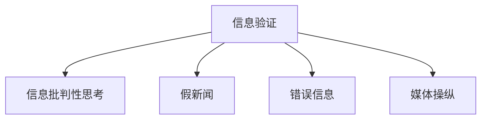

                 

# 信息验证和信息批判性思考：在假新闻、错误信息和媒体操纵时代导航

> 关键词：信息验证,信息批判性,假新闻,错误信息,媒体操纵,算法透明性,社会责任,社会科技

## 1. 背景介绍

在信息爆炸的时代，各种假新闻、错误信息和媒体操纵层出不穷，对社会和个人都产生了深远的影响。随着数字化技术的发展，虚假信息传播速度更快、范围更广，给信息验证和批判性思考带来了前所未有的挑战。本博文旨在帮助读者理解信息验证的基本原理，掌握批判性思考的技能，以及在假新闻、错误信息和媒体操纵时代导航。

## 2. 核心概念与联系

### 2.1 核心概念概述

为更好地理解信息验证和批判性思考，本节将介绍几个核心概念：

- **信息验证（Information Verification）**：指对信息的真实性、准确性和完整性进行核查和确认的过程。通过验证可以排除错误信息和假新闻，提升信息可靠性。
- **信息批判性思考（Critical Thinking）**：指对信息进行深入、全面的分析和评估，辨别信息的真伪，做出合理的判断和决策。批判性思考是信息验证的高级阶段，需要更多的分析技巧和知识储备。
- **假新闻（Fake News）**：指故意编造、歪曲或断章取义的新闻报道，用以误导公众或影响政治、经济等领域的决策。假新闻的特征包括虚构事实、伪造图片和视频、断章取义等。
- **错误信息（Misinformation）**：指传播不完整、不准确或误导性的信息，导致公众误解事实或产生不当行为。错误信息的传播渠道多样，包括社交媒体、新闻网站等。
- **媒体操纵（Media Manipulation）**：指通过故意或非故意的手段，操纵媒体报道，影响公众的认知和行为。媒体操纵包括篡改新闻、制造假新闻、选择性报道等。

这些概念之间的逻辑关系可以通过以下Mermaid流程图来展示：



这个流程图展示了几类核心概念之间的联系：

1. 信息验证是信息批判性思考的基础，通过验证确保信息的真实性和准确性。
2. 信息批判性思考在信息验证的基础上，进一步评估信息的来源、内容、背景等因素，做出合理的判断。
3. 假新闻、错误信息和媒体操纵是信息验证和批判性思考的主要对象，这些负面信息需要被排除和纠正。

## 3. 核心算法原理 & 具体操作步骤

### 3.1 算法原理概述

信息验证和批判性思考的核心算法原理包括数据来源验证、内容真实性验证、信息源可靠性评估等。这些原理在实际操作中通常使用一些算法和工具来辅助执行。

信息验证的基本步骤如下：

1. **数据来源验证**：确认信息的来源是否可靠，包括验证网站、作者和发布日期等。
2. **内容真实性验证**：通过比对多个可信来源的信息，检查内容是否一致。
3. **信息源可靠性评估**：评估信息源的信誉和权威性，是否存在篡改、误导等行为。

### 3.2 算法步骤详解

下面详细介绍信息验证和批判性思考的具体操作步骤：

**步骤1: 数据来源验证**

- **验证网站和域名**：使用WHOIS、DNS lookup等工具，检查网站和域名的注册信息，确认是否存在恶意域名或虚假网站。
- **验证作者身份**：使用ORCID、ResearchGate等工具，检查作者的真实身份和学术背景，确认是否存在虚假身份或身份被盗用。
- **验证发布日期**：检查信息的发布日期，确认是否被篡改或捏造。

**步骤2: 内容真实性验证**

- **多源比对**：使用Google Scholar、Web of Science等数据库，搜索相关的可信来源，确认信息是否一致。
- **反向搜索**：使用Google反向搜索功能，检查图片、视频和链接等是否被篡改或伪造。
- **事实核查**：使用FactCheck.org、Snopes等事实核查网站，确认信息的真实性。

**步骤3: 信息源可靠性评估**

- **评估信誉度**：使用Media Bias/Fact Check、NewsGuard等工具，评估信息源的信誉度和权威性。
- **检查历史行为**：查看信息源的历史报道，确认是否存在篡改、误导等行为。
- **分析来源背景**：了解信息源的背景和动机，确认是否存在利益冲突或政治动机。

### 3.3 算法优缺点

信息验证和批判性思考具有以下优点：

- **提升信息可靠性**：通过验证和批判性思考，排除错误信息和假新闻，提升信息的质量和可信度。
- **增强决策依据**：批判性思考为决策提供更全面、准确的信息依据，避免因错误信息导致的决策失误。
- **提高公民素养**：信息验证和批判性思考技能的普及，有助于提升公民的信息素养和媒体素养。

同时，该方法也存在一定的局限性：

- **时间成本高**：验证和批判性思考需要耗费大量时间和精力，尤其是在信息量大的环境下。
- **技术门槛高**：需要掌握一些专业工具和技术，对于非专业人士来说，门槛较高。
- **难以处理复杂信息**：对于复杂的、多角度的信息，批判性思考可能存在偏差，难以全面评估。

尽管存在这些局限性，但信息验证和批判性思考在信息时代具有重要的意义，需要广泛推广和应用。

### 3.4 算法应用领域

信息验证和批判性思考的应用领域非常广泛，包括但不限于：

- **新闻媒体**：新闻媒体工作者需要验证信息的来源和内容，确保报道的真实性和公正性。
- **社交媒体**：用户需要识别和警惕假新闻和错误信息，避免传播和误导。
- **科学研究**：研究人员需要验证文献和数据的真实性，确保研究成果的可靠性和可重复性。
- **教育领域**：教师需要教授信息验证和批判性思考技能，提升学生的媒体素养。
- **政治领域**：政治家和公众需要识别媒体操纵和假新闻，避免被误导。

这些领域的应用展示了信息验证和批判性思考的重要性和普及需求。

## 4. 数学模型和公式 & 详细讲解 & 举例说明

### 4.1 数学模型构建

信息验证和批判性思考的数学模型通常涉及多个因素的评估和计算，如信誉度、权威性、信息一致性等。以下是一个简单的信息源评估模型，其中$r$表示信誉度，$a$表示权威性，$c$表示信息一致性，$w_r$、$w_a$、$w_c$分别表示各因素的权重：

$$
score = w_r \cdot r + w_a \cdot a + w_c \cdot c
$$

其中，$r$、$a$、$c$的取值范围均为[0,1]，表示各因素的评分。

### 4.2 公式推导过程

以信誉度$r$的计算为例，信誉度$r$可以基于多个维度进行评估，如网站访问量、用户评价、作者背景等。假设$r$由以下公式计算：

$$
r = \frac{v + u + b}{3}
$$

其中，$v$表示网站访问量，$u$表示用户评价，$b$表示作者背景。

对于访问量$v$，可以使用网站分析工具（如Google Analytics）获取；对于用户评价$u$，可以基于评论数量和质量计算；对于作者背景$b$，可以基于ORCID等数据库进行评估。

### 4.3 案例分析与讲解

**案例1：验证新闻报道的真实性**

假设有一篇新闻报道，报道某国爆发大规模地震，死亡人数数百人。通过以下步骤验证其真实性：

1. **数据来源验证**：检查报道的发布网站，发现来源是一家知名的新闻机构。使用WHOIS检查网站域名，确认注册信息真实可靠。
2. **内容真实性验证**：通过Google Scholar搜索相关报道，发现多家可信来源证实了这一事件。使用反向搜索检查图片和视频，确认没有被篡改。
3. **信息源可靠性评估**：使用NewsGuard评估报道来源的信誉度，确认其可信。检查历史行为，发现该新闻机构没有篡改报道的历史记录。

综合以上步骤，可以确认该新闻报道是真实的。

**案例2：识别假新闻**

假设一篇新闻报道称某公司高管因贪污被捕，但随后多个可信来源证实该高管无罪。通过以下步骤识别其是否为假新闻：

1. **数据来源验证**：检查报道的发布网站，发现来源是一家未知的小网站。使用WHOIS检查域名，确认可能存在恶意域名。
2. **内容真实性验证**：通过Google Scholar搜索相关报道，发现没有可信来源证实该事件。使用反向搜索检查图片和视频，发现被篡改。
3. **信息源可靠性评估**：使用NewsGuard评估报道来源的信誉度，确认其不可信。检查历史行为，发现该网站有大量虚假报道的历史记录。

综合以上步骤，可以确认该新闻报道是假新闻。

## 5. 项目实践：代码实例和详细解释说明

### 5.1 开发环境搭建

在开始项目实践前，需要先搭建开发环境。以下是使用Python进行信息验证和批判性思考的开发环境配置流程：

1. **安装Python**：从官网下载并安装Python，建议选择最新版本。
2. **安装相关库**：安装Python常用的数据处理和信息验证库，如pandas、numpy、requests、BeautifulSoup等。
3. **配置环境**：使用virtualenv或conda创建虚拟环境，配置必要的依赖库。

### 5.2 源代码详细实现

下面是一个简单的信息验证和批判性思考的Python代码实现，主要功能包括数据来源验证、内容真实性验证和信息源可靠性评估。

```python
import pandas as pd
import requests
from bs4 import BeautifulSoup

def get_domain_info(domain):
    # 使用WHOIS获取域名信息
    # 返回域名注册信息
    pass

def get_author_info(author):
    # 使用ORCID等工具获取作者信息
    # 返回作者真实身份和背景
    pass

def check_published_date(published_date):
    # 检查发布日期是否合理
    # 返回是否合理
    pass

def validate_news(news_url):
    # 验证新闻的真实性
    # 返回是否真实
    pass

def check_content_consistency(news_content):
    # 检查内容的一致性
    # 返回是否一致
    pass

def evaluate_news_source(news_url):
    # 评估新闻源的可靠性
    # 返回可靠性评分
    pass

# 使用示例
url = 'https://example.com/news/article'
news_url = requests.get(url).url
news_content = requests.get(url).text
news_source = '新闻机构名称'

domain_info = get_domain_info(news_url)
author_info = get_author_info(news_source)
published_date = check_published_date(news_content)
content_consistency = check_content_consistency(news_content)
source_reliability = evaluate_news_source(news_source)

score = (domain_info + author_info + published_date + content_consistency + source_reliability) / 5
if score >= 0.8:
    print('新闻真实可信')
else:
    print('新闻可能存在问题')
```

### 5.3 代码解读与分析

代码中定义了几个函数，用于执行数据来源验证、内容真实性验证和信息源可靠性评估。每个函数的具体实现可能需要使用第三方库或工具，如WHOIS、ORCID、BeautifulSoup等。

**get_domain_info函数**：使用WHOIS工具获取域名注册信息，用于验证网站来源的真实性。

**get_author_info函数**：使用ORCID等工具获取作者真实身份和背景，用于验证作者的真实性。

**check_published_date函数**：检查新闻的发布日期是否合理，避免虚假日期。

**validate_news函数**：综合数据来源验证、内容真实性验证和信息源可靠性评估，判断新闻是否真实可信。

**check_content_consistency函数**：通过多源比对和反向搜索，检查内容的一致性，避免内容被篡改。

**evaluate_news_source函数**：评估新闻源的信誉度和权威性，判断是否可靠。

代码示例展示了信息验证和批判性思考的基本流程，开发者可以根据具体需求进行扩展和优化。

### 5.4 运行结果展示

运行上述代码，可以输出新闻的真实性评估结果。如果评估结果为真实可信，则新闻可以使用；否则需要进一步核实，甚至丢弃。

## 6. 实际应用场景

### 6.1 假新闻检测

假新闻检测是信息验证和批判性思考的重要应用场景。新闻媒体、社交媒体平台和网络社区都需要建立假新闻检测机制，确保信息的真实性和可靠性。

**场景1：新闻媒体**

新闻媒体需要定期检查和验证其发布的新闻报道，确保信息真实可信。可以使用信息验证和批判性思考技能，对每个新闻报道进行全面评估，避免发布虚假信息。

**场景2：社交媒体平台**

社交媒体平台需要建立假新闻检测机制，及时发现和删除虚假信息。可以使用自动化工具和人工审核相结合的方式，对用户上传的内容进行验证和过滤。

**场景3：网络社区**

网络社区需要识别和删除假新闻和错误信息，维护社区秩序和安全。可以使用信息验证和批判性思考技能，对用户发布的帖子进行评估，避免误导性信息传播。

### 6.2 错误信息纠正

错误信息纠正也是信息验证和批判性思考的重要应用场景。通过及时发现和纠正错误信息，可以有效避免公众误解和不当行为。

**场景1：科学研究**

科学研究需要验证文献和数据的真实性，确保研究成果的可靠性和可重复性。可以使用信息验证和批判性思考技能，对每篇文献和数据进行评估，避免错误信息导致的误导。

**场景2：教育领域**

教育领域需要教授信息验证和批判性思考技能，提升学生的媒体素养。可以通过案例分析、项目实践等方式，帮助学生掌握信息验证和批判性思考的方法和技能。

**场景3：医疗领域**

医疗领域需要验证医疗信息的真实性，避免误导性信息传播。可以使用信息验证和批判性思考技能，对每条医疗信息进行评估，确保医疗信息的准确性和可靠性。

## 7. 工具和资源推荐

### 7.1 学习资源推荐

为了帮助开发者系统掌握信息验证和批判性思考的理论基础和实践技巧，这里推荐一些优质的学习资源：

1. **《信息验证与批判性思考》系列书籍**：系统介绍信息验证的基本原理和批判性思考的方法，适合初学者和专业人士阅读。
2. **FactCheck.org网站**：提供大量的事实核查文章和资源，帮助用户验证信息的真实性。
3. **NewsGuard浏览器插件**：评估新闻源的信誉度和权威性，帮助用户识别可信来源。
4. **Snopes网站**：提供大量的事实核查文章和资源，帮助用户验证信息的真实性。
5. **Google反向搜索功能**：反向搜索图片和视频，帮助用户识别被篡改的信息。

### 7.2 开发工具推荐

信息验证和批判性思考的开发工具包括Python、BeautifulSoup、requests等，这些工具可以帮助开发者高效处理文本、HTTP请求和HTML解析。

### 7.3 相关论文推荐

信息验证和批判性思考的研究涉及多个领域，包括计算机科学、新闻学、心理学等。以下是几篇奠基性的相关论文，推荐阅读：

1. **《信息验证与批判性思考：理论与实践》**：系统介绍信息验证的基本原理和批判性思考的方法，适合深入研究。
2. **《假新闻检测与纠正：算法与技术》**：介绍假新闻检测的算法和技术，帮助开发者开发高效的信息验证工具。
3. **《信息源可靠性评估：方法与模型》**：介绍信息源可靠性的评估方法和模型，帮助开发者评估新闻源的信誉度。

## 8. 总结：未来发展趋势与挑战

### 8.1 研究成果总结

信息验证和批判性思考的研究已经取得了一定的成果，但仍有许多挑战需要应对。以下是一些主要的研究成果：

1. **信息验证工具的发展**：开发了多种信息验证工具，如FactCheck.org、Snopes等，帮助用户验证信息的真实性。
2. **批判性思考的心理学研究**：研究批判性思考的心理学基础，帮助用户提升信息素养和媒体素养。
3. **假新闻检测技术**：开发了多种假新闻检测技术，如基于机器学习、自然语言处理的方法，帮助用户识别和纠正假新闻。

### 8.2 未来发展趋势

展望未来，信息验证和批判性思考将呈现以下几个发展趋势：

1. **自动化和智能化**：开发更加智能化和自动化的信息验证工具，减少人工干预，提高效率和准确性。
2. **多模态信息验证**：结合视觉、听觉、文本等多种信息，进行全面验证，提高验证的准确性。
3. **跨平台集成**：将信息验证工具集成到各种平台和应用中，提升信息验证的普及性和覆盖面。
4. **用户定制化**：开发用户定制化的信息验证工具，满足不同用户的需求和场景。
5. **跨学科融合**：结合计算机科学、新闻学、心理学等学科，进行深入研究和实践，提升信息验证和批判性思考的深度和广度。

### 8.3 面临的挑战

尽管信息验证和批判性思考的研究已经取得了一定的成果，但在实现普及和应用的过程中，仍面临诸多挑战：

1. **技术门槛高**：信息验证和批判性思考需要掌握一些专业技术和工具，门槛较高。
2. **数据隐私问题**：信息验证和批判性思考需要处理大量的用户数据，存在隐私保护问题。
3. **用户依赖性**：用户对信息验证和批判性思考工具的依赖性较强，缺乏主动性和判断力。
4. **误判风险**：信息验证和批判性思考存在误判风险，特别是在复杂信息环境下。
5. **资源限制**：信息验证和批判性思考需要耗费大量时间和资源，对于小规模应用可能不现实。

### 8.4 研究展望

面对信息验证和批判性思考面临的挑战，未来的研究需要在以下几个方面寻求新的突破：

1. **用户友好性提升**：开发更加用户友好和易于使用的信息验证工具，降低技术门槛。
2. **隐私保护机制**：设计隐私保护机制，确保用户数据的安全和隐私。
3. **多模态融合**：结合视觉、听觉、文本等多种信息，进行全面验证，提高验证的准确性。
4. **自动化和智能化**：开发更加智能化和自动化的信息验证工具，减少人工干预，提高效率和准确性。
5. **跨学科融合**：结合计算机科学、新闻学、心理学等学科，进行深入研究和实践，提升信息验证和批判性思考的深度和广度。

通过在以上几个方面进行深入研究，可以推动信息验证和批判性思考技术的普及和应用，提升信息时代的媒体素养和公民素养，构建更加健康、有序的信息环境。

## 9. 附录：常见问题与解答

**Q1：信息验证和批判性思考的具体操作步骤是什么？**

A: 信息验证和批判性思考的具体操作步骤包括数据来源验证、内容真实性验证和信息源可靠性评估。详细的操作步骤可以参考文章第3节的内容。

**Q2：如何识别和纠正假新闻和错误信息？**

A: 识别和纠正假新闻和错误信息需要综合运用多种技术和工具，如信息验证、事实核查、反向搜索等。具体的操作方法可以参考文章第5节的内容。

**Q3：信息验证和批判性思考的开发环境搭建需要注意哪些问题？**

A: 信息验证和批判性思考的开发环境搭建需要注意选择合适的开发语言、安装必要的库和工具、配置虚拟环境等。具体的操作方法可以参考文章第5节的内容。

**Q4：如何提高信息验证和批判性思考的准确性和效率？**

A: 提高信息验证和批判性思考的准确性和效率需要结合多种技术和工具，如自动化验证、多源比对、知识图谱等。具体的操作方法可以参考文章第3节的内容。

**Q5：信息验证和批判性思考的应用场景有哪些？**

A: 信息验证和批判性思考的应用场景包括新闻媒体、社交媒体、科学研究、教育领域、医疗领域等。具体的应用场景可以参考文章第6节的内容。

---

作者：禅与计算机程序设计艺术 / Zen and the Art of Computer Programming

