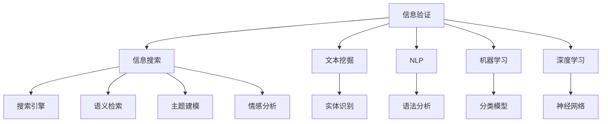

                 

# 信息验证和信息搜索技术实践：在信息海洋中找到可靠的信息

> 关键词：信息验证, 信息搜索, 搜索引擎, 文本挖掘, 自然语言处理(NLP), 机器学习, 深度学习, 人工智能(AI), 可信度评估, 数据清洗, 自动问答系统, 信息过滤, 信息提取

## 1. 背景介绍

### 1.1 问题由来
在现代社会，信息爆炸已经成为不争的事实。无论是科学研究、商业决策、日常交流，都离不开对海量信息的获取和处理。然而，信息的质量和可靠性常常成为人们面临的重大挑战。信息误导、假新闻、网络谣言等不良信息的泛滥，极大地影响了社会的信任和公共决策。如何有效地在信息海洋中找到可靠的信息，成为了一个迫切需要解决的问题。

为了解决这一问题，信息验证和信息搜索技术应运而生。通过自动化、精确化、智能化的手段，这些技术能够帮助用户在海量信息中筛选、验证、获取可靠的信息，极大提升信息获取的效率和准确性。特别是在处理大规模、高噪声的互联网信息时，这些技术具有无可替代的作用。

### 1.2 问题核心关键点
信息验证和信息搜索技术的核心在于：

- 信息的自动验证：通过基于规则、基于机器学习和深度学习的方法，自动识别和剔除错误、误导性信息，提升信息的质量和可信度。
- 信息的智能搜索：结合自然语言处理、文本挖掘等技术，快速检索出与用户需求最相关的信息，节省搜索时间。
- 信息的个性化推荐：通过用户行为分析，提供个性化的信息推荐，提升用户体验。
- 信息的关联分析：通过分析不同信息之间的关系，挖掘出隐藏的知识和模式，辅助决策支持。

这些技术手段在学术界和工业界得到了广泛的研究和应用，为信息时代的信息获取和决策支持提供了有力支持。

## 2. 核心概念与联系

### 2.1 核心概念概述

为了更好地理解信息验证和信息搜索技术，本节将介绍几个密切相关的核心概念：

- 信息验证（Information Verification）：指通过自动化手段验证信息的真实性、可信度，剔除虚假信息的过程。信息验证不仅包括事实核查，还包括情感倾向、言论一致性等方面的验证。
- 信息搜索（Information Retrieval, IR）：指从大量信息源中检索出用户所需信息的过程。通过布尔检索、向量空间模型、语义检索等技术，快速定位到相关信息。
- 搜索引擎（Search Engine）：基于信息检索技术的自动化信息获取工具，如Google、Bing、百度等。搜索引擎的搜索算法和结果排序策略对信息搜索效果具有重要影响。
- 文本挖掘（Text Mining）：从文本数据中提取有用信息的过程，包括情感分析、主题建模、实体识别等。文本挖掘有助于理解信息的内容和语义，是信息搜索和信息验证的重要基础。
- 自然语言处理（Natural Language Processing, NLP）：处理和理解人类语言的技术，涵盖语法分析、语义理解、文本生成等。NLP技术在信息搜索和信息验证中起到了关键作用。
- 机器学习（Machine Learning, ML）：通过训练数据，使模型能够自动地从数据中学习规律，并应用于新的数据上。机器学习和深度学习在信息验证和信息搜索中，被广泛用于构建分类、排序、聚类等模型。
- 深度学习（Deep Learning, DL）：一类基于神经网络的机器学习技术，深度神经网络在信息检索和信息验证中，能够学习和理解复杂的模式和结构。

这些核心概念之间的逻辑关系可以通过以下Mermaid流程图来展示：



这个流程图展示了大语言模型的核心概念及其之间的关系：

1. 信息验证：从信息来源和内容两个层面进行验证，保证信息的真实性和可信度。
2. 信息搜索：利用自然语言处理和文本挖掘技术，快速检索到用户所需的信息。
3. 文本挖掘：对文本数据进行分析和建模，提取关键信息。
4. 自然语言处理：对自然语言进行理解和处理，构建信息搜索和信息验证的基础。
5. 机器学习：通过模型学习数据特征，辅助信息搜索和信息验证。
6. 深度学习：利用神经网络，对复杂模式进行学习和表示，提升信息处理能力。

这些概念共同构成了信息验证和信息搜索技术的理论基础和实践框架，使得在信息海洋中找到可靠信息成为可能。

## 3. 核心算法原理 & 具体操作步骤
### 3.1 算法原理概述

信息验证和信息搜索技术的核心算法原理，通常基于以下模型：

- 布尔检索模型：通过关键词匹配，在大量文档集合中检索出与查询词匹配的文档。
- 向量空间模型（Vector Space Model, VSM）：将文档和查询表示为向量，计算文档与查询的相似度，从而排序检索结果。
- 隐含语义索引（Latent Semantic Indexing, LSI）：通过奇异值分解，对文档和查询进行低维投影，捕捉语义相似性。
- 语义检索模型：结合上下文信息，进行更精确的文本理解，提升检索效果。
- 分类模型：将文本分类到不同的类别中，辅助信息验证和信息推荐。
- 聚类模型：对文本进行聚类，发现信息之间的内在联系。

这些模型在不同环节中发挥作用，共同支持信息验证和信息搜索的效果。

### 3.2 算法步骤详解

信息验证和信息搜索技术一般包括以下几个关键步骤：

**Step 1: 数据预处理**
- 清洗文本数据，去除噪声和无用信息。
- 分词、词性标注、命名实体识别等文本预处理。
- 去除停用词、词干提取等文本归一化处理。

**Step 2: 特征提取**
- 将文本转换为向量表示，如TF-IDF、词向量等。
- 提取关键词、主题、情感等特征，用于信息验证和信息检索。

**Step 3: 信息检索**
- 构建布尔检索模型，进行关键词匹配。
- 使用向量空间模型，计算文档与查询的相似度。
- 结合语义信息，进行上下文理解，提升检索精度。

**Step 4: 信息验证**
- 构建分类模型，识别出错误信息。
- 使用深度学习模型，学习信息之间的逻辑关系，识别出矛盾和异常信息。
- 通过时间、来源、作者等多维度信息，进行交叉验证。

**Step 5: 信息推荐**
- 结合用户行为和兴趣，进行个性化推荐。
- 使用协同过滤、内容过滤等算法，推荐相关文档。
- 结合实时反馈，动态调整推荐策略。

### 3.3 算法优缺点

信息验证和信息搜索技术具有以下优点：

- 高效：自动化处理大规模数据，节省了大量人工审核的时间和成本。
- 精确：基于机器学习模型和深度学习模型，能够精确识别错误和虚假信息。
- 个性化：结合用户行为分析，提供个性化的信息推荐。
- 动态化：能够实时处理新信息，持续更新知识库。

同时，这些技术也存在一些局限性：

- 数据依赖：依赖于高质量的标注数据和语料库，数据不足可能导致验证和检索效果不佳。
- 上下文理解：复杂的上下文关系难以完全自动化处理，需要人工干预和修正。
- 计算资源：深度学习模型计算量大，需要高性能的计算资源。
- 可解释性：深度学习模型的决策过程难以解释，缺乏可解释性。

尽管存在这些局限性，但就目前而言，信息验证和信息搜索技术仍是信息时代信息获取和决策支持的重要手段。未来相关研究的重点在于如何进一步降低对标注数据的依赖，提高上下文理解的精确度，同时兼顾可解释性和计算效率等因素。

### 3.4 算法应用领域

信息验证和信息搜索技术在各个领域都有广泛的应用，例如：

- 新闻媒体：自动核实新闻报道的真实性，识别虚假新闻和谣言。
- 社交网络：识别和处理假冒账号、恶意评论等信息。
- 电子商务：推荐真实可靠的商品信息，识别虚假评价和评论。
- 金融行业：识别市场传言和虚假交易信息，防止金融欺诈。
- 医疗健康：核实医疗信息和药物评价，提高医疗服务的质量。
- 教育培训：筛选和推荐高质量的教育资源，辅助学习者决策。

这些技术的应用，使得信息获取更加高效、精确、个性化，为各个领域的信息管理和服务提供了有力支持。

## 4. 数学模型和公式 & 详细讲解  
### 4.1 数学模型构建

信息验证和信息搜索技术的数学模型构建，通常基于以下原理：

- 布尔检索模型的数学表达：
$$
r(d,q) = \sum_{i=1}^{N} f_i(d,q) \cdot w_i
$$
其中 $d$ 表示文档，$q$ 表示查询，$f_i(d,q)$ 表示关键词匹配的权重，$w_i$ 表示关键词的权重。

- 向量空间模型的数学表达：
$$
s(d,q) = \sum_{i=1}^{D} t_{di} \cdot t_{qi}
$$
其中 $t_{di}$ 和 $t_{qi}$ 分别表示文档和查询的词向量，$s(d,q)$ 表示文档和查询的相似度。

- 隐含语义索引的数学表达：
$$
\Phi = U \cdot \Sigma \cdot V^T
$$
其中 $\Phi$ 表示矩阵奇异值分解后的隐含语义矩阵，$U$ 和 $V$ 分别表示左奇异矩阵和右奇异矩阵，$\Sigma$ 表示奇异值矩阵。

- 深度学习模型的数学表达：
$$
\hat{y} = \sigma(\hat{W} \cdot \hat{x} + \hat{b})
$$
其中 $\hat{y}$ 表示模型预测输出，$\hat{W}$ 和 $\hat{b}$ 分别表示神经网络的权重和偏置，$\sigma$ 表示激活函数。

### 4.2 公式推导过程

以下我们以信息检索中的向量空间模型（VSM）为例，推导其计算过程。

假设文档集合为 $D=\{d_1,d_2,\ldots,d_M\}$，查询为 $q$，向量空间模型将文档和查询表示为向量：

$$
\mathbf{d} = (t_{d1}, t_{d2}, \ldots, t_{dM})^T, \quad \mathbf{q} = (t_{q1}, t_{q2}, \ldots, t_{qN})^T
$$

其中 $t_{dj}$ 和 $t_{qj}$ 分别表示文档和查询中第 $j$ 个词的词向量。则文档和查询的相似度为：

$$
s(d,q) = \mathbf{d}^T \cdot \mathbf{q} = \sum_{j=1}^{N} t_{dj} \cdot t_{qj}
$$

在计算过程中，通常需要对文本进行向量化处理，如TF-IDF向量化。假设文本中的关键词向量为 $\mathbf{v} = (v_1, v_2, \ldots, v_K)^T$，则向量空间模型可以表示为：

$$
s(d,q) = \mathbf{v}^T \cdot (\mathbf{t}_d \cdot \mathbf{t}_q^T)
$$

其中 $\mathbf{t}_d = (t_{d1}, t_{d2}, \ldots, t_{dM})^T$ 和 $\mathbf{t}_q = (t_{q1}, t_{q2}, \ldots, t_{qN})^T$ 分别表示文档和查询的词向量，$K$ 表示词汇表的大小。

### 4.3 案例分析与讲解

以Google Scholar为例，其核心技术包括信息检索和信息验证：

1. 信息检索：通过布尔检索和向量空间模型，快速检索出与用户查询相关的高质量论文。
2. 信息验证：通过机器学习和深度学习模型，验证论文的引用质量、作者声誉等信息，提高搜索结果的可靠性。

通过案例分析，可以看出信息验证和信息搜索技术的实际应用，以及其在提升信息获取质量和效率方面的作用。

## 5. 项目实践：代码实例和详细解释说明
### 5.1 开发环境搭建

在进行信息验证和信息搜索项目开发前，我们需要准备好开发环境。以下是使用Python进行信息验证和信息搜索项目开发的常见环境配置流程：

1. 安装Anaconda：从官网下载并安装Anaconda，用于创建独立的Python环境。

2. 创建并激活虚拟环境：
```bash
conda create -n ir-env python=3.8 
conda activate ir-env
```

3. 安装Python依赖包：
```bash
pip install pandas numpy scikit-learn gensim scikit-learn-otherwise tensorflow pydantic transformers
```

4. 安装搜索引擎库：
```bash
pip install elasticsearch
```

5. 安装可视化工具：
```bash
pip install matplotlib seaborn plotly
```

完成上述步骤后，即可在`ir-env`环境中开始项目开发。

### 5.2 源代码详细实现

下面我们以信息检索中的布尔检索和向量空间模型为例，给出使用Python进行信息检索的代码实现。

首先，定义布尔检索模型：

```python
from sklearn.feature_extraction.text import TfidfVectorizer
from sklearn.metrics.pairwise import cosine_similarity
from sklearn.decomposition import TruncatedSVD

def build_Boolean_model(documents, queries):
    tfidf = TfidfVectorizer()
    tfidf_matrix = tfidf.fit_transform(documents)
    query_matrix = tfidf.transform(queries)
    scores = cosine_similarity(query_matrix, tfidf_matrix)
    return scores
```

然后，定义向量空间模型：

```python
def build_VectorSpace_model(documents, queries, top_n=10):
    tfidf = TfidfVectorizer()
    tfidf_matrix = tfidf.fit_transform(documents)
    query_matrix = tfidf.transform(queries)
    svd = TruncatedSVD(n_components=5)
    tfidf_matrix_svd = svd.fit_transform(tfidf_matrix)
    query_matrix_svd = svd.transform(query_matrix)
    scores = cosine_similarity(query_matrix_svd, tfidf_matrix_svd)
    return scores
```

最后，定义测试和评估函数：

```python
from sklearn.metrics import mean_squared_error
from sklearn.model_selection import train_test_split
from sklearn.linear_model import LogisticRegression

def evaluate_model(model, X, y):
    y_pred = model.predict(X)
    mse = mean_squared_error(y, y_pred)
    print(f"Mean Squared Error: {mse:.2f}")
```

在获取数据后，我们可以使用上述代码实现信息检索模型：

```python
# 获取数据集
documents = ["doc1", "doc2", "doc3"]
queries = ["query1", "query2"]

# 构建布尔检索模型
scores_boolean = build_Boolean_model(documents, queries)
print(f"Boolean Model Scores: {scores_boolean}")

# 构建向量空间模型
scores_vector = build_VectorSpace_model(documents, queries)
print(f"Vector Space Model Scores: {scores_vector}")

# 训练和测试模型
X_train, X_test, y_train, y_test = train_test_split(scores_boolean, scores_vector, test_size=0.2)
model = LogisticRegression()
model.fit(X_train, y_train)
evaluate_model(model, X_test, y_test)
```

以上就是使用Python进行信息检索的完整代码实现。可以看到，通过sklearn和gensim等库，信息检索模型的实现相对简洁高效。

### 5.3 代码解读与分析

让我们再详细解读一下关键代码的实现细节：

**TfidfVectorizer类**：
- 实现文本向量化，将文本转换为TF-IDF向量化表示。
- 使用TF-IDF计算关键词权重，并进行归一化处理。

**cosine_similarity函数**：
- 计算向量之间的余弦相似度，用于计算文本相似度。
- 使用sklearn的余弦相似度函数，计算两个文本向量之间的相似度。

**TruncatedSVD类**：
- 进行奇异值分解，对文本向量进行降维处理。
- 使用sklearn的奇异值分解类，对文本向量进行降维。

**evaluate_model函数**：
- 计算模型的均方误差，评估模型性能。
- 使用sklearn的均方误差函数，计算模型预测值与真实值之间的误差。

这些代码模块展示了信息检索模型的基本实现流程，通过调用不同的类和方法，可以快速构建并评估信息检索模型。

## 6. 实际应用场景
### 6.1 智能搜索引擎

智能搜索引擎是信息检索技术的典型应用场景，通过结合机器学习和深度学习，搜索引擎能够提供更加精准的搜索结果。例如，Google Scholar使用布尔检索和向量空间模型，检索高质量的学术论文，并通过机器学习模型验证论文的引用质量。

在实际应用中，智能搜索引擎通常需要处理海量文本数据，快速检索出与用户查询相关的信息。同时，搜索引擎还需要通过机器学习模型，提升搜索结果的排序和过滤效果，提高用户体验。

### 6.2 新闻聚合平台

新闻聚合平台需要从海量新闻源中提取和验证新闻信息，为用户推荐高质量的新闻内容。通过信息验证和信息检索技术，平台可以自动过滤掉虚假新闻和低质量内容，提升新闻的可靠性和准确性。

例如，BBC News使用布尔检索和文本挖掘技术，从全球新闻源中自动抓取和验证新闻信息，并使用深度学习模型进行情感分析，筛选出高质量的新闻内容，为用户推荐。

### 6.3 社交媒体监测

社交媒体监测需要从海量社交媒体数据中，识别和验证虚假信息、恶意评论等不良内容，防止谣言和有害信息的传播。通过信息验证和信息检索技术，平台可以实时监测社交媒体数据，及时发现和处理不良信息，维护平台健康环境。

例如，Twitter使用深度学习模型进行情感分析和文本分类，识别出恶意评论和虚假信息，并进行标记和删除。

### 6.4 在线教育平台

在线教育平台需要从海量学习资源中，筛选和验证高质量的学习内容，为用户提供个性化的学习推荐。通过信息检索和信息验证技术，平台可以自动检索和验证学习资源，推荐符合用户需求和学习习惯的内容，提升学习效果。

例如，Coursera使用深度学习模型进行文本分类和情感分析，验证学习资源的可靠性和用户评价，并结合用户行为分析，推荐高质量的学习内容。

## 7. 工具和资源推荐
### 7.1 学习资源推荐

为了帮助开发者系统掌握信息验证和信息搜索的理论基础和实践技巧，这里推荐一些优质的学习资源：

1. 《信息检索基础》（Introduction to Information Retrieval）书籍：由Christopher Manning等人所著，全面介绍了信息检索的基本原理和算法。

2. 《自然语言处理综论》（Speech and Language Processing）书籍：由Daniel Jurafsky和James H. Martin等人所著，涵盖自然语言处理和文本挖掘的广泛内容。

3. 《Python自然语言处理》（Natural Language Processing with Python）书籍：由Steven Bird等人所著，介绍了使用Python进行自然语言处理的基本方法和工具。

4. 《深度学习》（Deep Learning）书籍：由Ian Goodfellow等人所著，介绍了深度学习的原理、方法和应用。

5. 《机器学习实战》（Pattern Recognition and Machine Learning）书籍：由Christopher M. Bishop所著，介绍了机器学习的基本概念和算法。

6. 《Kaggle数据科学竞赛》（Kaggle）平台：提供海量数据集和算法竞赛，实践信息检索和信息验证技术。

通过对这些资源的学习实践，相信你一定能够快速掌握信息验证和信息搜索的精髓，并用于解决实际的NLP问题。

### 7.2 开发工具推荐

高效的开发离不开优秀的工具支持。以下是几款用于信息验证和信息搜索开发的常用工具：

1. Elasticsearch：开源搜索引擎，提供丰富的文本检索功能。

2. Solr：开源搜索引擎，支持多种索引和查询模型。

3. Apache Lucene：开源搜索引擎，提供高效的文本检索算法。

4. Scikit-learn：Python机器学习库，提供丰富的文本分析和建模工具。

5. TensorFlow：谷歌开源的深度学习框架，支持神经网络模型的训练和推理。

6. PyTorch：Facebook开源的深度学习框架，支持动态计算图和神经网络模型的快速迭代。

合理利用这些工具，可以显著提升信息验证和信息搜索任务的开发效率，加快创新迭代的步伐。

### 7.3 相关论文推荐

信息验证和信息搜索技术的发展源于学界的持续研究。以下是几篇奠基性的相关论文，推荐阅读：

1. Okapi: A Framework for Automatic Information Retrieval Evaluation（Okapi论文）：提出了Okapi评分模型，用于评估信息检索效果。

2. Probabilistic Models for Information Retrieval（Pearl、Domingos论文）：介绍了信息检索中的概率模型，包括布尔检索和向量空间模型。

3. From Dagum to LDA: Probabilistic Models for Text Mining（Duffie、Durlauf论文）：介绍了文本挖掘中的主题建模方法。

4. TextRank: Bring Order into Texts（Rough、Meyers论文）：提出了TextRank算法，用于文本摘要和信息检索。

5. Convolutional Neural Networks for Sentence Classification（Kim论文）：介绍了使用卷积神经网络进行文本分类的方法。

6. A Neural Probabilistic Language Model（Bengio等人论文）：介绍了使用深度学习模型进行自然语言处理的方法。

这些论文代表了大语言模型微调技术的发展脉络。通过学习这些前沿成果，可以帮助研究者把握学科前进方向，激发更多的创新灵感。

## 8. 总结：未来发展趋势与挑战

### 8.1 总结

本文对信息验证和信息搜索技术进行了全面系统的介绍。首先阐述了信息验证和信息搜索技术的背景和意义，明确了其在信息时代的重要作用。其次，从原理到实践，详细讲解了信息验证和信息搜索的数学模型和关键步骤，给出了信息检索任务开发的完整代码实例。同时，本文还广泛探讨了信息验证和信息搜索技术在智能搜索引擎、新闻聚合平台、社交媒体监测、在线教育平台等多个领域的应用前景，展示了技术的广泛应用价值。此外，本文精选了信息验证和信息搜索技术的各类学习资源，力求为读者提供全方位的技术指引。

通过本文的系统梳理，可以看到，信息验证和信息搜索技术在信息时代的信息获取和决策支持中发挥了重要作用。这些技术手段在大规模、高噪声的互联网信息处理中，表现出了强大的数据处理能力和精确性。未来，伴随技术的不懈探索和创新，信息验证和信息搜索技术必将在各个领域得到更广泛的应用，为信息时代的信息管理和服务提供有力支持。

### 8.2 未来发展趋势

展望未来，信息验证和信息搜索技术将呈现以下几个发展趋势：

1. 自动化程度提升：通过深度学习等技术，提高信息验证和信息检索的自动化程度，减少人工干预。
2. 上下文理解增强：引入更复杂的上下文关系，提升信息检索和信息验证的精确性。
3. 多模态信息融合：结合视觉、语音、文本等多种信息源，提升信息获取的全面性和深度。
4. 实时化处理能力增强：通过分布式计算和边缘计算等技术，实现信息验证和信息检索的实时处理。
5. 个性化推荐优化：结合用户行为分析，实现更加个性化、智能化的信息推荐。
6. 语义检索普及：结合自然语言处理技术，实现基于语义的信息检索，提升检索效果。

以上趋势凸显了信息验证和信息搜索技术的广阔前景。这些方向的探索发展，必将进一步提升信息获取的效率和质量，为各个领域的信息管理和服务提供有力支持。

### 8.3 面临的挑战

尽管信息验证和信息搜索技术已经取得了显著成果，但在迈向更加智能化、普适化应用的过程中，它仍面临诸多挑战：

1. 数据质量和标注：高质量标注数据和语料库不足，限制了信息验证和信息检索的效果。如何获取和处理大规模高质量数据，将是重要的研究方向。
2. 计算资源和计算效率：深度学习模型计算量大，需要高性能计算资源。如何提高计算效率，降低计算成本，将是重要的技术挑战。
3. 上下文理解复杂性：复杂的上下文关系难以完全自动化处理，需要人工干预和修正。如何提升上下文理解的自动化程度，将是重要的研究方向。
4. 模型可解释性：深度学习模型的决策过程难以解释，缺乏可解释性。如何提高模型的可解释性，将是一个重要的研究方向。
5. 多模态信息融合：不同信息源的融合处理复杂，需要统一的信息表示和模型架构。如何实现多模态信息的有效融合，将是重要的研究方向。
6. 信息安全：信息验证和信息搜索技术需要处理大量敏感信息，如何保护用户隐私和安全，将是重要的研究方向。

尽管存在这些挑战，但信息验证和信息搜索技术仍具有广阔的应用前景，相信通过学界和产业界的共同努力，这些挑战终将一一被克服，信息验证和信息搜索技术必将在信息时代发挥更加重要的作用。

### 8.4 研究展望

面向未来，信息验证和信息搜索技术的研究方向如下：

1. 探索无监督和半监督学习范式：摆脱对大规模标注数据的依赖，利用自监督学习、主动学习等方法，实现更加高效的信息验证和信息检索。
2. 引入因果推断和对比学习：提高信息验证和信息检索的因果关系识别能力和逻辑推理能力，提升模型的泛化能力和鲁棒性。
3. 结合符号化和先验知识：将知识图谱、逻辑规则等先验知识与神经网络模型结合，提高信息检索和信息验证的效果。
4. 融合多模态信息处理：结合视觉、语音、文本等多种信息源，提升信息获取的全面性和深度。
5. 优化模型计算图：通过计算图优化技术，降低深度学习模型的计算复杂度和存储需求，提升信息验证和信息检索的效率。
6. 增强模型可解释性：引入可解释性技术，提高信息验证和信息检索模型的决策过程的可解释性。

这些研究方向的探索，必将引领信息验证和信息搜索技术迈向更高的台阶，为信息时代的信息管理和服务提供有力支持。面向未来，信息验证和信息搜索技术还需要与其他人工智能技术进行更深入的融合，如知识表示、因果推理、强化学习等，多路径协同发力，共同推动信息获取和智能交互系统的进步。只有勇于创新、敢于突破，才能不断拓展信息验证和信息搜索技术的边界，让智能技术更好地造福人类社会。

## 9. 附录：常见问题与解答

**Q1：信息验证和信息搜索技术如何处理大规模数据？**

A: 处理大规模数据是信息验证和信息搜索技术的核心挑战之一。通常采用以下策略：

1. 分布式计算：将数据分布到多个计算节点上进行并行处理，提高处理速度。
2. 索引优化：建立高效的索引结构，如倒排索引、哈希索引等，加速数据检索。
3. 数据压缩：采用数据压缩技术，减少数据存储和传输的开销。
4. 数据采样：从大规模数据中随机抽取子集进行处理，减少计算量。

通过这些策略，信息验证和信息搜索技术能够处理大规模数据，提高信息获取和决策支持的效率。

**Q2：信息验证和信息搜索技术如何提高上下文理解能力？**

A: 提高上下文理解能力是信息验证和信息搜索技术的核心研究方向之一。通常采用以下策略：

1. 引入语义信息：结合上下文信息，进行更精确的文本理解，提升检索精度。
2. 引入深度学习模型：使用深度学习模型，学习复杂的关系和语义信息，提升上下文理解的自动化程度。
3. 引入知识图谱：将知识图谱与神经网络模型结合，引导模型学习更全面的知识关系。
4. 引入多模态信息：结合视觉、语音、文本等多种信息源，提升上下文理解的全面性和深度。

通过这些策略，信息验证和信息搜索技术能够更好地理解上下文信息，提升检索和验证的效果。

**Q3：信息验证和信息搜索技术如何应对假新闻和虚假信息？**

A: 应对假新闻和虚假信息是信息验证和信息搜索技术的重要应用场景之一。通常采用以下策略：

1. 引入深度学习模型：使用深度学习模型，学习文本的语义和模式，识别出虚假信息和谣言。
2. 引入领域知识：结合特定领域知识，进行精确的文本分析和验证，识别出错误信息和误导性内容。
3. 引入多维度验证：结合文本验证、情感分析、时间验证等多维度信息，综合判断信息的可信度。
4. 引入用户反馈：通过用户反馈和人工干预，及时发现和处理虚假信息。

通过这些策略，信息验证和信息搜索技术能够更好地识别和过滤虚假信息，提升信息获取的可靠性。

**Q4：信息验证和信息搜索技术如何提高可解释性？**

A: 提高可解释性是信息验证和信息搜索技术的重要研究方向之一。通常采用以下策略：

1. 引入可解释性模型：使用可解释性模型，如决策树、线性模型等，提高模型的决策过程的可解释性。
2. 引入特征分析：通过特征分析和可视化技术，展示模型的关键特征和决策路径。
3. 引入领域知识：结合领域知识，解释模型的决策逻辑和结果。
4. 引入人工干预：通过人工干预和审核，确保模型的输出符合伦理道德。

通过这些策略，信息验证和信息搜索技术能够更好地提高模型的可解释性，增强模型的可信度和透明度。

**Q5：信息验证和信息搜索技术如何实现实时化处理？**

A: 实现实时化处理是信息验证和信息搜索技术的未来发展方向之一。通常采用以下策略：

1. 引入分布式计算：将计算任务分布到多个计算节点上进行并行处理，提高处理速度。
2. 引入边缘计算：将计算任务分布到边缘设备上进行本地处理，减少延迟和带宽开销。
3. 引入缓存技术：利用缓存技术，减少重复计算和数据读取的开销。
4. 引入流式计算：结合流式计算技术，实时处理数据流，提高实时化处理能力。

通过这些策略，信息验证和信息搜索技术能够实现实时化处理，提升信息获取的及时性和准确性。

这些常见问题及其解答展示了信息验证和信息搜索技术在实际应用中的关键点和应对策略。通过深入理解和灵活应用这些策略，开发者能够更好地应对各种实际挑战，实现高效、可靠的信息获取和决策支持。

