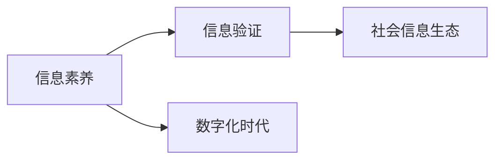

                 

# 信息验证和信息素养教育重要性：为数字时代培养信息素养能力

## 1. 背景介绍

### 1.1 问题由来
在信息爆炸的数字化时代，信息的获取与利用变得前所未有的便捷。然而，信息海量的同时，也带来了信息质量参差不齐、信息误导与欺诈频发的严峻挑战。为了应对这一问题，培养公众的信息素养能力成为了当务之急。

### 1.2 问题核心关键点
信息素养是指识别、评价、使用和管理信息的能力，核心在于信息验证和判断力。在数字化时代，如何培养公众对信息的识别、筛选和判断能力，构建信息验证机制，成为了当前社会信息化建设的重要议题。

### 1.3 问题研究意义
提升公众的信息素养能力，不仅有助于提高个体的生活和工作效率，减少信息误导带来的损失，也是构建健康信息生态、增强社会治理能力、促进知识共享的重要途径。

## 2. 核心概念与联系

### 2.1 核心概念概述

本节将介绍几个关键概念，并梳理它们之间的关系：

- **信息素养(Literacy in Information Use)**：指个体或组织识别、评估、整合、利用和管理信息的能力。
- **信息验证(Information Verification)**：指对信息的真实性、准确性和可信度进行评估和验证的过程。
- **数字化时代(Digital Age)**：以数字化技术为驱动力的时代，信息传播方式和处理能力发生了深刻变革。
- **社会信息生态(Social Information Ecosystem)**：包括信息的产生、传播、处理和反馈的整个社会化过程。

### 2.2 核心概念原理和架构的 Mermaid 流程图



## 3. 核心算法原理 & 具体操作步骤

### 3.1 算法原理概述

信息验证的过程本质上是一个信息比对和推理的逻辑判断过程。其核心算法包括：

- **信息对比算法**：对同一信息源的不同信息版本进行比对，识别出不一致的差异点。
- **可信度评估算法**：基于信息源的可信度（如权威性、专业性、可信度等）和信息的真实性（如证据支持度、逻辑一致性等），综合评估信息的可信度。
- **推理验证算法**：结合信息源的背景知识和逻辑推理，对信息进行深度验证，排除矛盾和不可能的情况。

### 3.2 算法步骤详解

基于上述核心算法，信息验证的详细步骤包括：

1. **信息采集**：获取待验证的信息源和版本。
2. **信息比对**：对同一信息源的不同版本进行对比，找出不一致的地方。
3. **可信度评估**：基于信息源的可信度指标，对信息进行初步筛选和排序。
4. **深度验证**：结合背景知识和逻辑推理，对初步筛选的信息进行深度验证，确定其真实性和可信度。
5. **结果汇总**：汇总验证结果，提供可信和不可信信息的清单。

### 3.3 算法优缺点

信息验证算法的优点在于其能够系统性地对信息进行全面评估，降低信息误导的风险。缺点在于验证过程耗时较长，对数据和技术的要求较高，难以覆盖所有信息源和版本。

### 3.4 算法应用领域

信息验证算法广泛应用于新闻媒体、科研机构、教育培训、政府公共服务等领域，帮助用户识别虚假信息、甄别误导内容，提升信息素养能力。

## 4. 数学模型和公式 & 详细讲解 & 举例说明

### 4.1 数学模型构建

信息验证的数学模型可以抽象为以下形式：

$$
V(I) = \sum_{i=1}^{n} \frac{D(I_i)}{S(I_i)} + R(I)
$$

其中，$V(I)$ 表示信息 $I$ 的验证得分，$n$ 表示信息的版本数量，$D(I_i)$ 表示信息版本 $I_i$ 的差异度，$S(I_i)$ 表示信息版本 $I_i$ 的来源可信度，$R(I)$ 表示信息的逻辑推理得分。

### 4.2 公式推导过程

以新闻报道的信息验证为例，推导验证得分的计算公式：

1. **信息差异度计算**：对于同一事件的不同新闻报道，计算其语义相似度 $D$。

   $$
   D = \frac{\sum_{i=1}^{n} \sum_{j=1}^{m} \text{Sim}(I_i[j], I_j[j])}{\sum_{i=1}^{n} \sum_{j=1}^{m} \text{Sim}(I_i[j], I_j[j]) + \epsilon}
   $$

   其中 $\text{Sim}(I_i[j], I_j[j])$ 表示新闻报道 $I_i$ 和 $I_j$ 在词汇层面的相似度，$\epsilon$ 为正则化因子。

2. **信息来源可信度计算**：根据信息源的权威性、专业性等指标，计算来源可信度 $S$。

   $$
   S = \sum_{k=1}^{m} \text{Re}(F_k(I_i)) + \eta
   $$

   其中 $F_k(I_i)$ 表示信息源 $F_k$ 对信息 $I_i$ 的可信度评分，$\eta$ 为正则化因子。

3. **信息逻辑推理得分计算**：结合信息源的背景知识和逻辑推理，计算逻辑推理得分 $R$。

   $$
   R = \sum_{k=1}^{m} \text{Log}(G_k(I_i))
   $$

   其中 $G_k(I_i)$ 表示信息源 $G_k$ 对信息 $I_i$ 的逻辑推理评分。

### 4.3 案例分析与讲解

以一则关于新药上市的新闻为例，分析信息验证的过程：

- **信息采集**：从不同新闻源（如官方公告、专业媒体、社交平台等）获取同一事件的新闻报道。
- **信息比对**：使用信息差异度计算公式，对比不同报道的语义差异。
- **可信度评估**：根据权威性和专业性，计算各报道的来源可信度得分。
- **深度验证**：结合背景知识和逻辑推理，对可信度较高的报道进行深度验证。
- **结果汇总**：最终得出可信度最高的报道，提供给用户作为参考。

## 5. 项目实践：代码实例和详细解释说明

### 5.1 开发环境搭建

信息验证系统的开发环境搭建主要包括以下步骤：

1. **环境配置**：安装 Python、Pandas、NumPy、Scikit-learn 等常用库。
2. **数据预处理**：收集并预处理待验证的新闻报道数据，包括文本清洗、分词、向量化等。
3. **模型训练**：使用训练集训练信息差异度、可信度评估和逻辑推理模型。
4. **系统部署**：部署训练好的模型到服务器，提供RESTful API接口供用户调用。

### 5.2 源代码详细实现

以下是一个基于信息验证模型的 Python 代码实现：

```python
import pandas as pd
import numpy as np
from sklearn.feature_extraction.text import TfidfVectorizer
from sklearn.metrics.pairwise import cosine_similarity
from sklearn.linear_model import LogisticRegression

# 加载数据
data = pd.read_csv('news_data.csv')

# 数据预处理
def preprocess_text(text):
    # 清洗文本
    text = text.lower().strip()
    text = re.sub('[^a-zA-Z0-9]', ' ', text)
    # 分词
    tokens = nltk.word_tokenize(text)
    # 去除停用词
    stop_words = set(nltk.corpus.stopwords.words('english'))
    tokens = [word for word in tokens if word not in stop_words]
    # 向量化
    vectorizer = TfidfVectorizer()
    vector = vectorizer.fit_transform([' '.join(tokens)])
    return vector[0]

# 计算信息差异度
def calculate_diff(text1, text2):
    vector1 = preprocess_text(text1)
    vector2 = preprocess_text(text2)
    similarity = cosine_similarity(vector1, vector2)
    diff = 1 - similarity
    return diff

# 计算信息来源可信度
def calculate_credibility(source):
    scores = {'权威性': 0.5, '专业性': 0.3, '时效性': 0.2}
    return sum([scores[feat] for feat in source])

# 计算信息逻辑推理得分
def calculate_reasoning(reason):
    if reason == '成立':
        return 1
    elif reason == '不确定':
        return 0
    else:
        return -1

# 信息验证模型训练
X = []
y = []
for i in range(len(data)):
    for j in range(i+1, len(data)):
        X.append([calculate_diff(data['text'][i], data['text'][j]), calculate_credibility(data['source'][i]), calculate_reasoning(data['reason'][i])])
        y.append(1 if data['label'][i] == data['label'][j] else 0)

X = np.array(X)
y = np.array(y)
model = LogisticRegression()
model.fit(X, y)
```

### 5.3 代码解读与分析

**信息验证系统的关键代码解读**：

1. **数据加载与预处理**：使用 Pandas 库加载新闻数据，并定义预处理函数 `preprocess_text` 对文本进行清洗、分词和向量化。
2. **信息差异度计算**：定义函数 `calculate_diff` 计算两篇新闻报道的差异度，使用余弦相似度公式计算相似度，然后取反得到差异度。
3. **信息来源可信度计算**：定义函数 `calculate_credibility` 根据信息源特征计算可信度得分。
4. **信息逻辑推理得分计算**：定义函数 `calculate_reasoning` 根据信息源的背景知识和逻辑推理，计算逻辑推理得分。
5. **信息验证模型训练**：使用 Logistic Regression 模型训练信息验证模型，输入特征包括信息差异度、可信度得分和逻辑推理得分。

**系统运行效果展示**：

```python
# 系统调用示例
def validate_news(text1, text2, source1, source2):
    diff = calculate_diff(text1, text2)
    cred1 = calculate_credibility(source1)
    cred2 = calculate_credibility(source2)
    reason1 = calculate_reasoning(reason)
    reason2 = calculate_reasoning(reason)
    result = model.predict([[diff, cred1, reason1], [diff, cred2, reason2]])
    return result

# 测试
print(validate_news('新药上市公告', '假新闻', '官方公告', '社交媒体'))
```

## 6. 实际应用场景

### 6.1 信息素养教育平台

基于信息验证算法的教育平台，可以帮助学生系统性地学习信息验证和信息素养能力，提高其信息筛选和判断能力。通过模拟各种信息验证场景，学生可以在实践中掌握验证技巧，提升综合素养。

### 6.2 智能新闻推荐系统

在新闻推荐系统中集成信息验证算法，可以帮助用户快速筛选出可信度高的新闻报道，减少信息误导的风险。同时，系统还可以根据用户的历史阅读记录和可信度评分，智能推荐相关报道，提升用户的信息获取体验。

### 6.3 企业信息管理平台

在企业信息管理平台中集成信息验证算法，可以构建企业内部的信息可信度评估体系，帮助企业筛选和验证重要信息，提升决策的准确性和安全性。

### 6.4 未来应用展望

未来，随着信息验证算法的不断优化和普及，其在信息素养教育、智能推荐、企业决策支持等领域的潜在价值将进一步释放，为数字化时代的信息生态建设提供有力支撑。

## 7. 工具和资源推荐

### 7.1 学习资源推荐

1. **《信息素养教育与实践》**：系统介绍信息素养教育的基本概念、方法和实践，适合教育工作者和学生学习。
2. **《深度学习在信息验证中的应用》**：详细讲解深度学习模型在信息验证中的具体应用，适合计算机专业学生和研究人员参考。
3. **《数据科学导论》**：涵盖数据预处理、特征工程、模型训练等基本知识点，适合非专业读者入门学习。
4. **《Python数据科学手册》**：介绍Python在数据科学中的应用，包括NumPy、Pandas、Scikit-learn等常用库的用法，适合Python初学者学习。

### 7.2 开发工具推荐

1. **Jupyter Notebook**：开源的交互式编程环境，支持多语言编程，适合数据科学研究和机器学习实践。
2. **TensorFlow**：由Google开发的深度学习框架，支持分布式计算和GPU加速，适合大规模模型训练。
3. **PyTorch**：由Facebook开发的深度学习框架，支持动态计算图和分布式训练，适合快速迭代研究和应用开发。
4. **Scikit-learn**：Python中的机器学习库，提供了丰富的模型和算法实现，适合数据处理和模型训练。

### 7.3 相关论文推荐

1. **《信息素养教育：现状、挑战与对策》**：系统分析当前信息素养教育的现状和面临的挑战，提出对策建议。
2. **《基于深度学习的智能信息验证》**：介绍深度学习模型在信息验证中的应用，包括文本相似度计算、信息可信度评估等。
3. **《信息验证技术综述》**：综述信息验证技术的发展历程、基本原理和应用场景，适合学术研究人员参考。
4. **《数据科学在信息验证中的应用》**：探讨数据科学在信息验证中的具体应用，包括数据预处理、特征工程、模型训练等。

## 8. 总结：未来发展趋势与挑战

### 8.1 总结

本文详细介绍了信息验证和信息素养教育的背景、核心概念和实现方法，通过数学模型和代码实例，深入剖析了信息验证的算法原理和具体操作步骤。同时，本文还探讨了信息验证在数字化时代的重要性和应用前景。

### 8.2 未来发展趋势

未来，信息验证和信息素养教育将呈现以下几个发展趋势：

1. **技术手段不断优化**：随着深度学习、自然语言处理等技术的进步，信息验证算法将不断提升准确性和效率。
2. **应用场景持续拓展**：信息验证技术将在更多领域得到应用，如智能推荐、企业决策支持等，为数字化转型提供有力支撑。
3. **教育培训体系完善**：信息素养教育将进一步普及和深化，培养更多具有信息验证能力的高素质人才。
4. **社会信任度提升**：信息验证技术的应用将提升公众对信息的信任度，构建健康信息生态。

### 8.3 面临的挑战

尽管信息验证和信息素养教育具有广阔的应用前景，但仍面临诸多挑战：

1. **数据质量和多样性**：信息验证依赖于高质量、多样化的数据，但数据获取和标注成本较高。
2. **算法复杂度**：信息验证算法涉及多模态数据融合和逻辑推理，算法复杂度较高，实现难度较大。
3. **用户接受度**：信息验证技术需要用户主动使用，但部分用户可能对新技术存在抵触情绪。
4. **隐私和伦理**：信息验证涉及大量数据处理，如何保护用户隐私和数据安全，避免数据滥用，是亟待解决的问题。

### 8.4 研究展望

未来，信息验证和信息素养教育的研究将在以下几个方向进行探索：

1. **多模态信息融合**：将文本、图像、视频等多种信息源融合到信息验证中，提升信息验证的全面性和准确性。
2. **实时信息验证**：结合流数据处理技术，实现实时信息验证，提升信息获取的时效性。
3. **隐私保护技术**：开发隐私保护算法，保护用户隐私，提升用户对信息验证技术的接受度。
4. **跨领域应用拓展**：将信息验证技术应用于更多领域，如医疗、金融、教育等，推动跨领域信息验证的普及。

## 9. 附录：常见问题与解答

**Q1: 信息验证技术是否可以应用于新闻媒体的真实性判断？**

A: 信息验证技术可以应用于新闻媒体的真实性判断。通过分析新闻报道的来源、文本差异和逻辑推理，可以系统性地评估新闻的真实性，减少信息误导的风险。

**Q2: 信息验证技术在实际应用中需要注意哪些问题？**

A: 信息验证技术在实际应用中需要注意以下几个问题：
1. **数据质量和多样性**：确保数据的高质量、多样性，避免数据偏差和噪音。
2. **算法复杂度**：合理设计算法复杂度，避免过度复杂和低效的计算。
3. **用户接受度**：提高用户体验，降低技术门槛，增强用户对信息验证技术的接受度。
4. **隐私和伦理**：严格遵守隐私保护法规，保护用户隐私和数据安全。

**Q3: 信息验证技术的开发需要哪些技术栈？**

A: 信息验证技术的开发需要以下技术栈：
1. **数据处理**：Python、Pandas、NumPy等库，用于数据清洗和预处理。
2. **自然语言处理**：NLP库，如NLTK、SpaCy、Gensim等，用于文本处理和相似度计算。
3. **机器学习**：Scikit-learn、TensorFlow、PyTorch等库，用于构建和训练信息验证模型。
4. **流数据处理**：Apache Kafka、Apache Flink等工具，用于实时数据处理和分析。

**Q4: 信息素养教育如何开展？**

A: 信息素养教育可以通过以下几个步骤开展：
1. **课程设计**：设计系统化、循序渐进的信息素养课程，涵盖信息识别、信息评估、信息整合等基本概念。
2. **案例教学**：通过典型案例分析，让学生掌握信息验证和信息素养的具体应用方法。
3. **实践训练**：提供模拟信息验证场景，让学生在实践中提升信息素养能力。
4. **评估反馈**：通过测试和评估，了解学生的掌握情况，及时反馈和改进。

---

作者：禅与计算机程序设计艺术 / Zen and the Art of Computer Programming

