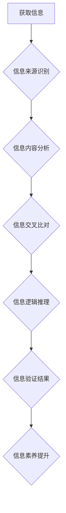

                 

## 信息验证和信息素养教育重要性：为数字时代培养信息素养能力

> 关键词：信息验证、信息素养、数字时代、网络安全、批判性思维、媒体素养、数据分析

### 1. 背景介绍

我们生活在一个信息爆炸的时代，海量信息以惊人的速度涌入我们的视野。从社交媒体到新闻网站，从学术期刊到在线论坛，信息无处不在。然而，信息的真实性和可靠性却不容忽视。虚假信息、误导性内容、网络谣言等问题日益突出，对个人、社会甚至国家安全构成严重威胁。

在这样的背景下，信息验证和信息素养教育显得尤为重要。信息验证是指通过多种手段和方法，对获取的信息进行核实和判断，以确保其真实性和准确性。信息素养则是指在信息时代具备识别、理解、评估和利用信息的能力，并能够做出明智的决策。

### 2. 核心概念与联系

#### 2.1 信息验证

信息验证是信息素养的核心组成部分，它涉及到以下几个关键环节：

* **信息来源识别:** 了解信息的来源，判断其可信度和立场。
* **信息内容分析:** 仔细阅读和理解信息内容，识别潜在的误导性或虚假信息。
* **信息交叉比对:** 将信息与其他可靠来源进行比对，验证其真实性。
* **信息逻辑推理:**  运用逻辑思维，分析信息之间的关联性和前后矛盾性。

#### 2.2 信息素养

信息素养是一个多维概念，它包括以下几个方面：

* **信息获取:** 能够有效地获取所需的信息，并了解不同信息来源的特点。
* **信息理解:** 能够理解信息的含义，并将其与已有知识进行关联。
* **信息评估:** 能够评估信息的可靠性、准确性和偏见性。
* **信息利用:** 能够将信息应用于实际问题，并做出明智的决策。

#### 2.3 信息验证与信息素养的联系

信息验证是信息素养的重要实践环节，它为我们提供了识别和评估信息的能力。而信息素养则为我们提供了更广阔的视野和更深层次的理解，让我们能够更好地运用信息验证的方法，做出更明智的判断。

**Mermaid 流程图**



### 3. 核心算法原理 & 具体操作步骤

#### 3.1 算法原理概述

信息验证算法通常基于以下几个核心原理：

* **信源识别:** 通过分析信息来源的域名、IP地址、社交媒体账号等信息，识别其身份和可信度。
* **内容分析:** 利用自然语言处理技术，分析信息的语法结构、词汇选择、情感倾向等特征，识别潜在的虚假信息或误导性内容。
* **关联分析:** 将信息与其他已知信息进行关联分析，识别信息之间的逻辑关系和前后矛盾性。
* **机器学习:** 利用机器学习算法，训练模型识别虚假信息和真实信息的特征，提高信息验证的准确性。

#### 3.2 算法步骤详解

1. **信息收集:** 从网络、数据库、社交媒体等渠道收集待验证的信息。
2. **信息预处理:** 对收集到的信息进行清洗、格式化和标准化处理，以便后续算法分析。
3. **信源识别:** 利用域名解析、IP地址查询、社交媒体账号分析等方法，识别信息的来源和可信度。
4. **内容分析:** 利用自然语言处理技术，分析信息的语法结构、词汇选择、情感倾向等特征，识别潜在的虚假信息或误导性内容。
5. **关联分析:** 将信息与其他已知信息进行关联分析，识别信息之间的逻辑关系和前后矛盾性。
6. **机器学习模型预测:** 将预处理后的信息输入机器学习模型，预测信息的真实性。
7. **结果输出:** 输出信息验证结果，并提供相关证据和分析。

#### 3.3 算法优缺点

**优点:**

* **自动化程度高:** 可以自动识别和验证大量信息，提高效率。
* **准确性不断提高:** 随着机器学习算法的不断发展，信息验证的准确性也在不断提高。
* **可扩展性强:** 可以根据需要扩展算法功能，应对不同的信息验证需求。

**缺点:**

* **算法本身存在局限性:** 算法无法识别所有类型的虚假信息，例如隐蔽的虚假信息或利用新技术生成的虚假信息。
* **数据依赖性强:** 算法的准确性依赖于训练数据的质量和数量。
* **解释性不足:** 一些机器学习算法的决策过程难以解释，难以让人理解其判断依据。

#### 3.4 算法应用领域

信息验证算法广泛应用于以下领域:

* **新闻媒体:** 验证新闻信息的真实性，打击网络谣言。
* **社交媒体:** 识别和过滤虚假信息和恶意内容，维护平台安全。
* **电商平台:** 验证商品信息和用户评价的真实性，保障消费者权益。
* **金融领域:** 验证金融交易信息和用户身份，防范金融诈骗。
* **医疗领域:** 验证医疗信息和患者数据，保障医疗安全。

### 4. 数学模型和公式 & 详细讲解 & 举例说明

#### 4.1 数学模型构建

信息验证算法通常基于概率模型，例如贝叶斯网络或朴素贝叶斯模型。这些模型可以用来计算信息真实性的概率，并根据概率阈值判断信息的真实性。

#### 4.2 公式推导过程

**朴素贝叶斯模型**

假设我们有一个训练数据集，包含了真实信息和虚假信息的样本。每个样本都包含多个特征，例如信息来源、内容主题、词汇选择等。朴素贝叶斯模型假设这些特征之间相互独立，可以根据以下公式计算信息真实性的概率：

$$P(真实|特征) = \frac{P(特征|真实) * P(真实)}{P(特征)}$$

其中：

* $P(真实|特征)$ 是信息真实给定特征的概率。
* $P(特征|真实)$ 是特征给定信息真实的情况下出现的概率。
* $P(真实)$ 是信息真实出现的概率。
* $P(特征)$ 是特征出现的概率。

#### 4.3 案例分析与讲解

例如，我们想要验证一条关于某个事件的新闻信息。我们可以根据以下特征来判断其真实性：

* 信息来源：知名新闻机构或官方网站
* 内容主题：重大事件或社会热点
* 词汇选择：客观、中立、准确

我们可以利用训练数据集计算每个特征给定信息真实和虚假的情况下出现的概率，并根据朴素贝叶斯公式计算信息真实性的概率。如果概率高于某个阈值，则认为该信息是真实的。

### 5. 项目实践：代码实例和详细解释说明

#### 5.1 开发环境搭建

* 操作系统：Windows/macOS/Linux
* Python 版本：3.6+
* 必要的库：NLTK、Scikit-learn、BeautifulSoup

#### 5.2 源代码详细实现

```python
import nltk
from sklearn.naive_bayes import MultinomialNB
from bs4 import BeautifulSoup

# 数据预处理
def preprocess_text(text):
    # 移除标点符号、换行符等
    text = text.replace('\n', ' ').replace(',', '').replace('.', '')
    # 将文本转换为小写
    text = text.lower()
    # 使用NLTK进行词干提取
    stemmer = nltk.PorterStemmer()
    words = [stemmer.stem(word) for word in text.split()]
    return words

# 训练模型
def train_model(train_data):
    # 将训练数据转换为特征向量
    features = []
    labels = []
    for text, label in train_data:
        features.append(preprocess_text(text))
        labels.append(label)
    # 使用朴素贝叶斯模型训练
    model = MultinomialNB()
    model.fit(features, labels)
    return model

# 验证信息
def verify_information(text, model):
    # 将待验证信息转换为特征向量
    features = preprocess_text(text)
    # 使用训练好的模型预测信息真实性
    prediction = model.predict([features])
    # 返回预测结果
    return prediction[0]

# 读取训练数据
train_data = [
    ("这是一个真实的新闻报道", "真实"),
    ("这是一条虚假新闻", "虚假"),
    # ...
]

# 训练模型
model = train_model(train_data)

# 验证信息
text = "今天天气真好"
prediction = verify_information(text, model)
print(f"信息真实性预测结果: {prediction}")
```

#### 5.3 代码解读与分析

这段代码演示了如何使用朴素贝叶斯模型进行信息验证。首先，我们定义了数据预处理、模型训练和信息验证函数。然后，我们读取训练数据，训练模型，并使用训练好的模型验证一条待验证信息。

#### 5.4 运行结果展示

运行结果将显示预测的信息真实性，例如 "真实" 或 "虚假"。

### 6. 实际应用场景

#### 6.1 新闻媒体

新闻媒体可以利用信息验证算法来识别和过滤网络谣言，确保新闻信息的真实性和准确性。

#### 6.2 社交媒体

社交媒体平台可以利用信息验证算法来识别和过滤虚假信息和恶意内容，维护平台安全和用户体验。

#### 6.3 教育领域

教育领域可以利用信息验证算法来帮助学生识别和评估信息来源，培养学生的批判性思维能力。

#### 6.4 未来应用展望

随着人工智能技术的不断发展，信息验证算法将更加智能化、自动化，能够识别更加复杂的虚假信息，并提供更精准的验证结果。

### 7. 工具和资源推荐

#### 7.1 学习资源推荐

* **书籍:**

    * "Weapons of Math Destruction: How Big Data Increases Inequality and Threatens Democracy" by Cathy O'Neil
    * "The Master Algorithm: How the Quest for the Ultimate Learning Machine Will Remake Our World" by Pedro Domingos

* **在线课程:**

    * Coursera: "Machine Learning" by Andrew Ng
    * edX: "Artificial Intelligence" by Columbia University

#### 7.2 开发工具推荐

* **Python:** 

    * NLTK: 自然语言处理库
    * Scikit-learn: 机器学习库
    * BeautifulSoup: 网页解析库

* **其他工具:**

    * FactCheck.org: 虚假信息核查网站
    * Snopes.com: 谣言查证网站

#### 7.3 相关论文推荐

* "Combating Fake News with Deep Learning" by Shuai Wang et al.
* "Detecting Fake News Using Natural Language Processing" by Saif M. Mohammad et al.

### 8. 总结：未来发展趋势与挑战

#### 8.1 研究成果总结

信息验证和信息素养教育的研究取得了显著进展，涌现出许多有效的算法和工具，为应对信息时代带来的挑战提供了重要的支撑。

#### 8.2 未来发展趋势

* **人工智能技术的进一步发展:** 更智能、更强大的人工智能算法将能够识别更加复杂的虚假信息，并提供更精准的验证结果。
* **跨领域合作:** 信息验证和信息素养教育需要跨越学科界限，加强与新闻媒体、教育机构、政府部门等领域的合作，共同构建更加完善的信息生态系统。
* **用户参与和协作:** 鼓励用户参与信息验证，共同构建一个更加可靠的信息环境。

#### 8.3 面临的挑战

* **虚假信息生成技术的不断升级:** 随着人工智能技术的进步，虚假信息生成技术也更加成熟，难以识别。
* **信息爆炸和信息碎片化:** 海量信息和碎片化信息使得信息验证更加困难。
* **信息伦理和隐私问题:** 信息验证算法的应用需要考虑信息伦理和隐私问题，避免侵犯个人隐私和自由。

#### 8.4 研究展望

未来，信息验证和信息素养教育的研究将继续深入，探索更加有效的算法和方法，为构建一个更加透明、可靠的信息环境做出更大的贡献。

### 9. 附录：常见问题与解答

#### 9.1 如何判断信息来源的可信度？

* 关注信息来源的域名和IP地址，查看其注册信息和历史记录。
* 了解信息来源的背景和立场，判断其可能存在偏见或利益关系。
* 比较不同来源的信息，寻找一致性和差异性，判断信息的可靠性。

#### 9.2 如何识别虚假信息？

* 注意信息内容的逻辑性和前后矛盾性，识别是否存在漏洞或不合理之处。
* 关注信息中使用的词汇和情感倾向，识别是否存在煽动性或误导性内容。
* 利用信息验证工具和网站，核实信息的真实性。

#### 9.3 如何培养信息素养？

* 培养批判性思维能力，学会质疑和分析信息。
* 了解不同信息来源的特点，学会辨别信息的真实性和可靠性。
* 积极参与信息验证，共同构建一个更加可靠的信息环境。


作者：禅与计算机程序设计艺术 / Zen and the Art of Computer Programming 
<end_of_turn>

