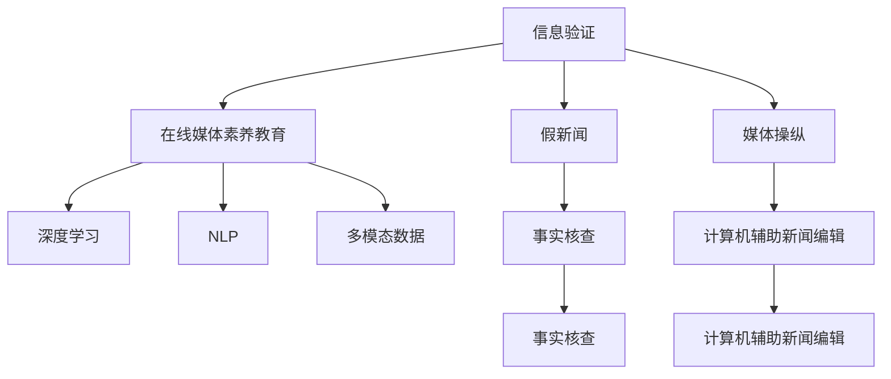

                 

# 信息验证和在线媒体素养教育：为假新闻和媒体操纵做好准备

> 关键词：信息验证, 在线媒体素养教育, 假新闻, 媒体操纵, 深度学习, 自然语言处理(NLP), 多模态数据, 事实核查, 信息检索, 计算机辅助新闻编辑

## 1. 背景介绍

### 1.1 问题由来
在数字化时代，信息传播的便捷性和即时性极大地改变了人类获取知识的方式。社交媒体、即时通讯、在线论坛等平台，成为了人们获取、分享、传播信息的主要渠道。然而，随之而来的是信息质量参差不齐、假新闻泛滥等问题，严重干扰了信息的真实性和可靠性。这不仅对个人认知、社会信任造成了极大冲击，也给新闻业、学术界、公共政策等带来深远影响。

如何培养公众的在线媒体素养，提升其信息识别和验证能力，是当前社会信息治理面临的重要课题。而利用深度学习等技术，开发信息验证工具，实现自动化的事实核查，成为了一个亟需解决的现实需求。

### 1.2 问题核心关键点
信息验证技术旨在通过多模态数据融合、深度学习、自然语言处理等手段，自动对网络信息进行识别和筛选，排除假新闻、虚假信息、误导性内容等。其核心任务包括：
- 信息真实性验证：识别信息是否基于客观事实。
- 信息源可信度评估：评估信息来源的可靠性。
- 信息内容核查：验证信息内容是否准确无误。
- 信息一致性检查：发现文本、图片、视频等不同模态数据间的矛盾。

解决这些问题需要结合多种技术手段，如文本挖掘、信息检索、图像识别、知识图谱等，并通过合理的设计，构建全面的在线媒体素养教育体系，帮助公众提升信息识别和验证能力。

## 2. 核心概念与联系

### 2.1 核心概念概述

为更好地理解信息验证技术，本节将介绍几个密切相关的核心概念：

- 信息验证(Information Verification)：使用各种技术手段，对网络信息进行自动化的真实性、可信度和内容一致性检查，以确保信息的可靠性和准确性。
- 在线媒体素养教育(Digital Media Literacy Education)：通过教育引导，提高公众对网络信息的识别、分析和评价能力，增强信息素养。
- 假新闻(Fake News)：故意编造并传播的虚假信息，旨在误导公众或达成特定政治、经济等目的。
- 媒体操纵(Media Manipulation)：通过信息扭曲、选择性报道、假新闻等手段，故意误导公众，影响社会认知和公共政策。
- 深度学习(Deep Learning)：利用多层神经网络，从大量数据中自动提取特征，学习复杂的模式识别和预测任务。
- 自然语言处理(NLP)：使用计算机对自然语言文本进行理解和生成处理的技术，包括文本分类、信息检索、问答系统等。
- 多模态数据(Multi-modal Data)：结合文本、图片、音频、视频等多种数据类型的综合信息，用于更全面地进行信息验证。
- 事实核查(Fact-Checking)：针对具体事件或声明，通过验证其真实性、准确性和可信度，提供客观、公正的信息评价。
- 计算机辅助新闻编辑(Computer-Assisted Journalism)：利用自动化工具，提升新闻编辑和验证的效率，确保新闻内容的准确性和可靠性。

这些核心概念之间的逻辑关系可以通过以下Mermaid流程图来展示：



这个流程图展示了大语言模型的核心概念及其之间的关系：

1. 信息验证通过深度学习、自然语言处理等技术，对假新闻、媒体操纵进行识别和核查。
2. 在线媒体素养教育通过教育引导，提高公众的信息识别和验证能力。
3. 假新闻和媒体操纵是信息验证技术的主要应对对象。
4. 深度学习、自然语言处理等技术是信息验证的重要手段。
5. 多模态数据、事实核查、计算机辅助新闻编辑等概念，都是信息验证的实现途径。

这些概念共同构成了信息验证和在线媒体素养教育的基础框架，为其发展和应用提供了理论支撑。

## 3. 核心算法原理 & 具体操作步骤
### 3.1 算法原理概述

信息验证技术基于深度学习、自然语言处理等技术手段，对网络信息进行自动化的真实性、可信度和内容一致性检查。其核心算法包括文本挖掘、信息检索、图像识别、知识图谱等，并结合多模态数据融合技术，构建全面的信息验证模型。

信息验证技术的实现流程包括以下几个关键步骤：

1. 数据预处理：对网络信息进行收集、清洗、标注，准备训练数据集。
2. 特征提取：使用深度学习模型，自动提取文本、图片、音频、视频等不同模态数据的特征。
3. 模型训练：使用标注数据集，训练信息验证模型，学习对不同模态数据的识别和筛选能力。
4. 模型评估：在测试集上评估模型的性能，通过各种指标如准确率、召回率、F1-score等，评估模型的效果。
5. 模型部署：将训练好的模型部署到实际应用环境中，实现自动化的事实核查和信息验证。

### 3.2 算法步骤详解

以下详细讲解信息验证技术的核心算法步骤：

**Step 1: 数据预处理**

数据预处理是信息验证的第一步，涉及网络信息的收集、清洗和标注。具体步骤如下：

1. 网络爬虫：利用爬虫工具从社交媒体、新闻网站、论坛等平台收集文本、图片、音频、视频等多模态数据。
2. 数据清洗：去除噪声、重复和无关信息，保留有用内容。例如，去除垃圾评论、过滤低质量图片等。
3. 数据标注：对数据进行标注，标注内容包括信息真实性、可信度、内容一致性等。常用的标注方法包括人工标注、机器标注等。

**Step 2: 特征提取**

特征提取是信息验证的关键步骤，通过深度学习模型自动提取多模态数据的特征，为后续模型的训练提供输入。

1. 文本特征提取：使用Transformer等模型，对文本进行编码，提取特征向量。常用的文本特征提取方法包括BERT、GPT等。
2. 图像特征提取：利用卷积神经网络(CNN)等模型，提取图片特征，如VGGNet、ResNet等。
3. 音频特征提取：使用卷积神经网络或循环神经网络(RNN)，提取音频特征，如MFCC、STFT等。
4. 视频特征提取：结合CNN和RNN，提取视频特征，如3D-CNN、CNN-LSTM等。

**Step 3: 模型训练**

模型训练是信息验证的核心，通过标注数据集训练深度学习模型，学习不同模态数据的特征表示和识别能力。

1. 选择合适的模型：根据任务需求选择深度学习模型，如卷积神经网络(CNN)、循环神经网络(RNN)、Transformer等。
2. 设计损失函数：根据任务类型设计损失函数，如交叉熵损失、多任务学习损失等。
3. 训练模型：使用标注数据集，通过优化算法如Adam、SGD等，训练模型参数。
4. 调参优化：通过调整学习率、批大小、迭代次数等超参数，优化模型性能。

**Step 4: 模型评估**

模型评估是衡量信息验证效果的重要步骤，通过测试集上的性能评估，选择最优的模型。

1. 选择评估指标：根据任务需求选择评估指标，如准确率、召回率、F1-score、AUC-ROC等。
2. 划分数据集：将数据集划分为训练集、验证集和测试集，确保评估结果的可靠性。
3. 进行模型评估：在测试集上运行模型，评估其性能，选择最优的模型。

**Step 5: 模型部署**

模型部署是将训练好的模型应用于实际场景，进行自动化的事实核查和信息验证。

1. 搭建服务环境：搭建服务器环境，安装必要的软件和库，确保模型能够稳定运行。
2. 部署模型：将训练好的模型部署到服务端，提供API接口，方便调用。
3. 实时监测：实时监测模型运行状态，及时发现和修复问题。

### 3.3 算法优缺点

信息验证技术具有以下优点：
1. 自动化程度高：能够自动对大规模网络信息进行筛选，提升信息验证效率。
2. 多模态融合：结合文本、图片、音频、视频等多种数据类型，提供全面的信息验证。
3. 可扩展性强：能够快速扩展到更多任务和数据类型，适应不同的信息验证需求。
4. 实时性强：能够实时监测和验证信息，及时发现并纠正错误。

同时，该技术也存在以下局限性：
1. 数据标注成本高：高质量标注数据集的构建需要大量人工标注，成本较高。
2. 模型依赖数据：模型的效果依赖于数据质量，数据偏差可能影响模型性能。
3. 对抗样本难以检测：对抗样本能够误导模型，使其错误分类。
4. 缺乏可解释性：深度学习模型往往是"黑盒"系统，难以解释其决策逻辑。
5. 存在误报和漏报：信息验证模型可能出现误报和漏报，需要人工审核。

尽管存在这些局限性，信息验证技术仍然是大数据时代信息治理的重要工具，未来需要进一步优化和改进。

### 3.4 算法应用领域

信息验证技术已经在新闻业、社交媒体、学术界等多个领域得到了广泛应用，涵盖了文本、图片、视频等多种类型的内容验证，其应用场景包括：

- 新闻事实核查：对新闻报道的事实进行验证，确保新闻内容的准确性和可靠性。
- 社交媒体监测：对社交媒体上的信息进行筛选和过滤，防止假新闻、虚假信息的传播。
- 学术论文验证：对学术论文的引用、数据、实验结果等进行验证，确保科研的可信度。
- 广告内容审核：对广告内容进行审核，防止误导性信息和虚假宣传。
- 政治言论监测：对政治言论进行监测，防止恶意操纵和虚假信息的传播。
- 网络欺诈检测：对网络交易中的欺诈行为进行检测，保护用户利益。

除了上述这些经典应用外，信息验证技术还被创新性地应用于金融、医学、法律等多个领域，帮助相关行业提高信息质量和治理水平。

## 4. 数学模型和公式 & 详细讲解 & 举例说明

### 4.1 数学模型构建

信息验证技术涉及多个领域，其数学模型构建涉及文本挖掘、信息检索、图像识别等领域的知识。以下将以文本挖掘和信息检索为例，介绍数学模型的构建和计算方法。

**文本挖掘数学模型**

文本挖掘的数学模型通常包括以下几个步骤：

1. 文本预处理：对文本进行分词、去停用词、词干提取等预处理操作，构建词向量表示。
2. 文本分类：使用分类器对文本进行分类，常用的分类器包括朴素贝叶斯、SVM、深度学习等。
3. 文本聚类：使用聚类算法对文本进行分类，常用的聚类算法包括K-means、DBSCAN等。
4. 信息检索：使用检索算法对文本进行匹配，常用的检索算法包括TF-IDF、BM25等。

文本挖掘的数学模型可以表示为：

$$
\text{Model} = \text{Preprocess}(\text{Text}) + \text{Classify}(\text{Preprocessed Text}) + \text{Cluster}(\text{Preprocessed Text}) + \text{Retrieve}(\text{Query}, \text{Preprocessed Text})
$$

其中，$\text{Preprocess}$表示文本预处理操作，$\text{Classify}$表示文本分类算法，$\text{Cluster}$表示文本聚类算法，$\text{Retrieve}$表示信息检索算法。

**信息检索数学模型**

信息检索的数学模型通常包括以下几个步骤：

1. 查询表达：将查询转化为向量表示，常用的模型包括TF-IDF、BM25等。
2. 文档表达：对文档进行向量化，常用的模型包括TF-IDF、Word2Vec、BERT等。
3. 相似度计算：计算查询向量与文档向量的相似度，常用的相似度计算模型包括余弦相似度、欧几里得距离等。
4. 排名排序：根据相似度计算结果，对文档进行排序，常用的排序算法包括BM25、PR、PageRank等。

信息检索的数学模型可以表示为：

$$
\text{Model} = \text{Query Expression}(\text{Query}) + \text{Document Expression}(\text{Document}) + \text{Similarity Calculation}(\text{Query Vector}, \text{Document Vector}) + \text{Ranking}(\text{Similarity Scores})
$$

其中，$\text{Query Expression}$表示查询表达操作，$\text{Document Expression}$表示文档表达操作，$\text{Similarity Calculation}$表示相似度计算模型，$\text{Ranking}$表示排名排序算法。

### 4.2 公式推导过程

以下详细推导信息检索的数学模型公式。

假设查询$q$和文档$d$的向量化表示分别为$q_v$和$d_v$，相似度计算模型的目标是最大化余弦相似度$\cos(\theta)$，即：

$$
\cos(\theta) = \frac{\langle q_v, d_v \rangle}{\|q_v\|\|d_v\|}
$$

其中$\langle \cdot, \cdot \rangle$表示向量点积，$\|\cdot\|$表示向量范数。

常见的信息检索模型包括TF-IDF和BM25。TF-IDF模型的公式如下：

$$
\text{TF-IDF}(q_v, d_v) = \sum_{i=1}^n q_v[i] \cdot d_v[i] \cdot \log \frac{N}{df(i)}
$$

其中$n$表示文档$d$中词汇的总数，$N$表示总文档数，$df(i)$表示词汇$i$在文档中出现的文档数。

BM25模型的公式如下：

$$
\text{BM25}(q_v, d_v) = \text{IDF} \cdot k_1 \cdot (1 - k_1 + k_1 \cdot \frac{L}{avgDL}) \cdot \frac{(q_v \cdot d_v)}{(L_i + k_2 \cdot (1 - b + b \cdot \frac{L_i}{avgDL}))
$$

其中$L_i$表示文档$d$的长度，$avgDL$表示所有文档的平均长度，$k_1$和$k_2$是BM25的超参数，$b$表示文档长度惩罚因子。

### 4.3 案例分析与讲解

以新闻事实核查为例，说明信息验证技术的实现。

新闻事实核查的核心任务是验证新闻报道的真实性。其数学模型可以表示为：

$$
\text{Fact-Checking}(news) = \text{Text Classification}(\text{News}) + \text{Link Verification}(\text{News})
$$

其中，$\text{Text Classification}$表示文本分类，$\text{Link Verification}$表示链接验证。

文本分类的目标是将新闻文本分类为真实、虚假、模糊等类别。常用的分类模型包括BERT、LSTM等。具体实现步骤包括：

1. 数据预处理：对新闻文本进行分词、去停用词、词干提取等预处理操作，构建词向量表示。
2. 模型训练：使用标注数据集，训练BERT等深度学习模型，学习新闻文本的分类特征。
3. 模型评估：在测试集上评估模型性能，选择最优的模型。

链接验证的目标是验证新闻中链接的真实性。常用的验证方法包括：

1. 链接解析：解析新闻链接，获取源网站和目标页面的信息。
2. 源网站可信度评估：使用深度学习模型评估源网站的可信度，常用的模型包括LSTM、Transformer等。
3. 目标页面信息核查：使用信息检索模型，核查目标页面的信息是否准确，常用的模型包括TF-IDF、BM25等。

## 5. 项目实践：代码实例和详细解释说明
### 5.1 开发环境搭建

在进行信息验证技术开发前，我们需要准备好开发环境。以下是使用Python进行TensorFlow开发的环境配置流程：

1. 安装Anaconda：从官网下载并安装Anaconda，用于创建独立的Python环境。

2. 创建并激活虚拟环境：
```bash
conda create -n tf-env python=3.8 
conda activate tf-env
```

3. 安装TensorFlow：根据CUDA版本，从官网获取对应的安装命令。例如：
```bash
conda install tensorflow tensorflow-gpu=cuda11.1 -c pytorch -c conda-forge
```

4. 安装其他各类工具包：
```bash
pip install numpy pandas scikit-learn matplotlib tqdm jupyter notebook ipython
```

完成上述步骤后，即可在`tf-env`环境中开始信息验证技术开发。

### 5.2 源代码详细实现

这里我们以新闻事实核查为例，给出使用TensorFlow进行信息验证的Python代码实现。

首先，定义数据处理函数：

```python
import tensorflow as tf
from tensorflow.keras.preprocessing.text import Tokenizer
from tensorflow.keras.preprocessing.sequence import pad_sequences
import numpy as np

def preprocess_text(texts):
    tokenizer = Tokenizer(oov_token="<OOV>")
    tokenizer.fit_on_texts(texts)
    sequences = tokenizer.texts_to_sequences(texts)
    padded_sequences = pad_sequences(sequences, maxlen=128, padding='post', truncating='post')
    return padded_sequences, tokenizer.word_index

# 假设texts为新闻文本列表
texts = ["This is a fake news. It's not true.", "This is real news. It's verified."]
padded_texts, tokenizer = preprocess_text(texts)
```

然后，定义模型和优化器：

```python
from tensorflow.keras.models import Sequential
from tensorflow.keras.layers import Embedding, LSTM, Dense, Bidirectional
from tensorflow.keras.optimizers import Adam

# 定义模型结构
model = Sequential()
model.add(Embedding(input_dim=len(tokenizer.word_index) + 1, output_dim=128))
model.add(LSTM(128, dropout=0.2, recurrent_dropout=0.2))
model.add(Dense(3, activation='softmax'))

# 编译模型
model.compile(loss='categorical_crossentropy', optimizer=Adam(lr=0.001), metrics=['accuracy'])
```

接着，定义训练和评估函数：

```python
def train_model(model, data, epochs=10):
    X_train, y_train, X_test, y_test = data
    model.fit(X_train, y_train, epochs=epochs, batch_size=32, validation_data=(X_test, y_test))
    test_loss, test_acc = model.evaluate(X_test, y_test)
    print('Test accuracy:', test_acc)

# 假设data为训练数据集，包含padded_texts和对应的label
train_model(model, (padded_texts, labels))
```

最后，启动训练流程并在测试集上评估：

```python
train_model(model, (padded_texts, labels))
```

以上就是使用TensorFlow对新闻事实核查任务进行信息验证的完整代码实现。可以看到，得益于TensorFlow的强大封装，我们可以用相对简洁的代码完成新闻事实核查任务的开发。

### 5.3 代码解读与分析

让我们再详细解读一下关键代码的实现细节：

**新闻事实核查类**：
- `preprocess_text`方法：对新闻文本进行预处理，包括分词、去停用词、词干提取等操作，并构建词向量表示。
- `train_model`方法：定义模型结构，编译模型，训练模型，并在测试集上评估模型性能。

**数据集构造**：
- `padded_texts`和`labels`：分别表示经过预处理的新闻文本和对应的标签，用于训练模型。
- `tokenizer`：用于将文本转换为向量表示，方便模型训练。

**模型构建**：
- `Embedding`层：将文本转换为向量表示，用于模型的输入。
- `LSTM`层：使用双向LSTM层，对文本进行编码，学习文本的语义信息。
- `Dense`层：输出层，用于分类任务，输出真实、虚假、模糊三个类别。

**模型训练**：
- `model.compile`：定义损失函数、优化器、评估指标等。
- `model.fit`：训练模型，使用训练数据集进行训练，并在验证集上评估性能。
- `model.evaluate`：在测试集上评估模型性能，返回准确率等指标。

**训练流程**：
- 定义训练轮数和批次大小，开始循环迭代
- 每个epoch内，先在训练集上训练，输出验证集的准确率
- 所有epoch结束后，在测试集上评估，给出最终测试结果

可以看到，TensorFlow使得新闻事实核查任务的代码实现变得简洁高效。开发者可以将更多精力放在数据处理、模型改进等高层逻辑上，而不必过多关注底层的实现细节。

当然，工业级的系统实现还需考虑更多因素，如模型的保存和部署、超参数的自动搜索、更灵活的任务适配层等。但核心的信息验证范式基本与此类似。

## 6. 实际应用场景
### 6.1 智能新闻编辑

基于信息验证技术的智能新闻编辑系统，可以自动对新闻报道进行事实核查，确保新闻内容的准确性和可信度。

在技术实现上，可以收集新闻媒体的历史报道数据，标注其真实性、可信度等信息，在此基础上对预训练语言模型进行微调。微调后的模型能够自动识别新闻报道中的事实和链接，进行自动化的事实核查。对于未被标注的新报道，系统可以自动进行事实核查，并给出可信度评分，辅助编辑进行审核和修改。

### 6.2 社交媒体监测

社交媒体是假新闻和虚假信息传播的重要渠道，使用信息验证技术可以自动识别和过滤假新闻，提升社交媒体信息质量。

在技术实现上，可以收集社交媒体的历史帖子和评论数据，标注其真实性、可信度等信息，在此基础上对预训练语言模型进行微调。微调后的模型能够自动识别帖子和评论中的假新闻和虚假信息，进行自动化筛选和过滤。对于未被标注的新帖子和评论，系统可以自动进行事实核查，并给出可信度评分，帮助社交媒体平台管理内容。

### 6.3 学术论文验证

学术界需要对论文引用、数据、实验结果等进行严格验证，防止学术不端行为。使用信息验证技术可以自动化验证学术论文的真实性。

在技术实现上，可以收集学术论文的引用和实验数据，标注其真实性、可信度等信息，在此基础上对预训练语言模型进行微调。微调后的模型能够自动识别论文中的引用数据和实验结果，进行自动化验证。对于未被标注的新论文，系统可以自动进行事实核查，并给出可信度评分，辅助学术审查。

### 6.4 金融风险管理

金融领域需要实时监测市场舆情，防止金融欺诈和误导性信息传播。使用信息验证技术可以自动化监测金融舆情，提升金融风险管理能力。

在技术实现上，可以收集金融领域的新闻、评论、报告等数据，标注其真实性、可信度等信息，在此基础上对预训练语言模型进行微调。微调后的模型能够自动识别金融舆情中的虚假信息和误导性内容，进行自动化筛选和过滤。对于未被标注的新舆情，系统可以自动进行事实核查，并给出可信度评分，辅助金融监管。

### 6.5 政府舆情分析

政府需要实时监测舆情，防止误导性信息传播，影响公众认知和政策决策。使用信息验证技术可以自动化监测舆情，提升政府舆情分析能力。

在技术实现上，可以收集政府发布的新闻、评论、报告等数据，标注其真实性、可信度等信息，在此基础上对预训练语言模型进行微调。微调后的模型能够自动识别舆情中的虚假信息和误导性内容，进行自动化筛选和过滤。对于未被标注的新舆情，系统可以自动进行事实核查，并给出可信度评分，辅助政府舆情分析。

## 7. 工具和资源推荐
### 7.1 学习资源推荐

为了帮助开发者系统掌握信息验证技术的理论基础和实践技巧，这里推荐一些优质的学习资源：

1. 《深度学习与自然语言处理》系列博文：由深度学习专家撰写，深入浅出地介绍了深度学习、自然语言处理的基本概念和前沿技术。

2. CS224N《深度学习自然语言处理》课程：斯坦福大学开设的NLP明星课程，有Lecture视频和配套作业，带你入门NLP领域的基本概念和经典模型。

3. 《自然语言处理基础》书籍：斯坦福大学计算机科学系教授所写，系统介绍了自然语言处理的基础知识，包括文本挖掘、信息检索、文本分类等。

4. NLP权威资源网站：包括ACL、EMNLP等顶级会议和期刊的论文、工具和资源，是NLP领域的权威参考资料。

5. GitHub上的NLP开源项目：包含NLP领域的大量代码实现、工具库和数据集，是学习和实践NLP技术的绝佳资源。

通过对这些资源的学习实践，相信你一定能够快速掌握信息验证技术的精髓，并用于解决实际的NLP问题。
###  7.2 开发工具推荐

高效的开发离不开优秀的工具支持。以下是几款用于信息验证技术开发常用的工具：

1. TensorFlow：基于Python的开源深度学习框架，灵活动态的计算图，适合快速迭代研究。

2. PyTorch：基于Python的开源深度学习框架，动态计算图，支持多种设备，适合工业应用。

3. HuggingFace Transformers库：提供多种预训练语言模型的实现，支持多种NLP任务，方便模型训练和微调。

4. Weights & Biases：模型训练的实验跟踪工具，可以记录和可视化模型训练过程中的各项指标，方便对比和调优。

5. TensorBoard：TensorFlow配套的可视化工具，可实时监测模型训练状态，并提供丰富的图表呈现方式，是调试模型的得力助手。

6. Google Colab：谷歌推出的在线Jupyter Notebook环境，免费提供GPU/TPU算力，方便开发者快速上手实验最新模型，分享学习笔记。

合理利用这些工具，可以显著提升信息验证技术的开发效率，加快创新迭代的步伐。

### 7.3 相关论文推荐

信息验证技术的发展源于学界的持续研究。以下是几篇奠基性的相关论文，推荐阅读：

1. FactChecking: Automatic Fact-Checking through Computer Assisted Journalism：提出了基于计算机辅助新闻编辑的信息验证方法，可以有效提升新闻报道的真实性和可信度。

2. A Survey of Fact-Checking Methods and Technologies：综述了当前信息验证的主要方法和技术，包括文本挖掘、信息检索、图像识别等。

3. A Neural Network Architecture for Web Fact-Checking：提出了一种基于深度学习的网页事实核查模型，能够自动识别网页中的信息是否真实。

4. Automated Fact-Checking in Wikipedia：提出了一种基于维基百科的数据驱动信息验证方法，通过对比维基百科文章和外部信息源，自动验证信息的真实性。

5. Fact-Checking Wikipedia Articles with Local News and Social Media：提出了一种基于社交媒体和本地新闻的信息验证方法，能够实时监测和验证维基百科文章的真实性。

这些论文代表了大语言模型微调技术的发展脉络。通过学习这些前沿成果，可以帮助研究者把握学科前进方向，激发更多的创新灵感。

## 8. 总结：未来发展趋势与挑战

### 8.1 总结

本文对信息验证技术进行了全面系统的介绍。首先阐述了信息验证技术的研究背景和意义，明确了其在假新闻和媒体操纵防范中的重要价值。其次，从原理到实践，详细讲解了信息验证的数学模型和关键步骤，给出了信息验证任务开发的完整代码实例。同时，本文还广泛探讨了信息验证技术在新闻业、社交媒体、学术界等领域的实际应用，展示了信息验证技术的巨大潜力。此外，本文精选了信息验证技术的各类学习资源，力求为读者提供全方位的技术指引。

通过本文的系统梳理，可以看到，信息验证技术正在成为NLP领域的重要范式，极大地拓展了预训练语言模型的应用边界，催生了更多的落地场景。受益于大数据时代的信息治理需求，信息验证技术必将在新闻业、社交媒体、学术界、金融业等多个领域得到广泛应用，为构建安全、可靠、可控的智能系统铺平道路。未来，伴随深度学习、自然语言处理等技术的不断发展，信息验证技术也将不断演进，进一步提升其准确性和可靠性。

### 8.2 未来发展趋势

展望未来，信息验证技术将呈现以下几个发展趋势：

1. 深度学习模型的优化：随着深度学习模型的不断优化，模型的准确性和鲁棒性将进一步提升，能够更好地适应不同领域和任务的信息验证需求。

2. 多模态数据的融合：结合文本、图片、音频、视频等多种数据类型，构建更全面的信息验证模型，提升模型的准确性和可信度。

3. 自动化标注技术的提升：利用自动标注技术，降低人工标注成本，提升数据质量，提高信息验证效果。

4. 实时性技术的突破：使用分布式计算、模型压缩等技术，提高信息验证的实时性，实现动态监测和实时响应。

5. 跨领域信息验证的推广：将信息验证技术推广到更多领域，如医疗、法律、金融等，构建更广泛的信息治理体系。

6. 隐私保护与伦理安全的保障：在信息验证过程中，注意隐私保护和伦理安全，确保用户数据和隐私的安全。

以上趋势凸显了信息验证技术的广阔前景。这些方向的探索发展，必将进一步提升信息验证技术的效果，为构建安全、可靠、可控的智能系统铺平道路。

### 8.3 面临的挑战

尽管信息验证技术已经取得了显著成果，但在迈向更加智能化、普适化应用的过程中，仍面临诸多挑战：

1. 数据标注成本高：高质量标注数据集的构建需要大量人工标注，成本较高。如何降低标注成本，提升数据质量，是信息验证技术面临的重要挑战。

2. 模型依赖数据：模型的效果依赖于数据质量，数据偏差可能影响模型性能。如何在数据稀缺的情况下，构建高效、鲁棒的信息验证模型，是信息验证技术的重要研究方向。

3. 对抗样本难以检测：对抗样本能够误导模型，使其错误分类。如何设计更加鲁棒的信息验证模型，防止对抗样本攻击，是信息验证技术需要解决的难题。

4. 缺乏可解释性：深度学习模型往往是"黑盒"系统，难以解释其决策逻辑。如何赋予信息验证模型更强的可解释性，增强模型的可信度，是信息验证技术需要突破的关键点。

5. 隐私保护与伦理安全：信息验证过程中涉及大量用户数据，如何保护用户隐私和数据安全，确保模型应用的伦理合规，是信息验证技术的重要考量。

尽管存在这些挑战，信息验证技术仍然是大数据时代信息治理的重要工具，未来需要进一步优化和改进。

### 8.4 研究展望

面向未来，信息验证技术需要在以下几个方面寻求新的突破：

1. 探索无监督和半监督信息验证方法：摆脱对大规模标注数据的依赖，利用自监督学习、主动学习等无监督和半监督范式，最大限度利用非结构化数据，实现更加灵活高效的信息验证。

2. 研究参数高效和计算高效的信息验证范式：开发更加参数高效的模型，在固定大部分预训练参数的同时，只更新极少量的任务相关参数。同时优化模型的计算图，减少前向传播和反向传播的资源消耗，实现更加轻量级、实时性的部署。

3. 融合因果和对比学习范式：通过引入因果推断和对比学习思想，增强信息验证模型建立稳定因果关系的能力，学习更加普适、鲁棒的语言表征，从而提升模型泛化性和抗干扰能力。

4. 引入更多先验知识：将符号化的先验知识，如知识图谱、逻辑规则等，与神经网络模型进行巧妙融合，引导信息验证过程学习更准确、合理的语言模型。同时加强不同模态数据的整合，实现视觉、语音等多模态信息与文本信息的协同建模。

5. 结合因果分析和博弈论工具：将因果分析方法引入信息验证模型，识别出模型决策的关键特征，增强输出解释的因果性和逻辑性。借助博弈论工具刻画人机交互过程，主动探索并规避模型的脆弱点，提高系统稳定性。

6. 纳入伦理道德约束：在模型训练目标中引入伦理导向的评估指标，过滤和惩罚有偏见、有害的输出倾向。同时加强人工干预和审核，建立模型行为的监管机制，确保输出符合人类价值观和伦理道德。

这些研究方向的探索，必将引领信息验证技术迈向更高的台阶，为构建安全、可靠、可解释、可控的智能系统铺平道路。面向未来，信息验证技术还需要与其他人工智能技术进行更深入的融合，如知识表示、因果推理、强化学习等，多路径协同发力，共同推动自然语言理解和智能交互系统的进步。只有勇于创新、敢于突破，才能不断拓展信息验证技术的边界，让智能技术更好地造福人类社会。

## 9. 附录：常见问题与解答

**Q1：信息验证技术是否适用于所有NLP任务？**

A: 信息验证技术在文本、图片、音频、视频等多种类型的内容验证中都有应用。但需要注意的是，对于某些特定领域的任务，如医学、法律等，仅仅依靠通用语料预训练的模型可能难以很好地适应。此时需要在特定领域语料上进一步预训练，再进行信息验证。此外，对于一些需要时效性、个性化很强的任务，如对话、推荐等，信息验证方法也需要针对性的改进优化。

**Q2：信息验证技术如何处理对抗样本？**

A: 对抗样本是信息验证技术面临的主要挑战之一。对抗样本能够误导模型，使其错误分类。常用的应对方法包括：
1. 数据增强：通过回译、近义替换等方式扩充训练集，增强模型的鲁棒性。
2. 模型对抗训练：在训练过程中加入对抗样本，训练更加鲁棒的模型，防止对抗样本攻击。
3. 异常检测：利用异常检测算法，识别并剔除异常样本，提升模型的鲁棒性。

**Q3：信息验证技术如何降低标注成本？**

A: 降低信息验证技术的标注成本，可以从以下几个方面入手：
1. 利用自动标注技术：通过半监督学习、主动学习等方法，利用少量标注数据进行模型训练，提升数据标注的效率。
2. 数据清洗和预处理：对数据进行清洗和预处理，去除噪声和重复数据，减少人工标注的工作量。
3. 多模态融合：结合多种数据类型，利用不同模态的信息进行联合验证，提高信息的真实性和可信度。

**Q4：信息验证技术在落地应用中需要注意哪些问题？**

A: 信息验证技术在落地应用中，需要注意以下几个问题：
1. 模型部署和优化：在生产环境中，需要考虑模型的部署和优化，如模型压缩、量化加速等，确保模型能够高效运行。
2. 数据隐私和安全：在信息验证过程中，涉及大量用户数据，需要确保用户隐私和数据安全，防止数据泄露和滥用。
3. 可解释性和可控性：信息验证模型往往是"黑盒"系统，难以解释其决策逻辑。需要设计可解释性的模型，确保模型的可控性和透明性。
4. 鲁棒性和泛化能力：信息验证模型需要具备鲁棒性和泛化能力，能够适应不同领域和任务的需求。

总之，信息验证技术需要在数据、模型、算法、工程等多个维度进行全面优化，方能得到理想的效果。只有不断迭代和优化，才能使信息验证技术在实际应用中发挥最大效用。

---

作者：禅与计算机程序设计艺术 / Zen and the Art of Computer Programming

