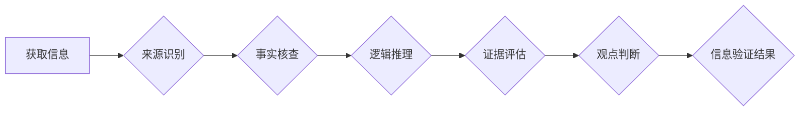

                 

## 信息验证和批判性思维教育：为假新闻和错误信息时代培养批判性思维者

> 关键词：信息验证、批判性思维、假新闻、错误信息、深度学习、自然语言处理、信息素养

### 1. 背景介绍

在当今信息爆炸的时代，我们每天都被来自互联网的庞大信息流所淹没。从新闻报道到社交媒体帖子，从学术论文到娱乐视频，信息无处不在，却并非都可靠可信。假新闻、谣言、错误信息等充斥网络，对个人、社会甚至国家安全构成严重威胁。面对这种信息环境，培养批判性思维能力显得尤为重要。

批判性思维是指能够系统地、理性的分析、评估和解释信息的能力。它不仅能帮助我们识别和过滤虚假信息，还能让我们更好地理解复杂问题，做出更明智的决策。然而，传统的教育模式往往侧重于知识传授，缺乏对批判性思维的培养。

### 2. 核心概念与联系

**2.1 信息验证**

信息验证是指通过多种途径和方法，对信息的真实性、准确性和可靠性进行核实的过程。它是一个多步骤的过程，包括：

* **来源识别:** 确定信息的来源，判断其信誉度和可信度。
* **事实核查:** 通过查阅其他可靠来源，验证信息的真实性。
* **逻辑推理:** 分析信息的逻辑结构，识别潜在的谬误或漏洞。
* **证据评估:** 评估信息的证据是否充分、可靠和相关。
* **观点判断:** 识别信息的作者立场和观点，判断其客观性或偏见。

**2.2 关键技术**

信息验证技术主要依赖于以下关键技术：

* **自然语言处理 (NLP):** 用于理解和分析文本信息，识别关键信息、情感倾向和潜在的虚假信息。
* **机器学习 (ML):** 用于训练模型识别虚假信息模式，例如网络传播路径、语言风格和内容特征。
* **深度学习 (DL):** 用于构建更复杂的模型，提高虚假信息识别精度。
* **知识图谱 (KG):** 用于存储和组织知识，帮助识别信息之间的关联性和矛盾性。

**2.3 流程图**



### 3. 核心算法原理 & 具体操作步骤

**3.1 算法原理概述**

信息验证算法通常基于机器学习和深度学习技术，通过训练模型识别虚假信息特征。常见的算法包括：

* **支持向量机 (SVM):** 用于分类，识别虚假信息和真实信息的边界。
* **随机森林 (RF):** 用于分类，通过多个决策树的投票结果进行预测。
* **深度神经网络 (DNN):** 用于提取文本特征，识别更复杂的虚假信息模式。

**3.2 算法步骤详解**

1. **数据收集:** 收集大量真实和虚假信息的文本数据，并进行标注，标记其真实性。
2. **数据预处理:** 对文本数据进行清洗、格式化和特征提取，例如去除停用词、词干化、词向量化等。
3. **模型训练:** 使用训练数据训练机器学习模型，例如 SVM、RF 或 DNN，使其能够识别虚假信息特征。
4. **模型评估:** 使用测试数据评估模型的性能，例如准确率、召回率和 F1 分数。
5. **模型部署:** 将训练好的模型部署到实际应用场景中，例如网站、应用程序或搜索引擎。

**3.3 算法优缺点**

* **优点:**

    * 自动化信息验证，提高效率。
    * 识别复杂模式，提高准确率。
    * 可持续学习，随着数据积累不断改进。

* **缺点:**

    * 依赖大量高质量数据，数据标注成本高。
    * 模型容易受到攻击，例如数据 poisoning。
    * 无法识别所有类型的虚假信息，例如隐性虚假信息。

**3.4 算法应用领域**

* **新闻媒体:** 验证新闻真实性，识别假新闻和谣言。
* **社交媒体:** 识别虚假信息和恶意内容，维护平台安全。
* **搜索引擎:** 排除虚假信息，提高搜索结果质量。
* **教育领域:** 培养学生批判性思维能力，识别虚假信息。

### 4. 数学模型和公式 & 详细讲解 & 举例说明

**4.1 数学模型构建**

信息验证算法通常使用概率模型来表示信息真实性的概率。例如，可以使用贝叶斯定理来计算给定特定特征的信息真实性概率。

**4.2 公式推导过程**

假设我们有一个信息 $I$，以及一个特征 $F$。我们想要计算信息 $I$ 真实性的概率 $P(I|F)$，可以使用贝叶斯定理：

$$P(I|F) = \frac{P(F|I)P(I)}{P(F)}$$

其中：

* $P(I|F)$ 是信息 $I$ 真实性给定特征 $F$ 的概率。
* $P(F|I)$ 是特征 $F$ 给定信息 $I$ 真实的概率。
* $P(I)$ 是信息 $I$ 真实的概率。
* $P(F)$ 是特征 $F$ 的概率。

**4.3 案例分析与讲解**

例如，假设我们有一个信息 $I$ 声称“地球是平的”，以及一个特征 $F$ 是“该信息来自一个不 reputable 的网站”。我们可以使用贝叶斯定理来计算信息 $I$ 真实性的概率。

* $P(I)$ 是地球是平的的概率，这是一个非常低的概率。
* $P(F|I)$ 是来自不 reputable 网站的信息是真实的概率，这是一个相对较高的概率。
* $P(F)$ 是来自不 reputable 网站的信息的概率，这是一个相对较高的概率。

根据贝叶斯定理，我们可以计算出信息 $I$ 真实性的概率 $P(I|F)$，由于 $P(I)$ 非常低，因此 $P(I|F)$ 也将非常低。

### 5. 项目实践：代码实例和详细解释说明

**5.1 开发环境搭建**

* Python 3.x
* TensorFlow 或 PyTorch 深度学习框架
* NLTK 自然语言处理库
* scikit-learn 机器学习库

**5.2 源代码详细实现**

```python
import tensorflow as tf

# 定义模型结构
model = tf.keras.models.Sequential([
    tf.keras.layers.Embedding(input_dim=vocab_size, output_dim=embedding_dim),
    tf.keras.layers.LSTM(units=128),
    tf.keras.layers.Dense(units=1, activation='sigmoid')
])

# 编译模型
model.compile(optimizer='adam', loss='binary_crossentropy', metrics=['accuracy'])

# 训练模型
model.fit(x_train, y_train, epochs=10, batch_size=32)

# 评估模型
loss, accuracy = model.evaluate(x_test, y_test)
print('Loss:', loss)
print('Accuracy:', accuracy)
```

**5.3 代码解读与分析**

* 该代码示例使用 TensorFlow 框架构建了一个深度神经网络模型，用于识别虚假信息。
* 模型结构包括嵌入层、LSTM 层和全连接层。
* 嵌入层将单词转换为向量表示。
* LSTM 层用于提取文本序列的上下文信息。
* 全连接层用于分类，输出虚假信息概率。
* 模型使用 Adam 优化器、二元交叉熵损失函数和精度指标进行训练。

**5.4 运行结果展示**

训练完成后，可以使用测试数据评估模型的性能，例如准确率、召回率和 F1 分数。

### 6. 实际应用场景

**6.1 新闻媒体**

* 自动识别假新闻和谣言，提高新闻真实性。
* 为新闻报道提供事实核查支持，增强新闻的可信度。
* 帮助用户识别虚假信息来源，提高信息辨别能力。

**6.2 社交媒体**

* 识别恶意内容，例如仇恨言论、虚假信息和网络欺凌。
* 过滤虚假信息传播，维护平台安全和用户体验。
* 为用户提供信息验证工具，帮助他们识别虚假信息。

**6.3 搜索引擎**

* 排除虚假信息结果，提高搜索结果质量。
* 为用户提供虚假信息识别提示，帮助他们辨别信息真伪。
* 鼓励用户使用可靠信息来源，提升信息素养。

**6.4 未来应用展望**

* 与人工智能技术结合，实现更智能的信息验证。
* 开发更易于使用的信息验证工具，普及信息素养。
* 建立信息验证标准和规范，促进信息生态健康发展。

### 7. 工具和资源推荐

**7.1 学习资源推荐**

* **书籍:**

    * 《信息验证：批判性思维的指南》
    * 《深度学习》
    * 《自然语言处理》

* **在线课程:**

    * Coursera: 自然语言处理
    * edX: 深度学习
    * Udacity: 机器学习工程师

**7.2 开发工具推荐**

* **TensorFlow:** 开源深度学习框架
* **PyTorch:** 开源深度学习框架
* **NLTK:** 自然语言处理库
* **spaCy:** 自然语言处理库

**7.3 相关论文推荐**

* **Detecting Fake News with Deep Learning**
* **BERT: Pre-training of Deep Bidirectional Transformers for Language Understanding**
* **XLNet: Generalized Autoregressive Pretraining for Language Understanding**

### 8. 总结：未来发展趋势与挑战

**8.1 研究成果总结**

信息验证技术取得了显著进展，能够识别多种类型的虚假信息，提高信息真实性。

**8.2 未来发展趋势**

* **更智能的信息验证:** 利用人工智能技术，实现更精准、更自动的信息验证。
* **跨语言信息验证:** 突破语言障碍，实现跨语言的信息验证。
* **多模态信息验证:** 结合文本、图像、音频等多模态信息，提高信息验证的准确性。

**8.3 面临的挑战**

* **数据质量问题:** 虚假信息生成技术不断发展，需要不断更新训练数据，保证数据质量。
* **模型可解释性问题:** 深度学习模型的决策过程难以理解，需要提高模型可解释性。
* **伦理问题:** 信息验证技术可能被滥用，需要关注其伦理问题，确保其公平公正地应用。

**8.4 研究展望**

未来，信息验证技术将继续发展，为构建更加透明、可靠的信息环境做出贡献。

### 9. 附录：常见问题与解答

**9.1 如何识别虚假信息？**

* 来源识别: 确定信息的来源，判断其信誉度和可信度。
* 事实核查: 通过查阅其他可靠来源，验证信息的真实性。
* 逻辑推理: 分析信息的逻辑结构，识别潜在的谬误或漏洞。
* 证据评估: 评估信息的证据是否充分、可靠和相关。
* 观点判断: 识别信息的作者立场和观点，判断其客观性或偏见。

**9.2 如何提高信息素养？**

* 培养批判性思维能力，学会质疑信息来源和内容。
* 了解信息验证技术，学会使用相关工具识别虚假信息。
* 多阅读可靠的新闻和学术资源，获取准确的信息。
* 谨慎传播信息，避免转发未经核实的信息。


作者：禅与计算机程序设计艺术 / Zen and the Art of Computer Programming 
<end_of_turn>

