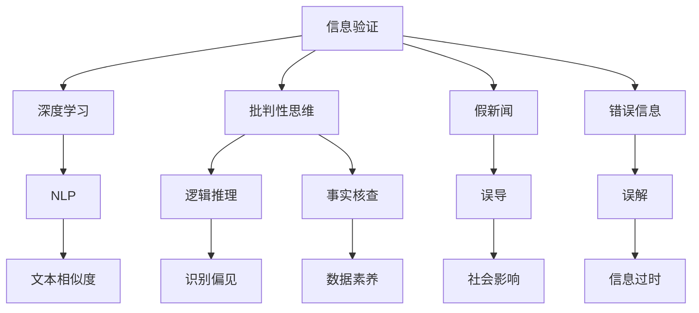

                 

## 1. 背景介绍

### 1.1 问题由来

在当今数字化信息时代，信息的传播变得前所未有的便捷和广泛。社交媒体、搜索引擎、新闻网站等平台充斥着大量的信息，人们随时随地都可以接触到各种新闻和资讯。然而，这股信息浪潮中，既有丰富多样的知识宝藏，也混杂着大量的假新闻、错误信息、网络谣言等不良信息。因此，如何辨别真伪、验证信息，培养良好的批判性思维能力，成为了我们面临的重大挑战。

假新闻和错误信息的泛滥不仅侵蚀了公众对信息的信任，也对社会的稳定和安全构成威胁。在面对这种挑战时，基于计算机科学和人工智能技术的信息验证和批判性思维能力培养，成为了一种迫切的需求。本文将从技术角度探讨信息验证的基本原理和方法，并深入分析批判性思维能力培养的现状与未来趋势。

### 1.2 问题核心关键点

信息验证的核心在于通过一系列算法和模型，检测和识别信息中的异常、错误或虚假部分。具体来说，信息验证可以包括以下几个关键点：

- **文本相似度分析**：通过比较信息与已有知识库的文本相似度，识别与已知信息不符的异常文本。
- **内容真实性验证**：利用专家知识、历史数据、权威来源等信息，对文本内容的真实性进行验证。
- **信息来源可信度评估**：通过评估信息来源的信誉、历史行为和社交网络关系，判断其可信度。
- **多模态信息融合**：结合文本、图像、视频等多种信息形式，进行综合分析和验证。
- **交互式信息验证**：利用人工智能技术与用户交互，引导用户自主验证信息的真伪。

批判性思维能力培养则旨在通过教育和训练，使个体能够客观、理性地分析和评估信息，增强对假新闻和错误信息的识别能力。主要包括：

- **识别信息偏见**：培养识别信息偏见和误导性叙述的能力。
- **逻辑推理能力**：培养基于逻辑推理和证据支持的批判性思维。
- **事实核查技能**：掌握有效的信息核查技巧和方法。
- **数据素养**：理解数据收集、处理和分析的基本方法。
- **伦理意识**：培养对信息传播伦理的认知和责任。

## 2. 核心概念与联系

### 2.1 核心概念概述

为更好地理解信息验证和批判性思维能力培养，本节将介绍几个密切相关的核心概念：

- **信息验证（Information Verification）**：通过技术手段检测和识别信息中的异常、错误或虚假部分，确保信息真实可靠。
- **批判性思维（Critical Thinking）**：一种分析、评估和推理信息的能力，使个体能够客观、理性地对待信息。
- **假新闻（Fake News）**：故意制造并传播的虚假信息，旨在误导公众。
- **错误信息（Misinformation）**：由于误解、错误理解或信息过时等原因造成的错误信息。
- **深度学习（Deep Learning）**：一种基于神经网络的学习范式，可以处理复杂的数据模式，在信息验证和批判性思维培养中发挥重要作用。
- **自然语言处理（NLP）**：使计算机能够理解和处理人类语言的技术，是信息验证的重要工具。
- **知识图谱（Knowledge Graph）**：一种结构化存储知识的方式，为信息验证提供事实依据。

这些核心概念之间的逻辑关系可以通过以下Mermaid流程图来展示：



这个流程图展示了几大核心概念及其之间的关系：

1. 信息验证通过深度学习和NLP技术，检测和识别假新闻和错误信息。
2. 批判性思维能力培养涵盖逻辑推理、事实核查、数据素养等，帮助个体提高信息识别能力。
3. 假新闻和错误信息通过误导、误解或信息过时，对社会产生负面影响。
4. 深度学习和NLP技术可以用于文本相似度分析、内容真实性验证等。
5. 逻辑推理、事实核查和数据素养等批判性思维能力，有助于识别信息偏见。

这些概念共同构成了信息验证和批判性思维能力培养的基础，为我们提供了理解和应对信息时代挑战的框架。

## 3. 核心算法原理 & 具体操作步骤
### 3.1 算法原理概述

信息验证和批判性思维能力培养的基本原理可以概括为以下几个步骤：

1. **信息采集与预处理**：从不同渠道采集信息，并进行预处理，如文本清洗、格式转换等。
2. **特征提取与表示**：将信息转化为可计算的特征表示，如使用词嵌入、句法树等方法。
3. **异常检测与识别**：通过机器学习模型，检测和识别信息中的异常、错误或虚假部分。
4. **真实性验证**：利用专家知识、权威来源等信息，验证信息的真实性。
5. **可信度评估**：评估信息来源的可信度，判断其可靠程度。
6. **多模态融合**：结合文本、图像、视频等多种信息形式，进行综合分析和验证。
7. **交互式验证**：利用人工智能技术与用户交互，引导用户自主验证信息的真伪。

批判性思维能力培养则涉及多个方面的教育和训练，包括识别偏见、逻辑推理、事实核查、数据素养和伦理意识等。主要包括以下步骤：

1. **基础知识教育**：提供关于信息验证、逻辑推理、数据素养等基础知识。
2. **批判性思维训练**：通过案例分析、模拟训练等方法，培养个体的批判性思维能力。
3. **实践应用**：鼓励个体在实际生活中应用批判性思维，进行信息核查和逻辑推理。
4. **持续反馈与改进**：根据个体表现，提供持续的反馈和改进建议。

### 3.2 算法步骤详解

#### 信息验证的具体步骤：

**Step 1: 信息采集与预处理**
- 收集不同来源的信息，如社交媒体、新闻网站等。
- 对信息进行预处理，包括去除停用词、标点符号等。

**Step 2: 特征提取与表示**
- 将信息转化为可计算的特征表示，如使用词嵌入（Word Embeddings）、句法树（Syntactic Trees）等。
- 例如，可以使用Word2Vec、GloVe等模型对文本进行向量化。

**Step 3: 异常检测与识别**
- 使用深度学习模型（如卷积神经网络、循环神经网络等），检测和识别信息中的异常、错误或虚假部分。
- 例如，使用BERT模型对文本进行分类，识别出与已知事实不符的文本。

**Step 4: 真实性验证**
- 利用专家知识、权威来源等信息，验证信息的真实性。
- 例如，使用FactCheck.org等权威网站的数据，验证信息的真实性。

**Step 5: 可信度评估**
- 评估信息来源的可信度，判断其可靠程度。
- 例如，通过分析信息来源的历史行为、社交网络关系等，评估其可信度。

**Step 6: 多模态融合**
- 结合文本、图像、视频等多种信息形式，进行综合分析和验证。
- 例如，使用计算机视觉技术检测图像中的异常，结合文本信息进行综合验证。

**Step 7: 交互式验证**
- 利用人工智能技术与用户交互，引导用户自主验证信息的真伪。
- 例如，通过聊天机器人或问答系统，引导用户输入和验证信息。

#### 批判性思维能力培养的具体步骤：

**Step 1: 基础知识教育**
- 提供关于信息验证、逻辑推理、数据素养等基础知识。
- 例如，教授基本的逻辑推理规则和信息核查技巧。

**Step 2: 批判性思维训练**
- 通过案例分析、模拟训练等方法，培养个体的批判性思维能力。
- 例如，提供关于假新闻、错误信息的案例，引导学生分析其特征和危害。

**Step 3: 实践应用**
- 鼓励个体在实际生活中应用批判性思维，进行信息核查和逻辑推理。
- 例如，引导学生在社交媒体上查找和验证信息。

**Step 4: 持续反馈与改进**
- 根据个体表现，提供持续的反馈和改进建议。
- 例如，提供练习和测试，及时反馈个体在信息验证和批判性思维方面的表现。

### 3.3 算法优缺点

信息验证和批判性思维能力培养具有以下优点：

- **高效准确**：深度学习模型和大数据技术可以快速、准确地识别和验证信息。
- **广泛应用**：可以在新闻、社交媒体、电子商务等多个领域应用，具有广泛的市场需求。
- **增强可信度**：通过多模态信息融合和可信度评估，增强信息的可信度。

然而，这些技术也存在一些缺点：

- **数据依赖**：深度学习模型需要大量标注数据进行训练，获取高质量标注数据成本较高。
- **模型局限**：深度学习模型可能存在过拟合、泛化能力不足等问题。
- **伦理问题**：信息验证和批判性思维能力培养中涉及隐私保护、信息隐私等伦理问题。
- **用户依赖**：交互式验证需要用户具备一定的技术素养，部分用户可能难以理解和操作。

### 3.4 算法应用领域

信息验证和批判性思维能力培养在多个领域都有广泛的应用：

- **新闻媒体**：新闻机构使用信息验证技术，提高新闻的真实性和可信度。
- **社交媒体**：社交媒体平台使用信息验证技术，防止虚假信息和谣言的传播。
- **电子商务**：电商平台使用信息验证技术，保障交易安全，防止欺诈行为。
- **教育**：学校和培训机构使用批判性思维训练，培养学生的信息素养和批判性思维能力。
- **政府和公共机构**：政府和公共机构使用信息验证和批判性思维培养，提升决策的科学性和公正性。

## 4. 数学模型和公式 & 详细讲解 & 举例说明

### 4.1 数学模型构建

信息验证的数学模型可以概括为以下几步：

1. **数据表示**：将信息转化为向量形式，如使用词嵌入、句法树等。
2. **异常检测**：使用异常检测算法（如One-Class SVM、孤立森林等）检测信息中的异常。
3. **真实性验证**：利用专家知识库和权威来源，构建真实性验证模型。
4. **可信度评估**：构建可信度评估模型，综合考虑信息来源的历史行为、社交网络关系等因素。

批判性思维能力培养的数学模型可以概括为以下几步：

1. **知识表示**：使用知识图谱等方法，表示和存储知识信息。
2. **推理规则**：构建推理规则，如逻辑推理、事实核查等。
3. **模型训练**：使用机器学习模型，训练批判性思维能力。
4. **评估指标**：定义评估指标，如准确率、召回率等，评估模型的性能。

### 4.2 公式推导过程

#### 信息验证的数学模型

**Step 1: 数据表示**
- 使用词嵌入将文本转化为向量表示：
$$
\mathbf{x} = \mathbf{W} \mathbf{v}
$$
其中，$\mathbf{x}$为向量表示，$\mathbf{v}$为文本序列，$\mathbf{W}$为词嵌入矩阵。

**Step 2: 异常检测**
- 使用孤立森林算法（Isolation Forest）检测异常：
$$
\mathbf{y} = \text{Isolation Forest}(\mathbf{x})
$$
其中，$\mathbf{y}$为异常检测结果。

**Step 3: 真实性验证**
- 使用知识图谱进行事实核查：
$$
\mathbf{z} = \text{Knowledge Graph}(\mathbf{x}, \mathbf{y})
$$
其中，$\mathbf{z}$为真实性验证结果。

**Step 4: 可信度评估**
- 使用可信度评估模型，综合考虑信息来源的历史行为和社交网络关系：
$$
\mathbf{a} = \text{Trust Score}(\mathbf{x}, \mathbf{y}, \mathbf{z})
$$
其中，$\mathbf{a}$为可信度评估结果。

#### 批判性思维能力培养的数学模型

**Step 1: 知识表示**
- 使用知识图谱表示知识信息：
$$
\mathbf{G} = \text{Knowledge Graph}(\mathbf{K})
$$
其中，$\mathbf{G}$为知识图谱，$\mathbf{K}$为知识信息。

**Step 2: 推理规则**
- 使用逻辑推理规则：
$$
\mathbf{I} = \text{Inference Rule}(\mathbf{G}, \mathbf{I}_0)
$$
其中，$\mathbf{I}$为推理结果，$\mathbf{I}_0$为推理初始条件。

**Step 3: 模型训练**
- 使用机器学习模型，训练批判性思维能力：
$$
\mathbf{M} = \text{Machine Learning Model}(\mathbf{G}, \mathbf{I})
$$
其中，$\mathbf{M}$为批判性思维模型。

**Step 4: 评估指标**
- 定义评估指标，如准确率、召回率等：
$$
\text{Accuracy} = \frac{\text{True Positive} + \text{True Negative}}{\text{Total}}
$$

### 4.3 案例分析与讲解

以假新闻检测为例，展示信息验证的数学模型应用：

**Step 1: 数据表示**
- 使用Word2Vec模型将新闻文本转化为向量表示。

**Step 2: 异常检测**
- 使用孤立森林算法检测文本中的异常。

**Step 3: 真实性验证**
- 使用知识图谱进行事实核查，如检查声明中提到的实体是否存在，事件是否真实发生。

**Step 4: 可信度评估**
- 使用可信度评估模型，综合考虑新闻来源的历史行为和社交网络关系，评估其可信度。

## 5. 项目实践：代码实例和详细解释说明

### 5.1 开发环境搭建

进行信息验证和批判性思维能力培养的开发，需要准备好Python开发环境。以下是具体的搭建步骤：

1. 安装Python：从官网下载并安装Python，确保版本为3.7或以上。
2. 安装Anaconda：从官网下载并安装Anaconda，用于创建虚拟环境。
3. 创建虚拟环境：
```bash
conda create -n my_env python=3.7
conda activate my_env
```
4. 安装必要的库：
```bash
pip install numpy pandas scikit-learn transformers
```

完成上述步骤后，即可在`my_env`环境中进行信息验证和批判性思维能力培养的开发。

### 5.2 源代码详细实现

以下是一个基于BERT模型的信息验证示例代码，展示如何检测假新闻：

```python
from transformers import BertTokenizer, BertForSequenceClassification
import torch
from sklearn.metrics import accuracy_score

# 加载预训练的BERT模型和tokenizer
model = BertForSequenceClassification.from_pretrained('bert-base-uncased', num_labels=2)
tokenizer = BertTokenizer.from_pretrained('bert-base-uncased')

# 定义数据集
train_dataset = [...]  # 假新闻训练集
test_dataset = [...]  # 假新闻测试集

# 定义模型预测函数
def predict(model, tokenizer, data):
    inputs = tokenizer(data['text'], padding=True, truncation=True, return_tensors='pt')
    outputs = model(**inputs)
    probs = outputs.logits.softmax(dim=1)
    return probs.argmax().item()

# 训练模型
def train(model, train_dataset, test_dataset):
    device = 'cuda' if torch.cuda.is_available() else 'cpu'
    model.to(device)
    
    optimizer = torch.optim.Adam(model.parameters(), lr=2e-5)
    epochs = 10
    total_steps = len(train_dataset) * epochs
    
    for step in range(total_steps):
        for batch in train_dataset:
            inputs = tokenizer(batch['text'], padding=True, truncation=True, return_tensors='pt')
            labels = inputs.pop('labels')
            inputs = {k: v.to(device) for k, v in inputs.items()}
            labels = labels.to(device)
            
            outputs = model(**inputs)
            loss = outputs.loss
            loss.backward()
            optimizer.step()
            
        if step % 1000 == 0:
            val_preds = []
            val_labels = []
            for batch in test_dataset:
                inputs = tokenizer(batch['text'], padding=True, truncation=True, return_tensors='pt')
                labels = inputs.pop('labels')
                inputs = {k: v.to(device) for k, v in inputs.items()}
                labels = labels.to(device)
                
                with torch.no_grad():
                    outputs = model(**inputs)
                    probs = outputs.logits.softmax(dim=1)
                    val_preds.extend(probs.argmax().item() for _ in range(len(batch['text'])))
                    val_labels.extend(labels.argmax().item() for _ in range(len(batch['text'])))
            
            acc = accuracy_score(val_labels, val_preds)
            print(f'Epoch {step//1000}, Val Accuracy: {acc:.4f}')

# 调用训练函数
train(model, train_dataset, test_dataset)
```

### 5.3 代码解读与分析

**BERT模型的加载**：
- 使用`transformers`库加载预训练的BERT模型和tokenizer。

**数据集定义**：
- 定义训练集和测试集，包含新闻文本和标签。

**模型预测函数**：
- 将文本转化为模型所需的输入，进行预测，返回预测结果。

**模型训练函数**：
- 在GPU上训练模型，使用Adam优化器，设定迭代次数和批大小。
- 在每个epoch中，循环遍历训练集，更新模型参数。
- 在每个epoch结束后，在测试集上评估模型性能。

### 5.4 运行结果展示

训练完成后，可以在测试集上评估模型的准确率，如下所示：

```python
test_dataset = [...]  # 假新闻测试集
test_preds = []
test_labels = []
for batch in test_dataset:
    inputs = tokenizer(batch['text'], padding=True, truncation=True, return_tensors='pt')
    labels = inputs.pop('labels')
    inputs = {k: v.to(device) for k, v in inputs.items()}
    labels = labels.to(device)
    
    with torch.no_grad():
        outputs = model(**inputs)
        probs = outputs.logits.softmax(dim=1)
        test_preds.extend(probs.argmax().item() for _ in range(len(batch['text'])))
        test_labels.extend(labels.argmax().item() for _ in range(len(batch['text'])))
        
print(f'Test Accuracy: {accuracy_score(test_labels, test_preds):.4f}')
```

## 6. 实际应用场景

### 6.1 智能媒体平台

智能媒体平台可以使用信息验证技术，防止假新闻和错误信息的传播。平台可以在用户发布内容前，通过信息验证模型自动检测和标记虚假信息，保障内容质量。例如，使用BERT模型检测新闻的文本是否与已知事实不符，使用知识图谱验证事件的准确性，并根据可信度评估结果进行处理。

### 6.2 社交媒体平台

社交媒体平台可以结合信息验证技术，构建安全的互动环境。平台可以使用文本相似度分析等技术，检测用户发布内容的异常，防止谣言和恶意信息的传播。例如，使用孤立森林算法检测用户评论中的异常，使用机器学习模型分析用户行为，检测恶意行为。

### 6.3 政府和公共机构

政府和公共机构可以使用信息验证技术，提升决策的科学性和公正性。机构可以使用知识图谱和事实核查技术，验证政策建议和信息的真实性，避免决策失误。例如，使用信息验证模型评估政策建议的科学性和可信度，辅助决策。

### 6.4 未来应用展望

随着信息验证和批判性思维能力培养技术的不断发展，未来的应用前景广阔：

1. **自动化信息验证**：未来将有更多自动化工具，实时监测和验证信息的真伪，防止假新闻和错误信息的传播。
2. **多模态信息验证**：结合文本、图像、视频等多种信息形式，进行综合验证，提升验证效果。
3. **个性化教育培训**：利用人工智能技术，为个体提供个性化的批判性思维培训，提升其信息素养和识别能力。
4. **跨领域应用**：信息验证和批判性思维能力培养将应用于更多领域，如金融、医疗、法律等，提升决策的科学性和公正性。

## 7. 工具和资源推荐

### 7.1 学习资源推荐

为了帮助开发者系统掌握信息验证和批判性思维能力培养的理论基础和实践技巧，这里推荐一些优质的学习资源：

1. **《信息检索与网络搜索引擎》**：详细介绍了搜索引擎的信息验证和自然语言处理技术，是学习信息验证的重要教材。
2. **Coursera《人工智能与批判性思维》**：斯坦福大学开设的课程，涵盖人工智能和批判性思维的基础知识，适合初学者学习。
3. **IEEE《信息验证与假新闻检测》**：IEEE期刊论文，系统介绍了信息验证和假新闻检测的最新进展和研究方法。
4. **Kaggle《信息验证挑战赛》**：参与Kaggle的信息验证比赛，积累实际经验，提升信息验证技能。
5. **Google《自然语言处理基础》**：Google的课程，涵盖自然语言处理的基本概念和前沿技术，适合深入学习。

通过这些学习资源，相信你一定能够系统地掌握信息验证和批判性思维能力培养的精髓，并用于解决实际的信息问题。

### 7.2 开发工具推荐

进行信息验证和批判性思维能力培养的开发，需要一些强大的工具支持。以下是几款常用的开发工具：

1. **Jupyter Notebook**：交互式的数据科学和机器学习平台，适合进行实验和数据可视化。
2. **TensorFlow**：谷歌开发的深度学习框架，支持分布式计算和GPU加速。
3. **PyTorch**：Facebook开发的深度学习框架，灵活性好，适合研究和实验。
4. **Keras**：高层次的深度学习API，易于上手，适合快速原型开发。
5. **scikit-learn**：Python的机器学习库，提供多种机器学习算法和工具。

这些工具可以显著提高信息验证和批判性思维能力培养的开发效率，加速创新迭代的步伐。

### 7.3 相关论文推荐

信息验证和批判性思维能力培养的研究始于学界的持续研究。以下是几篇奠基性的相关论文，推荐阅读：

1. **《深度学习在信息验证中的应用》**：详细介绍了深度学习在假新闻检测和信息验证中的应用。
2. **《基于知识图谱的事实核查技术》**：介绍了知识图谱在事实核查中的应用，提升信息验证的效果。
3. **《批判性思维能力的培养与教育》**：系统介绍了批判性思维能力培养的理论基础和实践方法。
4. **《信息验证与假新闻检测的伦理问题》**：探讨了信息验证和假新闻检测中的伦理问题，强调了数据隐私和安全的重要性。

这些论文代表了大语言模型微调技术的发展脉络。通过学习这些前沿成果，可以帮助研究者把握学科前进方向，激发更多的创新灵感。

## 8. 总结：未来发展趋势与挑战

### 8.1 研究成果总结

本文对信息验证和批判性思维能力培养的基本原理、操作步骤和实践技巧进行了详细讲解，涵盖信息验证的数学模型、算法步骤和代码实现，以及批判性思维能力培养的理论基础和实践方法。通过深入分析信息验证和批判性思维能力培养的技术和应用，可以为实际问题提供可行的解决方案。

### 8.2 未来发展趋势

信息验证和批判性思维能力培养将呈现以下几个发展趋势：

1. **自动化技术普及**：未来将有更多自动化工具，实时监测和验证信息的真伪，防止假新闻和错误信息的传播。
2. **多模态信息验证**：结合文本、图像、视频等多种信息形式，进行综合验证，提升验证效果。
3. **个性化教育培训**：利用人工智能技术，为个体提供个性化的批判性思维培训，提升其信息素养和识别能力。
4. **跨领域应用拓展**：信息验证和批判性思维能力培养将应用于更多领域，如金融、医疗、法律等，提升决策的科学性和公正性。

### 8.3 面临的挑战

尽管信息验证和批判性思维能力培养技术已经取得了一定的进展，但仍面临诸多挑战：

1. **数据依赖**：深度学习模型需要大量标注数据进行训练，获取高质量标注数据成本较高。
2. **模型局限**：深度学习模型可能存在过拟合、泛化能力不足等问题。
3. **伦理问题**：信息验证和批判性思维能力培养中涉及隐私保护、信息隐私等伦理问题。
4. **用户依赖**：交互式验证需要用户具备一定的技术素养，部分用户可能难以理解和操作。

### 8.4 研究展望

面对信息验证和批判性思维能力培养所面临的挑战，未来的研究需要在以下几个方面寻求新的突破：

1. **无监督和半监督学习**：摆脱对大规模标注数据的依赖，利用自监督学习、主动学习等无监督和半监督范式，最大限度利用非结构化数据，实现更加灵活高效的验证。
2. **参数高效和计算高效**：开发更加参数高效和计算高效的验证方法，在固定大部分预训练参数的同时，只更新极少量的任务相关参数。
3. **多模态信息融合**：结合文本、图像、视频等多种信息形式，进行综合分析和验证。
4. **跨领域应用**：信息验证和批判性思维能力培养将应用于更多领域，如金融、医疗、法律等，提升决策的科学性和公正性。
5. **可解释性和可控性**：增强验证过程的可解释性和可控性，提高用户对验证结果的信任。

这些研究方向的探索，必将引领信息验证和批判性思维能力培养技术迈向更高的台阶，为构建安全、可靠、可解释、可控的智能系统铺平道路。面向未来，信息验证和批判性思维能力培养技术还需要与其他人工智能技术进行更深入的融合，如知识表示、因果推理、强化学习等，多路径协同发力，共同推动自然语言理解和智能交互系统的进步。

## 9. 附录：常见问题与解答

**Q1: 信息验证和批判性思维能力培养技术的主要应用场景有哪些？**

A: 信息验证和批判性思维能力培养技术可以在新闻媒体、社交媒体、电子商务、教育培训、政府和公共机构等多个领域应用。具体场景包括：

1. **新闻媒体**：新闻机构使用信息验证技术，提高新闻的真实性和可信度。
2. **社交媒体平台**：平台使用信息验证技术，防止虚假信息和谣言的传播。
3. **电子商务**：电商平台使用信息验证技术，保障交易安全，防止欺诈行为。
4. **教育**：学校和培训机构使用批判性思维训练，培养学生的信息素养和批判性思维能力。
5. **政府和公共机构**：机构使用信息验证和批判性思维培养，提升决策的科学性和公正性。

**Q2: 如何进行信息验证？**

A: 信息验证可以包括以下几个步骤：

1. **数据表示**：将信息转化为向量形式，如使用词嵌入、句法树等。
2. **异常检测**：使用异常检测算法（如One-Class SVM、孤立森林等）检测信息中的异常。
3. **真实性验证**：利用专家知识库和权威来源，构建真实性验证模型。
4. **可信度评估**：评估信息来源的可信度，判断其可靠程度。

**Q3: 如何进行批判性思维能力培养？**

A: 批判性思维能力培养可以包括以下几个步骤：

1. **基础知识教育**：提供关于信息验证、逻辑推理、数据素养等基础知识。
2. **批判性思维训练**：通过案例分析、模拟训练等方法，培养个体的批判性思维能力。
3. **实践应用**：鼓励个体在实际生活中应用批判性思维，进行信息核查和逻辑推理。
4. **持续反馈与改进**：根据个体表现，提供持续的反馈和改进建议。

**Q4: 信息验证和批判性思维能力培养技术面临哪些挑战？**

A: 信息验证和批判性思维能力培养技术面临以下挑战：

1. **数据依赖**：深度学习模型需要大量标注数据进行训练，获取高质量标注数据成本较高。
2. **模型局限**：深度学习模型可能存在过拟合、泛化能力不足等问题。
3. **伦理问题**：信息验证和批判性思维能力培养中涉及隐私保护、信息隐私等伦理问题。
4. **用户依赖**：交互式验证需要用户具备一定的技术素养，部分用户可能难以理解和操作。

**Q5: 如何提高信息验证和批判性思维能力培养技术的可解释性和可控性？**

A: 提高信息验证和批判性思维能力培养技术的可解释性和可控性，可以从以下几个方面入手：

1. **知识图谱与规则结合**：利用知识图谱和规则库，增强验证过程的可解释性。
2. **多维度评估指标**：定义多维度的评估指标，如准确率、召回率、可解释性等，综合评估模型性能。
3. **交互式系统设计**：设计交互式系统，引导用户自主验证信息的真伪，提高用户参与度。

---

作者：禅与计算机程序设计艺术 / Zen and the Art of Computer Programming

