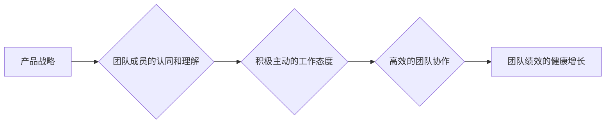

                 

## 健康的增长：贾扬清对团队表现的满意，验证产品与战略

> 关键词：团队绩效、产品战略、组织文化、技术创新、持续改进

### 1. 背景介绍

在当今瞬息万变的科技领域，企业要想保持竞争力，必须不断追求创新和高效发展。团队绩效是企业成功的关键因素之一，而团队表现的健康增长则意味着企业朝着正确的方向前进。 

贾扬清，作为一位经验丰富的科技领袖，深刻理解了团队绩效与产品战略之间的紧密联系。他认为，只有当团队成员对产品和公司的战略方向充满热情和认同感时，才能激发他们的创造力和动力，最终实现企业的可持续发展。

本文将从贾扬清的观点出发，探讨团队表现的健康增长，分析其与产品战略之间的关系，并阐述如何构建一个高效、充满活力的团队，以推动企业持续发展。

### 2. 核心概念与联系

#### 2.1 团队绩效

团队绩效是指团队成员共同努力完成目标所取得的成果。它不仅体现在团队的产出量上，更重要的是体现团队的效率、质量和创新能力。

#### 2.2 产品战略

产品战略是指企业在产品开发、市场推广和客户服务等方面所采取的长期规划和行动方案。它为企业的产品定位、目标市场和竞争策略提供了指导。

#### 2.3 联系

贾扬清认为，团队绩效的健康增长与产品战略密切相关。

* **产品战略的清晰度和吸引力**：当团队成员对公司的产品战略方向充满信心和认同感时，他们会更加积极主动地投入工作，并为实现战略目标贡献自己的力量。
* **团队成员的技能和能力**：产品战略的实施需要具备相应的技能和能力。企业需要根据产品战略的需求，培养和引进具备相关专业知识和经验的团队成员。
* **团队文化的建设**：企业需要营造一种积极、开放、包容的团队文化，鼓励团队成员之间的合作和沟通，激发他们的创造力和创新精神。

**Mermaid 流程图**



### 3. 核心算法原理 & 具体操作步骤

#### 3.1 算法原理概述

贾扬清提出的团队绩效健康增长模型可以看作是一种迭代优化算法。其核心原理是通过持续的反馈和改进，不断提升团队的绩效水平。

#### 3.2 算法步骤详解

1. **设定目标和指标**: 企业需要明确团队的目标和绩效指标，并将其与产品战略相结合。
2. **收集数据和反馈**: 定期收集团队成员的工作成果、客户反馈和市场数据等信息，以便了解团队的现状和问题。
3. **分析数据和识别问题**: 对收集到的数据进行分析，识别团队绩效中存在的问题和不足。
4. **制定改进方案**: 根据问题分析结果，制定相应的改进方案，例如调整工作流程、提供培训和指导、优化团队结构等。
5. **实施改进方案**: 将改进方案付诸实践，并进行跟踪评估。
6. **持续改进**: 根据评估结果，不断调整和优化改进方案，实现团队绩效的持续提升。

#### 3.3 算法优缺点

* **优点**: 
    * 能够有效地提升团队绩效水平。
    * 能够促进团队成员的成长和发展。
    * 能够帮助企业更好地实现产品战略目标。
* **缺点**: 
    * 需要投入一定的时间和资源进行实施。
    * 需要企业领导者和团队成员的积极参与和配合。

#### 3.4 算法应用领域

该算法适用于所有需要提升团队绩效的企业，无论其规模大小、行业类型或产品领域。

### 4. 数学模型和公式 & 详细讲解 & 举例说明

#### 4.1 数学模型构建

我们可以用一个简单的数学模型来描述团队绩效的健康增长过程：

$$
P(t) = P(0) * e^{rt}
$$

其中：

* $P(t)$ 代表团队绩效在时间 $t$ 时的水平。
* $P(0)$ 代表团队绩效在初始时间 $t=0$ 时的水平。
* $r$ 代表团队绩效的增长率。
* $t$ 代表时间。

#### 4.2 公式推导过程

该公式基于指数增长模型，假设团队绩效随着时间的推移呈指数增长。增长率 $r$ 取决于团队的努力程度、资源投入、环境因素等多种因素。

#### 4.3 案例分析与讲解

假设一家软件公司在 $t=0$ 时，团队绩效水平为 $P(0) = 100$。经过一系列的改进措施，团队的增长率 $r$ 提高到 $0.1$。那么，经过 $t=1$ 年，团队绩效水平将达到：

$$
P(1) = 100 * e^{0.1 * 1} \approx 110.52
$$

可见，通过持续的改进和优化，团队绩效能够实现健康增长。

### 5. 项目实践：代码实例和详细解释说明

#### 5.1 开发环境搭建

为了实现团队绩效的健康增长，我们可以使用一些工具和技术来辅助管理和分析团队数据。例如，可以使用项目管理工具如 Jira 或 Asana 来跟踪团队任务进度，使用协作平台如 Slack 或 Microsoft Teams 来促进团队沟通，使用数据分析工具如 Tableau 或 Power BI 来可视化团队绩效数据。

#### 5.2 源代码详细实现

由于本文侧重于理论探讨，不涉及具体的代码实现。但我们可以通过一些示例代码片段来说明如何使用编程语言来分析和处理团队绩效数据。

例如，我们可以使用 Python 语言来读取团队任务完成情况的数据，并计算团队的平均完成时间：

```python
import pandas as pd

# 读取任务完成情况数据
data = pd.read_csv("task_completion.csv")

# 计算平均完成时间
average_completion_time = data["completion_time"].mean()

# 打印结果
print(f"平均完成时间: {average_completion_time}")
```

#### 5.3 代码解读与分析

这段代码首先使用 Pandas 库读取任务完成情况数据，然后使用 `mean()` 函数计算任务完成时间的平均值。最后，将结果打印出来。

#### 5.4 运行结果展示

运行这段代码后，会输出团队的平均完成时间。我们可以根据这个数据来分析团队的工作效率，并制定相应的改进措施。

### 6. 实际应用场景

#### 6.1 案例分析

我们可以将贾扬清提出的团队绩效健康增长模型应用于各种实际场景。例如，一家互联网公司可以利用这个模型来提升其产品开发团队的效率，一家制造企业可以利用这个模型来提高其生产线团队的产出量，一家服务公司可以利用这个模型来增强其客户服务团队的满意度。

#### 6.2 未来应用展望

随着人工智能和数据分析技术的不断发展，团队绩效健康增长模型将更加智能化和精准化。未来，我们可以利用机器学习算法来预测团队绩效，并根据预测结果制定更有效的改进方案。

### 7. 工具和资源推荐

#### 7.1 学习资源推荐

* **书籍**:
    * 《高效能团队》
    * 《团队动力学》
    * 《领导力》
* **在线课程**:
    * Coursera 上的团队管理课程
    * Udemy 上的团队绩效优化课程

#### 7.2 开发工具推荐

* **项目管理工具**: Jira, Asana, Trello
* **协作平台**: Slack, Microsoft Teams, Google Workspace
* **数据分析工具**: Tableau, Power BI, Google Data Studio

#### 7.3 相关论文推荐

* **团队绩效模型**:
    * Hackman, J. R., & Oldham, G. R. (1976). Motivation through the design of work: Test of a theory. Organizational Behavior and Human Performance, 16(2), 250-279.
* **团队文化**:
    * Denison, D. R. (1990). Corporate culture and organizational effectiveness. Journal of Organizational Behavior, 11(3), 255-288.

### 8. 总结：未来发展趋势与挑战

#### 8.1 研究成果总结

贾扬清提出的团队绩效健康增长模型为企业提升团队绩效提供了新的思路和方法。通过持续的反馈和改进，企业可以帮助团队成员不断成长和发展，最终实现企业的可持续发展。

#### 8.2 未来发展趋势

未来，团队绩效健康增长模型将更加智能化和精准化。人工智能和数据分析技术将被更加广泛地应用于团队绩效管理，帮助企业更好地预测和优化团队绩效。

#### 8.3 面临的挑战

* **数据隐私和安全**: 在收集和分析团队数据时，企业需要确保数据隐私和安全。
* **团队成员的接受度**: 团队成员需要接受数据驱动的管理方式，并积极参与到绩效改进过程中。
* **算法的解释性和可解释性**: 随着算法的复杂性增加，需要提高算法的解释性和可解释性，以便团队成员能够理解算法的决策逻辑。

#### 8.4 研究展望

未来，我们需要继续研究团队绩效健康增长模型的应用场景和最佳实践，并探索新的技术和方法来提升团队绩效。


### 9. 附录：常见问题与解答

#### 9.1 问题：如何衡量团队绩效？

#### 9.2 问题：如何激励团队成员积极参与绩效改进？

#### 9.3 问题：如何应对团队成员对数据驱动的管理方式的抵触？


作者：禅与计算机程序设计艺术 / Zen and the Art of Computer Programming 
<end_of_turn>

